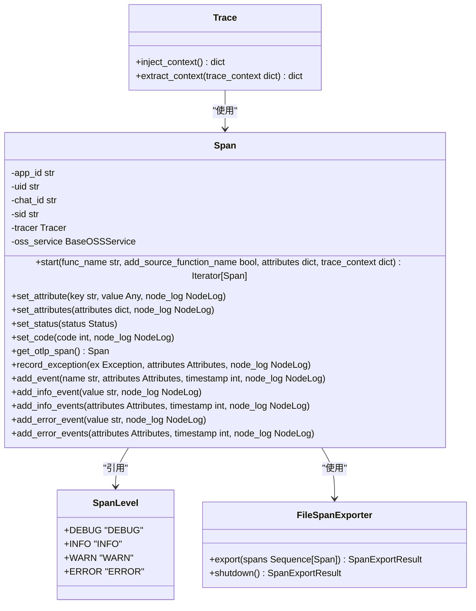
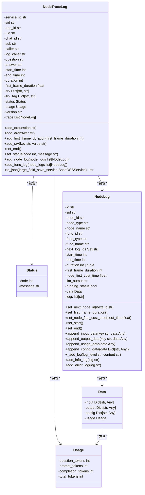
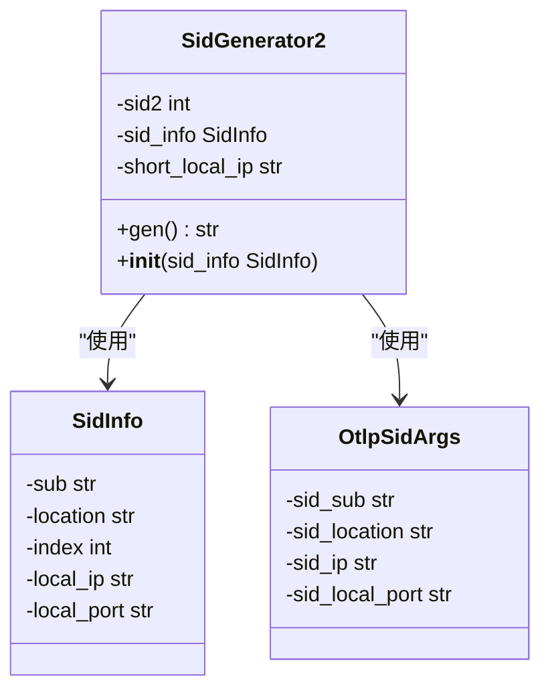
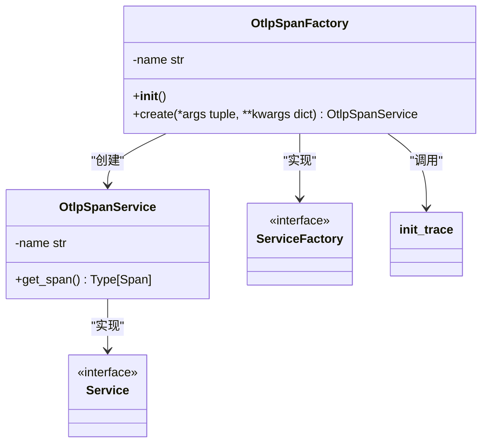
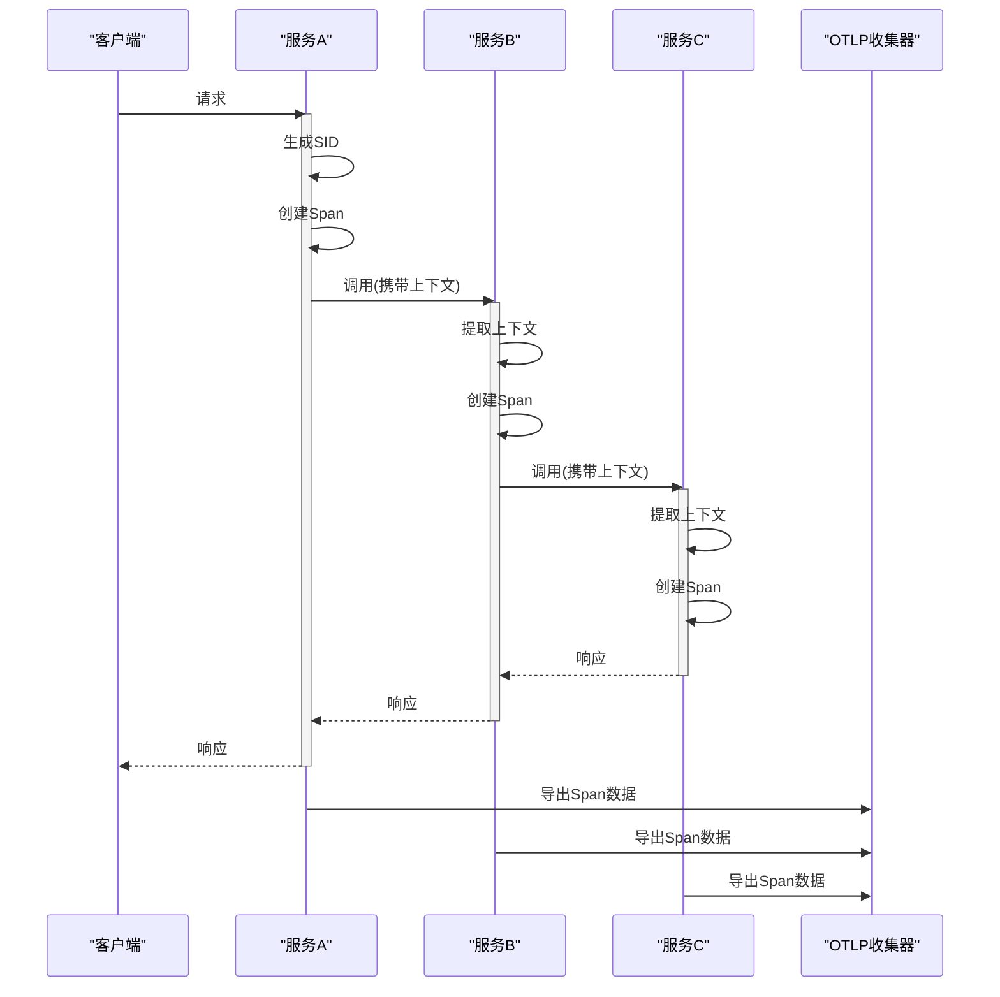
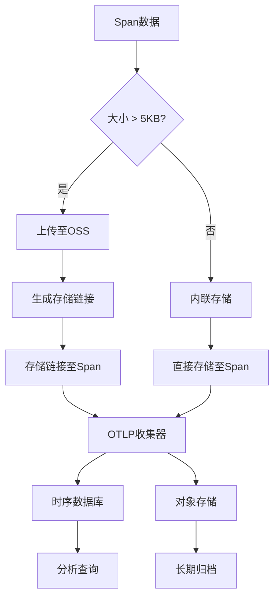
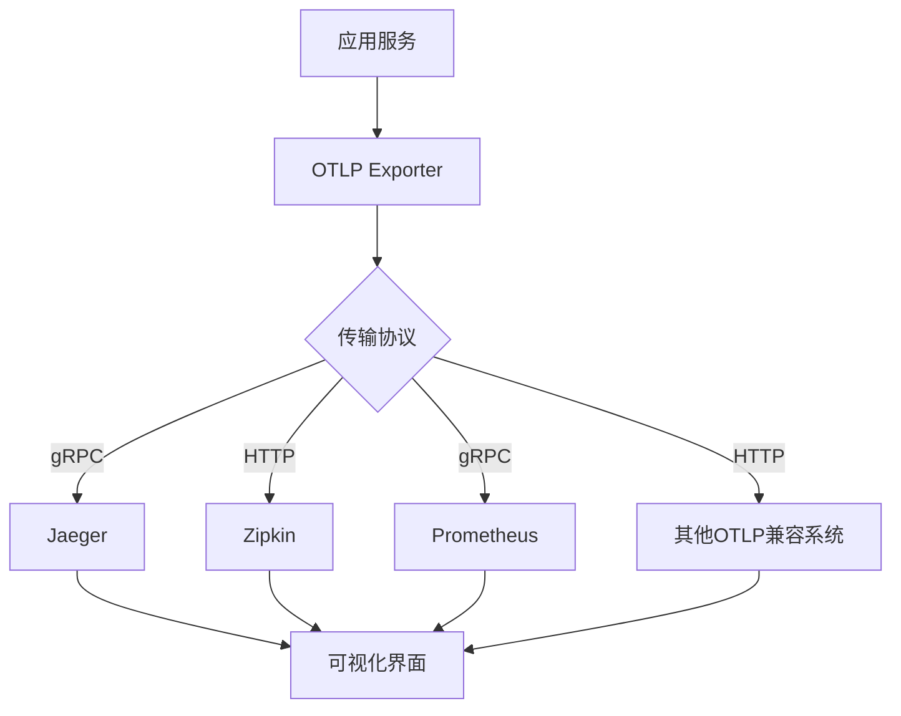

# 分布式追踪

<cite>
**本文档引用的文件**
- [trace.py](file://core/common/otlp/trace/trace.py)
- [node_trace_log.py](file://core/common/otlp/log_trace/node_trace_log.py)
- [sid.py](file://core/common/otlp/sid.py)
- [span.py](file://core/common/otlp/trace/span.py)
- [span_service.py](file://core/common/service/otlp/span/span_service.py)
- [factory.py](file://core/common/service/otlp/span/factory.py)
- [node_log.py](file://core/common/otlp/log_trace/node_log.py)
- [ip.py](file://core/common/otlp/ip.py)
</cite>

## 目录
1. [引言](#引言)
2. [Trace类设计与上下文传播](#trace类设计与上下文传播)
3. [节点执行日志记录机制](#节点执行日志记录机制)
4. [会话ID生成与请求链路追踪](#会话id生成与请求链路追踪)
5. [OpenTelemetry协议封装](#opentelemetry协议封装)
6. [调用链路示意图](#调用链路示意图)
7. [性能影响评估](#性能影响评估)
8. [数据存储策略](#数据存储策略)
9. [主流监控系统集成](#主流监控系统集成)
10. [结论](#结论)

## 引言

本技术文档详细阐述了astron-agent项目中分布式追踪系统的实现机制。该系统基于OpenTelemetry标准构建，提供了完整的端到端追踪能力，涵盖上下文传播、采样策略、跨度管理、节点级日志记录以及与主流监控系统的集成。系统通过统一的API封装，为各微服务提供一致的追踪数据上报接口，实现了跨服务的请求链路追踪和性能分析。

## Trace类设计与上下文传播

`Trace`类是分布式追踪系统的核心组件，负责实现上下文传播、采样策略和跨度管理功能。该类的设计遵循OpenTelemetry规范，确保了与标准生态系统的兼容性。

**图示来源**
- [trace.py](file://core/common/otlp/trace/trace.py#L1-L127)
- [span.py](file://core/common/otlp/trace/span.py#L1-L277)

`Trace`类提供了两个静态方法：`inject_context`和`extract_context`，用于实现分布式环境下的上下文传播。`inject_context`方法将当前追踪上下文注入到字典中，以便通过网络传输；`extract_context`方法则从接收到的上下文中提取追踪信息，恢复调用链路。

系统通过`init_trace`函数初始化追踪提供者，配置了批量跨度处理器（BatchSpanProcessor）和OTLP跨度导出器（OTLPSpanExporter），实现了高效的数据导出机制。同时，系统还配置了文件跨度导出器，用于在本地记录追踪数据，便于调试和分析。

**本节来源**
- [trace.py](file://core/common/otlp/trace/trace.py#L1-L127)

## 节点执行日志记录机制

`node_trace_log.py`文件实现了节点级别的执行日志记录功能，通过`NodeTraceLog`类收集和管理节点执行过程中的各种信息。

**图示来源**
- [node_trace_log.py](file://core/common/otlp/log_trace/node_trace_log.py#L1-L128)
- [node_log.py](file://core/common/otlp/log_trace/node_log.py#L1-L158)
- [base.py](file://core/common/otlp/log_trace/base.py#L1-L9)

`NodeTraceLog`类作为节点追踪日志的容器，收集了服务ID、会话ID、应用ID、用户ID等关键标识信息，以及请求的开始时间、结束时间、持续时间等性能指标。通过`add_node_log`方法，可以将多个`NodeLog`对象添加到追踪日志中，形成完整的调用链路。

当字段值超过5KB时，系统会自动将大字段内容上传到对象存储服务（OSS），并在日志中保留指向存储位置的链接，有效控制了日志大小，避免了内存溢出问题。

**本节来源**
- [node_trace_log.py](file://core/common/otlp/log_trace/node_trace_log.py#L1-L128)
- [node_log.py](file://core/common/otlp/log_trace/node_log.py#L1-L158)

## 会话ID生成与请求链路追踪

`sid.py`文件实现了会话ID（SID）的生成机制，为请求链路追踪提供了唯一标识。

**图示来源**
- [sid.py](file://core/common/otlp/sid.py#L1-L51)
- [sid.py](file://core/common/otlp/args/sid.py#L1-L12)

会话ID生成器`SidGenerator2`基于服务子系统标识（sub）、进程ID、索引号、时间戳、IP地址和端口号等信息生成全局唯一的会话ID。生成的SID格式为：`{sub}{pid:04x}{index:04x}@{location}{tm[-11:]}{short_local_ip}{port[:2]}{sid2}`，确保了在分布式环境下的唯一性和可追溯性。

通过`init_sid`函数初始化SID生成器，系统可以为每个请求生成唯一的会话ID，从而实现跨服务的请求链路追踪。会话ID在整个调用链路中传递，使得各个服务节点能够关联到同一个请求，形成完整的调用轨迹。

**本节来源**
- [sid.py](file://core/common/otlp/sid.py#L1-L51)
- [args/sid.py](file://core/common/otlp/args/sid.py#L1-L12)

## OpenTelemetry协议封装

`span_service.py`和`factory.py`文件实现了对OpenTelemetry协议的封装，为各微服务提供了统一的API接口。

**图示来源**
- [span_service.py](file://core/common/service/otlp/span/span_service.py#L1-L13)
- [factory.py](file://core/common/service/otlp/span/factory.py#L1-L53)

`OtlpSpanService`类作为OpenTelemetry跨度服务的封装，提供了获取`Span`类的方法。`OtlpSpanFactory`工厂类负责创建和初始化跨度服务实例，在创建过程中调用`init_otlp_span`函数完成OTLP追踪的初始化配置。

通过环境变量配置OTLP端点、服务名称、位置等参数，系统实现了灵活的配置管理。`init_otlp_span`函数读取环境变量，设置追踪参数，并调用`init_trace`函数完成追踪系统的初始化。

**本节来源**
- [span_service.py](file://core/common/service/otlp/span/span_service.py#L1-L13)
- [factory.py](file://core/common/service/otlp/span/factory.py#L1-L53)

## 调用链路示意图

**图示来源**
- [trace.py](file://core/common/otlp/trace/trace.py#L1-L127)
- [span.py](file://core/common/otlp/trace/span.py#L1-L277)
- [node_trace_log.py](file://core/common/otlp/log_trace/node_trace_log.py#L1-L128)

调用链路示意图展示了分布式系统中请求的完整流转过程。客户端发起请求后，入口服务生成唯一的会话ID（SID），并创建根跨度（Root Span）。在跨服务调用时，追踪上下文通过HTTP头或消息属性传递，下游服务提取上下文并创建子跨度，形成父子关系的调用树。

每个服务节点在处理请求时，通过`Span`类记录关键操作的开始和结束时间、属性信息、事件和异常等数据。当请求处理完成后，各服务节点将收集的跨度数据异步导出到OTLP收集器，由收集器统一处理和存储。

## 性能影响评估

分布式追踪系统对应用性能的影响主要体现在以下几个方面：

| 影响因素 | 描述 | 优化措施 |
|--------|------|---------|
| 内存开销 | 每个Span对象需要内存存储 | 限制每个追踪器的最大Span数量（默认1000） |
| CPU开销 | 上下文序列化/反序列化 | 使用高效的序列化格式（Protobuf） |
| 网络开销 | 追踪数据传输 | 批量导出、压缩传输 |
| I/O开销 | 日志文件写入 | 异步批量写入、文件滚动 |
| 延迟影响 | 跨服务调用上下文传递 | 最小化上下文大小、使用轻量级传输 |

系统通过多种机制优化性能影响：
- **批量处理**：使用`BatchSpanProcessor`批量导出Span数据，减少网络请求次数
- **异步导出**：Span数据导出在后台线程中进行，不影响主业务逻辑
- **内存控制**：限制Span队列大小和批处理大小，防止内存溢出
- **超时控制**：设置导出超时时间，避免阻塞主流程
- **本地日志**：在无法连接OTLP收集器时，将数据写入本地文件，保证数据不丢失

**本节来源**
- [trace.py](file://core/common/otlp/trace/trace.py#L1-L127)
- [factory.py](file://core/common/service/otlp/span/factory.py#L1-L53)

## 数据存储策略

系统采用了分层的数据存储策略，根据数据大小和重要性采取不同的存储方式：

**图示来源**
- [node_trace_log.py](file://core/common/otlp/log_trace/node_trace_log.py#L1-L128)
- [span.py](file://core/common/otlp/trace/span.py#L1-L277)

对于小于5KB的数据，系统直接将其存储在Span对象中，随追踪数据一起传输。对于大于5KB的大字段数据，系统将其上传至对象存储服务（OSS），并在Span中存储指向OSS的链接。这种策略有效控制了追踪数据的大小，避免了网络传输瓶颈和内存压力。

OTLP收集器接收到追踪数据后，将其存储到时序数据库中，支持高效的查询和分析。同时，系统也支持将原始数据归档到对象存储中，用于长期保存和大数据分析。

## 主流监控系统集成

本系统通过OTLP协议与主流监控系统无缝集成，支持Jaeger、Zipkin等多种后端存储。

**图示来源**
- [trace.py](file://core/common/otlp/trace/trace.py#L1-L127)
- [factory.py](file://core/common/service/otlp/span/factory.py#L1-L53)

系统使用`opentelemetry-exporter-otlp-proto-grpc`和`opentelemetry-exporter-otlp-proto-http`作为导出器，支持通过gRPC或HTTP协议将追踪数据发送到OTLP兼容的收集器。Jaeger和Zipkin都支持OTLP协议，可以直接接收和处理来自本系统的追踪数据。

通过配置`OTLP_ENDPOINT`环境变量，可以指定不同的收集器地址，实现与不同监控系统的集成。系统还支持同时配置多个导出器，将数据发送到多个目的地，满足不同的监控需求。

## 结论

本分布式追踪系统基于OpenTelemetry标准构建，提供了完整的端到端追踪能力。系统通过精心设计的Trace类实现了上下文传播和跨度管理，通过节点级日志记录机制收集了详细的执行信息，通过会话ID生成机制实现了跨服务的请求链路追踪。

系统对OpenTelemetry协议进行了封装，提供了统一的API接口，简化了各微服务的集成工作。通过批量处理、异步导出等优化措施，有效控制了对应用性能的影响。分层的数据存储策略确保了系统的可扩展性和可靠性。

与主流监控系统的无缝集成使得追踪数据可以被各种分析工具消费，为系统性能优化、故障排查和业务分析提供了有力支持。整体架构设计合理，具有良好的可维护性和扩展性，能够满足大规模分布式系统的监控需求。