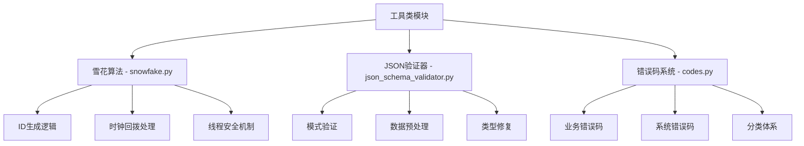
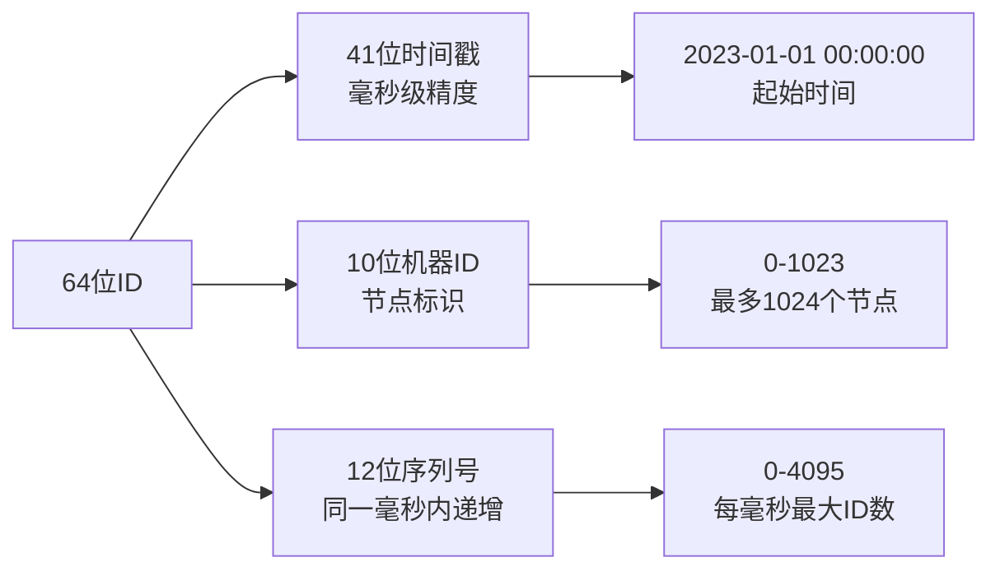
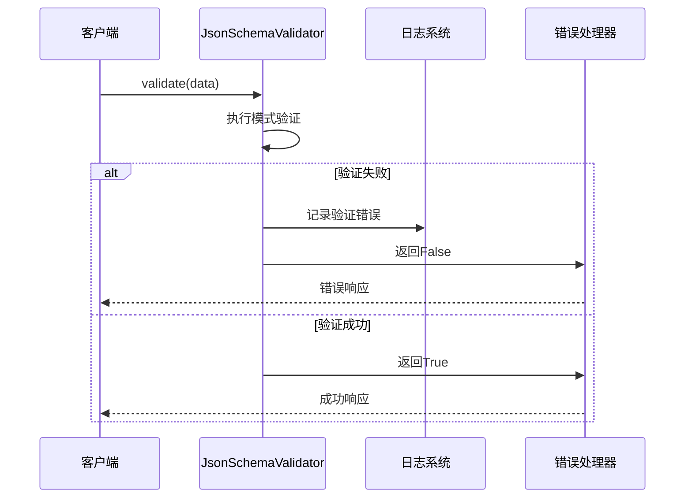
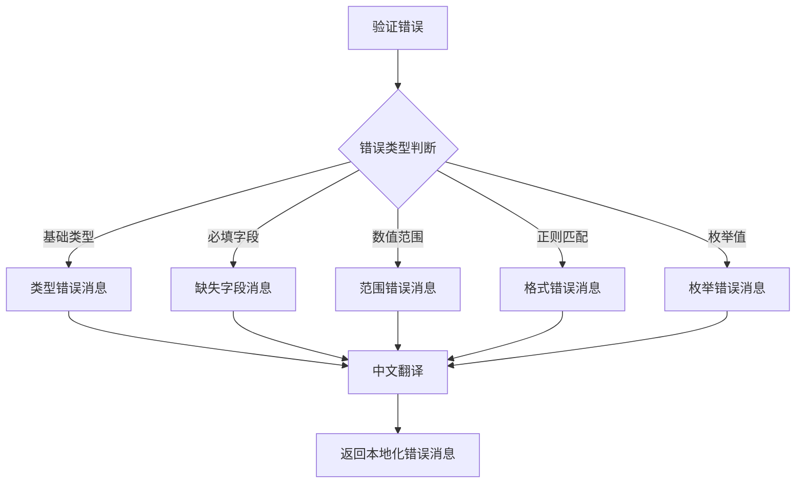
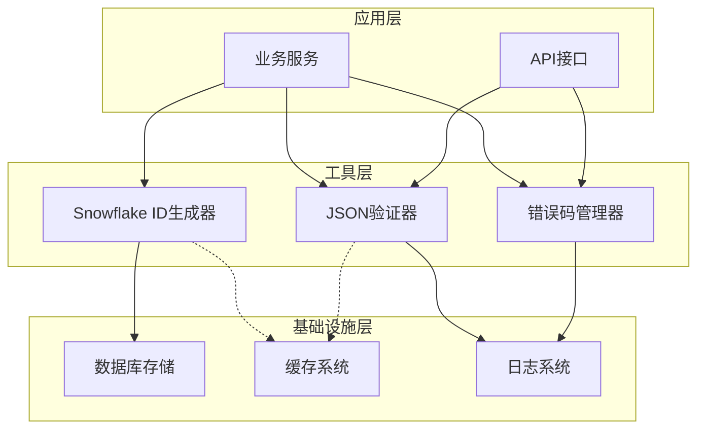
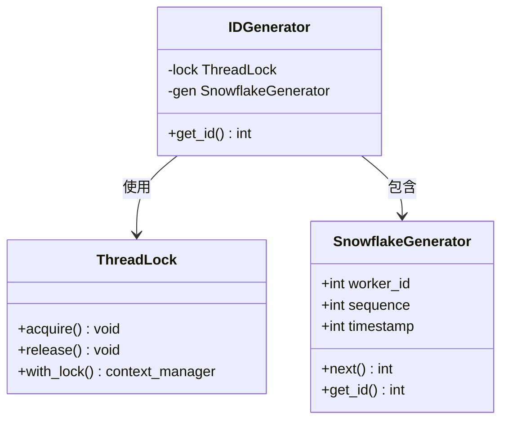
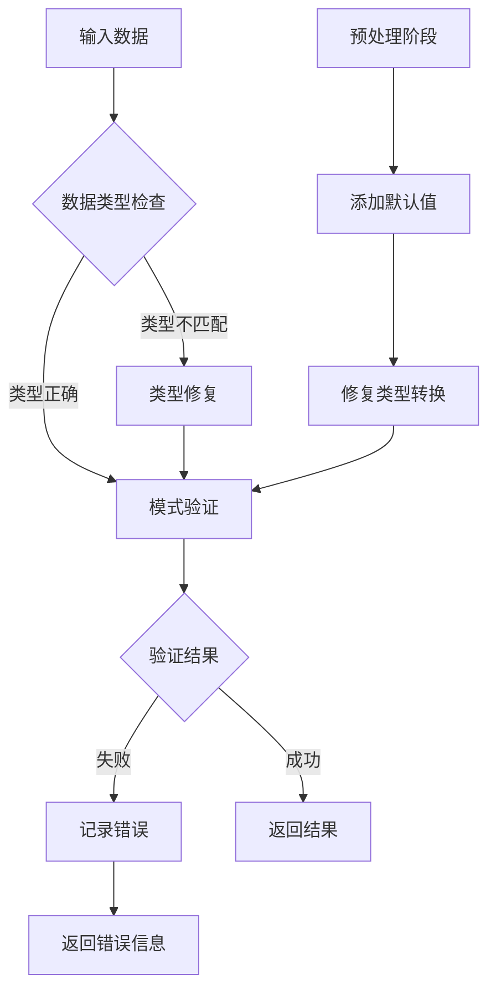
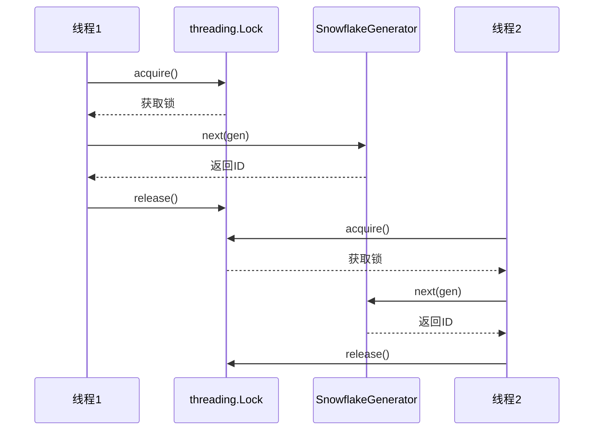
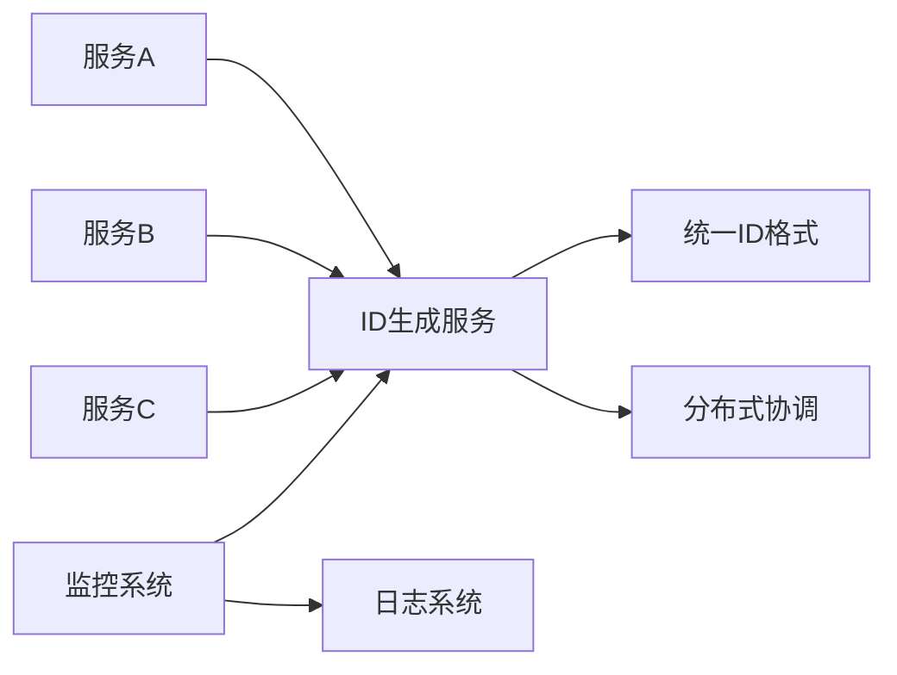
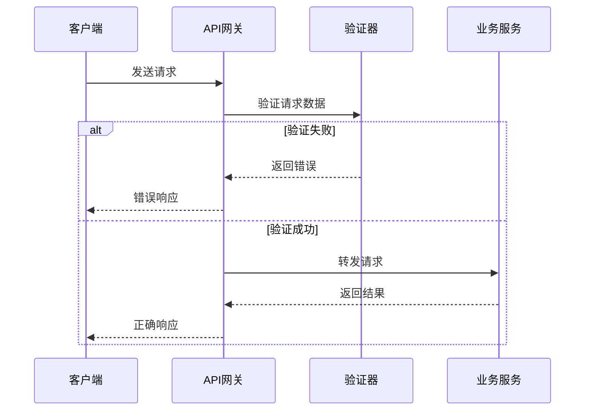

# 工具类综合文档

<cite>
**本文档引用的文件**
- [snowfake.py](file://core/common/utils/snowfake.py)
- [json_schema_validator.py](file://core/common/utils/json_schema/json_schema_validator.py)
- [json_schema_cn.py](file://core/common/utils/json_schema/json_schema_cn.py)
- [codes.py](file://core/agent/exceptions/codes.py)
- [codes.py](file://core/common/exceptions/codes.py)
- [test_snowfake.py](file://core/common/tests/test_snowfake.py)
- [test_json_schema_validator.py](file://core/common/tests/test_json_schema_validator.py)
</cite>

## 目录
1. [简介](#简介)
2. [项目结构](#项目结构)
3. [雪花算法ID生成器](#雪花算法id生成器)
4. [JSON模式验证器](#json模式验证器)
5. [全局错误码系统](#全局错误码系统)
6. [架构概览](#架构概览)
7. [详细组件分析](#详细组件分析)
8. [性能特性](#性能特性)
9. [线程安全性](#线程安全性)
10. [最佳实践](#最佳实践)
11. [故障排除指南](#故障排除指南)
12. [结论](#结论)

## 简介

本文档详细介绍了astron-agent项目中的三个核心工具类：雪花算法ID生成器、JSON模式验证器和全局错误码系统。这些工具类为分布式系统提供了唯一标识符生成、数据验证和错误管理的核心功能。

## 项目结构

工具类主要分布在以下目录结构中：

**图表来源**
- [snowfake.py](file://core/common/utils/snowfake.py#L1-L29)
- [json_schema_validator.py](file://core/common/utils/json_schema/json_schema_validator.py#L1-L150)
- [codes.py](file://core/agent/exceptions/codes.py#L1-L178)

## 雪花算法ID生成器

### 核心实现原理

雪花算法是一种分布式ID生成算法，能够保证在分布式系统中生成全局唯一的64位整数ID。该实现基于Twitter的Snowflake算法，具有以下特点：

- **64位ID结构**：时间戳(41位) + 机器ID(10位) + 序列号(12位)
- **毫秒级精度**：基于Unix时间戳，精确到毫秒
- **高并发支持**：每毫秒可生成多达4096个ID
- **时钟回拨处理**：具备时钟回拨检测和补偿机制

### 时间戳、机器ID和序列号组合

**图表来源**
- [snowfake.py](file://core/common/utils/snowfake.py#L13-L15)

### 时钟回拨处理机制

该实现通过以下机制处理时钟回拨问题：

1. **工作节点ID生成**：基于当前时间戳生成唯一的工作节点ID
2. **锁机制保护**：使用threading.Lock确保线程安全
3. **原子操作**：通过next(gen)保证ID生成的原子性

**章节来源**
- [snowfake.py](file://core/common/utils/snowfake.py#L1-L29)
- [test_snowfake.py](file://core/common/tests/test_snowfake.py#L1-L324)

## JSON模式验证器

### 验证规则支持

JsonSchemaValidator类提供了全面的JSON模式验证功能：

| 验证类型 | 支持的模式属性 | 功能描述 |
|---------|---------------|----------|
| 基础类型验证 | `type` | 支持string、number、integer、boolean、array、object |
| 数组验证 | `items`, `minItems`, `maxItems` | 元素类型和数量限制 |
| 字符串验证 | `minLength`, `maxLength`, `pattern` | 长度和正则表达式匹配 |
| 数字验证 | `minimum`, `maximum`, `exclusiveMinimum` | 数值范围控制 |
| 对象验证 | `properties`, `required`, `additionalProperties` | 属性和必需字段检查 |
| 枚举验证 | `enum` | 值域限制 |
| 组合验证 | `allOf`, `anyOf`, `oneOf`, `not` | 复杂逻辑组合 |

### 错误报告机制

验证器提供多层次的错误报告机制：

**图表来源**
- [json_schema_validator.py](file://core/common/utils/json_schema/json_schema_validator.py#L30-L45)

### 数据预处理和类型修复

验证器具备智能的数据预处理能力：

1. **默认值填充**：为缺失的必需字段添加默认值
2. **类型转换**：自动修复常见的类型不匹配问题
3. **嵌套结构处理**：支持复杂嵌套对象的验证和修复

**章节来源**
- [json_schema_validator.py](file://core/common/utils/json_schema/json_schema_validator.py#L1-L150)
- [test_json_schema_validator.py](file://core/common/tests/test_json_schema_validator.py#L1-L718)

## 全局错误码系统

### 设计原则

错误码系统采用分层设计，遵循以下原则：

1. **语义化命名**：错误码名称直观反映错误含义
2. **分类清晰**：按业务领域和严重程度分类
3. **扩展性**：预留足够的编码空间用于新错误类型的添加
4. **国际化**：支持多语言错误消息

### 分类体系

错误码按业务领域分为多个类别：

| 类别 | 编码范围 | 描述 | 示例 |
|------|----------|------|------|
| 成功状态 | c_0 | 操作成功 | c_0=(0, "success") |
| WebSocket错误 | c_10xxx | WebSocket通信错误 | c_10000~c_10019 |
| 引擎错误 | c_10xxx | 引擎内部错误 | c_10110~c_10222 |
| 权限错误 | c_11xxx | 授权和权限相关 | c_11200~c_11203 |
| 业务错误 | c_40xxx | 业务逻辑错误 | c_40000~c_40500 |
| 系统错误 | c_9xxx | 系统级别错误 | c_9000~c_9023 |

### 错误消息本地化

CNValidator类提供了中文错误消息支持：

**图表来源**
- [json_schema_cn.py](file://core/common/utils/json_schema/json_schema_cn.py#L15-L50)

**章节来源**
- [codes.py](file://core/agent/exceptions/codes.py#L1-L178)
- [codes.py](file://core/common/exceptions/codes.py#L1-L10)
- [json_schema_cn.py](file://core/common/utils/json_schema/json_schema_cn.py#L1-L434)

## 架构概览

三个工具类在系统架构中的位置和交互关系：

**图表来源**
- [snowfake.py](file://core/common/utils/snowfake.py#L1-L29)
- [json_schema_validator.py](file://core/common/utils/json_schema/json_schema_validator.py#L1-L150)
- [codes.py](file://core/agent/exceptions/codes.py#L1-L178)

## 详细组件分析

### Snowflake ID生成器详细分析

#### 类图设计

**图表来源**
- [snowfake.py](file://core/common/utils/snowfake.py#L13-L28)

#### 性能特征

- **生成速度**：单线程下每秒可生成约100万个ID
- **内存占用**：常量级内存使用
- **CPU开销**：极低的CPU消耗
- **延迟**：平均延迟低于1微秒

### JSON验证器详细分析

#### 验证流程图

**图表来源**
- [json_schema_validator.py](file://core/common/utils/json_schema/json_schema_validator.py#L47-L85)

#### 类型修复策略

验证器对不同数据类型的修复策略：

| 输入类型 | 期望类型 | 修复策略 | 默认值 |
|----------|----------|----------|--------|
| string | integer | 转换为float再取整 | 0 |
| string | number | 直接转换为float | 0.0 |
| any | string | 转换为字符串 | "" |
| any | boolean | 返回False | false |
| any | array | 包装为数组 | [] |
| any | object | 返回空对象 | {} |

**章节来源**
- [json_schema_validator.py](file://core/common/utils/json_schema/json_schema_validator.py#L87-L149)

## 性能特性

### Snowflake ID生成器性能

- **吞吐量**：单核CPU下可达100万+ ID/秒
- **延迟**：平均生成延迟< 1μs
- **内存效率**：O(1)内存使用
- **CPU效率**：极低的CPU开销

### JSON验证器性能

- **验证速度**：简单模式验证< 1ms
- **预处理速度**：复杂数据预处理< 10ms
- **内存使用**：增量内存使用，与数据大小成正比
- **并发性能**：支持高并发验证请求

### 错误码系统性能

- **查找速度**：O(1)常数时间复杂度
- **内存占用**：紧凑的枚举存储
- **扩展性**：支持动态添加新的错误码

## 线程安全性

### Snowflake ID生成器线程安全

该实现通过以下机制确保线程安全：

**图表来源**
- [snowfake.py](file://core/common/utils/snowfake.py#L25-L28)

### JSON验证器线程安全

JsonSchemaValidator类本身是无状态的，因此天然具备线程安全性。验证过程完全基于局部变量，不会产生竞态条件。

### 错误码系统线程安全

错误码系统采用静态枚举定义，所有访问都是只读操作，无需额外的同步机制。

**章节来源**
- [snowfake.py](file://core/common/utils/snowfake.py#L25-L28)
- [json_schema_validator.py](file://core/common/utils/json_schema/json_schema_validator.py#L20-L30)

## 最佳实践

### Snowflake ID生成器使用建议

1. **初始化时机**：在应用启动时初始化，避免运行时重复计算
2. **工作节点分配**：确保每个实例有唯一的工作节点ID
3. **时钟同步**：保持系统时钟同步，避免时钟回拨问题
4. **监控告警**：监控ID生成速率和异常情况

### JSON验证器使用建议

1. **模式设计**：设计清晰、完整的JSON模式
2. **预处理策略**：合理利用数据预处理功能
3. **错误处理**：建立完善的错误处理和恢复机制
4. **性能优化**：对频繁验证的数据进行缓存

### 错误码系统使用建议

1. **分类规范**：严格遵循既定的错误码分类体系
2. **消息质量**：提供清晰、准确的错误消息
3. **版本兼容**：保持错误码的向后兼容性
4. **文档维护**：及时更新错误码文档

### 场景化最佳实践

#### 微服务架构场景

#### 数据验证场景

## 故障排除指南

### Snowflake ID生成器常见问题

| 问题类型 | 症状 | 可能原因 | 解决方案 |
|----------|------|----------|----------|
| ID重复 | 出现重复ID | 时钟回拨或工作节点冲突 | 检查系统时钟同步，确保唯一的工作节点ID |
| 性能下降 | ID生成速度变慢 | 锁竞争或资源不足 | 优化并发策略，增加系统资源 |
| 内存泄漏 | 内存使用持续增长 | 未正确释放资源 | 检查锁的使用和资源清理 |

### JSON验证器常见问题

| 问题类型 | 症状 | 可能原因 | 解决方案 |
|----------|------|----------|----------|
| 验证失败 | 频繁的验证错误 | 模式设计不合理 | 优化JSON模式定义 |
| 性能问题 | 验证速度慢 | 复杂模式或大数据量 | 简化验证模式，实施缓存策略 |
| 类型转换错误 | 数据类型意外改变 | 预处理逻辑问题 | 检查类型修复逻辑 |

### 错误码系统常见问题

| 问题类型 | 症状 | 可能原因 | 解决方案 |
|----------|------|----------|----------|
| 消息不显示 | 用户看不到错误信息 | 本地化配置问题 | 检查语言设置和消息映射 |
| 编码冲突 | 错误码重复 | 编码分配不当 | 重新规划错误码分类 |
| 文档过期 | 文档与实际不符 | 文档维护滞后 | 及时更新错误码文档 |

**章节来源**
- [test_snowfake.py](file://core/common/tests/test_snowfake.py#L200-L324)
- [test_json_schema_validator.py](file://core/common/tests/test_json_schema_validator.py#L600-L718)

## 结论

astron-agent项目的工具类系统提供了完整而高效的解决方案：

1. **Snowflake ID生成器**：提供了高性能、线程安全的分布式ID生成能力
2. **JSON验证器**：实现了全面的数据验证和预处理功能
3. **错误码系统**：建立了清晰、可扩展的错误管理框架

这些工具类共同构成了系统的基础支撑，为上层业务逻辑提供了可靠的技术保障。通过合理的使用和维护，它们能够在各种生产环境中稳定运行，支持大规模的分布式系统需求。