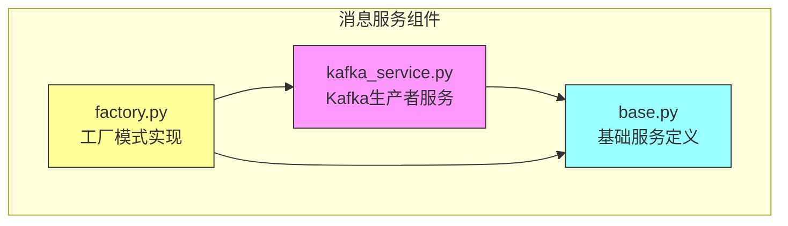
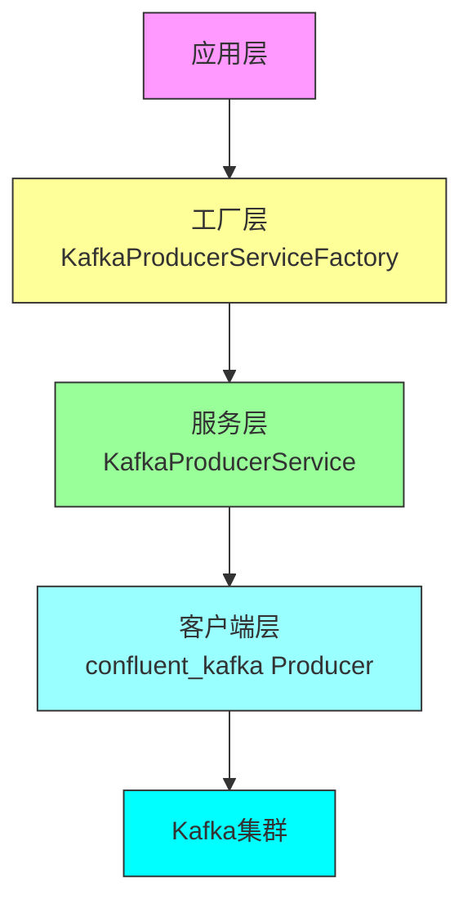
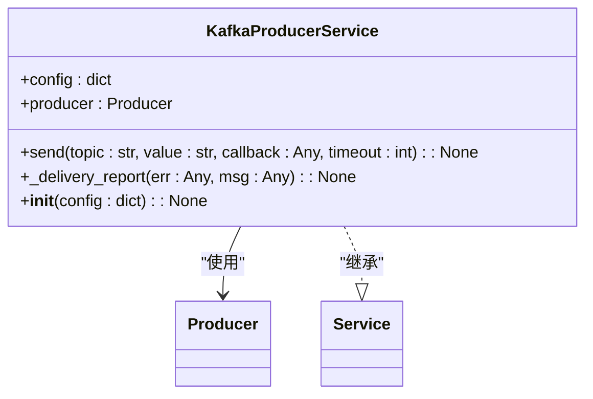
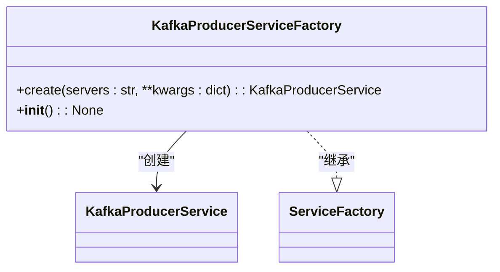
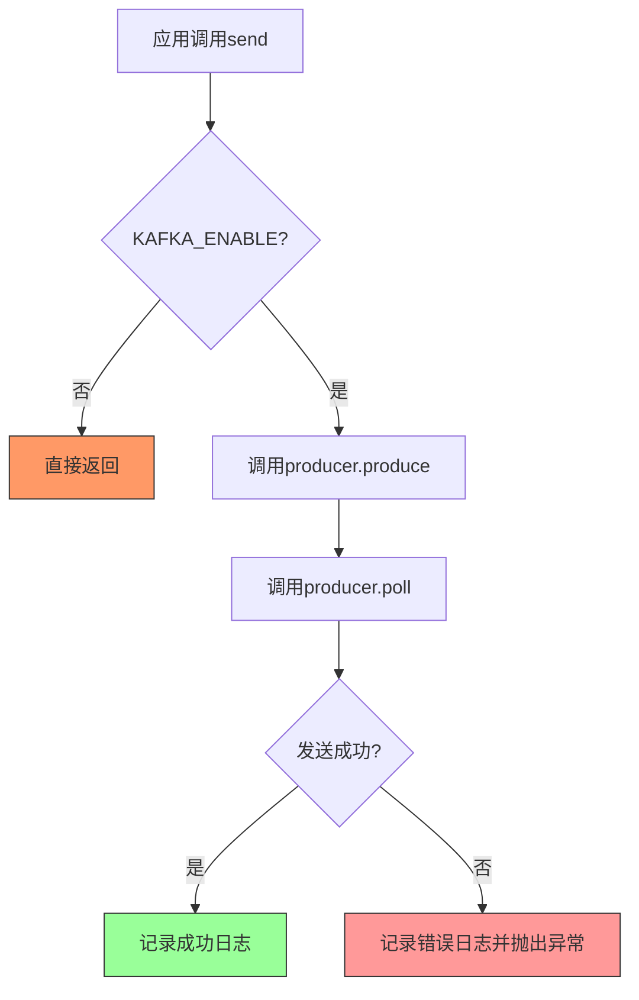
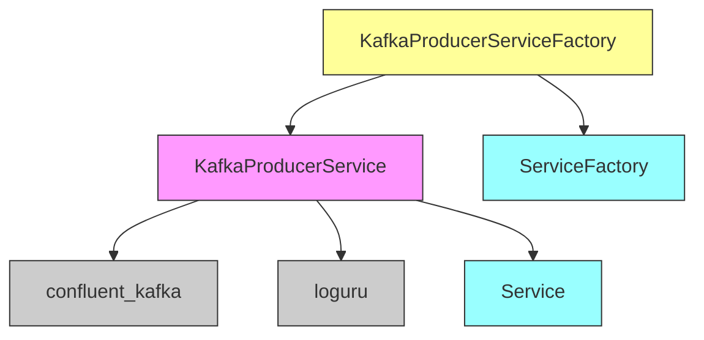

# 消息服务

<cite>
**本文档引用的文件**
- [kafka_service.py](file://core/common/service/kafka/kafka_service.py)
- [factory.py](file://core/common/service/kafka/factory.py)
- [base.py](file://core/common/service/base.py)
</cite>

## 目录
1. [简介](#简介)
2. [项目结构](#项目结构)
3. [核心组件](#核心组件)
4. [架构概述](#架构概述)
5. [详细组件分析](#详细组件分析)
6. [依赖分析](#依赖分析)
7. [性能考虑](#性能考虑)
8. [故障排除指南](#故障排除指南)
9. [结论](#结论)

## 简介
本技术文档详细阐述了astron-agent项目中消息服务的设计与实现。文档重点分析了基于Kafka的消息中间件封装，包括生产者服务的实现、工厂模式的设计以及消息可靠性保证机制。通过深入解析核心组件，本文档为开发者提供了对消息服务架构的全面理解，涵盖了从配置加载到实际消息发送的完整流程。

## 项目结构
消息服务相关组件位于core/common/service/kafka目录下，采用模块化设计，与其他服务组件保持一致的架构风格。该服务通过工厂模式实现，与系统的配置管理、日志服务等基础设施紧密集成。

**图表来源**
- [kafka_service.py](file://core/common/service/kafka/kafka_service.py)
- [factory.py](file://core/common/service/kafka/factory.py)
- [base.py](file://core/common/service/base.py)

**章节来源**
- [kafka_service.py](file://core/common/service/kafka/kafka_service.py)
- [factory.py](file://core/common/service/kafka/factory.py)

## 核心组件
消息服务的核心组件包括Kafka生产者服务(KafkaProducerService)和相应的工厂类(KafkaProducerServiceFactory)。生产者服务封装了Kafka消息发送的核心逻辑，包括序列化、错误处理和回调机制。工厂类则负责根据配置创建生产者实例，实现了配置与实例化的分离。服务基类(Service)和工厂基类(ServiceFactory)提供了统一的接口规范，确保了服务组件的一致性和可扩展性。

**章节来源**
- [kafka_service.py](file://core/common/service/kafka/kafka_service.py#L1-L67)
- [factory.py](file://core/common/service/kafka/factory.py#L1-L30)
- [base.py](file://core/common/service/base.py#L1-L71)

## 架构概述
消息服务采用分层架构设计，上层为工厂模式，中层为服务实现，底层为第三方Kafka客户端库。这种设计实现了关注点分离，工厂层负责配置解析和实例创建，服务层负责业务逻辑封装，底层库负责与Kafka集群的通信。服务通过环境变量进行配置，支持动态启用/禁用，确保了在不同部署环境下的灵活性。

**图表来源**
- [kafka_service.py](file://core/common/service/kafka/kafka_service.py)
- [factory.py](file://core/common/service/kafka/factory.py)

## 详细组件分析

### Kafka生产者服务分析
Kafka生产者服务是消息发送的核心实现，封装了消息序列化、发送和错误处理等关键功能。服务通过配置字典初始化，支持各种Kafka生产者参数的灵活配置。

#### 服务类分析

**图表来源**
- [kafka_service.py](file://core/common/service/kafka/kafka_service.py#L1-L67)

### 工厂模式分析
消息服务工厂实现了创建者模式，负责Kafka生产者服务实例的创建和配置管理。工厂通过环境变量获取Kafka服务器地址，实现了配置的外部化。

#### 工厂类分析

**图表来源**
- [factory.py](file://core/common/service/kafka/factory.py#L1-L30)

### 消息可靠性保证
消息服务通过多种机制确保消息的可靠传递。首先，服务检查KAFKA_ENABLE环境变量，允许在开发或测试环境中禁用Kafka功能。其次，发送操作包含错误处理和日志记录，任何异常都会被捕获并记录。最后，生产者配置了消息发送回调，可以监控每条消息的投递状态。

**图表来源**
- [kafka_service.py](file://core/common/service/kafka/kafka_service.py#L1-L67)

**章节来源**
- [kafka_service.py](file://core/common/service/kafka/kafka_service.py#L1-L67)

## 依赖分析
消息服务依赖于多个核心组件和第三方库。主要依赖包括confluent_kafka库用于Kafka通信，loguru用于日志记录，以及系统基础服务类。通过工厂模式，服务实现了与具体实现的解耦，提高了代码的可测试性和可维护性。

**图表来源**
- [kafka_service.py](file://core/common/service/kafka/kafka_service.py)
- [factory.py](file://core/common/service/kafka/factory.py)
- [base.py](file://core/common/service/base.py)

**章节来源**
- [kafka_service.py](file://core/common/service/kafka/kafka_service.py)
- [factory.py](file://core/common/service/kafka/factory.py)

## 性能考虑
消息服务在设计时考虑了性能优化。生产者实例被设计为长生命周期对象，避免了频繁创建和销毁的开销。消息发送采用异步模式，通过poll调用实现非阻塞等待。配置参数如批量大小、压缩类型等可以通过工厂方法灵活设置，以适应不同的性能需求。此外，服务提供了超时配置，防止消息发送操作无限期阻塞。

## 故障排除指南
当消息服务出现问题时，应首先检查环境变量配置是否正确，特别是KAFKA_SERVERS和KAFKA_ENABLE。查看日志输出可以确定消息发送是否成功，以及失败的具体原因。对于连接问题，需要确认Kafka集群的网络可达性和认证配置。在开发环境中，可以通过设置KAFKA_ENABLE=false来临时禁用消息发送功能，便于调试其他组件。

**章节来源**
- [kafka_service.py](file://core/common/service/kafka/kafka_service.py#L1-L67)
- [factory.py](file://core/common/service/kafka/factory.py#L1-L30)

## 结论
astron-agent的消息服务通过简洁而强大的设计，为系统提供了可靠的消息传递能力。基于工厂模式的实现使得服务易于配置和扩展，而对Kafka客户端的封装则隐藏了复杂的底层细节。该服务的设计体现了关注点分离的原则，既保证了功能的完整性，又保持了代码的清晰度和可维护性，为系统的事件驱动架构奠定了坚实的基础。