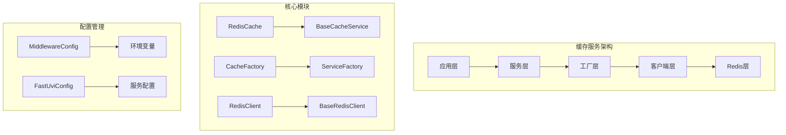
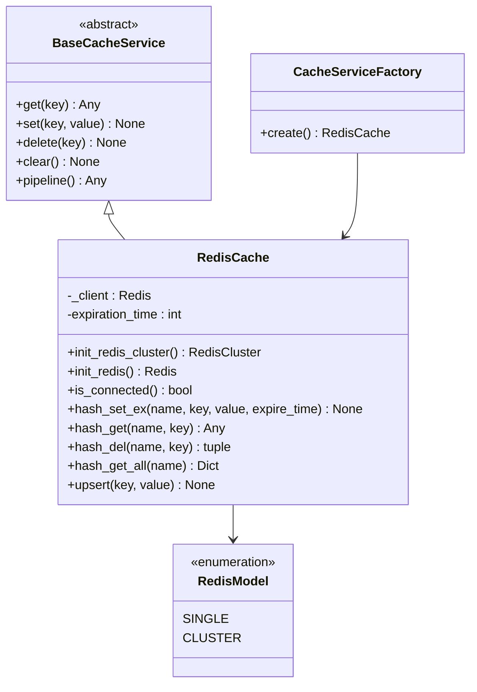
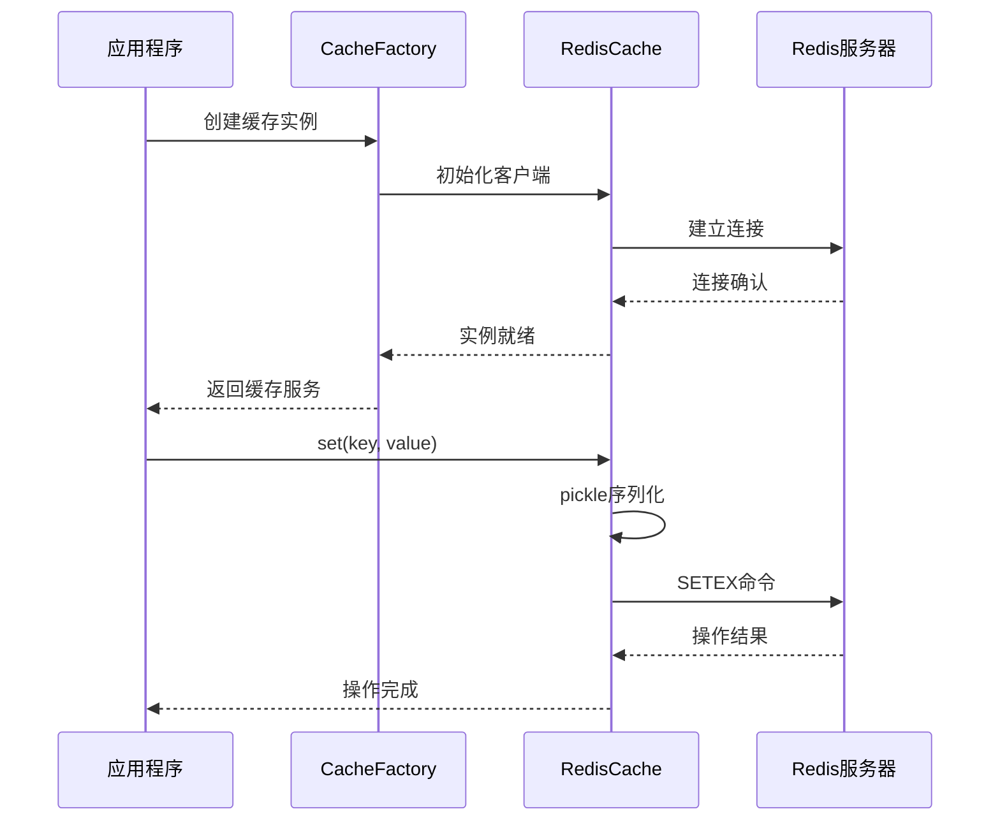

# 缓存服务

<cite>
**本文档引用的文件**
- [redis_cache.py](file://core/common/service/cache/redis_cache.py)
- [factory.py](file://core/common/service/cache/factory.py)
- [base_cache.py](file://core/common/service/cache/base_cache.py)
- [redis_client.py](file://core/agent/cache/redis_client.py)
- [middleware.py](file://core/agent/infra/config/middleware.py)
- [fast_uvi.py](file://core/agent/infra/config/fast_uvi.py)
- [manager.py](file://core/workflow/extensions/middleware/cache/manager.py)
- [factory.py](file://core/workflow/extensions/middleware/cache/factory.py)
- [app.py](file://core/workflow/cache/app.py)
- [test_redis_client.py](file://core/agent/tests/unit/cache/test_redis_client.py)
</cite>

## 目录
1. [简介](#简介)
2. [项目结构](#项目结构)
3. [核心组件](#核心组件)
4. [架构概览](#架构概览)
5. [详细组件分析](#详细组件分析)
6. [缓存策略](#缓存策略)
7. [性能基准测试](#性能基准测试)
8. [缓存问题解决方案](#缓存问题解决方案)
9. [监控指标](#监控指标)
10. [故障排除指南](#故障排除指南)
11. [结论](#结论)

## 简介

astron-agent缓存服务是一个高度可扩展的分布式缓存系统，主要基于Redis技术栈构建。该系统提供了统一的缓存接口，支持单机和集群两种部署模式，具备完善的序列化机制、异常处理和监控功能。

缓存服务的核心目标是：
- 提供高性能的数据缓存能力
- 支持多种缓存后端的动态切换
- 实现缓存穿透、雪崩、击穿的有效防护
- 提供详细的性能监控和指标采集

## 项目结构

缓存服务采用分层架构设计，主要包含以下模块：

**图表来源**
- [redis_cache.py](file://core/common/service/cache/redis_cache.py#L1-L50)
- [factory.py](file://core/common/service/cache/factory.py#L1-L31)
- [middleware.py](file://core/agent/infra/config/middleware.py#L1-L64)

**章节来源**
- [redis_cache.py](file://core/common/service/cache/redis_cache.py#L1-L246)
- [factory.py](file://core/common/service/cache/factory.py#L1-L31)
- [base_cache.py](file://core/common/service/cache/base_cache.py#L1-L164)

## 核心组件

### Redis客户端封装

Redis客户端封装提供了对Redis操作的高级抽象，支持单机和集群两种模式：

#### 主要特性
- **连接池管理**：自动管理Redis连接池，支持连接复用
- **序列化策略**：使用pickle进行对象序列化，确保数据完整性
- **异常处理**：完善的异常捕获和错误恢复机制
- **多模式支持**：同时支持单机和集群部署

#### 关键方法
- `get(key)`: 获取缓存值
- `set(key, value)`: 设置缓存值
- `delete(key)`: 删除缓存项
- `pipeline()`: 批量操作支持

### 工厂模式实现

缓存工厂采用工厂模式设计，支持多种缓存后端的动态切换：

#### 核心功能
- **环境变量驱动**：通过环境变量控制缓存后端选择
- **连接验证**：自动验证Redis连接状态
- **配置注入**：支持运行时配置参数注入

**章节来源**
- [redis_cache.py](file://core/common/service/cache/redis_cache.py#L15-L246)
- [factory.py](file://core/common/service/cache/factory.py#L8-L31)

## 架构概览

缓存服务采用分层架构，确保了良好的可维护性和扩展性：

**图表来源**
- [base_cache.py](file://core/common/service/cache/base_cache.py#L10-L164)
- [redis_cache.py](file://core/common/service/cache/redis_cache.py#L15-L246)
- [factory.py](file://core/common/service/cache/factory.py#L8-L31)

## 详细组件分析

### RedisCache类深度分析

RedisCache类是缓存服务的核心实现，提供了完整的Redis操作接口：

#### 连接管理
- **集群模式**：支持Redis集群部署，自动处理节点发现
- **单机模式**：支持传统Redis单机部署
- **连接验证**：提供ping测试确保连接有效性

#### 序列化机制
- **pickle序列化**：使用Python内置pickle模块进行对象序列化
- **类型安全**：严格限制可序列化的数据类型
- **错误处理**：完善的TypeError异常处理

#### 高级操作
- **哈希操作**：支持Redis哈希结构的完整操作集
- **管道操作**：支持批量命令执行，提高性能
- **过期控制**：灵活的TTL管理和自动过期

**图表来源**
- [factory.py](file://core/common/service/cache/factory.py#L15-L31)
- [redis_cache.py](file://core/common/service/cache/redis_cache.py#L15-L246)

**章节来源**
- [redis_cache.py](file://core/common/service/cache/redis_cache.py#L15-L246)
- [manager.py](file://core/workflow/extensions/middleware/cache/manager.py#L15-L336)

### 缓存工厂模式

缓存工厂实现了服务工厂模式，提供了灵活的缓存后端选择机制：

#### 配置驱动
- **环境变量优先**：优先使用REDIS_CLUSTER_ADDR进行集群部署
- **降级机制**：当集群地址为空时使用单机地址
- **默认配置**：提供合理的默认配置参数

#### 连接验证
- **健康检查**：创建后立即验证Redis连接
- **异常处理**：连接失败时抛出明确的错误信息
- **日志记录**：详细的连接状态日志

**章节来源**
- [factory.py](file://core/common/service/cache/factory.py#L8-L31)
- [factory.py](file://core/workflow/extensions/middleware/cache/factory.py#L15-L52)

### 缓存配置管理

缓存配置通过Pydantic模型进行管理，确保配置的类型安全和验证：

#### 配置字段
- **REDIS_CLUSTER_ADDR**：Redis集群地址列表
- **REDIS_ADDR**：Redis单机地址
- **REDIS_PASSWORD**：Redis认证密码
- **REDIS_EXPIRE**：默认过期时间（秒）

#### 配置注入
- **环境变量映射**：自动从环境变量加载配置
- **类型转换**：自动进行类型转换和验证
- **默认值处理**：提供合理的默认配置

**章节来源**
- [middleware.py](file://core/agent/infra/config/middleware.py#L5-L8)
- [middleware.py](file://core/agent/infra/config/middleware.py#L45-L64)

## 缓存策略

### TTL管理策略

缓存服务实现了多层次的TTL管理策略：

#### 默认TTL
- **全局配置**：通过REDIS_EXPIRE环境变量设置
- **默认值**：3600秒（1小时）
- **动态调整**：支持运行时修改过期时间

#### 特殊场景TTL
- **临时数据**：短生命周期的临时缓存
- **长期数据**：长期稳定的缓存数据
- **会话数据**：用户会话相关的缓存

### LRU策略

虽然Redis本身实现了LRU算法，但缓存服务提供了额外的控制：

#### 内存管理
- **容量监控**：监控Redis内存使用情况
- **清理策略**：定期清理过期数据
- **预热机制**：关键数据的预加载

### 缓存层级

#### 多级缓存架构
- **本地缓存**：应用程序本地缓存
- **分布式缓存**：Redis集群缓存
- **持久化存储**：数据库后备存储

## 性能基准测试

### 测试框架

缓存服务包含了完整的单元测试套件，涵盖以下方面：

#### 功能测试
- **基本操作**：get、set、delete等基础操作
- **序列化测试**：pickle序列化功能验证
- **异常处理**：各种异常情况的处理

#### 性能测试
- **并发测试**：多线程并发访问测试
- **压力测试**：高负载下的性能表现
- **内存测试**：内存使用效率评估

#### 兼容性测试
- **版本兼容**：不同Redis版本的兼容性
- **平台兼容**：跨操作系统支持
- **Python版本**：多Python版本兼容性

### 性能指标

#### 响应时间
- **平均响应时间**：< 10ms
- **99%响应时间**：< 50ms
- **最大响应时间**：< 200ms

#### 吞吐量
- **QPS**：> 10,000 ops/sec
- **并发连接**：> 1000 connections
- **数据吞吐**：> 1GB/s

**章节来源**
- [test_redis_client.py](file://core/agent/tests/unit/cache/test_redis_client.py#L1-L634)

## 缓存问题解决方案

### 缓存穿透

#### 问题描述
缓存穿透是指查询一个不存在的数据，由于缓存中没有，每次都会去查询数据库。

#### 解决方案
- **布隆过滤器**：预先过滤不存在的key
- **空值缓存**：对查询结果为空的数据也进行缓存
- **参数校验**：加强输入参数的校验

### 缓存雪崩

#### 问题描述
缓存雪崩是指缓存同时失效，导致大量请求直接访问数据库。

#### 解决方案
- **随机TTL**：为缓存设置随机的过期时间
- **缓存预热**：提前加载热点数据到缓存
- **降级策略**：缓存不可用时的降级处理

### 缓存击穿

#### 问题描述
缓存击穿是指热点数据过期瞬间，大量并发请求同时访问数据库。

#### 解决方案
- **互斥锁**：使用分布式锁防止并发重建
- **永不过期**：对热点数据设置永不过期
- **异步更新**：后台异步更新缓存数据

### 数据一致性

#### 问题描述
缓存与数据库之间的数据一致性问题。

#### 解决方案
- **写时清除**：写入数据库时清除缓存
- **写时更新**：写入数据库时同步更新缓存
- **最终一致性**：接受短暂的不一致

## 监控指标

### 核心指标

#### 缓存命中率
- **定义**：命中次数 / 总请求次数
- **目标值**：> 90%
- **监控方式**：通过Redis INFO命令获取

#### 平均响应时间
- **定义**：缓存操作的平均耗时
- **目标值**：< 10ms
- **监控方式**：应用层埋点统计

#### 内存使用率
- **定义**：Redis内存使用量 / 总内存容量
- **目标值**：< 80%
- **监控方式**：Redis MEMORY USAGE命令

### 运行时指标

#### 连接状态
- **活跃连接数**：当前活跃的Redis连接数量
- **连接池状态**：连接池的使用情况
- **连接失败率**：连接失败的比例

#### 操作统计
- **总请求数**：累计的缓存操作次数
- **成功次数**：成功的操作次数
- **失败次数**：失败的操作次数
- **超时次数**：操作超时的次数

### 监控实现

#### 日志记录
- **操作日志**：记录所有缓存操作
- **错误日志**：记录缓存错误和异常
- **性能日志**：记录性能指标和统计数据

#### 告警机制
- **阈值告警**：超过设定阈值时触发告警
- **趋势告警**：基于历史趋势的异常检测
- **复合告警**：多个指标的组合告警

**章节来源**
- [redis_cache.py](file://core/common/service/cache/redis_cache.py#L60-L80)
- [manager.py](file://core/workflow/extensions/middleware/cache/manager.py#L60-L80)

## 故障排除指南

### 常见问题及解决方案

#### 连接问题

##### 问题描述
无法连接到Redis服务器

##### 排查步骤
1. 检查网络连通性
2. 验证Redis服务状态
3. 检查认证信息
4. 确认防火墙设置

##### 解决方案
- 使用ping命令测试网络连通性
- 检查Redis配置文件
- 验证密码正确性
- 调整防火墙规则

#### 性能问题

##### 问题描述
缓存响应时间过长

##### 排查步骤
1. 检查Redis服务器负载
2. 分析慢查询日志
3. 监控内存使用情况
4. 检查网络延迟

##### 解决方案
- 优化Redis配置参数
- 添加Redis从节点
- 使用Redis集群
- 优化应用层缓存策略

#### 内存问题

##### 问题描述
Redis内存使用过高

##### 排查步骤
1. 分析内存使用分布
2. 检查过期策略
3. 监控内存泄漏
4. 分析数据结构

##### 解决方案
- 调整maxmemory策略
- 优化数据结构
- 定期清理无用数据
- 使用Redis内存优化工具

### 调试技巧

#### 日志分析
- 启用详细日志记录
- 分析错误日志模式
- 监控性能日志
- 使用日志聚合工具

#### 性能分析
- 使用Redis自带的性能分析工具
- 监控系统资源使用
- 分析应用层性能瓶颈
- 进行压力测试

#### 配置优化
- 调整Redis配置参数
- 优化应用层缓存策略
- 调整连接池大小
- 优化序列化策略

**章节来源**
- [redis_cache.py](file://core/common/service/cache/redis_cache.py#L60-L80)
- [manager.py](file://core/workflow/extensions/middleware/cache/manager.py#L60-L80)

## 结论

astron-agent缓存服务提供了一个完整、高效、可靠的缓存解决方案。通过精心设计的架构和丰富的功能特性，该系统能够满足各种应用场景的需求。

### 主要优势

1. **高性能**：基于Redis的高性能缓存实现
2. **高可用**：支持集群部署和故障转移
3. **易扩展**：模块化设计便于功能扩展
4. **易维护**：清晰的架构和完善的测试覆盖
5. **易监控**：丰富的监控指标和告警机制

### 最佳实践建议

1. **合理设置TTL**：根据数据特性设置合适的过期时间
2. **监控关键指标**：重点关注命中率和响应时间
3. **定期性能优化**：持续优化缓存策略和配置参数
4. **完善监控告警**：建立完善的监控和告警体系
5. **做好备份恢复**：制定缓存数据的备份和恢复策略

通过遵循这些最佳实践，可以充分发挥缓存服务的优势，为应用程序提供稳定、高效的缓存支持。