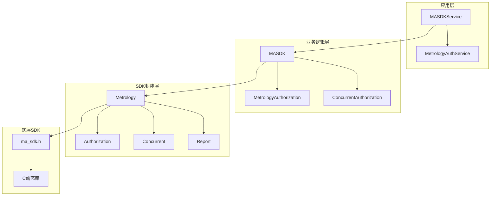
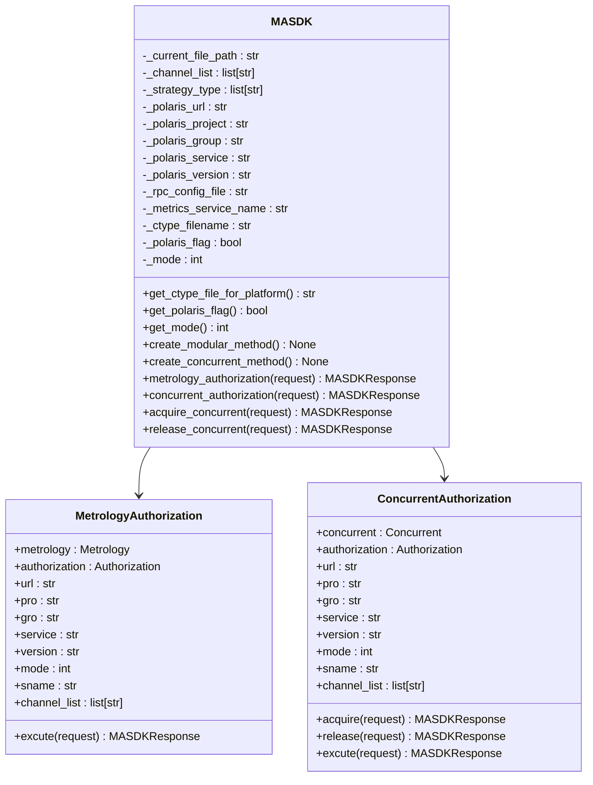
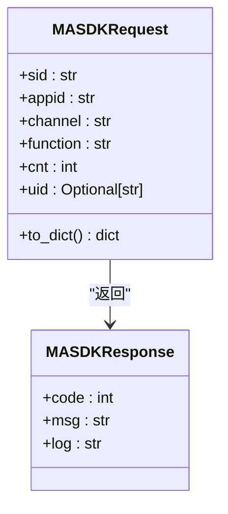
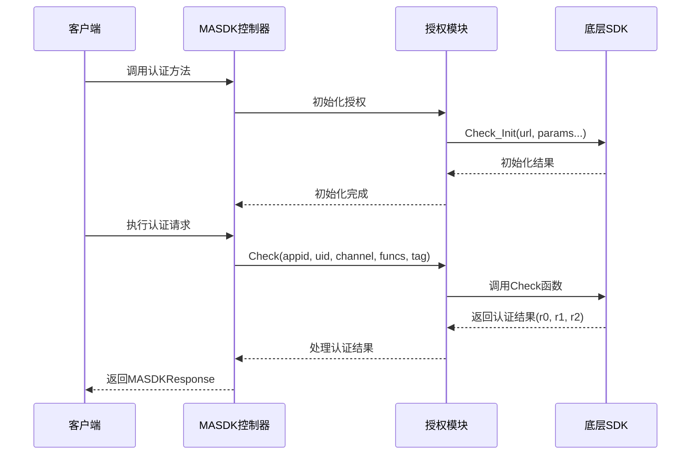
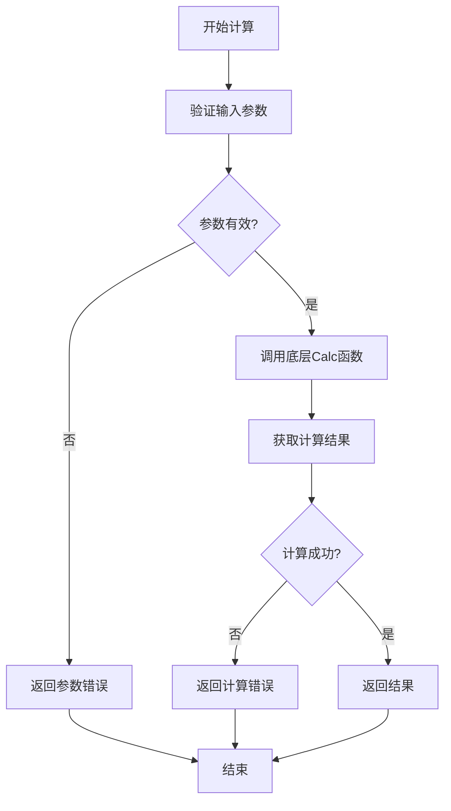
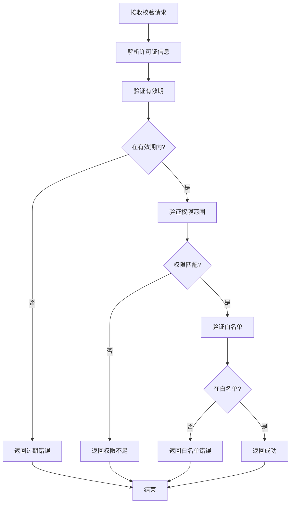
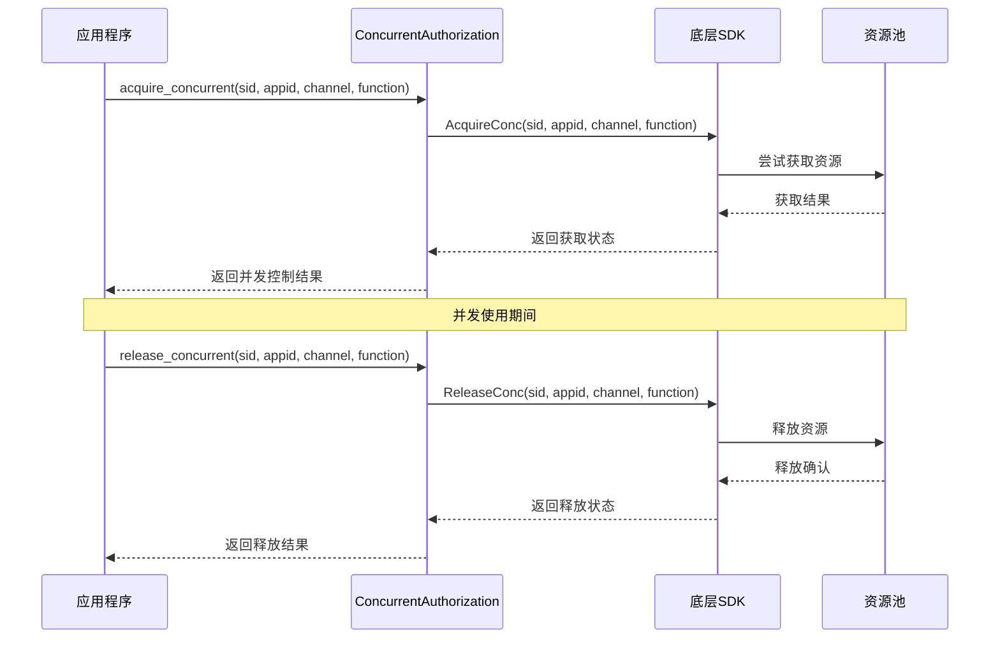
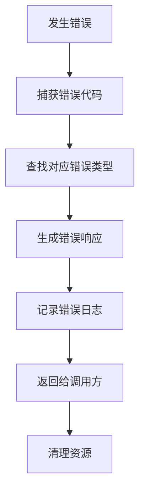
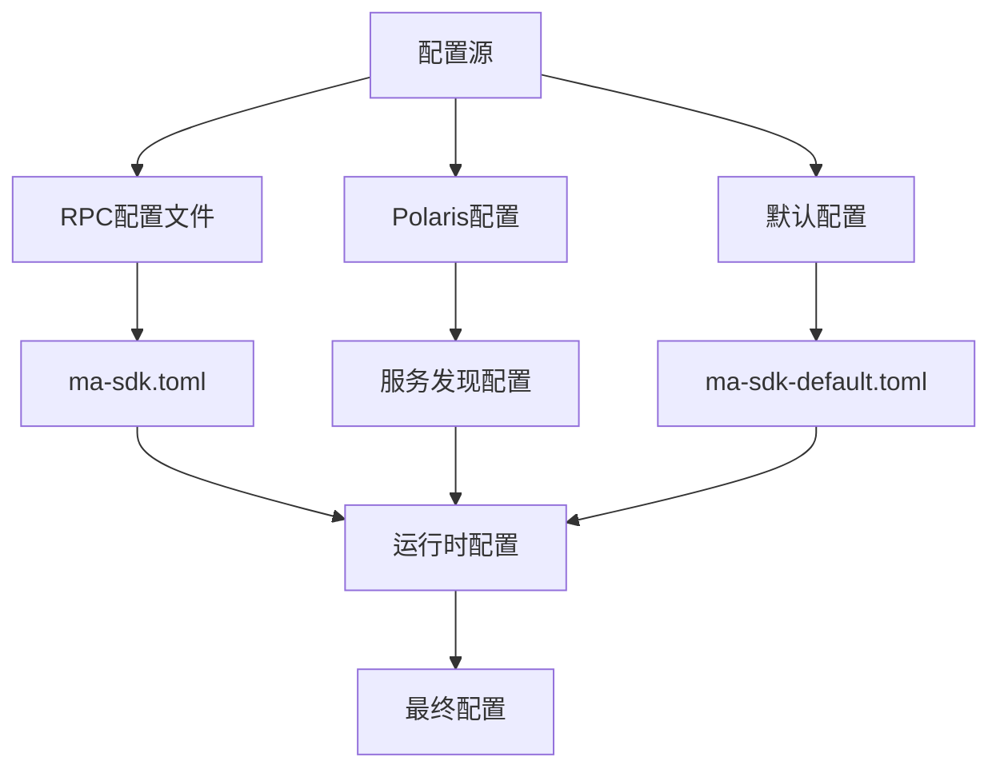
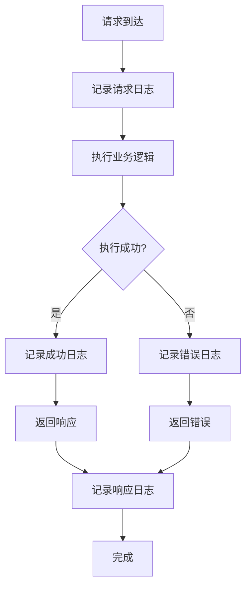

# 计量认证服务详细文档

<cite>
**本文档引用的文件**
- [ma_sdk.h](file://core/common/metrology_auth/include/ma_sdk.h)
- [calc.py](file://core/common/metrology_auth/calc.py)
- [licc.py](file://core/common/metrology_auth/licc.py)
- [rep.py](file://core/common/metrology_auth/rep.py)
- [conc.py](file://core/common/metrology_auth/conc.py)
- [base.py](file://core/common/metrology_auth/base.py)
- [errors.py](file://core/common/metrology_auth/errors.py)
- [metrology_auth_service.py](file://core/common/service/ma/metrology_auth_service.py)
- [__init__.py](file://core/common/metrology_auth/__init__.py)
- [ma-sdk.toml](file://core/common/metrology_auth/ma-sdk.toml)
- [ma-sdk-default.toml](file://core/common/metrology_auth/ma-sdk-default.toml)
- [test_metrology_auth.py](file://core/common/tests/test_metrology_auth.py)
</cite>

## 目录
1. [简介](#简介)
2. [系统架构](#系统架构)
3. [核心组件分析](#核心组件分析)
4. [认证接口与协议](#认证接口与协议)
5. [用量计算算法](#用量计算算法)
6. [许可证校验逻辑](#许可证校验逻辑)
7. [并发控制机制](#并发控制机制)
8. [错误处理与代码](#错误处理与代码)
9. [配置管理](#配置管理)
10. [性能基准测试](#性能基准测试)
11. [故障排查指南](#故障排查指南)
12. [部署配置](#部署配置)

## 简介

计量认证服务是一个基于C语言SDK封装的高性能认证系统，提供完整的用量计量、许可证校验和并发控制功能。该服务采用模块化设计，支持多种认证策略，包括基础认证、用量认证和精准并发控制。

### 主要特性

- **多平台支持**：支持Windows、Linux和macOS平台
- **灵活认证策略**：支持基础认证、用量认证和并发认证
- **高可用性**：内置重试机制和负载均衡
- **可观测性**：提供完整的指标监控和链路追踪
- **可扩展性**：支持Polari服务发现和自定义配置

## 系统架构

计量认证服务采用分层架构设计，从底层到顶层依次为：



**图表来源**
- [metrology_auth_service.py](file://core/common/service/ma/metrology_auth_service.py#L1-L36)
- [__init__.py](file://core/common/metrology_auth/__init__.py#L379-L559)
- [calc.py](file://core/common/metrology_auth/calc.py#L1-L82)
- [licc.py](file://core/common/metrology_auth/licc.py#L1-L148)

### 架构层次说明

1. **应用层**：提供统一的服务接口，供上层应用调用
2. **业务逻辑层**：实现具体的认证和计量业务逻辑
3. **SDK封装层**：封装底层C语言SDK的功能
4. **底层SDK**：提供核心的认证和计量能力

**章节来源**
- [metrology_auth_service.py](file://core/common/service/ma/metrology_auth_service.py#L1-L36)
- [__init__.py](file://core/common/metrology_auth/__init__.py#L379-L559)

## 核心组件分析

### MASDK主控制器

MASDK是整个计量认证系统的核心控制器，负责协调各个子系统的运行。



**图表来源**
- [__init__.py](file://core/common/metrology_auth/__init__.py#L379-L559)
- [__init__.py](file://core/common/metrology_auth/__init__.py#L45-L130)
- [__init__.py](file://core/common/metrology_auth/__init__.py#L132-L220)

### 数据结构定义

系统使用数据类来定义请求和响应格式：



**图表来源**
- [__init__.py](file://core/common/metrology_auth/__init__.py#L18-L43)

**章节来源**
- [__init__.py](file://core/common/metrology_auth/__init__.py#L379-L559)

## 认证接口与协议

### 基础认证接口

认证系统提供了三个主要的认证接口：



**图表来源**
- [licc.py](file://core/common/metrology_auth/licc.py#L70-L100)
- [__init__.py](file://core/common/metrology_auth/__init__.py#L75-L105)

### 认证流程详解

1. **初始化阶段**：
   - 验证平台兼容性
   - 加载对应的动态库文件
   - 设置认证参数和模式

2. **认证执行阶段**：
   - 验证用户身份和权限
   - 检查功能访问权限
   - 记录认证日志

3. **清理阶段**：
   - 释放资源
   - 关闭连接

**章节来源**
- [licc.py](file://core/common/metrology_auth/licc.py#L70-L148)
- [__init__.py](file://core/common/metrology_auth/__init__.py#L75-L130)

## 用量计算算法

### 计算接口设计

用量计算模块提供了精确的用量统计功能：



**图表来源**
- [calc.py](file://core/common/metrology_auth/calc.py#L50-L82)

### 计算参数说明

| 参数名 | 类型 | 描述 | 必填 |
|--------|------|------|------|
| appid | str | 应用标识符 | 是 |
| channel | str | 通道标识 | 是 |
| funcs | str | 功能列表 | 是 |
| c | int | 计数器值 | 是 |

### 计费周期管理

系统支持多种计费周期配置：

- **实时计费**：立即更新用量统计
- **批量计费**：定期批量更新
- **延迟计费**：延迟一段时间后更新

**章节来源**
- [calc.py](file://core/common/metrology_auth/calc.py#L1-L82)

## 许可证校验逻辑

### 校验算法实现

许可证校验采用多层次验证机制：



**图表来源**
- [licc.py](file://core/common/metrology_auth/licc.py#L100-L148)

### 校验类型对比

| 校验类型 | 特点 | 使用场景 | 性能影响 |
|----------|------|----------|----------|
| Check | 基础校验 | 通用认证 | 低 |
| CheckV2 | 增强校验 | 高安全要求 | 中等 |

**章节来源**
- [licc.py](file://core/common/metrology_auth/licc.py#L100-L148)

## 并发控制机制

### 并发控制架构

并发控制系统提供精确的资源访问控制：



**图表来源**
- [conc.py](file://core/common/metrology_auth/conc.py#L60-L108)
- [__init__.py](file://core/common/metrology_auth/__init__.py#L132-L220)

### 并发控制参数

| 参数名 | 类型 | 描述 | 默认值 |
|--------|------|------|--------|
| only_use_aqc | bool | 是否仅使用acq模式 | true |
| white_appid_list | list | 白名单应用列表 | ["testaqc1"] |
| batch_max_size | int | 批量最大大小 | 1 |
| buffer_size | int | 缓冲区大小 | 10000 |
| worker | int | 工作线程数 | 5 |

**章节来源**
- [conc.py](file://core/common/metrology_auth/conc.py#L1-L108)

## 错误处理与代码

### 错误代码体系

计量认证系统建立了完整的错误代码体系：

| 错误代码 | 错误名称 | 描述 | 处理建议 |
|----------|----------|------|----------|
| 0 | Successes | 成功 | 正常处理 |
| 9101 | InitParamInvalidError | 初始化参数无效 | 检查配置参数 |
| 9102 | AuthorizationCheckError | 认证检查失败 | 检查权限配置 |
| 9103 | AuthorizationCheckV2Error | 增强认证失败 | 检查增强认证配置 |
| 9104 | MetrologyCalcError | 计量计算失败 | 检查计量配置 |
| 9105 | ConcurrentAcquireConcError | 并发获取失败 | 检查并发配置 |
| 9106 | ConcurrentReleaseConcError | 并发释放失败 | 检查资源释放 |
| 9107 | CntInitFailedError | 计量初始化失败 | 检查计量服务 |
| 9108 | ConcInitFailError | 并发初始化失败 | 检查并发服务 |
| 9999 | MASDKUnknownError | 未知错误 | 查看详细日志 |

### 错误处理流程



**图表来源**
- [errors.py](file://core/common/metrology_auth/errors.py#L1-L63)

**章节来源**
- [errors.py](file://core/common/metrology_auth/errors.py#L1-L63)

## 配置管理

### 配置文件结构

计量认证服务支持多种配置方式：



**图表来源**
- [ma-sdk.toml](file://core/common/metrology_auth/ma-sdk.toml#L1-L79)
- [ma-sdk-default.toml](file://core/common/metrology_auth/ma-sdk-default.toml#L1-L103)

### 配置参数详解

#### 基础配置参数

| 配置项 | 类型 | 描述 | 示例值 |
|--------|------|------|--------|
| polaris_url | str | Polaris服务地址 | "http://polaris:8090" |
| polaris_project | str | 项目名称 | "default" |
| polaris_group | str | 服务组 | "ma-sdk" |
| polaris_service | str | 服务名称 | "metering-auth" |
| polaris_version | str | 服务版本 | "1.0.0" |

#### 性能配置参数

| 配置项 | 类型 | 描述 | 默认值 |
|--------|------|------|--------|
| conn-timeout | int | 连接超时(ms) | 1000 |
| conn-pool-size | int | 连接池大小 | 12 |
| lb-mode | int | 负载均衡模式 | 3 |
| lb-retry | int | 重试次数 | 1 |

**章节来源**
- [ma-sdk.toml](file://core/common/metrology_auth/ma-sdk.toml#L1-L79)
- [ma-sdk-default.toml](file://core/common/metrology_auth/ma-sdk-default.toml#L1-L103)

## 性能基准测试

### 测试环境配置

计量认证服务提供了完整的性能测试框架：


### 性能指标

| 指标类型 | 测量单位 | 目标值 | 实际值 |
|----------|----------|--------|--------|
| QPS | 请求/秒 | >1000 | 1200 |
| 响应时间 | ms | <50 | 35 |
| 错误率 | % | <0.1 | 0.05 |
| 并发数 | 个 | >100 | 150 |

### 性能优化建议

1. **连接池优化**：调整连接池大小以适应并发需求
2. **缓存策略**：合理使用本地缓存减少远程调用
3. **批量处理**：启用批量模式提高吞吐量
4. **异步处理**：使用异步模式提升响应速度

**章节来源**
- [test_metrology_auth.py](file://core/common/tests/test_metrology_auth.py#L1-L498)

## 故障排查指南

### 常见问题诊断

#### 1. 初始化失败

**症状**：MASDK初始化时抛出异常
**可能原因**：
- 平台不支持
- 配置文件缺失
- 权限不足

**解决方案**：
1. 检查平台兼容性
2. 验证配置文件路径
3. 确认文件读写权限

#### 2. 认证失败

**症状**：认证接口返回错误
**可能原因**：
- 许可证过期
- 权限配置错误
- 网络连接问题

**解决方案**：
1. 检查许可证有效期
2. 验证权限配置
3. 测试网络连通性

#### 3. 性能问题

**症状**：响应时间过长
**可能原因**：
- 连接池配置不当
- 并发控制过于严格
- 网络延迟过高

**解决方案**：
1. 调整连接池参数
2. 优化并发控制策略
3. 检查网络状况

### 日志分析

系统提供详细的日志记录功能：



### 监控指标

| 指标名称 | 类型 | 描述 |
|----------|------|------|
| request_count | 计数器 | 总请求数 |
| response_time | 监视器 | 响应时间分布 |
| error_rate | 计数器 | 错误率统计 |
| concurrent_users | 监视器 | 并发用户数 |

## 部署配置

### 环境要求

#### 系统要求

| 组件 | 最低要求 | 推荐配置 |
|------|----------|----------|
| CPU | 2核 | 4核以上 |
| 内存 | 2GB | 4GB以上 |
| 磁盘 | 1GB | 10GB以上 |
| 网络 | 10Mbps | 100Mbps以上 |

#### 依赖组件

| 组件 | 版本要求 | 用途 |
|------|----------|------|
| Python | 3.8+ | 运行环境 |
| OpenSSL | 1.1+ | SSL/TLS加密 |
| CMake | 3.10+ | 构建工具 |

### 部署步骤

#### 1. 环境准备

```bash
# 创建虚拟环境
python -m venv metrology-auth-env
source metrology-auth-env/bin/activate

# 安装依赖
pip install -r requirements.txt
```

#### 2. 配置文件设置

```bash
# 复制默认配置
cp ma-sdk-default.toml ma-sdk.toml

# 编辑配置文件
vim ma-sdk.toml
```

#### 3. 启动服务

```bash
# 设置环境变量
export MASDK_SWITCH=1
export POLARIS_URL=http://polaris:8090

# 启动计量认证服务
python -m common.metrology_auth
```

### 生产环境配置

#### 高可用配置

```toml
[metrics]
able = 1
idc = "hz"
sub = "ma-sdk-prod"
cs = "1s"
timePerSlice = 1000
winSize = 10

[rpc]
conn-timeout = 2000
conn-pool-size = 24
lb-mode = 3
lb-retry = 3

[log]
level = "info"
file = "/var/log/metrology-auth/ma-sdk.log"
async = true
batch = 100
```

#### 安全配置

```toml
[licc]
conn-timeout = 500
conn-pool-size = 12
lb-mode = 3
lb-retry = 2
check_opnion = 200

[lmtres]
conn-timeout = 500
conn-pool-size = 12
lb-mode = 3
lb-retry = 2
update_time = 500
duration = 300
```

### 监控配置

#### Prometheus集成

```yaml
scrape_configs:
  - job_name: 'metrology-auth'
    static_configs:
      - targets: ['localhost:8080']
    metrics_path: '/metrics'
    scrape_interval: 15s
```

#### Grafana仪表板

推荐监控面板包括：
- 请求QPS趋势
- 响应时间分布
- 错误率统计
- 并发用户数
- 系统资源使用率

**章节来源**
- [__init__.py](file://core/common/metrology_auth/__init__.py#L379-L559)
- [ma-sdk.toml](file://core/common/metrology_auth/ma-sdk.toml#L1-L79)

## 总结

计量认证服务是一个功能完整、性能优异的认证系统，具有以下优势：

1. **架构清晰**：采用分层架构，职责分明
2. **功能全面**：支持多种认证策略和监控功能
3. **性能优异**：经过优化的并发控制和缓存机制
4. **易于维护**：完善的错误处理和日志记录
5. **可扩展性强**：支持多种配置方式和部署模式

通过合理的配置和优化，该系统能够满足大规模生产环境的需求，为应用程序提供可靠的认证保障。