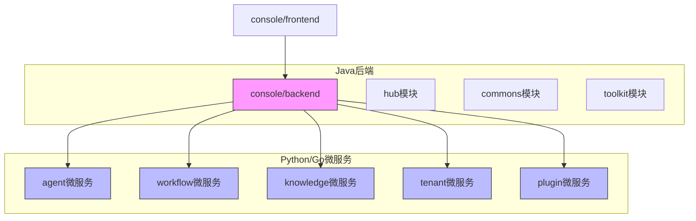
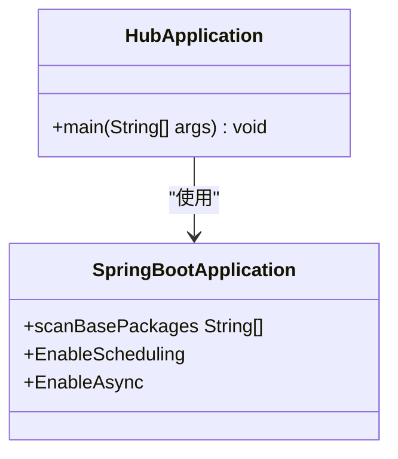
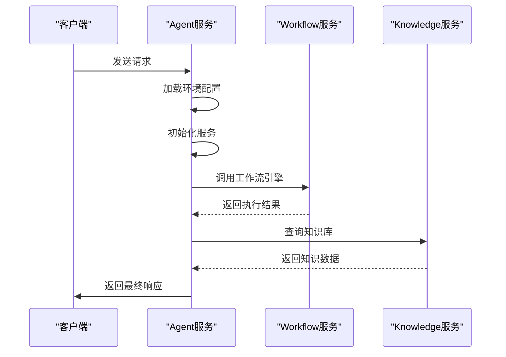
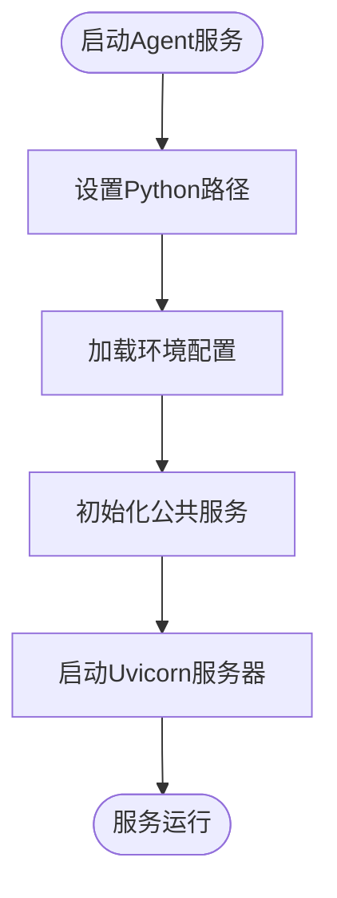
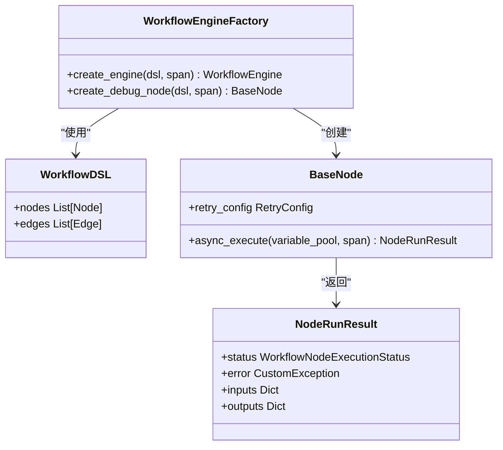
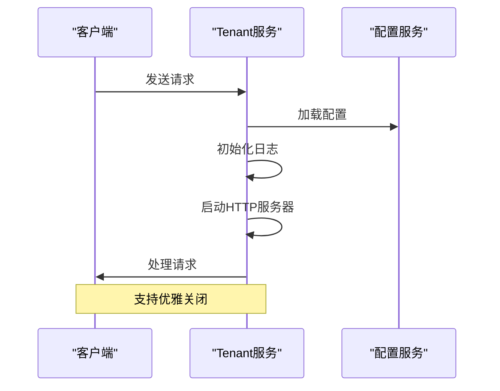
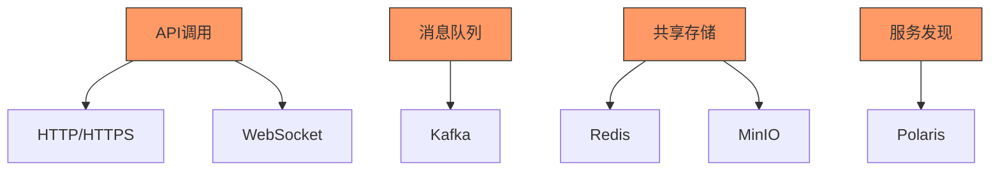
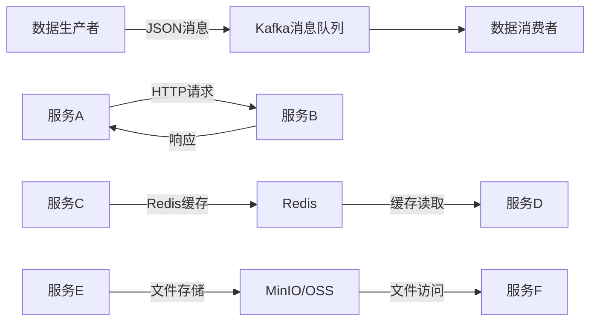
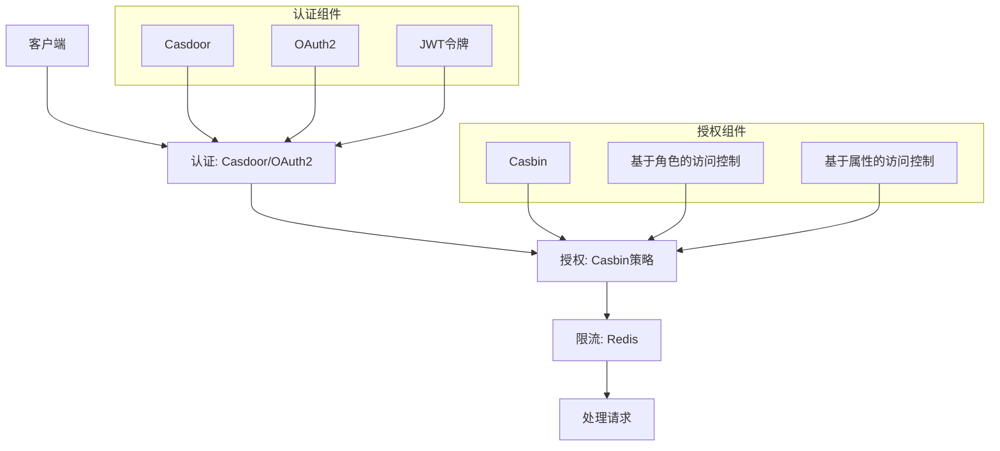

# 后端架构

<cite>
**本文档中引用的文件**  
- [pom.xml](file://console/backend/pom.xml)
- [hub/pom.xml](file://console/backend/hub/pom.xml)
- [HubApplication.java](file://console/backend/hub/src/main/java/com/iflytek/astron/console/hub/HubApplication.java)
- [main.py](file://core/agent/main.py)
- [api/app.py](file://core/agent/api/app.py)
- [base_api.py](file://core/agent/api/v1/base_api.py)
- [workflow/main.py](file://core/workflow/main.py)
- [router.py](file://core/workflow/api/v1/router.py)
- [flow_service.py](file://core/workflow/service/flow_service.py)
- [tenant/main.go](file://core/tenant/main.go)
- [server.go](file://core/tenant/app/server.go)
- [base.py](file://core/common/service/base.py)
</cite>

## 目录
1. [项目结构](#项目结构)
2. [Java后端服务架构](#java后端服务架构)
3. [Python/Go微服务架构](#python/go微服务架构)
4. [微服务通信机制](#微服务通信机制)
5. [服务启动流程与配置管理](#服务启动流程与配置管理)
6. [安全认证与日志监控](#安全认证与日志监控)
7. [API设计与错误处理](#api设计与错误处理)

## 项目结构

本项目采用多语言混合架构，主要分为两大模块：Java后端服务和Python/Go微服务。



**图示来源**  
- [pom.xml](file://console/backend/pom.xml)
- [project_structure](file://project_structure)

**本节来源**  
- [pom.xml](file://console/backend/pom.xml)
- [hub/pom.xml](file://console/backend/hub/pom.xml)

## Java后端服务架构

### hub模块核心职责

`console/backend/hub`模块作为核心后端服务，承担着系统的主要业务逻辑处理和API网关功能。该模块基于Spring Boot 3.5.4构建，采用Java 21作为运行环境，提供了完整的RESTful API服务。

hub模块的主要职责包括：
- 用户认证与授权管理
- 业务逻辑处理与数据访问
- 微服务间的协调与调度
- API接口的统一暴露
- 系统配置管理



**图示来源**  
- [HubApplication.java](file://console/backend/hub/src/main/java/com/iflytek/astron/console/hub/HubApplication.java)

**本节来源**  
- [HubApplication.java](file://console/backend/hub/src/main/java/com/iflytek/astron/console/hub/HubApplication.java)
- [hub/pom.xml](file://console/backend/hub/pom.xml)

### 技术栈与依赖

hub模块采用了现代化的Java技术栈，主要依赖包括：

| 依赖库 | 版本 | 用途 |
|-------|------|------|
| spring-boot-starter-parent | 3.5.4 | Spring Boot基础依赖 |
| mybatis-plus | 3.5.7 | ORM框架 |
| spring-boot-starter-web | - | Web MVC支持 |
| spring-boot-starter-security | - | 安全认证 |
| spring-boot-starter-oauth2-resource-server | - | OAuth2资源服务器 |
| redisson-spring-boot-starter | 3.30.0 | Redis客户端 |
| fastjson2 | 2.0.51 | JSON处理 |
| lombok | 1.18.32 | 代码简化 |

**本节来源**  
- [hub/pom.xml](file://console/backend/hub/pom.xml)

## Python/Go微服务架构

### agent微服务

`core/agent`微服务是基于Python的FastAPI框架构建的智能代理服务，负责处理AI相关的请求和响应。



**图示来源**  
- [main.py](file://core/agent/main.py)
- [api/app.py](file://core/agent/api/app.py)

#### 启动流程

agent微服务的启动流程如下：



**图示来源**  
- [main.py](file://core/agent/main.py)

### workflow微服务

`core/workflow`微服务是工作流引擎的核心，负责处理复杂的业务流程编排。



**图示来源**  
- [flow_service.py](file://core/workflow/service/flow_service.py)

### tenant微服务

`core/tenant`微服务是基于Go语言的租户管理服务，使用Gin框架构建。



**图示来源**  
- [server.go](file://core/tenant/app/server.go)

**本节来源**  
- [main.py](file://core/agent/main.py)
- [api/app.py](file://core/agent/api/app.py)
- [workflow/main.py](file://core/workflow/main.py)
- [server.go](file://core/tenant/app/server.go)

## 微服务通信机制

### 通信模式

系统采用多种通信模式实现微服务间的交互：



**图示来源**  
- [docker-compose.yaml](file://docker/astronAgent/docker-compose.yaml)

### 数据交互模式

微服务间的数据交互遵循以下模式：



**本节来源**  
- [docker/astronAgent/casdoor/conf/init_data.json](file://docker/astronAgent/casdoor/conf/init_data.json)
- [docker/astronAgent/astronRPA/volumes/nginx/default.conf](file://docker/astronAgent/astronRPA/volumes/nginx/default.conf)

## 服务启动流程与配置管理

### 启动流程分析

各微服务的启动流程具有相似的模式：

```mermaid
flowchart TD
subgraph "通用启动流程"
Start([服务启动]) --> Setup["环境设置"]
Setup --> Config["配置加载"]
Config --> Init["服务初始化"]
Init --> Server["启动服务器"]
Server --> Ready([服务就绪])
end
subgraph "Agent服务"
AStart --> ASetup["设置Python路径"]
ASetup --> AConfig["加载config.env"]
AConfig --> AInit["初始化公共服务"]
AInit --> AServer["启动Uvicorn"]
end
subgraph "Workflow服务"
WStart --> WConfig["创建FastAPI应用"]
WConfig --> WMiddleware["添加中间件"]
WMiddleware --> WRouter["注册路由"]
WRouter --> WServer["启动Uvicorn"]
end
subgraph "Tenant服务"
TStart --> TFlag["解析命令行参数"]
TFlag --> TConfig["加载config.toml"]
TConfig --> TLog["初始化日志"]
TLog --> TServer["启动Gin服务器"]
end
```



**图示来源**  
- [main.py](file://core/agent/main.py)
- [workflow/main.py](file://core/workflow/main.py)
- [server.go](file://core/tenant/app/server.go)

### 配置管理

系统采用多层级的配置管理机制：

```mermaid
classDiagram
class SettingsService {
+get_config(key) Any
+set_config(key, value) void
+load_from_file(path) void
+load_from_polaris() void
}
class PolarisConfig {
+cluster String
+url String
+username String
}
class LocalConfig {
+config.env File
+config.toml File
}
SettingsService --> PolarisConfig : "远程配置"
SettingsService --> LocalConfig : "本地配置"
note right of SettingsService
配置优先级 :
1. 环境变量
2. Polaris配置中心
3. 本地配置文件
end note
```

**本节来源**  
- [main.py](file://core/agent/main.py)
- [server.go](file://core/tenant/app/server.go)
- [base.py](file://core/common/service/base.py)

## 安全认证与日志监控

### 安全认证机制

系统采用多层次的安全认证体系：



**图示来源**  
- [docker/astronAgent/casdoor/conf/init_data.json](file://docker/astronAgent/casdoor/conf/init_data.json)

### 日志与监控

系统实现了全面的日志记录和监控方案：

```mermaid
classDiagram
class LoggerService {
+log(level, message) void
+error(exception) void
+info(data) void
}
class OtlpSpanService {
+start_span(name) Span
+end_span() void
+add_event(event) void
}
class OtlpMetricService {
+counter(name) Counter
+gauge(name) Gauge
+histogram(name) Histogram
}
class TraceStatus {
+code int
+message String
}
LoggerService --> OtlpSpanService : "集成"
OtlpSpanService --> OtlpMetricService : "关联"
OtlpSpanService --> TraceStatus : "状态"
note right of OtlpSpanService
使用OpenTelemetry协议
支持分布式追踪
end note
```

**图示来源**  
- [base.py](file://core/common/service/base.py)
- [flow_service.py](file://core/workflow/service/flow_service.py)

**本节来源**  
- [docker/astronAgent/casdoor/conf/init_data.json](file://docker/astronAgent/casdoor/conf/init_data.json)
- [base.py](file://core/common/service/base.py)

## API设计与错误处理

### API设计原则

系统遵循统一的API设计原则：

```mermaid
flowchart TD
subgraph "API设计规范"
RESTful[RESTful风格]
JSON[JSON数据格式]
Versioning[版本控制]
Pagination[分页支持]
Filtering[过滤支持]
Sorting[排序支持]
RateLimiting[限流机制]
Caching[缓存机制]
end
RESTful --> |HTTP方法| CRUD[GET/POST/PUT/DELETE]
JSON --> |请求/响应| Format[统一格式]
Versioning --> |URL路径| v1[/v1/...]
Pagination --> |参数| page[page=1&size=10]
Filtering --> |参数| filter[filter=name:like:John]
Sorting --> |参数| sort[sort=name,asc]
RateLimiting --> |令牌桶| Limit[100次/分钟]
Caching --> |Redis| Cache[ETag/Last-Modified]
```

**图示来源**  
- [router.py](file://core/workflow/api/v1/router.py)

### 错误处理机制

系统采用统一的错误处理机制：

```mermaid
classDiagram
class BaseExc {
+c int
+m String
}
class AgentNormalExc {
+继承 BaseExc
}
class AgentInternalExc {
+继承 BaseExc
}
class RequestValidationError {
+errors() List[Error]
}
class JSONResponse {
+content Dict
+status_code int
}
BaseExc <|-- AgentNormalExc
BaseExc <|-- AgentInternalExc
AgentInternalExc -->|包含| Exception : "原始异常"
RequestValidationError -->|处理| JSONResponse
BaseExc -->|生成| JSONResponse
note right of BaseExc
错误码设计 :
400xx : 客户端错误
500xx : 服务端错误
end note
```

**图示来源**  
- [base_api.py](file://core/agent/api/v1/base_api.py)

**本节来源**  
- [base_api.py](file://core/agent/api/v1/base_api.py)
- [router.py](file://core/workflow/api/v1/router.py)