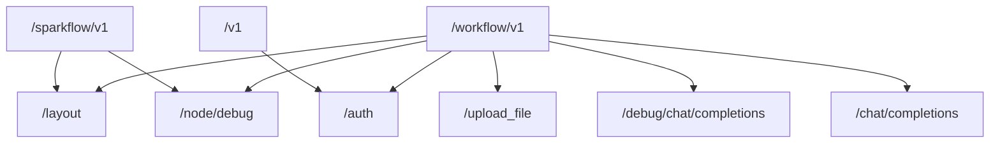

# API接口

<cite>
**本文档引用的文件**
- [open.py](file://core/workflow/api/v1/chat/open.py)
- [debug.py](file://core/workflow/api/v1/chat/debug.py)
- [auth.py](file://core/workflow/api/v1/flow/auth.py)
- [file.py](file://core/workflow/api/v1/flow/file.py)
- [router.py](file://core/workflow/api/v1/router.py)
- [chat.py](file://core/workflow/domain/entities/chat.py)
- [flow.py](file://core/workflow/domain/entities/flow.py)
- [auth_service.py](file://core/workflow/service/auth_service.py)
- [file_service.py](file://core/workflow/service/file_service.py)
</cite>

## 目录
1. [简介](#简介)
2. [API路由结构](#api路由结构)
3. [工作流执行端点](#工作流执行端点)
4. [调试接口](#调试接口)
5. [权限验证](#权限验证)
6. [文件操作](#文件操作)
7. [API使用示例](#api使用示例)
8. [API版本控制与向后兼容性](#api版本控制与向后兼容性)

## 简介
本文档详细记录了astron-agent工作流服务的RESTful API接口。文档涵盖了工作流执行、调试、权限验证和文件操作等核心功能的API端点，详细说明了每个端点的HTTP方法、URL参数、请求体结构、响应格式和错误码。同时解释了API路由的组织结构，提供了API使用示例，包括认证方式、请求构造和响应处理，并说明了API版本控制策略和向后兼容性。

## API路由结构
工作流服务的API路由采用模块化设计，通过主路由器将不同功能的子路由器进行整合。路由结构遵循RESTful设计原则，具有清晰的层次结构和版本控制。



**图源**
- [router.py](file://core/workflow/api/v1/router.py#L20-L41)

**本节来源**
- [router.py](file://core/workflow/api/v1/router.py#L1-L41)

## 工作流执行端点
工作流执行端点提供开放API用于处理聊天完成和恢复功能，支持流式和非流式响应。

### /chat/completions
处理工作流的聊天完成请求，是主要的工作流执行入口。

**HTTP方法**: POST

**URL**: `/workflow/v1/chat/completions`

**请求头**:
- `x_consumer_username`: 消费者用户名（必需）

**请求体结构**:
```json
{
  "flow_id": "string",
  "uid": "string",
  "stream": "boolean",
  "ext": "object",
  "parameters": "object",
  "chat_id": "string",
  "history": [
    {
      "role": "user|assistant",
      "content": "string",
      "content_type": "image|text|audio"
    }
  ],
  "version": "string"
}
```

**响应格式**:
- 流式响应: Server-Sent Events (SSE) 格式
- 非流式响应: JSON格式

**错误码**:
- `FLOW_NOT_PUBLISH_ERROR` (1001): 工作流未发布或已下架
- `OPEN_API_ERROR` (1002): 开放API错误

**本节来源**
- [open.py](file://core/workflow/api/v1/chat/open.py#L25-L242)
- [chat.py](file://core/workflow/domain/entities/chat.py#L50-L94)

### /resume
恢复中断的聊天事件，允许从特定事件点继续执行。

**HTTP方法**: POST

**URL**: `/workflow/v1/resume`

**请求体结构**:
```json
{
  "event_id": "string",
  "event_type": "string",
  "content": "string"
}
```

**响应格式**:
- 流式响应: Server-Sent Events (SSE) 格式
- 非流式响应: JSON格式

**错误码**:
- `EVENT_REGISTRY_NOT_FOUND_ERROR` (1003): 事件未找到或当前事件未暂停

**本节来源**
- [open.py](file://core/workflow/api/v1/chat/open.py#L244-L242)
- [chat.py](file://core/workflow/domain/entities/chat.py#L90-L94)

## 调试接口
调试接口专为开发和故障排除设计，提供调试专用的聊天完成和恢复功能。

### /debug/chat/completions
处理调试模式下的聊天完成请求，绕过标准验证和审计策略。

**HTTP方法**: POST

**URL**: `/workflow/v1/debug/chat/completions`

**请求头**:
- `x_consumer_username`: 消费者用户名（必需）

**请求体结构**:
- 与 `/chat/completions` 端点相同

**响应格式**:
- 流式响应: Server-Sent Events (SSE) 格式
- 非流式响应: JSON格式

**注意事项**: 此端点仅用于开发环境，不应在生产环境中使用。

**本节来源**
- [debug.py](file://core/workflow/api/v1/chat/debug.py#L25-L120)
- [chat.py](file://core/workflow/domain/entities/chat.py#L50-L94)

### /debug/resume
恢复调试模式下的聊天事件。

**HTTP方法**: POST

**URL**: `/workflow/v1/debug/resume`

**请求体结构**:
- 与 `/resume` 端点相同

**响应格式**:
- 流式响应: Server-Sent Events (SSE) 格式
- 非流式响应: JSON格式

**注意事项**: 此端点仅用于开发环境，不应在生产环境中使用。

**本节来源**
- [debug.py](file://core/workflow/api/v1/chat/debug.py#L122-L197)
- [chat.py](file://core/workflow/domain/entities/chat.py#L90-L94)

## 权限验证
权限验证接口用于发布工作流和管理应用程序与工作流之间的认证绑定。

### /publish
发布工作流使其可用于使用。

**HTTP方法**: POST

**URL**: `/workflow/v1/publish`

**请求头**:
- `x_consumer_username`: 消费者用户名（必需）

**请求体结构**:
```json
{
  "flow_id": "string",
  "release_status": "integer",
  "data": "object",
  "plat": "integer",
  "version": "string"
}
```

**响应格式**:
```json
{
  "code": "integer",
  "message": "string",
  "data": "object",
  "sid": "string"
}
```

**错误码**:
- `FLOW_PUBLISH_ERROR` (1004): 工作流发布错误

**本节来源**
- [auth.py](file://core/workflow/api/v1/flow/auth.py#L25-L70)
- [flow.py](file://core/workflow/domain/entities/flow.py#L85-L105)
- [auth_service.py](file://core/workflow/service/auth_service.py#L1-L83)

### /auth
认证并绑定应用程序到工作流。

**HTTP方法**: POST

**URL**: `/workflow/v1/auth`

**请求头**:
- `x_consumer_username`: 消费者用户名（必需）

**请求体结构**:
```json
{
  "flow_id": "string",
  "app_id": "string"
}
```

**响应格式**:
```json
{
  "code": "integer",
  "message": "string",
  "data": "object",
  "sid": "string"
}
```

**错误码**:
- `APP_TENANT_NOT_FOUND_ERROR` (1005): 租户应用未找到
- `FLOW_NOT_FOUND_ERROR` (1006): 工作流未找到
- `FLOW_NOT_PUBLISH_ERROR` (1001): 工作流未发布
- `APP_FLOW_AUTH_BOND_ERROR` (1007): 应用与工作流认证绑定错误

**本节来源**
- [auth.py](file://core/workflow/api/v1/flow/auth.py#L72-L119)
- [flow.py](file://core/workflow/domain/entities/flow.py#L107-L128)
- [auth_service.py](file://core/workflow/service/auth_service.py#L1-L83)

## 文件操作
文件操作接口提供上传单个和多个文件到工作流系统的功能。

### /upload_file
上传单个文件到工作流系统。

**HTTP方法**: POST

**URL**: `/workflow/v1/upload_file`

**请求头**:
- `x_consumer_username`: 消费者用户名（必需）

**请求参数**:
- `file`: 要上传的文件（必需）

**响应格式**:
```json
{
  "code": "integer",
  "message": "string",
  "data": {
    "url": "string"
  },
  "sid": "string"
}
```

**错误码**:
- `FILE_INVALID_ERROR` (1008): 文件无效
- `FILE_STORAGE_ERROR` (1009): 文件存储错误

**本节来源**
- [file.py](file://core/workflow/api/v1/flow/file.py#L25-L65)
- [file_service.py](file://core/workflow/service/file_service.py#L1-L32)

### /upload_files
上传多个文件到工作流系统。

**HTTP方法**: POST

**URL**: `/workflow/v1/upload_files`

**请求头**:
- `x_consumer_username`: 消费者用户名（必需）

**请求参数**:
- `files`: 要上传的文件列表（必需）

**响应格式**:
```json
{
  "code": "integer",
  "message": "string",
  "data": {
    "urls": ["string"]
  },
  "sid": "string"
}
```

**错误码**:
- `FILE_INVALID_ERROR` (1008): 文件无效
- `FILE_STORAGE_ERROR` (1009): 文件存储错误

**本节来源**
- [file.py](file://core/workflow/api/v1/flow/file.py#L67-L111)
- [file_service.py](file://core/workflow/service/file_service.py#L1-L32)

## API使用示例
本节提供API使用示例，包括认证方式、请求构造和响应处理。

### 认证方式
API使用基于头部的认证，通过`x_consumer_username`头部传递消费者用户名进行身份验证。

```python
import requests

# 设置请求头
headers = {
    "x_consumer_username": "your_app_id",
    "Content-Type": "application/json"
}

# 构造请求体
payload = {
    "flow_id": "your_flow_id",
    "uid": "user123",
    "stream": True,
    "parameters": {
        "param1": "value1"
    }
}

# 发送请求
response = requests.post(
    "http://your-server/workflow/v1/chat/completions",
    json=payload,
    headers=headers
)
```

### 请求构造
请求体应包含必要的参数，如`flow_id`、`uid`和`parameters`。对于流式响应，设置`stream`为`true`。

```python
# 完整的请求示例
request_body = {
    "flow_id": "wf_12345",
    "uid": "user_67890",
    "stream": True,
    "ext": {},
    "parameters": {
        "temperature": 0.7,
        "max_tokens": 1000
    },
    "chat_id": "chat_001",
    "history": [
        {
            "role": "user",
            "content": "你好"
        },
        {
            "role": "assistant",
            "content": "你好！有什么可以帮助你的吗？"
        }
    ]
}
```

### 响应处理
根据`stream`参数的值，响应可能是流式或非流式。

```python
import json

# 处理非流式响应
if not stream:
    if response.status_code == 200:
        result = response.json()
        print("响应:", result)
    else:
        print("错误:", response.status_code, response.text)

# 处理流式响应
else:
    for line in response.iter_lines():
        if line:
            # 处理SSE格式的响应
            decoded_line = line.decode('utf-8')
            if decoded_line.startswith('data:'):
                data = decoded_line[5:].strip()
                if data != '[DONE]':
                    try:
                        json_data = json.loads(data)
                        print("流式数据:", json_data)
                    except json.JSONDecodeError:
                        print("无法解析JSON:", data)
```

**本节来源**
- [open.py](file://core/workflow/api/v1/chat/open.py)
- [debug.py](file://core/workflow/api/v1/chat/debug.py)
- [auth.py](file://core/workflow/api/v1/flow/auth.py)
- [file.py](file://core/workflow/api/v1/flow/file.py)

## API版本控制与向后兼容性
API采用版本控制策略，确保向后兼容性。

### 版本控制策略
- 主要版本: `/workflow/v1` - 当前主要版本
- 兼容版本: `/sparkflow/v1` - 为旧系统提供的兼容性路由
- 旧版路由: `/v1` - 为遗留系统提供的旧版认证路由

### 向后兼容性
系统通过以下方式确保向后兼容性：
1. **路由兼容性**: 为旧系统提供兼容性路由，如`sparkflow_router`和`old_auth_router`
2. **错误码稳定性**: 错误码保持稳定，避免破坏现有错误处理逻辑
3. **字段扩展**: 在请求和响应中添加新字段时，确保不影响现有字段的解析
4. **版本参数**: 在`PublishInput`等数据结构中包含版本字段，支持多版本管理

当需要进行破坏性变更时，将创建新的主要版本（如`/workflow/v2`），同时保持旧版本的运行，给予用户充分的迁移时间。

**本节来源**
- [router.py](file://core/workflow/api/v1/router.py#L20-L41)
- [flow.py](file://core/workflow/domain/entities/flow.py#L85-L105)