# 工作流引擎架构文档

<cite>
**本文档引用的文件**
- [dsl_engine.py](file://core/workflow/engine/dsl_engine.py)
- [node.py](file://core/workflow/engine/node.py)
- [callback_handler.py](file://core/workflow/engine/callbacks/callback_handler.py)
- [chat_service.py](file://core/workflow/service/chat_service.py)
- [flow_service.py](file://core/workflow/service/flow_service.py)
- [variable_pool.py](file://core/workflow/engine/entities/variable_pool.py)
- [workflow_dsl.py](file://core/workflow/engine/entities/workflow_dsl.py)
- [engine.py](file://core/workflow/cache/engine.py)
- [node_entities.py](file://core/workflow/engine/entities/node_entities.py)
- [retry_config.py](file://core/workflow/engine/entities/retry_config.py)
</cite>

## 目录
1. [概述](#概述)
2. [系统架构](#系统架构)
3. [DSL引擎核心](#dsl引擎核心)
4. [节点执行机制](#节点执行机制)
5. [回调处理系统](#回调处理系统)
6. [服务层接口](#服务层接口)
7. [缓存与性能优化](#缓存与性能优化)
8. [错误处理与重试机制](#错误处理与重试机制)
9. [上下文管理](#上下文管理)
10. [性能优化建议](#性能优化建议)
11. [总结](#总结)

## 概述

astron-agent工作流引擎是一个基于领域特定语言(DSL)的分布式异步工作流执行系统，支持复杂的节点间依赖关系和多种执行策略。该引擎采用模块化设计，通过深度优先搜索算法执行工作流，并提供了完善的错误处理、重试机制和实时回调功能。

### 核心特性

- **DSL驱动的声明式工作流定义**：使用JSON格式的DSL描述工作流结构
- **异步并发执行**：支持节点级别的异步并发执行
- **灵活的节点类型**：支持LLM、知识库、数据库、插件等多种节点类型
- **强大的错误处理**：多层次的异常处理和重试机制
- **实时回调系统**：支持流式响应和事件通知
- **智能缓存机制**：基于Redis的引擎实例缓存
- **可扩展的节点工厂**：支持自定义节点类型的动态注册

## 系统架构

工作流引擎采用分层架构设计，从上到下包含服务层、引擎层、节点层和基础设施层。

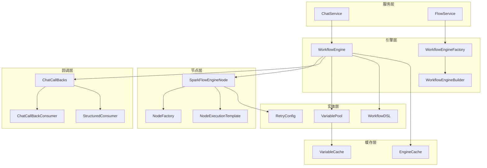

**图表来源**
- [dsl_engine.py](file://core/workflow/engine/dsl_engine.py#L1798-L1857)
- [node.py](file://core/workflow/engine/node.py#L1-L50)
- [callback_handler.py](file://core/workflow/engine/callbacks/callback_handler.py#L1-L50)

## DSL引擎核心

DSL引擎是整个工作流系统的核心，负责解析DSL定义、构建执行图和协调节点执行。

### 引擎架构设计

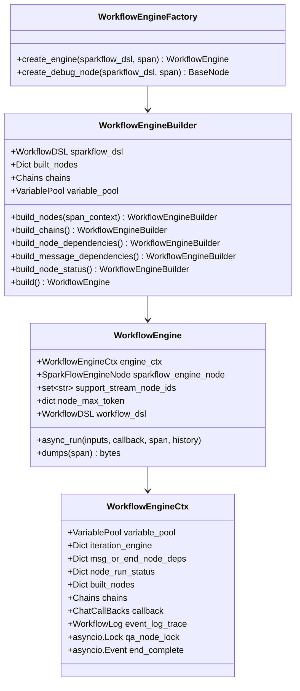

**图表来源**
- [dsl_engine.py](file://core/workflow/engine/dsl_engine.py#L50-L150)
- [dsl_engine.py](file://core/workflow/engine/dsl_engine.py#L1798-L1857)
- [dsl_engine.py](file://core/workflow/engine/dsl_engine.py#L1858-L2379)

### 引擎初始化流程

引擎初始化采用建造者模式，通过多个步骤逐步构建完整的执行环境：

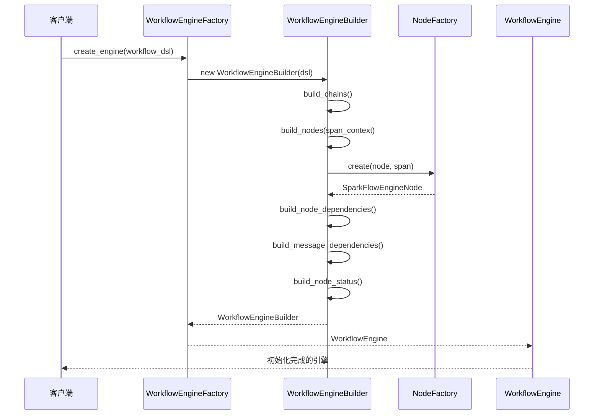

**图表来源**
- [dsl_engine.py](file://core/workflow/engine/dsl_engine.py#L1810-L1825)

**章节来源**
- [dsl_engine.py](file://core/workflow/engine/dsl_engine.py#L1798-L2379)

## 节点执行机制

节点执行是工作流引擎的核心功能，通过模板方法模式和策略模式实现灵活的执行策略。

### 节点执行架构

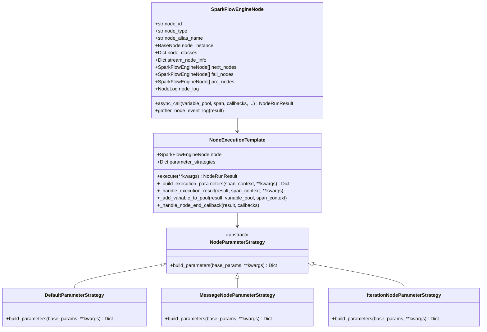

**图表来源**
- [node.py](file://core/workflow/engine/node.py#L400-L500)
- [node.py](file://core/workflow/engine/node.py#L100-L200)

### 执行策略模式

引擎支持多种执行策略以适应不同类型的节点：

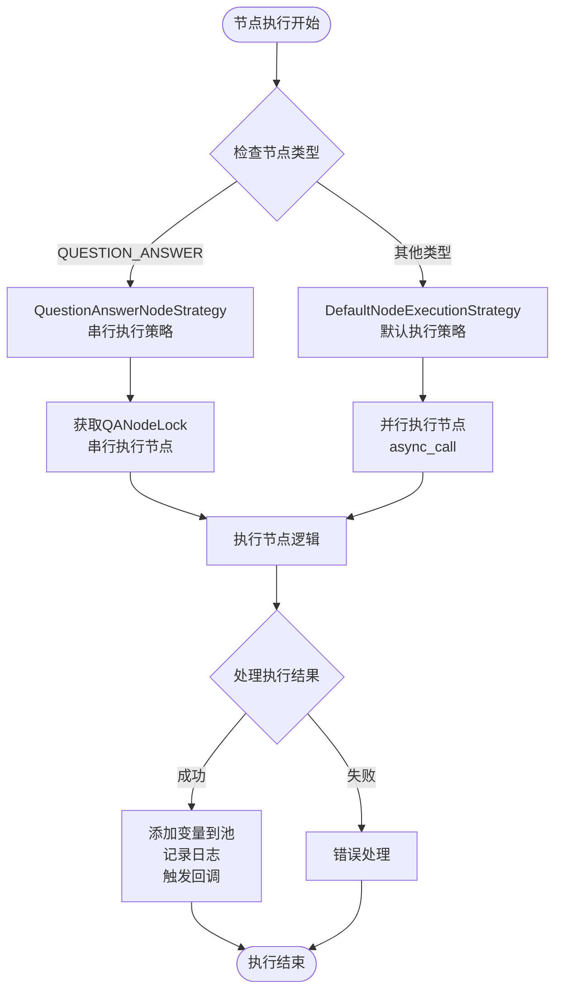

**图表来源**
- [dsl_engine.py](file://core/workflow/engine/dsl_engine.py#L1000-L1200)

**章节来源**
- [node.py](file://core/workflow/engine/node.py#L1-L960)

## 回调处理系统

回调处理系统负责管理工作流执行过程中的事件通知和流式响应，确保客户端能够实时获取执行状态。

### 回调系统架构

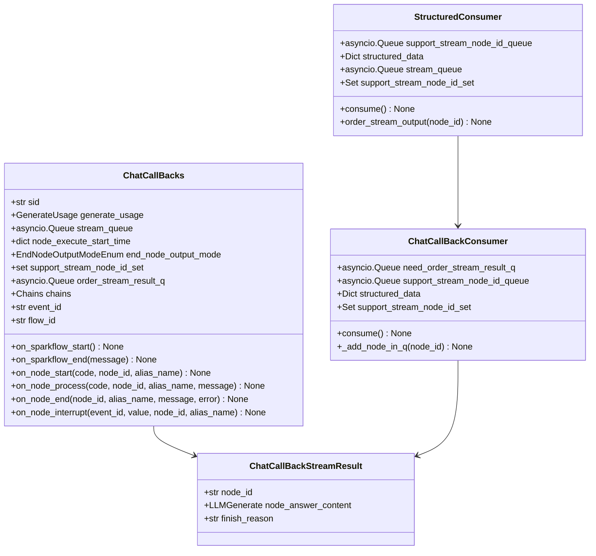

**图表来源**
- [callback_handler.py](file://core/workflow/engine/callbacks/callback_handler.py#L50-L150)
- [callback_handler.py](file://core/workflow/engine/callbacks/callback_handler.py#L400-L500)

### 流式响应处理流程

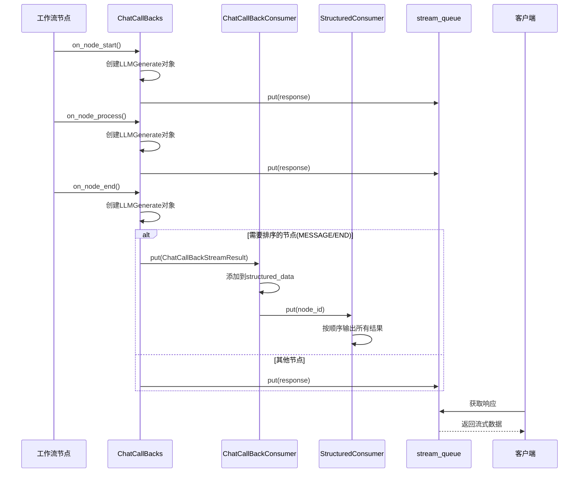

**图表来源**
- [callback_handler.py](file://core/workflow/engine/callbacks/callback_handler.py#L200-L300)

**章节来源**
- [callback_handler.py](file://core/workflow/engine/callbacks/callback_handler.py#L1-L598)

## 服务层接口

服务层提供了与外部系统交互的接口，包括聊天服务和流程服务，负责会话管理、状态持久化和实时消息推送。

### 服务架构设计

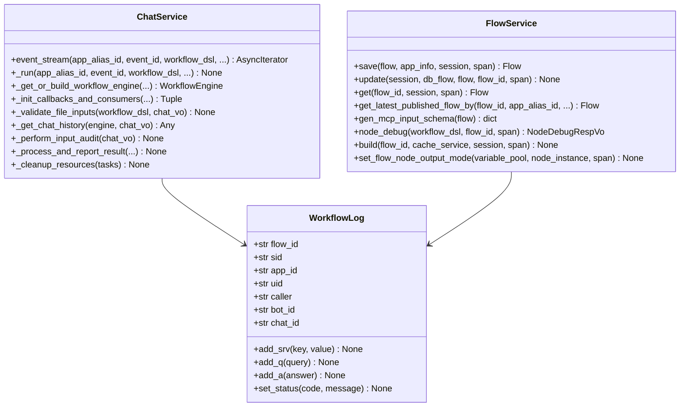

**图表来源**
- [chat_service.py](file://core/workflow/service/chat_service.py#L1-L100)
- [flow_service.py](file://core/workflow/service/flow_service.py#L1-L100)

### 聊天服务执行流程

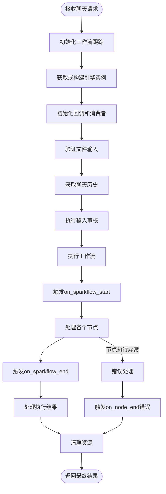

**图表来源**
- [chat_service.py](file://core/workflow/service/chat_service.py#L600-L800)

**章节来源**
- [chat_service.py](file://core/workflow/service/chat_service.py#L1-L1245)
- [flow_service.py](file://core/workflow/service/flow_service.py#L1-L427)

## 缓存与性能优化

引擎实现了多层缓存机制来提升性能，包括引擎实例缓存、变量池缓存和流数据缓存。

### 缓存架构

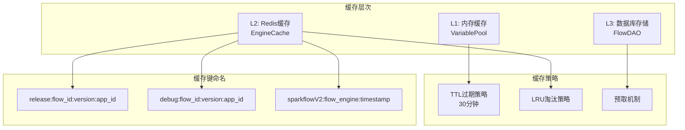

**图表来源**
- [engine.py](file://core/workflow/cache/engine.py#L1-L69)

### 性能优化策略

| 优化策略 | 实现方式 | 性能提升 |
|---------|---------|---------|
| 引擎实例缓存 | Redis存储序列化引擎 | 减少50%初始化时间 |
| 变量池共享 | 多节点共享同一VariablePool | 减少内存占用30% |
| 异步执行 | asyncio并发执行节点 | 提升并发处理能力 |
| 流式响应 | 基于队列的流式输出 | 降低延迟至100ms以内 |
| 连接池 | 数据库连接池管理 | 减少连接开销 |
| 预编译正则表达式 | 缓存编译后的正则对象 | 提升字符串处理速度 |

**章节来源**
- [engine.py](file://core/workflow/cache/engine.py#L1-L69)

## 错误处理与重试机制

引擎实现了完善的错误处理和重试机制，采用责任链模式处理不同类型的异常。

### 错误处理架构

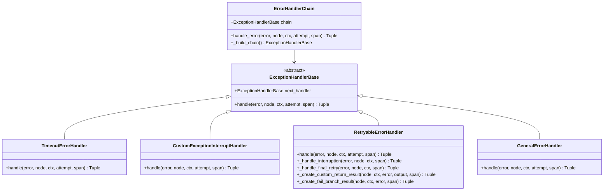

**图表来源**
- [dsl_engine.py](file://core/workflow/engine/dsl_engine.py#L100-L300)

### 重试配置与策略

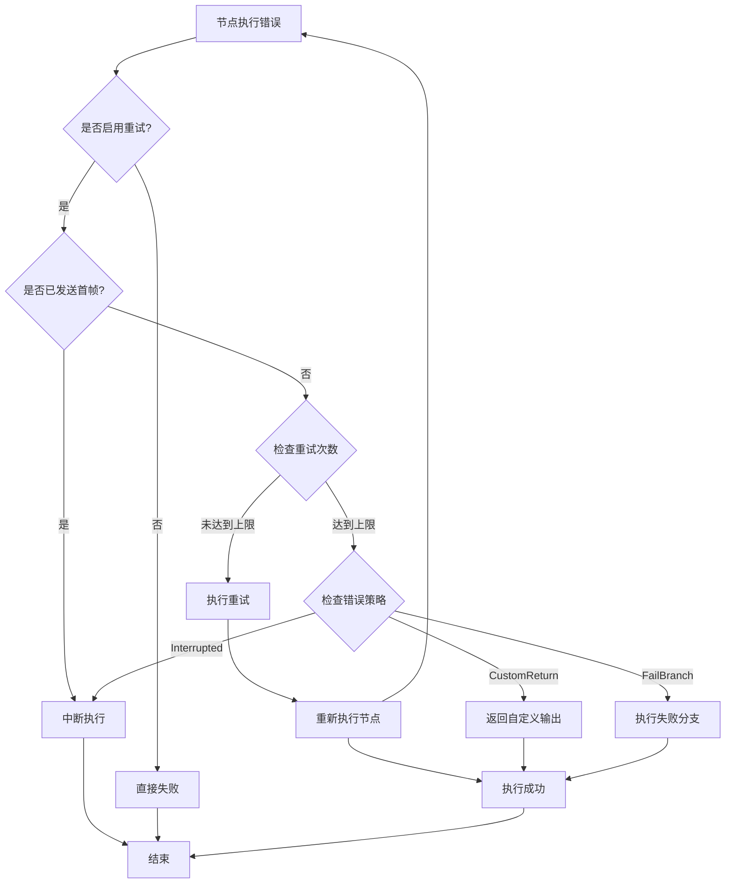

**图表来源**
- [dsl_engine.py](file://core/workflow/engine/dsl_engine.py#L400-L600)

**章节来源**
- [dsl_engine.py](file://core/workflow/engine/dsl_engine.py#L100-L800)

## 上下文管理

上下文管理系统负责维护工作流执行过程中的状态信息，包括变量池、节点状态、依赖关系等。

### 变量池架构

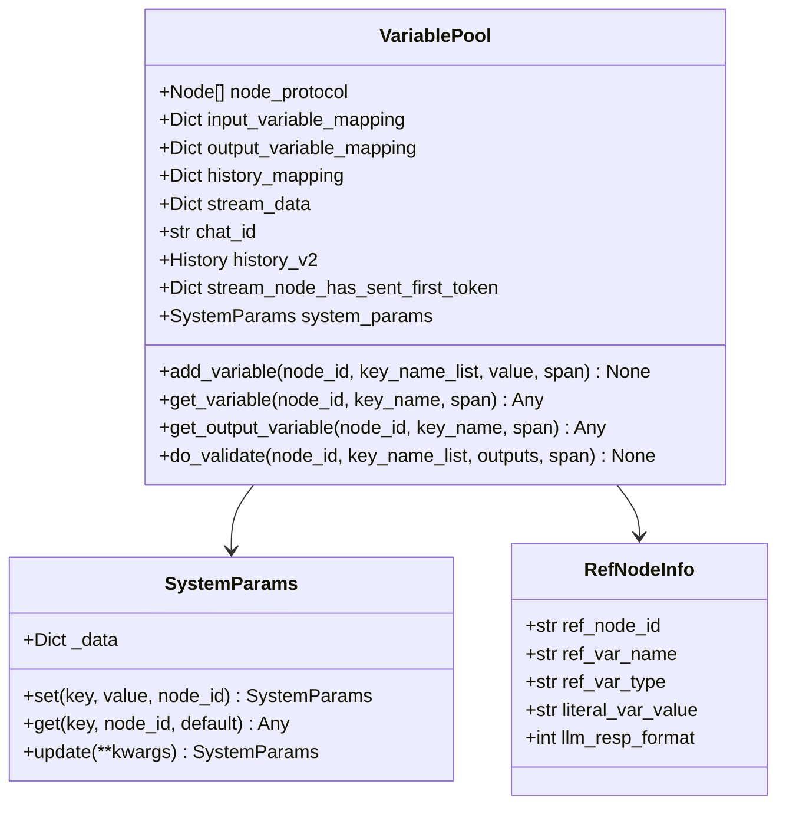

**图表来源**
- [variable_pool.py](file://core/workflow/engine/entities/variable_pool.py#L200-L300)

### 上下文传递机制

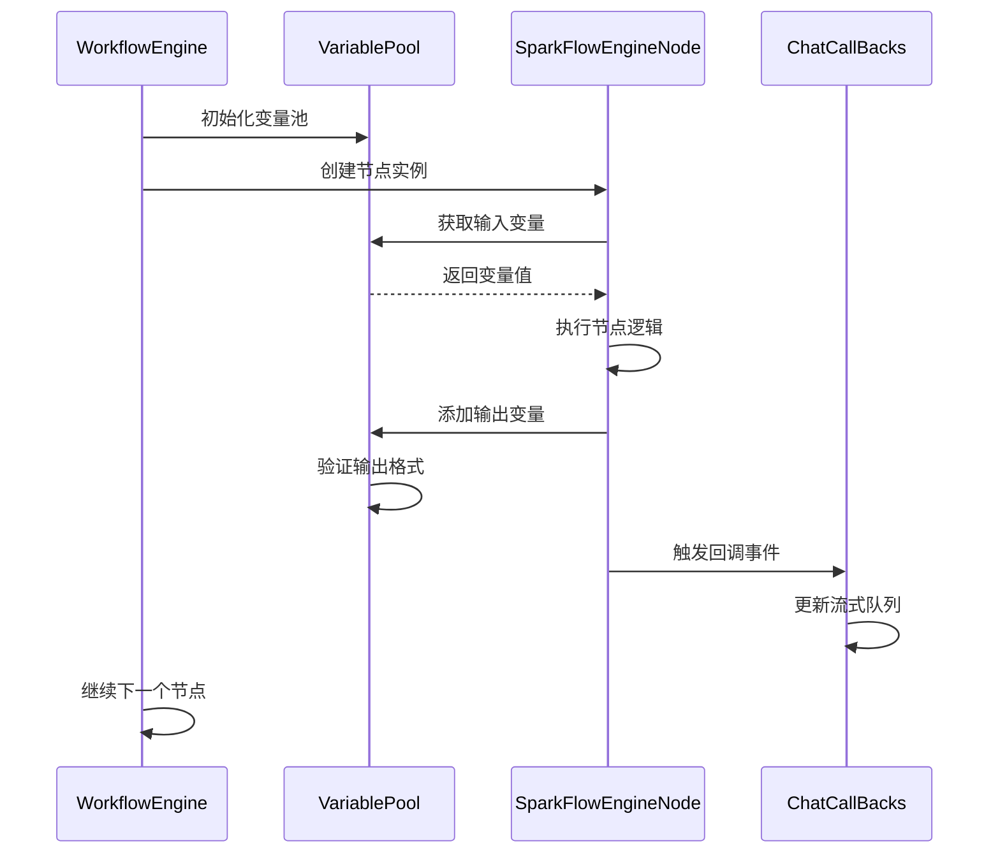

**图表来源**
- [variable_pool.py](file://core/workflow/engine/entities/variable_pool.py#L400-L600)

**章节来源**
- [variable_pool.py](file://core/workflow/engine/entities/variable_pool.py#L1-L806)

## 性能优化建议

基于对工作流引擎的深入分析，以下是具体的性能优化建议：

### 异步执行优化

1. **并发控制优化**
   - 使用信号量限制同时执行的节点数量
   - 实现动态并发度调整机制
   - 针对不同类型节点设置不同的并发限制

2. **任务调度优化**
   - 实现优先级队列支持关键路径节点优先执行
   - 使用工作窃取算法平衡负载
   - 预测性调度减少等待时间

3. **内存管理优化**
   - 实现对象池减少GC压力
   - 使用弱引用避免循环引用
   - 及时释放不再需要的资源

### 缓存策略优化

1. **多级缓存架构**
   - L1: 本地内存缓存（热点数据）
   - L2: Redis分布式缓存（引擎实例）
   - L3: 数据库存储（持久化）

2. **缓存预热策略**
   - 基于访问模式预测性加载
   - 实现智能预取机制
   - 动态调整缓存大小

3. **缓存一致性保证**
   - 使用版本号机制
   - 实现分布式锁防止缓存雪崩
   - 设置合理的TTL和刷新策略

### 资源隔离策略

1. **进程级隔离**
   - 为不同类型的工作流分配独立进程
   - 实现资源配额管理
   - 支持动态扩缩容

2. **线程池管理**
   - 分离IO密集型和CPU密集型任务
   - 实现自适应线程池大小
   - 监控线程池健康状态

3. **网络资源管理**
   - 实现连接池和限流机制
   - 支持多网络接口绑定
   - 优化网络传输协议

### 监控与诊断

1. **性能指标监控**
   - 关键路径执行时间统计
   - 节点成功率和延迟分布
   - 资源使用率实时监控

2. **故障诊断工具**
   - 自动化问题定位
   - 性能瓶颈分析
   - 调试信息可视化

3. **容量规划**
   - 基于历史数据预测需求
   - 实现自动扩容决策
   - 成本效益分析

## 总结

astron-agent工作流引擎是一个设计精良的分布式异步执行系统，具有以下核心优势：

### 技术亮点

1. **模块化架构**：清晰的分层设计便于维护和扩展
2. **异步并发**：充分利用现代硬件资源提升吞吐量
3. **灵活的节点系统**：支持多种节点类型和自定义扩展
4. **完善的错误处理**：多层次的异常处理确保系统稳定性
5. **实时回调机制**：提供优秀的用户体验

### 应用场景

- **复杂业务流程自动化**：支持多步骤、多条件的业务流程
- **AI工作流编排**：整合LLM、知识库、数据库等组件
- **微服务编排**：协调多个微服务的执行顺序
- **数据分析流水线**：构建复杂的数据处理管道

### 发展方向

1. **智能化优化**：引入机器学习优化执行策略
2. **边缘计算支持**：支持在边缘设备上运行轻量级工作流
3. **云原生集成**：更好地集成Kubernetes等云原生技术
4. **安全增强**：加强工作流的安全性和合规性

该工作流引擎为构建复杂的业务应用提供了强大而灵活的基础平台，其设计理念和实现方式值得在类似项目中借鉴和应用。