# 工作流服务

<cite>
**本文档引用的文件**
- [chat_service.py](file://core/workflow/service/chat_service.py)
- [dsl_engine.py](file://core/workflow/engine/dsl_engine.py)
- [flow.py](file://core/workflow/domain/entities/flow.py)
- [main.py](file://core/workflow/main.py)
- [flow_service.py](file://core/workflow/service/flow_service.py)
- [workflow_log.py](file://core/workflow/extensions/otlp/log_trace/workflow_log.py)
- [span.py](file://core/workflow/extensions/otlp/trace/span.py)
- [base_node.py](file://core/workflow/engine/nodes/base_node.py)
- [app_service.py](file://core/workflow/service/app_service.py)
</cite>

## 目录
1. [介绍](#介绍)
2. [项目结构](#项目结构)
3. [核心组件](#核心组件)
4. [架构概述](#架构概述)
5. [详细组件分析](#详细组件分析)
6. [依赖分析](#依赖分析)
7. [性能考虑](#性能考虑)
8. [故障排除指南](#故障排除指南)
9. [结论](#结论)

## 介绍

工作流服务是整个系统的核心，负责工作流的定义、执行和管理。该服务通过基于领域特定语言（DSL）的编排机制，协调各种节点类型（如LLM、知识库、RPA等）的执行，实现复杂的业务逻辑。服务通过OTLP协议实现分布式追踪，与Agent服务协同工作，并提供完整的调试、监控和性能调优能力。

## 项目结构

工作流服务的代码库遵循清晰的分层架构，主要分为API、缓存、配置、常量、领域模型、异常、扩展、基础设施、存储库、服务、测试、工具和主应用等模块。这种结构化的设计使得各组件职责分明，便于维护和扩展。

**图表来源**
- [main.py](file://core/workflow/main.py)
- [service](file://core/workflow/service)
- [repository](file://core/workflow/repository)
- [domain](file://core/workflow/domain)

**章节来源**
- [main.py](file://core/workflow/main.py)
- [project_structure](file://project_structure)

## 核心组件

工作流服务的核心组件包括聊天会话管理、DSL引擎、数据模型和分布式追踪。`chat_service.py`负责处理聊天请求和生成流式响应，`dsl_engine.py`实现了工作流的解析和执行引擎，`flow.py`定义了工作流的数据模型，而OTLP扩展则提供了全面的分布式追踪能力。

**章节来源**
- [chat_service.py](file://core/workflow/service/chat_service.py)
- [dsl_engine.py](file://core/workflow/engine/dsl_engine.py)
- [flow.py](file://core/workflow/domain/entities/flow.py)
- [span.py](file://core/workflow/extensions/otlp/trace/span.py)

## 架构概述

工作流服务采用微服务架构，通过FastAPI框架提供RESTful API接口。服务初始化时会配置必要的中间件，包括跨域资源共享（CORS）、OTLP追踪和认证授权。核心的`create_app`函数负责构建和配置FastAPI应用实例，注册所有路由和异常处理器。

**图表来源**
- [main.py](file://core/workflow/main.py)
- [chat_service.py](file://core/workflow/service/chat_service.py)
- [flow_service.py](file://core/workflow/service/flow_service.py)
- [app_service.py](file://core/workflow/service/app_service.py)

## 详细组件分析

### 聊天会话管理分析

`chat_service.py`模块负责处理聊天会话的完整生命周期，从接收请求到生成流式响应。该模块通过事件流机制处理聊天请求，确保响应的实时性和高效性。

#### 聊天服务类图

**图表来源**
- [chat_service.py](file://core/workflow/service/chat_service.py)
- [workflow_log.py](file://core/workflow/extensions/otlp/log_trace/workflow_log.py)
- [span.py](file://core/workflow/extensions/otlp/trace/span.py)

### DSL引擎分析

`dsl_engine.py`模块实现了工作流的核心执行引擎，负责解析和执行基于DSL定义的工作流。该引擎采用链式责任模式处理异常，支持多种执行策略，并通过深度优先搜索算法执行工作流节点。

#### DSL引擎类图

**图表来源**
- [dsl_engine.py](file://core/workflow/engine/dsl_engine.py)

### 数据模型分析

`flow.py`模块定义了工作流服务的核心数据模型，包括工作流的读取、更新、发布和认证等操作。这些模型基于Pydantic构建，确保了数据的类型安全和验证。

#### 工作流数据模型类图

```mermaid
classDiagram
class FlowRead {
+flow_id : str
+app_id : str | None
}
class FlowUpdate {
+id : Optional[str]
+name : Optional[str]
+description : Optional[str]
+data : Optional[Dict]
+app_id : Optional[str]
}
class Edge {
+sourceNodeId : str
+targetNodeId : str
+sourceHandle : str
}
class Node {
+id : str
}
class Data {
+nodes : List[Node]
+edges : List[Edge]
}
class WorkflowData {
+id : str
+name : str
+description : str
+version : str
+data : Data
}
class PublishInput {
+flow_id : str
+release_status : int
+data : Optional[WorkflowData]
+plat : Optional[int]
+version : Optional[str]
}
class AuthInput {
+flow_id : str
+app_id : str
}
FlowRead <|-- FlowUpdate
FlowUpdate <|-- PublishInput
PublishInput <|-- AuthInput
Data <|-- WorkflowData
Edge <|-- Data
Node <|-- Data
```

**图表来源**
- [flow.py](file://core/workflow/domain/entities/flow.py)

### 工作流执行流程分析

工作流的执行流程涉及多个组件的协同工作，从接收请求到生成最终响应。该流程通过异步事件流机制实现，确保了高并发下的性能和响应性。

#### 工作流执行序列图

**图表来源**
- [chat_service.py](file://core/workflow/service/chat_service.py)
- [dsl_engine.py](file://core/workflow/engine/dsl_engine.py)

### 工作流服务与Agent服务协同工作机制

工作流服务与Agent服务通过标准化的接口进行协同工作。当工作流中包含Agent节点时，工作流服务会调用Agent服务的API来执行特定任务。这种设计实现了服务间的解耦，使得每个服务可以独立演进和扩展。

#### 服务协同序列图

**图表来源**
- [chat_service.py](file://core/workflow/service/chat_service.py)
- [app_service.py](file://core/workflow/service/app_service.py)

### OTLP分布式追踪实现

工作流服务通过OTLP（OpenTelemetry Protocol）实现全面的分布式追踪。`span.py`模块封装了OpenTelemetry的追踪功能，提供了会话ID（SID）管理、属性设置、事件记录和异常处理等高级功能。

#### 分布式追踪流程图

**图表来源**
- [span.py](file://core/workflow/extensions/otlp/trace/span.py)

## 依赖分析

工作流服务依赖于多个内部和外部组件。内部依赖包括缓存、数据库、消息队列等基础设施服务，外部依赖则包括大模型API、知识库服务和RPA系统。通过依赖注入和工厂模式，服务实现了良好的解耦和可测试性。

**图表来源**
- [main.py](file://core/workflow/main.py)
- [extensions](file://core/workflow/extensions)
- [service](file://core/workflow/service)

**章节来源**
- [main.py](file://core/workflow/main.py)
- [extensions](file://core/workflow/extensions)
- [service](file://core/workflow/service)

## 性能考虑

工作流服务在设计时充分考虑了性能因素。通过缓存机制避免重复解析DSL，使用异步非阻塞I/O处理高并发请求，以及通过流式响应减少延迟。此外，服务还实现了智能的资源清理机制，确保长时间运行的稳定性。

**章节来源**
- [chat_service.py](file://core/workflow/service/chat_service.py)
- [dsl_engine.py](file://core/workflow/engine/dsl_engine.py)
- [flow_service.py](file://core/workflow/service/flow_service.py)

## 故障排除指南

当工作流服务出现问题时，可以按照以下步骤进行排查：

1. **检查日志**：查看服务日志，特别是错误和异常事件。
2. **验证追踪**：通过OTLP追踪查看请求的完整执行路径。
3. **检查缓存**：确认缓存状态，必要时清除相关缓存。
4. **验证配置**：检查环境变量和配置文件是否正确。
5. **测试依赖**：确保所有依赖服务（数据库、缓存、外部API）正常运行。

**章节来源**
- [chat_service.py](file://core/workflow/service/chat_service.py)
- [span.py](file://core/workflow/extensions/otlp/trace/span.py)
- [workflow_log.py](file://core/workflow/extensions/otlp/log_trace/workflow_log.py)

## 结论

工作流服务通过精心设计的架构和实现，提供了强大而灵活的工作流管理能力。服务的核心是基于DSL的编排引擎，它能够协调各种类型的节点执行复杂的业务逻辑。通过与Agent服务的协同工作和OTLP分布式追踪的集成，服务实现了高度的可观察性和可扩展性。未来可以进一步优化缓存策略、增强错误处理机制，并提供更多类型的节点支持。