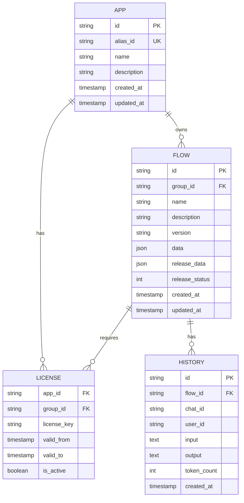

# 数据模型

<cite>
**本文档中引用的文件**  
- [flow.py](file://core/workflow/domain/entities/flow.py)
- [history.py](file://core/workflow/engine/entities/history.py)
- [license.py](file://core/workflow/cache/license.py)
- [chat.py](file://core/workflow/domain/entities/chat.py)
- [flow_dao.py](file://core/workflow/repository/flow_dao.py)
- [license_dao.py](file://core/workflow/repository/license_dao.py)
- [base.py](file://core/workflow/domain/models/base.py)
- [flow.py](file://core/workflow/domain/models/flow.py)
- [history.py](file://core/workflow/domain/models/history.py)
- [license.py](file://core/workflow/domain/models/license.py)
</cite>

## 目录
1. [引言](#引言)
2. [工作流定义数据结构](#工作流定义数据结构)
3. [执行历史记录模型](#执行历史记录模型)
4. [许可管理模型](#许可管理模型)
5. [领域实体设计](#领域实体设计)
6. [数据库表结构说明](#数据库表结构说明)
7. [数据迁移策略与备份恢复方案](#数据迁移策略与备份恢复方案)
8. [结论](#结论)

## 引言
本项目是一个基于微服务架构的智能工作流系统，核心功能包括工作流定义、执行、历史记录追踪和许可管理。系统采用分层架构设计，包含API接口层、领域实体层、服务层、数据访问层和基础设施层。工作流数据模型是系统的核心，负责管理DSL存储、版本控制、发布状态和权限设置。执行历史记录模型用于跟踪用户交互和系统响应，支持对话上下文管理和性能分析。许可管理模型确保系统资源的安全访问和合规使用。整个系统通过清晰的领域驱动设计（DDD）原则，将业务逻辑与数据存储分离，提高了代码的可维护性和扩展性。

## 工作流定义数据结构

工作流定义数据结构是系统的核心，它通过一系列Pydantic模型来描述工作流的完整信息。`WorkflowData`类是主要的数据容器，包含工作流的唯一标识符、名称、描述、版本号和结构数据。版本号采用语义化版本控制（v3.x.x格式），确保版本管理的规范性。结构数据由`Data`类表示，包含节点列表和边列表，形成有向无环图（DAG）结构。每个节点由`Node`类表示，包含唯一ID和其他属性；每条边由`Edge`类表示，定义了源节点、目标节点和连接句柄。系统支持工作流的读取、更新和发布操作，分别由`FlowRead`、`FlowUpdate`和`PublishInput`类处理。权限设置通过`AuthInput`类实现，需要提供工作流ID和应用ID进行身份验证。

**Section sources**
- [flow.py](file://core/workflow/domain/entities/flow.py#L1-L128)

## 执行历史记录模型

执行历史记录模型负责管理对话历史和上下文信息。`History`类是核心组件，维护原始历史记录、最大token限制和对话轮次限制。它提供了`process_history`静态方法，用于处理历史数据的token和轮次限制。处理过程包括：分离图像和其他元素、保留最新图像、按轮次分组消息、限制对话轮次、按token限制内容，并最终合并结果。`ProcessArrayMethod`类提供了一系列实用方法，如`calculate_message_token`用于估算消息token数量，`group_array_by_quantity`用于按数量分组数组，`process_array_by_token`用于按token限制数组内容。`EnableChatHistoryV2`类用于启用V2版聊天历史功能，包含是否启用和最大轮次两个属性。历史项由`HistoryItem`类表示，包含角色、内容和内容类型（文本、图像、音频）。

**Section sources**
- [history.py](file://core/workflow/engine/entities/history.py#L1-L199)
- [chat.py](file://core/workflow/domain/entities/chat.py#L1-L94)

## 许可管理模型

许可管理模型负责处理系统的许可信息，确保资源的安全访问。`License`类（在`domain/models/license.py`中定义）表示许可实体，包含许可相关的属性。系统通过Redis缓存来提高许可信息的访问效率。`get_license_by_app_id_group_id`函数用于根据应用ID和组ID从缓存中检索许可信息，使用`license:license_info:new:app_id:group_id`作为Redis键。`set_license_by_app_id_group_id`函数用于将许可信息存储到缓存中。数据访问层通过`license_dao.py`中的`get_by`函数实现数据库查询，该函数执行JOIN操作，在app表和license表之间查找匹配的许可记录。查询条件包括应用别名ID和流程组ID，确保精确匹配。这种设计实现了许可信息的快速检索和高效管理，支持系统的高并发访问需求。

**Section sources**
- [license.py](file://core/workflow/cache/license.py#L1-L40)
- [license_dao.py](file://core/workflow/repository/license_dao.py#L1-L45)
- [license.py](file://core/workflow/domain/models/license.py)

## 领域实体设计

领域实体设计遵循领域驱动设计（DDD）原则，将业务逻辑与数据存储分离。在`entities`层中，`flow.py`定义了工作流相关的值对象，如`FlowRead`、`FlowUpdate`、`PublishInput`等，用于表示不同操作的数据传输需求。这些实体使用Pydantic BaseModel实现，提供了数据验证和序列化功能。`chat.py`定义了聊天相关的实体，包括`ChatVo`（聊天请求值对象）、`HistoryItem`（历史记录项）和`ResumeVo`（恢复事件值对象）。`ChatVo`包含工作流ID、用户ID、流式响应标志、扩展字段、参数、聊天ID、历史记录和版本号等属性，全面描述了聊天请求的上下文。所有实体都使用类型提示和Field描述符，确保代码的可读性和类型安全。这种设计模式提高了代码的可维护性，使得业务逻辑更加清晰和易于测试。

**Section sources**
- [flow.py](file://core/workflow/domain/entities/flow.py)
- [chat.py](file://core/workflow/domain/entities/chat.py)

## 数据库表结构说明

数据库表结构设计遵循规范化原则，确保数据的一致性和完整性。`flow`表是核心表，存储工作流的定义和状态信息。其主要字段包括：`id`（主键）、`group_id`（组ID）、`name`（名称）、`description`（描述）、`version`（版本号）、`data`（工作流DSL数据，JSON格式）、`release_data`（发布数据，JSON格式）、`release_status`（发布状态，位标志）等。`release_status`字段使用位运算来表示不同的发布状态，支持灵活的状态管理。`license`表存储许可信息，包含`app_id`（应用ID）、`group_id`（组ID）等字段，与`app`表通过外键关联。`history`表记录执行历史，包含会话ID、用户ID、输入输出内容、执行时间等信息。索引策略方面，在`flow`表的`group_id`和`version`字段上创建复合索引，支持高效的版本查询。查询优化通过预编译SQL语句和参数化查询实现，避免SQL注入风险。数据一致性通过数据库事务和外键约束保障，确保相关数据的同步更新。

**Diagram sources**
- [flow.py](file://core/workflow/domain/models/flow.py)
- [license.py](file://core/workflow/domain/models/license.py)
- [history.py](file://core/workflow/domain/models/history.py)

**Section sources**
- [flow_dao.py](file://core/workflow/repository/flow_dao.py#L1-L73)
- [license_dao.py](file://core/workflow/repository/license_dao.py#L1-L45)

## 数据迁移策略与备份恢复方案

数据迁移策略采用渐进式迁移方法，确保系统在迁移过程中的可用性。迁移过程分为三个阶段：准备阶段、并行运行阶段和切换阶段。在准备阶段，创建新的数据库结构，包括新表、索引和约束。在并行运行阶段，同时写入新旧两个数据结构，确保数据一致性。在切换阶段，验证数据完整性后，将读取操作切换到新结构，最后移除旧结构。备份方案采用多级备份策略，包括每日全量备份和每小时增量备份。全量备份通过mysqldump工具实现，增量备份通过binlog日志实现。备份数据存储在分布式存储系统中，确保高可用性。恢复方案支持时间点恢复（PITR），通过全量备份和增量日志的组合，可以恢复到任意时间点。恢复过程自动化，通过脚本执行备份文件的解压、数据库重建和日志应用。监控系统实时检查备份状态，确保备份的完整性和可用性。

**Section sources**
- [flow_dao.py](file://core/workflow/repository/flow_dao.py)
- [license_dao.py](file://core/workflow/repository/license_dao.py)

## 结论
本数据模型文档全面描述了工作流服务的核心数据结构和管理机制。通过领域驱动设计，系统实现了业务逻辑与数据存储的清晰分离，提高了代码的可维护性和扩展性。工作流定义采用JSON格式的DSL，支持灵活的版本控制和发布管理。执行历史记录模型有效管理对话上下文，支持复杂的交互场景。许可管理模型确保系统资源的安全访问，支持高并发场景下的快速检索。数据库设计遵循规范化原则，通过合理的索引策略和查询优化，保证了系统的高性能。数据迁移和备份恢复方案确保了系统的可靠性和数据安全性。整体设计体现了现代微服务架构的最佳实践，为系统的长期发展奠定了坚实的基础。