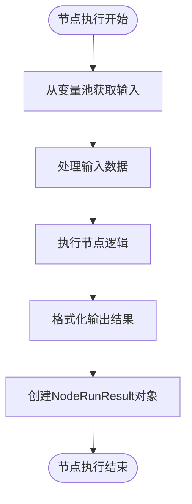

# 节点系统

<cite>
**本文档中引用的文件**  
- [spark_llm_node.py](file://core/workflow/engine/nodes/llm/spark_llm_node.py)
- [knowledge_node.py](file://core/workflow/engine/nodes/knowledge/knowledge_node.py)
- [rpa_node.py](file://core/workflow/engine/nodes/rpa/rpa_node.py)
- [if_else_node.py](file://core/workflow/engine/nodes/if_else/if_else_node.py)
- [decision_node.py](file://core/workflow/engine/nodes/decision/decision_node.py)
- [tool_type.py](file://core/workflow/consts/engine/tool_type.py)
- [base_node.py](file://core/workflow/engine/nodes/base_node.py)
- [node.py](file://core/workflow/engine/node.py)
</cite>

## 目录
1. [引言](#引言)
2. [节点类型分类体系](#节点类型分类体系)
3. [核心节点实现](#核心节点实现)
4. [节点开发指南](#节点开发指南)
5. [架构与执行流程](#架构与执行流程)
6. [错误处理与监控](#错误处理与监控)
7. [结论](#结论)

## 引言

本系统是一个基于工作流的节点式架构，支持多种类型的节点执行，包括大模型交互、知识库检索、自动化执行、条件判断和决策路由等功能。每个节点都遵循统一的执行框架，通过异步执行模式处理输入输出、状态管理和错误传播。系统采用策略模式和模板方法模式来降低复杂性，提高可维护性。

## 节点类型分类体系

节点类型分类体系定义了系统中可用的工具类型，用于区分不同功能的节点。

**图源**  
- [tool_type.py](file://core/workflow/consts/engine/tool_type.py#L1-L20)

**节点类型说明**：
- **TOOL**: 表示通用工具类节点，如RPA自动化执行节点
- **KNOWLEDGE**: 表示知识库相关节点，支持检索增强生成（RAG）

该分类体系通过枚举类实现，为系统提供了清晰的节点类型划分，便于后续扩展和管理。

## 核心节点实现

### LLM节点（spark_llm_node.py）

LLM节点负责与大模型进行交互，支持多种响应格式解析和提示词处理。

**图源**  
- [spark_llm_node.py](file://core/workflow/engine/nodes/llm/spark_llm_node.py#L0-L339)
- [base_node.py](file://core/workflow/engine/nodes/base_node.py#L0-L1385)

**主要功能**：
- 支持文本、Markdown和JSON三种响应格式解析
- 实现提示词模板变量替换功能
- 处理聊天历史记录（支持v1和v2版本）
- 集成图像理解模型配置
- 提供自定义解析器处理特殊字符转义

### 知识库节点（knowledge_node.py）

知识库节点实现检索增强机制，从配置的知识库中检索相关信息。

**图源**  
- [knowledge_node.py](file://core/workflow/engine/nodes/knowledge/knowledge_node.py#L0-L176)

**主要功能**：
- 支持指定检索结果数量（topN）
- 可选择不同的RAG类型（如AIUI-RAG2）
- 支持在特定知识库或文档中搜索
- 设置相似度阈值过滤结果
- 集成聊天历史上下文
- 通过环境变量获取知识库URL

### RPA节点（rpa_node.py）

RPA节点实现自动化执行功能，通过API调用外部RPA服务。

**图源**  
- [rpa_node.py](file://core/workflow/engine/nodes/rpa/rpa_node.py#L0-L166)

**主要功能**：
- 通过项目ID标识执行任务
- 支持自定义请求头（含API密钥）
- 可配置执行位置参数
- 使用SSE流式响应处理
- 实现长时间运行任务的超时控制
- 自动处理流式数据帧

### 条件分支节点（if_else_node.py）

条件分支节点实现逻辑判断功能，支持多条件组合判断。

**图源**  
- [if_else_node.py](file://core/workflow/engine/nodes/if_else/if_else_node.py#L0-L700)

**主要功能**：
- 支持AND和OR逻辑操作符
- 提供16种比较操作符，包括：
  - 字符串操作：包含、不包含、开始于、结束于
  - 相等性判断：等于、不等于、为空、不为空
  - 数值比较：大于、小于、大于等于、小于等于
  - 空值判断：为空、不为空
- 实现短路求值机制
- 支持默认分支处理

### 决策节点（decision_node.py）

决策节点实现多路径选择功能，支持多种执行模式。

**图源**  
- [decision_node.py](file://core/workflow/engine/nodes/decision/decision_node.py#L0-L647)

**主要功能**：
- 支持三种执行模式：
  1. **函数调用模式**：使用Spark Function Call AI进行意图分类
  2. **提示词模式**：使用结构化提示词进行分类
  3. **普通模式**：常规决策逻辑
- 可配置提示词前缀
- 支持自定义意图链配置
- 实现JSON Schema验证
- 提供自定义解析器处理特殊字符

## 节点开发指南

### 输入输出处理

所有节点都继承自`BaseNode`类，需要实现输入输出处理机制。

**关键方法**：
- `get_variable()`: 从变量池获取输入值
- `add_variable()`: 向变量池添加输出值
- `success()`: 创建成功执行结果
- `fail()`: 创建失败执行结果

### 状态管理

节点状态管理通过`VariablePool`和`NodeRunningStatus`实现。

**状态管理要点**：
- 使用事件驱动机制管理节点执行状态
- 支持前置节点和后置节点的依赖关系
- 记录节点执行日志和性能指标
- 支持流式输出的首帧标记

### 错误传播

系统采用统一的错误处理机制，确保错误信息能够正确传播。

**错误处理策略**：
- 使用`CustomException`统一异常类型
- 在执行模板中捕获并处理异常
- 记录详细的错误日志和堆栈信息
- 支持自定义错误码和错误消息

### 性能监控

系统内置性能监控功能，支持详细的执行追踪。

**性能监控特性**：
- 记录节点执行的开始和结束时间
- 跟踪输入输出数据
- 统计Token使用情况
- 记录LLM原始输出
- 支持分布式追踪（SID）
- 提供信息和错误事件记录

## 架构与执行流程

### 整体架构

系统采用分层架构设计，各组件协同工作。

### 执行流程

节点执行遵循模板方法模式，确保一致性。

## 错误处理与监控

### 错误分类

系统定义了多种错误类型，便于问题定位。

**常见错误码**：
- `NODE_RUN_ERROR`: 节点运行通用错误
- `ENG_NODE_PROTOCOL_VALIDATE_ERROR`: 节点协议验证错误
- `LLM_NODE_EXECUTION_ERROR`: LLM节点执行错误
- `KNOWLEDGE_NODE_EXECUTION_ERROR`: 知识库节点执行错误
- `RPA_REQUEST_ERROR`: RPA请求错误
- `IF_ELSE_NODE_EXECUTION_ERROR`: 条件分支节点执行错误

### 监控指标

系统收集多种监控指标，支持性能分析。

| 指标类别 | 具体指标 | 说明 |
|---------|---------|------|
| 执行性能 | 执行时间 | 节点从开始到结束的耗时 |
| 资源使用 | Token消耗 | LLM调用的Token使用量 |
| 错误统计 | 错误次数 | 节点执行失败的次数 |
| 流量指标 | 请求频率 | 单位时间内的调用次数 |
| 成功率 | 成功比例 | 成功执行次数占总次数的比例 |

## 结论

本节点系统提供了一个灵活、可扩展的工作流执行框架，支持多种类型的节点实现。通过统一的基类和执行模板，确保了各节点的一致性和可维护性。系统具备完善的错误处理和性能监控机制，能够满足复杂业务场景的需求。未来可以进一步扩展节点类型，优化执行性能，并增强可视化调试能力。