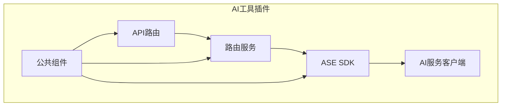
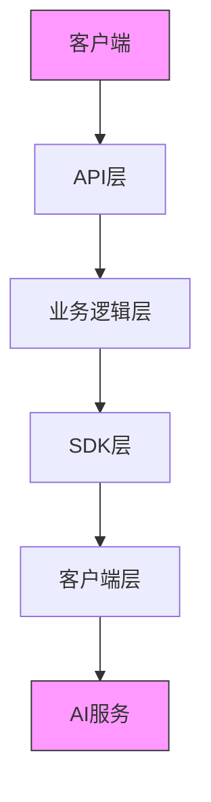
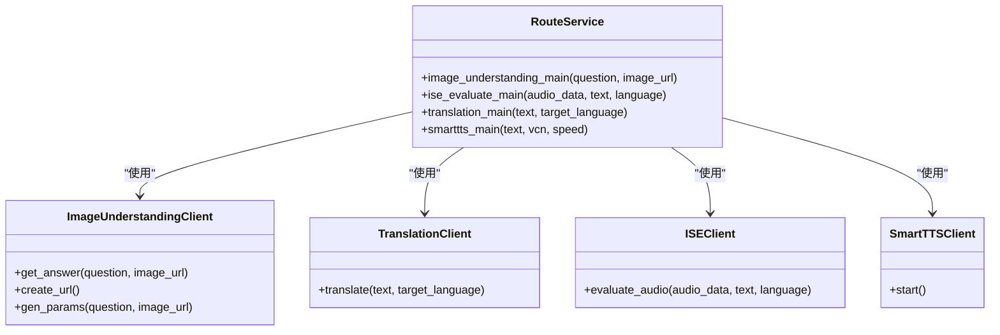
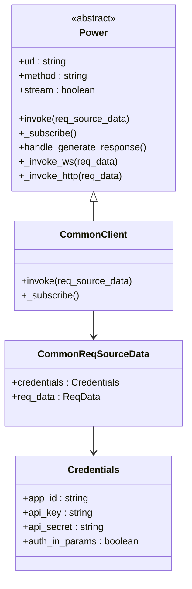
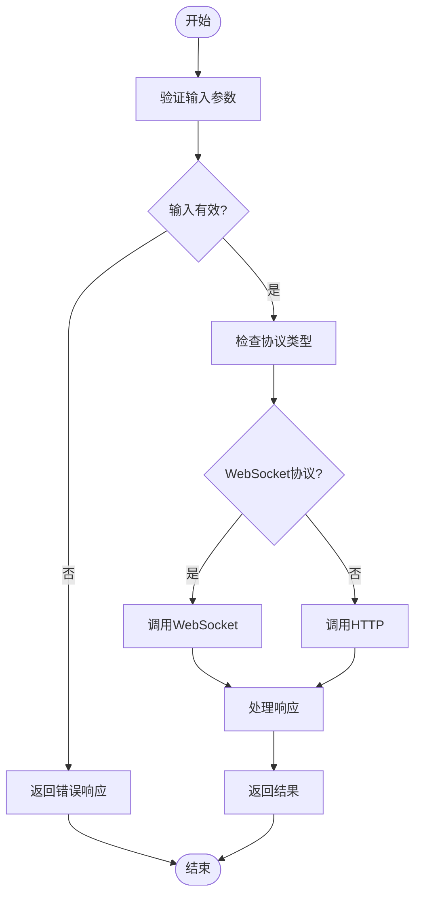
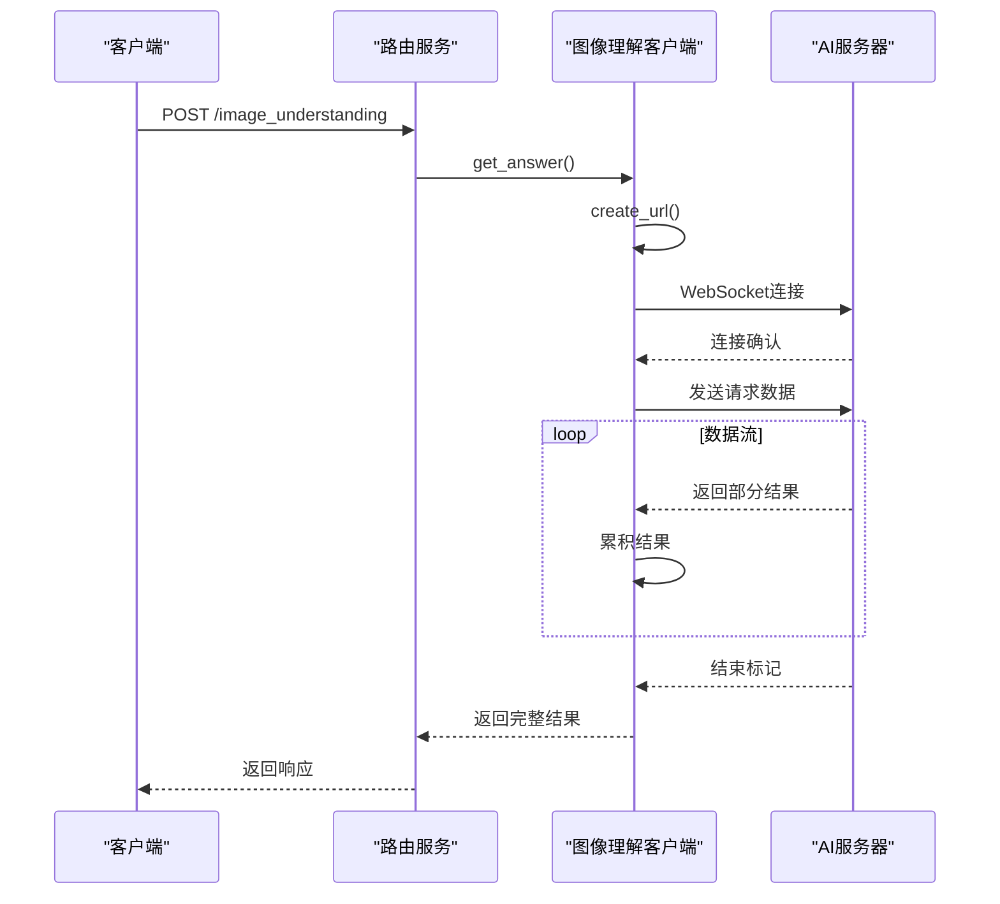
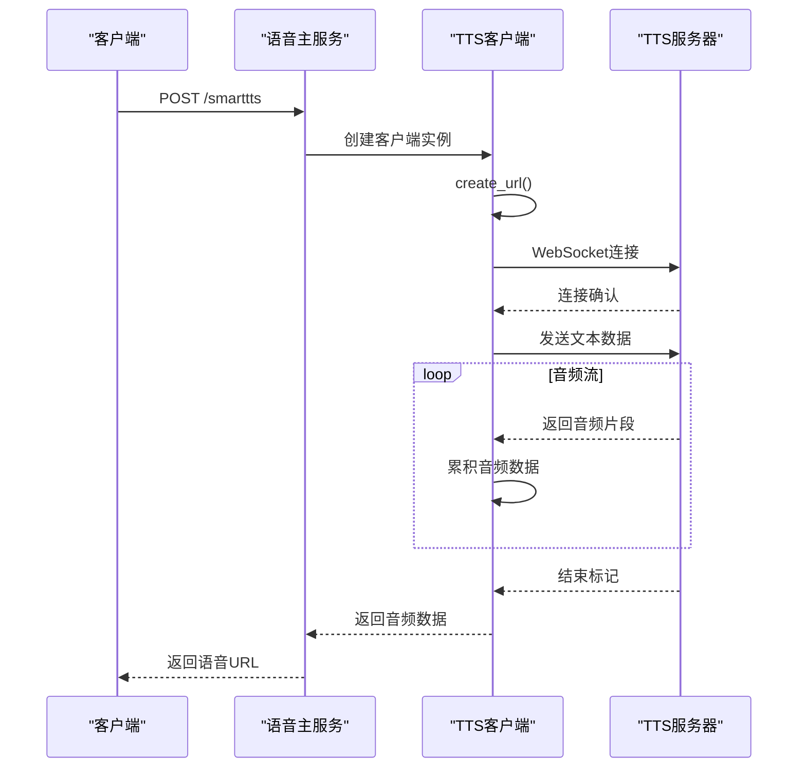
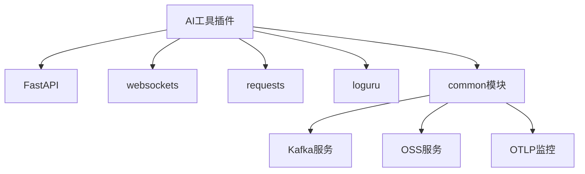

# AI工具插件

<cite>
**本文档引用的文件**
- [main.py](file://core/plugin/aitools/main.py)
- [route.py](file://core/plugin/aitools/api/route.py)
- [route_service.py](file://core/plugin/aitools/service/route_service.py)
- [power.py](file://core/plugin/aitools/service/ase_sdk/__base/power.py)
- [common/client.py](file://core/plugin/aitools/service/ase_sdk/common/client.py)
- [image_understanding_client.py](file://core/plugin/aitools/service/image_understanding/image_understanding_client.py)
- [tts_websocket_client.py](file://core/plugin/aitools/service/speech_synthesis/tts/tts_websocket_client.py)
- [smart_tts_client.py](file://core/plugin/aitools/service/speech_synthesis/smart_tts/smart_tts_client.py)
- [voice_main.py](file://core/plugin/aitools/service/speech_synthesis/voice_main.py)
- [logger.py](file://core/plugin/aitools/common/logger.py)
</cite>

## 目录
1. [简介](#简介)
2. [项目结构](#项目结构)
3. [核心组件](#核心组件)
4. [架构概述](#架构概述)
5. [详细组件分析](#详细组件分析)
6. [依赖分析](#依赖分析)
7. [性能考虑](#性能考虑)
8. [故障排除指南](#故障排除指南)
9. [结论](#结论)

## 简介
AI工具插件是一个集成中心，提供多种AI能力，包括语音合成、图像理解、OCR、翻译等功能。该插件通过路由服务将请求分发到不同的AI服务客户端，并利用ASE SDK与底层AI服务进行通信。插件实现了认证、限流和错误恢复机制，确保服务的稳定性和安全性。

## 项目结构
AI工具插件的项目结构清晰，主要分为以下几个部分：
- `api/`: 定义HTTP接口
- `service/`: 实现业务逻辑
- `common/`: 共享工具和配置
- `const/`: 常量定义
- `tests/`: 测试代码

**图示来源**
- [main.py](file://core/plugin/aitools/main.py)
- [route.py](file://core/plugin/aitools/api/route.py)

**本节来源**
- [main.py](file://core/plugin/aitools/main.py)
- [route.py](file://core/plugin/aitools/api/route.py)

## 核心组件
AI工具插件的核心组件包括路由服务、ASE SDK和各种AI服务客户端。路由服务负责接收HTTP请求并根据请求类型分发到相应的处理函数。ASE SDK提供统一的接口与底层AI服务通信。各个AI服务客户端实现特定AI功能的具体通信协议。

**本节来源**
- [route_service.py](file://core/plugin/aitools/service/route_service.py)
- [power.py](file://core/plugin/aitools/service/ase_sdk/__base/power.py)
- [common/client.py](file://core/plugin/aitools/service/ase_sdk/common/client.py)

## 架构概述
AI工具插件采用分层架构，从上到下分为API层、业务逻辑层、SDK层和客户端层。API层定义HTTP接口，业务逻辑层处理具体业务，SDK层提供统一的通信框架，客户端层实现与具体AI服务的通信。

**图示来源**
- [route.py](file://core/plugin/aitools/api/route.py)
- [route_service.py](file://core/plugin/aitools/service/route_service.py)

## 详细组件分析

### 路由服务分析
路由服务是AI工具插件的核心，负责接收HTTP请求并调用相应的业务逻辑处理函数。

#### 路由服务类图

**图示来源**
- [route_service.py](file://core/plugin/aitools/service/route_service.py)
- [image_understanding_client.py](file://core/plugin/aitools/service/image_understanding/image_understanding_client.py)

### ASE SDK分析
ASE SDK是AI工具插件与底层AI服务通信的核心框架，提供统一的接口和通信机制。

#### ASE SDK类图

**图示来源**
- [power.py](file://core/plugin/aitools/service/ase_sdk/__base/power.py)
- [common/client.py](file://core/plugin/aitools/service/ase_sdk/common/client.py)

#### ASE SDK处理流程

**图示来源**
- [power.py](file://core/plugin/aitools/service/ase_sdk/__base/power.py)

### AI服务客户端分析

#### 图像理解客户端
图像理解客户端通过WebSocket与图像理解服务通信，实现图片内容分析和理解功能。

**图示来源**
- [image_understanding_client.py](file://core/plugin/aitools/service/image_understanding/image_understanding_client.py)

#### TTS WebSocket客户端
TTS WebSocket客户端通过WebSocket协议与语音合成服务通信，实现文本到语音的转换。

**图示来源**
- [tts_websocket_client.py](file://core/plugin/aitools/service/speech_synthesis/tts/tts_websocket_client.py)
- [voice_main.py](file://core/plugin/aitools/service/speech_synthesis/voice_main.py)

**本节来源**
- [image_understanding_client.py](file://core/plugin/aitools/service/image_understanding/image_understanding_client.py)
- [tts_websocket_client.py](file://core/plugin/aitools/service/speech_synthesis/tts/tts_websocket_client.py)
- [voice_main.py](file://core/plugin/aitools/service/speech_synthesis/voice_main.py)

## 依赖分析
AI工具插件依赖多个外部服务和库，包括FastAPI、websockets、requests等。这些依赖关系确保了插件能够与各种AI服务进行通信。

**图示来源**
- [main.py](file://core/plugin/aitools/main.py)
- [route.py](file://core/plugin/aitools/api/route.py)

**本节来源**
- [main.py](file://core/plugin/aitools/main.py)
- [route.py](file://core/plugin/aitools/api/route.py)

## 性能考虑
AI工具插件在设计时考虑了性能因素，包括：
- 使用异步处理提高并发能力
- 通过WebSocket实现流式传输，减少延迟
- 实现连接池和重试机制，提高稳定性
- 使用OSS存储大文件，减轻服务器负担

## 故障排除指南
当AI工具插件出现问题时，可以按照以下步骤进行排查：

1. 检查环境变量配置
2. 查看日志文件
3. 验证网络连接
4. 检查认证信息
5. 测试基础功能

**本节来源**
- [logger.py](file://core/plugin/aitools/common/logger.py)
- [route_service.py](file://core/plugin/aitools/service/route_service.py)

## 结论
AI工具插件成功实现了多种AI能力的集成，通过清晰的架构设计和模块化实现，提供了稳定可靠的AI服务。插件的路由服务、ASE SDK和客户端组件协同工作，为上层应用提供了统一的AI能力接口。未来可以进一步优化性能，增加更多AI功能。