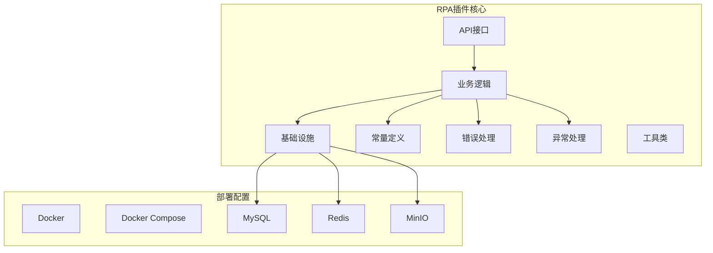
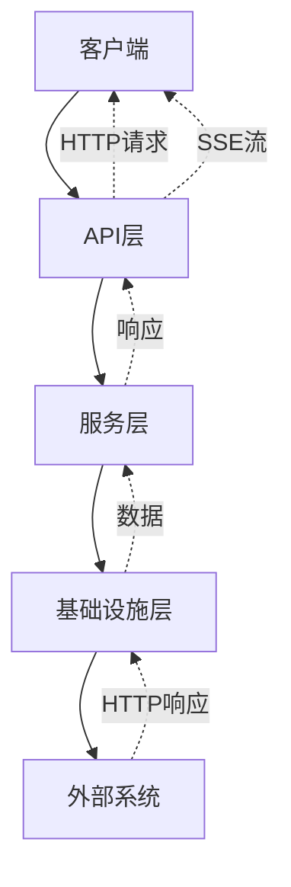
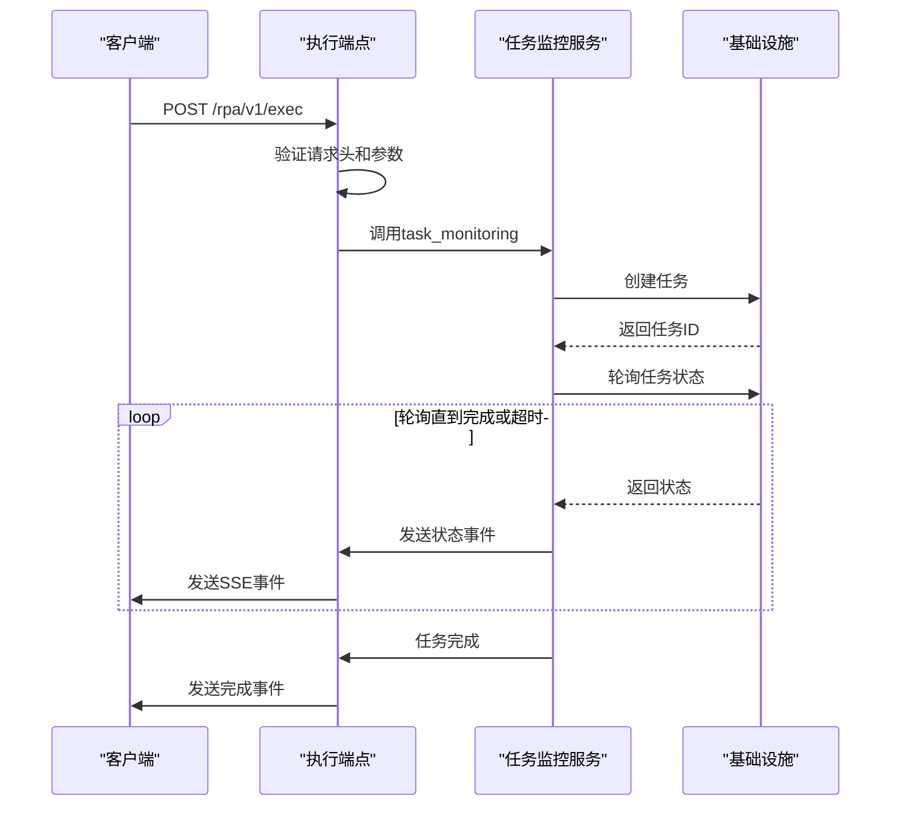
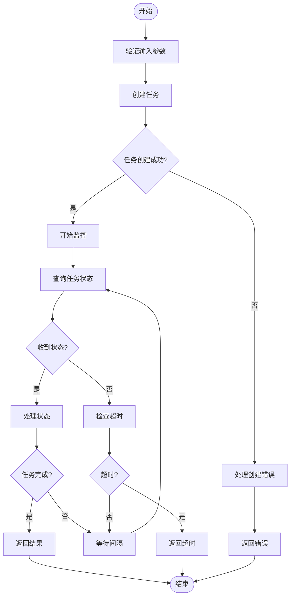
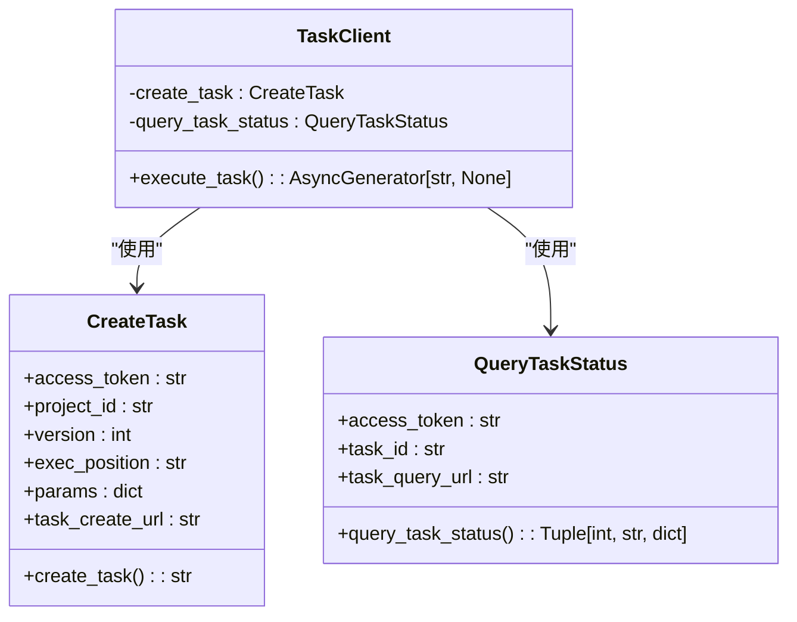
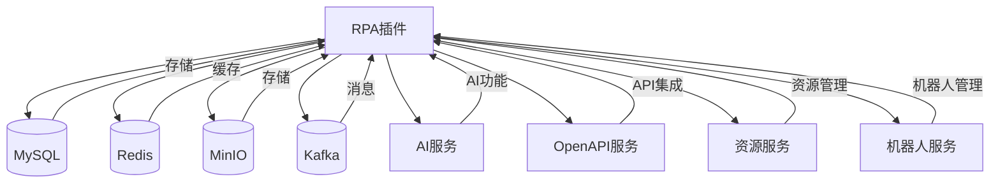

# RPA插件

<cite>
**本文档中引用的文件**   
- [main.py](file://core/plugin/rpa/main.py)
- [app.py](file://core/plugin/rpa/api/app.py)
- [router.py](file://core/plugin/rpa/api/router.py)
- [execution.py](file://core/plugin/rpa/api/v1/execution.py)
- [process.py](file://core/plugin/rpa/service/xiaowu/process.py)
- [tasks.py](file://core/plugin/rpa/infra/xiaowu/tasks.py)
- [execution_schema.py](file://core/plugin/rpa/api/schemas/execution_schema.py)
- [const.py](file://core/plugin/rpa/consts/const.py)
- [error_code.py](file://core/plugin/rpa/errors/error_code.py)
- [config_exceptions.py](file://core/plugin/rpa/exceptions/config_exceptions.py)
- [docker-compose.yml](file://docker/astronAgent/astronRPA/docker-compose.yml)
- [schema.sql](file://docker/astronAgent/astronRPA/volumes/mysql/schema.sql)
</cite>

## 目录
1. [简介](#简介)
2. [项目结构](#项目结构)
3. [核心组件](#核心组件)
4. [架构概述](#架构概述)
5. [详细组件分析](#详细组件分析)
6. [依赖分析](#依赖分析)
7. [性能考虑](#性能考虑)
8. [故障排除指南](#故障排除指南)
9. [结论](#结论)

## 简介
RPA插件是一个自动化机器人执行引擎，通过HTTP API接收执行请求，并使用Celery任务队列调度机器人任务。该插件提供了完整的机器人自动化解决方案，包括任务创建、状态监控、错误处理和结果返回。系统通过FastAPI框架提供RESTful API接口，支持流式响应，能够实时返回任务执行状态和结果。

## 项目结构
RPA插件的项目结构遵循模块化设计原则，将不同功能分离到独立的目录中。核心功能位于`core/plugin/rpa`目录下，包含API接口、业务逻辑、基础设施和常量定义等模块。部署配置位于`docker/astronAgent/astronRPA`目录下，使用Docker Compose进行服务编排。

**Diagram sources**
- [main.py](file://core/plugin/rpa/main.py)
- [docker-compose.yml](file://docker/astronAgent/astronRPA/docker-compose.yml)

**Section sources**
- [main.py](file://core/plugin/rpa/main.py)
- [docker-compose.yml](file://docker/astronAgent/astronRPA/docker-compose.yml)

## 核心组件
RPA插件的核心组件包括执行端点、任务监控、任务创建和查询功能。执行端点通过HTTP API接收请求，验证请求参数后分发任务。任务监控组件负责轮询任务状态，直到任务完成或超时。任务创建和查询功能通过HTTP客户端与后端服务通信，实现任务的生命周期管理。

**Section sources**
- [execution.py](file://core/plugin/rpa/api/v1/execution.py)
- [process.py](file://core/plugin/rpa/service/xiaowu/process.py)
- [tasks.py](file://core/plugin/rpa/infra/xiaowu/tasks.py)

## 架构概述
RPA插件采用分层架构设计，包括API层、服务层和基础设施层。API层负责接收和响应HTTP请求，服务层处理业务逻辑，基础设施层提供与外部系统的集成。系统使用事件驱动架构，通过流式响应实时推送任务状态更新。

**Diagram sources**
- [app.py](file://core/plugin/rpa/api/app.py)
- [router.py](file://core/plugin/rpa/api/router.py)

## 详细组件分析

### 执行端点分析
执行端点是RPA插件的主要入口，负责接收执行请求并启动任务监控流程。该端点使用FastAPI框架实现，支持流式响应，能够实时返回任务执行状态。

#### 执行端点实现

**Diagram sources**
- [execution.py](file://core/plugin/rpa/api/v1/execution.py)
- [process.py](file://core/plugin/rpa/service/xiaowu/process.py)

**Section sources**
- [execution.py](file://core/plugin/rpa/api/v1/execution.py)
- [process.py](file://core/plugin/rpa/service/xiaowu/process.py)

### 业务逻辑处理分析
业务逻辑处理组件负责任务监控的核心逻辑，包括任务创建、状态轮询、超时处理和结果返回。该组件实现了健壮的错误处理机制，能够处理各种异常情况。

#### 任务监控流程

**Diagram sources**
- [process.py](file://core/plugin/rpa/service/xiaowu/process.py)
- [tasks.py](file://core/plugin/rpa/infra/xiaowu/tasks.py)

**Section sources**
- [process.py](file://core/plugin/rpa/service/xiaowu/process.py)
- [tasks.py](file://core/plugin/rpa/infra/xiaowu/tasks.py)

### 异步任务实现分析
异步任务实现组件负责与后端服务通信，创建和查询任务。该组件使用异步HTTP客户端，能够高效地处理大量并发请求。

#### 任务创建和查询

**Diagram sources**
- [tasks.py](file://core/plugin/rpa/infra/xiaowu/tasks.py)
- [process.py](file://core/plugin/rpa/service/xiaowu/process.py)

**Section sources**
- [tasks.py](file://core/plugin/rpa/infra/xiaowu/tasks.py)
- [process.py](file://core/plugin/rpa/service/xiaowu/process.py)

## 依赖分析
RPA插件依赖多个外部服务和库，包括数据库、缓存、对象存储和消息队列。这些依赖通过Docker Compose进行管理，确保服务之间的正确连接和配置。

**Diagram sources**
- [docker-compose.yml](file://docker/astronAgent/astronRPA/docker-compose.yml)
- [schema.sql](file://docker/astronAgent/astronRPA/volumes/mysql/schema.sql)

**Section sources**
- [docker-compose.yml](file://docker/astronAgent/astronRPA/docker-compose.yml)
- [schema.sql](file://docker/astronAgent/astronRPA/volumes/mysql/schema.sql)

## 性能考虑
RPA插件在设计时考虑了性能优化，包括异步处理、连接池、缓存和批量操作。系统使用Uvicorn服务器，支持多工作进程，能够处理高并发请求。任务监控采用轮询间隔配置，避免过于频繁的请求。

## 故障排除指南
当RPA插件出现问题时，可以按照以下步骤进行排查：
1. 检查服务是否正常启动
2. 验证环境变量配置
3. 查看日志文件
4. 检查数据库连接
5. 验证外部服务可用性

**Section sources**
- [config_exceptions.py](file://core/plugin/rpa/exceptions/config_exceptions.py)
- [error_code.py](file://core/plugin/rpa/errors/error_code.py)

## 结论
RPA插件提供了一个完整的自动化机器人执行解决方案，具有良好的架构设计和健壮的错误处理机制。通过HTTP API和流式响应，系统能够实时返回任务执行状态，为用户提供良好的使用体验。插件的模块化设计使其易于扩展和维护，适合各种自动化场景。