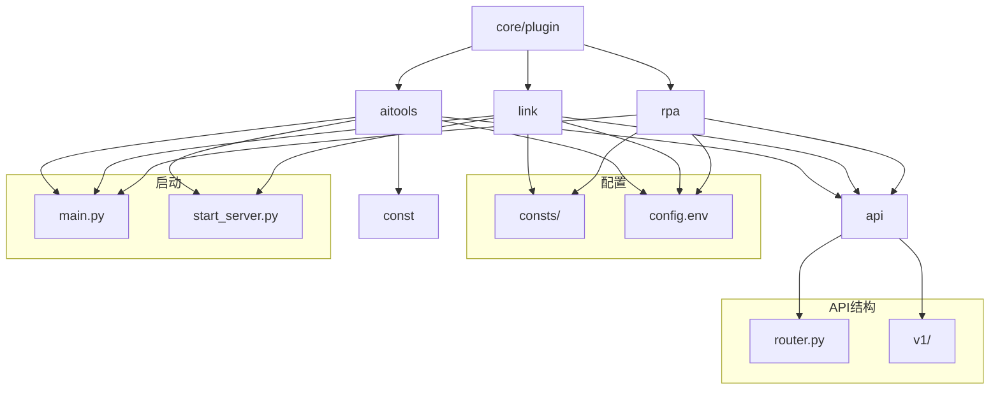
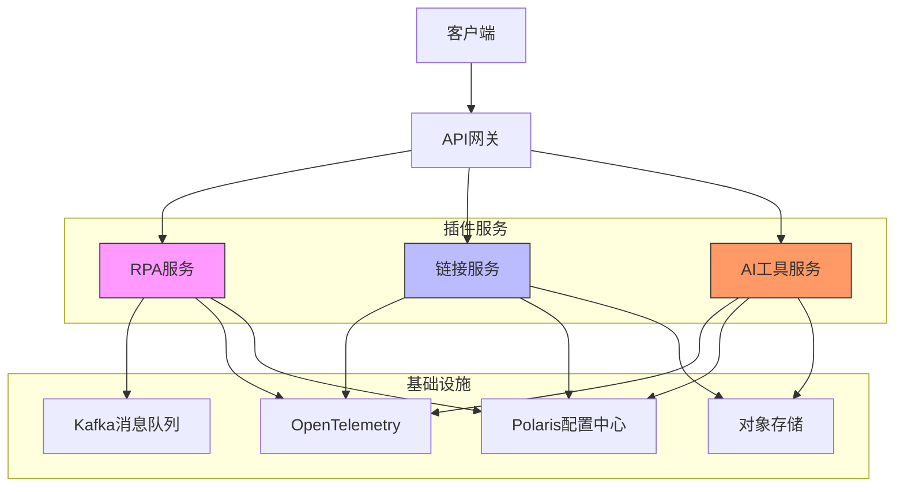
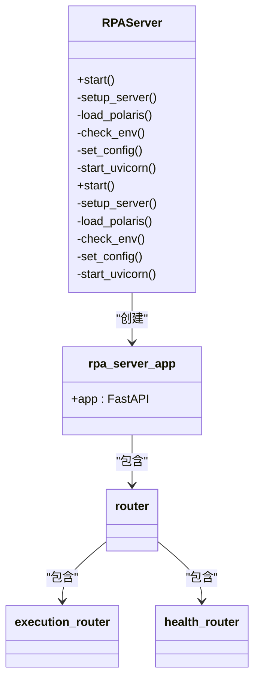
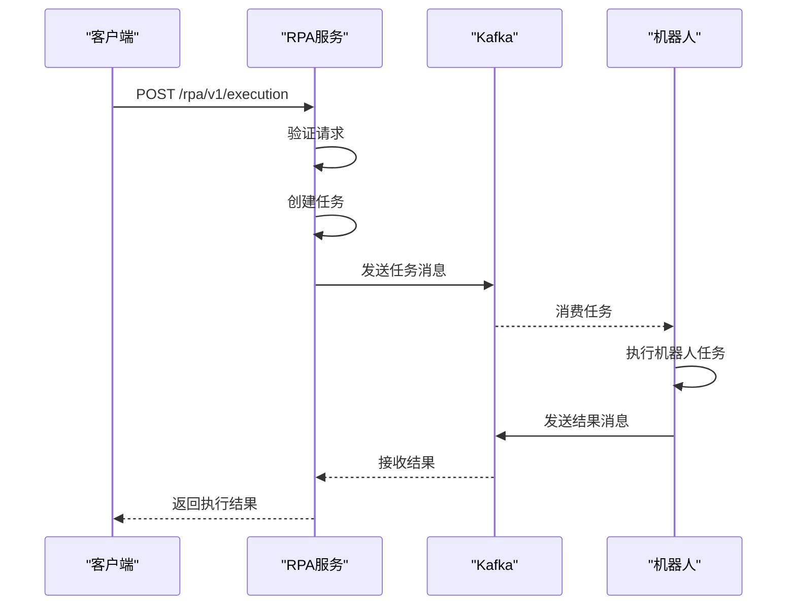
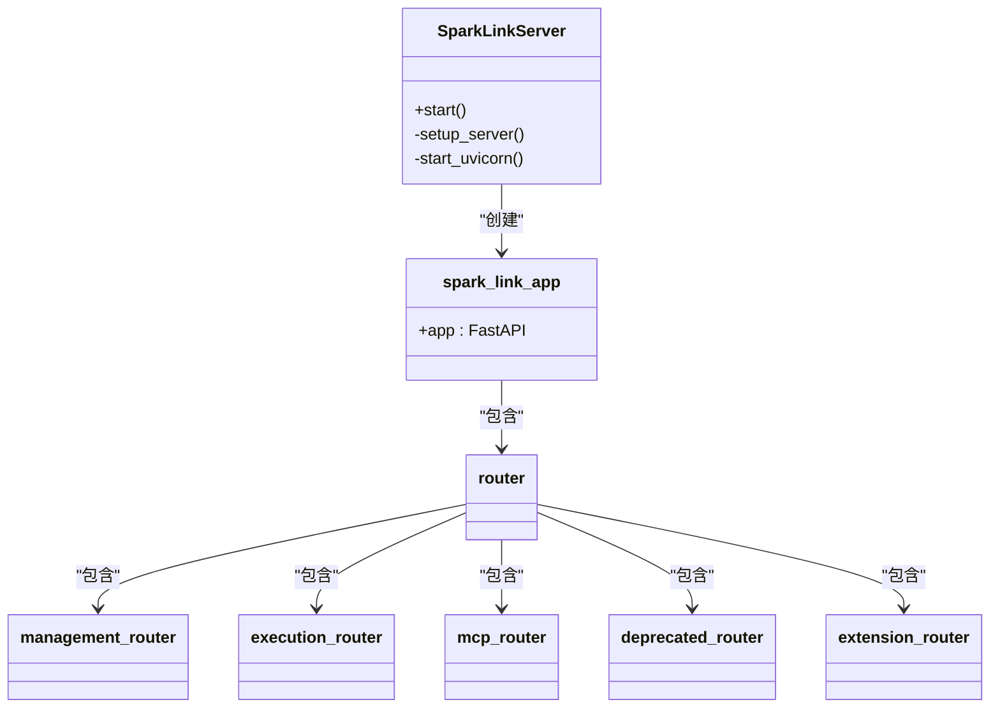
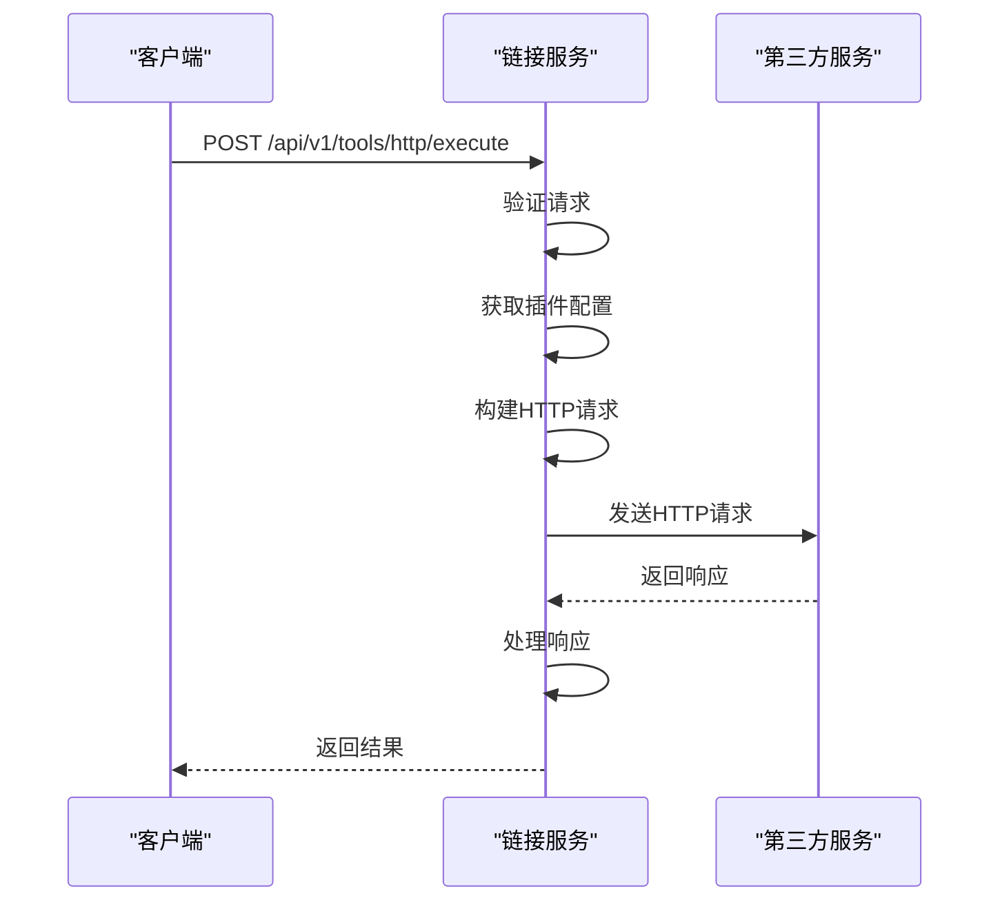
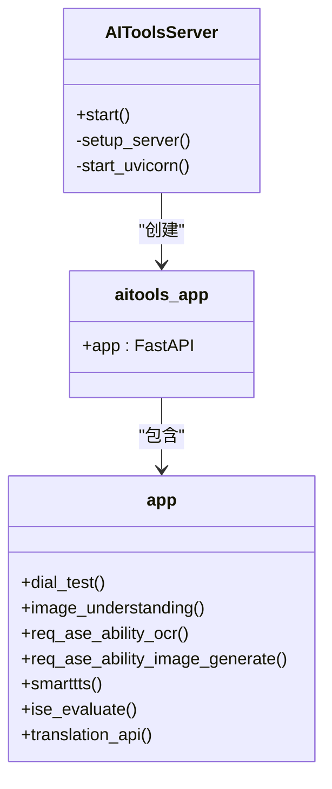
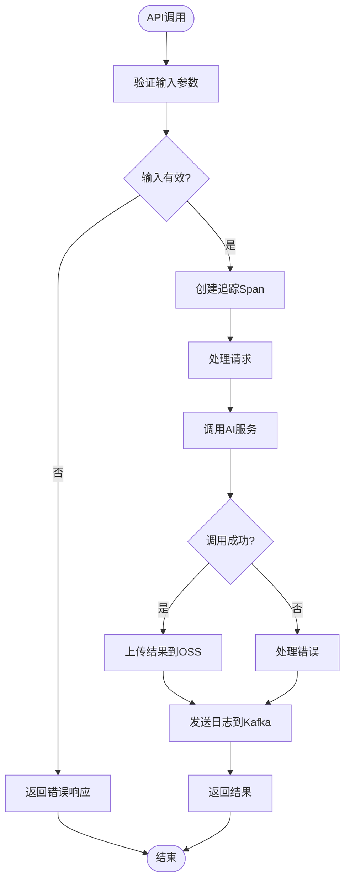
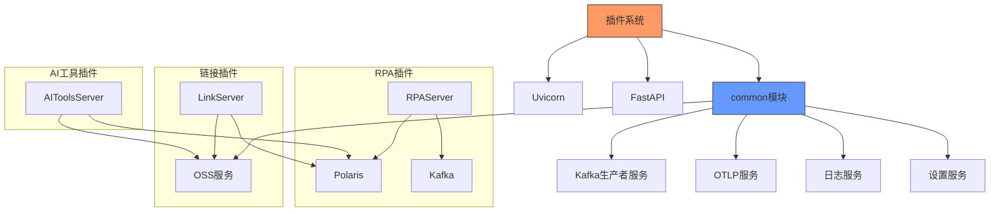

# 插件系统

<cite>
**本文档引用的文件**
- [main.py](file://core/plugin/rpa/main.py)
- [app.py](file://core/plugin/rpa/api/app.py)
- [router.py](file://core/plugin/rpa/api/router.py)
- [execution.py](file://core/plugin/rpa/api/v1/execution.py)
- [main.py](file://core/plugin/link/main.py)
- [start_server.py](file://core/plugin/link/app/start_server.py)
- [router.py](file://core/plugin/link/api/router.py)
- [management.py](file://core/plugin/link/api/v1/community/tools/http/management.py)
- [execution.py](file://core/plugin/link/api/v1/community/tools/http/execution.py)
- [main.py](file://core/plugin/aitools/main.py)
- [start_server.py](file://core/plugin/aitools/app/start_server.py)
- [route.py](file://core/plugin/aitools/api/route.py)
- [const.py](file://core/plugin/aitools/const/const.py)
- [config.env](file://core/plugin/rpa/config.env)
- [config.env](file://core/plugin/link/config.env)
- [config.env](file://core/plugin/aitools/config.env)
</cite>

## 目录
1. [简介](#简介)
2. [项目结构](#项目结构)
3. [核心组件](#核心组件)
4. [架构概述](#架构概述)
5. [详细组件分析](#详细组件分析)
6. [依赖分析](#依赖分析)
7. [性能考虑](#性能考虑)
8. [故障排除指南](#故障排除指南)
9. [结论](#结论)

## 简介
插件系统是Astron Agent平台的核心扩展能力中心，支持RPA、AI工具和外部链接三种插件类型。该系统为平台提供了灵活的扩展机制，允许通过插件集成各种功能和服务。RPA插件通过消息队列调度机器人任务，AI工具插件实现语音合成、图像理解等AI能力，链接插件则安全地调用第三方HTTP服务。系统提供了完整的插件注册、发现和调用生命周期管理，并确保插件的安全性、隔离性和可观测性。

## 项目结构
插件系统在代码库中以`core/plugin`目录为核心，包含三种主要插件类型的独立实现：RPA、链接和AI工具。每种插件类型都有独立的目录结构，包含API接口、常量定义、服务实现和配置文件。系统采用微服务架构，每个插件类型作为一个独立的服务运行，通过FastAPI框架提供HTTP接口。

**图示来源**
- [main.py](file://core/plugin/rpa/main.py)
- [config.env](file://core/plugin/rpa/config.env)

**本节来源**
- [core/plugin](file://core/plugin)

## 核心组件
插件系统的核心组件包括三种插件类型：RPA插件、AI工具插件和链接插件。每种插件类型都有独立的API设计规范、认证机制和执行模型。RPA插件通过消息队列调度机器人任务，AI工具插件实现语音合成、图像理解等AI能力，链接插件则安全地调用第三方HTTP服务。系统通过统一的插件注册、发现和调用机制管理所有插件的生命周期。

**本节来源**
- [main.py](file://core/plugin/rpa/main.py)
- [main.py](file://core/plugin/link/main.py)
- [main.py](file://core/plugin/aitools/main.py)

## 架构概述
插件系统采用微服务架构，每种插件类型作为一个独立的服务运行。系统通过FastAPI框架提供RESTful API接口，使用Uvicorn作为ASGI服务器。服务启动时会初始化必要的服务套件，包括日志服务、OTLP服务和Kafka生产者服务。系统支持通过Polaris配置中心进行远程配置管理，确保配置的一致性和可维护性。

**图示来源**
- [app.py](file://core/plugin/rpa/api/app.py)
- [start_server.py](file://core/plugin/link/app/start_server.py)
- [start_server.py](file://core/plugin/aitools/app/start_server.py)

## 详细组件分析

### RPA插件分析
RPA插件负责调度和执行机器人任务。系统通过消息队列实现任务的异步处理，确保高可用性和可扩展性。RPA服务提供健康检查和任务执行API接口，支持对机器人任务的全生命周期管理。

#### RPA服务类图

**图示来源**
- [app.py](file://core/plugin/rpa/api/app.py)
- [router.py](file://core/plugin/rpa/api/router.py)

#### RPA任务执行序列图

**图示来源**
- [execution.py](file://core/plugin/rpa/api/v1/execution.py)
- [app.py](file://core/plugin/rpa/api/app.py)

**本节来源**
- [main.py](file://core/plugin/rpa/main.py)
- [app.py](file://core/plugin/rpa/api/app.py)
- [router.py](file://core/plugin/rpa/api/router.py)

### 链接插件分析
链接插件负责安全地调用第三方HTTP服务。系统提供HTTP工具管理和执行API接口，支持插件的创建、更新、删除和执行。链接服务支持MCP（Model Context Protocol）工具，允许与外部服务进行深度集成。

#### 链接服务类图

**图示来源**
- [start_server.py](file://core/plugin/link/app/start_server.py)
- [router.py](file://core/plugin/link/api/router.py)

#### 链接插件执行序列图

**图示来源**
- [execution.py](file://core/plugin/link/api/v1/community/tools/http/execution.py)
- [start_server.py](file://core/plugin/link/app/start_server.py)

**本节来源**
- [main.py](file://core/plugin/link/main.py)
- [start_server.py](file://core/plugin/link/app/start_server.py)
- [router.py](file://core/plugin/link/api/router.py)

### AI工具插件分析
AI工具插件提供各种AI能力，包括OCR文本识别、图像生成、图像理解、语音合成和语音评测。系统通过调用底层AI服务实现这些功能，并提供统一的API接口供上层应用使用。

#### AI工具服务类图

**图示来源**
- [start_server.py](file://core/plugin/aitools/app/start_server.py)
- [route.py](file://core/plugin/aitools/api/route.py)

#### AI工具调用流程图

**图示来源**
- [route.py](file://core/plugin/aitools/api/route.py)
- [const.py](file://core/plugin/aitools/const/const.py)

**本节来源**
- [main.py](file://core/plugin/aitools/main.py)
- [start_server.py](file://core/plugin/aitools/app/start_server.py)
- [route.py](file://core/plugin/aitools/api/route.py)

## 依赖分析
插件系统依赖于多个核心服务和外部组件。系统通过`common`模块提供的服务初始化功能，加载必要的服务套件，包括设置服务、日志服务、OTLP服务和Kafka生产者服务。每种插件类型都有特定的环境变量配置，通过`config.env`文件进行管理。

**图示来源**
- [app.py](file://core/plugin/rpa/api/app.py)
- [start_server.py](file://core/plugin/link/app/start_server.py)
- [start_server.py](file://core/plugin/aitools/app/start_server.py)

**本节来源**
- [app.py](file://core/plugin/rpa/api/app.py)
- [start_server.py](file://core/plugin/link/app/start_server.py)
- [start_server.py](file://core/plugin/aitools/app/start_server.py)

## 性能考虑
插件系统在设计时充分考虑了性能因素。系统使用Uvicorn作为ASGI服务器，配置了20个工作进程，以充分利用多核CPU的处理能力。对于RPA插件，系统通过Kafka消息队列实现任务的异步处理，避免了请求阻塞。AI工具插件在处理大文件时，会将结果上传到OSS对象存储，并返回URL引用，减少了响应数据的传输量。所有服务都集成了OpenTelemetry，提供了详细的性能监控和追踪能力。

## 故障排除指南
当插件系统出现问题时，可以按照以下步骤进行排查：

1. **检查服务启动**: 确认服务是否正常启动，查看启动日志中是否有错误信息。
2. **验证环境变量**: 检查`config.env`文件中的环境变量是否正确配置，特别是服务端口、日志路径等关键配置。
3. **检查依赖服务**: 确认Polaris配置中心、Kafka消息队列、OSS对象存储等依赖服务是否正常运行。
4. **查看日志文件**: 检查服务日志文件，定位具体的错误信息。
5. **验证API接口**: 使用工具如curl或Postman测试API接口，确认接口是否正常工作。

**本节来源**
- [app.py](file://core/plugin/rpa/api/app.py)
- [start_server.py](file://core/plugin/link/app/start_server.py)
- [start_server.py](file://core/plugin/aitools/app/start_server.py)

## 结论
插件系统作为Astron Agent平台的扩展能力中心，提供了灵活、安全和可扩展的插件架构。通过RPA、AI工具和链接三种插件类型，系统能够集成各种功能和服务，满足不同场景的需求。系统采用微服务架构，确保了高可用性和可维护性。通过统一的API设计规范、认证机制和执行模型，系统为开发者提供了清晰的开发指南。未来可以进一步优化插件的隔离机制，增强安全性，并提供更丰富的开发工具和文档支持。