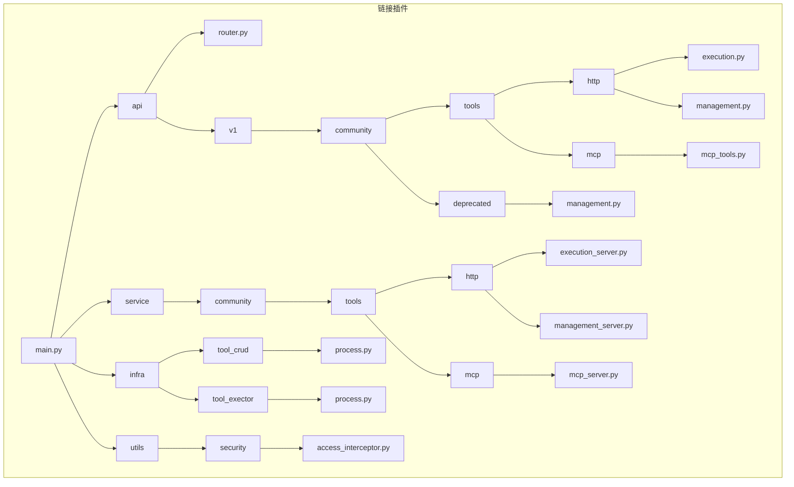
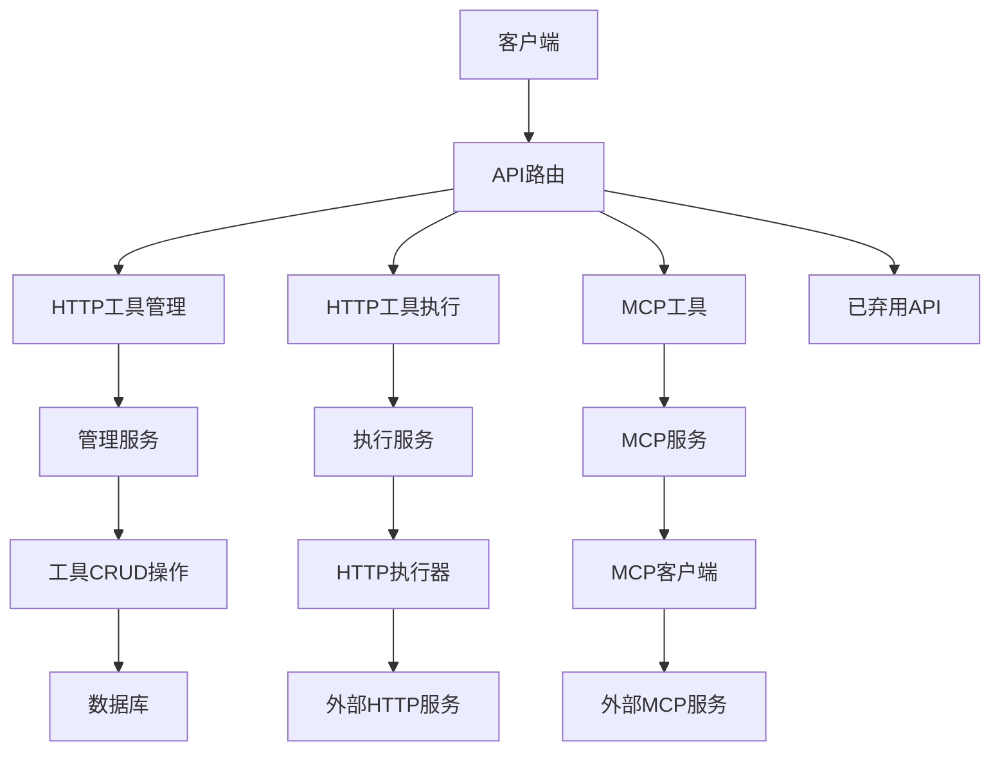
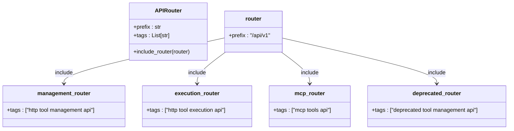
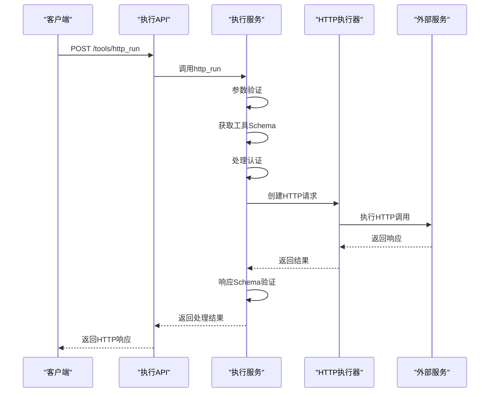
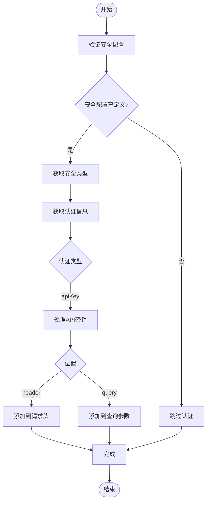
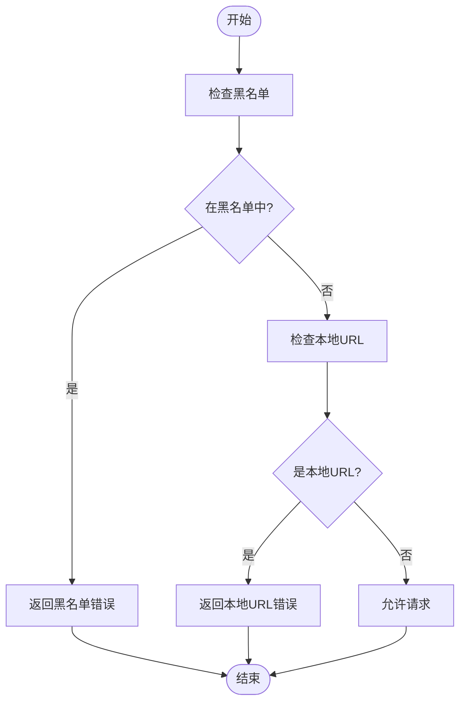
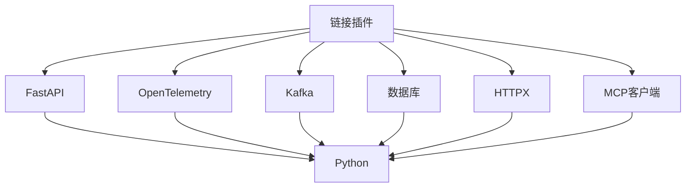

# 链接插件

<cite>
**本文档引用的文件**   
- [main.py](file://core/plugin/link/main.py)
- [router.py](file://core/plugin/link/api/router.py)
- [execution.py](file://core/plugin/link/api/v1/community/tools/http/execution.py)
- [management.py](file://core/plugin/link/api/v1/community/tools/http/management.py)
- [mcp_tools.py](file://core/plugin/link/api/v1/community/tools/mcp/mcp_tools.py)
- [execution_server.py](file://core/plugin/link/service/community/tools/http/execution_server.py)
- [management_server.py](file://core/plugin/link/service/community/tools/http/management_server.py)
- [mcp_server.py](file://core/plugin/link/service/community/tools/mcp/mcp_server.py)
- [process.py](file://core/plugin/link/infra/tool_crud/process.py)
- [process.py](file://core/plugin/link/infra/tool_exector/process.py)
- [access_interceptor.py](file://core/plugin/link/utils/security/access_interceptor.py)
</cite>

## 目录
1. [简介](#简介)
2. [项目结构](#项目结构)
3. [核心组件](#核心组件)
4. [架构概述](#架构概述)
5. [详细组件分析](#详细组件分析)
6. [依赖分析](#依赖分析)
7. [性能考虑](#性能考虑)
8. [故障排除指南](#故障排除指南)
9. [结论](#结论)

## 简介
链接插件是astron-agent系统中的关键组件，作为第三方服务集成的桥梁，提供安全调用外部HTTP服务的能力。该插件通过标准化的API接口，实现了工具注册、更新和执行请求的完整生命周期管理。插件系统支持HTTP工具和MCP（Model Context Protocol）工具两种集成模式，为应用程序提供了灵活的外部服务调用能力。

## 项目结构
链接插件的项目结构遵循模块化设计原则，将不同功能分离到独立的目录中。核心功能分布在api、service、infra和utils等目录中，实现了关注点分离。api目录包含所有API路由定义，service目录包含业务逻辑实现，infra目录包含基础设施组件，而utils目录包含各种实用工具。

**图示来源**
- [main.py](file://core/plugin/link/main.py)
- [router.py](file://core/plugin/link/api/router.py)

## 核心组件
链接插件的核心组件包括API路由系统、HTTP请求执行逻辑、认证机制、安全访问控制策略等。这些组件协同工作，确保外部服务调用的安全性、可靠性和可追踪性。插件通过OpenAPI规范定义工具接口，支持JSON Schema验证，实现了严格的输入输出校验。

**组件来源**
- [main.py](file://core/plugin/link/main.py#L1-L163)
- [router.py](file://core/plugin/link/api/router.py#L1-L35)

## 架构概述
链接插件采用分层架构设计，从上到下分为API层、服务层、基础设施层和工具执行层。API层负责接收和路由请求，服务层处理业务逻辑，基础设施层提供数据库访问和工具管理功能，工具执行层负责实际的HTTP请求处理。

**图示来源**
- [router.py](file://core/plugin/link/api/router.py#L1-L35)
- [execution_server.py](file://core/plugin/link/service/community/tools/http/execution_server.py#L1-L799)
- [management_server.py](file://core/plugin/link/service/community/tools/http/management_server.py#L1-L604)

## 详细组件分析

### API路由设计
链接插件的API路由设计遵循RESTful原则，将不同功能组织到独立的路由器中。主路由器配置在router.py文件中，包含了HTTP工具管理、HTTP工具执行、MCP工具和已弃用API等多个子路由器。这种模块化设计提高了代码的可维护性和可扩展性。

**图示来源**
- [router.py](file://core/plugin/link/api/router.py#L1-L35)
- [management.py](file://core/plugin/link/api/v1/community/tools/http/management.py#L1-L59)
- [execution.py](file://core/plugin/link/api/v1/community/tools/http/execution.py#L1-L38)

**组件来源**
- [router.py](file://core/plugin/link/api/router.py#L1-L35)

### HTTP请求执行逻辑
HTTP请求执行逻辑实现在execution_server.py文件中，包含http_run和tool_debug两个核心函数。系统通过OpenAPI规范验证请求参数，处理认证信息，并执行HTTP调用。执行过程中，系统会记录详细的调用日志和追踪信息，便于问题排查和性能分析。

**图示来源**
- [execution.py](file://core/plugin/link/api/v1/community/tools/http/execution.py#L1-L38)
- [execution_server.py](file://core/plugin/link/service/community/tools/http/execution_server.py#L1-L799)

**组件来源**
- [execution_server.py](file://core/plugin/link/service/community/tools/http/execution_server.py#L1-L799)

### 认证机制
链接插件的认证机制主要通过OpenAPI规范中的security字段实现。系统支持apiKey类型的认证，可以将认证信息放置在请求头或查询参数中。在执行HTTP请求前，系统会根据工具定义的认证要求，自动将预配置的认证值添加到请求中。

**图示来源**
- [execution_server.py](file://core/plugin/link/service/community/tools/http/execution_server.py#L1-L799)
- [process.py](file://core/plugin/link/infra/tool_exector/process.py#L1-L100)

**组件来源**
- [execution_server.py](file://core/plugin/link/service/community/tools/http/execution_server.py#L1-L799)

### 安全访问控制策略
安全访问控制策略实现在access_interceptor.py文件中，主要包括黑名单检查和本地地址过滤功能。系统会检查请求的URL是否在黑名单中，以及是否为本地地址（如localhost、127.0.0.1等），以防止对内部服务的意外访问。

**图示来源**
- [access_interceptor.py](file://core/plugin/link/utils/security/access_interceptor.py#L1-L50)
- [mcp_server.py](file://core/plugin/link/service/community/tools/mcp/mcp_server.py#L1-L519)

**组件来源**
- [access_interceptor.py](file://core/plugin/link/utils/security/access_interceptor.py#L1-L50)

### 敏感信息保护
链接插件通过多种机制保护敏感信息。首先，所有认证信息都存储在安全的配置中，不会在日志或响应中明文显示。其次，系统使用Base64编码传输请求参数，增加了信息的安全性。最后，通过严格的访问控制策略，防止对敏感内部服务的访问。

### 调用链追踪
链接插件集成了完整的调用链追踪系统，使用OpenTelemetry标准记录每个请求的完整生命周期。系统会生成唯一的会话ID（sid），并将其传递到所有相关组件中，便于跨服务的请求追踪。所有关键操作都会记录到Kafka主题中，用于后续的分析和监控。

### 错误处理
链接插件实现了分层的错误处理机制。系统定义了详细的错误代码（ErrCode），涵盖了从参数验证错误到外部服务调用失败的各种情况。每个错误都有明确的错误消息和代码，便于客户端理解和处理。错误信息会通过标准化的响应格式返回，并记录到追踪系统中。

## 依赖分析
链接插件依赖于多个核心组件和外部服务。主要依赖包括FastAPI框架、OpenTelemetry追踪系统、Kafka消息队列、数据库存储等。这些依赖通过清晰的接口定义，确保了系统的可维护性和可测试性。

**图示来源**
- [main.py](file://core/plugin/link/main.py#L1-L163)
- [execution_server.py](file://core/plugin/link/service/community/tools/http/execution_server.py#L1-L799)
- [management_server.py](file://core/plugin/link/service/community/tools/http/management_server.py#L1-L604)

**组件来源**
- [main.py](file://core/plugin/link/main.py#L1-L163)

## 性能考虑
链接插件在设计时充分考虑了性能因素。通过异步IO操作，系统能够高效处理大量并发请求。使用连接池和缓存机制，减少了数据库访问的开销。同时，通过合理的错误处理和超时设置，避免了单个慢请求影响整个系统的性能。

## 故障排除指南
当链接插件出现问题时，可以按照以下步骤进行排查：首先检查API响应码和错误消息，确定问题类型；然后查看日志中的详细信息，特别是会话ID（sid）相关的追踪信息；最后根据错误类型，检查相应的配置和依赖服务状态。

**组件来源**
- [execution_server.py](file://core/plugin/link/service/community/tools/http/execution_server.py#L1-L799)
- [management_server.py](file://core/plugin/link/service/community/tools/http/management_server.py#L1-L604)

## 结论
链接插件作为astron-agent系统的关键组件，提供了安全、可靠、可追踪的第三方服务集成能力。通过模块化的设计和严格的错误处理，插件能够满足生产环境的高要求。未来可以进一步优化性能，增加更多的安全特性，为系统提供更强大的集成能力。