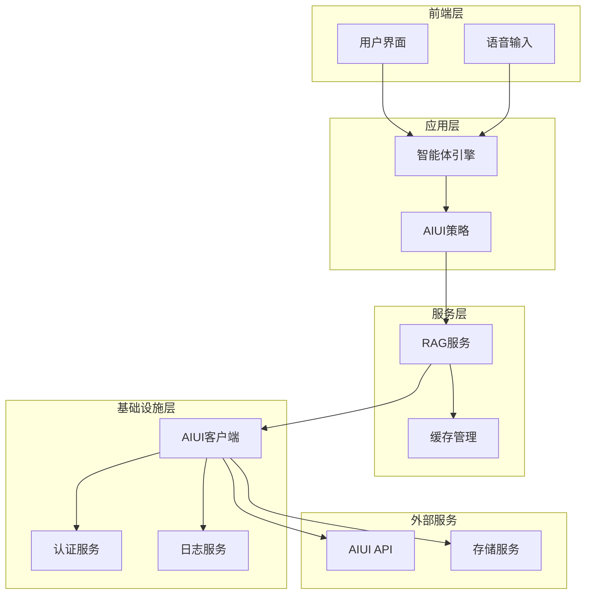
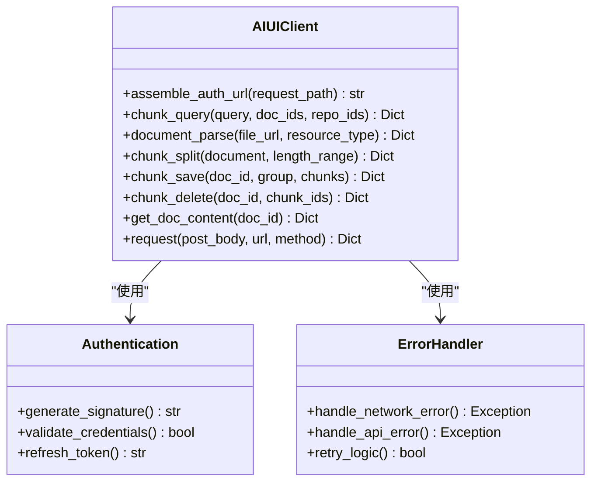
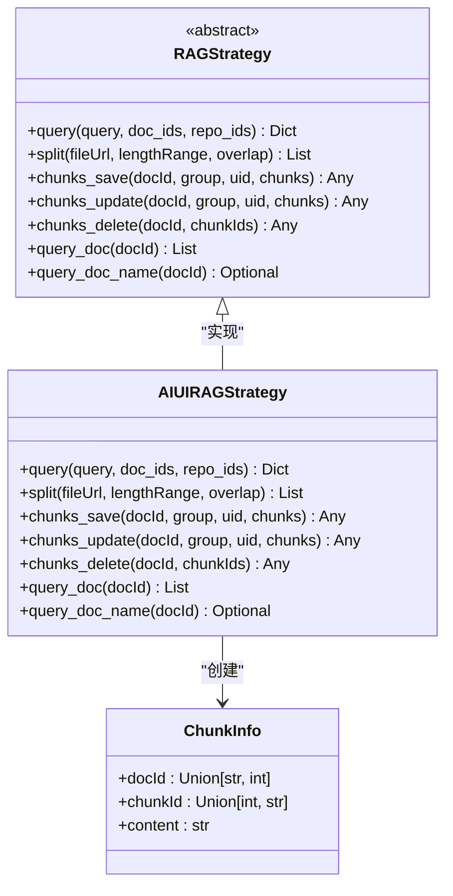
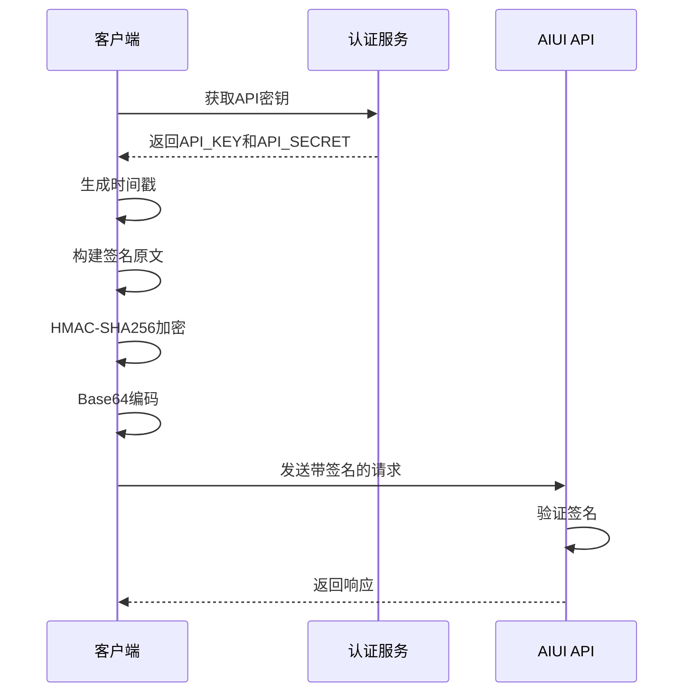
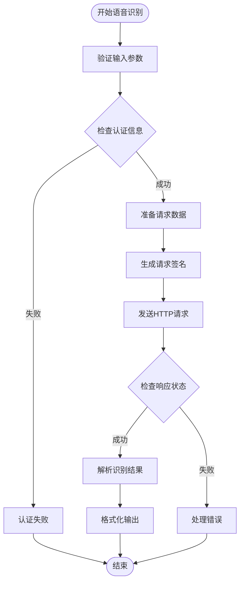
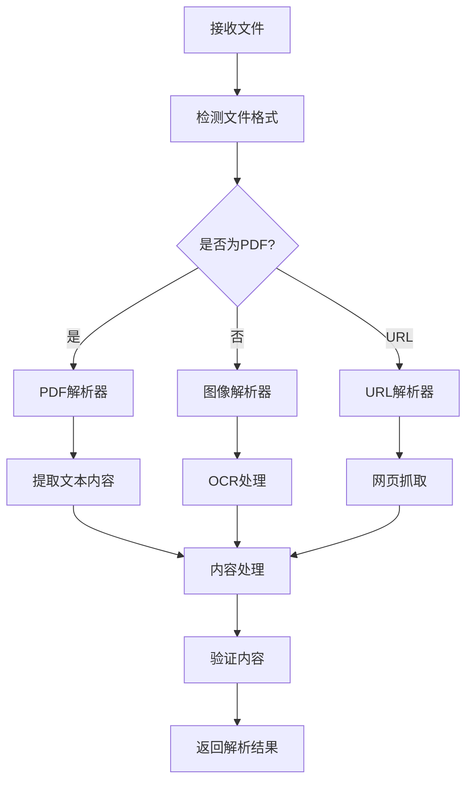
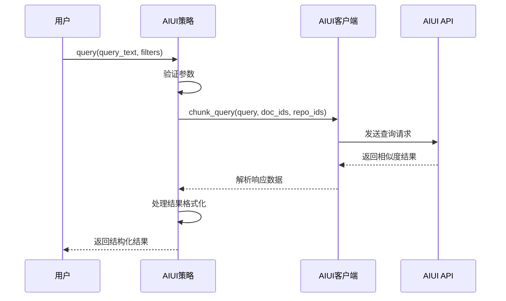
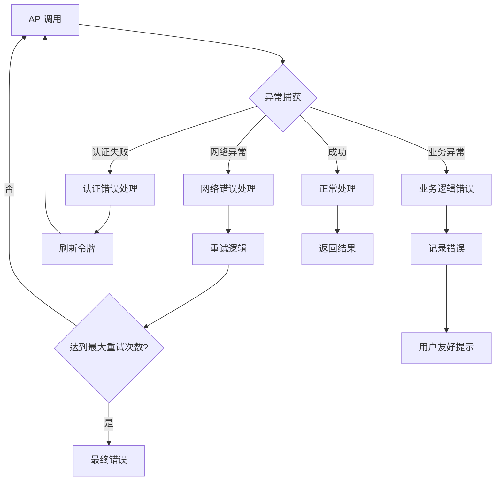
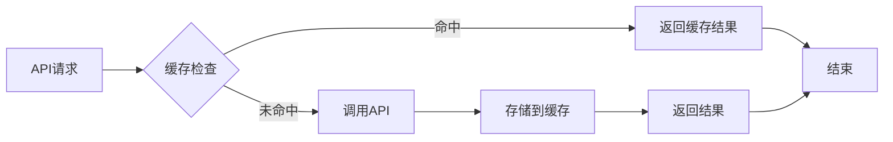
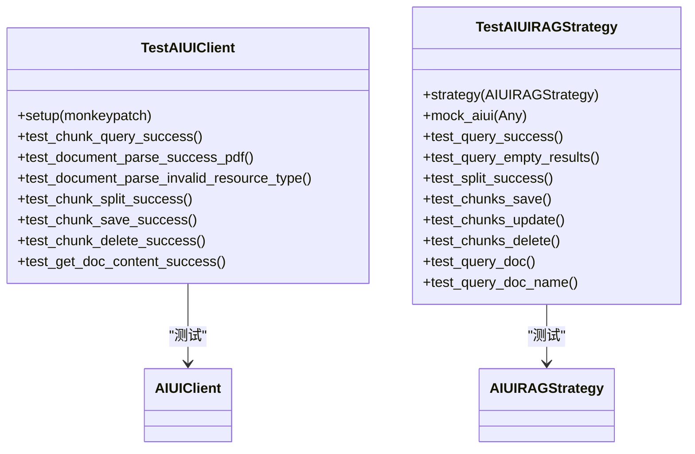

# AIUI集成技术文档

<cite>
**本文档引用的文件**
- [aiui.py](file://core/knowledge/infra/aiui/aiui.py)
- [aiui_strategy.py](file://core/knowledge/service/impl/aiui_strategy.py)
- [error_code.py](file://core/knowledge/consts/error_code.py)
- [rag_do.py](file://core/knowledge/domain/entity/rag_do.py)
- [rag_strategy.py](file://core/knowledge/service/rag_strategy.py)
- [spark_signature.py](file://core/knowledge/utils/spark_signature.py)
- [verification.py](file://core/knowledge/utils/verification.py)
- [aiui_test.py](file://core/knowledge/tests/infra/aiui/aiui_test.py)
- [aiui_strategy_test.py](file://core/knowledge/tests/service/impl/aiui_strategy_test.py)
</cite>

## 目录
1. [简介](#简介)
2. [系统架构](#系统架构)
3. [核心组件分析](#核心组件分析)
4. [认证机制](#认证机制)
5. [API调用流程](#api调用流程)
6. [策略模式实现](#策略模式实现)
7. [错误处理机制](#错误处理机制)
8. [性能优化](#性能优化)
9. [测试框架](#测试框架)
10. [故障排除指南](#故障排除指南)
11. [最佳实践](#最佳实践)

## 简介

AIUI（讯飞星火认知大模型）集成模块为astron-agent提供了强大的知识检索和语音理解能力。该模块通过封装AIUI平台的API接口，实现了从语音输入到文本检索的完整转换流程，支持文档解析、语义查询、知识切片等核心功能。

### 主要特性

- **多格式文档支持**：支持PDF、图片、URL等多种文档格式的解析
- **智能语义查询**：基于向量相似度的知识检索
- **动态知识切片**：灵活的文档分割策略
- **实时语音处理**：高效的语音转文字服务
- **完整的生命周期管理**：从上传到删除的全流程支持

## 系统架构

**架构图来源**
- [aiui.py](file://core/knowledge/infra/aiui/aiui.py#L1-L50)
- [aiui_strategy.py](file://core/knowledge/service/impl/aiui_strategy.py#L1-L30)

## 核心组件分析

### AIUI客户端模块

AIUI客户端模块是整个集成的核心，提供了与AIUI平台交互的所有功能。

#### 主要功能模块

**类图来源**
- [aiui.py](file://core/knowledge/infra/aiui/aiui.py#L25-L100)

#### 关键方法详解

1. **认证URL组装**：`assemble_auth_url()` 方法负责生成带有签名的认证URL
2. **语义查询**：`chunk_query()` 方法执行基于向量相似度的知识检索
3. **文档解析**：`document_parse()` 方法支持多种文档格式的解析
4. **知识切片**：`chunk_split()` 方法实现智能的文档分割
5. **生命周期管理**：提供完整的CRUD操作支持

**章节来源**
- [aiui.py](file://core/knowledge/infra/aiui/aiui.py#L25-L334)

### AIUI策略实现

AIUI策略类实现了RAGStrategy抽象基类，提供了完整的知识检索策略。

**类图来源**
- [rag_strategy.py](file://core/knowledge/service/rag_strategy.py#L10-L87)
- [aiui_strategy.py](file://core/knowledge/service/impl/aiui_strategy.py#L15-L270)

**章节来源**
- [aiui_strategy.py](file://core/knowledge/service/impl/aiui_strategy.py#L15-L270)

## 认证机制

AIUI采用基于HMAC-SHA256的签名认证机制，确保API调用的安全性。

### 认证流程

**序列图来源**
- [aiui.py](file://core/knowledge/infra/aiui/aiui.py#L25-L50)

### 签名生成算法

签名生成过程包含以下关键步骤：

1. **构建签名原文**：组合Host、Date和HTTP方法信息
2. **HMAC-SHA256加密**：使用API_SECRET对签名原文进行加密
3. **Base64编码**：将加密结果进行Base64编码
4. **授权头构造**：组装最终的Authorization头部

**章节来源**
- [aiui.py](file://core/knowledge/infra/aiui/aiui.py#L25-L50)

## API调用流程

### 语音识别流程

**流程图来源**
- [aiui.py](file://core/knowledge/infra/aiui/aiui.py#L280-L334)

### 文档解析流程

文档解析支持多种格式，具有智能的格式检测和处理机制：

**流程图来源**
- [aiui.py](file://core/knowledge/infra/aiui/aiui.py#L70-L110)

**章节来源**
- [aiui.py](file://core/knowledge/infra/aiui/aiui.py#L70-L110)

## 策略模式实现

AIUI策略通过策略模式实现了灵活的知识检索功能，支持多种文档格式和查询方式。

### 查询策略

**序列图来源**
- [aiui_strategy.py](file://core/knowledge/service/impl/aiui_strategy.py#L18-L50)

### 文件处理策略

文件处理策略支持完整的文档生命周期管理：

| 操作类型 | 方法名称 | 功能描述 | 参数要求 |
|---------|---------|---------|---------|
| 文档解析 | `document_parse` | 支持PDF、图片、URL解析 | file_url, resource_type |
| 内容分割 | `chunk_split` | 智能文档分割 | document, length_range, overlap |
| 知识保存 | `chunks_save` | 批量保存知识块 | docId, group, chunks |
| 知识更新 | `chunks_update` | 更新现有知识块 | docId, group, chunks |
| 知识删除 | `chunks_delete` | 删除指定知识块 | docId, chunkIds |
| 内容查询 | `query_doc` | 获取文档所有内容 | docId |

**表格来源**
- [aiui_strategy.py](file://core/knowledge/service/impl/aiui_strategy.py#L52-L270)

**章节来源**
- [aiui_strategy.py](file://core/knowledge/service/impl/aiui_strategy.py#L18-L270)

## 错误处理机制

### 错误码定义

系统定义了完整的错误码体系，涵盖各种异常情况：

| 错误码 | 错误名称 | 描述 | 处理建议 |
|-------|---------|------|---------|
| 10001 | ParameterCheckException | 参数检查异常 | 检查输入参数的有效性 |
| 10002 | MissingParameter | 缺少必要参数 | 提供所有必需参数 |
| 10003 | ParameterInvalid | 参数无效 | 验证参数格式和范围 |
| 10027 | AIUI_RAGError | AIUI知识库请求失败 | 检查网络连接和认证信息 |
| 10016 | FileSplitFailed | 文件分割失败 | 检查文件格式和大小限制 |
| 10017 | ChunkSaveFailed | 块保存失败 | 检查存储权限和空间 |

**表格来源**
- [error_code.py](file://core/knowledge/consts/error_code.py#L10-L47)

### 异常处理流程

**流程图来源**
- [aiui.py](file://core/knowledge/infra/aiui/aiui.py#L280-L334)

**章节来源**
- [error_code.py](file://core/knowledge/consts/error_code.py#L10-L47)
- [aiui.py](file://core/knowledge/infra/aiui/aiui.py#L280-L334)

## 性能优化

### 并发处理

AIUI客户端采用异步并发设计，提高API调用效率：

- **异步HTTP客户端**：使用aiohttp实现非阻塞网络请求
- **连接池管理**：复用HTTP连接减少建立开销
- **超时控制**：设置合理的请求超时时间
- **重试机制**：智能的失败重试策略

### 缓存策略

### 性能监控

系统内置了性能监控机制：

- **请求追踪**：使用OTLP追踪API调用链路
- **响应时间统计**：监控各API的响应时间
- **错误率监控**：跟踪API调用成功率
- **资源使用监控**：监控内存和CPU使用情况

**章节来源**
- [aiui.py](file://core/knowledge/infra/aiui/aiui.py#L280-L334)

## 测试框架

### 单元测试结构

测试框架采用pytest框架，提供了全面的单元测试覆盖：

**类图来源**
- [aiui_test.py](file://core/knowledge/tests/infra/aiui/aiui_test.py#L15-L50)
- [aiui_strategy_test.py](file://core/knowledge/tests/service/impl/aiui_strategy_test.py#L10-L50)

### 测试用例覆盖

主要测试场景包括：

1. **成功路径测试**：验证正常流程的正确性
2. **异常路径测试**：测试各种异常情况的处理
3. **边界条件测试**：验证边界值的处理
4. **集成测试**：测试组件间的协作

**章节来源**
- [aiui_test.py](file://core/knowledge/tests/infra/aiui/aiui_test.py#L15-L194)
- [aiui_strategy_test.py](file://core/knowledge/tests/service/impl/aiui_strategy_test.py#L10-L263)

## 故障排除指南

### 常见问题及解决方案

#### 认证相关问题

**问题**：API调用返回认证失败
**原因**：API密钥或签名生成错误
**解决方案**：
1. 检查环境变量配置：`AIUI_API_KEY` 和 `AIUI_API_SECRET`
2. 验证时间同步：确保服务器时间准确
3. 检查签名算法：确认HMAC-SHA256实现正确

#### 网络连接问题

**问题**：请求超时或连接失败
**原因**：网络不稳定或防火墙阻止
**解决方案**：
1. 检查网络连接状态
2. 验证AIUI服务端点可达性
3. 调整超时参数配置

#### 文档解析问题

**问题**：文档解析失败或结果不正确
**原因**：文件格式不支持或内容损坏
**解决方案**：
1. 验证文件格式支持列表
2. 检查文件完整性
3. 尝试不同的解析参数

### 调试技巧

1. **启用详细日志**：设置日志级别为DEBUG查看详细信息
2. **使用断点调试**：在关键位置设置断点
3. **网络抓包**：使用工具分析网络请求
4. **单元测试**：运行独立的测试用例

**章节来源**
- [aiui.py](file://core/knowledge/infra/aiui/aiui.py#L280-L334)

## 最佳实践

### 配置管理

1. **环境变量配置**：使用环境变量管理敏感信息
2. **配置验证**：启动时验证配置的正确性
3. **默认值设置**：为可选参数设置合理的默认值

### 错误处理

1. **优雅降级**：在网络不可用时提供备用方案
2. **用户友好提示**：向用户提供清晰的错误信息
3. **日志记录**：记录详细的错误信息用于排查

### 性能优化

1. **合理设置超时**：根据网络状况调整超时时间
2. **连接池复用**：充分利用HTTP连接池
3. **异步处理**：使用异步编程避免阻塞

### 安全考虑

1. **密钥保护**：安全存储和传输API密钥
2. **输入验证**：严格验证所有输入参数
3. **访问控制**：实施适当的访问控制策略

### 监控和维护

1. **健康检查**：定期检查服务可用性
2. **性能监控**：持续监控系统性能指标
3. **版本管理**：保持API版本的一致性

通过遵循这些最佳实践，可以确保AIUI集成的稳定性、安全性和高性能。