# Ragflow集成技术文档

<cite>
**本文档引用的文件**
- [ragflow_client.py](file://core/knowledge/infra/ragflow/ragflow_client.py)
- [ragflow_utils.py](file://core/knowledge/infra/ragflow/ragflow_utils.py)
- [ragflow_strategy.py](file://core/knowledge/service/impl/ragflow_strategy.py)
- [exception.py](file://core/knowledge/exceptions/exception.py)
- [rag_do.py](file://core/knowledge/domain/entity/rag_do.py)
- [constants.py](file://core/knowledge/consts/constants.py)
- [ragflow_strategy_test.py](file://core/knowledge/tests/service/impl/ragflow_strategy_test.py)
- [nginx.conf](file://docker/ragflow/nginx/nginx.conf)
- [entrypoint.sh](file://docker/ragflow/entrypoint.sh)
</cite>

## 目录
1. [概述](#概述)
2. [系统架构](#系统架构)
3. [核心组件](#核心组件)
4. [认证机制](#认证机制)
5. [HTTP客户端实现](#http客户端实现)
6. [文档处理流程](#文档处理流程)
7. [知识库管理](#知识库管理)
8. [语义检索](#语义检索)
9. [辅助工具类](#辅助工具类)
10. [错误处理与重试机制](#错误处理与重试机制)
11. [性能监控与优化](#性能监控与优化)
12. [故障排查指南](#故障排查指南)
13. [API调用示例](#api调用示例)
14. [最佳实践](#最佳实践)

## 概述

Ragflow集成是Astron Agent知识管理系统中的重要组成部分，提供了基于RAGFlow的文档处理、知识库管理和语义检索能力。该集成通过HTTP API与外部Ragflow系统通信，支持文档上传、解析、索引构建和智能查询等功能。

### 主要特性

- **多协议支持**：支持HTTP/HTTPS协议，具备自动重试和超时处理机制
- **异步处理**：采用asyncio实现高性能并发操作
- **会话管理**：智能连接池管理和会话复用
- **错误恢复**：完善的错误处理和自动重试机制
- **配置灵活**：支持环境变量配置和动态重载

## 系统架构

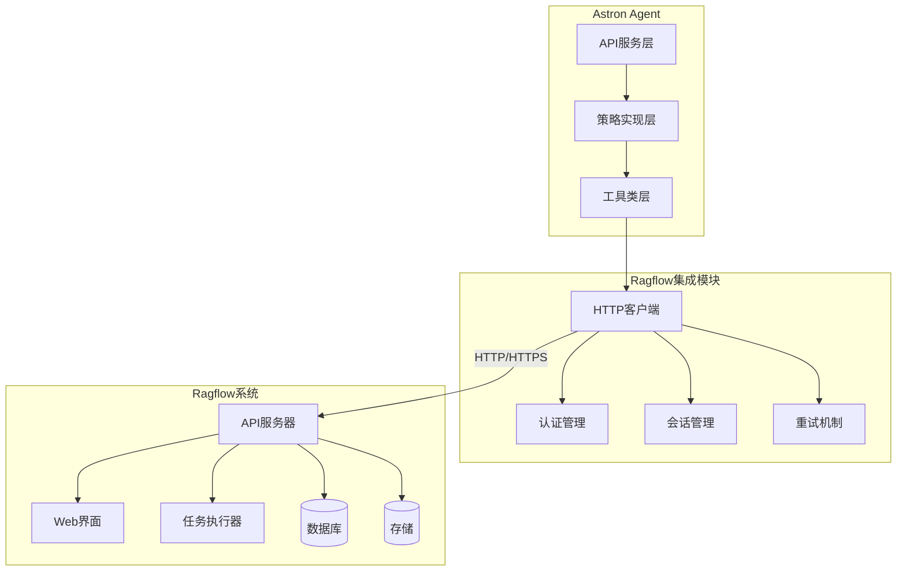

**架构图来源**
- [ragflow_client.py](file://core/knowledge/infra/ragflow/ragflow_client.py#L1-L50)
- [ragflow_strategy.py](file://core/knowledge/service/impl/ragflow_strategy.py#L1-L50)

## 核心组件

### HTTP客户端模块 (ragflow_client.py)

HTTP客户端是整个集成的核心，负责与Ragflow系统的所有HTTP通信。

#### 主要功能模块

1. **配置管理**：环境变量加载和缓存
2. **会话管理**：连接池和会话复用
3. **请求处理**：JSON和文件上传请求
4. **错误处理**：自动重试和降级处理

#### 关键类和方法

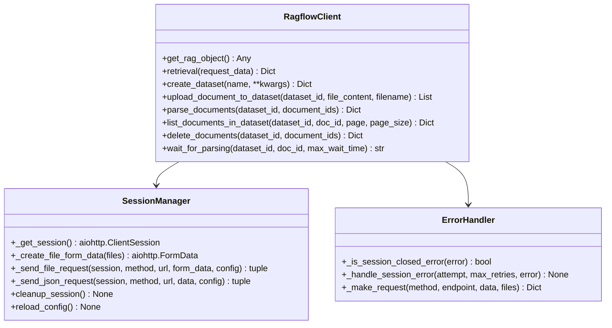

**类图来源**
- [ragflow_client.py](file://core/knowledge/infra/ragflow/ragflow_client.py#L150-L300)

**章节来源**
- [ragflow_client.py](file://core/knowledge/infra/ragflow/ragflow_client.py#L1-L100)

### 工具类模块 (ragflow_utils.py)

工具类提供了文档处理、格式转换和辅助功能。

#### 核心功能

1. **文件处理**：本地文件、远程URL下载和格式检测
2. **数据转换**：Ragflow响应格式到标准格式的转换
3. **数据集管理**：自动创建和管理知识库
4. **解析状态监控**：文档解析进度跟踪

**章节来源**
- [ragflow_utils.py](file://core/knowledge/infra/ragflow/ragflow_utils.py#L1-L100)

### 策略实现模块 (ragflow_strategy.py)

策略实现层定义了具体的业务逻辑和工作流程。

#### 主要接口

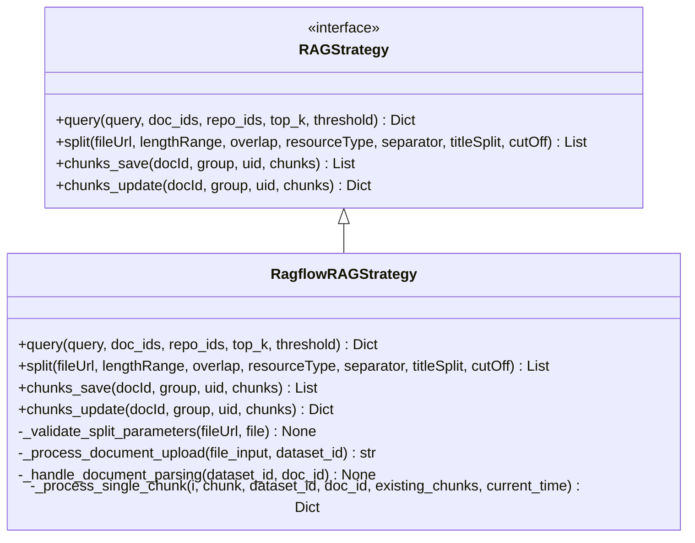

**类图来源**
- [ragflow_strategy.py](file://core/knowledge/service/impl/ragflow_strategy.py#L20-L80)

**章节来源**
- [ragflow_strategy.py](file://core/knowledge/service/impl/ragflow_strategy.py#L1-L100)

## 认证机制

### API Key认证

Ragflow集成使用Bearer Token认证机制，通过API Key进行身份验证。

#### 配置方式

| 环境变量 | 描述 | 默认值 |
|---------|------|--------|
| `RAGFLOW_API_TOKEN` | RAGFlow API密钥 | 必需 |
| `RAGFLOW_BASE_URL` | RAGFlow服务基础URL | 必需 |
| `RAGFLOW_TIMEOUT` | 请求超时时间(秒) | 30 |
| `RAGFLOW_DEFAULT_GROUP` | 默认数据集名称 | "Stellar Knowledge Base" |

#### 认证流程

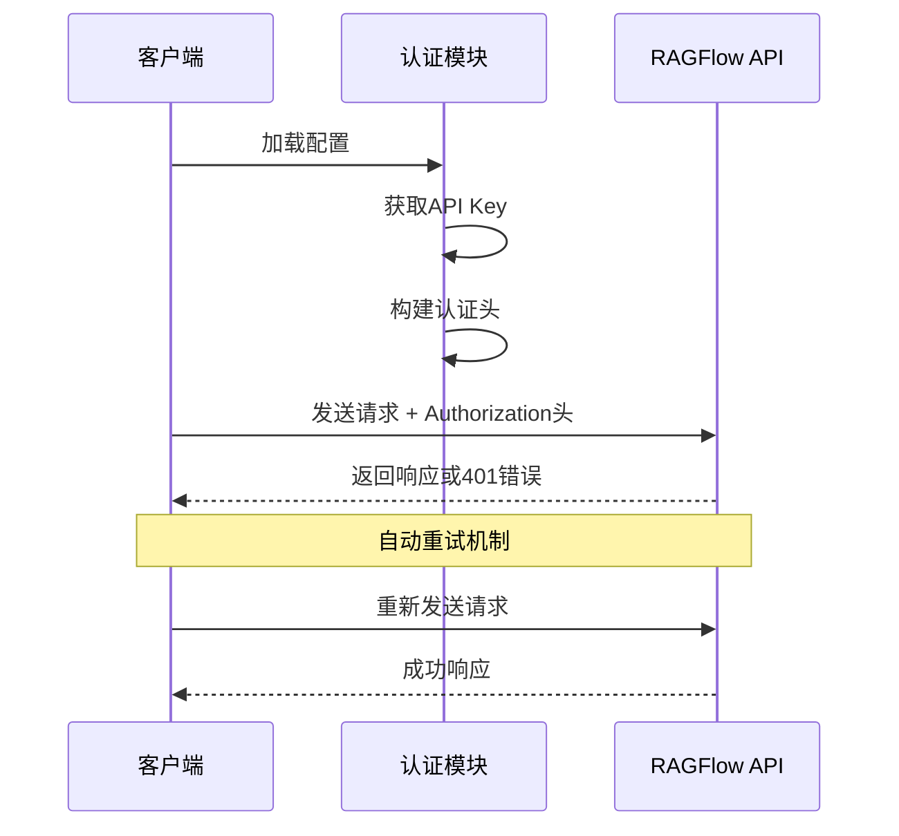

**序列图来源**
- [ragflow_client.py](file://core/knowledge/infra/ragflow/ragflow_client.py#L40-L80)

**章节来源**
- [ragflow_client.py](file://core/knowledge/infra/ragflow/ragflow_client.py#L40-L120)

## HTTP客户端实现

### 会话管理

HTTP客户端采用单例模式管理会话，支持连接池和keep-alive机制。

#### 连接池配置

| 参数 | 值 | 说明 |
|------|-----|------|
| 总连接数 | 100 | 最大并发连接数 |
| 每主机连接数 | 30 | 每个目标主机的最大连接数 |
| Keep-Alive超时 | 600秒 | 连接保持时间 |
| 请求超时 | 可配置 | 默认30秒 |

#### 会话生命周期

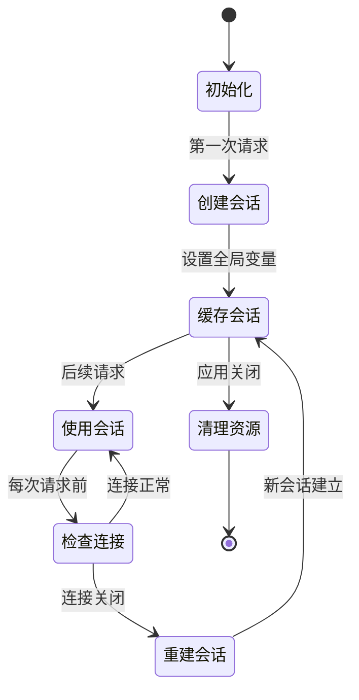

**状态图来源**
- [ragflow_client.py](file://core/knowledge/infra/ragflow/ragflow_client.py#L120-L180)

### 请求处理机制

#### 文件上传请求

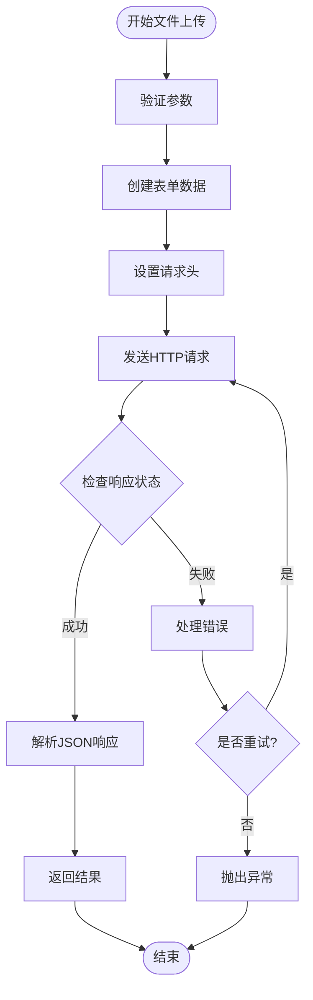

**流程图来源**
- [ragflow_client.py](file://core/knowledge/infra/ragflow/ragflow_client.py#L200-L280)

#### JSON请求处理

对于不需要文件上传的API调用，使用标准的JSON请求格式。

**章节来源**
- [ragflow_client.py](file://core/knowledge/infra/ragflow/ragflow_client.py#L120-L300)

## 文档处理流程

### 文档上传与解析

文档处理是Ragflow集成的核心功能，包含完整的上传、解析和索引流程。

#### 处理流程图

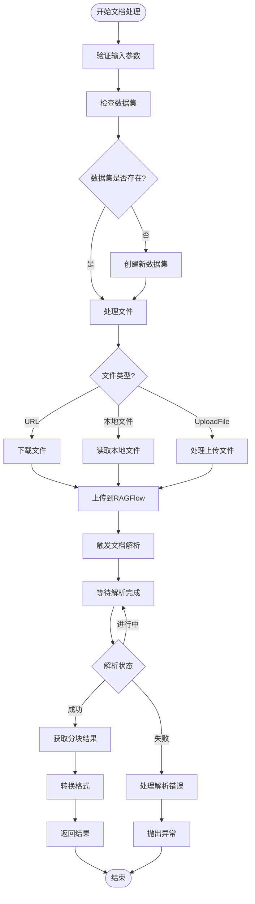

**流程图来源**
- [ragflow_strategy.py](file://core/knowledge/service/impl/ragflow_strategy.py#L150-L250)

### 分块策略配置

Ragflow支持多种分块策略，可根据文档类型和需求进行配置。

#### 分块参数配置表

| 参数 | 类型 | 描述 | 默认值 |
|------|------|------|--------|
| `lengthRange` | List[int] | 分块长度范围 | [256, 1024] |
| `overlap` | int | 分块重叠长度 | 16 |
| `separator` | List[str] | 分隔符列表 | ["\n", ".", "。"] |
| `titleSplit` | bool | 是否按标题分割 | False |
| `cutOff` | List[str] | 截断规则 | [] |

**章节来源**
- [ragflow_strategy.py](file://core/knowledge/service/impl/ragflow_strategy.py#L150-L300)

## 知识库管理

### 数据集操作

知识库管理提供了完整的数据集生命周期管理功能。

#### 数据集API接口

| 接口 | 方法 | 功能描述 |
|------|------|----------|
| `/api/v1/datasets` | GET | 列出数据集 |
| `/api/v1/datasets` | POST | 创建数据集 |
| `/api/v1/datasets/{id}` | GET | 获取数据集详情 |
| `/api/v1/datasets/{id}` | PUT | 更新数据集 |
| `/api/v1/datasets/{id}` | DELETE | 删除数据集 |

#### 文档管理操作

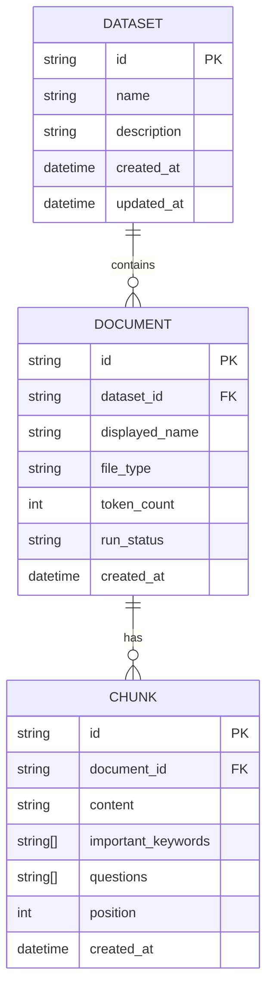

**实体关系图来源**
- [ragflow_client.py](file://core/knowledge/infra/ragflow/ragflow_client.py#L400-L600)

**章节来源**
- [ragflow_client.py](file://core/knowledge/infra/ragflow/ragflow_client.py#L400-L700)

## 语义检索

### 查询接口设计

语义检索是Ragflow集成的核心功能，支持向量相似度搜索和混合检索。

#### 查询参数配置

| 参数 | 类型 | 描述 | 默认值 |
|------|------|------|--------|
| `question` | str | 查询文本 | 必需 |
| `dataset_ids` | List[str] | 数据集ID列表 | 当前数据集 |
| `top_k` | int | 返回结果数量 | 6 |
| `similarity_threshold` | float | 相似度阈值 | 0 |
| `vector_similarity_weight` | float | 向量相似度权重 | 0.2 |

#### 检索流程

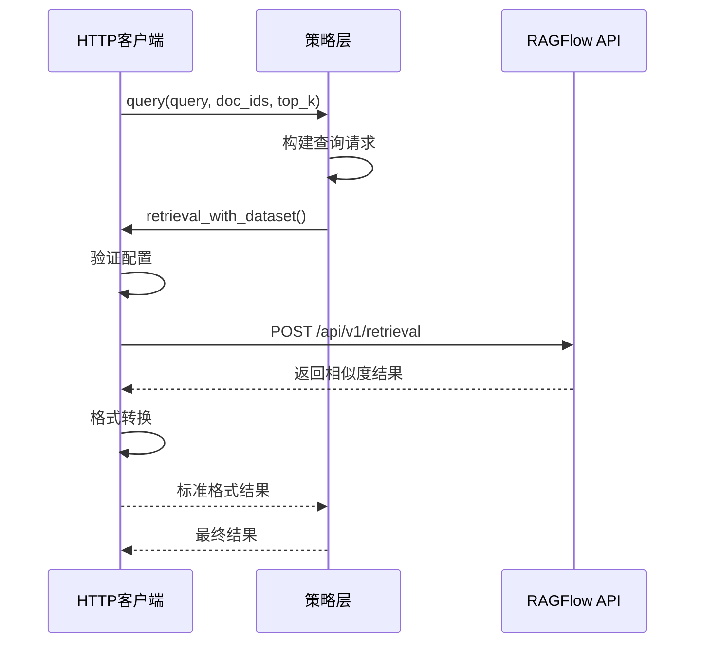

**序列图来源**
- [ragflow_strategy.py](file://core/knowledge/service/impl/ragflow_strategy.py#L30-L80)

**章节来源**
- [ragflow_strategy.py](file://core/knowledge/service/impl/ragflow_strategy.py#L30-L100)

## 辅助工具类

### 文件处理工具

RagflowUtils类提供了丰富的文件处理功能，支持多种文件源和格式。

#### 文件处理方法

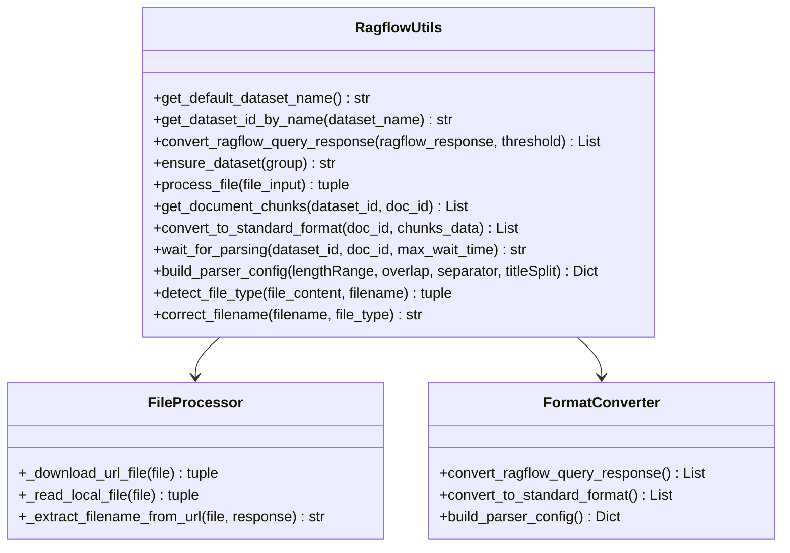

**类图来源**
- [ragflow_utils.py](file://core/knowledge/infra/ragflow/ragflow_utils.py#L30-L100)

### 格式转换功能

#### 响应格式转换

Ragflow的原始响应格式需要转换为统一的标准格式，便于上层应用使用。

**章节来源**
- [ragflow_utils.py](file://core/knowledge/infra/ragflow/ragflow_utils.py#L100-L200)

## 错误处理与重试机制

### 异常体系

系统定义了完整的异常处理体系，支持不同级别的错误处理。

#### 异常类层次结构

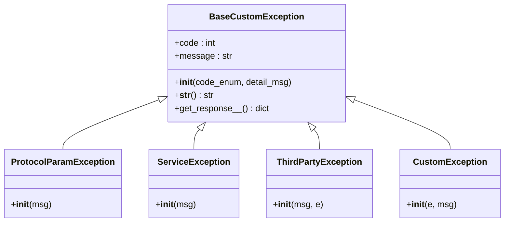

**类图来源**
- [exception.py](file://core/knowledge/exceptions/exception.py#L15-L50)

### 重试策略

#### 重试机制设计

| 场景 | 重试次数 | 重试间隔 | 降级策略 |
|------|----------|----------|----------|
| 连接错误 | 2次 | 立即重试 | 抛出异常 |
| 会话关闭 | 2次 | 立即重试 | 重建会话 |
| 超时错误 | 1次 | 立即重试 | 抛出异常 |
| 业务错误 | 0次 | 不重试 | 记录日志 |

#### 错误处理流程

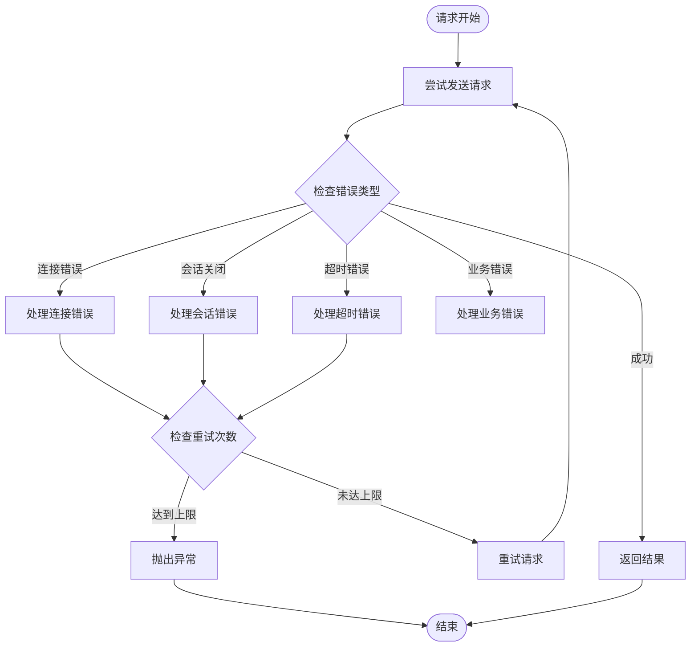

**流程图来源**
- [ragflow_client.py](file://core/knowledge/infra/ragflow/ragflow_client.py#L300-L400)

**章节来源**
- [exception.py](file://core/knowledge/exceptions/exception.py#L1-L87)
- [ragflow_client.py](file://core/knowledge/infra/ragflow/ragflow_client.py#L300-L450)

## 性能监控与优化

### 性能指标

#### 关键性能指标

| 指标 | 描述 | 目标值 | 监控方法 |
|------|------|--------|----------|
| 请求响应时间 | HTTP请求平均响应时间 | < 2秒 | 日志记录 |
| 并发处理能力 | 同时处理请求数量 | > 100 | 性能测试 |
| 内存使用率 | 模块内存占用 | < 500MB | 系统监控 |
| 错误率 | 请求失败比例 | < 1% | 异常统计 |

#### 优化策略

1. **连接池优化**：合理配置连接池大小和超时时间
2. **会话复用**：避免频繁创建和销毁HTTP会话
3. **异步处理**：使用asyncio实现非阻塞操作
4. **缓存机制**：缓存配置和常用数据

### 监控配置

#### 日志级别配置

| 级别 | 用途 | 示例场景 |
|------|------|----------|
| DEBUG | 详细调试信息 | 请求参数、响应内容 |
| INFO | 一般信息记录 | 操作成功、状态变化 |
| WARNING | 警告信息 | 重试操作、异常情况 |
| ERROR | 错误信息 | 请求失败、异常抛出 |

**章节来源**
- [ragflow_client.py](file://core/knowledge/infra/ragflow/ragflow_client.py#L1-L50)

## 故障排查指南

### 常见问题及解决方案

#### 连接问题

| 问题症状 | 可能原因 | 解决方案 |
|----------|----------|----------|
| 连接超时 | 网络延迟或服务不可用 | 检查网络连接，确认RAGFlow服务状态 |
| 认证失败 | API Key错误或过期 | 验证环境变量配置 |
| 会话关闭 | 连接池耗尽 | 调整连接池配置 |

#### 文档处理问题

| 问题症状 | 可能原因 | 解决方案 |
|----------|----------|----------|
| 文件上传失败 | 文件过大或格式不支持 | 检查文件大小限制和格式支持 |
| 解析超时 | 文档内容过多或复杂 | 优化分块策略，增加超时时间 |
| 结果为空 | 检索条件过于严格 | 调整相似度阈值 |

#### 查询问题

| 问题症状 | 可能原因 | 解决方案 |
|----------|----------|----------|
| 查询无结果 | 数据库中无匹配文档 | 检查文档是否正确索引 |
| 相似度过低 | 向量模型不匹配 | 调整相似度权重参数 |
| 响应缓慢 | 数据量过大 | 优化查询条件，减少返回数量 |

### 调试技巧

#### 日志分析

1. **启用详细日志**：设置日志级别为DEBUG
2. **关注关键节点**：记录请求参数和响应结果
3. **异常追踪**：捕获并记录完整异常堆栈

#### 性能分析

1. **响应时间监控**：记录每个API调用的耗时
2. **并发压力测试**：模拟高并发场景
3. **资源使用监控**：观察CPU和内存使用情况

**章节来源**
- [ragflow_client.py](file://core/knowledge/infra/ragflow/ragflow_client.py#L700-L829)

## API调用示例

### 基础API调用

#### 查询示例

```python
# 基本查询
query_result = await ragflow_client.retrieval({
    "question": "什么是人工智能？",
    "dataset_ids": ["dataset_id"],
    "top_k": 5,
    "similarity_threshold": 0.3
})

# 带文档过滤的查询
filtered_result = await ragflow_client.retrieval_with_dataset(
    dataset_id="dataset_id",
    request_data={
        "question": "机器学习算法",
        "document_ids": ["doc_id_1", "doc_id_2"],
        "top_k": 3
    }
)
```

#### 文档上传示例

```python
# 从URL上传文档
await ragflow_strategy.split(
    fileUrl="https://example.com/document.pdf",
    lengthRange=[256, 1024],
    overlap=32,
    separator=["\n", ".", "。"],
    titleSplit=True
)

# 从本地文件上传
await ragflow_strategy.split(
    file="/path/to/local/document.docx",
    lengthRange=[512, 2048],
    overlap=64
)
```

#### 知识库管理示例

```python
# 创建数据集
dataset_id = await ragflow_client.create_dataset(
    name="My Knowledge Base",
    description="Personal knowledge collection",
    embedding_model="sentence-transformers/all-MiniLM-L6-v2"
)

# 列出数据集
datasets = await ragflow_client.list_datasets(
    name="My Knowledge Base",
    page=1,
    page_size=10
)

# 删除文档
await ragflow_client.delete_documents(
    dataset_id="dataset_id",
    document_ids=["doc_id_1", "doc_id_2"]
)
```

### 高级功能示例

#### 批量知识保存

```python
# 批量保存知识块
chunks = [
    {
        "docId": "doc_id",
        "dataIndex": "0",
        "title": "人工智能简介",
        "content": "人工智能是...",
        "context": "人工智能的基本概念...",
        "references": {}
    },
    {
        "docId": "doc_id", 
        "dataIndex": "1",
        "title": "机器学习",
        "content": "机器学习是...",
        "context": "机器学习的应用领域...",
        "references": {}
    }
]

saved_chunks = await ragflow_strategy.chunks_save(
    docId="doc_id",
    group="My Knowledge Base",
    uid="user_id",
    chunks=chunks
)
```

#### 知识更新

```python
# 更新知识块
updates = [
    {
        "docId": "doc_id",
        "dataIndex": "0",
        "title": "人工智能最新发展",
        "content": "近年来，人工智能取得了显著进展...",
        "available": True
    }
]

update_result = await ragflow_strategy.chunks_update(
    docId="doc_id",
    group="My Knowledge Base",
    uid="user_id",
    chunks=updates
)
```

**章节来源**
- [ragflow_strategy.py](file://core/knowledge/service/impl/ragflow_strategy.py#L30-L200)

## 最佳实践

### 配置建议

#### 环境变量配置

```bash
# RAGFlow服务配置
export RAGFLOW_BASE_URL="https://ragflow.example.com"
export RAGFLOW_API_TOKEN="your-api-token-here"
export RAGFLOW_TIMEOUT=60
export RAGFLOW_DEFAULT_GROUP="Astron Knowledge Base"

# 性能优化配置
export RAGFLOW_CONNECTION_POOL_SIZE=50
export RAGFLOW_KEEP_ALIVE_TIMEOUT=300
```

#### 分块策略优化

1. **文档类型适配**：
   - 技术文档：使用较小的分块长度（256-512）
   - 法律文档：使用较大的分块长度（1024-2048）
   - 学术论文：使用中等分块长度（512-1024）

2. **重叠设置**：
   - 一般文档：重叠10-20%
   - 技术文档：重叠15-25%
   - 法律文档：重叠5-10%

### 性能优化

#### 并发控制

```python
# 使用异步批量处理
async def batch_process_documents(documents):
    tasks = []
    for doc in documents:
        task = ragflow_strategy.split(
            fileUrl=doc["url"],
            lengthRange=doc["chunk_size"],
            overlap=doc["overlap"]
        )
        tasks.append(task)
    
    results = await asyncio.gather(*tasks, return_exceptions=True)
    return results
```

#### 缓存策略

```python
# 实现简单的缓存机制
from functools import lru_cache

@lru_cache(maxsize=100)
def get_dataset_cached(dataset_name):
    return RagflowUtils.get_dataset_id_by_name(dataset_name)
```

### 安全考虑

#### API密钥管理

1. **环境隔离**：不同环境使用不同的API密钥
2. **定期轮换**：定期更换API密钥
3. **权限最小化**：使用最小权限原则

#### 数据安全

1. **传输加密**：使用HTTPS协议
2. **访问控制**：实施适当的访问控制
3. **审计日志**：记录所有关键操作

### 监控和维护

#### 健康检查

```python
async def health_check():
    try:
        # 检查RAGFlow服务可用性
        response = await ragflow_client.list_datasets(page=1, page_size=1)
        return response.get("code") == 0
    except Exception:
        return False
```

#### 定期维护

1. **索引优化**：定期清理和优化索引
2. **配置更新**：根据使用情况调整配置
3. **版本升级**：及时跟进RAGFlow版本更新

**章节来源**
- [ragflow_strategy.py](file://core/knowledge/service/impl/ragflow_strategy.py#L800-L1016)