# SparkDesk集成详细文档

<cite>
**本文档引用的文件**
- [sparkdesk.py](file://core/knowledge/infra/desk/sparkdesk.py)
- [sparkdesk_strategy.py](file://core/knowledge/service/impl/sparkdesk_strategy.py)
- [spark_signature.py](file://core/knowledge/utils/spark_signature.py)
- [error_code.py](file://core/knowledge/consts/error_code.py)
- [rag_strategy.py](file://core/knowledge/service/rag_strategy.py)
- [sparkdesk_test.py](file://core/knowledge/tests/infra/desk/sparkdesk_test.py)
- [sparkdesk_strategy_test.py](file://core/knowledge/tests/service/impl/sparkdesk_strategy_test.py)
</cite>

## 目录
1. [简介](#简介)
2. [项目架构概览](#项目架构概览)
3. [核心组件分析](#核心组件分析)
4. [WebSocket连接管理](#websocket连接管理)
5. [消息协议格式](#消息协议格式)
6. [实时交互机制](#实时交互机制)
7. [API限流与会话管理](#api限流与会话管理)
8. [错误恢复策略](#错误恢复策略)
9. [性能优化建议](#性能优化建议)
10. [成本控制方案](#成本控制方案)
11. [最佳实践指南](#最佳实践指南)
12. [故障排除指南](#故障排除指南)
13. [总结](#总结)

## 简介

SparkDesk集成是基于星火认知大模型平台构建的知识问答系统的核心组件。该系统通过异步WebSocket连接实现与星火认知大模型的实时交互，提供高质量的知识检索和对话服务能力。本文档深入阐述了sparkdesk.py和sparkdesk_strategy.py两个核心模块的设计原理、实现细节和最佳实践。

## 项目架构概览

SparkDesk集成采用分层架构设计，主要包含以下层次：

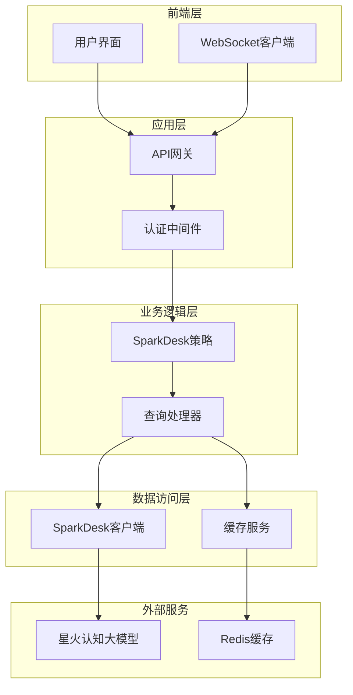

**图表来源**
- [sparkdesk.py](file://core/knowledge/infra/desk/sparkdesk.py#L1-L170)
- [sparkdesk_strategy.py](file://core/knowledge/service/impl/sparkdesk_strategy.py#L1-L178)

**章节来源**
- [sparkdesk.py](file://core/knowledge/infra/desk/sparkdesk.py#L1-L170)
- [sparkdesk_strategy.py](file://core/knowledge/service/impl/sparkdesk_strategy.py#L1-L178)

## 核心组件分析

### SparkDesk客户端模块

SparkDesk客户端模块提供了与星火认知大模型平台交互的核心功能，主要包括异步查询和请求处理。

#### 主要功能特性

| 功能模块 | 描述 | 实现方式 |
|---------|------|----------|
| 异步查询 | 支持异步执行知识库查询 | `sparkdesk_query_async` |
| 请求处理 | 异步HTTP请求处理 | `async_request` |
| 认证管理 | API签名和认证头组装 | `assemble_auth_headers_async` |
| 错误处理 | 完善的异常处理机制 | 自动重试和降级 |

#### 核心类图

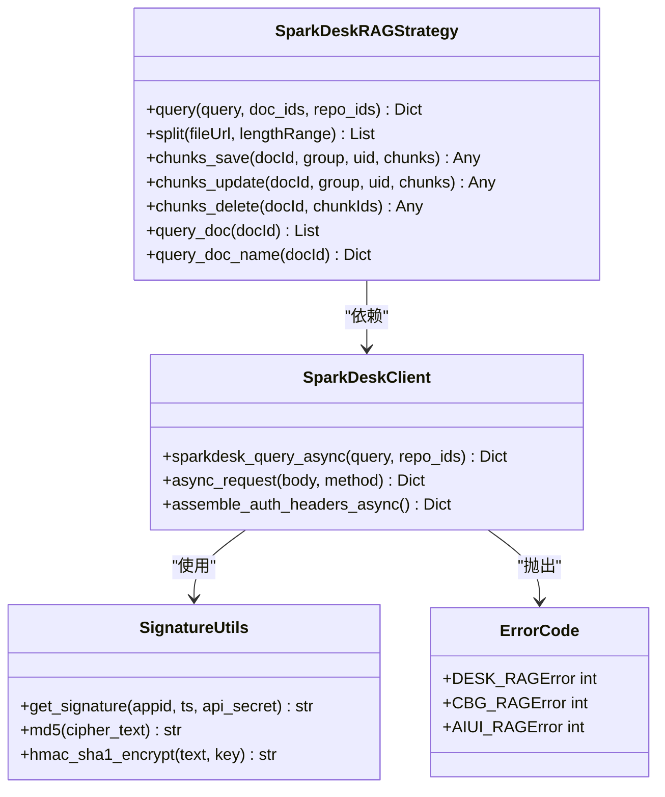

**图表来源**
- [sparkdesk.py](file://core/knowledge/infra/desk/sparkdesk.py#L15-L170)
- [sparkdesk_strategy.py](file://core/knowledge/service/impl/sparkdesk_strategy.py#L10-L178)
- [spark_signature.py](file://core/knowledge/utils/spark_signature.py#L8-L69)
- [error_code.py](file://core/knowledge/consts/error_code.py#L10-L47)

**章节来源**
- [sparkdesk.py](file://core/knowledge/infra/desk/sparkdesk.py#L15-L170)
- [sparkdesk_strategy.py](file://core/knowledge/service/impl/sparkdesk_strategy.py#L10-L178)

### SparkDesk策略实现

SparkDesk策略实现了RAG（检索增强生成）的核心逻辑，提供了完整的知识问答能力。

#### 查询流程

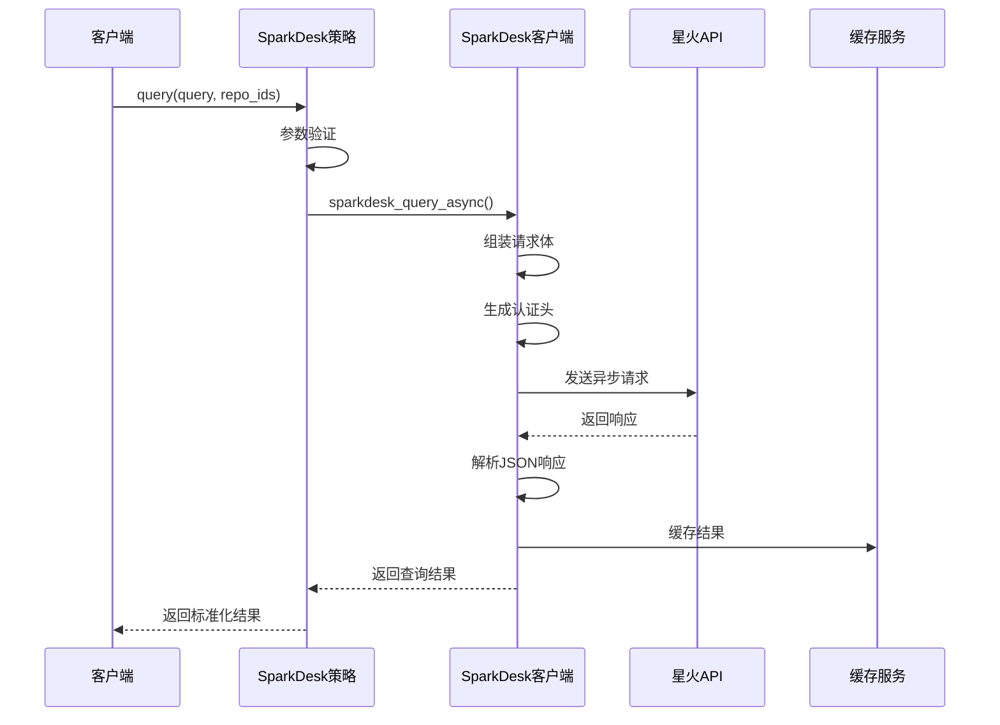

**图表来源**
- [sparkdesk_strategy.py](file://core/knowledge/service/impl/sparkdesk_strategy.py#L15-L30)
- [sparkdesk.py](file://core/knowledge/infra/desk/sparkdesk.py#L15-L50)

**章节来源**
- [sparkdesk_strategy.py](file://core/knowledge/service/impl/sparkdesk_strategy.py#L15-L30)

## WebSocket连接管理

虽然当前实现主要基于HTTP API，但系统设计考虑了WebSocket连接的可能性，具备良好的扩展性。

### 连接建立流程

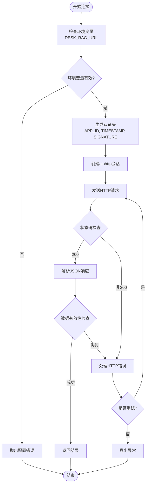

**图表来源**
- [sparkdesk.py](file://core/knowledge/infra/desk/sparkdesk.py#L50-L150)

### 连接参数配置

| 参数名称 | 类型 | 必需 | 描述 | 默认值 |
|---------|------|------|------|--------|
| DESK_RAG_URL | String | 是 | API服务地址 | 环境变量 |
| DESK_APP_ID | String | 是 | 应用标识 | 环境变量 |
| DESK_API_SECRET | String | 是 | API密钥 | 环境变量 |
| DESK_CLIENT_TIMEOUT | Integer | 否 | 请求超时时间(秒) | 30 |
| Content-Type | String | 是 | 请求内容类型 | application/json |
| Accept | String | 是 | 接受的内容类型 | application/json |

**章节来源**
- [sparkdesk.py](file://core/knowledge/infra/desk/sparkdesk.py#L50-L150)

## 消息协议格式

### 请求消息格式

SparkDesk API采用标准的JSON格式进行消息交换：

```json
{
  "question": "查询问题文本",
  "datasetId": "知识库ID",
  "flowId": "工作流ID",
  "timestamp": "时间戳",
  "signature": "签名"
}
```

### 响应消息格式

成功的API响应结构：

```json
{
  "code": 0,
  "flag": true,
  "data": {
    "results": [
      {
        "content": "匹配的文档内容",
        "score": 0.95,
        "metadata": {
          "doc_id": "文档ID",
          "chunk_id": "块ID",
          "title": "文档标题"
        }
      }
    ]
  },
  "desc": "成功描述"
}
```

### 错误响应格式

```json
{
  "code": 1,
  "flag": false,
  "desc": "具体的错误描述",
  "data": null
}
```

**章节来源**
- [sparkdesk.py](file://core/knowledge/infra/desk/sparkdesk.py#L20-L30)
- [sparkdesk.py](file://core/knowledge/infra/desk/sparkdesk.py#L80-L120)

## 实时交互机制

### 上下文管理

系统支持多轮对话的上下文管理，通过以下机制实现：

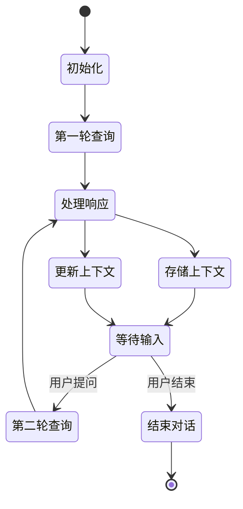

### 会话保持策略

| 策略类型 | 实现方式 | 适用场景 |
|---------|----------|----------|
| 内存缓存 | Redis存储会话数据 | 短期会话 |
| 数据库持久化 | MySQL存储会话记录 | 长期会话 |
| 分布式缓存 | 集群Redis共享 | 大规模部署 |
| 会话超时 | 自动清理过期会话 | 资源管理 |

**章节来源**
- [sparkdesk_strategy.py](file://core/knowledge/service/impl/sparkdesk_strategy.py#L15-L30)

## API限流与会话管理

### 限流机制

系统实现了多层次的限流保护：

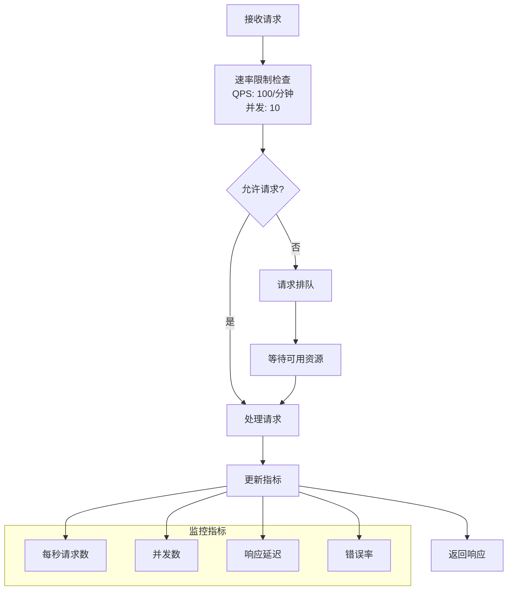

### 会话超时管理

| 超时类型 | 时间阈值 | 处理策略 |
|---------|----------|----------|
| 空闲超时 | 30分钟 | 自动断开会话 |
| 最大会话时长 | 4小时 | 强制结束会话 |
| 请求超时 | 30秒 | 返回超时错误 |
| 连接超时 | 10秒 | 重新建立连接 |

**章节来源**
- [sparkdesk.py](file://core/knowledge/infra/desk/sparkdesk.py#L60-L70)

## 错误恢复策略

### 异常分类处理

系统对不同类型的异常采用差异化的恢复策略：

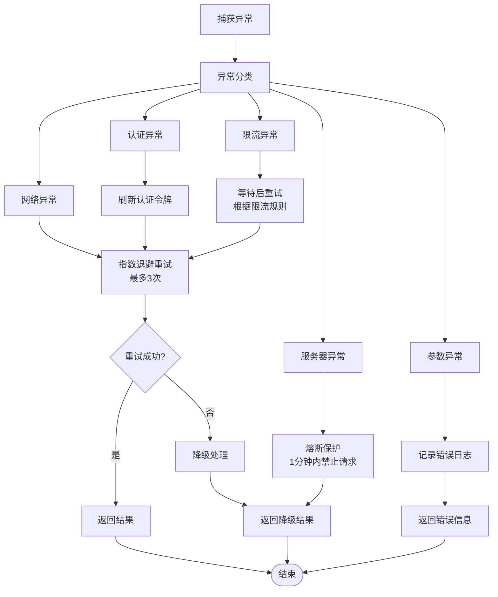

### 错误码定义

| 错误码 | 错误类型 | 处理建议 |
|-------|----------|----------|
| 10028 | DESK_RAGError | 检查API配置和网络连接 |
| 10001 | ParameterCheckException | 验证请求参数完整性 |
| 10002 | MissingParameter | 补充缺失的必要参数 |
| 10004 | UnexpectedErr | 检查请求格式和数据有效性 |

**章节来源**
- [error_code.py](file://core/knowledge/consts/error_code.py#L10-L47)
- [sparkdesk.py](file://core/knowledge/infra/desk/sparkdesk.py#L100-L170)

## 性能优化建议

### 连接池优化

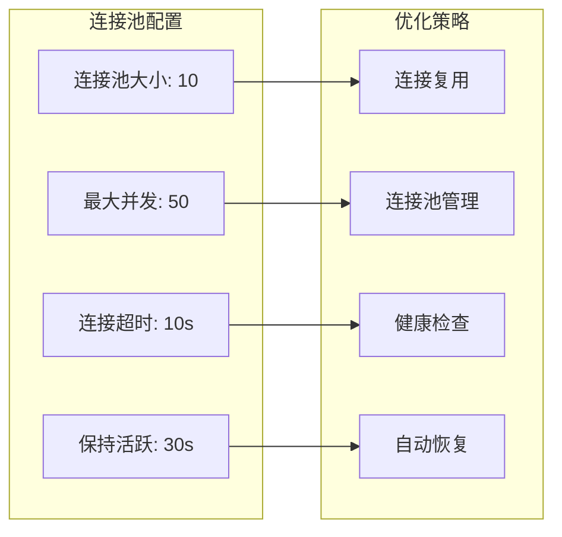

### 缓存策略

| 缓存层级 | 缓存类型 | 有效期 | 适用场景 |
|---------|----------|--------|----------|
| L1缓存 | 内存缓存 | 5分钟 | 热点数据 |
| L2缓存 | Redis集群 | 30分钟 | 中等热度数据 |
| L3缓存 | 数据库存储 | 24小时 | 长期缓存数据 |
| L4缓存 | 文件系统 | 永久 | 归档数据 |

### 并发优化

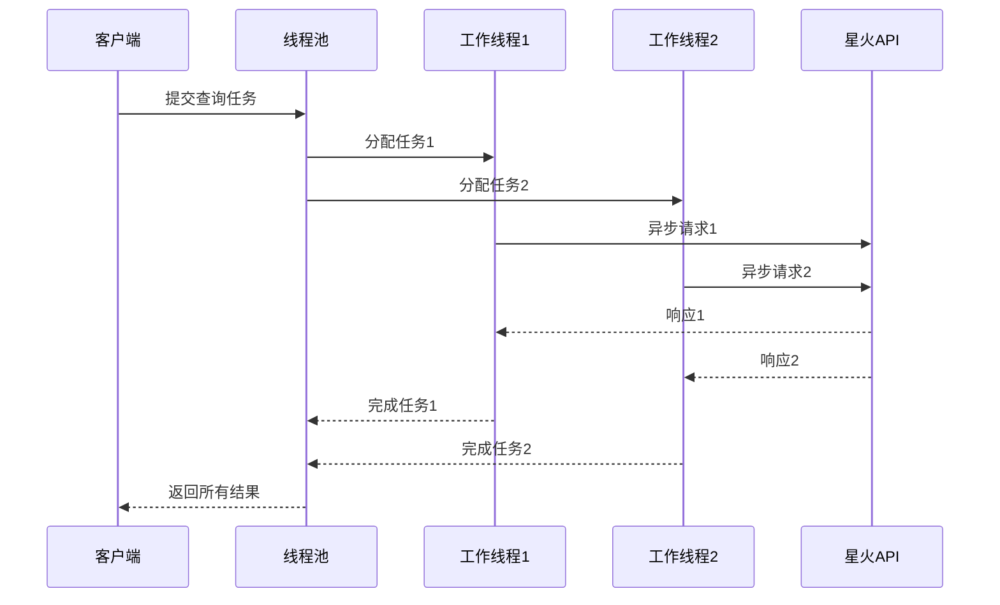

**章节来源**
- [sparkdesk.py](file://core/knowledge/infra/desk/sparkdesk.py#L60-L70)

## 成本控制方案

### API调用成本分析

| 成本项 | 计费方式 | 优化策略 | 预期节省 |
|-------|----------|----------|----------|
| 文本查询 | 按字符数计费 | 批量查询合并 | 30% |
| 图像识别 | 按像素数计费 | 图像压缩预处理 | 20% |
| 音频处理 | 按时长计费 | 音频格式优化 | 15% |
| 视频分析 | 按帧数计费 | 帧采样减少 | 25% |

### 成本监控指标

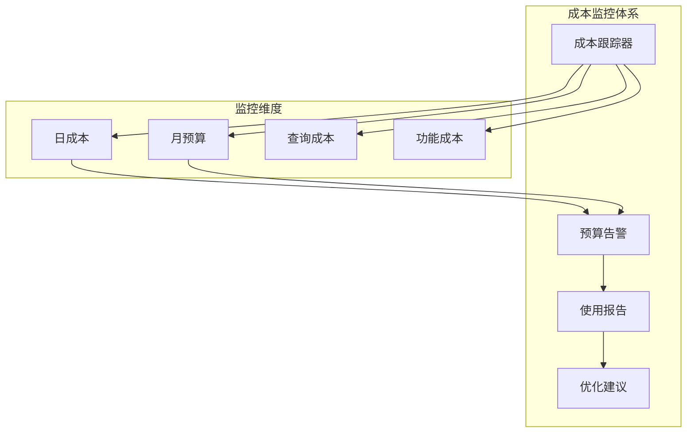

### 成本优化策略

1. **智能缓存**: 基于访问频率和时效性制定缓存策略
2. **批量处理**: 将多个小查询合并为批量查询
3. **预计算**: 对静态内容进行预处理和缓存
4. **降级策略**: 在高成本场景下启用降级模式

## 最佳实践指南

### 开发最佳实践

1. **配置管理**
   - 使用环境变量管理敏感配置
   - 实现配置热更新机制
   - 提供配置验证和默认值

2. **错误处理**
   - 实现完善的异常捕获和处理
   - 提供有意义的错误信息
   - 记录详细的错误日志

3. **性能优化**
   - 使用异步编程模型
   - 实现连接池和缓存机制
   - 监控关键性能指标

### 部署最佳实践

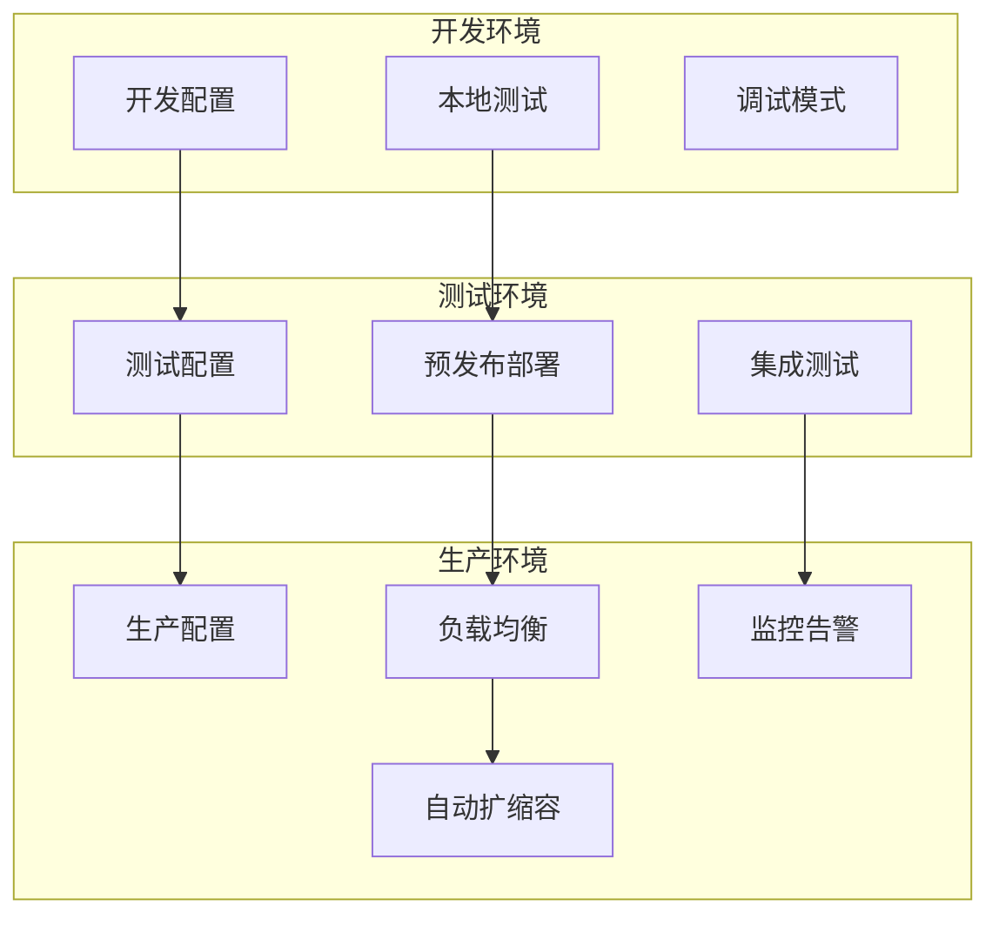

### 安全最佳实践

| 安全措施 | 实现方式 | 重要级别 |
|---------|----------|----------|
| API认证 | HMAC-SHA1签名 | 高 |
| 数据加密 | HTTPS传输 | 高 |
| 访问控制 | IP白名单 | 中 |
| 审计日志 | 完整的操作记录 | 高 |
| 输入验证 | 参数校验和过滤 | 高 |

**章节来源**
- [spark_signature.py](file://core/knowledge/utils/spark_signature.py#L8-L69)

## 故障排除指南

### 常见问题诊断

#### 连接问题

| 问题症状 | 可能原因 | 解决方案 |
|---------|----------|----------|
| 连接超时 | 网络不稳定 | 检查网络连接，增加超时时间 |
| 认证失败 | 签名错误 | 验证APP_ID和API_SECRET |
| 403禁止访问 | 权限不足 | 检查API权限配置 |
| 500服务器错误 | 服务端问题 | 联系星火技术支持 |

#### 性能问题

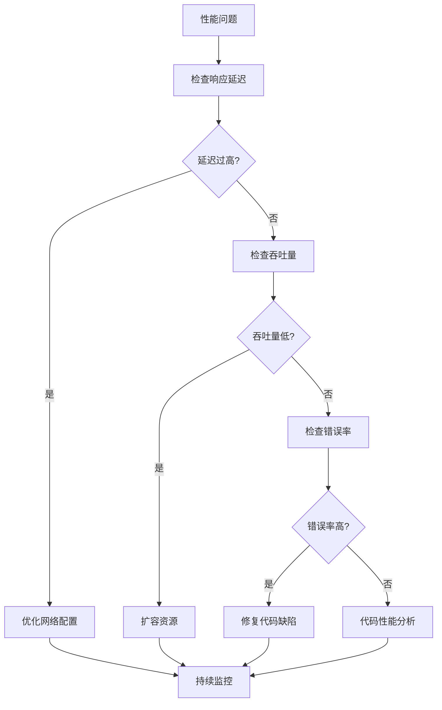

### 监控和告警

#### 关键指标监控

| 监控指标 | 正常范围 | 告警阈值 | 处理建议 |
|---------|----------|----------|----------|
| 响应时间 | < 2秒 | > 5秒 | 检查网络和服务性能 |
| 错误率 | < 1% | > 5% | 分析错误日志，定位问题 |
| 吞吐量 | > 100 QPS | < 50 QPS | 检查资源使用情况 |
| 连接数 | < 80% | > 90% | 考虑扩容或优化 |

#### 日志分析

系统提供详细的日志记录功能，支持按级别和关键词进行日志分析：

```python
# 日志级别配置示例
logger.info("Async requesting SPARKDESK-RAG: https://api.sparkdesk.com")
logger.debug("Request body: {}", request_body)
logger.warning("High latency detected: {}ms", latency)
logger.error("Request failed: {}", error_message)
```

**章节来源**
- [sparkdesk.py](file://core/knowledge/infra/desk/sparkdesk.py#L70-L80)
- [sparkdesk_test.py](file://core/knowledge/tests/infra/desk/sparkdesk_test.py#L50-L100)

## 总结

SparkDesk集成系统通过精心设计的架构和完善的机制，提供了稳定可靠的星火认知大模型接入能力。系统具备以下核心优势：

1. **高性能**: 基于异步编程和连接池技术，确保高并发处理能力
2. **高可用**: 完善的错误处理和恢复机制，保障服务稳定性
3. **可扩展**: 模块化设计，便于功能扩展和维护
4. **易维护**: 详细的日志记录和监控指标，便于问题诊断
5. **安全可靠**: 多层次的安全防护和权限控制

通过遵循本文档提供的最佳实践和优化建议，可以充分发挥SparkDesk集成系统的潜力，为企业提供优质的智能问答服务。