# 知识库服务架构文档

<cite>
**本文档引用的文件**
- [main.py](file://core/knowledge/main.py)
- [rag_strategy_factory.py](file://core/knowledge/service/rag_strategy_factory.py)
- [rag_strategy.py](file://core/knowledge/service/rag_strategy.py)
- [ragflow_strategy.py](file://core/knowledge/service/impl/ragflow_strategy.py)
- [sparkdesk_strategy.py](file://core/knowledge/service/impl/sparkdesk_strategy.py)
- [aiui_strategy.py](file://core/knowledge/service/impl/aiui_strategy.py)
- [rag_do.py](file://core/knowledge/domain/entity/rag_do.py)
- [ragflow_client.py](file://core/knowledge/infra/ragflow/ragflow_client.py)
- [ragflow_utils.py](file://core/knowledge/infra/ragflow/ragflow_utils.py)
- [api.py](file://core/knowledge/api/v1/api.py)
- [response.py](file://core/knowledge/domain/response.py)
- [exception.py](file://core/knowledge/exceptions/exception.py)
- [error_code.py](file://core/knowledge/consts/error_code.py)
- [constants.py](file://core/knowledge/consts/constants.py)
- [factory.py](file://core/common/service/cache/factory.py)
</cite>

## 目录
1. [概述](#概述)
2. [系统架构](#系统架构)
3. [核心组件](#核心组件)
4. [策略模式实现](#策略模式实现)
5. [RAGFlow客户端集成](#ragflow客户端集成)
6. [知识文档领域模型](#知识文档领域模型)
7. [API设计与处理机制](#api设计与处理机制)
8. [异常处理与错误码](#异常处理与错误码)
9. [性能优化策略](#性能优化策略)
10. [多租户隔离](#多租户隔离)
11. [部署配置](#部署配置)
12. [总结](#总结)

## 概述

知识库服务是一个统一的知识接入层，为不同类型的RAG（检索增强生成）系统提供标准化的接口。该服务支持多种知识引擎，包括RAGFlow、AIUI、SparkDesk等，通过策略模式实现不同知识源的适配和统一管理。

### 主要特性

- **多引擎支持**：统一接口支持RAGFlow、AIUI、SparkDesk等多种知识引擎
- **策略模式**：基于抽象策略类实现可插拔的知识处理策略
- **异步处理**：采用异步编程模型提高并发处理能力
- **分布式追踪**：集成OTLP监控系统实现全链路追踪
- **缓存机制**：支持Redis缓存提升查询性能
- **多租户隔离**：支持多租户环境下的知识库隔离

## 系统架构

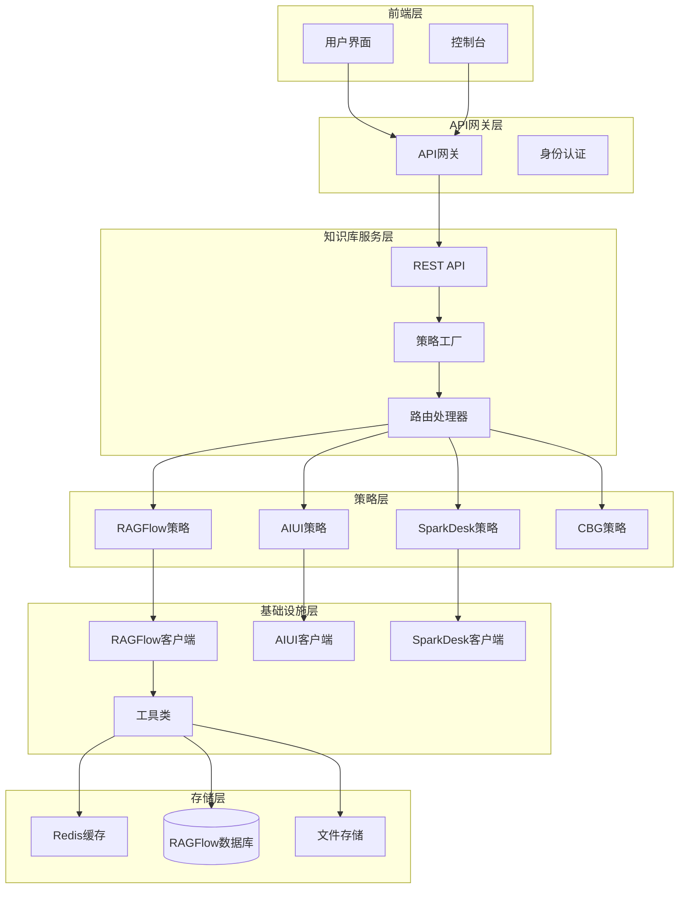
```mermaid
graph TB
subgraph "前端层"
UI[用户界面]
Console[控制台]
end
subgraph "API网关层"
Gateway[API网关]
Auth[身份认证]
end
subgraph "知识库服务层"
API[REST API]
Factory[策略工厂]
Router[路由处理器]
end
subgraph "策略层"
RagflowStrategy[RAGFlow策略]
AiuiStrategy[AIUI策略]
SparkDeskStrategy[SparkDesk策略]
CbgStrategy[CBG策略]
end
subgraph "基础设施层"
RagflowClient[RAGFlow客户端]
AiuiClient[AIUI客户端]
SparkDeskClient[SparkDesk客户端]
Utils[工具类]
end
subgraph "存储层"
Redis[Redis缓存]
RAGFlowDB[(RAGFlow数据库)]
FileStorage[文件存储]
end
UI --> Gateway
Console --> Gateway
Gateway --> API
API --> Factory
Factory --> Router
Router --> RagflowStrategy
Router --> AiuiStrategy
Router --> SparkDeskStrategy
Router --> CbgStrategy
RagflowStrategy --> RagflowClient
AiuiStrategy --> AiuiClient
SparkDeskStrategy --> SparkDeskClient
RagflowClient --> Utils
Utils --> Redis
Utils --> RAGFlowDB
Utils --> FileStorage
```

**架构图来源**
- [main.py](file://core/knowledge/main.py#L1-L113)
- [rag_strategy_factory.py](file://core/knowledge/service/rag_strategy_factory.py#L1-L95)
- [api.py](file://core/knowledge/api/v1/api.py#L1-L479)

## 核心组件

### 服务入口点

知识库服务的主入口点负责初始化系统配置、创建FastAPI应用实例，并设置全局异常处理机制。

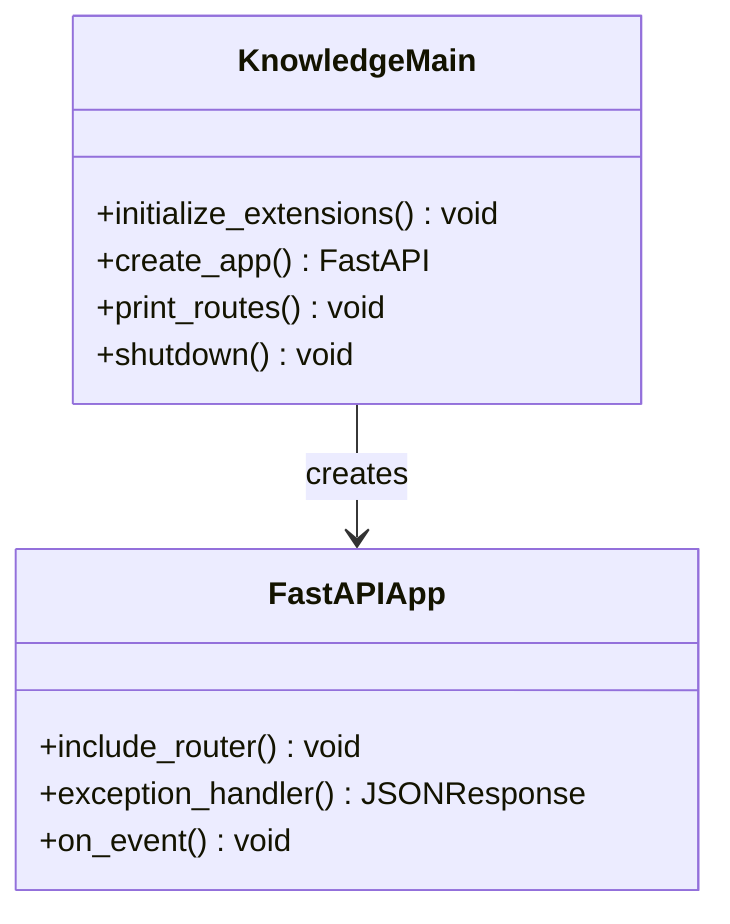
```mermaid
classDiagram
class KnowledgeMain {
+initialize_extensions() void
+create_app() FastAPI
+print_routes() void
+shutdown() void
}
class FastAPIApp {
+include_router() void
+exception_handler() JSONResponse
+on_event() void
}
KnowledgeMain --> FastAPIApp : creates
```

**类图来源**
- [main.py](file://core/knowledge/main.py#L15-L113)

### 策略工厂

策略工厂采用工厂模式实现不同RAG策略的动态创建和管理。

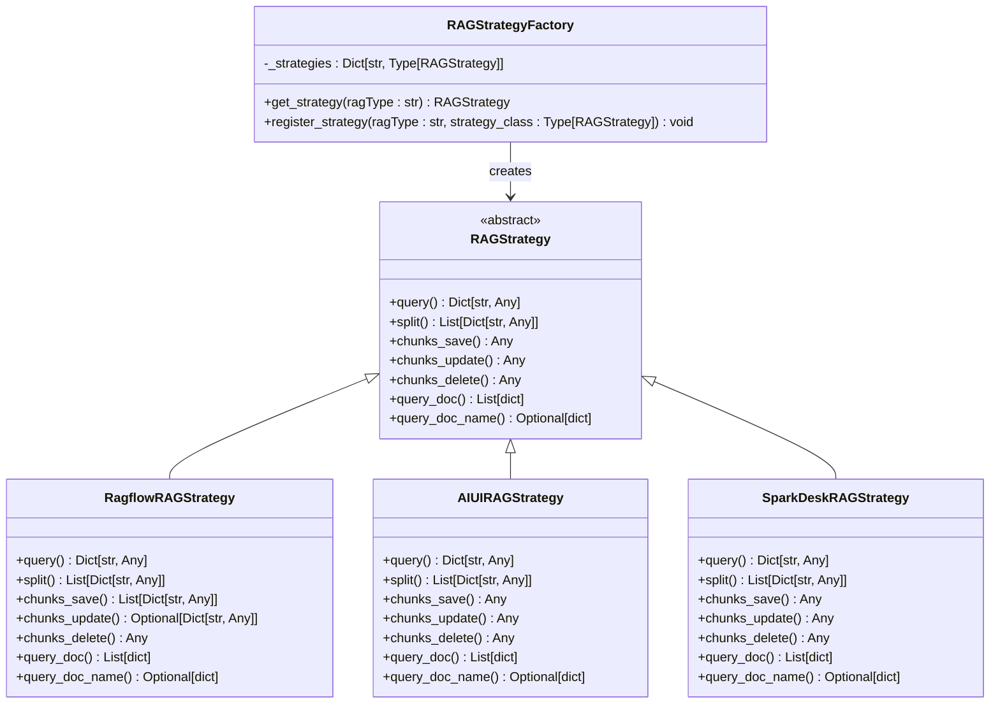
```mermaid
classDiagram
class RAGStrategyFactory {
-_strategies : Dict[str, Type[RAGStrategy]]
+get_strategy(ragType : str) RAGStrategy
+register_strategy(ragType : str, strategy_class : Type[RAGStrategy]) void
}
class RAGStrategy {
<<abstract>>
+query() Dict[str, Any]
+split() List[Dict[str, Any]]
+chunks_save() Any
+chunks_update() Any
+chunks_delete() Any
+query_doc() List[dict]
+query_doc_name() Optional[dict]
}
class RagflowRAGStrategy {
+query() Dict[str, Any]
+split() List[Dict[str, Any]]
+chunks_save() List[Dict[str, Any]]
+chunks_update() Optional[Dict[str, Any]]
+chunks_delete() Any
+query_doc() List[dict]
+query_doc_name() Optional[dict]
}
class AIUIRAGStrategy {
+query() Dict[str, Any]
+split() List[Dict[str, Any]]
+chunks_save() Any
+chunks_update() Any
+chunks_delete() Any
+query_doc() List[dict]
+query_doc_name() Optional[dict]
}
class SparkDeskRAGStrategy {
+query() Dict[str, Any]
+split() List[Dict[str, Any]]
+chunks_save() Any
+chunks_update() Any
+chunks_delete() Any
+query_doc() List[dict]
+query_doc_name() Optional[dict]
}
RAGStrategyFactory --> RAGStrategy : creates
RAGStrategy <|-- RagflowRAGStrategy
RAGStrategy <|-- AIUIRAGStrategy
RAGStrategy <|-- SparkDeskRAGStrategy
```

**类图来源**
- [rag_strategy_factory.py](file://core/knowledge/service/rag_strategy_factory.py#L15-L95)
- [rag_strategy.py](file://core/knowledge/service/rag_strategy.py#L10-L87)

**章节来源**
- [main.py](file://core/knowledge/main.py#L1-L113)
- [rag_strategy_factory.py](file://core/knowledge/service/rag_strategy_factory.py#L1-L95)

## 策略模式实现

### 基于策略模式的RAGFlow策略

RAGFlow策略是知识库服务的核心实现，提供了完整的文档处理和知识管理功能。

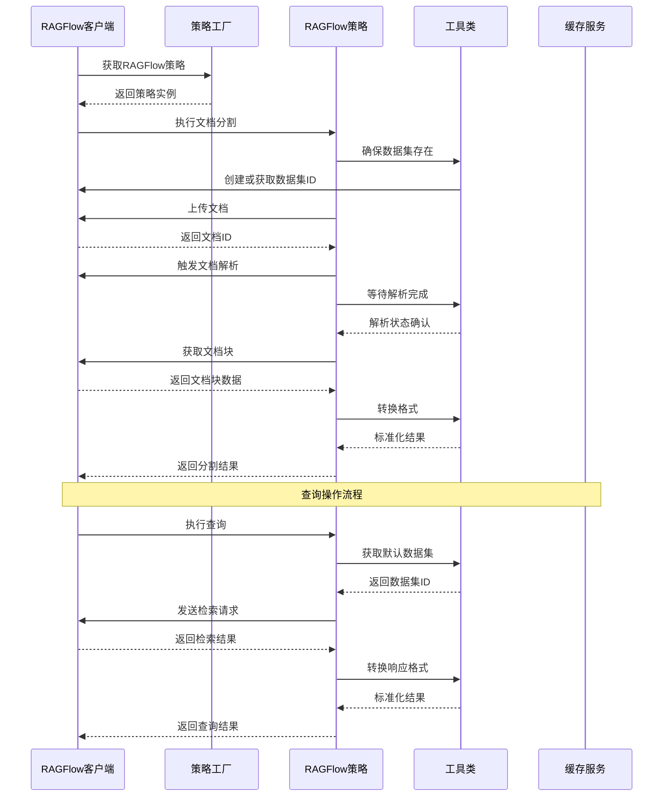
```mermaid
sequenceDiagram
participant Client as 客户端
participant Factory as 策略工厂
participant Strategy as RAGFlow策略
participant Client as RAGFlow客户端
participant Utils as 工具类
participant Cache as 缓存服务
Client->>Factory : 获取RAGFlow策略
Factory-->>Client : 返回策略实例
Client->>Strategy : 执行文档分割
Strategy->>Utils : 确保数据集存在
Utils->>Client : 创建或获取数据集ID
Strategy->>Client : 上传文档
Client-->>Strategy : 返回文档ID
Strategy->>Client : 触发文档解析
Strategy->>Utils : 等待解析完成
Utils-->>Strategy : 解析状态确认
Strategy->>Client : 获取文档块
Client-->>Strategy : 返回文档块数据
Strategy->>Utils : 转换格式
Utils-->>Strategy : 标准化结果
Strategy-->>Client : 返回分割结果
Note over Client,Cache : 查询操作流程
Client->>Strategy : 执行查询
Strategy->>Utils : 获取默认数据集
Utils-->>Strategy : 返回数据集ID
Strategy->>Client : 发送检索请求
Client-->>Strategy : 返回检索结果
Strategy->>Utils : 转换响应格式
Utils-->>Strategy : 标准化结果
Strategy-->>Client : 返回查询结果
```

**序列图来源**
- [ragflow_strategy.py](file://core/knowledge/service/impl/ragflow_strategy.py#L25-L150)
- [ragflow_client.py](file://core/knowledge/infra/ragflow/ragflow_client.py#L600-L700)

### 文档处理流程

RAGFlow策略实现了完整的文档处理流水线，包括文件上传、解析、分块和索引构建。

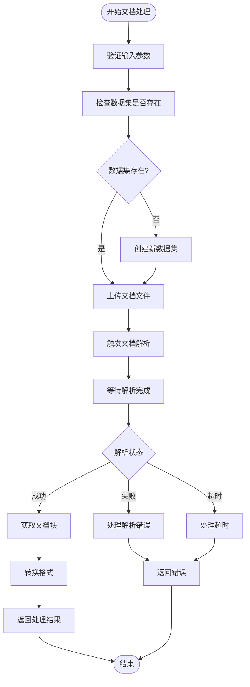
```mermaid
flowchart TD
Start([开始文档处理]) --> ValidateParams["验证输入参数"]
ValidateParams --> CheckDataset["检查数据集是否存在"]
CheckDataset --> DatasetExists{"数据集存在?"}
DatasetExists --> |否| CreateDataset["创建新数据集"]
DatasetExists --> |是| UploadFile["上传文档文件"]
CreateDataset --> UploadFile
UploadFile --> TriggerParse["触发文档解析"]
TriggerParse --> WaitParse["等待解析完成"]
WaitParse --> ParseStatus{"解析状态"}
ParseStatus --> |成功| GetChunks["获取文档块"]
ParseStatus --> |失败| HandleError["处理解析错误"]
ParseStatus --> |超时| HandleTimeout["处理超时"]
GetChunks --> ConvertFormat["转换格式"]
ConvertFormat --> ReturnResult["返回处理结果"]
HandleError --> ReturnError["返回错误"]
HandleTimeout --> ReturnError
ReturnResult --> End([结束])
ReturnError --> End
```

**流程图来源**
- [ragflow_strategy.py](file://core/knowledge/service/impl/ragflow_strategy.py#L150-L350)

**章节来源**
- [ragflow_strategy.py](file://core/knowledge/service/impl/ragflow_strategy.py#L1-L799)

## RAGFlow客户端集成

### 异步HTTP客户端设计

RAGFlow客户端采用异步HTTP客户端实现与外部RAGFlow系统的高效集成。

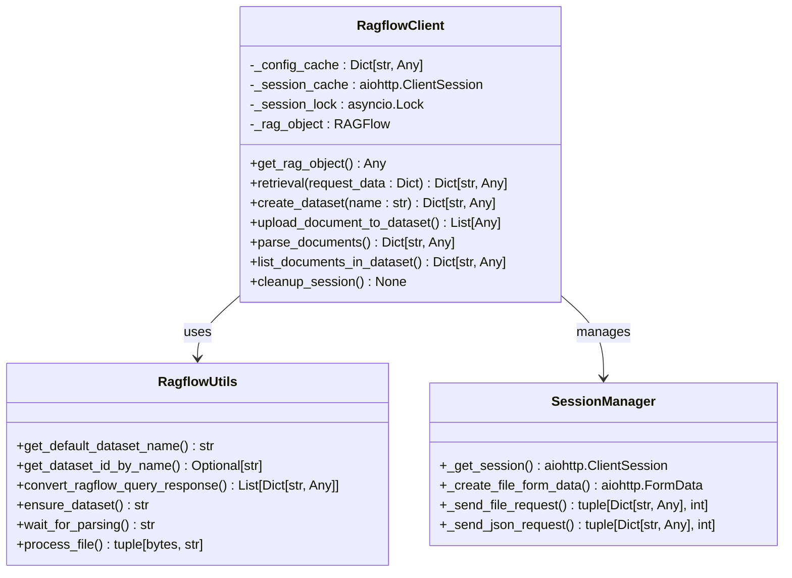
```mermaid
classDiagram
class RagflowClient {
-_config_cache : Dict[str, Any]
-_session_cache : aiohttp.ClientSession
-_session_lock : asyncio.Lock
-_rag_object : RAGFlow
+get_rag_object() Any
+retrieval(request_data : Dict) Dict[str, Any]
+create_dataset(name : str) Dict[str, Any]
+upload_document_to_dataset() List[Any]
+parse_documents() Dict[str, Any]
+list_documents_in_dataset() Dict[str, Any]
+cleanup_session() None
}
class RagflowUtils {
+get_default_dataset_name() str
+get_dataset_id_by_name() Optional[str]
+convert_ragflow_query_response() List[Dict[str, Any]]
+ensure_dataset() str
+wait_for_parsing() str
+process_file() tuple[bytes, str]
}
class SessionManager {
+_get_session() aiohttp.ClientSession
+_create_file_form_data() aiohttp.FormData
+_send_file_request() tuple[Dict[str, Any], int]
+_send_json_request() tuple[Dict[str, Any], int]
}
RagflowClient --> RagflowUtils : uses
RagflowClient --> SessionManager : manages
```

**类图来源**
- [ragflow_client.py](file://core/knowledge/infra/ragflow/ragflow_client.py#L1-L200)
- [ragflow_utils.py](file://core/knowledge/infra/ragflow/ragflow_utils.py#L1-L200)

### 认证与会话管理

RAGFlow客户端实现了完善的认证机制和会话管理策略。

| 功能模块 | 实现细节 | 配置参数 |
|---------|---------|---------|
| 认证机制 | Bearer Token认证 | `RAGFLOW_API_TOKEN` |
| 会话管理 | 单例模式，连接池复用 | `RAGFLOW_TIMEOUT` |
| 连接配置 | TCP连接器，限制并发数 | `limit=100`, `limit_per_host=30` |
| 重试机制 | 最大重试次数2次 | 自动重试失败请求 |
| 错误处理 | 会话关闭自动重建 | `enable_cleanup_closed=True` |

### 文档上传与索引流程

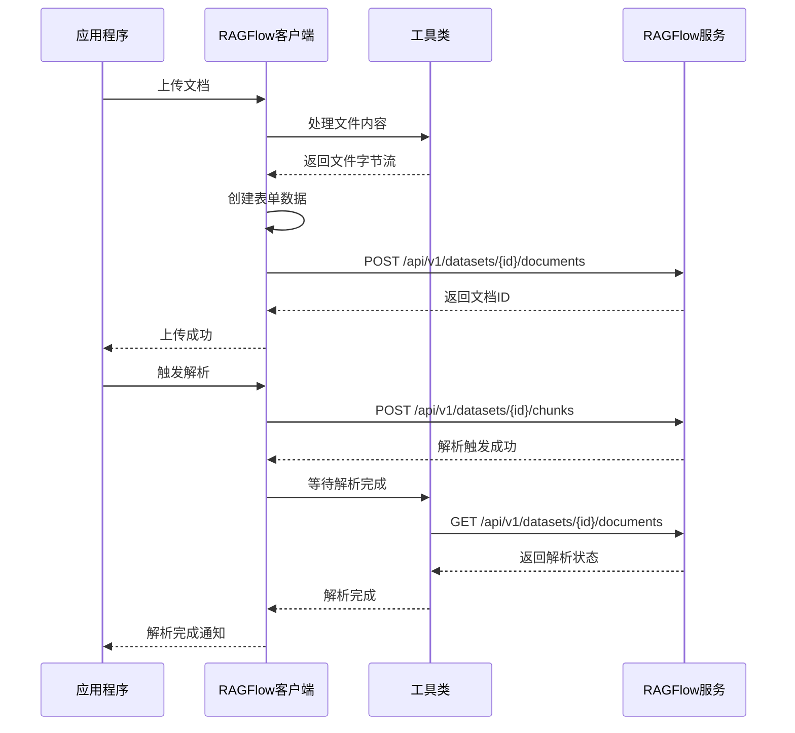
```mermaid
sequenceDiagram
participant App as 应用程序
participant Client as RAGFlow客户端
participant Utils as 工具类
participant RAGFlow as RAGFlow服务
App->>Client : 上传文档
Client->>Utils : 处理文件内容
Utils-->>Client : 返回文件字节流
Client->>Client : 创建表单数据
Client->>RAGFlow : POST /api/v1/datasets/{id}/documents
RAGFlow-->>Client : 返回文档ID
Client-->>App : 上传成功
App->>Client : 触发解析
Client->>RAGFlow : POST /api/v1/datasets/{id}/chunks
RAGFlow-->>Client : 解析触发成功
Client->>Utils : 等待解析完成
Utils->>RAGFlow : GET /api/v1/datasets/{id}/documents
RAGFlow-->>Utils : 返回解析状态
Utils-->>Client : 解析完成
Client-->>App : 解析完成通知
```

**序列图来源**
- [ragflow_client.py](file://core/knowledge/infra/ragflow/ragflow_client.py#L400-L600)

**章节来源**
- [ragflow_client.py](file://core/knowledge/infra/ragflow/ragflow_client.py#L1-L799)
- [ragflow_utils.py](file://core/knowledge/infra/ragflow/ragflow_utils.py#L1-L199)

## 知识文档领域模型

### 数据对象设计

知识库服务定义了清晰的数据模型来表示知识文档和相关实体。

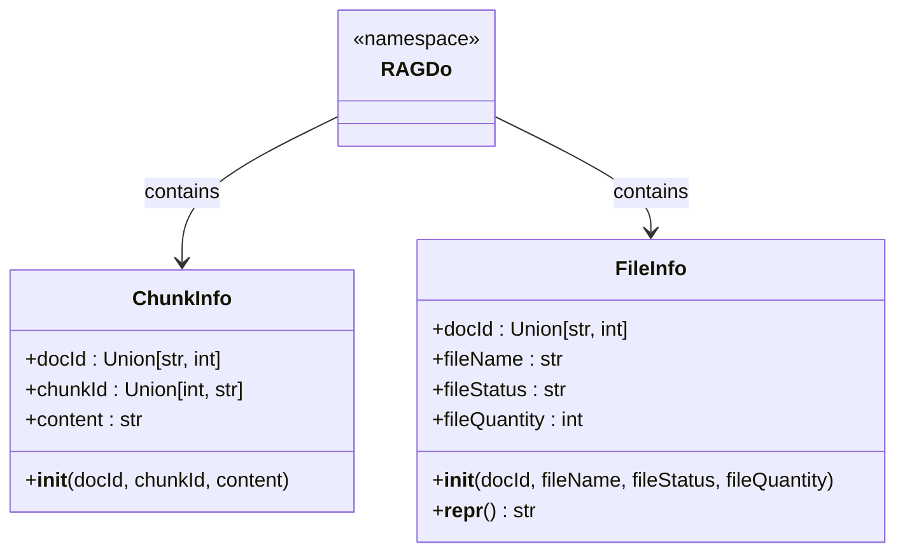
```mermaid
classDiagram
class ChunkInfo {
+docId : Union[str, int]
+chunkId : Union[int, str]
+content : str
+__init__(docId, chunkId, content)
}
class FileInfo {
+docId : Union[str, int]
+fileName : str
+fileStatus : str
+fileQuantity : int
+__init__(docId, fileName, fileStatus, fileQuantity)
+__repr__() str
}
class RAGDo {
<<namespace>>
}
RAGDo --> ChunkInfo : contains
RAGDo --> FileInfo : contains
```

**类图来源**
- [rag_do.py](file://core/knowledge/domain/entity/rag_do.py#L1-L53)

### 元数据管理策略

| 字段名称 | 数据类型 | 描述 | 约束条件 |
|---------|---------|------|---------|
| docId | Union[str, int] | 文档唯一标识符 | 必填，全局唯一 |
| chunkId | Union[int, str] | 块唯一标识符 | 必填，块内唯一 |
| content | str | 块内容文本 | 必填，不能为空 |
| fileName | str | 文件名称 | 必填，用于显示 |
| fileStatus | str | 文件状态 | 可选，默认空字符串 |
| fileQuantity | int | 文件数量 | 可选，默认0 |

### 分块策略配置

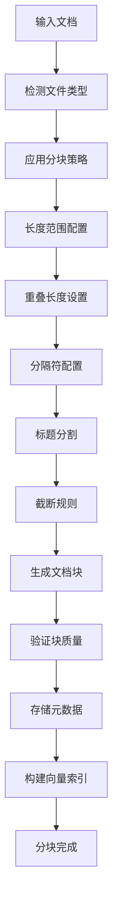
```mermaid
flowchart TD
Input[输入文档] --> DetectType["检测文件类型"]
DetectType --> ApplyStrategy["应用分块策略"]
ApplyStrategy --> LengthRange["长度范围配置"]
LengthRange --> Overlap["重叠长度设置"]
Overlap --> Separator["分隔符配置"]
Separator --> TitleSplit["标题分割"]
TitleSplit --> CutOff["截断规则"]
CutOff --> GenerateChunks["生成文档块"]
GenerateChunks --> ValidateChunks["验证块质量"]
ValidateChunks --> StoreMetadata["存储元数据"]
StoreMetadata --> IndexVector["构建向量索引"]
IndexVector --> Complete[分块完成]
```

**流程图来源**
- [ragflow_strategy.py](file://core/knowledge/service/impl/ragflow_strategy.py#L200-L350)

**章节来源**
- [rag_do.py](file://core/knowledge/domain/entity/rag_do.py#L1-L53)

## API设计与处理机制

### RESTful API架构

知识库服务提供了完整的RESTful API接口，支持文档处理、知识块管理和查询操作。

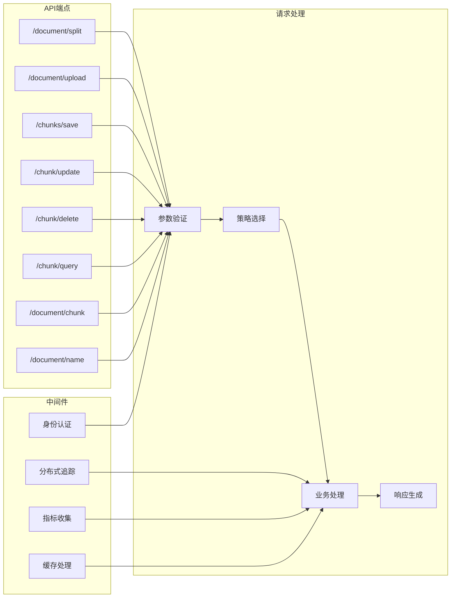
```mermaid
graph LR
subgraph "API端点"
Split["/document/split"]
Upload["/document/upload"]
Save["/chunks/save"]
Update["/chunk/update"]
Delete["/chunk/delete"]
Query["/chunk/query"]
DocQuery["/document/chunk"]
DocName["/document/name"]
end
subgraph "请求处理"
Validator["参数验证"]
Strategy["策略选择"]
Handler["业务处理"]
Response["响应生成"]
end
subgraph "中间件"
Auth["身份认证"]
Trace["分布式追踪"]
Metrics["指标收集"]
Cache["缓存处理"]
end
Split --> Validator
Upload --> Validator
Save --> Validator
Update --> Validator
Delete --> Validator
Query --> Validator
DocQuery --> Validator
DocName --> Validator
Validator --> Strategy
Strategy --> Handler
Handler --> Response
Auth --> Validator
Trace --> Handler
Metrics --> Handler
Cache --> Handler
```

**架构图来源**
- [api.py](file://core/knowledge/api/v1/api.py#L1-L100)

### 统一异常处理机制

服务实现了统一的异常处理机制，确保所有错误都以标准格式返回。

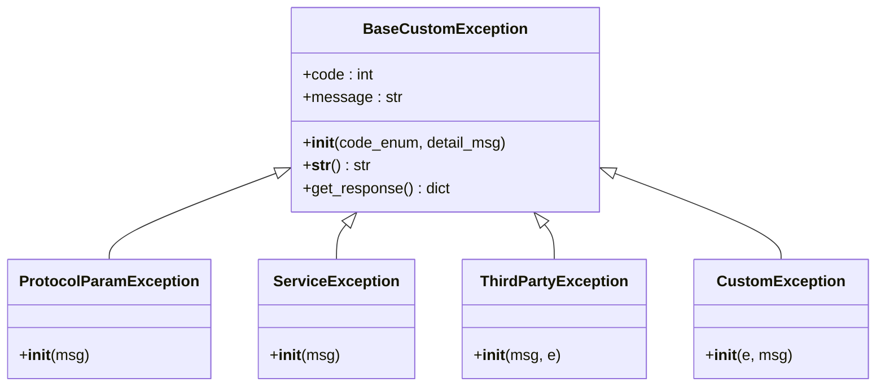
```mermaid
classDiagram
class BaseCustomException {
+code : int
+message : str
+__init__(code_enum, detail_msg)
+__str__() str
+get_response() dict
}
class ProtocolParamException {
+__init__(msg)
}
class ServiceException {
+__init__(msg)
}
class ThirdPartyException {
+__init__(msg, e)
}
class CustomException {
+__init__(e, msg)
}
BaseCustomException <|-- ProtocolParamException
BaseCustomException <|-- ServiceException
BaseCustomException <|-- ThirdPartyException
BaseCustomException <|-- CustomException
```

**类图来源**
- [exception.py](file://core/knowledge/exceptions/exception.py#L1-L87)

### 异步处理与并发控制

| 处理阶段 | 异步实现 | 并发控制 | 超时设置 |
|---------|---------|---------|---------|
| 文件上传 | aiohttp异步客户端 | 连接池限制 | 30秒 |
| 文档解析 | 异步轮询 | 信号量控制 | 300秒 |
| 查询处理 | 异步API调用 | 请求限流 | 60秒 |
| 缓存操作 | Redis异步命令 | 连接池复用 | 10秒 |

### 分布式追踪与监控

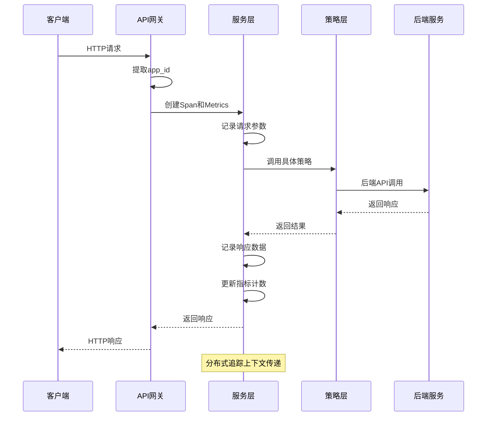
```mermaid
sequenceDiagram
participant Client as 客户端
participant API as API网关
participant Service as 服务层
participant Strategy as 策略层
participant Backend as 后端服务
Client->>API : HTTP请求
API->>API : 提取app_id
API->>Service : 创建Span和Metrics
Service->>Service : 记录请求参数
Service->>Strategy : 调用具体策略
Strategy->>Backend : 后端API调用
Backend-->>Strategy : 返回响应
Strategy-->>Service : 返回结果
Service->>Service : 记录响应数据
Service->>Service : 更新指标计数
Service-->>API : 返回响应
API-->>Client : HTTP响应
Note over Service : 分布式追踪上下文传递
```

**序列图来源**
- [api.py](file://core/knowledge/api/v1/api.py#L50-L150)

**章节来源**
- [api.py](file://core/knowledge/api/v1/api.py#L1-L479)
- [exception.py](file://core/knowledge/exceptions/exception.py#L1-L87)

## 异常处理与错误码

### 错误码体系

知识库服务定义了完整的错误码体系，涵盖各种业务场景和系统异常。

| 错误类别 | 错误码范围 | 主要错误码 | 描述 |
|---------|-----------|-----------|------|
| 参数校验 | 10001-10004 | ParameterCheckException | 参数验证失败 |
| 文件处理 | 10016-10025 | FileSplitFailed | 文件分割失败 |
| 知识块操作 | 10017-10019 | ChunkSaveFailed | 块保存失败 |
| 第三方服务 | 10024-10028 | ThirdPartyServiceFailed | 第三方服务异常 |
| 系统异常 | 14999 | ServiceException | 通用服务异常 |

### 错误处理流程

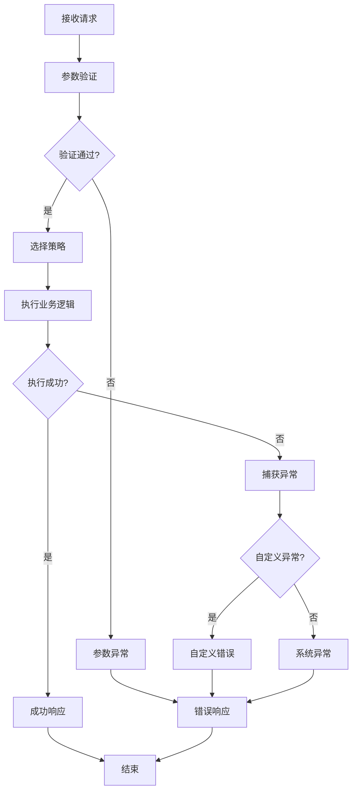
```mermaid
flowchart TD
Request[接收请求] --> Validate[参数验证]
Validate --> ValidOK{"验证通过?"}
ValidOK --> |否| ParamError[参数异常]
ValidOK --> |是| Strategy[选择策略]
Strategy --> Execute[执行业务逻辑]
Execute --> Success{"执行成功?"}
Success --> |是| SuccessResponse[成功响应]
Success --> |否| CatchException[捕获异常]
CatchException --> CustomException{自定义异常?}
CustomException --> |是| CustomError[自定义错误]
CustomException --> |否| SystemException[系统异常]
ParamError --> ErrorResponse[错误响应]
CustomError --> ErrorResponse
SystemException --> ErrorResponse
SuccessResponse --> End[结束]
ErrorResponse --> End
```

**流程图来源**
- [api.py](file://core/knowledge/api/v1/api.py#L80-L150)
- [error_code.py](file://core/knowledge/consts/error_code.py#L1-L48)

**章节来源**
- [error_code.py](file://core/knowledge/consts/error_code.py#L1-L48)
- [exception.py](file://core/knowledge/exceptions/exception.py#L1-L87)

## 性能优化策略

### 缓存策略设计

知识库服务实现了多层次的缓存策略来提升性能。

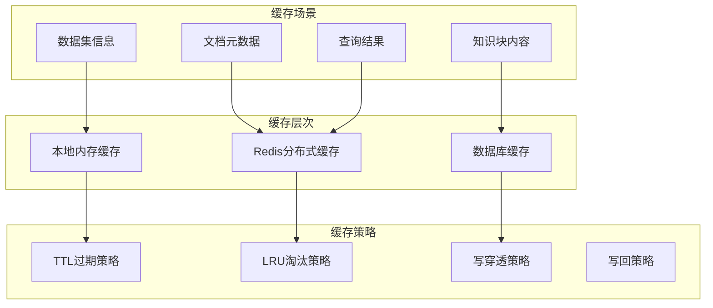
```mermaid
graph TB
subgraph "缓存层次"
L1[本地内存缓存]
L2[Redis分布式缓存]
L3[数据库缓存]
end
subgraph "缓存策略"
TTL[TTL过期策略]
LRU[LRU淘汰策略]
WriteThrough[写穿透策略]
WriteBack[写回策略]
end
subgraph "缓存场景"
Dataset[数据集信息]
Document[文档元数据]
Chunk[知识块内容]
Query[查询结果]
end
L1 --> TTL
L2 --> LRU
L3 --> WriteThrough
Dataset --> L1
Document --> L2
Chunk --> L3
Query --> L2
```

**缓存策略表**

| 缓存类型 | 存储位置 | 过期时间 | 使用场景 |
|---------|---------|---------|---------|
| 数据集缓存 | Redis | 30分钟 | 数据集ID映射 |
| 文档元数据 | Redis | 1小时 | 文档基本信息 |
| 查询结果 | Redis | 15分钟 | 检索结果缓存 |
| 分块内容 | 数据库 | 永久 | 知识块持久化 |

### 异步处理优化

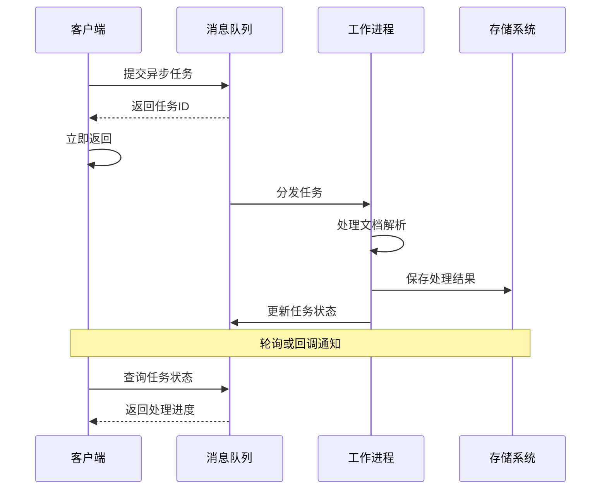
```mermaid
sequenceDiagram
participant Client as 客户端
participant Queue as 消息队列
participant Worker as 工作进程
participant Storage as 存储系统
Client->>Queue : 提交异步任务
Queue-->>Client : 返回任务ID
Client->>Client : 立即返回
Queue->>Worker : 分发任务
Worker->>Worker : 处理文档解析
Worker->>Storage : 保存处理结果
Worker->>Queue : 更新任务状态
Note over Client,Storage : 轮询或回调通知
Client->>Queue : 查询任务状态
Queue-->>Client : 返回处理进度
```

### 并发控制与资源管理

| 资源类型 | 限制策略 | 默认值 | 配置参数 |
|---------|---------|-------|---------|
| HTTP连接池 | 总连接数限制 | 100 | `limit=100` |
| 主机连接数 | 每主机连接数 | 30 | `limit_per_host=30` |
| 保持连接时间 | 连接存活时间 | 600秒 | `keepalive_timeout=600` |
| 重试次数 | 失败重试 | 2次 | `max_retries=2` |
| 超时时间 | 请求超时 | 30秒 | `timeout=30` |

**章节来源**
- [factory.py](file://core/common/service/cache/factory.py#L1-L31)

## 多租户隔离

### 租户隔离策略

知识库服务通过多种机制实现多租户环境下的数据隔离和资源管理。

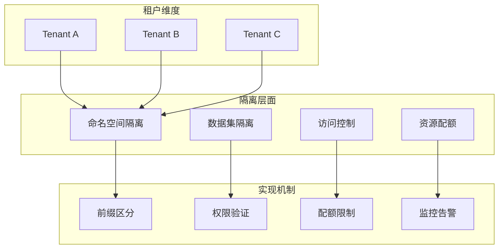
```mermaid
graph TB
subgraph "租户维度"
Tenant1[Tenant A]
Tenant2[Tenant B]
Tenant3[Tenant C]
end
subgraph "隔离层面"
Namespace[命名空间隔离]
Dataset[数据集隔离]
Access[访问控制]
Resource[资源配额]
end
subgraph "实现机制"
Prefix[前缀区分]
Permission[权限验证]
Quota[配额限制]
Monitor[监控告警]
end
Tenant1 --> Namespace
Tenant2 --> Namespace
Tenant3 --> Namespace
Namespace --> Prefix
Dataset --> Permission
Access --> Quota
Resource --> Monitor
```

### 配置隔离机制

| 隔离维度 | 实现方式 | 配置示例 | 作用范围 |
|---------|---------|---------|---------|
| 数据集隔离 | 环境变量前缀 | `TENANT_A_DATASET` | 不同租户独立数据集 |
| 用户标识 | 请求头传递 | `X-Tenant-ID: tenant_a` | 用户级别权限控制 |
| 资源配额 | 配额限制 | `MAX_DOCUMENT_SIZE=10MB` | 防止资源滥用 |
| 访问日志 | 日志分离 | `tenant_a_access.log` | 审计和监控 |

### 多租户安全策略

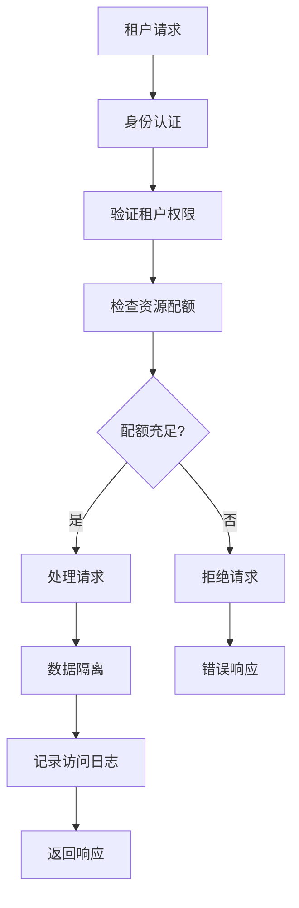
```mermaid
flowchart TD
Request[租户请求] --> Auth[身份认证]
Auth --> ValidateTenant[验证租户权限]
ValidateTenant --> CheckQuota[检查资源配额]
CheckQuota --> HasQuota{"配额充足?"}
HasQuota --> |否| Reject[拒绝请求]
HasQuota --> |是| ProcessRequest[处理请求]
ProcessRequest --> IsolateData[数据隔离]
IsolateData --> LogAccess[记录访问日志]
LogAccess --> ReturnResponse[返回响应]
Reject --> ErrorResponse[错误响应]
```

**章节来源**
- [constants.py](file://core/knowledge/consts/constants.py#L1-L7)

## 部署配置

### 环境变量配置

知识库服务依赖以下关键环境变量进行配置：

| 配置项 | 默认值 | 描述 | 必需性 |
|-------|-------|------|-------|
| `SERVICE_PORT` | 20010 | 服务监听端口 | 必需 |
| `RAGFLOW_BASE_URL` | - | RAGFlow服务地址 | 必需 |
| `RAGFLOW_API_TOKEN` | - | RAGFlow API密钥 | 必需 |
| `RAGFLOW_DEFAULT_GROUP` | Stellar Knowledge Base | 默认数据组 | 必需 |
| `RAGFLOW_TIMEOUT` | 30 | 请求超时时间(秒) | 可选 |
| `REDIS_ADDR` | - | Redis服务器地址 | 可选 |
| `REDIS_PASSWORD` | - | Redis密码 | 可选 |
| `WORKERS` | 1 | Uvicorn工作进程数 | 可选 |

### Docker部署架构

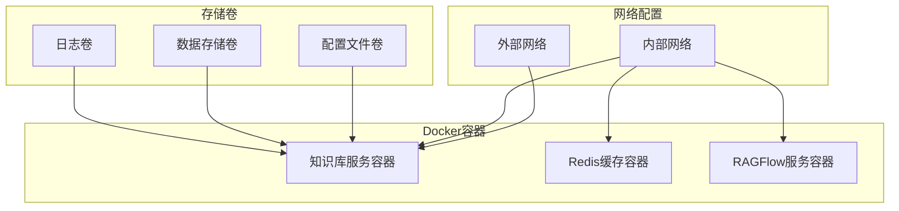
```mermaid
graph TB
subgraph "Docker容器"
KnowledgeService[知识库服务容器]
RedisContainer[Redis缓存容器]
RAGFlowContainer[RAGFlow服务容器]
end
subgraph "网络配置"
InternalNet[内部网络]
ExternalNet[外部网络]
end
subgraph "存储卷"
ConfigVol[配置文件卷]
DataVol[数据存储卷]
LogVol[日志卷]
end
ExternalNet --> KnowledgeService
InternalNet --> RedisContainer
InternalNet --> RAGFlowContainer
InternalNet --> KnowledgeService
ConfigVol --> KnowledgeService
DataVol --> KnowledgeService
LogVol --> KnowledgeService
```

### 性能调优建议

| 优化项目 | 推荐配置 | 说明 |
|---------|---------|------|
| 内存分配 | 2GB+ | 根据文档大小调整 |
| CPU核心数 | 2+ | 支持并发处理 |
| 磁盘空间 | 10GB+ | 存储文档和索引 |
| 网络带宽 | 100Mbps+ | 支持大文件传输 |
| 连接池大小 | 50-100 | 平衡性能和资源 |

**章节来源**
- [main.py](file://core/knowledge/main.py#L90-L113)

## 总结

知识库服务通过精心设计的架构实现了统一的知识接入层，具有以下核心优势：

### 技术亮点

1. **策略模式应用**：通过抽象策略类和工厂模式，实现了多种RAG引擎的无缝切换和扩展
2. **异步架构设计**：采用异步编程模型，显著提升了系统的并发处理能力和响应速度
3. **统一异常处理**：建立了完整的错误码体系和异常处理机制，确保系统稳定性
4. **分布式追踪**：集成了OTLP监控系统，提供了完整的可观测性支持

### 架构优势

1. **可扩展性**：模块化设计使得新增知识引擎变得简单快捷
2. **高可用性**：完善的错误处理和重试机制保证了服务的可靠性
3. **性能优化**：多层次缓存和异步处理显著提升了系统性能
4. **多租户支持**：通过多种隔离策略实现了多租户环境下的安全运行

### 应用价值

知识库服务为AI应用提供了强大的知识管理能力，支持企业级的知识库建设和智能问答系统的快速开发，是构建现代化AI应用的重要基础设施。