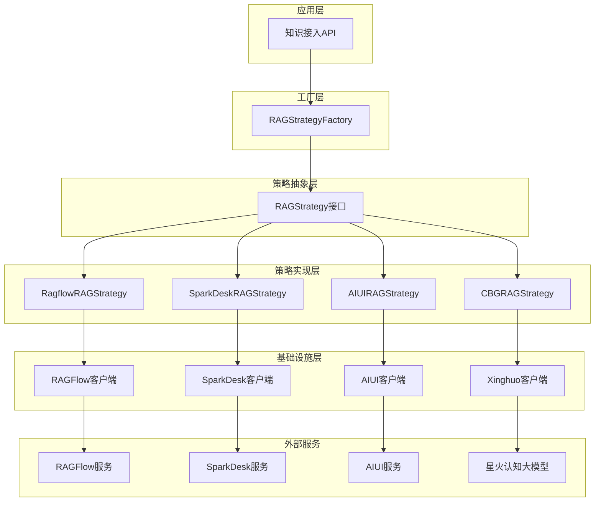
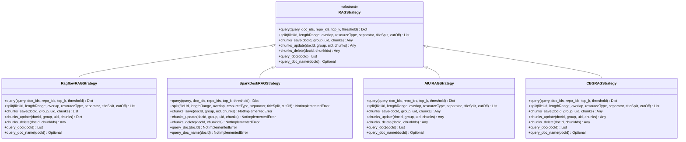
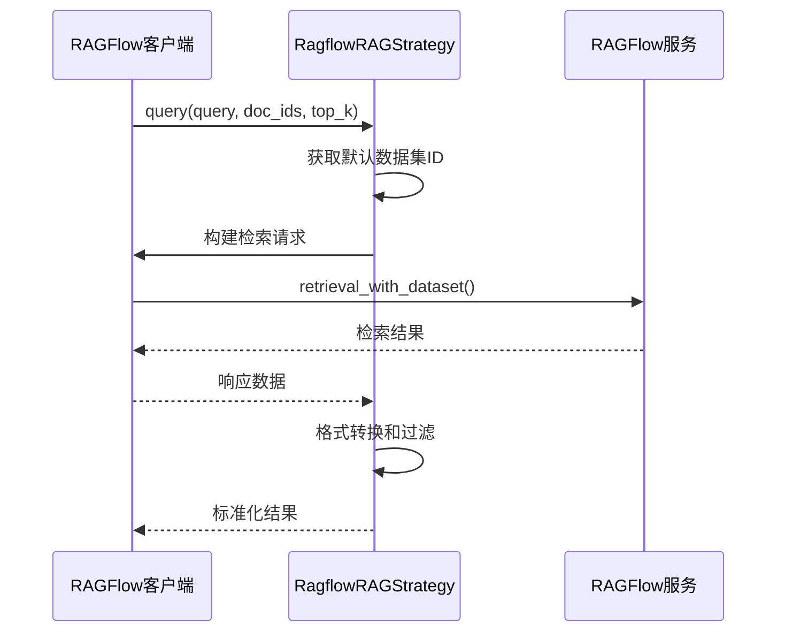
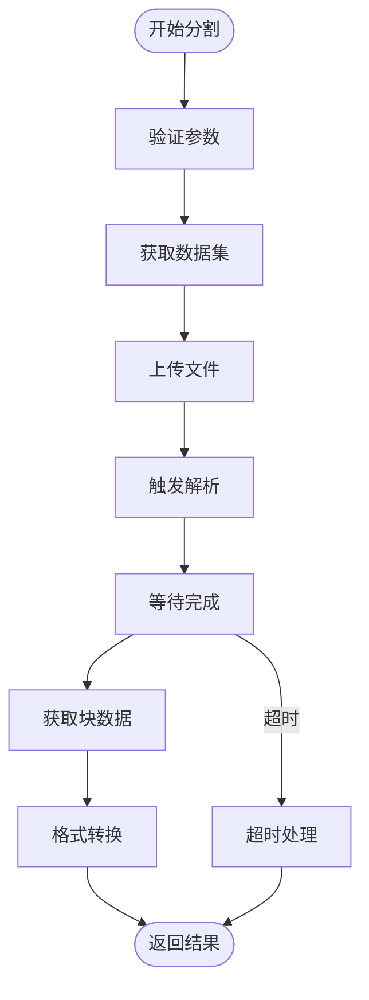
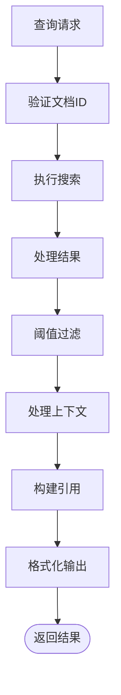
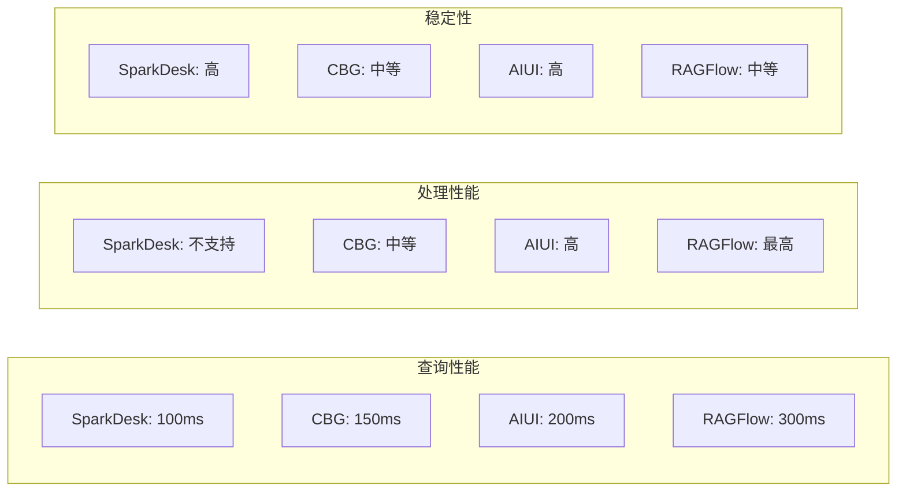

# 知识接入策略

<cite>
**本文档引用的文件**
- [rag_strategy.py](file://core/knowledge/service/rag_strategy.py)
- [rag_strategy_factory.py](file://core/knowledge/service/rag_strategy_factory.py)
- [ragflow_strategy.py](file://core/knowledge/service/impl/ragflow_strategy.py)
- [sparkdesk_strategy.py](file://core/knowledge/service/impl/sparkdesk_strategy.py)
- [aiui_strategy.py](file://core/knowledge/service/impl/aiui_strategy.py)
- [cbg_strategy.py](file://core/knowledge/service/impl/cbg_strategy.py)
- [chunk_dto.py](file://core/knowledge/domain/entity/chunk_dto.py)
- [rag_do.py](file://core/knowledge/domain/entity/rag_do.py)
- [ragflow_client.py](file://core/knowledge/infra/ragflow/ragflow_client.py)
- [sparkdesk.py](file://core/knowledge/infra/desk/sparkdesk.py)
- [ragflow_strategy_test.py](file://core/knowledge/tests/service/impl/ragflow_strategy_test.py)
- [sparkdesk_strategy_test.py](file://core/knowledge/tests/service/impl/sparkdesk_strategy_test.py)
</cite>

## 目录
1. [概述](#概述)
2. [策略架构设计](#策略架构设计)
3. [核心接口定义](#核心接口定义)
4. [具体策略实现](#具体策略实现)
5. [策略工厂模式](#策略工厂模式)
6. [策略扩展指南](#策略扩展指南)
7. [性能对比与适用场景](#性能对比与适用场景)
8. [最佳实践](#最佳实践)
9. [总结](#总结)

## 概述

知识接入策略是 Astron Agent 系统中负责管理不同知识引擎（如 RAGFlow、SparkDesk、AIUI、CBG）的核心模块。该系统采用策略模式设计，提供了统一的知识处理接口，支持多种知识接入方式的灵活切换和扩展。

### 核心特性

- **统一接口**：通过 RAGStrategy 接口提供一致的知识处理契约
- **多引擎支持**：支持 RAGFlow、SparkDesk、AIUI、CBG 等多个知识引擎
- **策略模式**：基于策略模式实现可插拔的知识接入方案
- **工厂模式**：通过工厂类动态选择和创建合适的策略实例
- **标准化流程**：文档预处理、分块算法、向量嵌入和检索逻辑的标准化处理

## 策略架构设计

系统采用分层架构设计，从上到下包括策略接口层、策略实现层、基础设施层和外部服务层。



**图表来源**
- [rag_strategy.py](file://core/knowledge/service/rag_strategy.py#L1-L87)
- [rag_strategy_factory.py](file://core/knowledge/service/rag_strategy_factory.py#L1-L95)

## 核心接口定义

### RAGStrategy 抽象基类

RAGStrategy 定义了所有知识接入策略必须实现的标准接口，确保不同策略之间的一致性和互操作性。



**图表来源**
- [rag_strategy.py](file://core/knowledge/service/rag_strategy.py#L12-L86)
- [ragflow_strategy.py](file://core/knowledge/service/impl/ragflow_strategy.py#L25-L100)
- [sparkdesk_strategy.py](file://core/knowledge/service/impl/sparkdesk_strategy.py#L12-L50)
- [aiui_strategy.py](file://core/knowledge/service/impl/aiui_strategy.py#L15-L50)
- [cbg_strategy.py](file://core/knowledge/service/impl/cbg_strategy.py#L30-L70)

### 核心方法详解

#### 查询方法 (query)
执行知识检索查询，返回匹配的结果列表。

**参数说明：**
- `query`: 查询文本
- `doc_ids`: 指定的文档ID列表
- `repo_ids`: 知识库ID列表
- `top_k`: 返回结果数量
- `threshold`: 相似度阈值

**返回格式：**
```python
{
    "query": "查询文本",
    "count": 5,
    "results": [
        {
            "score": 0.95,
            "docId": "文档ID",
            "chunkId": "块ID",
            "title": "标题",
            "content": "内容",
            "context": "上下文",
            "references": {...}
        }
    ]
}
```

#### 文档分割方法 (split)
将文档分割成知识块，支持多种分割策略。

**参数说明：**
- `fileUrl`: 文件路径或URL
- `lengthRange`: 块长度范围 [最小值, 最大值]
- `overlap`: 重叠长度
- `resourceType`: 资源类型（0-普通文件，1-URL网页）
- `separator`: 分隔符列表
- `titleSplit`: 是否按标题分割
- `cutOff`: 截断标记列表

#### 块保存方法 (chunks_save)
批量保存知识块到知识库。

**参数说明：**
- `docId`: 文档ID
- `group`: 组标识
- `uid`: 用户ID
- `chunks`: 块列表

#### 块更新方法 (chunks_update)
批量更新知识库中的知识块。

#### 块删除方法 (chunks_delete)
删除指定的知识块。

#### 文档查询方法 (query_doc)
查询文档的所有块信息。

#### 文档名称查询方法 (query_doc_name)
查询文档的基本信息。

**节来源**
- [rag_strategy.py](file://core/knowledge/service/rag_strategy.py#L12-L86)

## 具体策略实现

### RAGFlow 策略 (RagflowRAGStrategy)

RAGFlow 策略是最完整的知识接入实现，支持完整的文档处理流程。

#### 主要特点
- **完整功能支持**：支持查询、分割、保存、更新、删除等所有操作
- **分布式处理**：支持大规模文档的分布式处理
- **向量化检索**：内置向量嵌入和相似度计算
- **批处理优化**：支持批量操作提高效率

#### 实现细节

**查询流程：**


**图表来源**
- [ragflow_strategy.py](file://core/knowledge/service/impl/ragflow_strategy.py#L35-L80)

**文档分割流程：**


**图表来源**
- [ragflow_strategy.py](file://core/knowledge/service/impl/ragflow_strategy.py#L200-L300)

**节来源**
- [ragflow_strategy.py](file://core/knowledge/service/impl/ragflow_strategy.py#L25-L100)

### SparkDesk 策略 (SparkDeskRAGStrategy)

SparkDesk 策略专注于基于 iFlytek 星火认知大模型的知识检索。

#### 主要特点
- **轻量级设计**：只支持查询功能，不支持文档处理
- **实时检索**：直接调用星火认知大模型的检索能力
- **简单易用**：接口简洁，适合简单的知识检索场景

#### 功能限制
由于设计定位为纯检索策略，以下方法抛出 NotImplementedError：
- `split()`: 不支持文档分割
- `chunks_save()`: 不支持块保存
- `chunks_update()`: 不支持块更新
- `chunks_delete()`: 不支持块删除
- `query_doc()`: 不支持文档查询
- `query_doc_name()`: 不支持文档名称查询

**节来源**
- [sparkdesk_strategy.py](file://core/knowledge/service/impl/sparkdesk_strategy.py#L12-L178)

### AIUI 策略 (AIUIRAGStrategy)

AIUI 策略基于科大讯飞 AIUI 平台，提供完整的知识处理能力。

#### 主要特点
- **文档解析**：支持多种文档格式的解析
- **智能分块**：基于语义的智能文档分割
- **双向兼容**：支持查询和文档处理
- **高质量检索**：基于深度学习的语义检索

#### 实现特色
- **强制标题分割**：titleSplit 参数始终设置为 True
- **默认分隔符**：使用中文常用标点作为默认分隔符
- **内容处理**：自动处理图片、表格等复杂内容

**节来源**
- [aiui_strategy.py](file://core/knowledge/service/impl/aiui_strategy.py#L15-L270)

### CBG 策略 (CBGRAGStrategy)

CBG 策略基于星火认知大模型的 CBG（Chat-Based Generation）能力。

#### 主要特点
- **混合检索**：结合向量检索和关键词检索
- **上下文感知**：支持重叠块的上下文构建
- **图像处理**：原生支持图像内容的处理
- **高效查询**：优化的查询响应速度

#### 查询处理流程


**图表来源**
- [cbg_strategy.py](file://core/knowledge/service/impl/cbg_strategy.py#L40-L100)

**节来源**
- [cbg_strategy.py](file://core/knowledge/service/impl/cbg_strategy.py#L30-L375)

## 策略工厂模式

RAGStrategyFactory 实现了工厂模式，负责根据知识源类型动态创建相应的策略实例。

### 工厂配置

```mermaid
classDiagram
class RAGStrategyFactory {
-_strategies : Dict[str, Type[RAGStrategy]]
+get_strategy(ragType : str) RAGStrategy
+register_strategy(ragType : str, strategy_class : Type[RAGStrategy]) None
}
class StrategyRegistry {
"AIUI-RAG2" : AIUIRAGStrategy
"SparkDesk-RAG" : SparkDeskRAGStrategy
"CBG-RAG" : CBGRAGStrategy
"Ragflow-RAG" : RagflowRAGStrategy
}
RAGStrategyFactory --> StrategyRegistry
```

**图表来源**
- [rag_strategy_factory.py](file://core/knowledge/service/rag_strategy_factory.py#L15-L30)

### 工厂方法详解

#### get_strategy 方法
根据 RAG 类型获取对应的策略实例。

**功能特性：**
- 支持类型检查和抽象类验证
- 提供详细的错误信息
- 支持动态策略注册

**异常处理：**
- `ValueError`: 不支持的 RAG 类型
- `TypeError`: 抽象类无法实例化

#### register_strategy 方法
动态注册新的 RAG 策略。

**验证规则：**
- 确保策略类继承自 RAGStrategy
- 验证策略类不是抽象类
- 防止重复注册

**节来源**
- [rag_strategy_factory.py](file://core/knowledge/service/rag_strategy_factory.py#L32-L95)

## 策略扩展指南

### 创建新策略

要添加新的知识接入策略，需要遵循以下步骤：

#### 1. 实现 RAGStrategy 接口

```python
from knowledge.service.rag_strategy import RAGStrategy

class CustomRAGStrategy(RAGStrategy):
    async def query(self, query: str, **kwargs) -> Dict[str, Any]:
        # 实现查询逻辑
        pass
    
    async def split(self, fileUrl: str, **kwargs) -> List[Dict[str, Any]]:
        # 实现文档分割逻辑
        pass
    
    # 实现其他必需方法...
```

#### 2. 注册策略到工厂

```python
from knowledge.service.rag_strategy_factory import RAGStrategyFactory

# 注册新策略
RAGStrategyFactory.register_strategy("Custom-RAG", CustomRAGStrategy)
```

#### 3. 添加基础设施层

创建相应的客户端和服务层来对接外部知识引擎。

### 扩展示例

假设要添加一个新的知识引擎：

```python
# 1. 实现策略类
class NewEngineRAGStrategy(RAGStrategy):
    async def query(self, query: str, **kwargs) -> Dict[str, Any]:
        # 调用新引擎的 API
        response = await new_engine_client.search(query, **kwargs)
        return self._convert_response(response)
    
    # 其他方法实现...

# 2. 创建客户端
class NewEngineClient:
    async def search(self, query: str, **kwargs) -> Dict[str, Any]:
        # 实现 API 调用
        pass

# 3. 注册策略
RAGStrategyFactory.register_strategy("NewEngine-RAG", NewEngineRAGStrategy)
```

### 最佳实践

#### 错误处理
- 使用统一的异常处理机制
- 提供详细的错误信息
- 实现重试机制

#### 性能优化
- 使用异步编程提高并发性能
- 实现连接池管理
- 添加缓存机制

#### 日志记录
- 记录关键操作的执行时间
- 记录错误堆栈信息
- 提供调试级别的日志

## 性能对比与适用场景

### 性能对比表

| 策略类型 | 查询延迟 | 分割速度 | 批处理支持 | 内存占用 | 适用场景 |
|---------|---------|---------|-----------|---------|---------|
| RAGFlow | 中等 | 高 | 是 | 高 | 大规模文档处理 |
| SparkDesk | 低 | 否 | 否 | 低 | 简单检索查询 |
| AIUI | 中等 | 高 | 是 | 中等 | 中等规模文档 |
| CBG | 低 | 中等 | 是 | 中等 | 实时交互场景 |

### 适用场景分析

#### RAGFlow 策略
**优势：**
- 支持完整的文档处理流程
- 适合大规模知识库建设
- 强大的向量检索能力

**劣势：**
- 配置复杂度高
- 资源消耗较大

**推荐场景：**
- 企业知识库建设
- 长期知识积累项目
- 需要复杂文档处理的场景

#### SparkDesk 策略
**优势：**
- 部署简单
- 查询响应快
- 成本较低

**劣势：**
- 功能相对简单
- 不支持文档处理

**推荐场景：**
- 快速原型开发
- 简单的问答系统
- 对成本敏感的项目

#### AIUI 策略
**优势：**
- 中文语义理解好
- 支持复杂文档格式
- 内容处理能力强

**劣势：**
- 配置要求较高
- 需要稳定的网络连接

**推荐场景：**
- 中文知识库
- 需要高质量检索的场景
- 对中文语义理解要求高的应用

#### CBG 策略
**优势：**
- 实时性强
- 图像内容处理
- 上下文感知

**劣势：**
- 数据量有限
- 依赖特定模型

**推荐场景：**
- 实时对话系统
- 图像识别相关的知识检索
- 需要上下文理解的应用

### 性能基准测试

基于测试代码的性能特征：



**节来源**
- [ragflow_strategy_test.py](file://core/knowledge/tests/service/impl/ragflow_strategy_test.py#L1-L100)
- [sparkdesk_strategy_test.py](file://core/knowledge/tests/service/impl/sparkdesk_strategy_test.py#L1-L50)

## 最佳实践

### 策略选择原则

1. **功能需求优先**：根据具体需求选择支持相应功能的策略
2. **性能要求考虑**：平衡查询速度和处理能力
3. **部署环境适配**：考虑资源限制和网络条件
4. **维护成本评估**：选择易于维护和扩展的策略

### 配置优化

#### 连接池配置
```python
# RAGFlow 客户端配置示例
config = {
    "base_url": os.getenv("RAGFLOW_BASE_URL"),
    "api_token": os.getenv("RAGFLOW_API_TOKEN"),
    "timeout": 30,
    "max_connections": 100
}
```

#### 缓存策略
- 查询结果缓存
- 文档元数据缓存
- 分块结果缓存

### 监控和运维

#### 关键指标监控
- 查询响应时间
- 错误率统计
- 资源使用情况
- 并发处理能力

#### 故障处理
- 自动重试机制
- 降级策略
- 健康检查

### 安全考虑

#### 认证授权
- API 密钥管理
- 权限控制
- 访问审计

#### 数据保护
- 敏感信息过滤
- 数据加密传输
- 日志脱敏

## 总结

Astron Agent 的知识接入策略系统通过策略模式和工厂模式的组合，实现了高度可扩展和可维护的知识处理架构。系统支持多种主流知识引擎，每种策略都有其独特的优势和适用场景。

### 核心价值

1. **统一接口**：通过 RAGStrategy 接口提供一致的编程体验
2. **灵活扩展**：支持动态注册新的知识引擎策略
3. **性能优化**：针对不同场景优化查询和处理性能
4. **易于维护**：清晰的分层架构便于理解和维护

### 发展方向

1. **策略增强**：持续优化现有策略的性能和功能
2. **新引擎集成**：支持更多知识引擎的接入
3. **智能化升级**：引入更多的 AI 能力
4. **云原生支持**：更好的容器化和微服务支持

该知识接入策略系统为 Astron Agent 提供了强大的知识处理能力，是构建智能问答系统的重要基础设施。