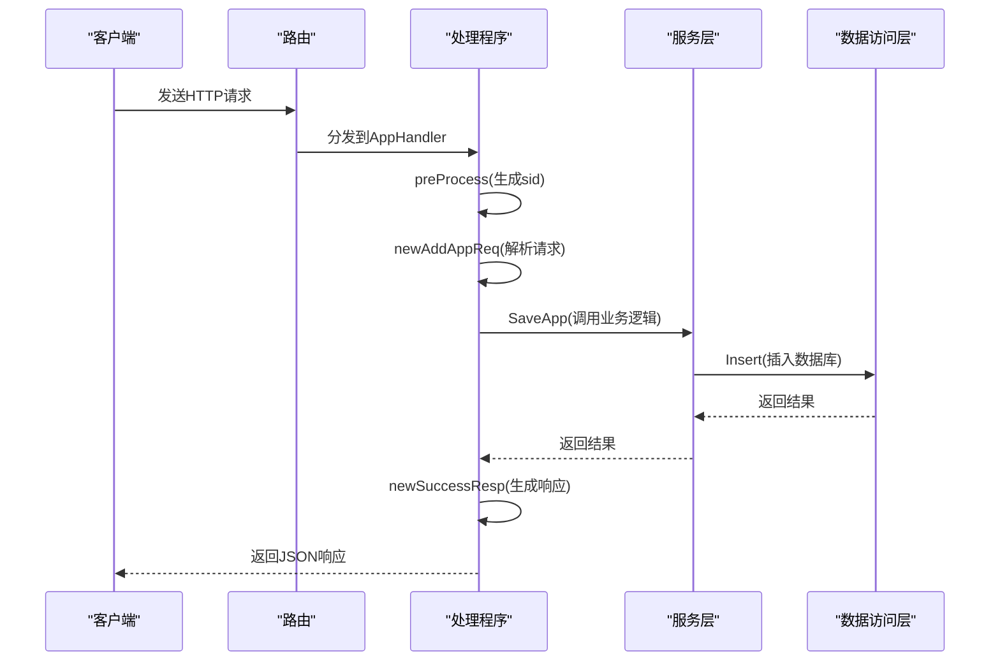
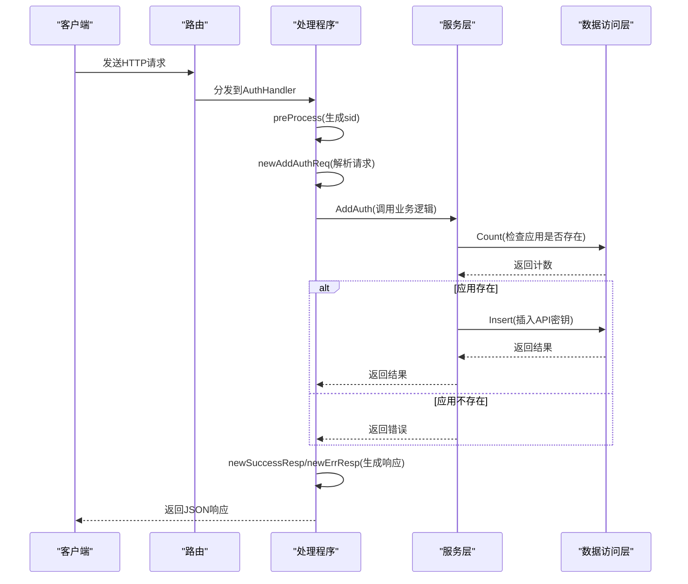
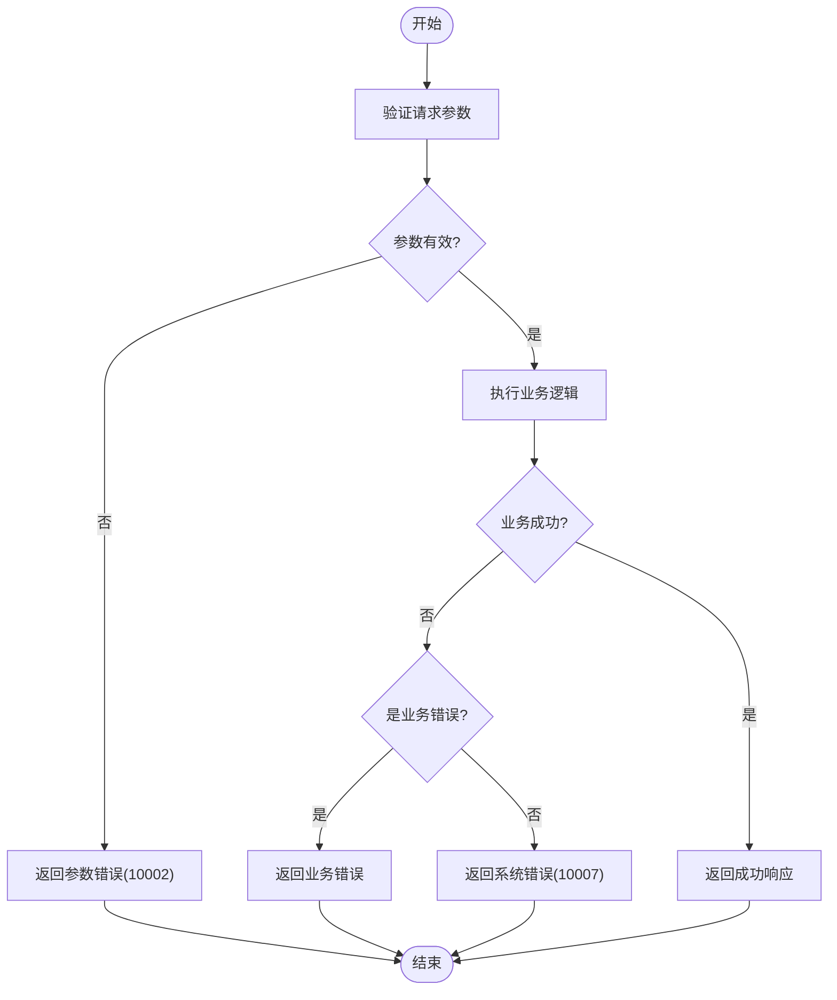

# API接口

<cite>
**本文档中引用的文件**  
- [router.go](file://core/tenant/internal/handler/router.go)
- [app_handler.go](file://core/tenant/internal/handler/app_handler.go)
- [auth_handler.go](file://core/tenant/internal/handler/auth_handler.go)
- [req.go](file://core/tenant/internal/handler/req.go)
- [resp.go](file://core/tenant/internal/handler/resp.go)
- [app_service.go](file://core/tenant/internal/service/app_service.go)
- [auth_service.go](file://core/tenant/internal/service/auth_service.go)
</cite>

## 目录
1. [简介](#简介)
2. [公开的RESTful端点](#公开的restful端点)
3. [请求处理流程](#请求处理流程)
4. [请求/响应数据结构](#请求响应数据结构)
5. [API调用示例](#api调用示例)
6. [错误处理机制](#错误处理机制)
7. [客户端集成指南](#客户端集成指南)

## 简介
本文档提供了租户服务API接口的详细参考，涵盖了应用管理和认证管理相关的RESTful端点。文档详细说明了API的URL路径、HTTP方法、请求/响应数据结构、处理流程、错误码以及客户端集成的最佳实践。

## 公开的RESTful端点
根据`router.go`文件中的路由配置，租户服务提供了以下公开的RESTful端点：

### 应用管理端点
| HTTP方法 | 路径 | 描述 |
|---------|------|------|
| POST | `/v2/app` | 创建新应用 |
| PUT | `/v2/app` | 修改现有应用 |
| GET | `/v2/app/list` | 查询应用列表 |
| GET | `/v2/app/details` | 查询应用详细信息 |
| POST | `/v2/app/disable` | 启用/禁用应用 |
| DELETE | `/v2/app` | 删除应用 |

### 认证管理端点
| HTTP方法 | 路径 | 描述 |
|---------|------|------|
| POST | `/v2/app/key` | 为应用创建API密钥 |
| DELETE | `/v2/app/key` | 删除应用的API密钥 |
| GET | `/v2/app/key/:app_id` | 根据应用ID查询API密钥列表 |
| GET | `/v2/app/key/api_key/:api_key` | 根据API密钥查询应用信息 |

**Section sources**
- [router.go](file://core/tenant/internal/handler/router.go#L1-L97)

## 请求处理流程
租户服务的请求处理流程遵循典型的分层架构模式，从路由分发到业务逻辑调用，具体流程如下：

### 应用管理处理流程
1. **路由分发**：`router.go`中的`InitRouter`函数将`/v2/app`路径下的请求分发到`appHandler`。
2. **预处理**：所有请求首先经过`preProcess`中间件，生成唯一的`sid`（会话ID）并从请求头中获取`source`信息。
3. **请求解析**：`app_handler.go`中的处理函数（如`SaveApp`）调用`req.go`中的`newAddAppReq`函数解析和验证请求参数。
4. **业务逻辑调用**：处理函数调用`app_service.go`中的相应业务方法（如`SaveApp`）。
5. **响应生成**：根据业务逻辑的执行结果，生成标准的响应格式并返回给客户端。



**Diagram sources**
- [router.go](file://core/tenant/internal/handler/router.go#L1-L97)
- [app_handler.go](file://core/tenant/internal/handler/app_handler.go#L1-L237)
- [app_service.go](file://core/tenant/internal/service/app_service.go#L1-L298)

### 认证管理处理流程
认证管理的处理流程与应用管理类似，主要区别在于：
1. 路由分发到`authHandler`处理程序。
2. 业务逻辑在`auth_service.go`中实现。
3. 需要验证应用ID是否存在，确保API密钥与应用的关联性。



**Diagram sources**
- [router.go](file://core/tenant/internal/handler/router.go#L1-L97)
- [auth_handler.go](file://core/tenant/internal/handler/auth_handler.go#L1-L163)
- [auth_service.go](file://core/tenant/internal/service/auth_service.go#L1-L155)

## 请求/响应数据结构
### 请求数据结构
请求数据结构在`req.go`文件中定义，主要包括以下类型：

#### 应用管理请求
- **AddAppReq**：创建应用请求
  - `request_id` (string): 请求ID，必填
  - `app_name` (string): 应用名称，必填
  - `dev_id` (int64): 开发者ID，必须大于0
  - `cloud_id` (string): 云渠道ID，必填
  - `app_desc` (string): 应用描述，可选

- **ModifyAppReq**：修改应用请求
  - `request_id` (string): 请求ID，必填
  - `app_id` (string): 应用ID，必填
  - `app_name` (string): 应用名称
  - `cloud_id` (string): 云渠道ID
  - `app_desc` (string): 应用描述

- **AppListReq**：查询应用列表请求
  - `name` (string): 应用名称，模糊查询
  - `app_ids` ([]string): 应用ID列表
  - `dev_id` (int): 开发者ID
  - `cloud_id` (string): 云渠道ID

#### 认证管理请求
- **AddAuthReq**：创建API密钥请求
  - `request_id` (string): 请求ID，必填
  - `app_id` (string): 应用ID，必填
  - `api_key` (string): API密钥，可选
  - `api_secret` (string): API密钥密文，可选

- **DeleteAuthReq**：删除API密钥请求
  - `request_id` (string): 请求ID，必填
  - `app_id` (string): 应用ID，必填
  - `api_key` (string): API密钥，必填

**Section sources**
- [req.go](file://core/tenant/internal/handler/req.go#L1-L199)

### 响应数据结构
响应数据结构在`resp.go`文件中定义，采用统一的响应格式：

#### 通用响应结构
- **Resp**：通用响应结构
  - `sid` (string): 会话ID
  - `code` (int): 状态码
  - `message` (string): 消息描述
  - `data` (interface{}): 响应数据，可选

#### 业务响应数据
- **AppData**：应用数据
  - `appid` (string): 应用ID
  - `name` (string): 应用名称
  - `dev_id` (int64): 开发者ID
  - `cloud_id` (string): 云渠道ID
  - `source` (string): 来源
  - `is_disable` (bool): 是否禁用
  - `desc` (string): 描述
  - `create_time` (string): 创建时间

- **AuthData**：认证数据
  - `api_key` (string): API密钥
  - `api_secret` (string): API密钥密文

**Section sources**
- [resp.go](file://core/tenant/internal/handler/resp.go#L1-L47)

## API调用示例
### 创建应用
**请求**
```http
POST /v2/app
Content-Type: application/json
X-Consumer-Username: admin

{
  "request_id": "req_123456",
  "app_name": "我的应用",
  "dev_id": 1001,
  "cloud_id": "cloud_001",
  "app_desc": "这是一个测试应用"
}
```

**响应**
```json
{
  "sid": "app1234@loc12345678901234567890",
  "code": 0,
  "message": "success",
  "data": {
    "app_id": "app_987654",
    "api_key": "key_123456",
    "api_secret": "secret_654321"
  }
}
```

### 查询API密钥
**请求**
```http
GET /v2/app/key/app_987654
Content-Type: application/json
X-Consumer-Username: admin
```

**响应**
```json
{
  "sid": "app1234@loc12345678901234567890",
  "code": 0,
  "message": "success",
  "data": [
    {
      "api_key": "key_123456",
      "api_secret": "secret_654321"
    }
  ]
}
```

**Section sources**
- [app_handler.go](file://core/tenant/internal/handler/app_handler.go#L1-L237)
- [auth_handler.go](file://core/tenant/internal/handler/auth_handler.go#L1-L163)

## 错误处理机制
### 标准错误码
系统定义了统一的错误码体系，主要错误码如下：

| 错误码 | 描述 | 说明 |
|-------|------|------|
| 0 | success | 成功 |
| 10001 | generate sid error | 生成会话ID失败 |
| 10002 | param error | 参数错误 |
| 10003 | app name has been exist | 应用名称已存在 |
| 10004 | request app id not found | 应用ID不存在 |
| 10005 | api key has been exist | API密钥已存在 |
| 10006 | api key not exist | API密钥不存在 |
| 10007 | system error | 系统错误 |

### 错误响应格式
错误响应遵循统一的格式，包含`sid`、`code`和`message`字段：

```json
{
  "sid": "app1234@loc12345678901234567890",
  "code": 10003,
  "message": "app name[我的应用] has been exist"
}
```

### 错误处理流程
1. **参数验证**：在请求处理的早期阶段进行参数验证，返回`ParamErr`（10002）。
2. **业务逻辑验证**：在服务层进行业务规则验证，如应用名称唯一性检查。
3. **系统错误处理**：捕获数据库操作等系统级错误，返回`ErrCodeSystem`（10007）。
4. **事务回滚**：在发生错误时，自动回滚数据库事务，确保数据一致性。



**Diagram sources**
- [app_service.go](file://core/tenant/internal/service/app_service.go#L1-L298)
- [auth_service.go](file://core/tenant/internal/service/auth_service.go#L1-L155)

## 客户端集成指南
### 集成步骤
1. **配置请求头**：在每个请求中添加`X-Consumer-Username`头，标识请求来源。
2. **处理响应**：检查响应的`code`字段，根据不同的状态码进行相应处理。
3. **错误重试**：对于系统错误（10007），建议实现指数退避重试机制。
4. **会话跟踪**：记录响应中的`sid`，用于问题排查和日志追踪。

### 最佳实践
- **请求ID**：为每个请求生成唯一的`request_id`，便于问题追踪。
- **幂等性**：对于创建和修改操作，确保请求的幂等性。
- **批量操作**：对于大量数据操作，考虑使用批量接口以提高效率。
- **缓存策略**：对于频繁查询但不常变更的数据，实现客户端缓存。

**Section sources**
- [router.go](file://core/tenant/internal/handler/router.go#L1-L97)
- [app_handler.go](file://core/tenant/internal/handler/app_handler.go#L1-L237)
- [auth_handler.go](file://core/tenant/internal/handler/auth_handler.go#L1-L163)