# 应用管理

<cite>
**本文档引用的文件**
- [app_service.go](file://core/tenant/internal/service/app_service.go)
- [app_dao.go](file://core/tenant/internal/dao/app_dao.go)
- [app.go](file://core/tenant/internal/models/app.go)
- [app_handler.go](file://core/tenant/internal/handler/app_handler.go)
- [database.go](file://core/tenant/tools/database/database.go)
- [app.go](file://core/tenant/tools/generator/app.go)
</cite>

## 目录
1. [简介](#简介)
2. [项目结构](#项目结构)
3. [核心组件](#核心组件)
4. [架构概述](#架构概述)
5. [详细组件分析](#详细组件分析)
6. [依赖分析](#依赖分析)
7. [性能考虑](#性能考虑)
8. [故障排除指南](#故障排除指南)
9. [结论](#结论)

## 简介
本文档详细说明了基于`app_service.go`的应用全生命周期管理功能，包括创建、修改、启用/禁用和删除操作的业务逻辑。文档解释了`app_dao.go`中使用函数式选项模式构建SQL查询的高级技巧，分析了`app.go`数据模型与数据库表`tb_app`的映射关系，并描述了`app_handler.go`中HTTP请求处理流程，包括参数校验和响应封装。此外，文档还提供了事务管理的实现细节，展示了如何通过`BeginTx`和`rollback`确保数据一致性，并用代码示例说明并发场景下的乐观锁处理。

## 项目结构
应用管理功能主要分布在`core/tenant`目录下，包含四个核心组件：服务层(`service`)、数据访问层(`dao`)、模型层(`models`)和处理器层(`handler`)。这种分层架构遵循了典型的MVC模式，实现了关注点分离。

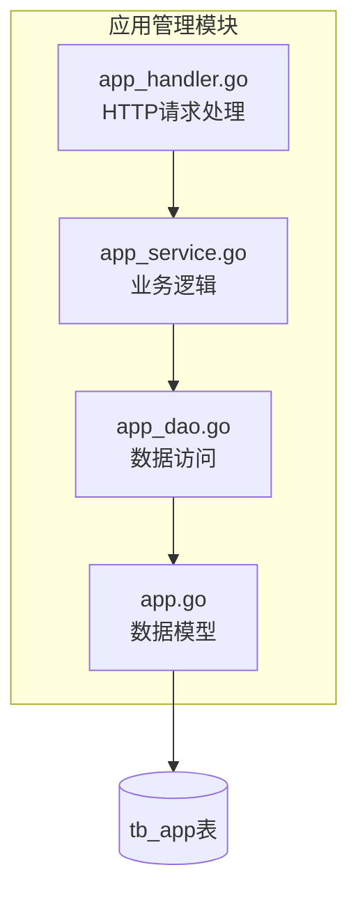

**图示来源**
- [app_service.go](file://core/tenant/internal/service/app_service.go#L1-L50)
- [app_dao.go](file://core/tenant/internal/dao/app_dao.go#L1-L50)
- [app.go](file://core/tenant/internal/models/app.go#L1-L10)
- [app_handler.go](file://core/tenant/internal/handler/app_handler.go#L1-L50)

**本节来源**
- [app_service.go](file://core/tenant/internal/service/app_service.go#L1-L50)
- [app_dao.go](file://core/tenant/internal/dao/app_dao.go#L1-L50)

## 核心组件
应用管理功能的核心组件包括`AppService`、`AppDao`、`App`模型和`AppHandler`。`AppService`负责处理应用的全生命周期管理业务逻辑，`AppDao`负责与数据库交互，`App`模型定义了应用的数据结构，而`AppHandler`则负责处理HTTP请求和响应。

**本节来源**
- [app_service.go](file://core/tenant/internal/service/app_service.go#L1-L50)
- [app_dao.go](file://core/tenant/internal/dao/app_dao.go#L1-L50)
- [app.go](file://core/tenant/internal/models/app.go#L1-L10)
- [app_handler.go](file://core/tenant/internal/handler/app_handler.go#L1-L50)

## 架构概述
应用管理功能采用典型的分层架构，从HTTP请求到数据库操作的完整调用链路清晰。当接收到HTTP请求时，`AppHandler`首先进行参数校验，然后调用`AppService`中的相应方法处理业务逻辑，`AppService`通过`AppDao`与数据库交互完成数据持久化。

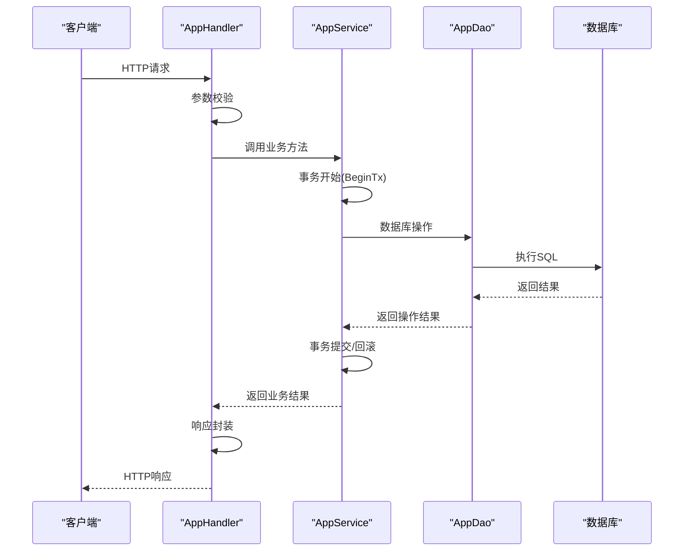

**图示来源**
- [app_service.go](file://core/tenant/internal/service/app_service.go#L1-L50)
- [app_dao.go](file://core/tenant/internal/dao/app_dao.go#L1-L50)
- [app_handler.go](file://core/tenant/internal/handler/app_handler.go#L1-L50)

## 详细组件分析

### 应用服务分析
`AppService`是应用管理功能的核心业务逻辑层，负责处理应用的全生命周期管理。它通过事务管理确保数据一致性，并实现了创建、修改、启用/禁用和删除等操作。

#### 业务逻辑实现
`AppService`中的每个方法都遵循类似的模式：首先开启事务，然后执行业务逻辑，最后根据执行结果提交或回滚事务。这种模式确保了数据的一致性和完整性。

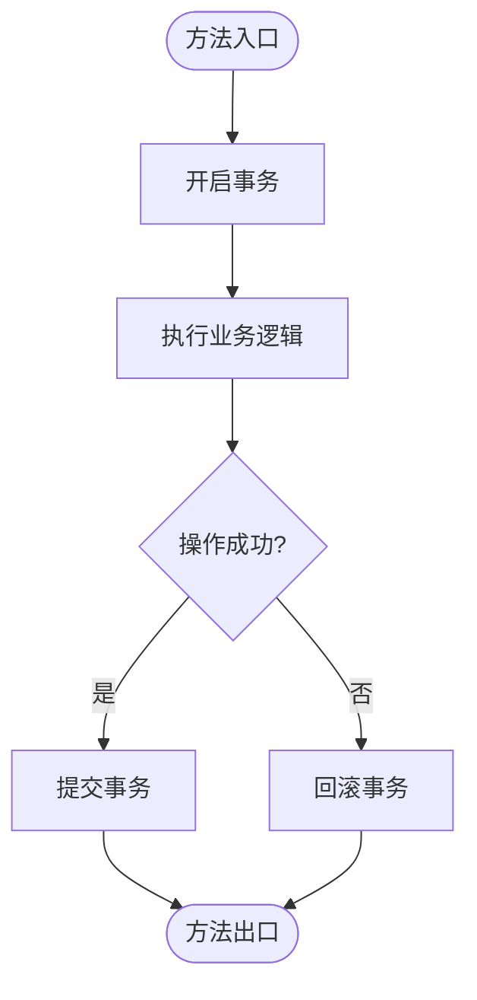

**图示来源**
- [app_service.go](file://core/tenant/internal/service/app_service.go#L1-L50)

#### 创建应用(SaveApp)
`SaveApp`方法负责创建新应用。它首先检查应用名称是否已存在，如果不存在则生成应用ID和认证密钥，然后将应用信息和认证信息插入数据库。

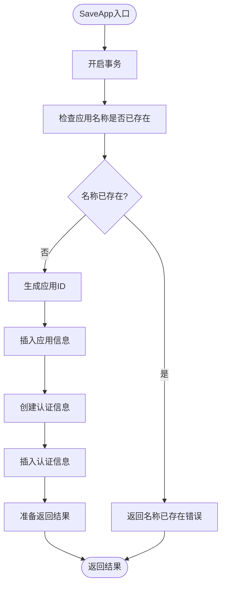

**图示来源**
- [app_service.go](file://core/tenant/internal/service/app_service.go#L50-L100)

#### 修改应用(ModifyApp)
`ModifyApp`方法负责修改现有应用的信息。它首先检查应用是否存在，然后根据提供的字段更新应用信息。

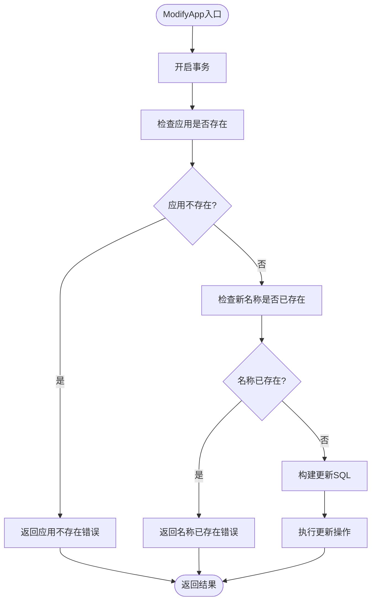

**图示来源**
- [app_service.go](file://core/tenant/internal/service/app_service.go#L100-L150)

#### 启用/禁用(DisableOrEnable)
`DisableOrEnable`方法负责启用或禁用应用。它通过更新`is_disable`字段来实现应用状态的切换。

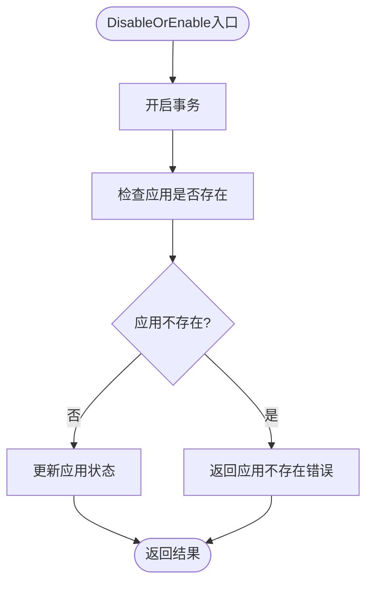

**图示来源**
- [app_service.go](file://core/tenant/internal/service/app_service.go#L150-L180)

#### 删除应用(Delete)
`Delete`方法负责删除应用。它采用软删除的方式，通过更新`is_delete`字段来标记应用为已删除状态，同时删除相关的认证信息。

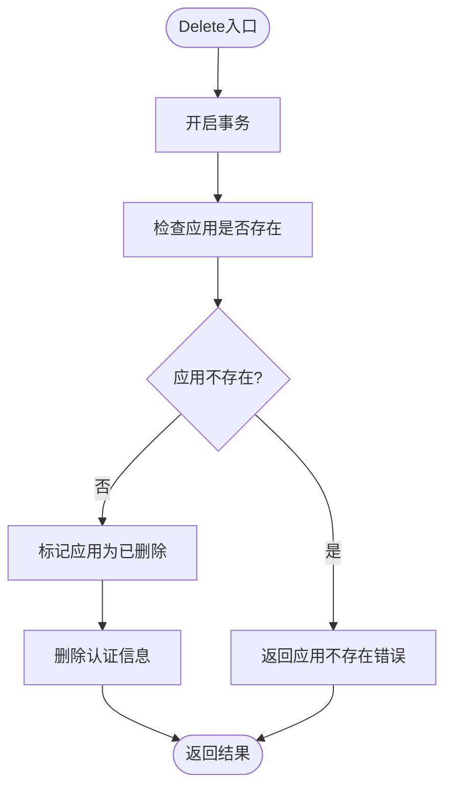

**图示来源**
- [app_service.go](file://core/tenant/internal/service/app_service.go#L180-L210)

**本节来源**
- [app_service.go](file://core/tenant/internal/service/app_service.go#L1-L298)

### 数据访问层分析
`AppDao`是数据访问层，负责与数据库交互。它使用函数式选项模式构建SQL查询，提供了灵活的查询接口。

#### 函数式选项模式
`AppDao`使用函数式选项模式来构建SQL查询。每个查询条件都被封装为一个返回SQL片段和参数的函数，这些函数可以组合使用来构建复杂的查询。

```mermaid
classDiagram
class SqlOption {
<<function>>
func() (string, []interface{})
}
class AppDao {
+insertSql string
+updateSql string
+selectSql string
+countSql string
+db *database.Database
+Insert(data *models.App, tx *sql.Tx) int64, error
+Update(querySql []SqlOption, tx *sql.Tx, setSql ...SqlOption) int64, error
+Delete(tx *sql.Tx, querySql ...SqlOption) int64, error
+Select(options ...SqlOption) []*models.App, error
+Count(isLock bool, tx *sql.Tx, options ...SqlOption) int64, error
+BeginTx() *sql.Tx, error
+WithAppId(appId string) SqlOption
+WithNotAppId(appId string) SqlOption
+WithSource(source string) SqlOption
+WithIsDisable(isDisable bool) SqlOption
+WithIsDelete(isDelete bool) SqlOption
+WithUpdateTime(updateTime string) SqlOption
+WithName(name string) SqlOption
+WithSetName(name string) SqlOption
+WithDesc(desc string) SqlOption
+WithDevId(devId int64) SqlOption
+WithChannelId(cloudId string) SqlOption
+WithNoChannelId(cloudId string) SqlOption
+WithAppIds(appIds ...string) SqlOption
}
SqlOption <|-- AppDao : "使用"
```

**图示来源**
- [app_dao.go](file://core/tenant/internal/dao/app_dao.go#L1-L50)

#### SQL查询构建
`AppDao`中的`buildQuery`和`buildUpdateWithQuery`函数负责将函数式选项组合成完整的SQL查询。这种设计模式使得查询构建过程更加灵活和可维护。

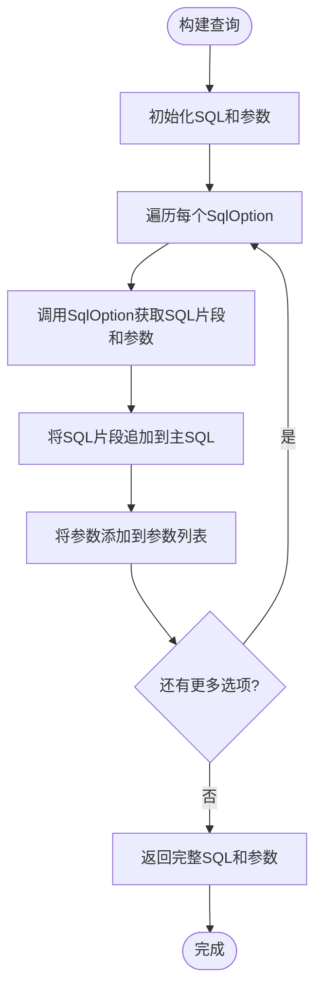

**图示来源**
- [app_dao.go](file://core/tenant/internal/dao/app_dao.go#L1-L50)

**本节来源**
- [app_dao.go](file://core/tenant/internal/dao/app_dao.go#L1-L290)

### 数据模型分析
`App`模型定义了应用的数据结构，与数据库表`tb_app`的字段一一对应。

#### 数据模型与数据库映射
`App`模型中的每个字段都对应数据库表`tb_app`中的一个列，实现了对象关系映射(ORM)。

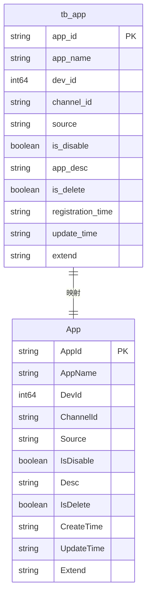

**图示来源**
- [app.go](file://core/tenant/internal/models/app.go#L1-L16)
- [app_dao.go](file://core/tenant/internal/dao/app_dao.go#L1-L50)

**本节来源**
- [app.go](file://core/tenant/internal/models/app.go#L1-L16)

### 处理器层分析
`AppHandler`是HTTP请求处理器，负责处理来自客户端的请求，进行参数校验和响应封装。

#### HTTP请求处理流程
`AppHandler`中的每个方法都遵循类似的处理流程：接收HTTP请求，解析和校验参数，调用服务层方法处理业务逻辑，最后封装响应返回给客户端。

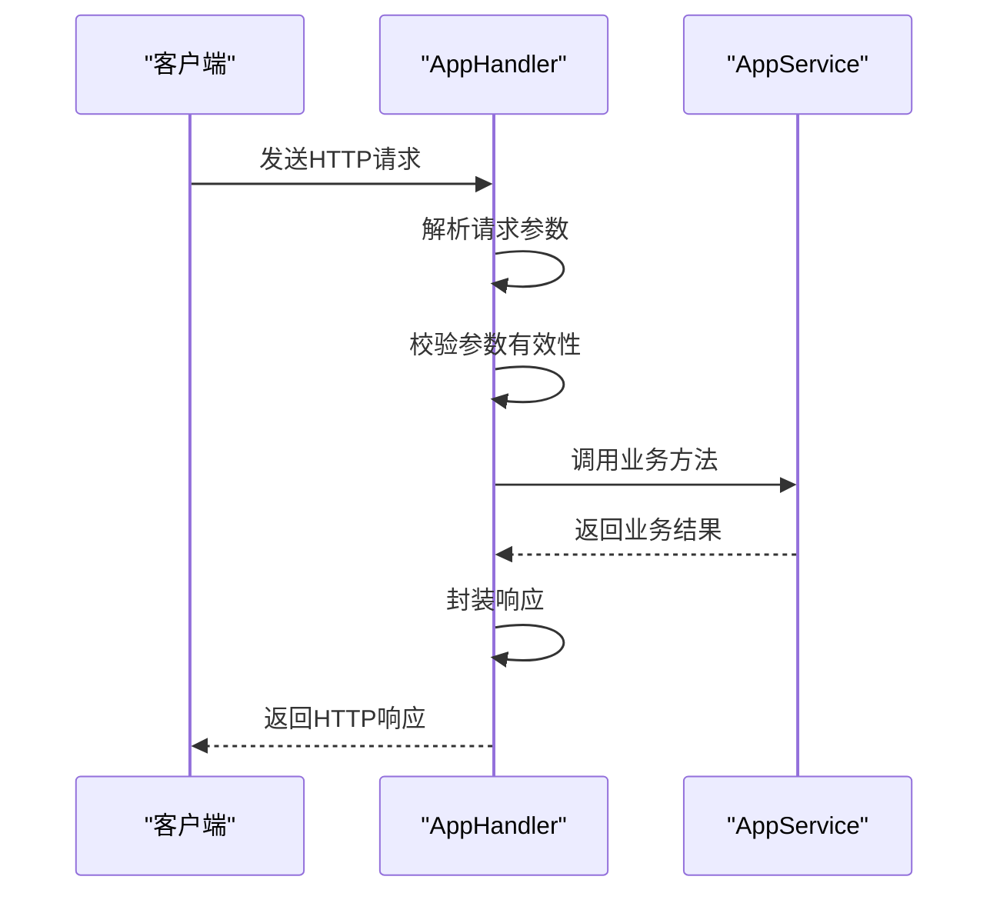

**图示来源**
- [app_handler.go](file://core/tenant/internal/handler/app_handler.go#L1-L50)

#### 参数校验与响应封装
`AppHandler`使用专门的函数来解析和校验请求参数，如`newAddAppReq`、`newModifyAppReq`等。对于响应，它使用`newSuccessResp`和`newErrResp`函数来封装统一的响应格式。

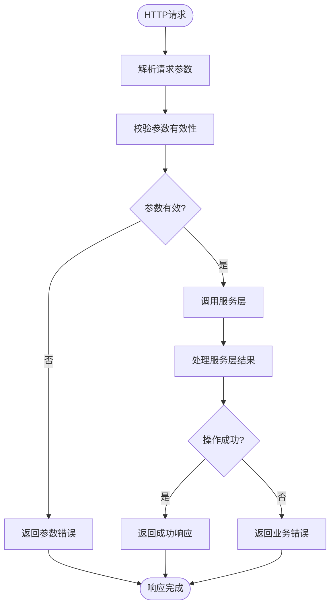

**图示来源**
- [app_handler.go](file://core/tenant/internal/handler/app_handler.go#L1-L50)

**本节来源**
- [app_handler.go](file://core/tenant/internal/handler/app_handler.go#L1-L237)

## 依赖分析
应用管理功能的各个组件之间存在明确的依赖关系。`AppHandler`依赖`AppService`，`AppService`依赖`AppDao`，而`AppDao`依赖数据库驱动。

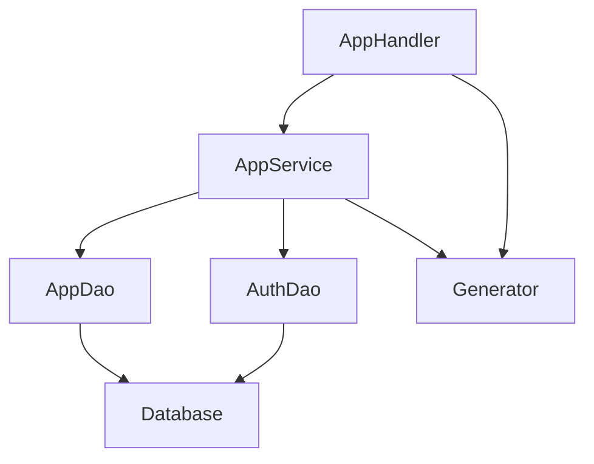

**图示来源**
- [app_service.go](file://core/tenant/internal/service/app_service.go#L1-L50)
- [app_dao.go](file://core/tenant/internal/dao/app_dao.go#L1-L50)
- [app_handler.go](file://core/tenant/internal/handler/app_handler.go#L1-L50)

**本节来源**
- [app_service.go](file://core/tenant/internal/service/app_service.go#L1-L50)
- [app_dao.go](file://core/tenant/internal/dao/app_dao.go#L1-L50)
- [app_handler.go](file://core/tenant/internal/handler/app_handler.go#L1-L50)

## 性能考虑
应用管理功能在设计时考虑了性能因素。通过使用事务批量操作减少数据库往返次数，使用连接池提高数据库连接效率，以及使用适当的索引优化查询性能。

**本节来源**
- [app_service.go](file://core/tenant/internal/service/app_service.go#L1-L50)
- [app_dao.go](file://core/tenant/internal/dao/app_dao.go#L1-L50)
- [database.go](file://core/tenant/tools/database/database.go#L1-L72)

## 故障排除指南
当应用管理功能出现问题时，可以按照以下步骤进行排查：

1. 检查HTTP请求参数是否正确
2. 查看服务日志中的错误信息
3. 检查数据库连接是否正常
4. 验证事务是否正确提交或回滚
5. 检查数据库表结构是否与模型匹配

**本节来源**
- [app_service.go](file://core/tenant/internal/service/app_service.go#L1-L50)
- [app_dao.go](file://core/tenant/internal/dao/app_dao.go#L1-L50)
- [app_handler.go](file://core/tenant/internal/handler/app_handler.go#L1-L50)

## 结论
应用管理功能通过清晰的分层架构实现了应用的全生命周期管理。`AppHandler`负责HTTP请求处理，`AppService`负责业务逻辑，`AppDao`负责数据访问，`App`模型定义了数据结构。这种设计模式使得代码易于维护和扩展。函数式选项模式的使用使得SQL查询构建更加灵活，事务管理确保了数据的一致性，而统一的错误处理机制提高了系统的可靠性。