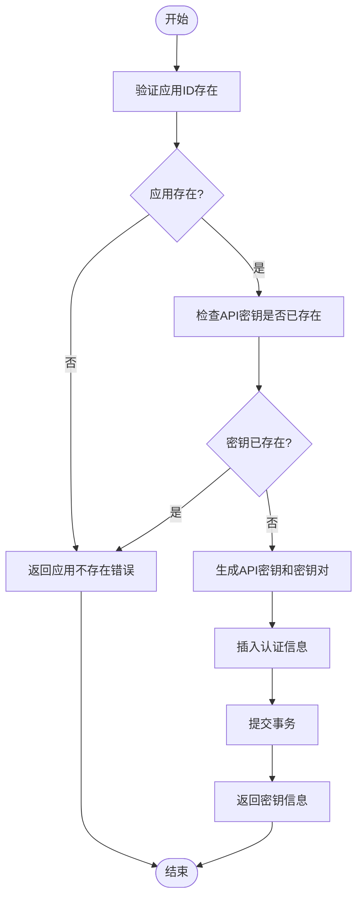

# 租户服务

<cite>
**本文档引用的文件**
- [main.go](file://core/tenant/main.go)
- [server.go](file://core/tenant/app/server.go)
- [config.go](file://core/tenant/config/config.go)
- [env_loader.go](file://core/tenant/config/env_loader.go)
- [local_loader.go](file://core/tenant/config/local_loader.go)
- [app_dao.go](file://core/tenant/internal/dao/app_dao.go)
- [auth_dao.go](file://core/tenant/internal/dao/auth_dao.go)
- [app_service.go](file://core/tenant/internal/service/app_service.go)
- [auth_service.go](file://core/tenant/internal/service/auth_service.go)
- [router.go](file://core/tenant/internal/handler/router.go)
- [app.go](file://core/tenant/internal/models/app.go)
- [database.go](file://core/tenant/tools/database/database.go)
</cite>

## 目录
1. [简介](#简介)
2. [项目结构](#项目结构)
3. [核心组件](#核心组件)
4. [架构概述](#架构概述)
5. [详细组件分析](#详细组件分析)
6. [依赖分析](#依赖分析)
7. [性能考虑](#性能考虑)
8. [故障排除指南](#故障排除指南)
9. [结论](#结论)

## 简介
租户服务是一个基于Go语言实现的高性能微服务，专注于多租户环境下的应用管理和认证功能。该服务使用Gin框架构建RESTful API，提供应用注册、密钥管理、权限验证和配额控制等核心功能。服务通过与Casdoor认证系统集成，实现了安全的用户身份验证和访问控制。本架构文档详细描述了服务的各个组件，包括基于Gin框架的API设计、app_service.go中的业务逻辑实现、app_dao.go中的数据访问模式、config.go中的配置管理机制，以及与其他微服务集成的SDK。

## 项目结构
租户服务的项目结构遵循清晰的分层架构，将不同职责的组件分离到不同的目录中。核心组件包括配置管理、数据访问、业务逻辑和API处理等模块。

**图源**
- [main.go](file://core/tenant/main.go)
- [server.go](file://core/tenant/app/server.go)

**本节来源**
- [main.go](file://core/tenant/main.go)
- [server.go](file://core/tenant/app/server.go)

## 核心组件
租户服务的核心组件包括配置管理、数据访问、业务逻辑和API处理四个主要部分。配置管理模块支持本地和远程配置源，数据访问模块实现了与MySQL数据库的交互，业务逻辑模块封装了应用管理和认证的核心功能，API处理模块基于Gin框架提供了RESTful接口。

**本节来源**
- [config.go](file://core/tenant/config/config.go)
- [app_dao.go](file://core/tenant/internal/dao/app_dao.go)
- [app_service.go](file://core/tenant/internal/service/app_service.go)
- [router.go](file://core/tenant/internal/handler/router.go)

## 架构概述
租户服务采用典型的分层架构，从上到下分为API层、业务逻辑层、数据访问层和数据存储层。API层基于Gin框架实现RESTful接口，业务逻辑层处理核心业务规则，数据访问层负责与数据库交互，数据存储层使用MySQL存储应用和认证信息。

**图源**
- [app_service.go](file://core/tenant/internal/service/app_service.go)
- [auth_service.go](file://core/tenant/internal/service/auth_service.go)
- [app_dao.go](file://core/tenant/internal/dao/app_dao.go)
- [auth_dao.go](file://core/tenant/internal/dao/auth_dao.go)

## 详细组件分析

### 配置管理组件分析
租户服务的配置管理模块支持多种配置源，包括本地文件和环境变量。配置加载器实现了策略模式，可以灵活地从不同来源加载配置。

**图源**
- [config.go](file://core/tenant/config/config.go)
- [local_loader.go](file://core/tenant/config/local_loader.go)
- [env_loader.go](file://core/tenant/config/env_loader.go)

**本节来源**
- [config.go](file://core/tenant/config/config.go)
- [local_loader.go](file://core/tenant/config/local_loader.go)
- [env_loader.go](file://core/tenant/config/env_loader.go)

### 应用管理组件分析
应用管理组件负责处理应用的全生命周期管理，包括创建、修改、查询和删除操作。该组件通过事务管理确保数据一致性，并实现了应用名称的唯一性校验。

**图源**
- [app_service.go](file://core/tenant/internal/service/app_service.go)
- [app_dao.go](file://core/tenant/internal/dao/app_dao.go)
- [router.go](file://core/tenant/internal/handler/router.go)

**本节来源**
- [app_service.go](file://core/tenant/internal/service/app_service.go)
- [app_dao.go](file://core/tenant/internal/dao/app_dao.go)

### 认证管理组件分析
认证管理组件负责API密钥的生成、管理和验证。该组件与应用管理组件紧密协作，确保每个应用都有唯一的API密钥和密钥对。

**图源**
- [auth_service.go](file://core/tenant/internal/service/auth_service.go)
- [auth_dao.go](file://core/tenant/internal/dao/auth_dao.go)

**本节来源**
- [auth_service.go](file://core/tenant/internal/service/auth_service.go)
- [auth_dao.go](file://core/tenant/internal/dao/auth_dao.go)

## 依赖分析
租户服务的依赖关系清晰，各组件之间通过接口进行通信，降低了耦合度。服务依赖于Gin框架处理HTTP请求，使用MySQL驱动与数据库交互，并通过TOML库解析配置文件。

**图源**
- [go.mod](file://core/tenant/go.mod)

**本节来源**
- [go.mod](file://core/tenant/go.mod)
- [server.go](file://core/tenant/app/server.go)
- [database.go](file://core/tenant/tools/database/database.go)

## 性能考虑
租户服务在设计时考虑了性能优化，包括数据库连接池配置、事务管理、日志记录和错误处理等方面。服务通过配置文件中的MaxOpenConns和MaxIdleConns参数优化数据库连接池，减少连接创建和销毁的开销。事务管理确保了数据操作的原子性，同时通过defer语句确保资源的正确释放。日志记录使用标准库的log包，支持输出到文件，便于问题排查和性能分析。

## 故障排除指南
当租户服务出现问题时，可以按照以下步骤进行排查：

1. 检查服务是否正常启动，查看启动日志中是否有错误信息
2. 验证配置文件是否正确，特别是数据库连接信息和端口配置
3. 检查数据库连接是否正常，确认数据库服务是否运行
4. 查看日志文件中的错误信息，定位问题根源
5. 使用健康检查接口/ping验证服务状态

**本节来源**
- [server.go](file://core/tenant/app/server.go)
- [config.go](file://core/tenant/config/config.go)
- [app_service.go](file://core/tenant/internal/service/app_service.go)

## 结论
租户服务是一个功能完整、架构清晰的微服务，提供了高性能的租户管理和应用认证功能。服务采用分层架构，各组件职责明确，通过接口进行通信，降低了耦合度。配置管理模块支持多种配置源，提高了部署的灵活性。数据访问层通过DAO模式封装了数据库操作，业务逻辑层实现了核心功能，API层基于Gin框架提供了RESTful接口。服务与Casdoor认证系统集成，确保了安全性。整体设计考虑了性能优化和可维护性，为其他微服务提供了可靠的SDK支持。