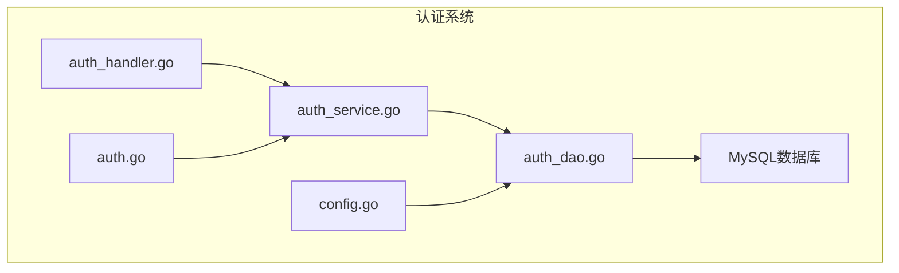
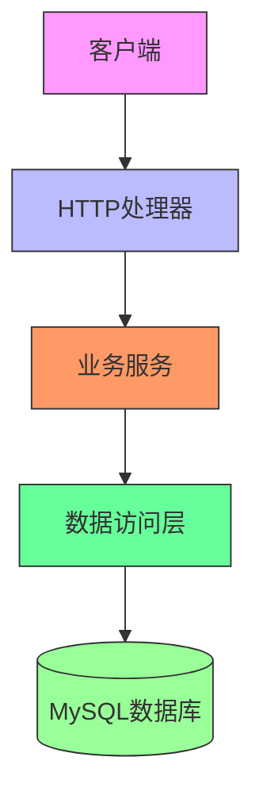
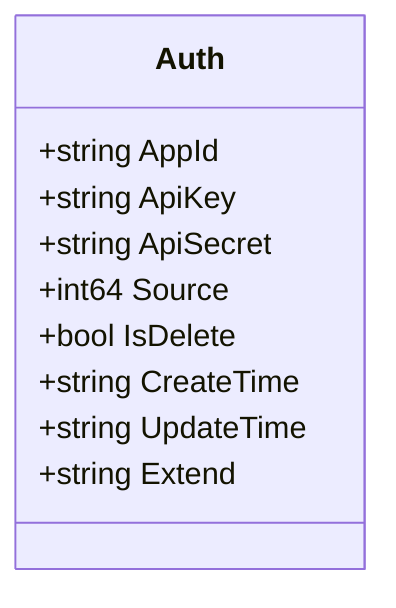
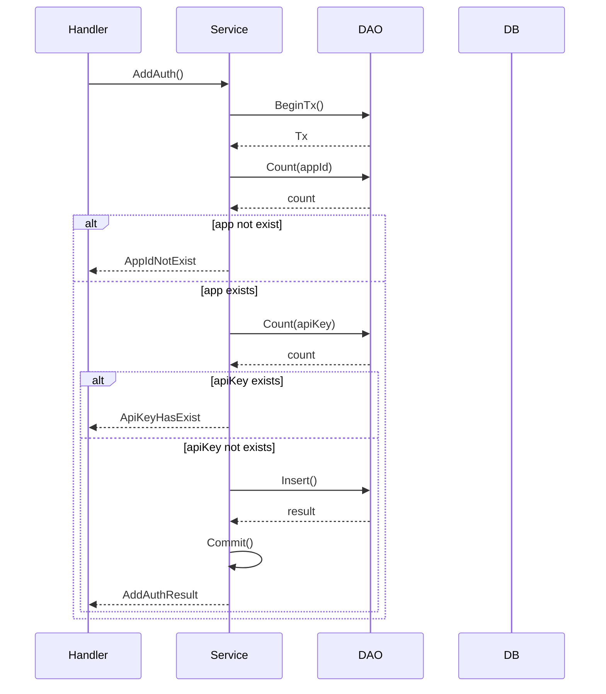
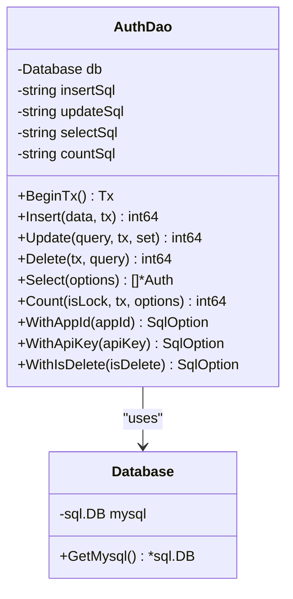
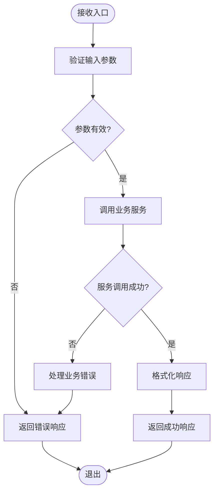
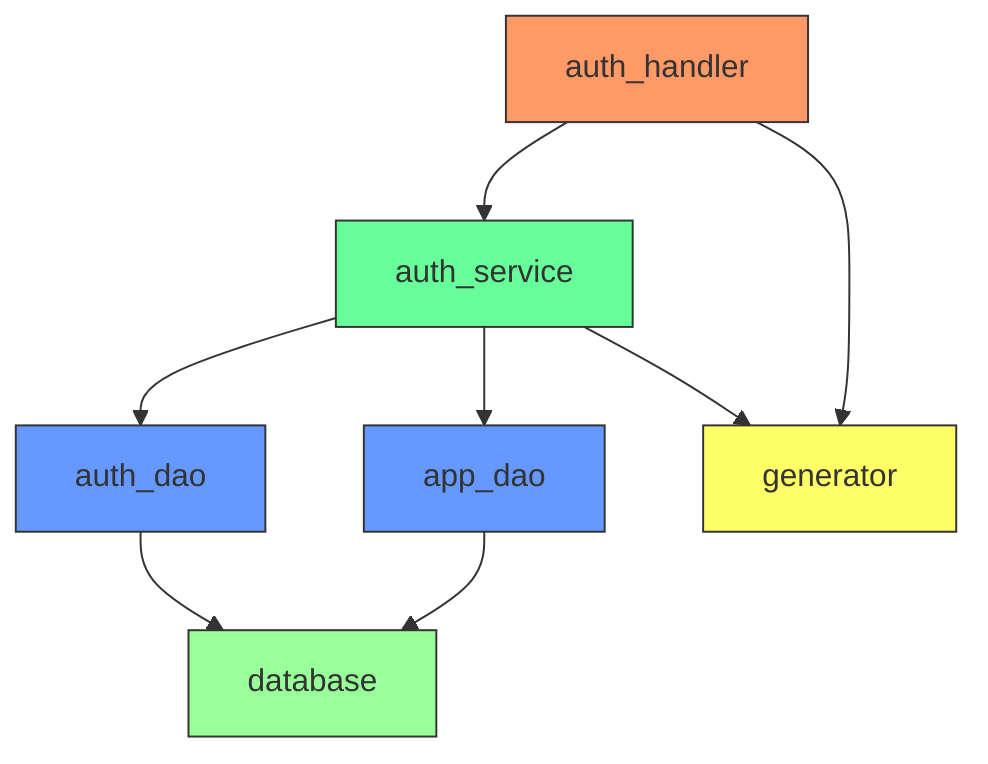

# 认证系统

<cite>
**本文档中引用的文件**  
- [auth_service.go](file://core/tenant/internal/service/auth_service.go)
- [auth_dao.go](file://core/tenant/internal/dao/auth_dao.go)
- [auth_handler.go](file://core/tenant/internal/handler/auth_handler.go)
- [auth.go](file://core/tenant/internal/models/auth.go)
- [database.go](file://core/tenant/tools/database/database.go)
- [config.go](file://core/tenant/config/config.go)
</cite>

## 目录
1. [简介](#简介)
2. [项目结构](#项目结构)
3. [核心组件](#核心组件)
4. [架构概述](#架构概述)
5. [详细组件分析](#详细组件分析)
6. [依赖分析](#依赖分析)
7. [性能考虑](#性能考虑)
8. [故障排除指南](#故障排除指南)
9. [结论](#结论)

## 简介
本文档详细解析了租户服务中的认证系统，重点分析了API密钥生成、验证流程、数据访问模式和RESTful API端点。系统采用Go语言实现，基于Gin框架提供HTTP服务，通过MySQL存储认证信息。认证系统为多租户环境提供安全的应用程序访问控制，支持密钥的创建、查询和删除操作，并实现了完整的错误处理和事务管理机制。

## 项目结构
租户服务的认证系统位于`core/tenant`目录下，采用典型的分层架构设计。系统分为模型层(models)、数据访问层(dao)、业务逻辑层(service)和处理器层(handler)。配置文件位于config目录，数据库工具位于tools目录。这种分层结构确保了代码的可维护性和可测试性，各层职责分明，便于扩展和维护。

**图示来源**  
- [auth_handler.go](file://core/tenant/internal/handler/auth_handler.go#L1-L10)
- [auth_service.go](file://core/tenant/internal/service/auth_service.go#L1-L10)
- [auth_dao.go](file://core/tenant/internal/dao/auth_dao.go#L1-L10)

**本节来源**  
- [core/tenant](file://core/tenant#L1-L10)

## 核心组件
认证系统的核心组件包括认证模型、数据访问对象、业务服务和HTTP处理器。认证模型定义了API密钥、密钥密钥和应用程序ID等核心属性。数据访问层负责与MySQL数据库交互，执行CRUD操作。业务服务层实现了应用逻辑，包括密钥生成、验证和删除。HTTP处理器层暴露RESTful API端点，处理客户端请求并返回响应。

**本节来源**  
- [auth.go](file://core/tenant/internal/models/auth.go#L1-L15)
- [auth_service.go](file://core/tenant/internal/service/auth_service.go#L1-L20)
- [auth_dao.go](file://core/tenant/internal/dao/auth_dao.go#L1-L20)

## 架构概述
认证系统采用分层架构，各层之间通过接口进行通信。HTTP处理器接收客户端请求，调用业务服务层的方法。业务服务层协调数据访问层的操作，确保事务的一致性。数据访问层直接与MySQL数据库交互，执行SQL语句。整个系统通过依赖注入的方式管理组件间的依赖关系，提高了代码的可测试性和灵活性。

**图示来源**  
- [auth_handler.go](file://core/tenant/internal/handler/auth_handler.go#L1-L20)
- [auth_service.go](file://core/tenant/internal/service/auth_service.go#L1-L30)
- [auth_dao.go](file://core/tenant/internal/dao/auth_dao.go#L1-L30)

## 详细组件分析

### 认证模型分析
认证模型定义了应用程序认证所需的核心数据结构，包括应用程序ID、API密钥、密钥密钥、创建时间等字段。模型设计考虑了多租户场景，通过应用程序ID区分不同租户的认证信息。软删除标志用于标记已删除的记录，而不是物理删除，便于数据恢复和审计。

**图示来源**  
- [auth.go](file://core/tenant/internal/models/auth.go#L1-L15)

**本节来源**  
- [auth.go](file://core/tenant/internal/models/auth.go#L1-L20)

### 认证服务分析
认证服务实现了核心业务逻辑，包括添加认证信息、删除API密钥和查询认证数据。服务方法使用数据库事务确保操作的原子性。在添加认证信息时，服务会验证应用程序是否存在，并检查API密钥是否已存在。如果未提供API密钥或密钥密钥，服务会自动生成。

**图示来源**  
- [auth_service.go](file://core/tenant/internal/service/auth_service.go#L50-L100)

**本节来源**  
- [auth_service.go](file://core/tenant/internal/service/auth_service.go#L1-L155)

### 认证数据访问分析
数据访问层提供了对MySQL数据库的封装，通过预编译的SQL语句执行CRUD操作。DAO使用函数式选项模式构建查询条件，提高了代码的可读性和灵活性。所有数据库操作都支持事务，确保数据一致性。查询方法返回指针切片，避免了值拷贝的性能开销。

**图示来源**  
- [auth_dao.go](file://core/tenant/internal/dao/auth_dao.go#L1-L50)
- [database.go](file://core/tenant/tools/database/database.go#L1-L20)

**本节来源**  
- [auth_dao.go](file://core/tenant/internal/dao/auth_dao.go#L1-L240)

### 认证处理器分析
HTTP处理器层暴露了RESTful API端点，处理客户端的认证相关请求。处理器使用Gin框架的上下文对象获取请求参数和设置响应。每个处理器方法都实现了完整的错误处理，将业务异常转换为适当的HTTP响应。处理器还负责请求验证和日志记录，为系统监控和调试提供支持。

**图示来源**  
- [auth_handler.go](file://core/tenant/internal/handler/auth_handler.go#L1-L50)

**本节来源**  
- [auth_handler.go](file://core/tenant/internal/handler/auth_handler.go#L1-L163)

## 依赖分析
认证系统依赖于MySQL数据库存储认证信息，通过database包提供的Database对象进行连接管理。业务服务层依赖于AppDao和AuthDao，实现了对应用程序和认证信息的管理。处理器层依赖于AuthService，通过依赖注入的方式获取服务实例。系统还依赖于generator工具包生成API密钥和时间戳。

**图示来源**  
- [auth_handler.go](file://core/tenant/internal/handler/auth_handler.go#L1-L20)
- [auth_service.go](file://core/tenant/internal/service/auth_service.go#L1-L30)
- [auth_dao.go](file://core/tenant/internal/dao/auth_dao.go#L1-L20)
- [database.go](file://core/tenant/tools/database/database.go#L1-L20)

**本节来源**  
- [auth_service.go](file://core/tenant/internal/service/auth_service.go#L1-L30)
- [auth_dao.go](file://core/tenant/internal/dao/auth_dao.go#L1-L30)

## 性能考虑
认证系统在设计时考虑了性能因素。数据访问层使用预编译的SQL语句，减少了SQL解析的开销。查询操作使用适当的索引，确保快速检索。连接池配置了最大空闲连接和最大打开连接，平衡了资源使用和性能。事务范围被限制在必要的操作上，减少了锁的持有时间。对于高并发场景，可以考虑引入缓存层来进一步提高性能。

## 故障排除指南
当认证系统出现问题时，首先检查日志文件中的错误信息。常见的问题包括数据库连接失败、应用程序ID不存在和API密钥冲突。确保数据库配置正确，包括用户名、密码和URL。验证应用程序是否已正确注册。检查API密钥是否符合生成规则。对于事务相关的问题，查看回滚日志以确定失败原因。监控数据库连接池的状态，确保没有连接泄漏。

**本节来源**  
- [auth_service.go](file://core/tenant/internal/service/auth_service.go#L100-L150)
- [auth_dao.go](file://core/tenant/internal/dao/auth_dao.go#L100-L200)
- [auth_handler.go](file://core/tenant/internal/handler/auth_handler.go#L50-L100)

## 结论
租户服务的认证系统提供了一个安全、可靠的应用程序访问控制机制。系统采用分层架构，职责分明，易于维护和扩展。通过事务管理确保数据一致性，通过完整的错误处理提供良好的用户体验。未来可以考虑引入缓存机制来提高性能，增加密钥轮换功能来增强安全性，以及提供更详细的监控指标来支持系统运维。