# 配置管理

<cite>
**本文档中引用的文件**
- [config.go](file://core/tenant/config/config.go)
- [loader.go](file://core/tenant/config/loader.go)
- [local_loader.go](file://core/tenant/config/local_loader.go)
- [env_loader.go](file://core/tenant/config/env_loader.go)
- [config.toml](file://core/tenant/config.toml)
- [config_test.go](file://core/tenant/config/config_test.go)
- [loader_test.go](file://core/tenant/config/loader_test.go)
- [local_loader_test.go](file://core/tenant/config/local_loader_test.go)
- [env_loader_test.go](file://core/tenant/config/env_loader_test.go)
- [server.go](file://core/tenant/app/server.go)
- [main.go](file://core/tenant/main.go)
</cite>

## 目录
1. [简介](#简介)
2. [项目结构](#项目结构)
3. [核心组件](#核心组件)
4. [架构概览](#架构概览)
5. [详细组件分析](#详细组件分析)
6. [配置加载机制](#配置加载机制)
7. [配置验证流程](#配置验证流程)
8. [配置示例与格式](#配置示例与格式)
9. [配置优先级说明](#配置优先级说明)
10. [热更新实现建议](#热更新实现建议)
11. [生产环境最佳实践](#生产环境最佳实践)
12. [故障排除指南](#故障排除指南)
13. [总结](#总结)

## 简介

astron-agent的配置管理系统是一个高度灵活且可扩展的配置解决方案，采用多源配置加载策略，支持文件配置和环境变量配置的无缝集成。该系统通过分层架构设计，实现了配置的统一管理、验证和动态加载，为应用程序提供了强大的配置能力。

配置管理系统的核心特性包括：
- **多源配置支持**：同时支持文件配置和环境变量配置
- **配置验证机制**：内置严格的配置验证规则
- **配置优先级控制**：环境变量优先于文件配置
- **热更新支持**：为未来的配置热更新功能预留接口
- **类型安全**：强类型的配置结构设计

## 项目结构

配置管理模块位于`core/tenant/config/`目录下，包含以下关键文件：

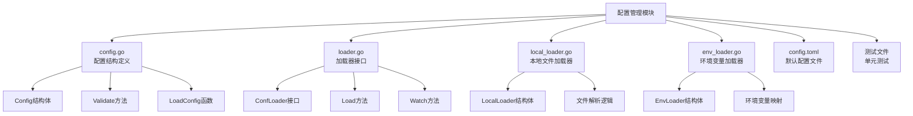

**图表来源**
- [config.go](file://core/tenant/config/config.go#L1-L65)
- [loader.go](file://core/tenant/config/loader.go#L1-L7)
- [local_loader.go](file://core/tenant/config/local_loader.go#L1-L25)
- [env_loader.go](file://core/tenant/config/env_loader.go#L1-L96)

**章节来源**
- [config.go](file://core/tenant/config/config.go#L1-L65)
- [loader.go](file://core/tenant/config/loader.go#L1-L7)
- [local_loader.go](file://core/tenant/config/local_loader.go#L1-L25)
- [env_loader.go](file://core/tenant/config/env_loader.go#L1-L96)

## 核心组件

### Config结构体

Config结构体是整个配置管理系统的核心数据模型，定义了应用程序所需的所有配置项：

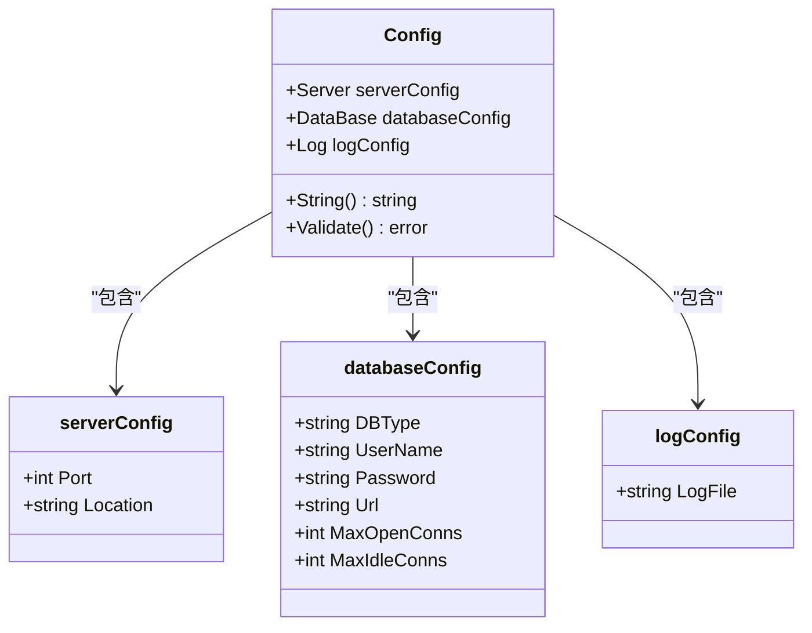

**图表来源**
- [config.go](file://core/tenant/config/config.go#L4-L22)

### 加载器接口体系

配置管理系统采用接口驱动的设计模式，通过`ConfLoader`接口定义加载器的标准行为：

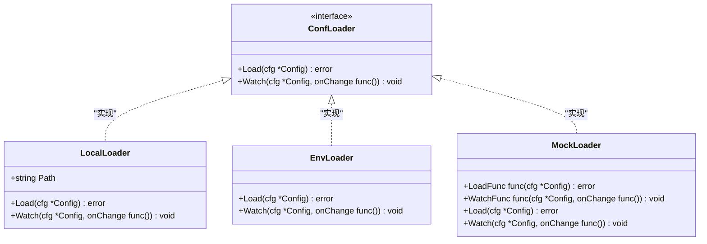

**图表来源**
- [loader.go](file://core/tenant/config/loader.go#L3-L6)
- [local_loader.go](file://core/tenant/config/local_loader.go#L5-L24)
- [env_loader.go](file://core/tenant/config/env_loader.go#L7-L95)

**章节来源**
- [config.go](file://core/tenant/config/config.go#L4-L65)
- [loader.go](file://core/tenant/config/loader.go#L1-L7)
- [local_loader.go](file://core/tenant/config/local_loader.go#L1-L25)
- [env_loader.go](file://core/tenant/config/env_loader.go#L1-L96)

## 架构概览

配置管理系统采用分层架构设计，实现了关注点分离和高度的可扩展性：

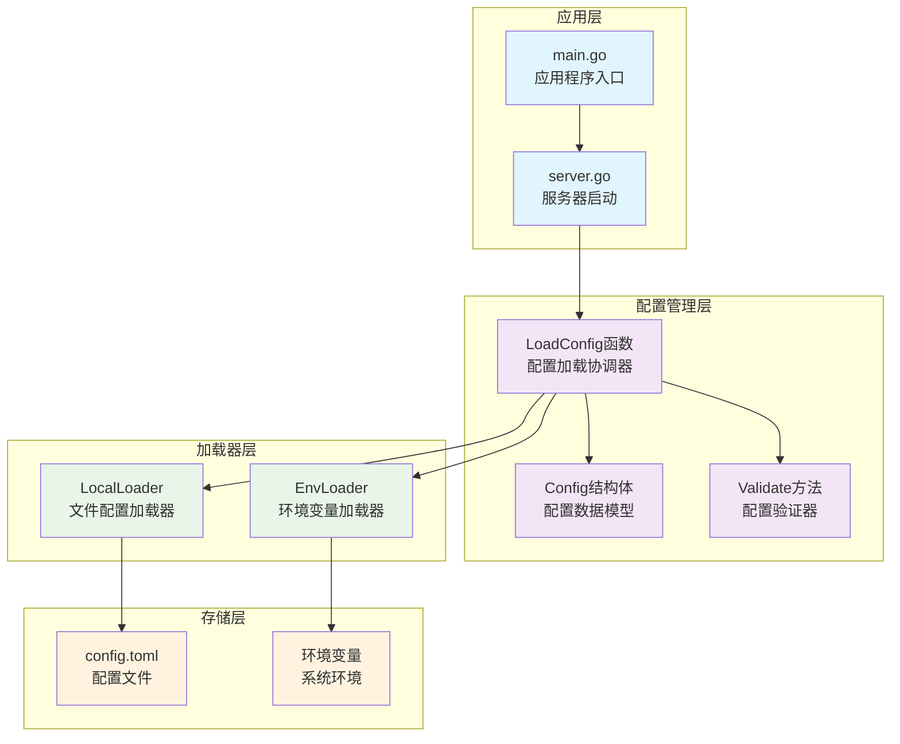

**图表来源**
- [main.go](file://core/tenant/main.go#L1-L15)
- [server.go](file://core/tenant/app/server.go#L18-L30)
- [config.go](file://core/tenant/config/config.go#L48-L65)

## 详细组件分析

### Config结构体详细分析

Config结构体采用嵌套结构设计，将不同类型的配置项进行逻辑分组：

#### 服务配置 (Server)
- **Port**: 服务器监听端口号，必须配置且不能为零
- **Location**: 服务器地理位置标识，用于分布式部署场景

#### 数据库配置 (DataBase)
- **DBType**: 数据库类型标识符（如mysql、postgresql）
- **UserName**: 数据库用户名
- **Password**: 数据库密码
- **Url**: 数据库连接URL
- **MaxOpenConns**: 最大打开连接数
- **MaxIdleConns**: 最大空闲连接数

#### 日志配置 (Log)
- **LogFile**: 日志文件路径

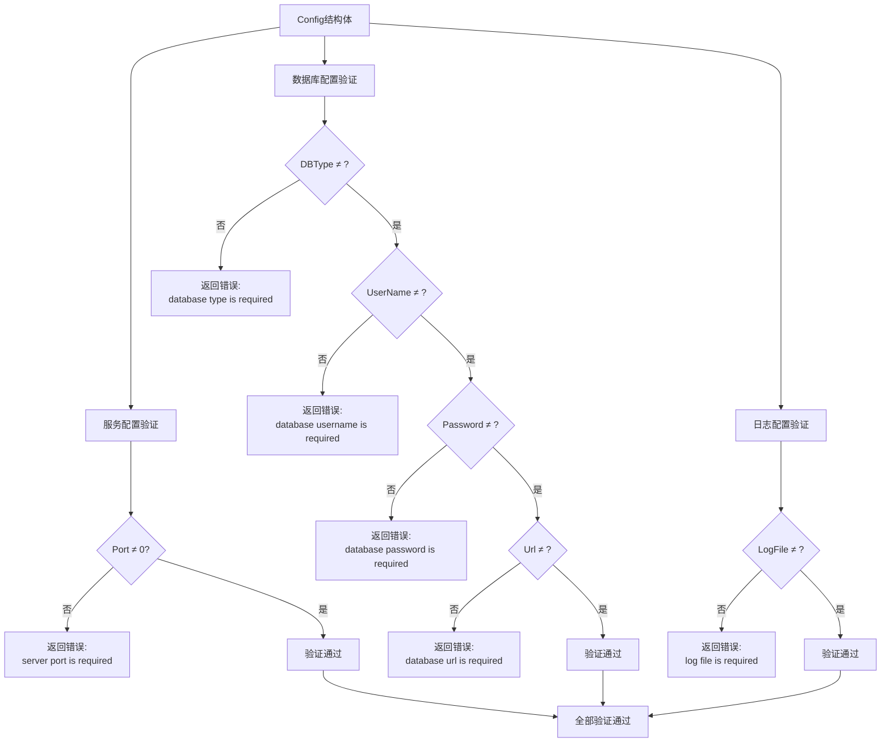

**图表来源**
- [config.go](file://core/tenant/config/config.go#L24-L46)

**章节来源**
- [config.go](file://core/tenant/config/config.go#L4-L65)

### LocalLoader本地文件加载器

LocalLoader负责从本地文件系统加载配置，支持TOML格式的配置文件：

#### 核心功能
- **文件路径管理**: 支持自定义配置文件路径，默认使用`./config.toml`
- **TOML解析**: 使用BurntSushi/toml库进行配置文件解析
- **错误处理**: 提供详细的文件读取和解析错误信息

#### 实现特点
- **延迟初始化**: 在首次调用时才执行文件读取操作
- **空实现**: Watch方法目前为空实现，为未来热更新功能预留
- **类型安全**: 使用强类型结构体确保配置字段的正确性

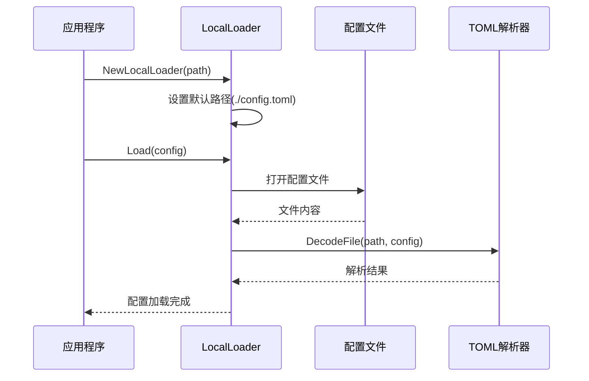

**图表来源**
- [local_loader.go](file://core/tenant/config/local_loader.go#L8-L24)

**章节来源**
- [local_loader.go](file://core/tenant/config/local_loader.go#L1-L25)

### EnvLoader环境变量加载器

EnvLoader专门处理环境变量配置，提供了灵活的环境变量映射机制：

#### 环境变量映射表

| 环境变量名 | 配置字段 | 类型 | 验证规则 |
|------------|----------|------|----------|
| SERVICE_PORT | Server.Port | int | 必须为有效整数 |
| SERVICE_LOCATION | Server.Location | string | 字符串类型 |
| DATABASE_DB_TYPE | DataBase.DBType | string | 字符串类型 |
| DATABASE_USERNAME | DataBase.UserName | string | 字符串类型 |
| DATABASE_PASSWORD | DataBase.Password | string | 字符串类型 |
| DATABASE_URL | DataBase.Url | string | 字符串类型 |
| DATABASE_MAX_OPEN_CONNS | DataBase.MaxOpenConns | int | 必须为有效整数 |
| DATABASE_MAX_IDLE_CONNS | DataBase.MaxIdleConns | int | 必须为有效整数 |
| LOG_PATH | Log.LogFile | string | 字符串类型 |

#### 错误处理机制
- **类型转换错误**: 对于需要数值类型的环境变量，提供详细的解析错误信息
- **空值处理**: 环境变量为空时不修改对应的配置字段
- **部分覆盖**: 只有设置了对应环境变量的配置项才会被覆盖

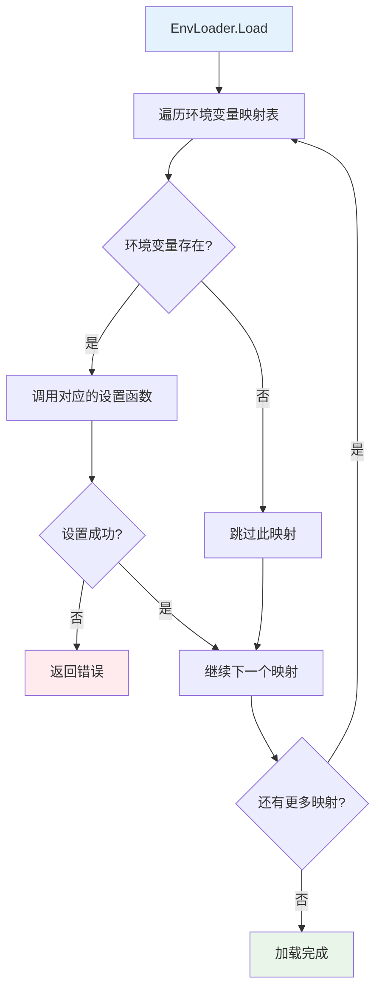

**图表来源**
- [env_loader.go](file://core/tenant/config/env_loader.go#L18-L35)
- [env_loader.go](file://core/tenant/config/env_loader.go#L37-L95)

**章节来源**
- [env_loader.go](file://core/tenant/config/env_loader.go#L1-L96)

## 配置加载机制

### 多源配置协调

配置管理系统采用协调器模式，通过`LoadConfig`函数协调多个配置源：

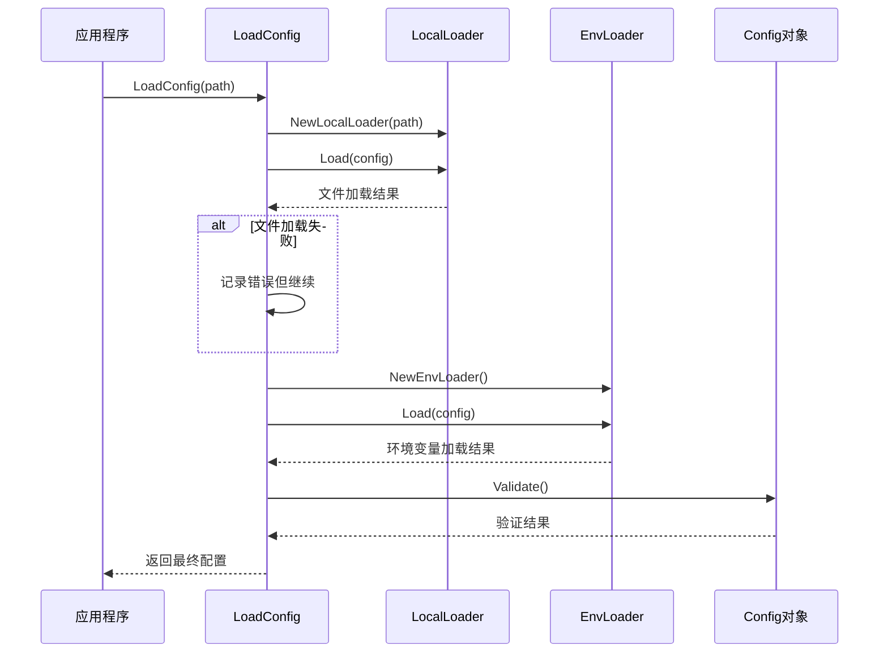

**图表来源**
- [config.go](file://core/tenant/config/config.go#L48-L65)

### 加载顺序说明

1. **文件配置加载**: 优先从指定路径加载TOML配置文件
2. **环境变量覆盖**: 从环境变量中读取配置并覆盖文件配置
3. **配置验证**: 对最终配置进行完整性检查
4. **错误处理**: 如果文件不存在但环境变量满足要求，则继续运行

**章节来源**
- [config.go](file://core/tenant/config/config.go#L48-L65)

## 配置验证流程

### 验证规则详解

配置验证采用严格的数据完整性检查，确保所有必需配置项都已正确设置：

#### 服务配置验证
- **端口号检查**: 必须大于0，不能为零或负数
- **位置标识**: 可以为任意字符串，但不能为空

#### 数据库配置验证
- **数据库类型**: 必须指定有效的数据库类型
- **认证凭据**: 用户名、密码和连接URL都是必需的
- **连接参数**: 连接池参数可以为空，但格式必须正确

#### 日志配置验证
- **日志文件路径**: 必须指定有效的文件路径

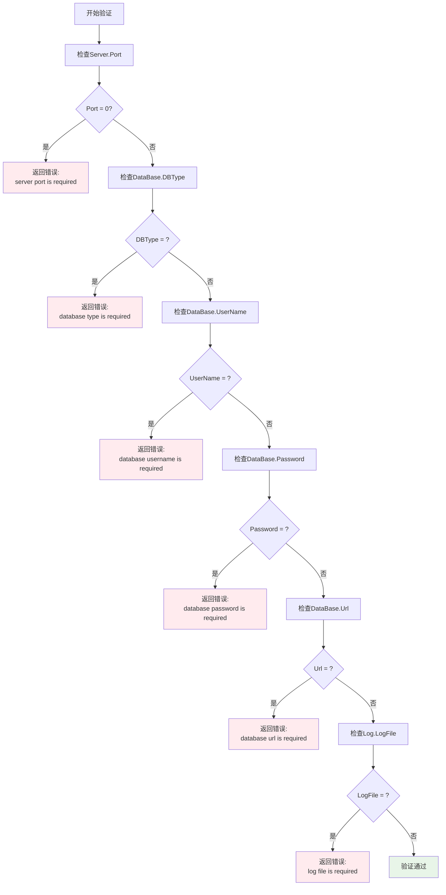

**图表来源**
- [config.go](file://core/tenant/config/config.go#L24-L46)

**章节来源**
- [config.go](file://core/tenant/config/config.go#L24-L46)

## 配置示例与格式

### 默认配置文件 (config.toml)

以下是标准的配置文件格式示例：

```toml
[service]
port = 5052
location = "ss"

[database]
dbType = "mysql"
username = "root"
password = "123456"
url = "(localhost:3306)/tenant"
maxOpenConns = 10
maxIdleConns = 5

[log]
path = "./logs/app.log"
```

### 配置字段说明

| 配置段 | 字段 | 类型 | 默认值 | 说明 |
|--------|------|------|--------|------|
| service | port | int | 5052 | 服务器监听端口 |
| service | location | string | "ss" | 服务器地理位置标识 |
| database | dbType | string | - | 数据库类型 |
| database | username | string | - | 数据库用户名 |
| database | password | string | - | 数据库密码 |
| database | url | string | - | 数据库连接URL |
| database | maxOpenConns | int | 10 | 最大打开连接数 |
| database | maxIdleConns | int | 5 | 最大空闲连接数 |
| log | path | string | "./logs/app.log" | 日志文件路径 |

### 环境变量配置示例

```bash
# 服务配置
SERVICE_PORT=8080
SERVICE_LOCATION=us-east

# 数据库配置
DATABASE_DB_TYPE=mysql
DATABASE_USERNAME=admin
DATABASE_PASSWORD=secret123
DATABASE_URL=localhost:3306
DATABASE_MAX_OPEN_CONNS=20
DATABASE_MAX_IDLE_CONNS=10

# 日志配置
LOG_PATH=/var/log/astron-agent/app.log
```

**章节来源**
- [config.toml](file://core/tenant/config.toml#L1-L15)

## 配置优先级说明

### 优先级规则

配置系统的优先级遵循以下原则：

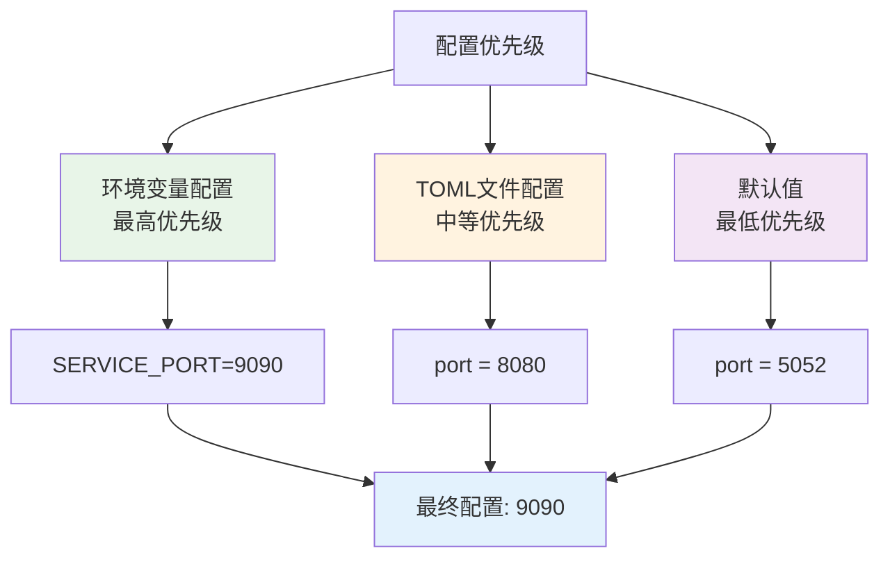

### 具体优先级流程

1. **环境变量优先**: 如果环境变量存在且有效，则覆盖文件配置
2. **部分覆盖**: 只有设置了对应环境变量的配置项会被覆盖
3. **文件配置回退**: 如果环境变量缺失，使用文件配置作为回退
4. **默认值应用**: 如果文件配置也缺失，使用代码中的默认值

### 优先级验证示例

假设存在以下配置组合：

```toml
[service]
port = 8080
location = "us-east"

[database]
dbType = "mysql"
username = "testuser"
```

```bash
# 环境变量
SERVICE_PORT=9090
DATABASE_DB_TYPE=postgresql
```

最终配置结果：
- `port`: 9090 (环境变量覆盖)
- `location`: us-east (仅文件配置)
- `dbType`: postgresql (环境变量覆盖)
- `username`: testuser (仅文件配置)
- `password`: "" (环境变量未设置)
- `url`: "" (文件配置未设置)

**章节来源**
- [config_test.go](file://core/tenant/config/config_test.go#L200-L250)

## 热更新实现建议

### 当前架构支持

虽然当前版本的配置加载器（LocalLoader和EnvLoader）都实现了空的Watch方法，但架构已经为热更新功能预留了接口：

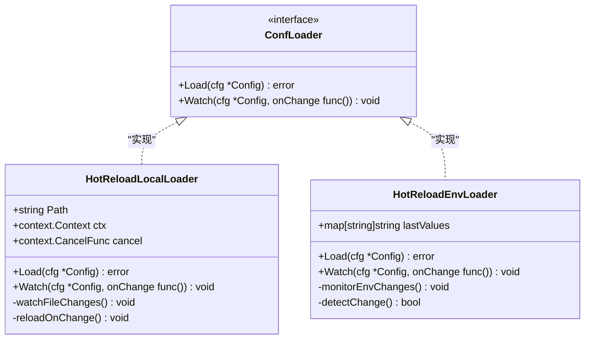

### 热更新实现方案

#### 文件配置热更新

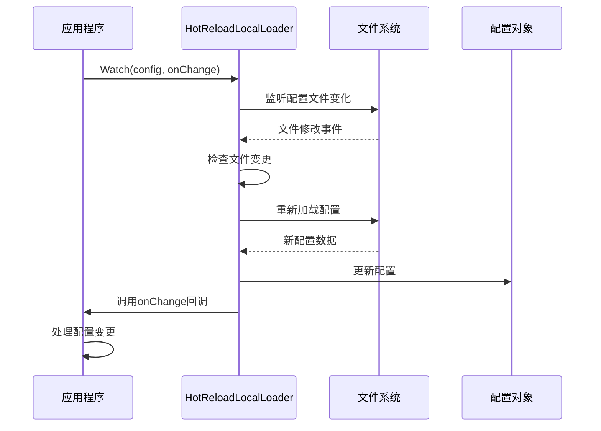

#### 环境变量热更新

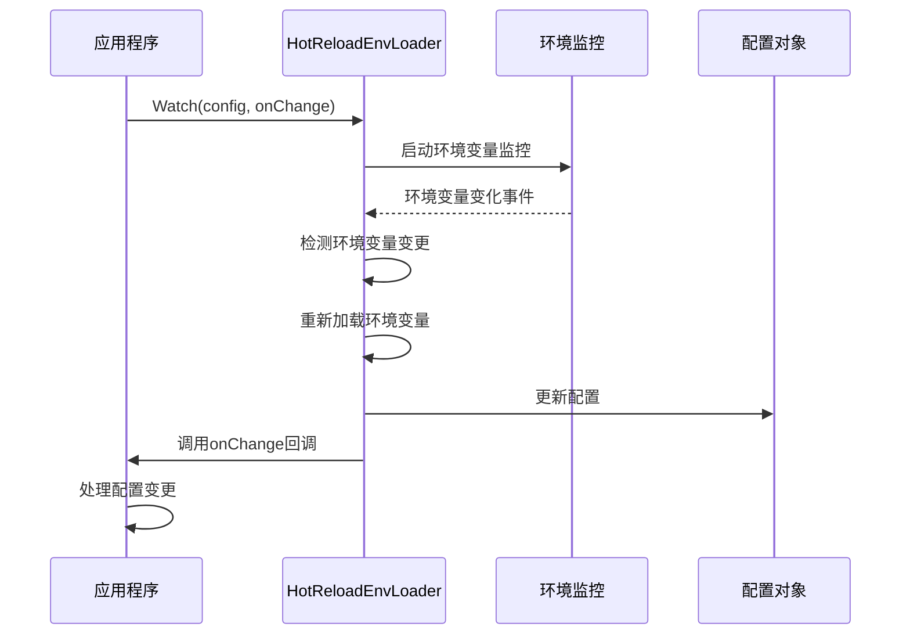

### 热更新最佳实践

1. **渐进式更新**: 避免一次性更新所有配置，按需更新
2. **事务性更新**: 确保配置更新的原子性
3. **回滚机制**: 提供配置更新失败时的回滚能力
4. **通知机制**: 及时通知相关组件配置变更

## 生产环境最佳实践

### 配置管理策略

#### 1. 环境隔离
- **开发环境**: 使用本地配置文件，便于调试
- **测试环境**: 使用环境变量配置，模拟生产环境
- **生产环境**: 完全依赖环境变量配置，避免敏感信息泄露

#### 2. 敏感信息保护
- **数据库密码**: 始终使用环境变量配置
- **API密钥**: 存储在专用的密钥管理服务中
- **证书文件**: 使用容器编排工具挂载

#### 3. 配置验证
- **启动时验证**: 在应用启动时严格验证配置完整性
- **定期健康检查**: 监控配置的有效性
- **错误处理**: 提供清晰的配置错误诊断信息

#### 4. 配置备份
- **版本控制**: 将配置文件纳入版本控制系统
- **配置快照**: 定期备份重要配置
- **变更记录**: 记录配置变更历史

### 性能优化建议

#### 1. 配置缓存
```go
type CachedConfig struct {
    config *Config
    lastModified time.Time
    mutex sync.RWMutex
}

func (cc *CachedConfig) Get() *Config {
    cc.mutex.RLock()
    defer cc.mutex.RUnlock()
    return cc.config
}

func (cc *CachedConfig) Update(newConfig *Config, modifiedTime time.Time) {
    cc.mutex.Lock()
    defer cc.mutex.Unlock()
    cc.config = newConfig
    cc.lastModified = modifiedTime
}
```

#### 2. 异步加载
- **后台预加载**: 在应用启动时异步加载配置
- **懒加载**: 按需加载特定配置段
- **批量更新**: 合并多个配置变更请求

#### 3. 内存优化
- **配置共享**: 多个组件共享同一份配置副本
- **只读配置**: 将配置标记为只读，避免不必要的复制
- **垃圾回收**: 及时释放不再使用的配置对象

### 监控和告警

#### 关键指标监控
- **配置加载时间**: 监控配置加载性能
- **配置验证失败率**: 跟踪配置验证成功率
- **环境变量缺失**: 监控必需环境变量的状态
- **配置文件访问错误**: 跟踪文件系统访问异常

#### 告警策略
- **配置加载失败**: 应用启动时配置加载失败立即告警
- **配置验证失败**: 配置验证失败时发送告警
- **环境变量异常**: 环境变量状态异常时触发告警

**章节来源**
- [server.go](file://core/tenant/app/server.go#L18-L30)

## 故障排除指南

### 常见问题及解决方案

#### 1. 配置文件加载失败

**问题症状**:
- 应用启动时提示"config load failed"
- 使用默认配置而非期望配置

**排查步骤**:
```bash
# 检查配置文件是否存在
ls -la ./config/config.toml

# 检查文件权限
chmod 644 ./config/config.toml

# 检查文件语法
cat ./config/config.toml | grep -E '^[[:space:]]*[^#[:space:]].*='
```

**解决方案**:
- 确保配置文件路径正确
- 检查文件权限设置
- 验证TOML语法正确性

#### 2. 环境变量配置无效

**问题症状**:
- 环境变量设置后配置未生效
- 配置值仍使用文件中的默认值

**排查步骤**:
```bash
# 检查环境变量是否设置
echo $SERVICE_PORT

# 检查环境变量名称拼写
env | grep -E '^(SERVICE_|DATABASE_|LOG_)'

# 检查环境变量类型
echo $DATABASE_MAX_OPEN_CONNS | grep -E '^[0-9]+$'
```

**解决方案**:
- 确保环境变量名称正确
- 检查环境变量值的类型匹配
- 验证环境变量作用域

#### 3. 配置验证失败

**问题症状**:
- 应用启动时提示"validation failed"
- 具体的配置字段错误信息

**常见错误及解决**:
- **server port is required**: 设置SERVICE_PORT环境变量或在配置文件中指定port
- **database type is required**: 设置DATABASE_DB_TYPE环境变量
- **database username is required**: 设置DATABASE_USERNAME环境变量
- **database password is required**: 设置DATABASE_PASSWORD环境变量
- **database url is required**: 设置DATABASE_URL环境变量
- **log file is required**: 设置LOG_PATH环境变量

#### 4. 配置优先级混乱

**问题症状**:
- 配置值不符合预期
- 环境变量似乎没有生效

**排查方法**:
```go
// 添加调试输出查看最终配置
fmt.Printf("Final config: %+v\n", config)
```

**解决方案**:
- 理解配置优先级规则
- 检查环境变量设置
- 验证配置文件内容

### 调试工具和技巧

#### 1. 配置调试中间件
```go
func DebugConfigMiddleware(next http.Handler) http.Handler {
    return http.HandlerFunc(func(w http.ResponseWriter, r *http.Request) {
        cfg := GetConfigFromContext(r.Context())
        log.Printf("Current config: %+v", cfg)
        next.ServeHTTP(w, r)
    })
}
```

#### 2. 配置健康检查端点
```go
func RegisterHealthCheck(router *gin.Engine, cfg *config.Config) {
    router.GET("/health/config", func(c *gin.Context) {
        err := cfg.Validate()
        if err != nil {
            c.JSON(http.StatusInternalServerError, gin.H{
                "status": "error",
                "message": err.Error(),
            })
            return
        }
        
        c.JSON(http.StatusOK, gin.H{
            "status": "ok",
            "config": cfg,
        })
    })
}
```

**章节来源**
- [config_test.go](file://core/tenant/config/config_test.go#L80-L150)
- [env_loader_test.go](file://core/tenant/config/env_loader_test.go#L150-L200)

## 总结

astron-agent的配置管理系统是一个设计精良、功能完备的配置解决方案。通过多源配置加载、严格的验证机制和灵活的优先级控制，为应用程序提供了强大而可靠的配置管理能力。

### 主要优势

1. **多源配置支持**: 同时支持文件配置和环境变量配置，适应不同的部署场景
2. **类型安全**: 强类型的配置结构确保配置的正确性和一致性
3. **严格验证**: 完整的配置验证机制防止配置错误导致的应用故障
4. **易于扩展**: 基于接口的设计使得添加新的配置源变得简单
5. **生产就绪**: 完善的错误处理和调试支持

### 发展方向

1. **热更新功能**: 实现配置的实时更新而不影响服务可用性
2. **配置加密**: 支持敏感配置的加密存储和解密加载
3. **配置版本控制**: 提供配置变更的历史追踪和版本管理
4. **远程配置中心**: 集成配置中心服务，支持集中化配置管理

该配置管理系统为astron-agent提供了坚实的基础，支持从开发到生产的全生命周期配置管理需求，是构建可靠、可维护的企业级应用的重要组成部分。