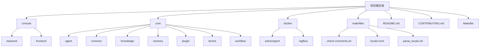
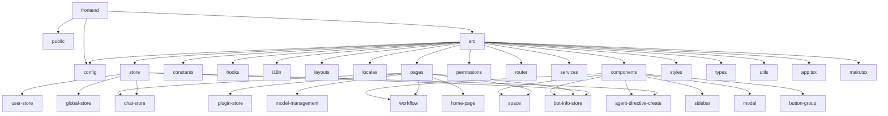
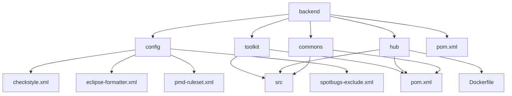
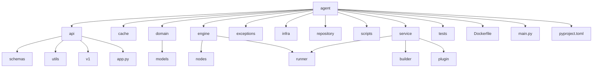
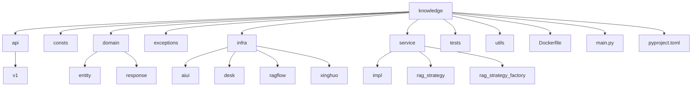
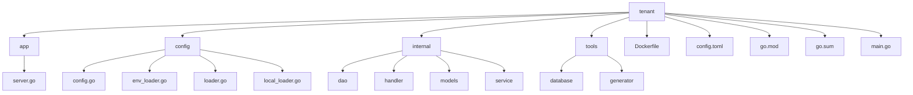
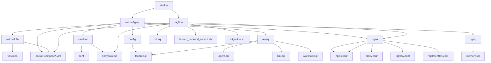
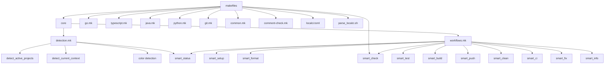

# 目录结构详解

<cite>
**本文档引用的文件**
- [README.md](file://README.md)
- [CONTRIBUTING.md](file://CONTRIBUTING.md)
- [Makefile](file://Makefile)
- [console/backend/pom.xml](file://console/backend/pom.xml)
- [console/frontend/package.json](file://console/frontend/package.json)
- [core/agent/main.py](file://core/agent/main.py)
- [core/common/pyproject.toml](file://core/common/pyproject.toml)
- [core/knowledge/main.py](file://core/knowledge/main.py)
- [core/tenant/main.go](file://core/tenant/main.go)
- [core/workflow/main.py](file://core/workflow/main.py)
- [docker/astronAgent/docker-compose-with-auth.yaml](file://docker/astronAgent/docker-compose-with-auth.yaml)
- [makefiles/core/detection.mk](file://makefiles/core/detection.mk)
- [makefiles/core/workflows.mk](file://makefiles/core/workflows.mk)
- [console/backend/hub/Dockerfile](file://console/backend/hub/Dockerfile)
- [console/frontend/Dockerfile](file://console/frontend/Dockerfile)
- [core/agent/Dockerfile](file://core/agent/Dockerfile)
- [core/knowledge/Dockerfile](file://core/knowledge/Dockerfile)
- [core/memory/database/Dockerfile](file://core/memory/database/Dockerfile)
- [core/plugin/aitools/Dockerfile](file://core/plugin/aitools/Dockerfile)
- [core/plugin/link/Dockerfile](file://core/plugin/link/Dockerfile)
- [core/plugin/rpa/Dockerfile](file://core/plugin/rpa/Dockerfile)
- [core/tenant/Dockerfile](file://core/tenant/Dockerfile)
- [core/workflow/Dockerfile](file://core/workflow/Dockerfile)
</cite>

## 目录结构

- [简介](#简介)
- [项目总体结构](#项目总体结构)
- [console/ 目录](#console-目录)
  - [前端组织方式](#前端组织方式)
  - [后端组织方式](#后端组织方式)
- [core/ 目录](#core-目录)
  - [agent 微服务](#agent-微服务)
  - [knowledge 微服务](#knowledge-微服务)
  - [workflow 微服务](#workflow-微服务)
  - [tenant 微服务](#tenant-微服务)
  - [common 公共库](#common-公共库)
- [docker/ 目录](#docker-目录)
- [makefiles/ 目录](#makefiles-目录)
- [总结](#总结)

## 简介

Astron Agent 是一个企业级、商业友好的 Agentic Workflow 开发平台，集成了AI工作流编排、模型管理、AI和MCP工具集成、RPA自动化和团队协作功能。本文档将全面解析项目的目录结构，详细说明各主要目录的职责和内容。

**Section sources**
- [README.md](file://README.md#L1-L128)

## 项目总体结构

项目采用微服务架构，主要分为控制台（console）、核心服务（core）、Docker部署配置（docker）和构建脚本（makefiles）四大模块。整体结构清晰，各模块职责分明。

**Diagram sources**
- [CONTRIBUTING.md](file://CONTRIBUTING.md#L1-L408)

## console/ 目录

console 目录包含平台的前后端代码，分为 backend 和 frontend 两个子目录，分别对应后端Java服务和前端TypeScript应用。

### 前端组织方式

前端采用React + TypeScript技术栈，使用Vite作为构建工具。src目录下按功能模块组织代码，主要包含组件、服务、状态管理等子目录。

**Diagram sources**
- [console/frontend/package.json](file://console/frontend/package.json#L1-L136)

### 后端组织方式

后端采用Java Spring Boot框架，使用Maven进行项目管理。backend目录下包含多个子模块，通过pom.xml进行依赖管理。

**Diagram sources**
- [console/backend/pom.xml](file://console/backend/pom.xml#L1-L343)

## core/ 目录

core 目录包含平台的核心微服务，每个微服务独立运行，通过API进行通信。这些微服务构成了平台的核心功能。

### agent 微服务

agent 微服务是平台的代理执行引擎，负责处理智能代理的核心逻辑。采用Python开发，使用FastAPI框架。

**Diagram sources**
- [core/agent/main.py](file://core/agent/main.py#L1-L109)
- [core/agent/Dockerfile](file://core/agent/Dockerfile)

### knowledge 微服务

knowledge 微服务负责知识库服务，提供RAG（检索增强生成）功能。采用Python开发，使用FastAPI框架。

**Diagram sources**
- [core/knowledge/main.py](file://core/knowledge/main.py#L1-L112)
- [core/knowledge/Dockerfile](file://core/knowledge/Dockerfile)

### workflow 微服务

workflow 微服务是平台的工作流编排引擎，负责管理复杂的工作流逻辑。采用Python开发，使用FastAPI框架。

```mermaid
graph TD
Workflow[workflow] --> API[api]
Workflow --> Cache[cache]
Workflow --> Configs[configs]
Workflow --> Consts[consts]
Workflow --> Domain[domain]
Workflow --> Engine[engine]
Workflow --> Exception[exception]
Workflow --> Extensions[extensions]
Workflow --> Infra[infra]
Workflow --> Repository[repository]
Workflow --> Service[service]
Workflow --> Tests[tests]
Workflow --> Utils[utils]
Workflow --> Dockerfile[Dockerfile]
Workflow --> Main[main.py]
Workflow --> Pyproject[pyproject.toml]
API --> V1[v1]
Domain --> Entities[entities]
Domain --> Models[models]
Engine --> Callbacks[callbacks]
Engine --> Entities[entities]
Engine --> Nodes[nodes]
Engine --> Dsl[dsl_engine.py]
Engine --> Node[node.py]
Extensions --> Fastapi[fastapi]
Extensions --> Graceful[graceful_shutdown]
Extensions --> Middleware[middleware]
Extensions --> Otlp[otlp]
Infra --> Audit[audit_system]
Infra --> Providers[providers/llm]
Service --> App[app_service.py]
Service --> Audit[audit_service.py]
Service --> Auth[auth_service.py]
Service --> Chat[chat_service.py]
Service --> File[file_service.py]
Service --> Flow[flow_service.py]
Service --> History[history_service.py]
Service --> License[license_service.py]
Service --> Ops[ops_service.py]
Service --> Publish[publish_service.py]
```

**Diagram sources**
- [core/workflow/main.py](file://core/workflow/main.py#L1-L167)
- [core/workflow/Dockerfile](file://core/workflow/Dockerfile)

### tenant 微服务

tenant 微服务负责多租户管理，采用Go语言开发，体现了平台对多语言技术栈的支持。

**Diagram sources**
- [core/tenant/main.go](file://core/tenant/main.go#L1-L14)
- [core/tenant/Dockerfile](file://core/tenant/Dockerfile)

### common 公共库

common 目录包含多个微服务共享的公共库和工具，确保代码的复用性和一致性。

```mermaid
graph TD
Common[common] --> Audit[audit_system]
Common --> Exceptions[exceptions]
Common --> Initialize[initialize]
Common --> Metrology[metrology_auth]
Common --> Otlp[otlp]
Common --> Service[service]
Common --> Settings[settings]
Common --> Tests[tests]
Common --> Utils[utils]
Common --> README[README.md]
Common --> MaSdk[ma-sdk.toml]
Common --> Pyproject[pyproject.toml]
Common --> UvLock[uv.lock]
Audit --> Api[audit_api]
Audit --> Strategy[strategy]
Audit --> Base[base.py]
Audit --> Enums[enums.py]
Audit --> Orchestrator[orchestrator.py]
Audit --> Utils[utils.py]
Exceptions --> Base[base.py]
Exceptions --> Codes[codes.py]
Exceptions --> Errs[errs.py]
Metrology --> Include[include]
Metrology --> Base[base.py]
Metrology --> Calc[calc.py]
Metrology --> Conc[conc.py]
Metrology --> Errors[errors.py]
Metrology --> Licc[licc.py]
Metrology --> MaSdk[ma-sdk.toml]
Metrology --> Rep[rep.py]
Otlp --> Args[args]
Otlp --> Log[log_trace]
Otlp --> Metrics[metrics]
Otlp --> Trace[trace]
Otlp --> Ip[ip.py]
Otlp --> Sid[sid.py]
Service --> Cache[cache]
Service --> Db[db]
Service --> Kafka[kafka]
Service --> Log[log]
Service --> Ma[ma]
Service --> Oss[oss]
Service --> Otlp[otlp]
Service --> Settings[settings]
Service --> Base[base.py]
Service --> Utils[utils.py]
Settings --> Polaris[polaris.py]
Settings --> Settings[settings.py]
Utils --> Json[json_schema]
Utils --> Hmac[hmac_auth.py]
Utils --> Snowfake[snowfake.py]
```

**Diagram sources**
- [core/common/pyproject.toml](file://core/common/pyproject.toml#L1-L53)

## docker/ 目录

docker 目录包含平台的Docker部署配置文件，通过docker-compose实现多服务的协同工作。

**Diagram sources**
- [docker/astronAgent/docker-compose-with-auth.yaml](file://docker/astronAgent/docker-compose-with-auth.yaml#L1-L14)

## makefiles/ 目录

makefiles 目录包含项目的构建脚本，提供了一套智能化的CI/CD工具链，简化了开发流程。

**Diagram sources**
- [makefiles/core/detection.mk](file://makefiles/core/detection.mk#L1-L138)
- [makefiles/core/workflows.mk](file://makefiles/core/workflows.mk#L1-L307)

## 总结

Astron Agent项目采用清晰的微服务架构，各目录职责分明：
- **console/**: 平台的前后端代码，采用Java和TypeScript技术栈
- **core/**: 核心微服务，包括agent、knowledge、workflow、tenant等，采用Python和Go语言
- **docker/**: Docker部署配置，通过docker-compose实现多服务协同
- **makefiles/**: 构建脚本，提供智能化的CI/CD工具链

这种结构设计使得项目易于维护和扩展，不同技术栈的微服务可以独立开发和部署，同时通过统一的构建和部署流程保证了整体的一致性。