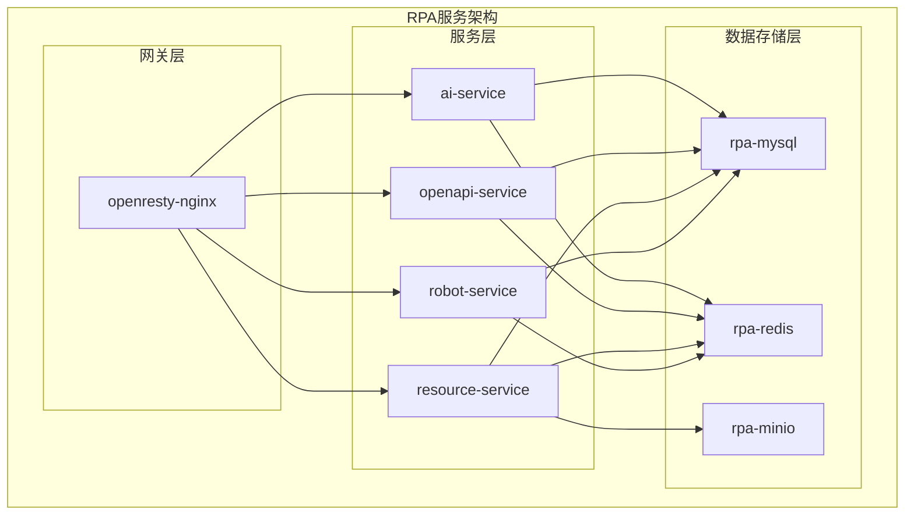
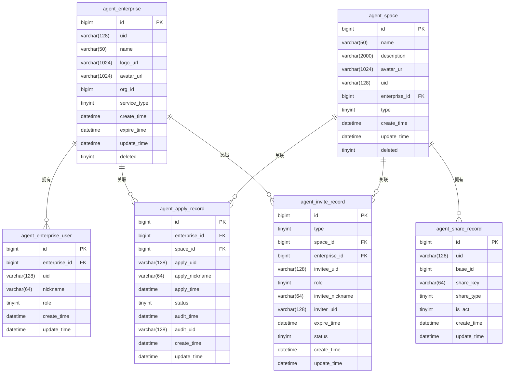
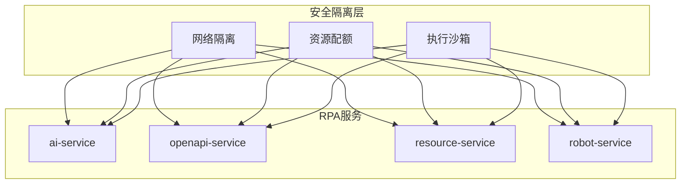
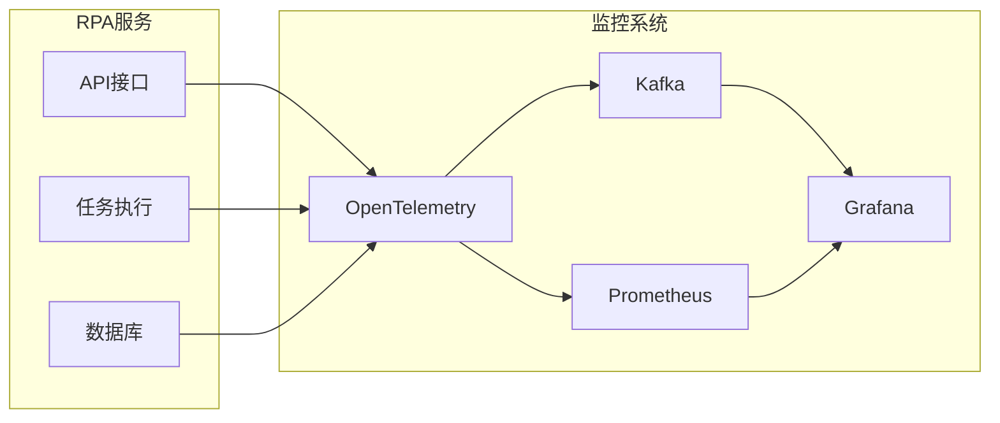

# RPA服务扩展

<cite>
**本文档引用的文件**  
- [docker-compose-with-auth-rpa.yaml](file://docker/astronAgent/docker-compose-with-auth-rpa.yaml)
- [docker-compose.yml](file://docker/astronAgent/astronRPA/docker-compose.yml)
- [schema.sql](file://docker/astronAgent/mysql/schema.sql)
- [main.py](file://core/plugin/rpa/main.py)
- [Dockerfile](file://core/plugin/rpa/Dockerfile)
- [app.py](file://core/plugin/rpa/api/app.py)
- [router.py](file://core/plugin/rpa/api/router.py)
- [execution.py](file://core/plugin/rpa/api/v1/execution.py)
- [process.py](file://core/plugin/rpa/service/xiaowu/process.py)
- [execution_schema.py](file://core/plugin/rpa/api/schemas/execution_schema.py)
- [pyproject.toml](file://core/plugin/rpa/pyproject.toml)
</cite>

## 目录
1. [集成部署配置](#集成部署配置)
2. [RPA服务架构与组件](#rpa服务架构与组件)
3. [RPA与核心工作流引擎的集成](#rpa与核心工作流引擎的集成)
4. [RPA专用数据库设计](#rpa专用数据库设计)
5. [安全隔离策略](#安全隔离策略)
6. [监控指标配置](#监控指标配置)

## 集成部署配置

`docker-compose-with-auth-rpa.yaml` 文件定义了集成RPA服务的完整部署配置，通过包含多个独立的Docker Compose文件来构建完整的系统。该配置文件整合了核心服务、认证服务和RPA服务，确保所有服务在统一的Docker网络中运行。

该配置文件通过`include`指令引入了三个主要的配置文件：
- `docker-compose-auth.yml`：包含Casdoor认证服务
- `docker-compose.yaml`：包含astronAgent核心服务
- `astronRPA/docker-compose.yml`：包含RPA相关服务

所有服务都运行在名为`astron-agent-network`的Docker桥接网络中，确保服务间的网络互通性。

**Section sources**
- [docker-compose-with-auth-rpa.yaml](file://docker/astronAgent/docker-compose-with-auth-rpa.yaml#L1-L35)

## RPA服务架构与组件

RPA服务由多个独立的服务组件构成，每个组件都有特定的职责和功能。`astronRPA/docker-compose.yml`文件定义了这些服务的详细配置。

### RPA核心服务

RPA服务包含以下主要组件：

**rpa-mysql**：RPA专用的MySQL数据库服务，用于存储RPA相关的持久化数据。该服务配置了健康检查机制，确保数据库的可用性，并通过卷挂载方式初始化数据库模式和数据。

**rpa-redis**：Redis缓存服务，用于RPA任务的状态管理和会话存储。配置了AOF持久化禁用以提高性能，并设置了适当的IO线程数。

**rpa-minio**：对象存储服务，用于存储RPA执行过程中产生的文件和资源。通过MinIO客户端进行初始化，创建必要的存储桶。

**openresty-nginx**：Nginx反向代理服务，用于路由RPA相关的API请求。配置了健康检查，确保后端服务的可用性。

**AI服务组件**：
- **ai-service**：AI服务，处理与AI相关的RPA任务
- **openapi-service**：OpenAPI服务，提供标准化的API接口
- **resource-service**：资源服务，管理RPA执行所需的资源
- **robot-service**：机器人服务，执行具体的RPA任务

这些服务都配置了环境变量、依赖关系和网络设置，确保它们能够正确地协同工作。



**Diagram sources**
- [docker-compose.yml](file://docker/astronAgent/astronRPA/docker-compose.yml#L1-L260)

**Section sources**
- [docker-compose.yml](file://docker/astronAgent/astronRPA/docker-compose.yml#L1-L260)

## RPA与核心工作流引擎的集成

RPA服务通过标准化的API接口与核心工作流引擎进行集成，实现了任务调度、状态同步和结果回调的完整流程。

### 任务调度接口

RPA服务通过FastAPI框架提供RESTful API接口，核心工作流引擎可以通过这些接口调度RPA任务。`app.py`文件定义了RPA服务的主应用程序，配置了Uvicorn服务器的启动参数。

`router.py`文件定义了API路由，所有RPA相关的API都通过`/rpa/v1`前缀进行访问。`execution.py`文件中的`exec_fun`函数处理RPA任务的执行请求，接收访问令牌和执行参数，并返回流式响应。

### 执行状态同步

RPA服务实现了任务监控机制，通过`task_monitoring`函数持续查询任务状态。该函数在创建RPA任务后，会定期查询任务状态，直到任务完成或超时。

任务监控的主要特点包括：
- 可配置的任务查询间隔（默认10秒）
- 可配置的超时时间（默认300秒）
- 支持SSE（Server-Sent Events）流式响应
- 完善的错误处理和重试机制

### 结果回调机制

RPA服务通过事件源响应（EventSourceResponse）向调用方推送任务执行结果。当任务完成时，服务会立即返回结果；如果任务超时或出错，也会返回相应的错误信息。

```mermaid
sequenceDiagram
participant 工作流引擎 as 核心工作流引擎
participant RPA服务 as RPA服务
participant RPA任务 as RPA任务
工作流引擎->>RPA服务 : POST /rpa/v1/exec
RPA服务->>RPA服务 : 验证访问令牌
RPA服务->>RPA任务 : 创建RPA任务
RPA服务->>RPA服务 : 启动任务监控
loop 每10秒查询一次
RPA服务->>RPA任务 : 查询任务状态
alt 任务完成
RPA任务-->>RPA服务 : 返回成功结果
RPA服务-->>工作流引擎 : 发送完成事件
break
else 任务仍在运行
RPA任务-->>RPA服务 : 返回运行中状态
end
end
alt 超时或错误
RPA服务-->>工作流引擎 : 发送错误事件
end
```

**Diagram sources**
- [app.py](file://core/plugin/rpa/api/app.py#L1-L161)
- [router.py](file://core/plugin/rpa/api/router.py#L1-L18)
- [execution.py](file://core/plugin/rpa/api/v1/execution.py#L1-L59)
- [process.py](file://core/plugin/rpa/service/xiaowu/process.py#L1-L233)

**Section sources**
- [app.py](file://core/plugin/rpa/api/app.py#L1-L161)
- [router.py](file://core/plugin/rpa/api/router.py#L1-L18)
- [execution.py](file://core/plugin/rpa/api/v1/execution.py#L1-L59)
- [process.py](file://core/plugin/rpa/service/xiaowu/process.py#L1-L233)

## RPA专用数据库设计

RPA服务使用独立的MySQL数据库来存储其专用数据，数据库模式在`schema.sql`文件中定义。

### 数据库表结构

数据库包含多个表，用于存储不同类型的数据：

**agent_apply_record**：存储加入空间/企业的申请记录，包含申请时间、状态、处理时间等信息。

**agent_enterprise**：存储企业团队信息，包括团队名称、LOGO、创建时间、有效期等。

**agent_enterprise_permission**：存储企业团队的角色权限配置，定义了不同角色（超级管理员、管理员、成员）的权限。

**agent_enterprise_user**：存储企业团队的用户信息，包括用户ID、昵称、角色等。

**agent_invite_record**：存储邀请记录，包括邀请类型、状态、创建时间等。

**agent_share_record**：存储分享记录，用于管理分享的实体。

**agent_space**：存储工作空间信息，包括空间名称、描述、类型等。

**agent_space_permission**：存储工作空间的角色权限配置。

### 持久化存储方案

RPA服务的持久化存储方案具有以下特点：
- 使用InnoDB存储引擎，支持事务和外键约束
- 所有表都使用utf8mb4字符集，支持完整的Unicode字符
- 关键字段建立了适当的索引，提高查询性能
- 包含创建时间和更新时间字段，便于审计和追踪
- 使用软删除机制（deleted字段），避免数据永久丢失



**Diagram sources**
- [schema.sql](file://docker/astronAgent/mysql/schema.sql#L1-L800)

**Section sources**
- [schema.sql](file://docker/astronAgent/mysql/schema.sql#L1-L800)

## 安全隔离策略

RPA服务实施了多层次的安全隔离策略，确保服务的安全性和稳定性。

### 独立网络分区

所有RPA服务都运行在独立的Docker网络`astron-agent-network`中，与其他服务隔离。这种网络隔离策略防止了未经授权的网络访问，提高了系统的安全性。

### 资源配额限制

通过Docker的资源限制功能，为每个RPA服务设置了资源配额，包括CPU和内存使用限制。这防止了单个服务占用过多资源而影响其他服务的正常运行。

### 执行沙箱环境

RPA任务在隔离的执行环境中运行，限制了其对系统资源的访问权限。`Dockerfile`文件定义了RPA服务的基础镜像和依赖，确保执行环境的一致性和安全性。



**Diagram sources**
- [docker-compose.yml](file://docker/astronAgent/astronRPA/docker-compose.yml#L1-L260)
- [Dockerfile](file://core/plugin/rpa/Dockerfile#L1-L19)

**Section sources**
- [docker-compose.yml](file://docker/astronAgent/astronRPA/docker-compose.yml#L1-L260)
- [Dockerfile](file://core/plugin/rpa/Dockerfile#L1-L19)

## 监控指标配置

RPA服务配置了全面的监控指标，用于跟踪服务的性能和健康状况。

### 任务执行成功率

通过Kafka消息队列收集任务执行结果，统计任务的成功率。`process.py`文件中的`otlp_handle`函数负责发送监控数据到Kafka，包括成功和失败的计数。

### 平均响应时间

使用OpenTelemetry框架收集API调用的响应时间。`Meter`类用于记录函数执行时间，通过`in_success_count`和`in_error_count`方法统计成功和失败的调用次数。

### 资源消耗监控

通过Prometheus等监控工具收集容器的CPU、内存、网络和磁盘使用情况。Docker的资源限制配置也提供了资源使用的基线。

### 监控架构



**Diagram sources**
- [process.py](file://core/plugin/rpa/service/xiaowu/process.py#L1-L233)
- [app.py](file://core/plugin/rpa/api/app.py#L1-L161)

**Section sources**
- [process.py](file://core/plugin/rpa/service/xiaowu/process.py#L1-L233)
- [app.py](file://core/plugin/rpa/api/app.py#L1-L161)