# 容器编排

<cite>
**本文档引用的文件**
- [docker-compose.yaml](file://docker/astronAgent/docker-compose.yaml)
- [docker-compose-with-auth.yaml](file://docker/astronAgent/docker-compose-with-auth.yaml)
- [docker-compose-with-auth-rpa.yaml](file://docker/astronAgent/docker-compose-with-auth-rpa.yaml)
- [docker-compose-auth.yml](file://docker/astronAgent/docker-compose-auth.yml)
- [docker-compose.yml](file://docker/ragflow/docker-compose.yml)
- [docker-compose-base.yml](file://docker/ragflow/docker-compose-base.yml)
- [docker-compose-rpa.yml](file://docker/astronAgent/astronRPA/docker-compose.yml)
- [nginx.conf](file://docker/astronAgent/nginx/nginx.conf)
- [.env](file://docker/ragflow/.env)
- [service_conf.yaml.template](file://docker/ragflow/service_conf.yaml.template)
- [config.env.example](file://core/agent/config.env.example)
- [config.env](file://docker/astronAgent/config/agent/config.env)
</cite>

## 目录
1. [项目概述](#项目概述)
2. [核心架构设计](#核心架构设计)
3. [astronAgent容器编排](#astronagent容器编排)
4. [RAGFlow容器编排](#ragflow容器编排)
5. [多环境部署配置](#多环境部署配置)
6. [网络与通信机制](#网络与通信机制)
7. [数据卷与持久化](#数据卷与持久化)
8. [健康检查与监控](#健康检查与监控)
9. [最佳实践指南](#最佳实践指南)
10. [故障排除](#故障排除)

## 项目概述

astron-agent项目采用微服务架构，通过Docker Compose实现容器编排，支持多种部署场景。项目包含两个主要组件：astronAgent核心系统和RAGFlow知识管理系统，两者都采用模块化的容器编排设计。

### 核心特性
- **模块化设计**：支持按需组合不同服务
- **多环境适配**：提供开发、测试、生产环境配置
- **认证集成**：支持Casdoor身份认证
- **RPA扩展**：可选集成自动化机器人功能
- **负载均衡**：通过Nginx实现流量分发

## 核心架构设计

### 整体架构图

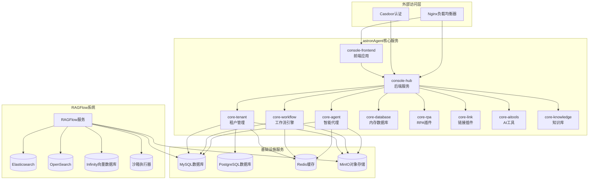

**架构图来源**
- [docker-compose.yaml](file://docker/astronAgent/docker-compose.yaml#L1-L614)
- [docker-compose-base.yml](file://docker/ragflow/docker-compose-base.yml#L1-L228)

### 服务分类

项目中的服务按功能可分为以下几类：

1. **基础设施服务**：数据库、缓存、存储
2. **核心业务服务**：智能代理、工作流、知识管理
3. **认证授权服务**：Casdoor身份认证
4. **RPA服务**：自动化机器人功能
5. **搜索服务**：Elasticsearch、OpenSearch、Infinity
6. **负载均衡**：Nginx反向代理

## astronAgent容器编排

### 主部署文件结构

astronAgent的核心部署通过`docker-compose.yaml`实现，该文件定义了完整的微服务架构。

#### 基础设施服务配置

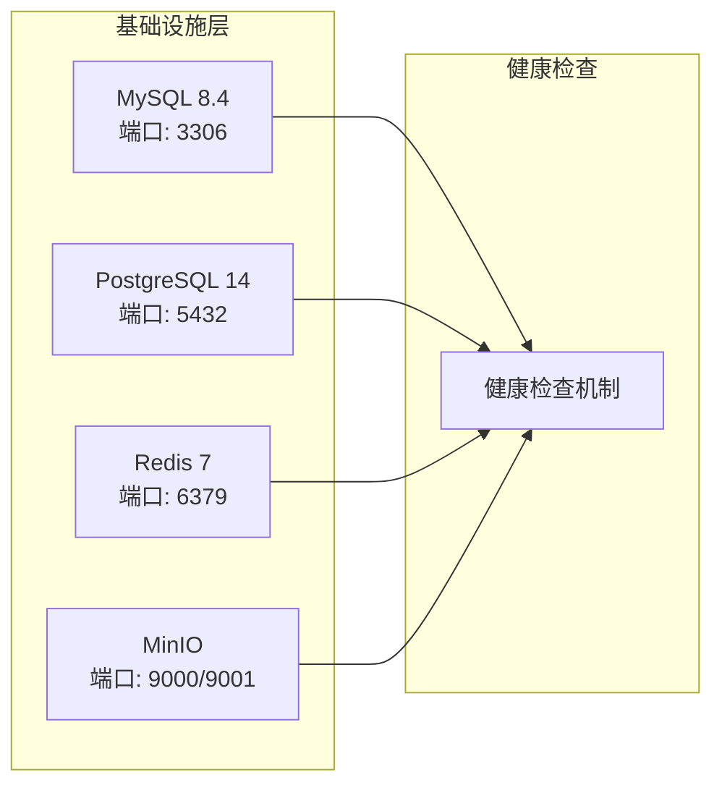

**图表来源**
- [docker-compose.yaml](file://docker/astronAgent/docker-compose.yaml#L1-L100)

#### 核心业务服务详解

##### Console前端服务
- **镜像**：ghcr.io/iflytek/astron-agent/console-frontend
- **端口**：1881（内部暴露）
- **认证配置**：支持Casdoor集成
- **网络**：astron-agent-network

##### Console Hub服务
- **镜像**：ghcr.io/iflytek/astron-agent/console-hub
- **端口**：8080（内部暴露）
- **依赖**：所有基础设施服务
- **功能**：后端API服务、认证管理

##### Core Agent服务
- **镜像**：ghcr.io/iflytek/astron-agent/core-agent
- **端口**：17870
- **核心功能**：
  - 智能代理运行
  - 工作流节点执行
  - 插件系统管理
  - 多模态交互处理

##### Core Workflow服务
- **镜像**：ghcr.io/iflytek/astron-agent/core-workflow
- **端口**：7880
- **功能**：
  - 工作流编排
  - 节点状态管理
  - 任务调度
  - 状态持久化

**章节来源**
- [docker-compose.yaml](file://docker/astronAgent/docker-compose.yaml#L200-L400)

### 服务依赖关系

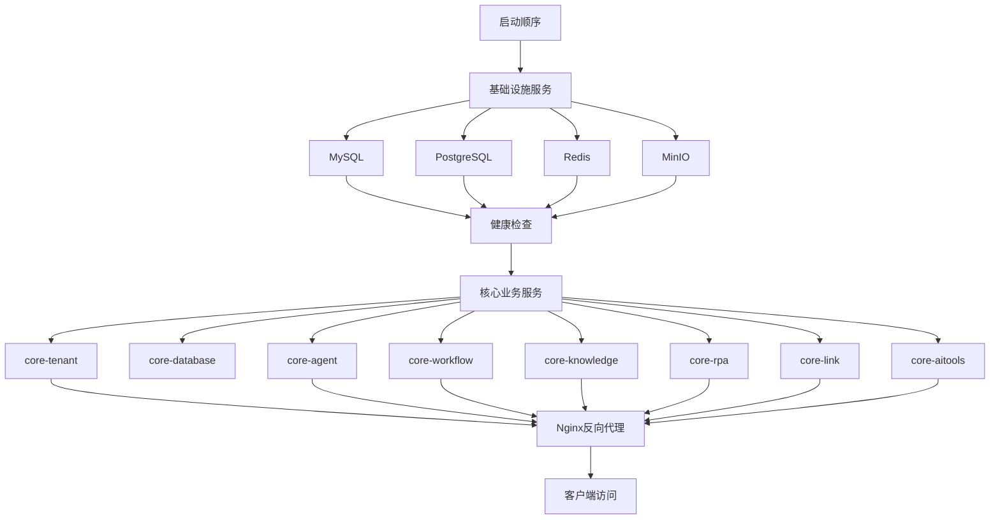

**图表来源**
- [docker-compose.yaml](file://docker/astronAgent/docker-compose.yaml#L150-L300)

### 网络配置

astronAgent使用统一的Docker网络进行服务间通信：

| 网络名称 | 驱动类型 | 用途 |
|---------|---------|------|
| astron-agent-network | bridge | 所有服务间通信 |

#### 端口映射策略

| 服务 | 内部端口 | 外部端口 | 协议 | 用途 |
|------|---------|---------|------|------|
| Nginx | 80 | ${EXPOSE_NGINX_PORT:-80} | HTTP | 反向代理入口 |
| MinIO Console | 9001 | ${EXPOSE_MINIO_CONSOLE_PORT:-9001} | HTTP | 对象存储管理界面 |
| MinIO API | 9000 | ${EXPOSE_MINIO_PORT:-9000} | HTTP | 对象存储API |
| Casdoor | 8000 | ${CASDOOR_PORT:-8000} | HTTP | 认证服务 |

**章节来源**
- [docker-compose.yaml](file://docker/astronAgent/docker-compose.yaml#L580-L614)

## RAGFlow容器编排

### 模块化设计架构

RAGFlow采用基于include的模块化设计，通过`docker-compose.yml`引入基础服务配置。

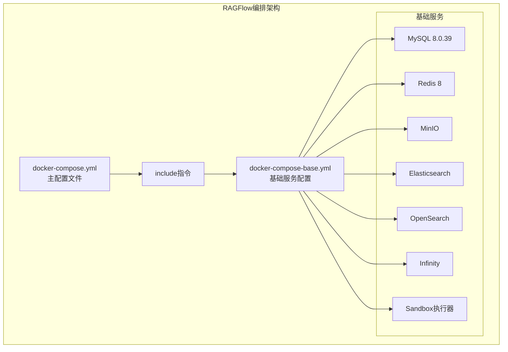

**图表来源**
- [docker-compose.yml](file://docker/ragflow/docker-compose.yml#L1-L10)
- [docker-compose-base.yml](file://docker/ragflow/docker-compose-base.yml#L1-L50)

### 支持的文档引擎

RAGFlow支持三种不同的文档搜索引擎：

| 引擎类型 | 配置文件 | 默认端口 | 特点 |
|---------|---------|---------|------|
| Elasticsearch | elasticsearch | 9200 | 传统全文搜索 |
| OpenSearch | opensearch | 9201 | Elasticsearch替代方案 |
| Infinity | infinity | 23817 | 向量数据库 |

#### Elasticsearch配置
- **版本**：8.11.3
- **内存限制**：8GB
- **安全配置**：启用SSL认证
- **磁盘水印**：低5GB，高3GB，洪水2GB

#### OpenSearch配置
- **版本**：2.19.1
- **初始密码**：从环境变量读取
- **安全插件**：启用SSL传输加密
- **集群模式**：单节点模式

#### Infinity配置
- **版本**：v0.6.0-dev5
- **协议支持**：Thrift、HTTP、PostgreSQL
- **内存限制**：无限制
- **文件描述符**：500000软限制，500000硬限制

**章节来源**
- [docker-compose-base.yml](file://docker/ragflow/docker-compose-base.yml#L1-L150)

### 环境变量管理

RAGFlow通过`.env`文件集中管理环境变量：

#### 核心配置项

| 变量名 | 默认值 | 说明 |
|--------|--------|------|
| DOC_ENGINE | elasticsearch | 文档引擎类型 |
| MEM_LIMIT | 8073741824 | 内存限制（字节） |
| MYSQL_PASSWORD | infini_rag_flow | MySQL密码 |
| MINIO_USER | rag_flow | MinIO用户名 |
| MINIO_PASSWORD | infini_rag_flow | MinIO密码 |
| REDIS_PASSWORD | infini_rag_flow | Redis密码 |

#### 性能优化配置

| 变量名 | 默认值 | 说明 |
|--------|--------|------|
| DOC_BULK_SIZE | 4 | 文档批量处理大小 |
| EMBEDDING_BATCH_SIZE | 16 | 嵌入向量化批次大小 |
| MAX_CONTENT_LENGTH | 1073741824 | 最大文件上传大小 |

**章节来源**
- [.env](file://docker/ragflow/.env#L1-L100)

### 服务配置模板

RAGFlow使用`service_conf.yaml.template`作为服务配置模板，支持环境变量替换：

#### 数据库连接配置

```yaml
mysql:
  name: '${MYSQL_DBNAME:-rag_flow}'
  user: '${MYSQL_USER:-root}'
  password: '${MYSQL_PASSWORD:-infini_rag_flow}'
  host: '${MYSQL_HOST:-mysql}'
  port: 3306
  max_connections: 900
```

#### 存储配置

```yaml
minio:
  user: '${MINIO_USER:-rag_flow}'
  password: '${MINIO_PASSWORD:-infini_rag_flow}'
  host: '${MINIO_HOST:-minio}:9000'
```

**章节来源**
- [service_conf.yaml.template](file://docker/ragflow/service_conf.yaml.template#L1-L50)

## 多环境部署配置

### 基础部署配置

#### docker-compose.yaml
最基础的部署配置，包含所有核心服务但不包含认证功能。

特点：
- 包含所有核心业务服务
- 基础基础设施服务
- 无认证集成
- 适用于开发和测试环境

#### docker-compose-with-auth.yaml
集成了Casdoor认证系统的部署配置。

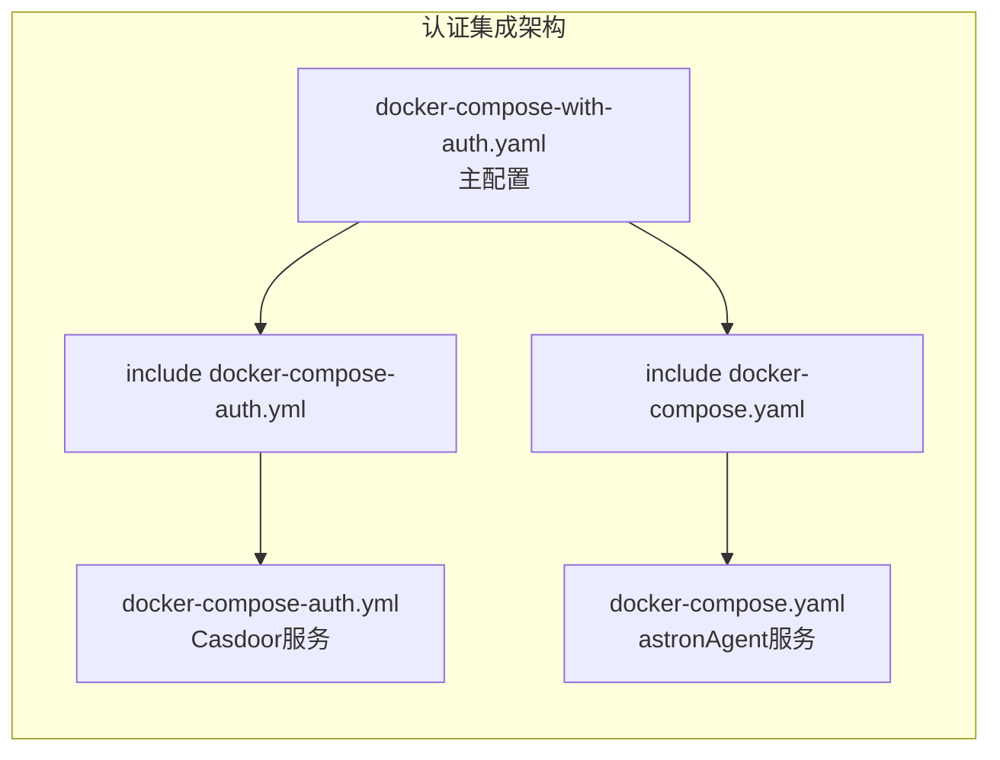

**图表来源**
- [docker-compose-with-auth.yaml](file://docker/astronAgent/docker-compose-with-auth.yaml#L1-L15)

#### docker-compose-with-auth-rpa.yaml
集成了RPA功能的完整部署配置。

特点：
- 包含astronAgent所有服务
- 集成Casdoor认证
- 包含astronRPA开源机器人系统
- 统一网络配置

**章节来源**
- [docker-compose-with-auth-rpa.yaml](file://docker/astronAgent/docker-compose-with-auth-rpa.yaml#L1-L35)

### RPA集成配置

astronRPA系统通过独立的Docker Compose配置实现：

#### RPA服务架构

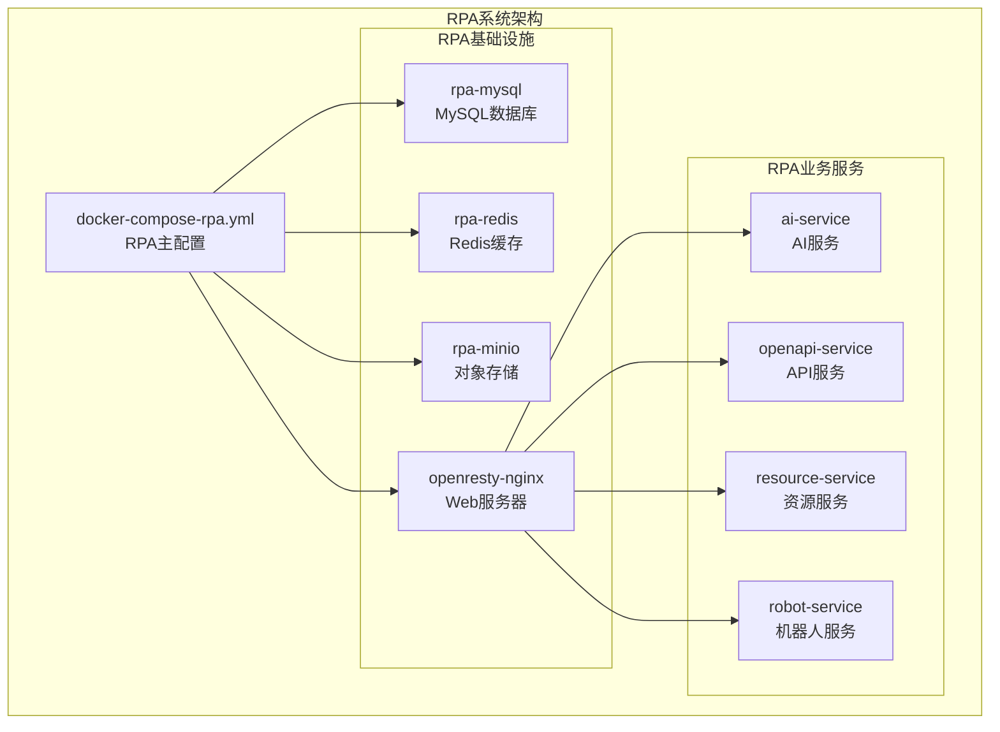

**图表来源**
- [docker-compose-rpa.yml](file://docker/astronAgent/astronRPA/docker-compose.yml#L1-L100)

#### RPA服务依赖关系

| 服务 | 依赖条件 | 说明 |
|------|---------|------|
| ai-service | rpa-mysql:service_healthy, rpa-redis:service_healthy | AI推理服务 |
| openapi-service | rpa-mysql:service_healthy, rpa-redis:service_healthy | API网关服务 |
| resource-service | rpa-mysql:service_healthy, rpa-redis:service_healthy, rpa-minio:service_healthy | 资源管理服务 |
| robot-service | rpa-mysql:service_healthy, rpa-redis:service_healthy | 机器人执行服务 |

**章节来源**
- [docker-compose-rpa.yml](file://docker/astronAgent/astronRPA/docker-compose.yml#L150-L260)

## 网络与通信机制

### astronAgent网络架构

#### 服务发现机制

astronAgent使用Docker内置的服务发现机制：

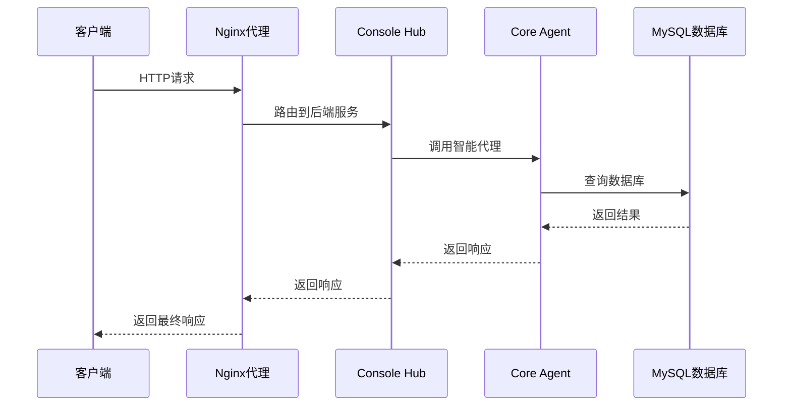

**图表来源**
- [nginx.conf](file://docker/astronAgent/nginx/nginx.conf#L30-L100)

#### 网络配置详情

| 服务 | 网络地址 | 通信方式 | 安全策略 |
|------|---------|---------|---------|
| console-frontend | console-frontend:1881 | HTTP | 无特殊要求 |
| console-hub | console-hub:8080 | HTTP | JWT认证 |
| core-agent | core-agent:17870 | HTTP/WebSocket | API密钥验证 |
| core-workflow | core-workflow:7880 | HTTP/SSE | OAuth2认证 |
| MySQL | mysql:3306 | TCP | 密码认证 |
| Redis | redis:6379 | TCP | 密码认证 |
| MinIO | minio:9000 | HTTP | 访问密钥认证 |

### RAGFlow网络配置

#### 多引擎支持网络

RAGFlow支持多种文档引擎，每种引擎都有不同的网络配置：

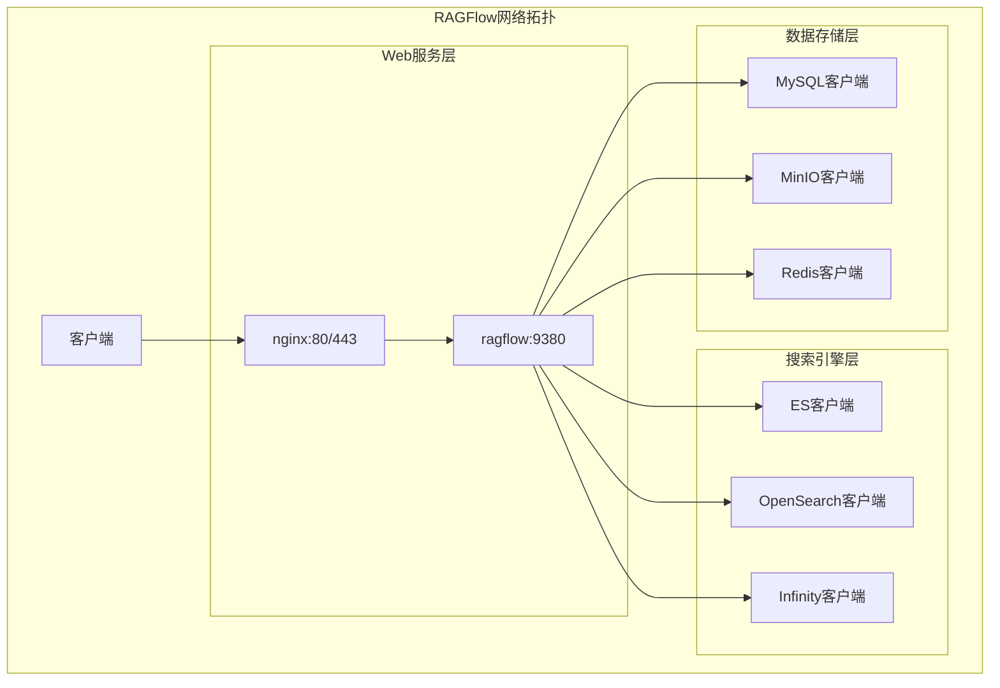

**图表来源**
- [docker-compose-base.yml](file://docker/ragflow/docker-compose-base.yml#L100-L200)

### 负载均衡配置

#### Nginx反向代理配置

astronAgent使用Nginx作为反向代理服务器：

##### 静态资源处理
- **路径匹配**：`~* \.(js\|css\|png\|jpg\|jpeg\|gif\|ico\|svg\|woff\|woff2\|ttf\|eot)$`
- **代理目标**：console-frontend:1881
- **缓存策略**：1年有效期，公共缓存

##### 实时通信处理
- **SSE路径**：`/workflow/v1/chat/completions` 和 `/console-api/chat-message/`
- **特殊配置**：
  - 禁用缓冲：`proxy_buffering off`
  - 长连接支持：`proxy_http_version 1.1`
  - 超时设置：发送和读取超时均为30分钟

##### API路由规则
- **前缀匹配**：`/console-api/` 路径转发到 console-hub:8080
- **默认代理**：其他路径默认转发到 console-frontend:1881
- **超时配置**：连接30秒，发送30秒，读取30秒

**章节来源**
- [nginx.conf](file://docker/astronAgent/nginx/nginx.conf#L40-L150)

## 数据卷与持久化

### astronAgent数据持久化策略

#### 数据卷类型

astronAgent使用Docker本地驱动的数据卷进行持久化：

| 数据卷名称 | 用途 | 持久化内容 |
|-----------|------|-----------|
| postgres_data | PostgreSQL数据 | 数据库表结构和数据 |
| mysql_data | MySQL数据 | 用户数据和配置 |
| redis_data | Redis数据 | 缓存和会话数据 |
| minio_data | MinIO数据 | 文件存储和对象数据 |
| nginx_logs | Nginx日志 | 访问和错误日志 |

#### 配置文件挂载

astronAgent将配置文件挂载到容器内：

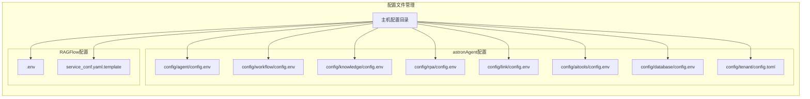

**图表来源**
- [docker-compose.yaml](file://docker/astronAgent/docker-compose.yaml#L550-L614)

### RAGFlow数据持久化

#### 多引擎数据存储

RAGFlow根据不同的文档引擎有不同的数据存储策略：

| 引擎类型 | 数据卷 | 存储内容 | 配置位置 |
|---------|-------|---------|---------|
| Elasticsearch | esdata01 | 索引数据和配置 | docker-compose-base.yml |
| OpenSearch | osdata01 | 索引数据和配置 | docker-compose-base.yml |
| Infinity | infinity_data | 向量索引和元数据 | docker-compose-base.yml |
| MySQL | mysql_data | 元数据和配置 | docker-compose-base.yml |
| MinIO | minio_data | 文档和附件 | docker-compose-base.yml |
| Redis | redis_data | 缓存数据 | docker-compose-base.yml |

#### 日志管理

RAGFlow的日志管理采用分离策略：

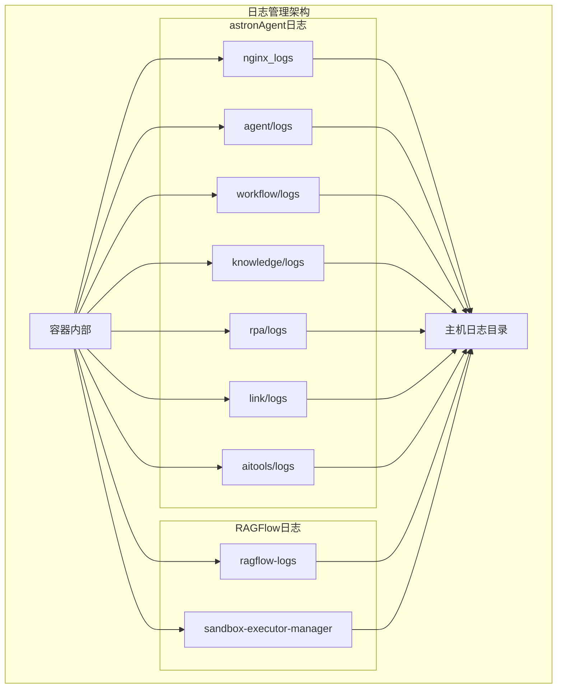

**图表来源**
- [docker-compose-base.yml](file://docker/ragflow/docker-compose-base.yml#L200-L228)

### 数据备份策略

#### 关键数据保护

为了确保数据安全，astronAgent提供了以下备份建议：

1. **数据库备份**：
   - MySQL：定期导出SQL备份
   - PostgreSQL：使用pg_dump备份
   - Redis：保存RDB快照

2. **文件存储备份**：
   - MinIO数据：定期同步到远程存储
   - 用户上传文件：建立异地备份

3. **配置文件备份**：
   - 所有.env文件
   - 所有配置模板文件
   - 自定义的Docker Compose文件

**章节来源**
- [docker-compose.yaml](file://docker/astronAgent/docker-compose.yaml#L550-L614)

## 健康检查与监控

### 健康检查机制

astronAgent为所有核心服务配置了健康检查：

#### 健康检查配置表

| 服务 | 检查命令 | 间隔 | 超时 | 重试次数 |
|------|---------|------|------|---------|
| PostgreSQL | pg_isready | 30s | 10s | 60次 |
| MySQL | mysqladmin ping | 30s | 10s | 60次 |
| Redis | redis-cli ping | 30s | 10s | 60次 |
| MinIO | curl -f | 30s | 10s | 60次 |
| Nginx | curl -f | 30s | 10s | 60次 |
| Elasticsearch | curl | 30s | 10s | 60次 |
| Kafka | netstat -tulpn | 30s | 10s | 60次 |

#### 健康检查流程

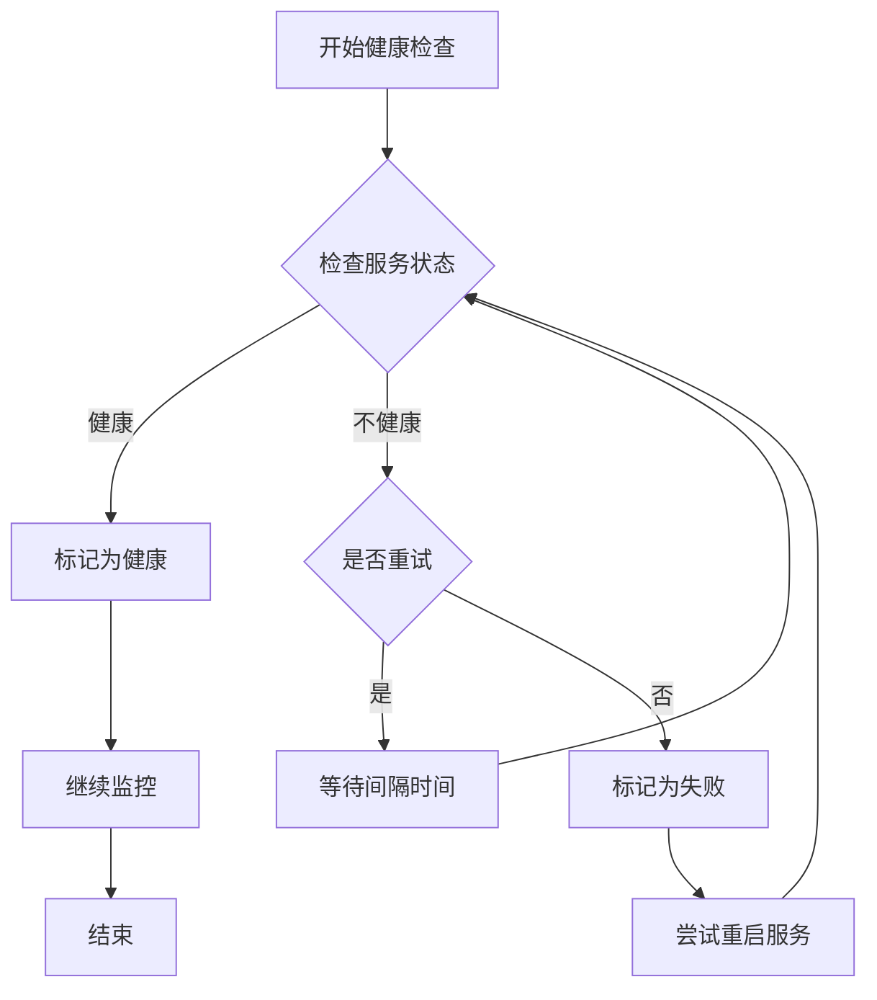

**图表来源**
- [docker-compose.yaml](file://docker/astronAgent/docker-compose.yaml#L50-L100)

### 监控指标

#### 性能监控指标

astronAgent集成了OTLP（OpenTelemetry Protocol）进行性能监控：

| 指标类型 | 配置项 | 说明 |
|---------|-------|------|
| 指标导出 | OTLP_METRIC_EXPORT_INTERVAL_MILLIS | 指标导出间隔（毫秒） |
| 追踪超时 | OTLP_TRACE_TIMEOUT | 追踪操作超时时间 |
| 队列大小 | OTLP_TRACE_MAX_QUEUE_SIZE | 追踪队列最大长度 |
| 批处理大小 | OTLP_TRACE_MAX_EXPORT_BATCH_SIZE | 批量导出最大数量 |

#### RAGFlow监控配置

RAGFlow支持多种监控方式：

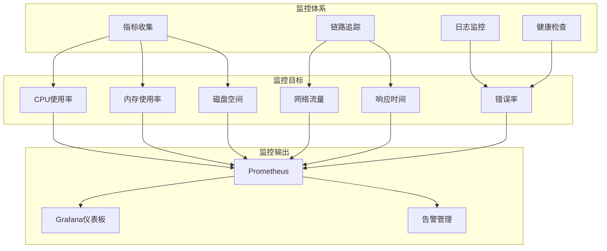

**图表来源**
- [config.env.example](file://core/agent/config.env.example#L40-L80)

### 日志管理

#### 日志级别配置

astronAgent支持多种日志级别：

| 级别 | 用途 | 示例 |
|------|------|------|
| DEBUG | 开发调试 | 详细的操作步骤 |
| INFO | 正常运行 | 服务启动、停止事件 |
| WARNING | 警告信息 | 配置问题、性能警告 |
| ERROR | 错误信息 | 异常、失败操作 |

#### 日志轮转策略

建议配置日志轮转以防止日志文件过大：

```bash
# 示例：配置rsyslog日志轮转
/var/log/astron-agent/*.log {
    daily
    rotate 30
    compress
    delaycompress
    missingok
    notifempty
    create 0644 root adm
}
```

**章节来源**
- [nginx.conf](file://docker/astronAgent/nginx/nginx.conf#L1-L20)

## 最佳实践指南

### 资源限制配置

#### 内存管理

astronAgent根据不同服务的特点设置了合理的内存限制：

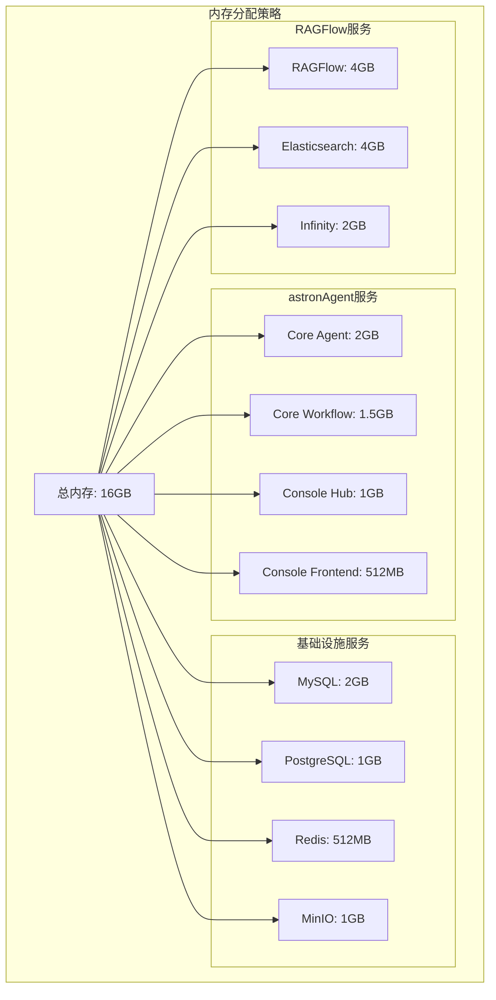

#### CPU资源分配

| 服务类别 | 推荐CPU核数 | 说明 |
|---------|------------|------|
| 数据库服务 | 2-4核 | MySQL、PostgreSQL需要较高CPU |
| 缓存服务 | 1-2核 | Redis性能敏感 |
| Web服务 | 2-4核 | Nginx和前端服务 |
| 业务服务 | 4-8核 | 智能代理和工作流引擎 |
| 搜索服务 | 4-6核 | Elasticsearch性能密集 |

### 重启策略配置

astronAgent采用不同的重启策略：

| 服务类型 | 重启策略 | 说明 |
|---------|---------|------|
| 基础设施服务 | always | 必须始终运行 |
| 业务服务 | always | 关键业务必须可用 |
| 辅助服务 | on-failure | 失败时自动重启 |
| 测试服务 | no | 不自动重启 |

### 环境变量管理

#### 安全配置原则

1. **敏感信息隔离**：
   - 将数据库密码、API密钥等敏感信息放在单独的.env文件中
   - 设置适当的文件权限（600）
   - 不要将.env文件提交到版本控制系统

2. **环境区分**：
   - 开发环境：使用简单密码和调试配置
   - 生产环境：使用强密码和安全配置
   - 测试环境：模拟生产环境配置

3. **配置验证**：
   - 在启动前验证所有必需的环境变量
   - 提供默认值避免配置遗漏
   - 使用配置文件模板确保一致性

#### 配置文件组织

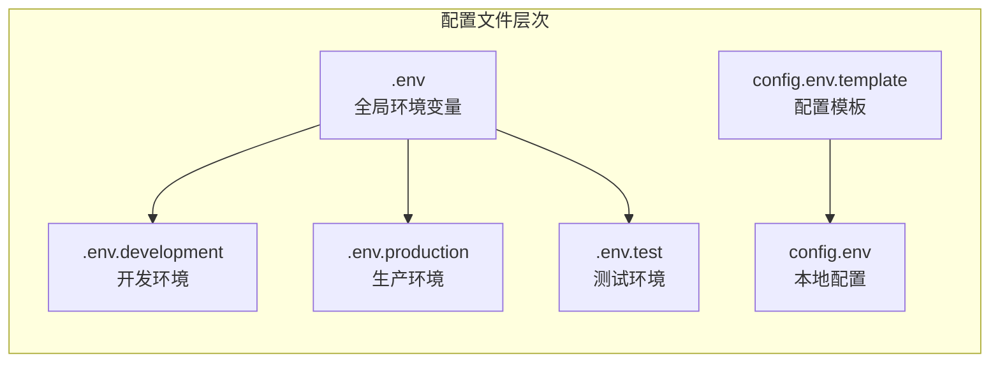

**图表来源**
- [.env](file://docker/ragflow/.env#L1-L50)

### 网络安全配置

#### 网络隔离

astronAgent使用Docker网络进行服务隔离：

1. **专用网络**：每个部署使用独立的Docker网络
2. **端口限制**：只开放必要的端口
3. **防火墙规则**：在主机层面添加额外的安全层

#### 通信加密

| 服务 | 加密方式 | 配置要求 |
|------|---------|---------|
| 数据库连接 | SSL/TLS | 启用SSL证书验证 |
| Redis连接 | 密码认证 | 强密码策略 |
| MinIO通信 | HTTPS | 证书配置 |
| API调用 | JWT/OAuth2 | 令牌验证 |

### 性能优化建议

#### 数据库优化

1. **连接池配置**：
   - MySQL最大连接数：50
   - PostgreSQL最大连接数：20
   - Redis最大连接数：10

2. **查询优化**：
   - 启用慢查询日志
   - 定期分析查询计划
   - 添加必要的索引

#### 缓存策略

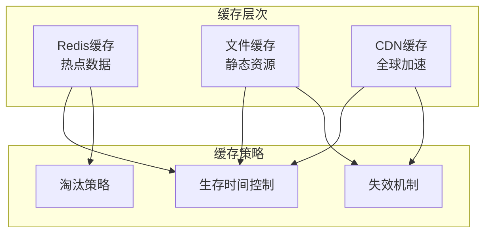

#### 并发处理

| 服务 | 工作进程数 | 连接池大小 | 说明 |
|------|-----------|-----------|------|
| Core Agent | 4 | 10 | 处理并发请求 |
| Core Workflow | 2 | 5 | 工作流执行 |
| Console Hub | 2 | 5 | API服务 |
| Nginx | 4 | 100 | 反向代理 |

**章节来源**
- [config.env.example](file://core/agent/config.env.example#L20-L60)

## 故障排除

### 常见问题诊断

#### 服务启动失败

**症状**：容器无法正常启动或频繁重启

**排查步骤**：
1. 检查容器日志：
   ```bash
   docker logs <container_name>
   ```
2. 验证资源配置：
   ```bash
   docker inspect <container_name>
   ```
3. 检查端口冲突：
   ```bash
   netstat -tulpn | grep <port>
   ```

**解决方案**：
- 检查环境变量配置
- 验证数据卷权限
- 确认网络连通性

#### 数据库连接问题

**症状**：服务报告数据库连接失败

**排查流程**：
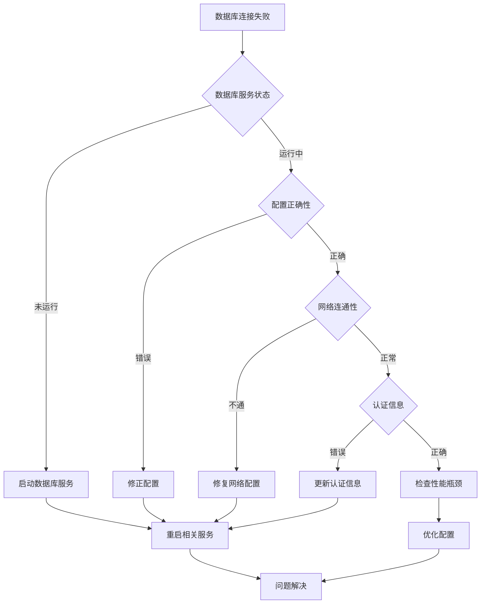

#### 性能问题诊断

**内存不足**：
- 监控容器内存使用率
- 调整JVM堆大小
- 优化查询和缓存策略

**CPU瓶颈**：
- 分析服务CPU使用情况
- 调整并发参数
- 考虑水平扩展

**磁盘I/O问题**：
- 检查磁盘空间使用
- 优化数据库索引
- 调整日志级别

### 监控告警配置

#### 关键指标监控

| 指标类型 | 告警阈值 | 处理建议 |
|---------|---------|---------|
| CPU使用率 | >80% | 增加资源或优化代码 |
| 内存使用率 | >85% | 清理缓存或扩容 |
| 磁盘使用率 | >90% | 清理日志或扩容 |
| 响应时间 | >2秒 | 检查数据库和网络 |
| 错误率 | >5% | 查看错误日志 |

#### 告警通知机制

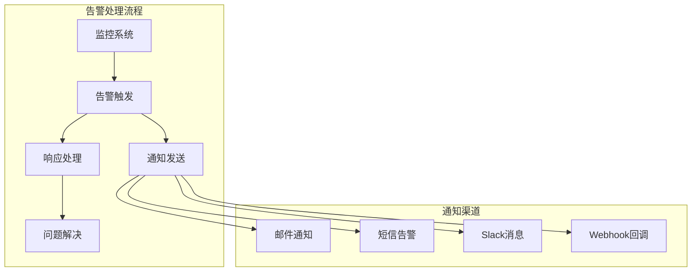

### 备份恢复策略

#### 自动化备份

1. **数据库备份**：
   ```bash
   # MySQL备份
   mysqldump -h mysql -u root -p database > backup.sql
   
   # PostgreSQL备份
   pg_dump -h postgres -U postgres database > backup.sql
   ```

2. **文件备份**：
   ```bash
   # MinIO数据备份
   rsync -av /var/lib/docker/volumes/minio_data/_data/ backup/
   ```

3. **配置备份**：
   ```bash
   # 配置文件备份
   tar czf config-backup.tar.gz docker/config/
   ```

#### 灾难恢复

**恢复流程**：
1. 停止所有服务
2. 恢复数据卷
3. 启动基础设施服务
4. 启动业务服务
5. 验证服务状态

**验证清单**：
- 数据完整性检查
- 服务功能测试
- 性能基准测试
- 安全配置验证

**章节来源**
- [docker-compose.yaml](file://docker/astronAgent/docker-compose.yaml#L50-L100)

## 结论

astron-agent项目的容器编排方案展现了现代微服务架构的最佳实践。通过Docker Compose的模块化设计，项目实现了：

1. **灵活的部署配置**：支持从基础部署到完整集成的各种场景
2. **强大的扩展能力**：通过include机制轻松添加新服务
3. **完善的监控体系**：健康检查和性能监控确保系统稳定
4. **安全的运维实践**：环境变量管理和网络安全配置
5. **高效的资源利用**：合理的资源分配和性能优化

这种设计不仅满足了当前的功能需求，还为未来的扩展和演进奠定了坚实的基础。无论是开发测试还是生产部署，都能找到合适的配置方案，真正实现了"一次配置，多处使用"的目标。