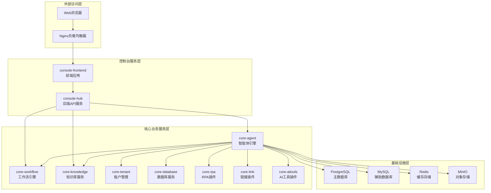
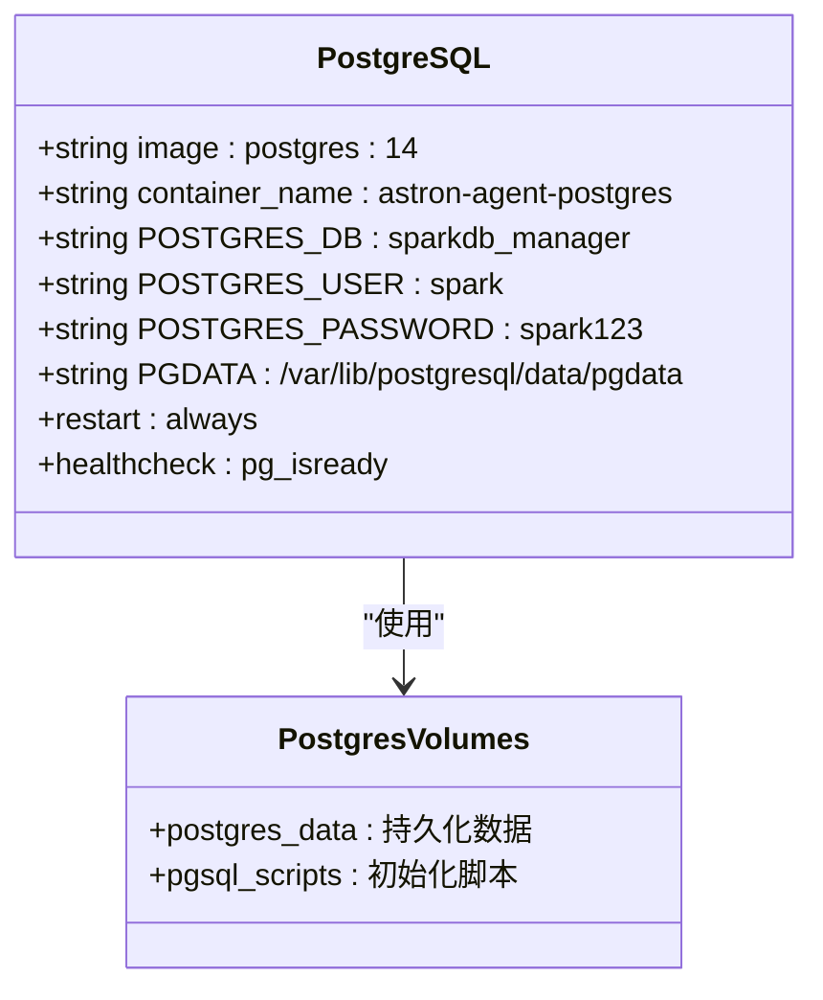
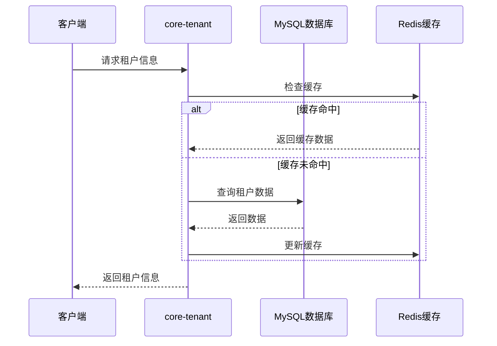
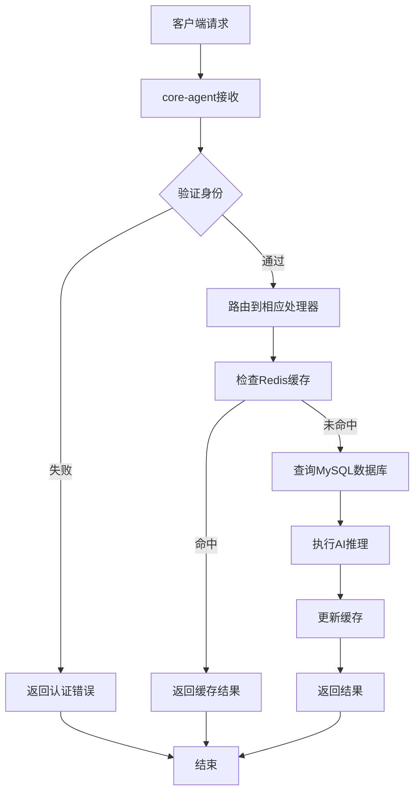
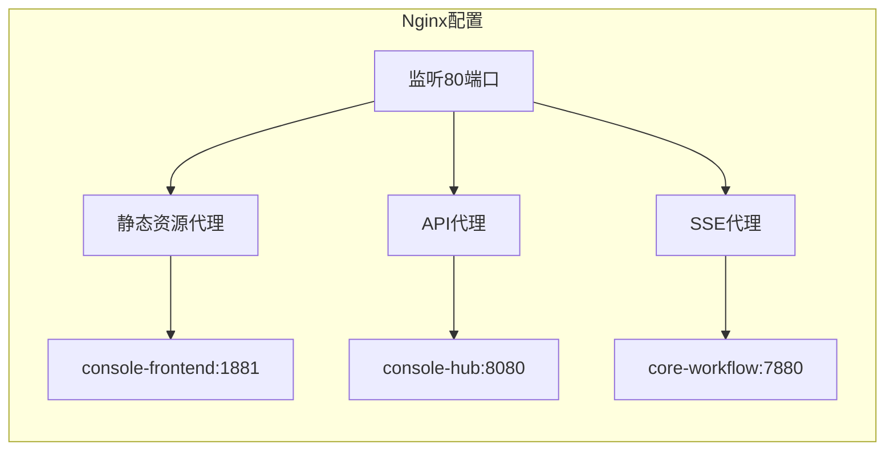
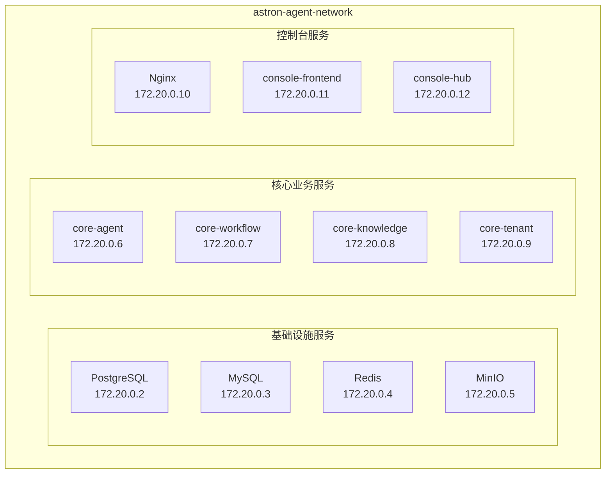
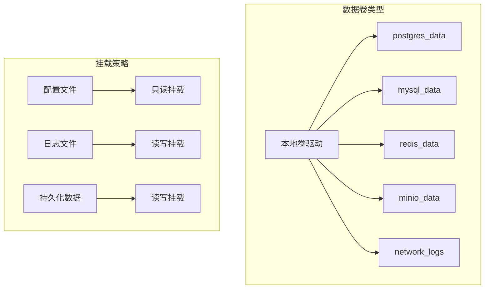
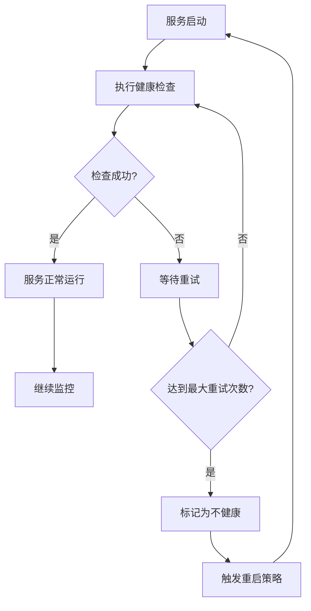
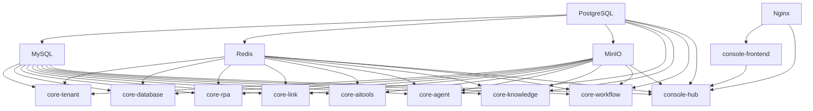
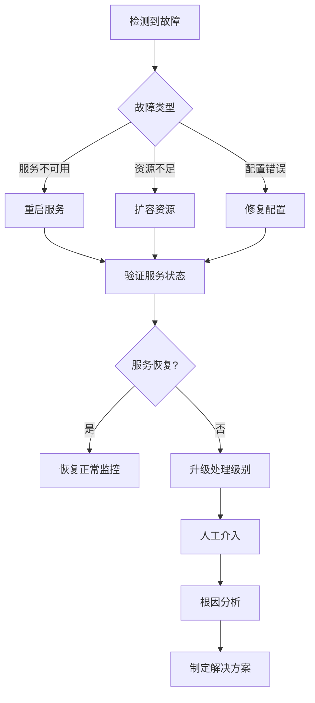

# 核心编排配置

<cite>
**本文档中引用的文件**
- [docker-compose.yaml](file://docker/astronAgent/docker-compose.yaml)
- [console/frontend/Dockerfile](file://console/frontend/Dockerfile)
- [console/backend/hub/Dockerfile](file://console/backend/hub/Dockerfile)
- [core/agent/Dockerfile](file://core/agent/Dockerfile)
- [core/workflow/Dockerfile](file://core/workflow/Dockerfile)
- [nginx/nginx.conf](file://docker/astronAgent/nginx/nginx.conf)
- [config/tenant/config.toml](file://docker/astronAgent/config/tenant/config.toml)
- [docker-compose-auth.yml](file://docker/astronAgent/docker-compose-auth.yml)
- [Makefile](file://Makefile)
</cite>

## 目录
1. [项目概述](#项目概述)
2. [架构总览](#架构总览)
3. [基础设施服务](#基础设施服务)
4. [核心业务服务](#核心业务服务)
5. [控制台服务](#控制台服务)
6. [网络配置](#网络配置)
7. [数据卷管理](#数据卷管理)
8. [健康检查与重启策略](#健康检查与重启策略)
9. [环境变量配置](#环境变量配置)
10. [启动顺序与依赖管理](#启动顺序与依赖管理)
11. [性能优化建议](#性能优化建议)
12. [故障排除指南](#故障排除指南)

## 项目概述

astron-agent是一个基于微服务架构的企业级AI智能体平台，采用Docker Compose进行容器编排。该系统包含多个相互协作的服务，通过统一的网络配置实现服务发现和通信。

### 主要特性
- **模块化设计**：每个服务独立部署，职责明确
- **高可用性**：完善的健康检查和自动重启机制
- **可扩展性**：支持水平扩展和负载均衡
- **安全性**：集成认证授权和数据加密
- **可观测性**：完整的监控和日志记录体系

## 架构总览



**图表来源**
- [docker-compose.yaml](file://docker/astronAgent/docker-compose.yaml#L1-L614)

## 基础设施服务

### PostgreSQL数据库服务

PostgreSQL作为主数据库，负责存储核心业务数据和元数据。



**图表来源**
- [docker-compose.yaml](file://docker/astronAgent/docker-compose.yaml#L5-L25)

#### 关键配置参数

| 参数 | 值 | 说明 |
|------|-----|------|
| 镜像版本 | postgres:14 | 使用PostgreSQL 14稳定版 |
| 容器名称 | astron-agent-postgres | 容器标识符 |
| 数据库名 | sparkdb_manager | 默认数据库名称 |
| 用户名 | ${POSTGRES_USER:-spark} | 默认用户，支持环境变量覆盖 |
| 密码 | ${POSTGRES_PASSWORD:-spark123} | 默认密码，支持环境变量覆盖 |
| 数据目录 | /var/lib/postgresql/data | 数据存储路径 |

#### 健康检查配置
- **检查命令**: `pg_isready -U ${POSTGRES_USER:-spark} -d sparkdb_manager`
- **检查间隔**: ${HEALTH_CHECK_INTERVAL:-30s}
- **超时时间**: ${HEALTH_CHECK_TIMEOUT:-10s}
- **重试次数**: ${HEALTH_CHECK_RETRIES:-60}

**章节来源**
- [docker-compose.yaml](file://docker/astronAgent/docker-compose.yaml#L5-L25)

### MySQL数据库服务

MySQL作为辅助数据库，主要用于存储租户配置和临时数据。

#### 关键配置参数

| 参数 | 值 | 说明 |
|------|-----|------|
| 镜像版本 | mysql:8.4 | 使用MySQL 8.4最新版本 |
| 容器名称 | astron-agent-mysql | 容器标识符 |
| Root密码 | ${MYSQL_ROOT_PASSWORD:-root123} | 默认Root密码 |
| 数据目录 | /var/lib/mysql | 数据存储路径 |

#### 健康检查配置
- **检查命令**: `mysqladmin ping -h localhost`
- **检查间隔**: ${HEALTH_CHECK_INTERVAL:-30s}
- **超时时间**: ${HEALTH_CHECK_TIMEOUT:-10s}
- **重试次数**: ${HEALTH_CHECK_RETRIES:-60}

**章节来源**
- [docker-compose.yaml](file://docker/astronAgent/docker-compose.yaml#L27-L42)

### Redis缓存服务

Redis提供高性能的内存缓存和会话存储功能。

#### 关键配置参数

| 参数 | 值 | 说明 |
|------|-----|------|
| 镜像版本 | redis:7 | 使用Redis 7最新版本 |
| 容器名称 | astron-agent-redis | 容器标识符 |
| 数据目录 | /data | 数据存储路径 |
| 认证密码 | ${REDIS_PASSWORD} | 可选密码认证 |

#### 健康检查配置
- **检查命令**: `redis-cli ${REDIS_PASSWORD:+-a "$REDIS_PASSWORD"} ping | grep PONG`
- **检查间隔**: ${HEALTH_CHECK_INTERVAL:-30s}
- **超时时间**: ${HEALTH_CHECK_TIMEOUT:-10s}
- **重试次数**: ${HEALTH_CHECK_RETRIES:-60}

**章节来源**
- [docker-compose.yaml](file://docker/astronAgent/docker-compose.yaml#L44-L58)

### MinIO对象存储服务

MinIO提供兼容S3的对象存储服务，用于存储文件、图片和多媒体内容。

#### 关键配置参数

| 参数 | 值 | 说明 |
|------|-----|------|
| 镜像版本 | minio/minio:RELEASE.2025-07-23T15-54-02Z | 最新版本 |
| 容器名称 | astron-agent-minio | 容器标识符 |
| 端口映射 | ${EXPOSE_MINIO_PORT:-9000}:9000 | API端口 |
| 控制台端口 | ${EXPOSE_MINIO_CONSOLE_PORT:-9001}:9001 | Web控制台端口 |
| 用户名 | ${MINIO_ROOT_USER:-minioadmin} | 默认管理员用户名 |
| 密码 | ${MINIO_ROOT_PASSWORD:-minioadmin123} | 默认管理员密码 |

#### 健康检查配置
- **检查命令**: `curl -f http://localhost:9000/minio/health/live`
- **检查间隔**: ${HEALTH_CHECK_INTERVAL:-30s}
- **超时时间**: ${HEALTH_CHECK_TIMEOUT:-10s}
- **重试次数**: ${HEALTH_CHECK_RETRIES:-60}

**章节来源**
- [docker-compose.yaml](file://docker/astronAgent/docker-compose.yaml#L88-L108)

## 核心业务服务

### 租户管理服务 (core-tenant)

租户管理服务负责多租户架构下的用户、组织和权限管理。



**图表来源**
- [docker-compose.yaml](file://docker/astronAgent/docker-compose.yaml#L110-L135)

#### 关键配置参数

| 参数 | 值 | 说明 |
|------|-----|------|
| 镜像版本 | ghcr.io/iflytek/astron-agent/core-tenant:${ASTRON_AGENT_VERSION:-latest} | 支持版本标签 |
| 服务端口 | ${CORE_TENANT_PORT:-5052} | 默认端口5052 |
| 数据库类型 | ${DATABASE_DB_TYPE:-mysql} | 支持mysql和postgresql |
| 并发连接数 | ${DATABASE_MAX_OPEN_CONNS:-5} | 最大开放连接数 |
| 日志路径 | ${LOG_PATH:-log.txt} | 日志文件路径 |

#### 依赖关系
- **前置条件**: PostgreSQL、MySQL、Redis、MinIO服务健康就绪
- **健康检查**: 依赖服务健康检查机制

**章节来源**
- [docker-compose.yaml](file://docker/astronAgent/docker-compose.yaml#L110-L135)

### 数据库服务 (core-database)

数据库服务提供内存数据库操作能力，支持复杂的数据查询和分析。

#### 关键配置参数

| 参数 | 值 | 说明 |
|------|-----|------|
| 镜像版本 | ghcr.io/iflytek/astron-agent/core-database:${ASTRON_AGENT_VERSION:-latest} | 支持版本标签 |
| 服务端口 | ${CORE_DATABASE_PORT:-7990} | 默认端口7990 |
| PostgreSQL主机 | ${POSTGRES_HOST:-postgres} | PostgreSQL主机地址 |
| PostgreSQL端口 | ${POSTGRES_PORT:-5432} | PostgreSQL端口 |
| OTLP端点 | ${OTLP_ENDPOINT:-127.0.0.1:4317} | 分布式追踪端点 |

**章节来源**
- [docker-compose.yaml](file://docker/astronAgent/docker-compose.yaml#L137-L158)

### RPA插件服务 (core-rpa)

RPA插件服务提供机器人流程自动化功能，支持企业级自动化任务。

#### 关键配置参数

| 参数 | 值 | 说明 |
|------|-----|------|
| 镜像版本 | ghcr.io/iflytek/astron-agent/core-rpa:${ASTRON_AGENT_VERSION:-latest} | 支持版本标签 |
| 服务端口 | ${CORE_RPA_PORT:-17198} | 默认端口17198 |
| 小乌RPA任务创建URL | ${XIAOWU_RPA_TASK_CREATE_URL} | RPA任务创建接口 |
| 小乌RPA任务查询URL | ${XIAOWU_RPA_TASK_QUERY_URL} | RPA任务查询接口 |

**章节来源**
- [docker-compose.yaml](file://docker/astronAgent/docker-compose.yaml#L160-L182)

### 链接插件服务 (core-link)

链接插件服务提供外部系统集成能力，支持多种数据源连接。

#### 关键配置参数

| 参数 | 值 | 说明 |
|------|-----|------|
| 镜像版本 | ghcr.io/iflytek/astron-agent/core-link:${ASTRON_AGENT_VERSION:-latest} | 支持版本标签 |
| 服务端口 | ${CORE_LINK_PORT:-18888} | 默认端口18888 |
| MySQL主机 | ${MYSQL_HOST:-mysql} | MySQL主机地址 |
| MySQL数据库 | ${LINK_MYSQL_DB:-spark-link} | 链接专用数据库 |
| Redis集群 | ${REDIS_IS_CLUSTER:-false} | 是否使用Redis集群 |

**章节来源**
- [docker-compose.yaml](file://docker/astronAgent/docker-compose.yaml#L184-L206)

### AI工具插件服务 (core-aitools)

AI工具插件服务提供各种AI能力集成，包括语音识别、图像处理等。

#### 关键配置参数

| 参数 | 值 | 说明 |
|------|-----|------|
| 镜像版本 | ghcr.io/iflytek/astron-agent/core-aitools:${ASTRON_AGENT_VERSION:-latest} | 支持版本标签 |
| 服务端口 | ${CORE_AITOOLS_PORT:-18668} | 默认端口18668 |
| 对象存储类型 | ${OSS_TYPE:-s3} | 支持S3兼容存储 |
| AI平台应用ID | ${PLATFORM_APP_ID} | 平台应用标识 |
| AI平台API密钥 | ${PLATFORM_API_KEY} | 平台API密钥 |

**章节来源**
- [docker-compose.yaml](file://docker/astronAgent/docker-compose.yaml#L208-L230)

### 智能体引擎服务 (core-agent)

智能体引擎是整个系统的核心，负责执行AI对话和智能决策。



**图表来源**
- [docker-compose.yaml](file://docker/astronAgent/docker-compose.yaml#L232-L320)

#### 关键配置参数

| 参数类别 | 参数名 | 值 | 说明 |
|----------|--------|-----|------|
| 服务配置 | SERVICE_PORT | ${CORE_AGENT_PORT:-17870} | 默认端口17870 |
| 服务配置 | SERVICE_WORKERS | ${SERVICE_WORKERS:-1} | 工作进程数 |
| Redis配置 | REDIS_ADDR | ${REDIS_ADDR:-redis:6379} | Redis地址 |
| MySQL配置 | MYSQL_HOST | ${MYSQL_HOST:-mysql} | MySQL主机 |
| MySQL配置 | MYSQL_DB | ${AGENT_MYSQL_DB:-agent} | 智能体专用数据库 |
| OTLP配置 | OTLP_ENDPOINT | ${OTLP_ENDPOINT:-127.0.0.1:4317} | 分布式追踪端点 |
| Kafka配置 | KAFKA_ENABLE | ${KAFKA_ENABLE:-0} | 是否启用消息队列 |
| 外部服务 | GET_WORKFLOWS_URL | ${GET_WORKFLOWS_URL:-http://core-workflow:7880/sparkflow/v1/protocol/get} | 工作流服务地址 |

#### 服务发现配置

智能体引擎通过环境变量配置与其他服务的通信地址：

- **工作流服务**: `http://core-workflow:${CORE_WORKFLOW_PORT}`
- **知识库服务**: `http://core-knowledge:${CORE_KNOWLEDGE_PORT}`
- **链接服务**: `http://core-link:${CORE_LINK_PORT}`
- **租户服务**: `http://core-tenant:${CORE_TENANT_PORT}`

**章节来源**
- [docker-compose.yaml](file://docker/astronAgent/docker-compose.yaml#L232-L320)

### 知识库服务 (core-knowledge)

知识库服务提供向量检索和语义搜索能力，支持RAG（检索增强生成）功能。

#### 关键配置参数

| 参数 | 值 | 说明 |
|------|-----|------|
| 镜像版本 | ghcr.io/iflytek/astron-agent/core-knowledge:${ASTRON_AGENT_VERSION:-latest} | 支持版本标签 |
| 服务端口 | ${CORE_KNOWLEDGE_PORT:-20010} | 默认端口20010 |
| RAGFlow基础URL | ${RAGFLOW_BASE_URL} | RAGFlow服务地址 |
| 星火大模型数据集ID | ${XINGHUO_DATASET_ID} | 星火数据集标识 |
| 超时时间 | ${RAGFLOW_TIMEOUT:-60} | 请求超时时间 |

**章节来源**
- [docker-compose.yaml](file://docker/astronAgent/docker-compose.yaml#L322-L344)

### 工作流服务 (core-workflow)

工作流服务负责编排复杂的业务流程，支持可视化工作流设计和执行。

#### 关键配置参数

| 参数类别 | 参数名 | 值 | 说明 |
|----------|--------|-----|------|
| 服务配置 | RUNTIME_ENV | ${RUNTIME_ENV:-dev} | 运行环境 |
| 服务配置 | SERVICE_PORT | ${CORE_WORKFLOW_PORT:-7880} | 默认端口7880 |
| 数据库配置 | MYSQL_HOST | ${MYSQL_HOST:-mysql} | MySQL主机 |
| 数据库配置 | MYSQL_DB | ${WORKFLOW_MYSQL_DB:-workflow} | 工作流专用数据库 |
| 缓存配置 | REDIS_EXPIRE | ${REDIS_EXPIRE:-3600} | 缓存过期时间 |
| 对象存储 | OSS_TYPE | ${OSS_TYPE:-s3} | 存储类型 |
| Kafka配置 | KAFKA_TOPIC | ${WORKFLOW_KAFKA_TOPIC:-spark-agent-builder} | 消息主题 |

#### 服务间依赖

工作流服务依赖以下服务：
- **知识库服务**: `${KNOWLEDGE_BASE_URL:-http://core-knowledge:${CORE_KNOWLEDGE_PORT}}`
- **插件服务**: `${PLUGIN_BASE_URL:-http://core-link:${CORE_LINK_PORT}}`
- **租户服务**: `${APP_MANAGE_PLAT_BASE_URL:-http://core-tenant:${CORE_TENANT_PORT}}`
- **智能体服务**: `${AGENT_BASE_URL:-http://core-agent:${CORE_AGENT_PORT}}`

**章节来源**
- [docker-compose.yaml](file://docker/astronAgent/docker-compose.yaml#L346-L420)

## 控制台服务

### Nginx反向代理服务

Nginx作为系统的统一入口，提供负载均衡、SSL终止和静态资源服务。



**图表来源**
- [nginx/nginx.conf](file://docker/astronAgent/nginx/nginx.conf#L30-L149)

#### 关键配置参数

| 参数 | 值 | 说明 |
|------|-----|------|
| 镜像版本 | nginx:1.25-alpine | 轻量级Alpine Linux版本 |
| 容器名称 | astron-agent-nginx | 容器标识符 |
| 端口映射 | ${EXPOSE_NGINX_PORT:-80}:80 | 默认HTTP端口 |
| 配置文件 | ./nginx/nginx.conf | Nginx配置文件路径 |

#### 代理配置详解

1. **静态资源代理**
   - 路径匹配: `~* \.(js\|css\|png\|jpg\|jpeg\|gif\|ico\|svg\|woff\|woff2\|ttf\|eot)$`
   - 后端服务: `http://console-frontend:1881`
   - 缓存策略: 1年有效期

2. **SSE代理配置**
   - 路径: `/workflow/v1/chat/completions`
   - 特殊设置: `proxy_buffering off`、长连接超时30分钟
   - 用途: 实时聊天和工作流执行状态推送

3. **API代理配置**
   - 路径: `/console-api/`
   - 后端服务: `http://console-hub:8080/`
   - 超时设置: 30秒连接/发送/读取超时

**章节来源**
- [docker-compose.yaml](file://docker/astronAgent/docker-compose.yaml#L422-L445)
- [nginx/nginx.conf](file://docker/astronAgent/nginx/nginx.conf#L30-L149)

### 控制台前端服务 (console-frontend)

前端服务基于React技术栈，提供现代化的用户界面。

#### 关键配置参数

| 参数 | 值 | 说明 |
|------|-----|------|
| 镜像版本 | ghcr.io/iflytek/astron-agent/console-frontend:${ASTRON_AGENT_VERSION:-latest} | 支持版本标签 |
| 容器名称 | astron-agent-console-frontend | 容器标识符 |
| 运行端口 | 1881 | 内部服务端口 |
| 环境变量 | CONSOLE_CASDOOR_* | Casdoor认证相关配置 |

#### 构建流程

前端服务采用多阶段构建：
1. **构建阶段**: 使用Node.js 18 Alpine镜像编译React应用
2. **运行阶段**: 使用Nginx 1.15 Alpine镜像提供静态服务
3. **优化配置**: 支持Gzip压缩、长期缓存和安全头设置

**章节来源**
- [docker-compose.yaml](file://docker/astronAgent/docker-compose.yaml#L447-L460)
- [console/frontend/Dockerfile](file://console/frontend/Dockerfile#L1-L81)

### 控制台后端服务 (console-hub)

后端服务基于Java Spring Boot框架，提供RESTful API和业务逻辑处理。

#### 关键配置参数

| 参数类别 | 参数名 | 值 | 说明 |
|----------|--------|-----|------|
| 服务配置 | CONSOLE_DOMAIN | ${CONSOLE_DOMAIN:-https://your.deployment.domain} | 控制台域名 |
| 数据库配置 | MYSQL_URL | ${MYSQL_URL:-jdbc:mysql://mysql:3306/astron_console} | MySQL连接字符串 |
| 缓存配置 | REDIS_DATABASE_CONSOLE | ${REDIS_DATABASE_CONSOLE:-0} | Redis数据库索引 |
| 对象存储 | OSS_BUCKET_CONSOLE | ${OSS_BUCKET_CONSOLE:-console} | 控制台专用存储桶 |

#### JVM优化参数

后端服务使用优化的JVM参数：
- `-XX:+UseContainerSupport`: 容器感知支持
- `-XX:MaxRAMPercentage=75.0`: 最大内存使用率75%
- `-XX:+UseG1GC`: 启用G1垃圾回收器
- `-XX:+UseStringDeduplication`: 字符串去重

**章节来源**
- [docker-compose.yaml](file://docker/astronAgent/docker-compose.yaml#L462-L580)
- [console/backend/hub/Dockerfile](file://console/backend/hub/Dockerfile#L1-L40)

## 网络配置

### 自定义桥接网络

系统使用自定义的`astron-agent-network`桥接网络，实现服务间的隔离和通信。



**图表来源**
- [docker-compose.yaml](file://docker/astronAgent/docker-compose.yaml#L582-L585)

#### 网络特性

1. **服务发现**: 容器可通过服务名称直接访问其他服务
2. **隔离性**: 不同服务组之间网络隔离
3. **可扩展性**: 支持动态添加新服务
4. **安全性**: 内网访问限制，无需暴露外部端口

#### 服务间通信示例

- **智能体引擎**访问工作流服务: `http://core-workflow:7880`
- **控制台后端**访问数据库: `jdbc:mysql://mysql:3306/astron_console`
- **知识库服务**访问MinIO: `http://minio:9000`

**章节来源**
- [docker-compose.yaml](file://docker/astronAgent/docker-compose.yaml#L582-L585)

## 数据卷管理

### 卷驱动类型

系统使用本地卷驱动，确保数据持久化和跨容器共享。



**图表来源**
- [docker-compose.yaml](file://docker/astronAgent/docker-compose.yaml#L587-L614)

#### 卷配置表

| 卷名称 | 驱动类型 | 用途 | 挂载策略 |
|--------|----------|------|----------|
| postgres_data | local | PostgreSQL数据持久化 | 读写 |
| mysql_data | local | MySQL数据持久化 | 读写 |
| redis_data | local | Redis数据持久化 | 读写 |
| minio_data | local | MinIO对象存储 | 读写 |
| nginx_logs | local | Nginx访问日志 | 读写 |
| casdoor-logs | local | Casdoor认证日志 | 读写 |

#### 配置文件挂载

部分服务需要挂载配置文件：

1. **租户服务**:
   - `./config/tenant/logs:/opt/tenant/logs`
   - `./config/tenant/config.toml:/opt/tenant/config/config.toml`

2. **数据库服务**:
   - `./config/database/config.env:/opt/core/memory/database/config.env`
   - `./config/database/logs/:/opt/core/memory/database/logs`

3. **控制台服务**:
   - `./config/tenant/config.toml:/opt/tenant/config/config.toml`

**章节来源**
- [docker-compose.yaml](file://docker/astronAgent/docker-compose.yaml#L587-L614)

## 健康检查与重启策略

### 健康检查机制

所有服务都配置了健康检查，确保服务可用性和自动恢复。



#### 健康检查配置表

| 服务 | 检查命令 | 间隔 | 超时 | 重试次数 |
|------|----------|------|------|----------|
| PostgreSQL | `pg_isready -U ${POSTGRES_USER:-spark} -d sparkdb_manager` | 30s | 10s | 60次 |
| MySQL | `mysqladmin ping -h localhost` | 30s | 10s | 60次 |
| Redis | `redis-cli ${REDIS_PASSWORD:+-a "$REDIS_PASSWORD"} ping \| grep PONG` | 30s | 10s | 60次 |
| MinIO | `curl -f http://localhost:9000/minio/health/live` | 30s | 10s | 60次 |
| Nginx | `curl -f http://localhost/nginx-health` | 30s | 10s | 60次 |

#### 重启策略

所有服务都配置了`always`重启策略，确保服务异常退出时自动恢复：

```yaml
restart: always
```

这种策略适用于：
- **关键业务服务**: core-agent、core-workflow等
- **基础设施服务**: PostgreSQL、MySQL、Redis等
- **控制台服务**: console-frontend、console-hub等

**章节来源**
- [docker-compose.yaml](file://docker/astronAgent/docker-compose.yaml#L20-L25)
- [docker-compose.yaml](file://docker/astronAgent/docker-compose.yaml#L44-L58)
- [docker-compose.yaml](file://docker/astronAgent/docker-compose.yaml#L88-L108)

## 环境变量配置

### 全局环境变量

系统使用环境变量进行配置管理，支持灵活的部署和运维。

#### 基础配置变量

| 变量名 | 默认值 | 说明 |
|--------|--------|------|
| ASTRON_AGENT_VERSION | latest | 服务版本标签 |
| HEALTH_CHECK_INTERVAL | 30s | 健康检查间隔 |
| HEALTH_CHECK_TIMEOUT | 10s | 健康检查超时 |
| HEALTH_CHECK_RETRIES | 60 | 健康检查重试次数 |

#### 数据库配置变量

| 变量名 | 默认值 | 说明 |
|--------|--------|------|
| POSTGRES_USER | spark | PostgreSQL用户名 |
| POSTGRES_PASSWORD | spark123 | PostgreSQL密码 |
| MYSQL_ROOT_PASSWORD | root123 | MySQL Root密码 |
| REDIS_PASSWORD | - | Redis密码（可选） |

#### 端口映射变量

| 变量名 | 默认值 | 说明 |
|--------|--------|------|
| EXPOSE_NGINX_PORT | 80 | Nginx外部端口 |
| EXPOSE_MINIO_PORT | 9000 | MinIO API端口 |
| EXPOSE_MINIO_CONSOLE_PORT | 9001 | MinIO控制台端口 |

### 服务特定环境变量

#### 智能体引擎环境变量

```yaml
environment:
  SERVICE_LOCATION: "${SERVICE_LOCATION:-hf}"
  SERVICE_PORT: "${CORE_AGENT_PORT:-17870}"
  REDIS_ADDR: "${REDIS_ADDR:-redis:6379}"
  MYSQL_HOST: "${MYSQL_HOST:-mysql}"
  OTLP_ENDPOINT: "${OTLP_ENDPOINT:-127.0.0.1:4317}"
  KAFKA_ENABLE: "${KAFKA_ENABLE:-0}"
```

#### 控制台服务环境变量

```yaml
environment:
  CONSOLE_DOMAIN: "${CONSOLE_DOMAIN:-https://your.deployment.domain}"
  MYSQL_URL: "${MYSQL_URL:-jdbc:mysql://mysql:3306/astron_console}"
  OSS_ENDPOINT: "${OSS_ENDPOINT:-http://minio:9000}"
  PLATFORM_APP_ID: "${PLATFORM_APP_ID}"
  SPARK_APP_ID: "${SPARK_APP_ID}"
```

**章节来源**
- [docker-compose.yaml](file://docker/astronAgent/docker-compose.yaml#L232-L320)
- [docker-compose.yaml](file://docker/astronAgent/docker-compose.yaml#L462-L580)

## 启动顺序与依赖管理

### 依赖关系图



**图表来源**
- [docker-compose.yaml](file://docker/astronAgent/docker-compose.yaml#L110-L580)

### 依赖管理机制

#### depends_on条件

系统使用`depends_on`配合健康检查实现精确的启动顺序：

```yaml
depends_on:
  postgres:
    condition: service_healthy
  mysql:
    condition: service_healthy
  redis:
    condition: service_healthy
  minio:
    condition: service_healthy
```

#### 启动顺序详解

1. **基础设施层**（无依赖）
   - PostgreSQL
   - MySQL
   - Redis
   - MinIO

2. **核心业务层**（依赖基础设施）
   - core-tenant
   - core-database
   - core-rpa
   - core-link
   - core-aitools
   - core-agent
   - core-knowledge
   - core-workflow

3. **控制台层**（依赖核心业务）
   - console-hub
   - console-frontend
   - nginx

#### 服务发现机制

容器内部通过服务名称直接访问其他服务：

- **内部DNS解析**: `core-workflow` → `172.20.0.7`
- **默认端口**: 服务通常使用标准端口（如7880、18888等）
- **环境变量**: 支持通过环境变量覆盖默认配置

**章节来源**
- [docker-compose.yaml](file://docker/astronAgent/docker-compose.yaml#L110-L580)

## 性能优化建议

### 资源配置优化

#### CPU和内存限制

根据服务类型推荐以下资源配置：

| 服务类型 | CPU限制 | 内存限制 | 建议配置 |
|----------|---------|----------|----------|
| 基础设施服务 | 0.5-1核 | 512MB-1GB | 轻量级配置 |
| 核心业务服务 | 1-2核 | 1-2GB | 中等资源配置 |
| 控制台服务 | 0.5-1核 | 512MB-1GB | 轻量级配置 |

#### JVM参数优化

对于Java服务（console-hub），建议使用以下JVM参数：

```bash
-XX:+UseContainerSupport \
-XX:MaxRAMPercentage=75.0 \
-XX:+UseG1GC \
-XX:+UseStringDeduplication \
-Xms1g \
-Xmx2g
```

#### 数据库连接池优化

针对不同服务调整数据库连接池参数：

```yaml
# 智能体引擎
DATABASE_MAX_OPEN_CONNS: "${DATABASE_MAX_OPEN_CONNS:-5}"
DATABASE_MAX_IDLE_CONNS: "${DATABASE_MAX_IDLE_CONNS:-5}"

# 核心业务服务
DATABASE_MAX_OPEN_CONNS: "${DATABASE_MAX_OPEN_CONNS:-10}"
DATABASE_MAX_IDLE_CONNS: "${DATABASE_MAX_IDLE_CONNS:-5}"
```

### 缓存策略优化

#### Redis缓存配置

```yaml
# 缓存过期时间
REDIS_EXPIRE: "${REDIS_EXPIRE:-3600}"

# 缓存集群配置
REDIS_IS_CLUSTER: "${REDIS_IS_CLUSTER:-false}"
```

#### 前端缓存优化

Nginx配置已启用长期缓存：

```nginx
location ~* \.(js|css|png|jpg|jpeg|gif|ico|svg|woff|woff2|ttf|eot)$ {
    expires 1y;
    add_header Cache-Control "public, immutable";
}
```

### 网络优化

#### 连接超时配置

```yaml
# 长连接超时（SSE场景）
proxy_send_timeout: 1800s
proxy_read_timeout: 1800s

# 短连接超时（API场景）
proxy_connect_timeout: 30s
proxy_send_timeout: 30s
proxy_read_timeout: 30s
```

#### 负载均衡优化

Nginx配置支持8个工作进程：

```nginx
worker_processes 8;
events {
    worker_connections 65535;
}
```

**章节来源**
- [console/backend/hub/Dockerfile](file://console/backend/hub/Dockerfile#L30-L40)
- [nginx/nginx.conf](file://docker/astronAgent/nginx/nginx.conf#L1-L150)

## 故障排除指南

### 常见问题诊断

#### 服务启动失败

**症状**: 容器启动后立即退出或频繁重启

**排查步骤**:
1. 检查容器日志: `docker logs <container_name>`
2. 验证环境变量配置
3. 检查端口冲突: `docker ps -a`
4. 验证依赖服务状态

**解决方案**:
```bash
# 查看容器状态
docker ps -a

# 查看特定服务日志
docker logs astron-agent-core-agent

# 重新启动服务
docker-compose restart core-agent
```

#### 数据库连接问题

**症状**: 服务报告数据库连接失败

**排查步骤**:
1. 检查数据库服务健康状态
2. 验证网络连通性
3. 检查认证凭据
4. 验证防火墙设置

**解决方案**:
```bash
# 测试数据库连接
docker exec -it astron-agent-postgres psql -U spark -d sparkdb_manager

# 检查网络连通性
docker exec -it astron-agent-core-agent ping postgres
```

#### 健康检查失败

**症状**: 服务被标记为不健康但实际运行正常

**排查步骤**:
1. 检查健康检查命令
2. 验证服务响应时间
3. 调整健康检查参数

**解决方案**:
```yaml
# 调整健康检查参数
healthcheck:
  test: ["CMD-SHELL", "pg_isready -U ${POSTGRES_USER:-spark} -d sparkdb_manager"]
  interval: 60s      # 增加检查间隔
  timeout: 30s       # 增加超时时间
  retries: 30        # 减少重试次数
```

### 监控和日志

#### 日志收集配置

```yaml
# 日志驱动配置
logging:
  driver: "json-file"
  options:
    max-size: "100m"
    max-file: "3"
```

#### 关键指标监控

建议监控以下关键指标：

1. **服务可用性**: 健康检查成功率
2. **响应时间**: API响应延迟
3. **资源使用**: CPU、内存、磁盘使用率
4. **错误率**: HTTP错误状态码统计

#### 故障恢复流程



**章节来源**
- [docker-compose.yaml](file://docker/astronAgent/docker-compose.yaml#L20-L25)
- [docker-compose.yaml](file://docker/astronAgent/docker-compose.yaml#L44-L58)

## 结论

astron-agent的Docker Compose编排配置展现了现代微服务架构的最佳实践。通过合理的服务分层、完善的依赖管理和健壮的监控机制，系统实现了高可用性、可扩展性和易维护性的平衡。

### 关键优势

1. **模块化设计**: 每个服务职责单一，便于开发和维护
2. **自动化运维**: 完善的健康检查和自动重启机制
3. **灵活配置**: 环境变量驱动，支持多环境部署
4. **性能优化**: 针对不同服务类型的资源优化配置
5. **安全保障**: 网络隔离和服务认证机制

### 最佳实践总结

- **服务治理**: 使用`depends_on`配合健康检查实现精确的启动顺序
- **资源管理**: 合理配置CPU、内存限制和连接池参数
- **监控告警**: 完善的健康检查和日志记录体系
- **故障恢复**: 自动重启策略和故障转移机制
- **配置管理**: 环境变量驱动，支持灵活的部署配置

这套编排配置为企业级应用提供了坚实的基础，能够支撑大规模的AI智能体应用场景。