# 模块化设计

<cite>
**本文档引用的文件**
- [docker-compose.yml](file://docker/ragflow/docker-compose.yml)
- [docker-compose-base.yml](file://docker/ragflow/docker-compose-base.yml)
- [docker-compose-gpu.yml](file://docker/ragflow/docker-compose-gpu.yml)
- [docker-compose-macos.yml](file://docker/ragflow/docker-compose-macos.yml)
- [docker-compose-CN-oc9.yml](file://docker/ragflow/docker-compose-CN-oc9.yml)
- [docker-compose-gpu-CN-oc9.yml](file://docker/ragflow/docker-compose-gpu-CN-oc9.yml)
- [.env](file://docker/ragflow/.env)
- [service_conf.yaml.template](file://docker/ragflow/service_conf.yaml.template)
- [entrypoint.sh](file://docker/ragflow/entrypoint.sh)
- [init.sql](file://docker/ragflow/init.sql)
- [README.md](file://docker/ragflow/README.md)
</cite>

## 目录
1. [概述](#概述)
2. [项目结构分析](#项目结构分析)
3. [核心模块化架构](#核心模块化架构)
4. [基础配置文件分析](#基础配置文件分析)
5. [环境特定配置分析](#环境特定配置分析)
6. [模块化设计优势](#模块化设计优势)
7. [配置管理策略](#配置管理策略)
8. [最佳实践指南](#最佳实践指南)
9. [故障排除与维护](#故障排除与维护)
10. [总结](#总结)

## 概述

ragflow项目采用了一套高度模块化的容器编排方案，通过docker-compose的`include`指令实现了配置的分层管理和环境特定的定制化部署。这种设计模式不仅提高了代码的可维护性和可扩展性，还为不同环境提供了灵活的部署选项。

该模块化设计的核心特点包括：
- 基于`include`指令的配置继承机制
- 可复用的基础服务抽象
- 环境特定的配置覆盖
- 渐进式功能增强策略
- 统一的配置模板系统

## 项目结构分析

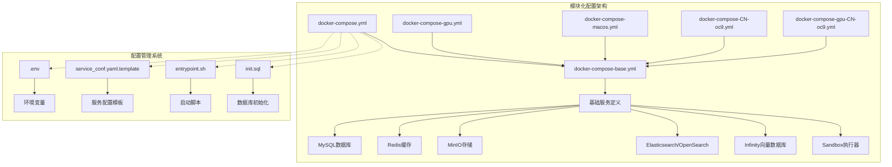

**图表来源**
- [docker-compose.yml](file://docker/ragflow/docker-compose.yml#L1-L5)
- [docker-compose-base.yml](file://docker/ragflow/docker-compose-base.yml#L1-L228)

**章节来源**
- [docker-compose.yml](file://docker/ragflow/docker-compose.yml#L1-L75)
- [docker-compose-base.yml](file://docker/ragflow/docker-compose-base.yml#L1-L228)

## 核心模块化架构

### include指令的使用模式

ragflow项目通过docker-compose的`include`指令实现了配置的层次化组织。这种设计遵循了"基础配置不变，特定需求覆盖"的原则。

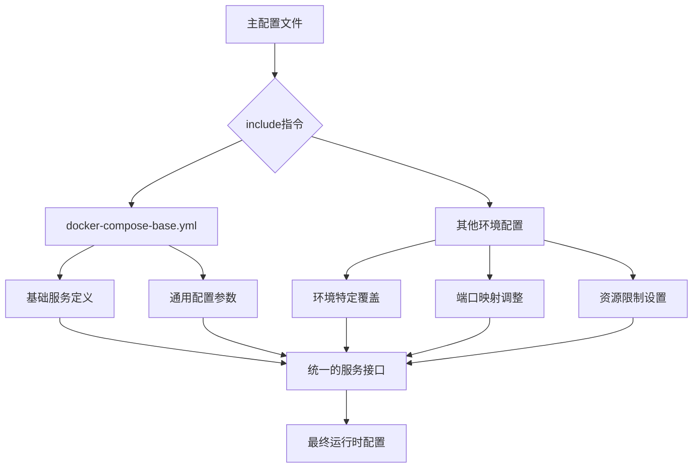

**图表来源**
- [docker-compose.yml](file://docker/ragflow/docker-compose.yml#L1-L2)
- [docker-compose-gpu.yml](file://docker/ragflow/docker-compose-gpu.yml#L1-L4)

### 配置继承机制

每个环境特定的配置文件都通过`include`指令引入基础配置，然后根据需要进行覆盖和扩展：

| 配置文件 | 主要用途 | 特殊功能 | 覆盖内容 |
|---------|---------|---------|---------|
| docker-compose.yml | 默认开发环境 | 基础功能支持 | 无特殊覆盖 |
| docker-compose-gpu.yml | GPU加速环境 | NVIDIA设备支持 | GPU资源分配 |
| docker-compose-macos.yml | macOS本地开发 | 平台优化 | 平台特定端口映射 |
| docker-compose-CN-oc9.yml | 国内镜像版本 | 中国区兼容性 | 镜像源替换 |
| docker-compose-gpu-CN-oc9.yml | GPU+国内版本 | 综合优化 | 同时包含GPU和镜像优化 |

**章节来源**
- [docker-compose.yml](file://docker/ragflow/docker-compose.yml#L1-L75)
- [docker-compose-gpu.yml](file://docker/ragflow/docker-compose-gpu.yml#L1-L41)
- [docker-compose-macos.yml](file://docker/ragflow/docker-compose-macos.yml#L1-L75)

## 基础配置文件分析

### 数据库服务抽象

docker-compose-base.yml定义了所有核心依赖服务的标准配置，这些服务构成了整个系统的基础设施。

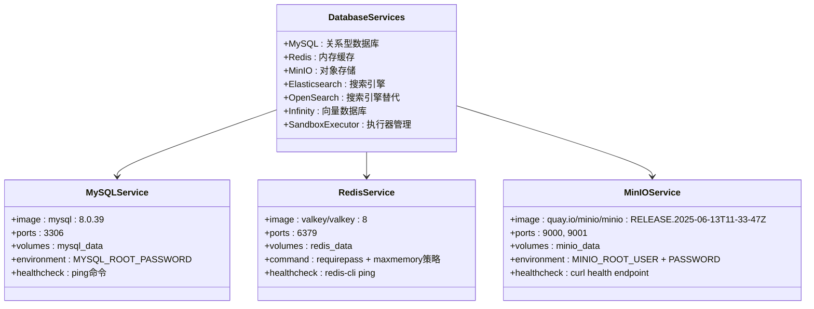

**图表来源**
- [docker-compose-base.yml](file://docker/ragflow/docker-compose-base.yml#L130-L170)
- [docker-compose-base.yml](file://docker/ragflow/docker-compose-base.yml#L172-L200)
- [docker-compose-base.yml](file://docker/ragflow/docker-compose-base.yml#L202-L228)

### 搜索引擎配置抽象

系统支持多种搜索引擎，通过profiles机制实现按需加载：

| 引擎类型 | 容器名称 | 端口映射 | 认证方式 | 存储卷 | 健康检查 |
|---------|---------|---------|---------|-------|---------|
| Elasticsearch | es01 | 9200 | Elastic密码 | esdata01 | curl健康检查 |
| OpenSearch | opensearch01 | 9201 | Admin密码 | osdata01 | curl健康检查 |
| Infinity | infinity | 23817, 23820, 5432 | 无认证 | infinity_data | HTTP节点检查 |

### 向量数据库集成

Infinity向量数据库作为现代RAG应用的核心组件，提供了高性能的向量检索能力：

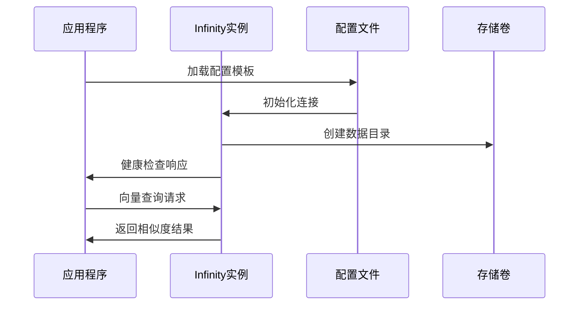

**图表来源**
- [docker-compose-base.yml](file://docker/ragflow/docker-compose-base.yml#L70-L95)

**章节来源**
- [docker-compose-base.yml](file://docker/ragflow/docker-compose-base.yml#L1-L228)

## 环境特定配置分析

### GPU加速配置

docker-compose-gpu.yml展示了如何通过资源约束实现GPU加速部署：

```mermaid
flowchart LR
A[docker-compose-gpu.yml] --> B[基础配置继承]
B --> C[NVIDIA设备驱动]
C --> D[GPU资源分配]
D --> E[容器级别GPU访问]
F[deploy.resources.reservations.devices] --> G[driver: nvidia]
G --> H[count: all]
H --> I[capabilities: [gpu]]
B --> F
```

**图表来源**
- [docker-compose-gpu.yml](file://docker/ragflow/docker-compose-gpu.yml#L35-L41)

### macOS平台优化

macOS配置针对Intel和Apple Silicon平台进行了特殊优化：

| 优化项目 | Intel平台 | Apple Silicon | 说明 |
|---------|----------|--------------|------|
| 平台架构 | linux/amd64 | 自动检测 | 确保正确的镜像架构 |
| 端口映射 | 10080:80, 10443:443 | 10080:80, 10443:443 | 避免端口冲突 |
| 性能优化 | LIGHTEN=1 | LIGHTEN=1 | 减少资源占用 |
| 兼容性 | MACOS=1 | MACOS=1 | 启用macOS特定功能 |

### 国内镜像支持

中国区配置通过镜像源替换和网络优化提升了部署效率：

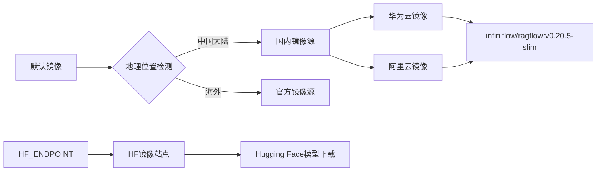

**图表来源**
- [.env](file://docker/ragflow/.env#L80-L90)

**章节来源**
- [docker-compose-gpu.yml](file://docker/ragflow/docker-compose-gpu.yml#L1-L41)
- [docker-compose-macos.yml](file://docker/ragflow/docker-compose-macos.yml#L1-L75)
- [.env](file://docker/ragflow/.env#L80-L90)

## 模块化设计优势

### 维护性提升

模块化设计显著提升了项目的维护性：

```mermaid
mindmap
root((模块化优势))
统一管理
单一基础配置
集中版本控制
一致的更新流程
灵活部署
环境隔离
功能渐进
资源优化
快速迭代
配置复用
测试简化
回滚便捷
扩展性强
新环境支持
功能插件化
第三方集成
```

### 配置复用机制

通过分层配置，避免了重复代码和配置冲突：

| 复用层级 | 复用内容 | 更新范围 | 影响程度 |
|---------|---------|---------|---------|
| 基础层 | 通用服务定义 | 所有环境 | 全局影响 |
| 环境层 | 端口映射和资源 | 特定环境 | 局部影响 |
| 功能层 | 特殊功能开关 | 功能模块 | 功能级影响 |

### 版本管理策略

模块化设计支持精细化的版本管理：

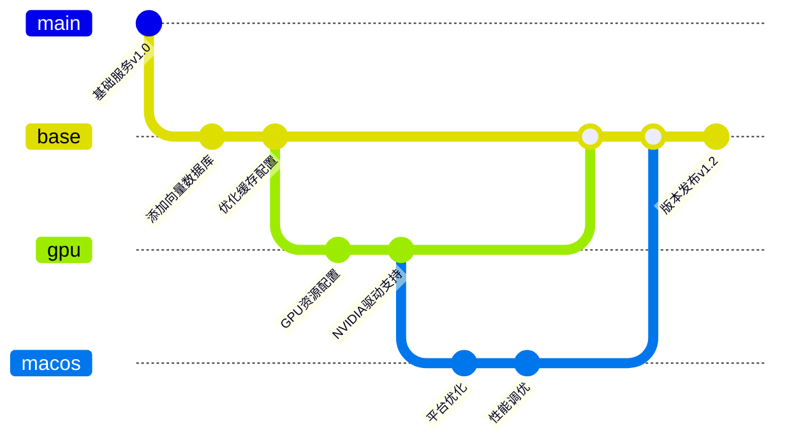

**章节来源**
- [docker-compose.yml](file://docker/ragflow/docker-compose.yml#L1-L5)
- [docker-compose-base.yml](file://docker/ragflow/docker-compose-base.yml#L1-L228)

## 配置管理策略

### 环境变量系统

.env文件定义了完整的环境变量体系，支持动态配置：

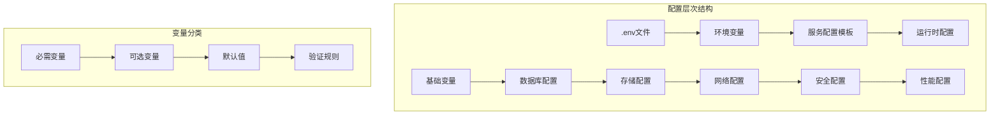

**图表来源**
- [.env](file://docker/ragflow/.env#L1-L194)

### 服务配置模板

service_conf.yaml.template提供了服务级别的配置抽象：

| 配置类别 | 主要组件 | 可配置项 | 环境变量支持 |
|---------|---------|---------|-------------|
| 应用服务 | ragflow | host, http_port | 是 |
| 数据库 | mysql | name, user, password, host, port | 是 |
| 存储 | minio | user, password, host | 是 |
| 搜索引擎 | es/os/infinity | hosts, credentials | 是 |
| 缓存 | redis | db, password, host, port | 是 |

### 启动脚本自动化

entrypoint.sh实现了智能的启动流程管理：

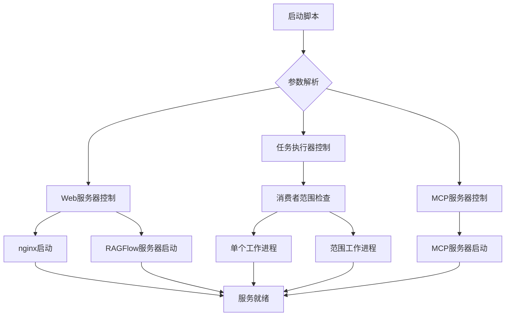

**图表来源**
- [entrypoint.sh](file://docker/ragflow/entrypoint.sh#L1-L211)

**章节来源**
- [.env](file://docker/ragflow/.env#L1-L194)
- [service_conf.yaml.template](file://docker/ragflow/service_conf.yaml.template#L1-L133)
- [entrypoint.sh](file://docker/ragflow/entrypoint.sh#L1-L211)

## 最佳实践指南

### 配置分层策略

建议采用以下配置分层策略：

1. **基础层**：定义所有通用服务的标准配置
2. **环境层**：处理环境特定的端口和资源映射
3. **功能层**：实现功能开关和高级配置
4. **用户层**：提供用户自定义的个性化配置

### 变量注入机制

实现高效的变量注入需要：

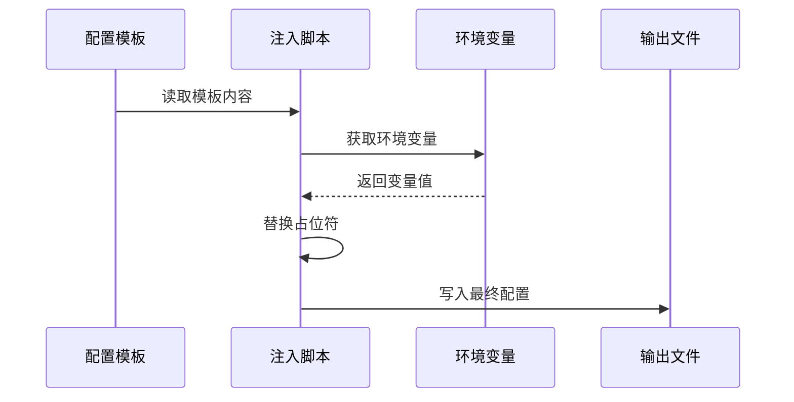

### 多环境部署流程

推荐的多环境部署流程：

| 阶段 | 操作内容 | 验证要点 | 回滚策略 |
|------|---------|---------|---------|
| 开发环境 | 使用默认配置 | 基础功能测试 | 配置重置 |
| 测试环境 | 添加测试配置 | 集成测试验证 | 镜像回退 |
| 预生产环境 | 生产配置预览 | 性能基准测试 | 配置备份 |
| 生产环境 | 最终配置部署 | 监控指标验证 | 快速回滚 |

### 环境一致性保障

确保环境一致性的关键措施：

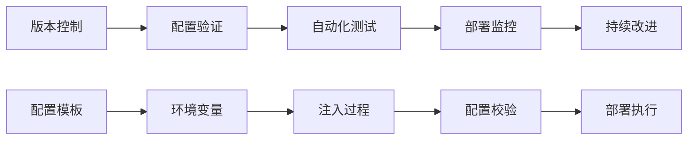

**章节来源**
- [docker-compose.yml](file://docker/ragflow/docker-compose.yml#L1-L75)
- [entrypoint.sh](file://docker/ragflow/entrypoint.sh#L100-L120)

## 故障排除与维护

### 常见问题诊断

模块化配置中的常见问题及解决方案：

| 问题类型 | 症状描述 | 可能原因 | 解决方案 |
|---------|---------|---------|---------|
| 服务启动失败 | 容器无法启动 | 端口冲突/资源不足 | 检查端口占用/调整资源限制 |
| 配置加载错误 | 服务无法正常工作 | 环境变量未正确注入 | 验证.env文件格式 |
| 数据持久化问题 | 数据丢失 | 存储卷权限错误 | 检查卷挂载权限 |
| 网络连接异常 | 服务间通信失败 | 网络配置错误 | 验证网络设置 |

### 监控与日志

建立完善的监控体系：

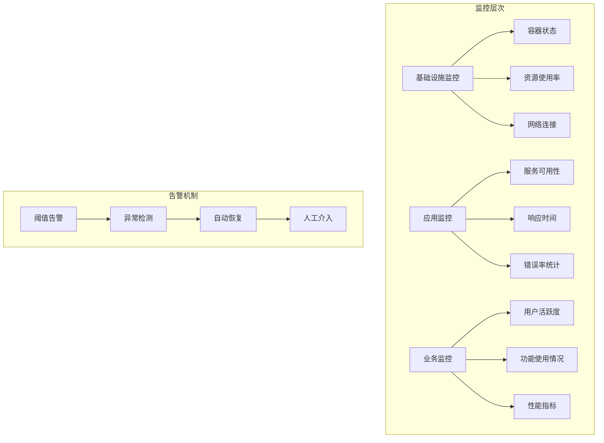

### 维护计划

制定定期维护计划：

1. **每日检查**：容器健康状态、日志分析
2. **每周维护**：配置更新、性能优化
3. **每月升级**：基础镜像更新、安全补丁
4. **季度评估**：架构优化、容量规划

**章节来源**
- [entrypoint.sh](file://docker/ragflow/entrypoint.sh#L100-L150)
- [README.md](file://docker/ragflow/README.md#L1-L269)

## 总结

ragflow项目的模块化容器编排方案展现了现代DevOps实践中容器化部署的最佳实践。通过docker-compose的`include`指令，实现了配置的清晰分层和高效复用，为不同环境提供了灵活且可维护的部署选项。

### 核心价值

1. **架构清晰**：通过模块化设计，使复杂的容器编排变得易于理解和维护
2. **部署灵活**：支持从开发到生产的全生命周期部署场景
3. **扩展性强**：新的环境或功能可以通过简单的配置文件添加
4. **维护高效**：统一的配置模板和自动化脚本降低了维护成本

### 技术创新

该方案在以下方面体现了技术创新：
- 利用docker-compose的include功能实现配置继承
- 通过profiles机制支持多种搜索引擎选择
- 实现了GPU资源的容器化管理
- 提供了完整的启动脚本自动化解决方案

### 应用前景

这种模块化设计模式可以广泛应用于其他微服务项目中，为容器化部署提供了可借鉴的架构思路和实践经验。随着容器技术的不断发展，这种基于配置分层的设计模式将在更多的企业级应用中发挥重要作用。