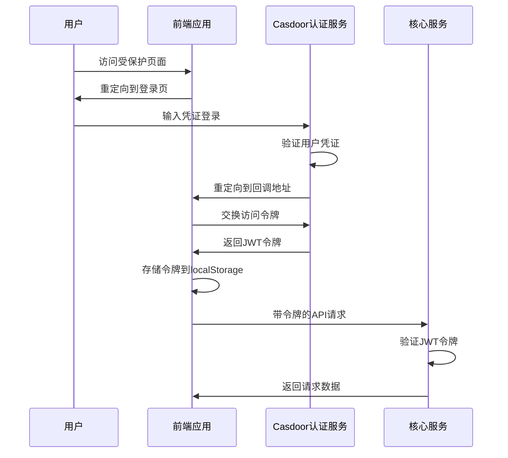

# 认证系统集成

<cite>
**本文档引用的文件**  
- [docker-compose-with-auth.yaml](file://docker/astronAgent/docker-compose-with-auth.yaml)
- [docker-compose-auth.yml](file://docker/astronAgent/docker-compose-auth.yml)
- [docker-compose.yaml](file://docker/astronAgent/docker-compose.yaml)
- [casdoor.ts](file://console/frontend/src/config/casdoor.ts)
- [use-login.ts](file://console/frontend/src/hooks/use-login.ts)
- [app.conf](file://docker/astronAgent/casdoor/conf/app.conf)
- [init_data.json](file://docker/astronAgent/casdoor/conf/init_data.json)
- [entrypoint.sh](file://docker/astronAgent/casdoor/entrypoint.sh)
- [callback/index.tsx](file://console/frontend/src/pages/callback/index.tsx)
- [auth.ts](file://console/frontend/src/utils/auth.ts)
- [user-store.tsx](file://console/frontend/src/store/user-store.tsx)
</cite>

## 目录
1. [集成认证配置分析](#集成认证配置分析)
2. [Casdoor服务独立部署配置](#casdoor服务独立部署配置)
3. [认证网关与核心服务通信机制](#认证网关与核心服务通信机制)
4. [网络隔离与安全通信配置](#网络隔离与安全通信配置)
5. [认证集成调试与常见问题](#认证集成调试与常见问题)

## 集成认证配置分析

`docker-compose-with-auth.yaml` 文件通过 `include` 指令将 Casdoor 认证服务与 astronAgent 核心服务集成，实现了统一的身份认证体系。该配置文件通过组合 `docker-compose-auth.yml` 和 `docker-compose.yaml` 两个独立的配置文件，构建了一个完整的认证增强型部署环境。

与基础配置相比，集成认证配置的主要差异体现在：
- **服务组合方式**：使用 `include` 指令实现配置文件的模块化组合，而非单一的 monolithic 配置
- **网络隔离**：所有服务共享 `astron-agent-network` 网络，确保服务间的安全通信
- **认证集成**：在不修改核心服务配置的前提下，无缝集成 Casdoor 认证服务
- **配置复用**：保持原有核心服务配置不变，通过外部引入方式添加认证功能

这种配置方式实现了认证功能的可插拔式集成，既保证了核心服务的稳定性，又提供了灵活的身份认证能力。

**本节来源**
- [docker-compose-with-auth.yaml](file://docker/astronAgent/docker-compose-with-auth.yaml)
- [docker-compose-auth.yml](file://docker/astronAgent/docker-compose-auth.yml)
- [docker-compose.yaml](file://docker/astronAgent/docker-compose.yaml)

## Casdoor服务独立部署配置

Casdoor 服务通过 `docker-compose-auth.yml` 文件进行独立部署，包含 Casdoor 应用容器和 MySQL 数据库容器。该部署配置实现了认证服务的完全独立，便于维护和升级。

### 数据库初始化配置

Casdoor 的数据库初始化通过 `init_data.json` 文件实现，该文件定义了组织、应用、用户等核心实体的初始状态。初始化数据包含：
- **组织配置**：定义了 `example-org` 和 `built-in` 两个组织，其中 `example-org` 为示例组织，`built-in` 为内置组织
- **应用配置**：定义了 `example-app` 应用，关联到 `example-org` 组织，配置了登录、注册等行为规则
- **认证策略**：设置了密码策略、用户属性可见性、注册项等安全相关配置

初始化数据通过 `entrypoint.sh` 脚本在容器启动时动态生成，支持环境变量注入，确保部署的灵活性。

### 应用配置

Casdoor 的应用配置通过 `app.conf` 文件实现，主要配置项包括：
- **数据库连接**：配置 MySQL 数据库连接信息，包括用户名、密码、主机地址等
- **服务端口**：设置 HTTP 服务端口为 8000
- **运行模式**：设置为开发模式（dev）
- **初始化数据**：指定初始化数据文件路径为 `/conf/init_data.json`

### OAuth2.0认证参数

Casdoor 作为 OAuth2.0 认证服务器，其认证参数主要通过环境变量和初始化数据配置：
- **客户端ID**：在 `init_data.json` 中定义的应用配置中指定
- **重定向URI**：配置为 `${CONSOLE_DOMAIN}/callback` 和 `${HOST_BASE_ADDRESS}/callback`
- **认证范围**：支持标准的 OAuth2.0 认证流程，包括授权码模式
- **令牌配置**：通过 Casdoor 内部配置管理访问令牌和刷新令牌的生成与验证

**本节来源**
- [docker-compose-auth.yml](file://docker/astronAgent/docker-compose-auth.yml)
- [app.conf](file://docker/astronAgent/casdoor/conf/app.conf)
- [init_data.json](file://docker/astronAgent/casdoor/conf/init_data.json)
- [entrypoint.sh](file://docker/astronAgent/casdoor/entrypoint.sh)

## 认证网关与核心服务通信机制

### JWT令牌传递

系统采用 JWT（JSON Web Token）作为身份认证令牌，实现无状态的认证机制。令牌传递流程如下：
1. 用户登录成功后，Casdoor 返回包含用户信息的 JWT 令牌
2. 前端将访问令牌存储在 `localStorage` 中
3. 后续请求通过 `Authorization` 头部携带 JWT 令牌
4. 核心服务验证 JWT 令牌的有效性并提取用户信息

前端通过 `casdoorSdk` 实例管理令牌，提供了 `saveTokenFromResponse` 方法将令牌保存到本地存储。

### 用户身份验证流程

用户身份验证流程包括以下步骤：
1. **登录重定向**：用户访问受保护资源时，前端调用 `handleLoginRedirect` 将用户重定向到 Casdoor 登录页面
2. **认证处理**：Casdoor 完成用户认证后，重定向回应用的回调地址 `/callback`
3. **令牌交换**：在回调页面，前端调用 `exchangeForAccessToken` 方法与 Casdoor 交换访问令牌
4. **令牌存储**：获取到令牌后，将其存储在 `localStorage` 中
5. **用户信息获取**：使用有效令牌调用 `/user-info/me` 接口获取用户详细信息



**图示来源**
- [casdoor.ts](file://console/frontend/src/config/casdoor.ts)
- [callback/index.tsx](file://console/frontend/src/pages/callback/index.tsx)
- [user-store.tsx](file://console/frontend/src/store/user-store.tsx)

### 权限控制策略

系统实现了基于角色的权限控制（RBAC）策略：
- **前端权限**：通过 `use-permissions.ts` 钩子检查用户权限，控制UI元素的显示与隐藏
- **后端权限**：核心服务在处理请求前验证用户身份和权限
- **令牌验证**：使用 `isGetTokenSuccessful` 方法检查令牌获取是否成功
- **会话管理**：通过访问令牌和刷新令牌实现会话的持续性和安全性

**本节来源**
- [casdoor.ts](file://console/frontend/src/config/casdoor.ts)
- [use-login.ts](file://console/frontend/src/hooks/use-login.ts)
- [user-store.tsx](file://console/frontend/src/store/user-store.tsx)

## 网络隔离与安全通信配置

### HTTPS设置

虽然当前配置未直接展示 HTTPS 设置，但通过环境变量 `CONSOLE_DOMAIN` 和 `HOST_BASE_ADDRESS` 支持 HTTPS 部署。生产环境中应配置 Nginx 反向代理处理 SSL 终止，实现 HTTPS 通信。

### 反向代理规则

Nginx 反向代理配置在 `nginx.conf` 文件中定义，主要规则包括：
- 将外部请求代理到 `console-frontend` 和 `console-hub` 服务
- 配置健康检查端点 `/nginx-health`
- 设置日志记录和错误处理

反向代理作为系统的入口网关，实现了请求的统一入口和负载均衡。

### 跨域资源共享（CORS）策略

系统通过以下方式处理跨域问题：
- **同源部署**：前端和后端部署在同一域名下，避免跨域问题
- **API代理**：通过 Nginx 将 API 请求代理到后端服务，实现同源策略
- **认证回调**：回调地址配置为与前端同源，确保认证流程的顺利进行

当需要跨域访问时，后端服务应配置适当的 CORS 头部，允许指定的源访问 API 资源。

**本节来源**
- [docker-compose.yaml](file://docker/astronAgent/docker-compose.yaml)
- [casdoor.ts](file://console/frontend/src/config/casdoor.ts)

## 认证集成调试与常见问题

### 调试方法

1. **日志检查**：查看 Casdoor 容器日志，确认服务正常启动和认证流程
2. **网络检查**：使用浏览器开发者工具检查认证流程中的网络请求和响应
3. **令牌验证**：检查 `localStorage` 中的 `accessToken` 和 `refreshToken` 是否正确存储
4. **环境变量**：确认所有必要的环境变量已正确设置

### 常见问题解决方案

#### 令牌失效问题

**症状**：用户频繁被登出，需要重新登录

**解决方案**：
1. 检查访问令牌和刷新令牌的过期时间配置
2. 确认 `refreshToken` 方法正确实现令牌刷新
3. 检查时钟同步问题，确保客户端和服务器时间一致
4. 验证令牌存储是否被意外清除

```typescript
// 令牌存储管理
const tokenStorage = {
  isAccessTokenExpired: () => {
    const token = localStorage.getItem('accessToken');
    if (!token) return true;
    try {
      const payload = JSON.parse(window.atob(token.split('.')[1] || ''));
      return Date.now() >= payload.exp * 1000;
    } catch {
      return true;
    }
  }
};
```

#### 回调地址错误

**症状**：认证成功后无法正确重定向回应用

**解决方案**：
1. 检查 `CONSOLE_DOMAIN` 和 `HOST_BASE_ADDRESS` 环境变量设置
2. 确认 Casdoor 中配置的重定向 URI 与实际回调地址匹配
3. 验证 `sessionStorage` 中的 `postLoginRedirect` 是否正确存储
4. 检查网络配置，确保回调地址可访问

```typescript
// 回调页面处理
const handleExchange = async (): Promise<void> => {
  try {
    const resp = await casdoorSdk.exchangeForAccessToken();
    // 存储令牌
  } finally {
    const redirect = sessionStorage.getItem('postLoginRedirect') || '/';
    sessionStorage.removeItem('postLoginRedirect');
    window.location.replace(redirect);
  }
};
```

#### 认证配置问题

**症状**：无法重定向到登录页面

**解决方案**：
1. 检查 `casdoorSdk` 初始化参数是否正确
2. 验证环境变量 `CONSOLE_CASDOOR_URL`、`CONSOLE_CASDOOR_ID` 等是否设置
3. 确认 Casdoor 服务正常运行且可通过网络访问
4. 检查防火墙和网络安全组设置

**本节来源**
- [casdoor.ts](file://console/frontend/src/config/casdoor.ts)
- [callback/index.tsx](file://console/frontend/src/pages/callback/index.tsx)
- [use-login.ts](file://console/frontend/src/hooks/use-login.ts)
- [auth.ts](file://console/frontend/src/utils/auth.ts)