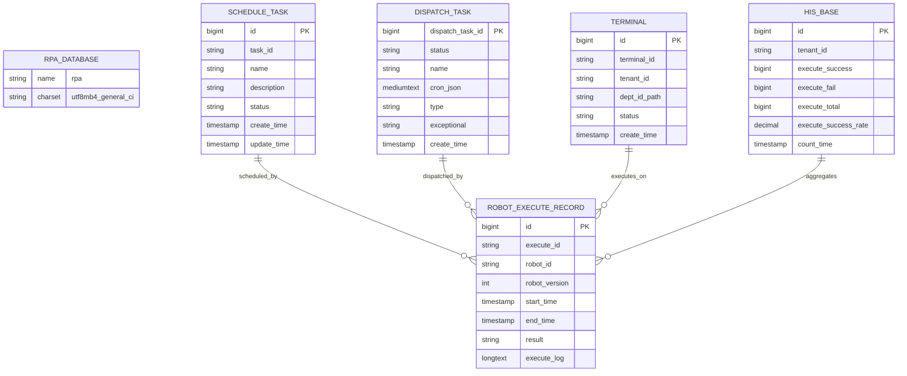
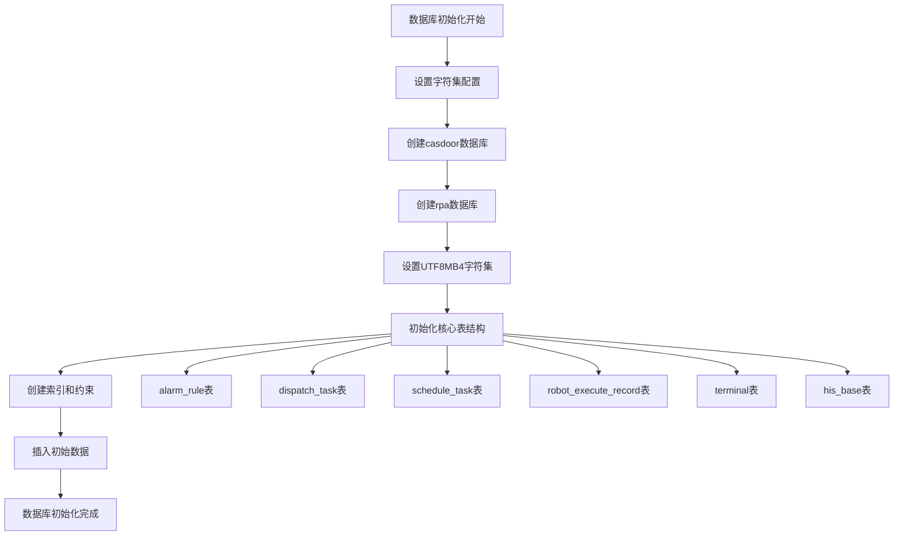
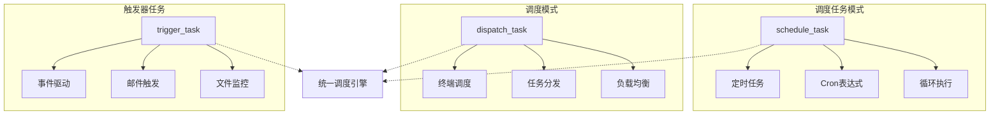
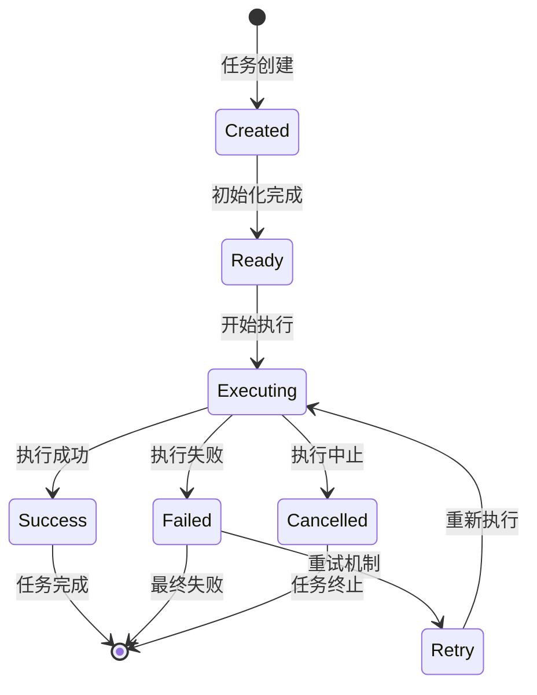
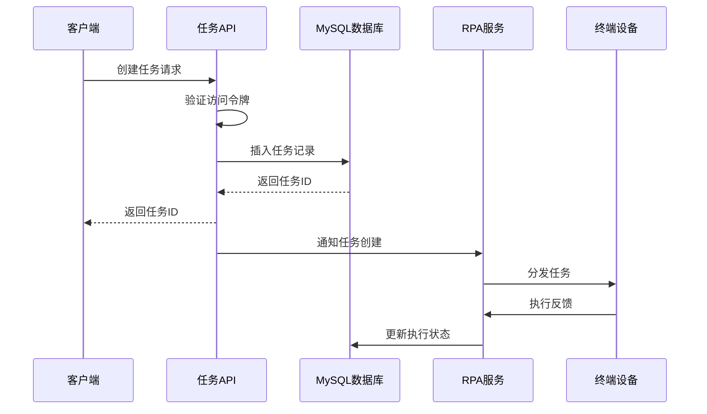
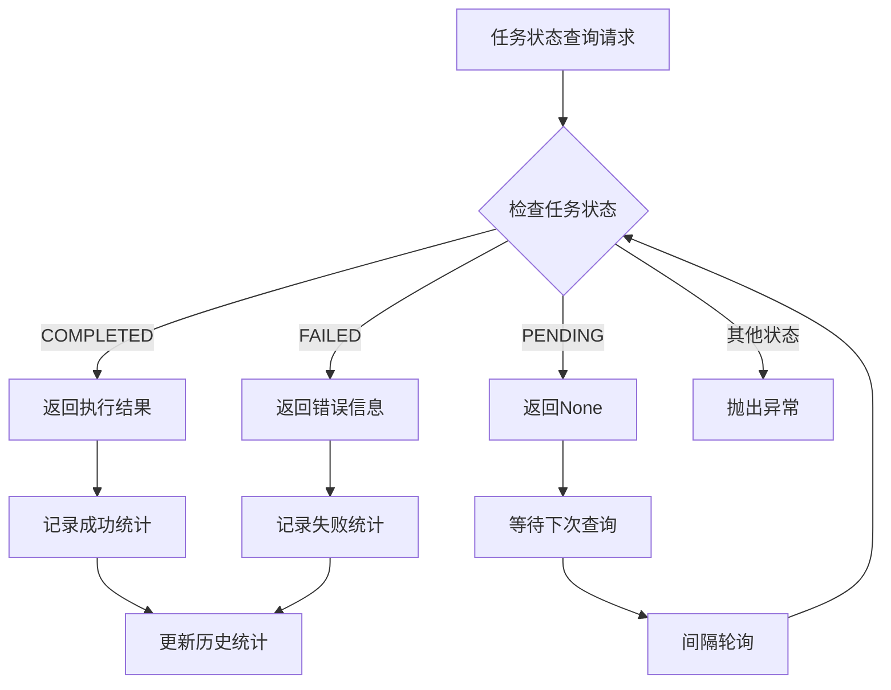
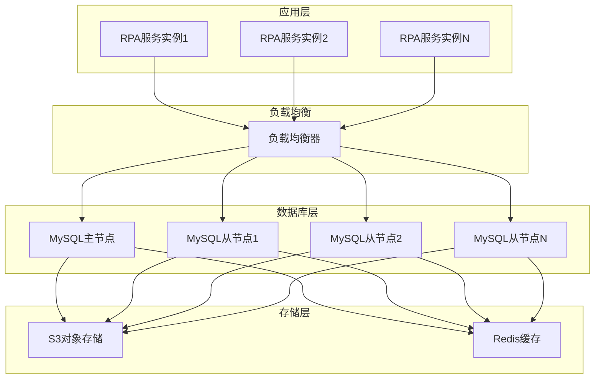
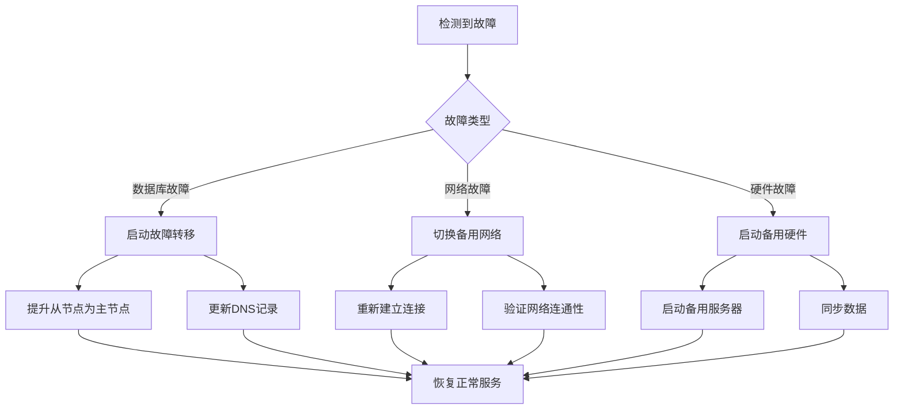
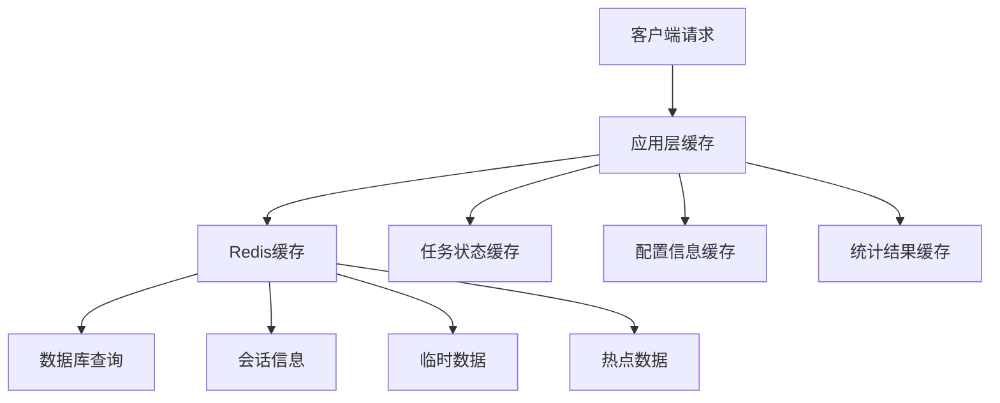

# RPA服务数据库初始化

<cite>
**本文档中引用的文件**
- [schema.sql](file://docker/astronAgent/astronRPA/volumes/mysql/schema.sql)
- [tasks.py](file://core/plugin/rpa/infra/xiaowu/tasks.py)
- [const.py](file://core/plugin/rpa/consts/const.py)
- [main.py](file://core/plugin/rpa/main.py)
- [init_app_market_dict_data.sql](file://docker/astronAgent/astronRPA/volumes/mysql/init_app_market_dict_data.sql)
</cite>

## 目录
1. [概述](#概述)
2. [数据库架构设计](#数据库架构设计)
3. [核心表结构分析](#核心表结构分析)
4. [任务调度系统](#任务调度系统)
5. [数据库交互模式](#数据库交互模式)
6. [高可用性部署方案](#高可用性部署方案)
7. [性能优化策略](#性能优化策略)
8. [故障排除指南](#故障排除指南)
9. [总结](#总结)

## 概述

RPA（机器人流程自动化）服务采用MySQL数据库作为核心数据存储引擎，通过精心设计的schema.sql初始化脚本建立了完整的数据模型体系。该数据库架构支持复杂的任务调度、状态监控和执行日志记录功能，为RPA机器人的高效运行提供了坚实的数据基础。

### 主要特性

- **多租户支持**：通过tenant_id字段实现租户隔离
- **任务调度**：支持定时任务、触发器任务和调度任务
- **状态监控**：实时跟踪机器人执行状态和性能指标
- **日志记录**：完整的执行日志和审计记录
- **高可用性**：支持集群部署和数据持久化

## 数据库架构设计

### 整体架构图



**图表来源**
- [schema.sql](file://docker/astronAgent/astronRPA/volumes/mysql/schema.sql#L977-L1006)
- [schema.sql](file://docker/astronAgent/astronRPA/volumes/mysql/schema.sql#L570-L585)
- [schema.sql](file://docker/astronAgent/astronRPA/volumes/mysql/schema.sql#L1008-L1030)

### 数据库初始化流程



**节来源**
- [schema.sql](file://docker/astronAgent/astronRPA/volumes/mysql/schema.sql#L1-L15)

## 核心表结构分析

### 任务调度相关表

#### 调度任务表（schedule_task）

调度任务表是RPA系统的核心组件之一，负责管理各种类型的定时任务。

| 字段名 | 类型 | 描述 | 约束 |
|--------|------|------|------|
| id | bigint unsigned | 主键ID | AUTO_INCREMENT |
| task_id | varchar(100) | 计划任务ID | NULL |
| name | varchar(64) | 任务名称 | NULL |
| description | varchar(255) | 任务描述 | NULL |
| status | varchar(64) | 任务状态 | NULL |
| enable | tinyint(1) | 是否启用 | NULL |
| schedule_type | varchar(64) | 定时方式 | NULL |
| cron_expression | varchar(50) | Cron表达式 | NULL |
| start_at | datetime | 开始时间 | NULL |
| end_at | datetime | 结束时间 | NULL |

**关键特性**：
- 支持循环执行（cycle）、定时执行（fixed）和自定义执行（custom）
- 提供异常处理机制（stop、skip、retry）
- 支持队列执行和日志记录控制

#### 调度任务执行记录表（schedule_task_execute）

记录每次调度任务的实际执行情况。

| 字段名 | 类型 | 描述 | 约束 |
|--------|------|------|------|
| id | bigint unsigned | 主键ID | AUTO_INCREMENT |
| task_id | varchar(20) | 任务ID | NULL |
| task_execute_id | varchar(20) | 计划任务执行ID | NULL |
| count | int(11) | 执行批次 | NULL |
| result | varchar(20) | 执行结果 | NULL |
| start_time | datetime | 开始时间 | NULL |
| end_time | datetime | 结束时间 | NULL |

**节来源**
- [schema.sql](file://docker/astronAgent/astronRPA/volumes/mysql/schema.sql#L977-L1006)
- [schema.sql](file://docker/astronAgent/astronRPA/volumes/mysql/schema.sql#L1008-L1030)

### 机器人执行相关表

#### 机器人执行记录表（robot_execute_record）

详细记录每个机器人实例的执行过程和结果。

| 字段名 | 类型 | 描述 | 约束 |
|--------|------|------|------|
| id | bigint | 主键ID | AUTO_INCREMENT |
| execute_id | varchar(30) | 执行ID | NULL |
| robot_id | varchar(100) | 机器人ID | NULL |
| robot_version | int(10) | 机器人版本号 | NULL |
| start_time | timestamp | 开始时间 | NULL |
| end_time | timestamp | 结束时间 | NULL |
| execute_time | bigint(20) | 执行时长（秒） | NULL |
| mode | varchar(60) | 运行位置 | NULL |
| result | varchar(20) | 执行结果 | NULL |
| error_reason | varchar(255) | 错误原因 | NULL |
| execute_log | longtext | 日志内容 | NULL |
| video_local_path | varchar(200) | 视频存储路径 | NULL |

**执行结果枚举**：
- `robotFail`: 失败
- `robotSuccess`: 成功  
- `robotCancel`: 取消（中止）
- `robotExecute`: 正在执行

#### 机器人版本表（robot_version）

管理机器人不同版本的配置和状态。

| 字段名 | 类型 | 描述 | 约束 |
|--------|------|------|------|
| id | bigint | 主键ID | AUTO_INCREMENT |
| robot_id | varchar(100) | 机器人ID | NULL |
| version | int(10) | 版本号 | NULL |
| online | smallint(2) | 是否启用 | NULL |
| introduction | longtext | 简介 | NULL |
| param_detail | text | 发版参数信息 | NULL |
| icon | varchar(100) | 图标 | NULL |

**节来源**
- [schema.sql](file://docker/astronAgent/astronRPA/volumes/mysql/schema.sql#L1031-L1060)
- [schema.sql](file://docker/astronAgent/astronRPA/volumes/mysql/schema.sql#L1061-L1090)

### 终端管理相关表

#### 终端表（terminal）

管理RPA执行环境的终端设备信息。

| 字段名 | 类型 | 描述 | 约束 |
|--------|------|------|------|
| id | bigint | 主键ID | AUTO_INCREMENT |
| terminal_id | char(36) | 终端唯一标识 | NOT NULL |
| tenant_id | char(36) | 租户ID | NULL |
| dept_id_path | varchar(100) | 部门全路径ID | NULL |
| name | varchar(200) | 终端名称 | NULL |
| status | varchar(20) | 当前状态 | NULL |
| os | varchar(50) | 操作系统 | NULL |
| ip | varchar(200) | IP地址列表 | NULL |
| port | int(11) | 端口号 | NULL |

**终端状态**：
- `busy`: 运行中
- `free`: 空闲
- `offline`: 离线
- `standalone`: 单机中

#### 终端分组表（terminal_group）

支持按部门或功能对终端进行分组管理。

| 字段名 | 类型 | 描述 | 约束 |
|--------|------|------|------|
| id | bigint unsigned | 主键ID | AUTO_INCREMENT |
| group_name | varchar(100) | 分组名称 | NULL |
| dept_id | char(36) | 部门ID | NULL |
| usage_type | varchar(10) | 使用类型 | NULL |

**节来源**
- [schema.sql](file://docker/astronAgent/astronRPA/volumes/mysql/schema.sql#L1280-L1310)
- [schema.sql](file://docker/astronAgent/astronRPA/volumes/mysql/schema.sql#L1311-L1340)

### 统计分析相关表

#### 历史基础统计表（his_base）

提供全局的执行统计和趋势分析。

| 字段名 | 类型 | 描述 | 约证 |
|--------|------|------|------|
| id | bigint | 主键ID | AUTO_INCREMENT |
| tenant_id | char(36) | 租户ID | NULL |
| dept_id_path | varchar(100) | 部门全路径编码 | NULL |
| execute_success | bigint(20) | 累计执行成功次数 | NULL |
| execute_fail | bigint(20) | 累计执行失败次数 | NULL |
| execute_abort | bigint(20) | 累计执行中止次数 | NULL |
| execute_success_rate | decimal(5,2) | 累计执行成功率 | NULL |
| count_time | timestamp | 统计时间 | NULL |

#### 机器人趋势表（his_robot）

记录单个机器人的执行趋势。

| 字段名 | 类型 | 描述 | 约束 |
|--------|------|------|------|
| id | bigint | 主键ID | AUTO_INCREMENT |
| tenant_id | char(36) | 租户ID | NULL |
| robot_id | varchar(100) | 机器人ID | NULL |
| execute_num_total | bigint(20) | 当日执行总次数 | NULL |
| execute_success | bigint(20) | 每日成功次数 | NULL |
| execute_fail | bigint(20) | 每日失败次数 | NULL |
| execute_success_rate | decimal(5,2) | 每日成功率 | NULL |
| count_time | timestamp | 统计时间 | NULL |

**节来源**
- [schema.sql](file://docker/astronAgent/astronRPA/volumes/mysql/schema.sql#L1091-L1120)
- [schema.sql](file://docker/astronAgent/astronRPA/volumes/mysql/schema.sql#L1121-L1150)

## 任务调度系统

### 调度模式对比



**图表来源**
- [schema.sql](file://docker/astronAgent/astronRPA/volumes/mysql/schema.sql#L977-L1006)
- [schema.sql](file://docker/astronAgent/astronRPA/volumes/mysql/schema.sql#L570-L585)
- [schema.sql](file://docker/astronAgent/astronRPA/volumes/mysql/schema.sql#L1370-L1380)

### 任务生命周期管理



### 任务状态流转

#### 调度任务状态

| 状态值 | 描述 | 下一状态 |
|--------|------|----------|
| ready | 待执行 | executing |
| doing | 执行中 | success/fail/cancelled |
| close | 已结束 | - |
| expired | 已过期 | - |

#### 执行结果状态

| 结果值 | 描述 | 处理方式 |
|--------|------|----------|
| success | 执行成功 | 记录成功统计 |
| error | 执行失败 | 记录失败统计 |
| executing | 正在执行 | 等待状态检查 |
| cancel | 执行中止 | 记录中止统计 |
| dispatch_error | 下发失败 | 重新下发 |
| exe_error | 执行失败 | 异常处理 |

**节来源**
- [schema.sql](file://docker/astronAgent/astronRPA/volumes/mysql/schema.sql#L977-L1006)
- [schema.sql](file://docker/astronAgent/astronRPA/volumes/mysql/schema.sql#L570-L585)

## 数据库交互模式

### RPA任务创建流程



**图表来源**
- [tasks.py](file://core/plugin/rpa/infra/xiaowu/tasks.py#L15-L50)

### 任务状态查询机制

任务状态查询采用异步轮询机制，确保系统的响应性和可靠性。



**节来源**
- [tasks.py](file://core/plugin/rpa/infra/xiaowu/tasks.py#L52-L120)

### 数据库连接配置

RPA服务通过环境变量配置数据库连接参数：

| 配置项 | 默认值 | 描述 |
|--------|--------|------|
| XIAOWU_RPA_TASK_CREATE_URL_KEY | - | 任务创建接口URL |
| XIAOWU_RPA_TASK_QUERY_URL_KEY | - | 任务查询接口URL |
| XIAOWU_RPA_TASK_QUERY_INTERVAL_KEY | - | 查询间隔时间 |
| XIAOWU_RPA_TIMEOUT_KEY | - | 请求超时时间 |

**节来源**
- [const.py](file://core/plugin/rpa/consts/const.py#L1-L95)

## 高可用性部署方案

### 数据库集群架构



### 数据持久化策略

#### 主从复制配置

1. **主节点配置**：
   - 写入操作优先
   - 支持事务处理
   - 提供强一致性保证

2. **从节点配置**：
   - 读取操作分流
   - 支持水平扩展
   - 提供最终一致性

#### 数据备份策略

| 备份类型 | 频率 | 存储位置 | 保留期 |
|----------|------|----------|--------|
| 全量备份 | 每日 | S3对象存储 | 30天 |
| 增量备份 | 每小时 | 本地磁盘 | 7天 |
| 日志备份 | 实时 | 文件系统 | 3天 |
| 配置备份 | 变更时 | Git仓库 | 永久 |

### 故障恢复机制



### 监控告警体系

#### 关键指标监控

| 监控指标 | 告警阈值 | 处理动作 |
|----------|----------|----------|
| 数据库连接数 | >80% | 扩容或优化查询 |
| 任务执行延迟 | >30秒 | 检查终端负载 |
| 失败率 | >5% | 分析失败原因 |
| 磁盘使用率 | >85% | 清理历史数据 |

#### 告警通知机制

- **即时通知**：通过短信、邮件、钉钉等方式通知运维人员
- **状态报告**：定期生成系统健康状态报告
- **根因分析**：自动收集相关日志和指标进行分析

## 性能优化策略

### 查询优化

#### 索引策略

1. **主键索引**：所有表都使用自增主键
2. **外键索引**：在关联字段上建立索引
3. **复合索引**：在经常组合查询的字段上建立复合索引
4. **全文索引**：对日志字段使用全文索引

#### 查询优化技巧

```sql
-- 优化示例：使用覆盖索引
SELECT id, robot_id, start_time, end_time, result 
FROM robot_execute_record 
WHERE robot_id = ? AND start_time >= ? 
ORDER BY start_time DESC 
LIMIT 100;

-- 优化示例：避免全表扫描
SELECT COUNT(*) 
FROM his_robot 
WHERE count_time >= DATE_SUB(NOW(), INTERVAL 1 DAY);
```

### 缓存策略

#### 多层缓存架构



#### 缓存更新策略

| 缓存类型 | 更新时机 | 过期时间 |
|----------|----------|----------|
| 任务状态 | 状态变更时 | 30秒 |
| 配置信息 | 配置变更时 | 5分钟 |
| 统计结果 | 数据更新时 | 10分钟 |
| 用户信息 | 登录时 | 1小时 |

### 分区策略

#### 按时间分区

对于历史数据表，采用按时间分区的策略：

```sql
-- 按天分区
CREATE TABLE robot_execute_record (
    -- 表结构
) PARTITION BY RANGE (TO_DAYS(create_time)) (
    PARTITION p202401 VALUES LESS THAN (TO_DAYS('2024-02-01')),
    PARTITION p202402 VALUES LESS THAN (TO_DAYS('2024-03-01')),
    PARTITION p_max VALUES LESS THAN MAXVALUE
);
```

#### 按租户分区

对于多租户场景，可以按租户ID进行分区：

```sql
CREATE TABLE robot_execute_record (
    -- 表结构
) PARTITION BY HASH(tenant_id) PARTITIONS 16;
```

## 故障排除指南

### 常见问题诊断

#### 任务执行失败

**症状**：任务状态长时间为"执行中"或频繁失败

**排查步骤**：
1. 检查终端连接状态
2. 查看执行日志
3. 验证机器人配置
4. 检查资源使用情况

**解决方案**：
```sql
-- 查询长时间未完成的任务
SELECT * FROM robot_execute_record 
WHERE result = 'robotExecute' 
AND start_time < DATE_SUB(NOW(), INTERVAL 1 HOUR);

-- 清理僵尸任务
UPDATE robot_execute_record 
SET result = 'robotCancel' 
WHERE result = 'robotExecute' 
AND start_time < DATE_SUB(NOW(), INTERVAL 2 HOUR);
```

#### 数据库连接问题

**症状**：服务启动失败或连接超时

**排查步骤**：
1. 检查数据库服务状态
2. 验证网络连接
3. 查看连接池配置
4. 检查防火墙设置

**解决方案**：
```bash
# 检查MySQL服务状态
systemctl status mysql

# 测试数据库连接
mysql -h localhost -u rpa_user -p

# 查看连接池状态
SHOW PROCESSLIST;
```

#### 性能问题

**症状**：查询响应缓慢或系统卡顿

**排查步骤**：
1. 分析慢查询日志
2. 检查索引使用情况
3. 监控系统资源
4. 优化查询语句

**解决方案**：
```sql
-- 查找慢查询
SELECT * FROM mysql.slow_log 
WHERE query_time > 1 
ORDER BY start_time DESC;

-- 分析查询计划
EXPLAIN SELECT * FROM robot_execute_record 
WHERE robot_id = '12345' 
ORDER BY start_time DESC 
LIMIT 100;
```

### 监控指标

#### 关键性能指标

| 指标名称 | 正常范围 | 告警阈值 | 监控方法 |
|----------|----------|----------|----------|
| 任务执行成功率 | >95% | <90% | 定时统计 |
| 平均响应时间 | <2秒 | >5秒 | 应用监控 |
| 数据库连接数 | <80% | >90% | 系统监控 |
| 磁盘使用率 | <70% | >85% | 系统监控 |

#### 日志分析

```bash
# 查看应用日志
tail -f /var/log/rpa/application.log

# 分析错误日志
grep ERROR /var/log/rpa/application.log | tail -100

# 统计任务执行情况
awk '/task.*completed/ {print $0}' /var/log/rpa/application.log | wc -l
```

## 总结

RPA服务的数据库初始化脚本展现了现代企业级应用的设计理念，通过精心设计的表结构和完善的约束机制，为复杂的RPA任务调度和执行提供了可靠的数据支撑。

### 核心优势

1. **完整的任务生命周期管理**：从任务创建到执行完成的全流程跟踪
2. **灵活的调度机制**：支持多种调度模式和异常处理策略
3. **强大的统计分析能力**：提供丰富的执行数据和趋势分析
4. **高可用性架构**：支持集群部署和故障恢复
5. **性能优化设计**：通过索引、缓存和分区策略确保系统性能

### 最佳实践建议

1. **定期维护**：清理历史数据，优化表结构
2. **监控告警**：建立完善的监控体系
3. **备份策略**：制定全面的数据备份计划
4. **容量规划**：根据业务增长预测资源需求
5. **安全防护**：加强数据库访问控制和数据加密

通过遵循本文档的指导原则和最佳实践，可以确保RPA服务数据库系统的稳定运行和持续发展，为企业数字化转型提供强有力的技术支撑。