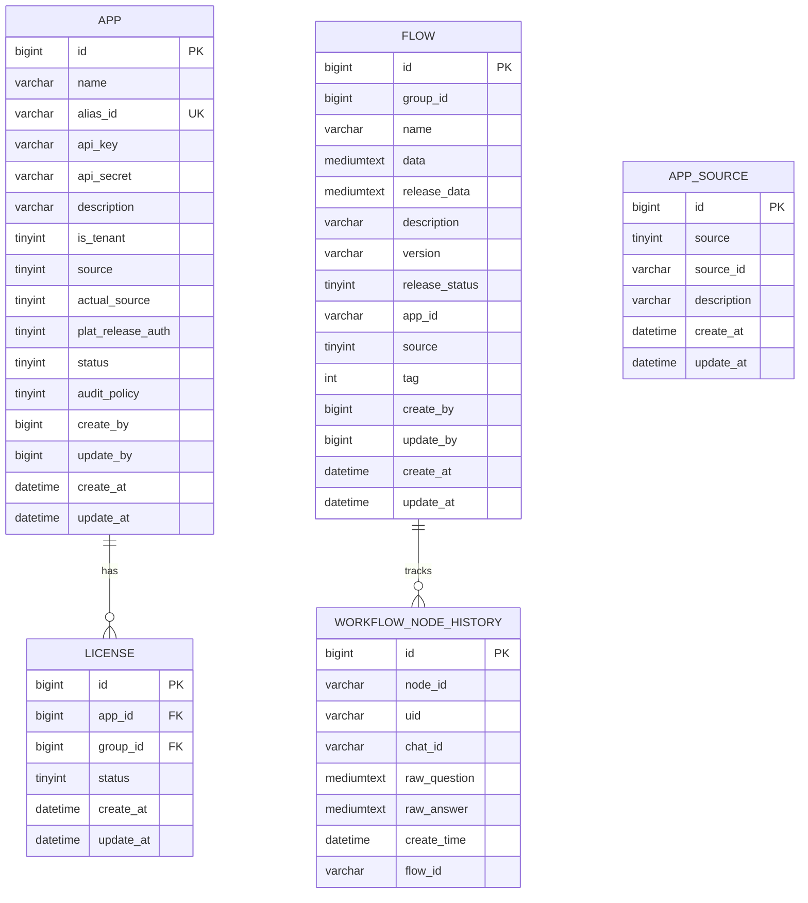
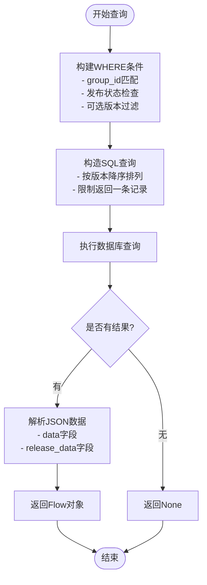
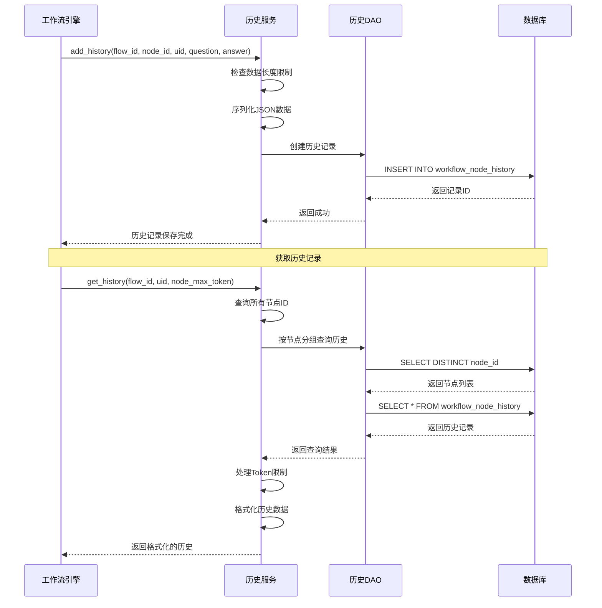
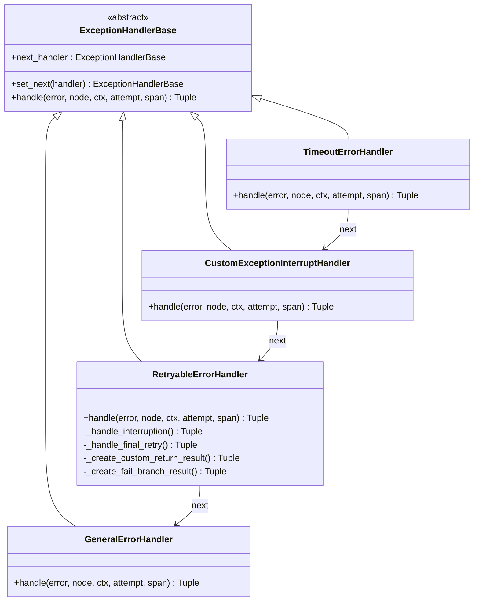
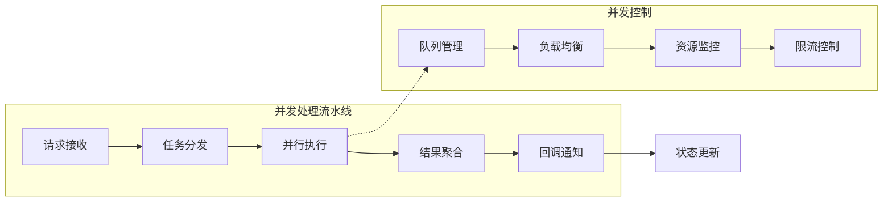

# 工作流服务数据库初始化

<cite>
**本文档引用的文件**
- [workflow.sql](file://docker/astronAgent/mysql/workflow.sql)
- [flow_dao.py](file://core/workflow/repository/flow_dao.py)
- [license_dao.py](file://core/workflow/repository/license_dao.py)
- [flow.py](file://core/workflow/domain/models/flow.py)
- [license.py](file://core/workflow/domain/models/license.py)
- [history.py](file://core/workflow/domain/models/history.py)
- [history_service.py](file://core/workflow/service/history_service.py)
- [dsl_engine.py](file://core/workflow/engine/dsl_engine.py)
- [node.py](file://core/workflow/engine/node.py)
</cite>

## 目录
1. [简介](#简介)
2. [数据库架构概览](#数据库架构概览)
3. [核心表结构分析](#核心表结构分析)
4. [数据访问对象(DAO)层](#数据访问对象dao层)
5. [工作流引擎集成](#工作流引擎集成)
6. [性能优化策略](#性能优化策略)
7. [高并发场景处理](#高并发场景处理)
8. [总结](#总结)

## 简介

本文档深入分析astron-agent工作流服务的数据库初始化脚本workflow.sql，详细说明其数据库Schema设计，包括ai_app表（AI应用元数据）、flow_history表（执行历史）、license表（授权信息）等核心表结构。同时结合Python DAO实现，解释这些表如何支持工作流的版本管理、执行追踪和状态持久化，并提供高并发场景下的性能优化策略。

## 数据库架构概览

工作流服务采用MySQL数据库存储，包含以下核心表：

**图表来源**
- [workflow.sql](file://docker/astronAgent/mysql/workflow.sql#L1-L114)

## 核心表结构分析

### ai_app表（应用元数据）

ai_app表是工作流系统的核心应用信息表，负责存储AI应用的基本元数据和配置信息。

#### 表结构设计特点

| 字段名 | 类型 | 约束 | 描述 |
|--------|------|------|------|
| id | bigint(20) | PRIMARY KEY | 应用唯一标识符 |
| name | varchar(30) | - | 应用显示名称 |
| alias_id | varchar(64) | UNIQUE KEY | 应用标识，用于外部引用 |
| api_key | varchar(50) | NOT NULL | API密钥 |
| api_secret | varchar(50) | NOT NULL | API密钥 |
| description | varchar(255) | - | 应用描述信息 |
| is_tenant | tinyint(4) | DEFAULT '0' | 是否为租户应用 |
| source | tinyint(4) | DEFAULT '0' | 租户归属（二进制位权） |
| actual_source | tinyint(4) | DEFAULT '0' | 实际归属 |
| plat_release_auth | tinyint(4) | DEFAULT '0' | 平台授权权限 |
| status | tinyint(4) | DEFAULT '1' | 应用状态（0禁用，1启用） |
| audit_policy | tinyint(4) | DEFAULT '0' | 审计策略 |
| create_by | bigint(20) | - | 创建人ID |
| update_by | bigint(20) | - | 更新人ID |
| create_at | datetime | - | 创建时间 |
| update_at | datetime | - | 更新时间 |

#### 设计优势

1. **唯一性约束**：通过`alias_id`确保应用标识的唯一性
2. **状态管理**：使用`status`字段实现应用的启停控制
3. **权限控制**：通过`source`和`plat_release_auth`字段支持多层级权限管理
4. **审计支持**：包含创建人、更新人、创建时间、更新时间字段

**节来源**
- [workflow.sql](file://docker/astronAgent/mysql/workflow.sql#L8-L32)

### flow表（工作流定义）

flow表存储工作流的完整定义信息，支持版本管理和发布状态跟踪。

#### 表结构设计特点

| 字段名 | 类型 | 约束 | 描述 |
|--------|------|------|------|
| id | bigint(20) | PRIMARY KEY | 工作流唯一标识符 |
| group_id | bigint(20) | - | 工作流组标识 |
| name | varchar(128) | NOT NULL | 工作流名称 |
| data | mediumtext | - | 编排标准协议（JSON格式） |
| release_data | mediumtext | - | 发布后的数据 |
| description | varchar(1024) | - | 工作流描述 |
| version | varchar(128) | DEFAULT '' | 版本号 |
| release_status | tinyint(4) | - | 发布状态 |
| app_id | varchar(255) | - | 关联的应用ID |
| source | tinyint(4) | DEFAULT '0' | 来源标识 |
| tag | int(11) | - | 标签（0无标签，1对照组） |
| create_by | bigint(20) | DEFAULT '0' | 创建人 |
| update_by | bigint(20) | - | 更新人 |
| create_at | datetime | DEFAULT CURRENT_TIMESTAMP | 创建时间 |
| update_at | datetime | DEFAULT CURRENT_TIMESTAMP ON UPDATE CURRENT_TIMESTAMP | 更新时间 |

#### 版本管理机制

1. **语义版本控制**：通过`version`字段支持语义化版本管理
2. **发布状态跟踪**：使用`release_status`字段跟踪发布状态
3. **组级管理**：通过`group_id`实现工作流的分组管理
4. **时间戳自动更新**：`update_at`字段自动更新以反映最新修改时间

**节来源**
- [workflow.sql](file://docker/astronAgent/mysql/workflow.sql#L40-L64)

### license表（授权信息）

license表管理应用与工作流组之间的授权关系，确保资源访问的安全性。

#### 表结构设计特点

| 字段名 | 类型 | 约束 | 描述 |
|--------|------|------|------|
| id | bigint(20) | PRIMARY KEY | 授权记录唯一标识 |
| app_id | bigint(20) | NOT NULL | 关联的应用ID |
| group_id | bigint(20) | NOT NULL | 关联的工作流组ID |
| status | tinyint(4) | NOT NULL DEFAULT '1' | 授权状态（0禁用，1启用） |
| create_at | datetime | NOT NULL | 创建时间 |
| update_at | datetime | NOT NULL | 更新时间 |

#### 授权管理策略

1. **唯一性约束**：通过`(app_id, group_id)`组合确保授权关系的唯一性
2. **状态控制**：使用`status`字段实现授权的动态启用/禁用
3. **关联查询**：支持通过JOIN操作快速查找特定应用的授权信息

**节来源**
- [workflow.sql](file://docker/astronAgent/mysql/workflow.sql#L66-L78)

### workflow_node_history表（节点执行历史）

该表记录工作流节点的执行历史，支持调试、审计和数据分析需求。

#### 表结构设计特点

| 字段名 | 类型 | 约束 | 描述 |
|--------|------|------|------|
| id | bigint(20) | PRIMARY KEY | 历史记录唯一标识 |
| node_id | varchar(255) | NOT NULL | 节点标识 |
| uid | varchar(255) | - | 用户标识 |
| chat_id | varchar(255) | - | 聊天会话标识 |
| raw_question | mediumtext | - | 原始问题输入 |
| raw_answer | mediumtext | - | 原始回答输出 |
| create_time | datetime | NOT NULL | 创建时间 |
| flow_id | varchar(255) | - | 工作流标识 |

#### 历史数据管理

1. **自动递增主键**：`id`字段自动生成，确保记录的唯一性
2. **索引优化**：为`chat_id`、`node_id`、`uid`字段建立索引，提升查询性能
3. **文本类型选择**：使用`mediumtext`类型支持较大的历史数据存储
4. **时间戳记录**：精确记录每次执行的时间点

**节来源**
- [workflow.sql](file://docker/astronAgent/mysql/workflow.sql#L80-L92)

## 数据访问对象(DAO)层

### FlowDAO实现

FlowDAO提供了工作流数据的访问接口，支持最新的已发布工作流查询功能。

#### 核心功能特性

1. **版本语义化排序**：支持按主要版本号和次要版本号进行排序
2. **发布状态过滤**：通过位运算检查发布状态
3. **参数化查询**：支持可选的版本过滤参数
4. **JSON数据解析**：自动解析存储的JSON字符串为Python对象

#### 查询逻辑分析

**图表来源**
- [flow_dao.py](file://core/workflow/repository/flow_dao.py#L15-L73)

**节来源**
- [flow_dao.py](file://core/workflow/repository/flow_dao.py#L1-L74)

### LicenseDAO实现

LicenseDAO负责处理授权信息的查询操作，支持通过应用别名和工作流组ID查找授权记录。

#### 查询流程

1. **JOIN操作**：连接`app`和`license`表
2. **条件过滤**：根据`alias_id`和`group_id`进行过滤
3. **单条记录**：使用`LIMIT 1`确保只返回一个结果
4. **对象转换**：将数据库行转换为License对象

**节来源**
- [license_dao.py](file://core/workflow/repository/license_dao.py#L1-L46)

## 工作流引擎集成

### 历史服务架构

工作流引擎通过history_service模块管理节点执行历史，提供完整的生命周期管理。

#### 历史数据管理策略

**图表来源**
- [history_service.py](file://core/workflow/service/history_service.py#L25-L185)
- [history.py](file://core/workflow/domain/models/history.py#L15-L44)

#### 性能优化机制

1. **数据截断**：当数据超过数据库行长度限制时自动截断
2. **Token限制**：通过`TOKEN_LIMIT`常量控制LLM处理的Token数量
3. **历史大小限制**：默认最多保留10条历史记录
4. **批量查询**：支持按节点分组批量查询历史数据

**节来源**
- [history_service.py](file://core/workflow/service/history_service.py#L1-L186)

### 异常处理机制

工作流引擎实现了完善的异常处理链，支持多种错误处理策略：

#### 错误处理层次结构

**图表来源**
- [dsl_engine.py](file://core/workflow/engine/dsl_engine.py#L100-L799)

**节来源**
- [dsl_engine.py](file://core/workflow/engine/dsl_engine.py#L1-L799)

## 性能优化策略

### 数据库层面优化

#### 索引设计策略

1. **主键索引**：所有表都使用自增主键作为聚集索引
2. **唯一性索引**：为`alias_id`、`(app_id, group_id)`等唯一约束字段建立索引
3. **复合索引**：为经常一起查询的字段组合建立复合索引
4. **前缀索引**：对较长的字符串字段使用前缀索引

#### 查询优化技术

1. **位运算优化**：在FlowDAO中使用位运算检查发布状态
2. **语义版本排序**：通过字符串函数实现语义化版本比较
3. **分页查询**：历史服务支持分页查询避免大量数据传输
4. **批量操作**：历史服务支持批量查询和处理

### 应用层面优化

#### 连接池管理

1. **会话复用**：使用SQLAlchemy的Session管理数据库连接
2. **事务控制**：合理使用事务边界减少锁竞争
3. **连接超时**：设置合理的连接超时时间

#### 缓存策略

1. **结果缓存**：对频繁查询的结果进行缓存
2. **配置缓存**：缓存应用配置和授权信息
3. **元数据缓存**：缓存工作流定义和节点信息

**节来源**
- [flow_dao.py](file://core/workflow/repository/flow_dao.py#L25-L45)

## 高并发场景处理

### 并发控制机制

#### 锁机制设计

1. **问答回合锁**：通过`qa_node_lock`确保问答回合节点的串行执行
2. **全局锁**：在需要时使用异步锁保护关键资源
3. **乐观锁**：通过时间戳字段实现乐观并发控制

#### 流水线处理

**图表来源**
- [dsl_engine.py](file://core/workflow/engine/dsl_engine.py#L50-L100)

### 错误恢复策略

#### 重试机制

1. **指数退避**：实现指数退避算法避免雪崩效应
2. **最大重试次数**：设置合理的最大重试次数
3. **熔断器模式**：在连续失败时触发熔断器
4. **降级策略**：提供备用方案保证系统可用性

#### 监控和告警

1. **实时监控**：监控数据库连接数、查询响应时间
2. **性能指标**：收集QPS、响应时间、错误率等指标
3. **告警机制**：设置阈值告警及时发现问题
4. **日志记录**：详细记录错误信息便于问题排查

**节来源**
- [dsl_engine.py](file://core/workflow/engine/dsl_engine.py#L300-L500)

## 总结

astron-agent工作流服务的数据库设计体现了现代微服务架构的最佳实践：

### 设计亮点

1. **模块化架构**：清晰分离数据模型、DAO层和业务逻辑
2. **版本管理**：完善的版本控制和发布管理机制
3. **权限控制**：细粒度的授权和访问控制
4. **历史追踪**：全面的执行历史记录和审计功能
5. **异常处理**：多层次的错误处理和恢复机制

### 性能特征

1. **查询优化**：通过索引和查询优化提升查询性能
2. **并发控制**：合理的锁机制和并发控制策略
3. **资源管理**：有效的连接池和资源管理
4. **扩展性**：良好的水平扩展能力

### 应用价值

该数据库设计方案为工作流服务提供了：
- **可靠性**：完善的错误处理和恢复机制
- **可维护性**：清晰的架构设计和模块化实现
- **可扩展性**：支持大规模并发和高可用部署
- **可观测性**：全面的监控和日志记录能力

通过本文档的分析，开发者可以深入理解工作流服务的数据库设计思路，并在实际项目中借鉴这些最佳实践。