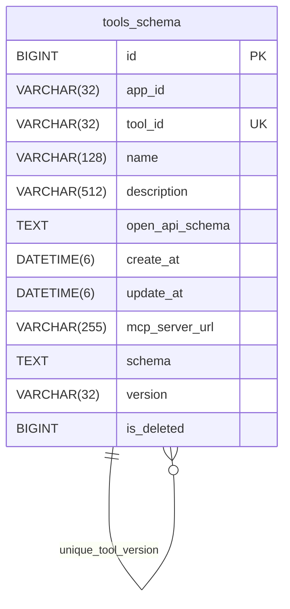
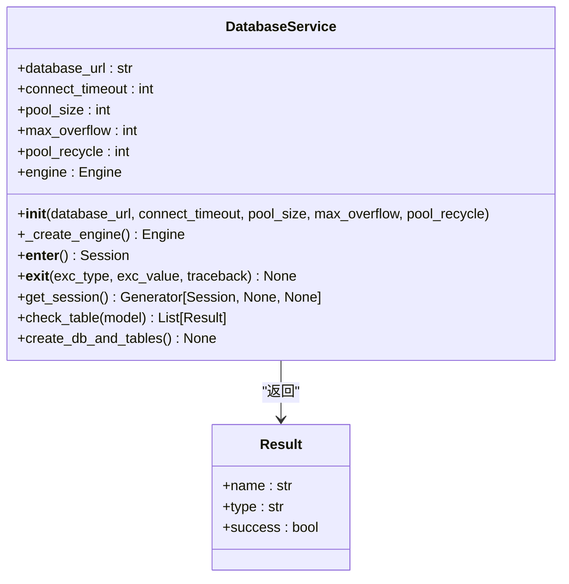
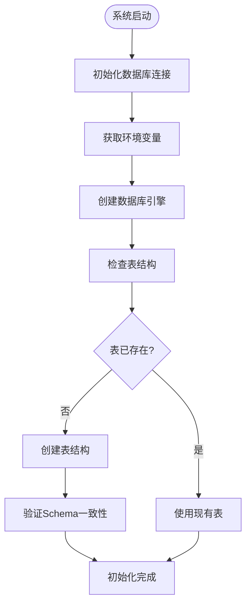

# 插件系统数据库初始化

<cite>
**本文档引用的文件**  
- [link.sql](file://docker/astronAgent/mysql/link.sql)
- [tool_schema.py](file://core/plugin/link/domain/entity/tool_schema.py)
- [manager.py](file://core/plugin/link/domain/models/manager.py)
- [utils.py](file://core/plugin/link/domain/models/utils.py)
- [const.py](file://core/plugin/link/consts/const.py)
</cite>

## 目录
1. [简介](#简介)
2. [核心表结构分析](#核心表结构分析)
3. [插件注册与元数据管理](#插件注册与元数据管理)
4. [配置存储机制](#配置存储机制)
5. [数据一致性保障](#数据一致性保障)
6. [插件元数据管理策略](#插件元数据管理策略)

## 简介
本文档详细说明`link.sql`脚本中插件系统的数据库Schema设计，重点分析工具注册、配置存储和执行记录相关的表结构。结合`core/plugin/link/domain/models/`中的模型定义，阐述数据一致性保障机制和插件元数据管理策略。

## 核心表结构分析

**图表来源**  
- [link.sql](file://docker/astronAgent/mysql/link.sql#L15-L45)
- [tool_schema.py](file://core/plugin/link/domain/entity/tool_schema.py#L21-L61)

**本节来源**  
- [link.sql](file://docker/astronAgent/mysql/link.sql#L15-L45)
- [tool_schema.py](file://core/plugin/link/domain/entity/tool_schema.py#L21-L61)

## 插件注册与元数据管理

插件系统通过`tools_schema`表实现插件的动态注册和元数据管理。该表存储了插件的核心元数据，包括应用ID、工具ID、名称、描述、OpenAPI Schema等信息。

表结构中的`tool_id`字段具有唯一性约束，确保每个工具ID在整个系统中唯一。`version`字段用于管理插件版本，与`is_deleted`字段共同构成复合唯一键`unique_tool_version`，支持插件的版本管理和软删除功能。

插件注册时，系统会验证`tool_id`的格式是否符合`^tool@[0-9a-zA-Z]+$`的正则表达式模式，确保工具ID的规范性。`open_api_schema`字段以JSON格式存储OpenAPI规范，为插件提供标准化的接口描述。

**本节来源**  
- [link.sql](file://docker/astronAgent/mysql/link.sql#L15-L45)
- [tool_schema.py](file://core/plugin/link/domain/entity/tool_schema.py#L21-L61)
- [create_tools_schema.json](file://core/plugin/link/utils/json_schemas/schema_files/create_tools_schema.json#L0-L58)

## 配置存储机制

插件系统的配置存储机制通过`tools_schema`表的多个字段实现。`open_api_schema`字段存储插件的OpenAPI Schema，以JSON格式保存接口的详细定义，包括请求参数、响应格式、操作ID等信息。

`schema`字段同样以JSON格式存储插件的Schema信息，为插件提供额外的配置能力。`mcp_server_url`字段存储MCP（Model Control Plane）服务器的URL，支持插件与外部服务的集成。

系统通过`create_at`和`update_at`字段记录插件的创建和更新时间，精度达到微秒级别（DATETIME(6)），为插件的生命周期管理提供精确的时间戳。`app_id`字段关联插件与特定应用，实现多租户环境下的插件隔离。

**本节来源**  
- [link.sql](file://docker/astronAgent/mysql/link.sql#L15-L45)
- [tool_schema.py](file://core/plugin/link/domain/entity/tool_schema.py#L21-L61)
- [update_tools_schema.json](file://core/plugin/link/utils/json_schemas/schema_files/update_tools_schema.json#L0-L48)

## 数据一致性保障

插件系统通过多层次机制保障数据一致性。首先，在数据库层面，`tools_schema`表定义了主键约束、唯一性约束和默认值约束，确保数据的完整性和一致性。

在应用层面，系统通过`DatabaseService`类提供数据库连接管理和会话处理。该服务使用SQLAlchemy作为ORM框架，通过`session_getter`上下文管理器确保数据库会话的正确获取和释放，避免资源泄漏。

`DatabaseService`还提供了`check_table`方法，用于验证表结构是否与模型定义一致，确保数据库模式的正确性。`create_db_and_tables`方法负责创建数据库和表结构，通过检查表是否存在来避免重复创建。

**图表来源**  
- [utils.py](file://core/plugin/link/domain/models/utils.py#L100-L200)
- [tool_schema.py](file://core/plugin/link/domain/entity/tool_schema.py#L21-L61)

**本节来源**  
- [utils.py](file://core/plugin/link/domain/models/utils.py#L100-L200)
- [tool_schema.py](file://core/plugin/link/domain/entity/tool_schema.py#L21-L61)

## 插件元数据管理策略

插件元数据管理策略基于`tools_schema`表的结构设计和`DatabaseService`的实现。系统采用软删除机制，通过`is_deleted`字段标记已删除的插件，而不是物理删除记录，便于数据恢复和审计。

版本管理策略通过`version`字段实现，默认版本号由`const.DEF_VER`常量定义（默认值为"V1.0"）。结合`tool_id`和`version`的复合唯一键，系统支持同一插件的多个版本共存。

环境配置通过`const.py`文件中的常量管理，包括数据库连接参数（`MYSQL_HOST_KEY`、`MYSQL_PORT_KEY`等）和Redis配置（`REDIS_CLUSTER_ADDR_KEY`、`REDIS_PASSWORD_KEY`等）。这些配置通过环境变量注入，实现配置的外部化管理。

**图表来源**  
- [manager.py](file://core/plugin/link/domain/models/manager.py#L15-L87)
- [utils.py](file://core/plugin/link/domain/models/utils.py#L100-L200)
- [const.py](file://core/plugin/link/consts/const.py#L0-L141)

**本节来源**  
- [manager.py](file://core/plugin/link/domain/models/manager.py#L15-L87)
- [utils.py](file://core/plugin/link/domain/models/utils.py#L100-L200)
- [const.py](file://core/plugin/link/consts/const.py#L0-L141)