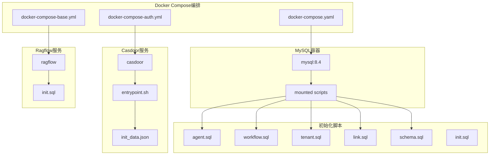
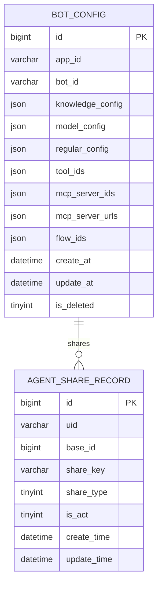
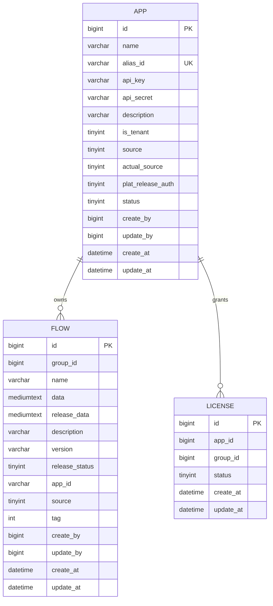
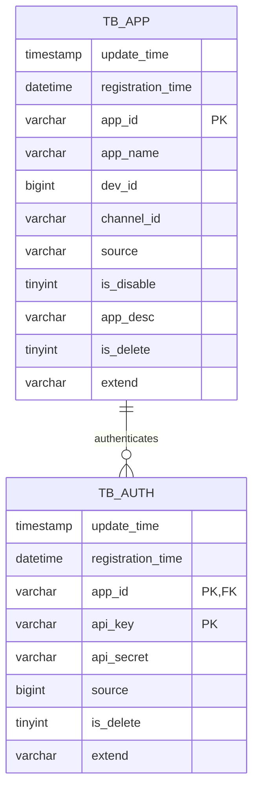
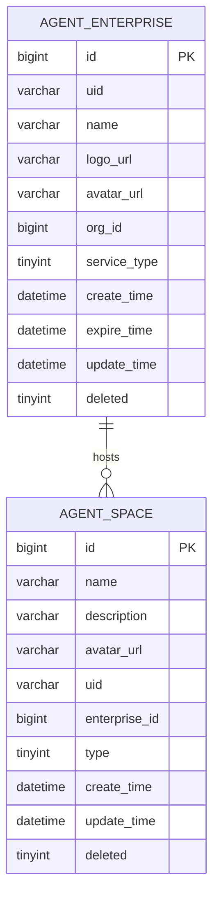
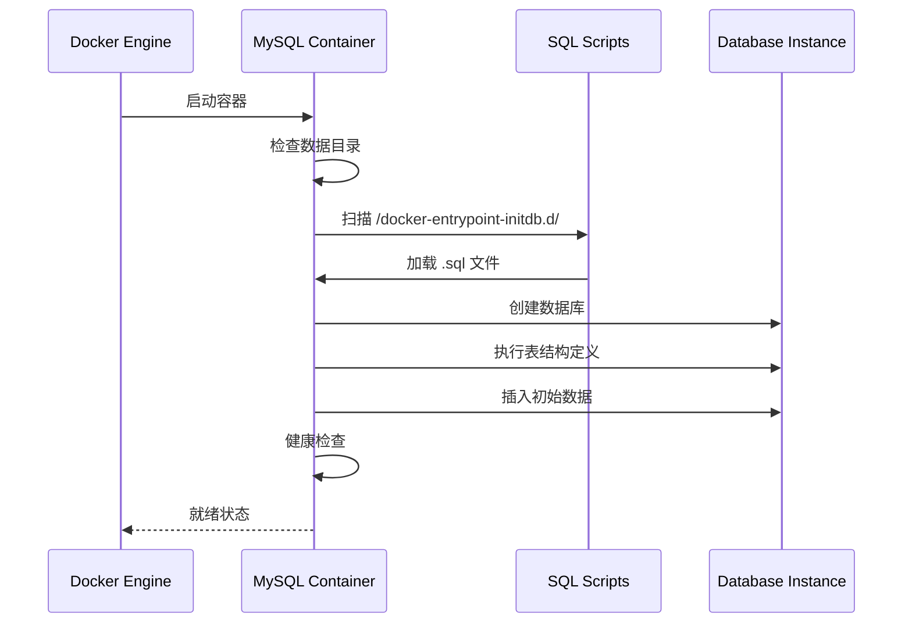
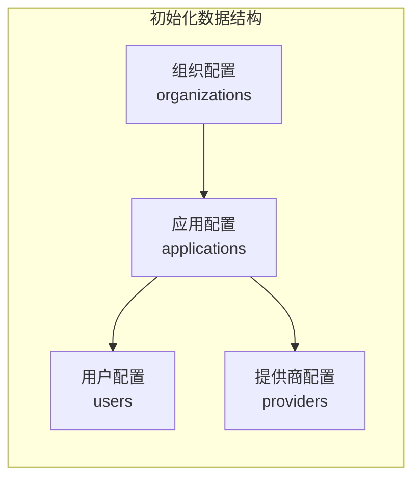
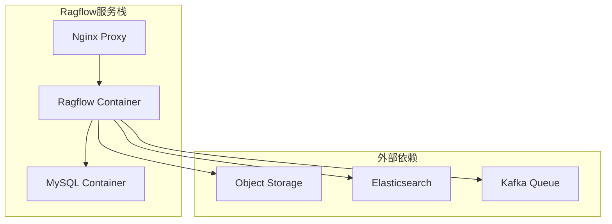
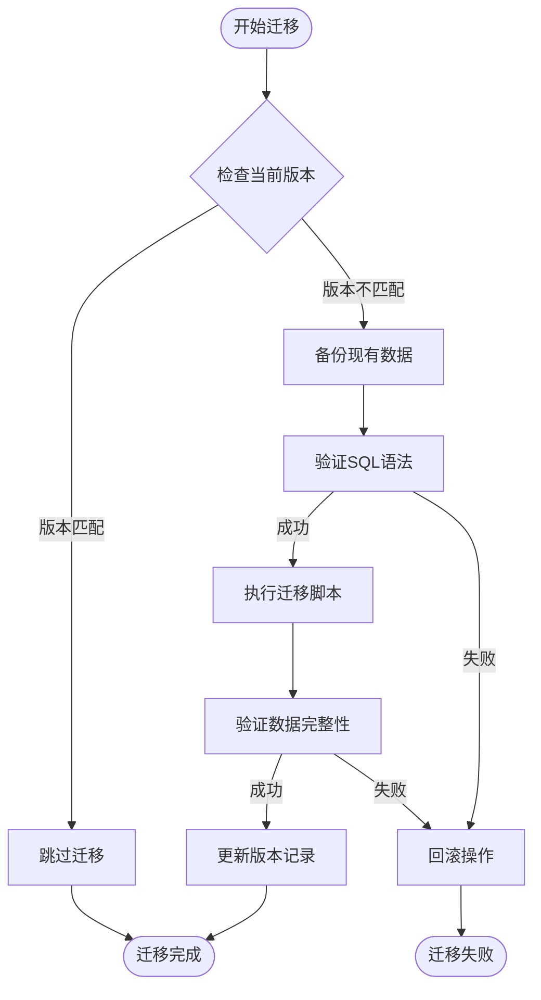
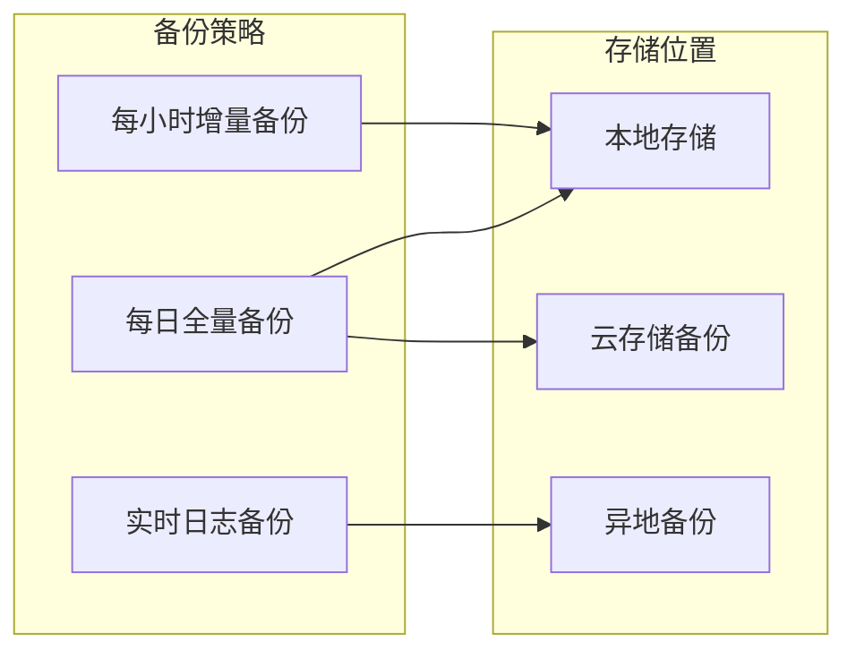

# 数据库初始化

<cite>
**本文档引用的文件**
- [agent.sql](file://docker/astronAgent/mysql/agent.sql)
- [workflow.sql](file://docker/astronAgent/mysql/workflow.sql)
- [tenant.sql](file://docker/astronAgent/mysql/tenant.sql)
- [link.sql](file://docker/astronAgent/mysql/link.sql)
- [schema.sql](file://docker/astronAgent/mysql/schema.sql)
- [init.sql](file://docker/ragflow/init.sql)
- [init_data.json](file://docker/astronAgent/casdoor/conf/init_data.json)
- [docker-compose.yaml](file://docker/astronAgent/docker-compose.yaml)
- [docker-compose-auth.yml](file://docker/astronAgent/docker-compose-auth.yml)
- [entrypoint.sh](file://docker/astronAgent/casdoor/entrypoint.sh)
</cite>

## 目录
1. [概述](#概述)
2. [数据库初始化架构](#数据库初始化架构)
3. [核心数据库脚本分析](#核心数据库脚本分析)
4. [MySQL容器初始化机制](#mysql容器初始化机制)
5. [Casdoor认证服务初始化](#casdoor认证服务初始化)
6. [Ragflow知识库服务初始化](#ragflow知识库服务初始化)
7. [数据库Schema版本管理](#数据库schema版本管理)
8. [最佳实践建议](#最佳实践建议)
9. [故障排除指南](#故障排除指南)

## 概述

astron-agent项目采用了多数据库架构，通过Docker Compose实现自动化数据库初始化。系统包含多个独立的数据库实例，每个数据库负责特定的功能模块：

- **agent数据库**：智能体管理相关表结构
- **workflow数据库**：工作流引擎元数据管理
- **tenant数据库**：租户管理数据模型
- **spark-link数据库**：插件系统数据定义
- **astron_console数据库**：控制台应用数据
- **casdoor数据库**：认证授权服务数据
- **rag_flow数据库**：知识库服务数据

## 数据库初始化架构



**图表来源**
- [docker-compose.yaml](file://docker/astronAgent/docker-compose.yaml#L1-L50)
- [docker-compose-auth.yml](file://docker/astronAgent/docker-compose-auth.yml#L1-L20)

## 核心数据库脚本分析

### agent.sql - 智能体管理系统

agent数据库负责智能体配置和管理的核心功能：



**图表来源**
- [agent.sql](file://docker/astronAgent/mysql/agent.sql#L10-L30)

**节来源**
- [agent.sql](file://docker/astronAgent/mysql/agent.sql#L1-L31)

### workflow.sql - 工作流引擎

workflow数据库管理工作流应用和流程编排：



**图表来源**
- [workflow.sql](file://docker/astronAgent/mysql/workflow.sql#L5-L110)

**节来源**
- [workflow.sql](file://docker/astronAgent/mysql/workflow.sql#L1-L114)

### tenant.sql - 租户管理系统

tenant数据库处理多租户认证和授权：



**图表来源**
- [tenant.sql](file://docker/astronAgent/mysql/tenant.sql#L8-L50)

**节来源**
- [tenant.sql](file://docker/astronAgent/mysql/tenant.sql#L1-L55)

### link.sql - 插件系统

spark-link数据库管理插件工具和MCP服务器：

```mermaid
erDiagram
TOOLS_SCHEMA {
bigint id PK
varchar app_id
varchar tool_id
varchar name
varchar description
text open_api_schema
datetime create_at
datetime update_at
varchar mcp_server_url
text schema
varchar version
bigint is_deleted
}
TOOLS_SCHEMA {
unique_key unique_tool_version (tool_id, version, is_deleted)
}
```

**图表来源**
- [link.sql](file://docker/astronAgent/mysql/link.sql#L8-L30)

**节来源**
- [link.sql](file://docker/astronAgent/mysql/link.sql#L1-L78)

### schema.sql - 控制台应用

astron_console数据库包含企业级权限管理和空间协作功能：



**图表来源**
- [schema.sql](file://docker/astronAgent/mysql/schema.sql#L5-L100)

**节来源**
- [schema.sql](file://docker/astronAgent/mysql/schema.sql#L1-L800)

## MySQL容器初始化机制

MySQL容器通过Docker的自动挂载机制实现数据库初始化：

### 容器配置

```yaml
mysql:
  image: mysql:8.4
  container_name: astron-agent-mysql
  environment:
    MYSQL_ROOT_PASSWORD: ${MYSQL_ROOT_PASSWORD:-root123}
  volumes:
    - mysql_data:/var/lib/mysql
    - ./mysql/:/docker-entrypoint-initdb.d/
  networks:
    - astron-agent-network
  restart: always
  healthcheck:
    test: ["CMD", "mysqladmin", "ping", "-h", "localhost"]
    interval: ${HEALTH_CHECK_INTERVAL:-30s}
    timeout: ${HEALTH_CHECK_TIMEOUT:-10s}
    retries: ${HEALTH_CHECK_RETRIES:-60}
```

**节来源**
- [docker-compose.yaml](file://docker/astronAgent/docker-compose.yaml#L25-L45)

### 初始化流程



**图表来源**
- [docker-compose.yaml](file://docker/astronAgent/docker-compose.yaml#L25-L45)

### 脚本执行顺序

MySQL容器按照文件名的字典序执行SQL脚本：

1. **schema.sql** - 主要应用数据库
2. **agent.sql** - 智能体管理
3. **workflow.sql** - 工作流引擎
4. **tenant.sql** - 租户管理
5. **link.sql** - 插件系统

**节来源**
- [docker-compose.yaml](file://docker/astronAgent/docker-compose.yaml#L30-L35)

## Casdoor认证服务初始化

Casdoor作为OAuth2认证服务，通过动态配置模板实现初始化：

### 配置模板机制

```bash
#!/bin/sh
set -e

# 复制配置模板
sed -e "s|\${CONSOLE_DOMAIN}|${CONSOLE_DOMAIN}|g" \
    -e "s|\${HOST_BASE_ADDRESS}|${HOST_BASE_ADDRESS}|g" \
    /conf/init_data.json.template > /conf/init_data.json

# 启动Casdoor服务
exec /server --createDatabase=true
```

**节来源**
- [entrypoint.sh](file://docker/astronAgent/casdoor/entrypoint.sh#L1-L21)

### 初始化数据结构

Casdoor使用JSON格式的初始化数据，包含组织、应用和用户配置：



**图表来源**
- [init_data.json](file://docker/astronAgent/casdoor/conf/init_data.json#L1-L100)

**节来源**
- [init_data.json](file://docker/astronAgent/casdoor/conf/init_data.json#L1-L800)

## Ragflow知识库服务初始化

Ragflow服务使用简化的初始化脚本：

```sql
CREATE DATABASE IF NOT EXISTS rag_flow;
USE rag_flow;
```

**节来源**
- [init.sql](file://docker/ragflow/init.sql#L1-L2)

### Ragflow架构集成



**图表来源**
- [docker-compose.yml](file://docker/ragflow/docker-compose.yml#L1-L50)

**节来源**
- [docker-compose.yml](file://docker/ragflow/docker-compose.yml#L1-L75)

## 数据库Schema版本管理

### 版本控制策略

astron-agent采用以下版本管理策略：

1. **文件命名约定**：按功能模块区分
2. **执行顺序控制**：通过文件名排序确保依赖关系
3. **增量更新支持**：支持后续迁移脚本
4. **环境变量配置**：支持不同环境的定制化

### 迁移最佳实践



### 版本兼容性管理

| 组件 | 当前版本 | 兼容版本 | 迁移要求 |
|------|----------|----------|----------|
| MySQL | 8.4 | 8.0+ | 支持新特性 |
| Casdoor | 最新版 | 1.x | 配置更新 |
| Ragflow | 自定义 | 1.0+ | 数据结构 |

## 最佳实践建议

### 1. 数据库初始化优化

- **并发初始化**：利用Docker Compose的依赖关系并行启动
- **健康检查**：确保数据库完全就绪后再启动应用服务
- **资源限制**：合理配置内存和CPU资源

### 2. 安全配置

- **密码管理**：使用环境变量存储敏感信息
- **网络隔离**：通过Docker网络限制访问
- **权限控制**：最小权限原则分配数据库权限

### 3. 监控和日志

- **容器监控**：使用Docker Health Check
- **日志聚合**：集中化日志管理
- **性能监控**：数据库性能指标跟踪

### 4. 备份策略



## 故障排除指南

### 常见问题及解决方案

#### 1. 数据库连接失败

**症状**：容器启动后无法连接数据库
**原因**：
- MySQL容器未完全启动
- 网络配置错误
- 密码配置不正确

**解决方案**：
```bash
# 检查容器状态
docker ps | grep mysql

# 查看容器日志
docker logs astron-agent-mysql

# 测试数据库连接
docker exec -it astron-agent-mysql mysql -uroot -p
```

#### 2. 初始化脚本执行失败

**症状**：数据库表结构未正确创建
**原因**：
- SQL语法错误
- 文件编码问题
- 权限不足

**解决方案**：
```bash
# 检查脚本执行日志
docker exec -it astron-agent-mysql cat /var/lib/mysql/init.log

# 验证SQL语法
docker exec -it astron-agent-mysql mysql -uroot -p < script.sql
```

#### 3. Casdoor初始化问题

**症状**：认证服务无法正常工作
**原因**：
- 配置模板替换失败
- 数据库连接异常
- 环境变量缺失

**解决方案**：
```bash
# 检查配置文件
docker exec -it astron-agent-casdoor cat /conf/init_data.json

# 验证数据库连接
docker exec -it astron-agent-casdoor mysql -ucasdoor -p

# 重启服务
docker restart astron-agent-casdoor
```

### 性能优化建议

1. **索引优化**：为常用查询字段添加索引
2. **连接池配置**：合理设置数据库连接数
3. **缓存策略**：使用Redis缓存热点数据
4. **分区表**：对大表实施分区策略

### 监控指标

| 指标类型 | 关键指标 | 正常范围 | 告警阈值 |
|----------|----------|----------|----------|
| CPU使用率 | 数据库进程CPU | < 70% | > 85% |
| 内存使用率 | 数据库进程内存 | < 80% | > 90% |
| 连接数 | 活跃连接数 | < 80%最大连接数 | > 90% |
| 响应时间 | 查询平均响应时间 | < 100ms | > 500ms |

通过以上全面的数据库初始化分析，可以确保astron-agent项目的数据库系统稳定可靠地运行，为整个平台提供坚实的数据基础支撑。