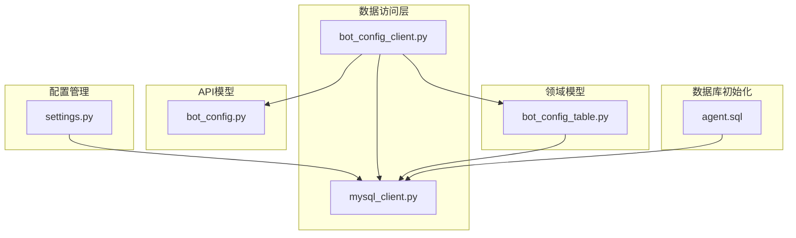
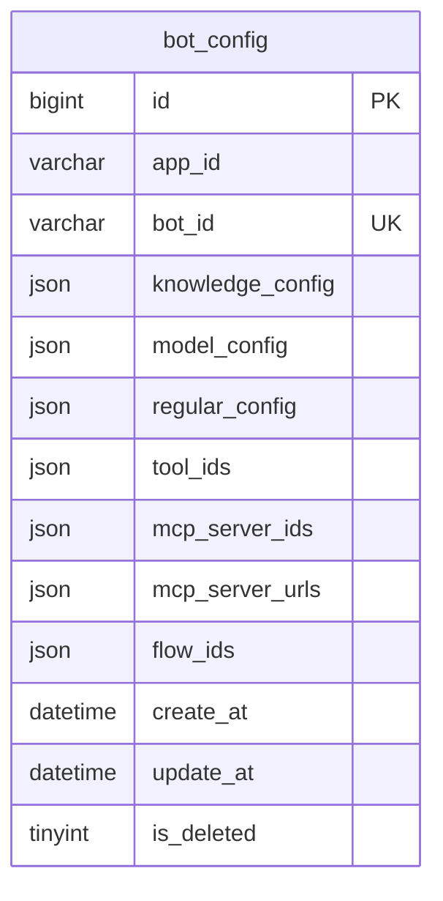
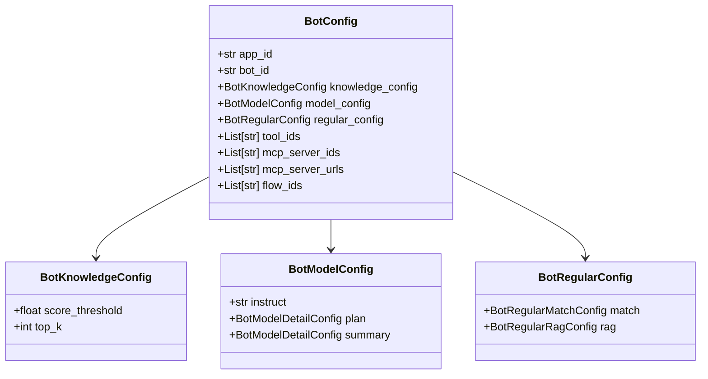
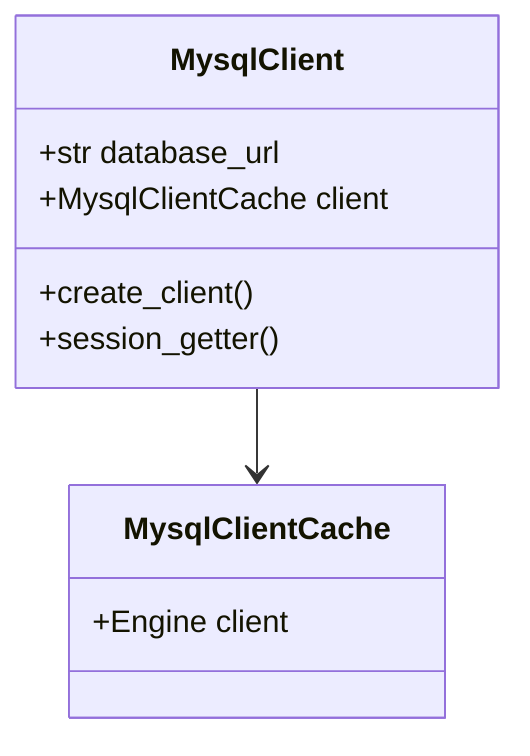
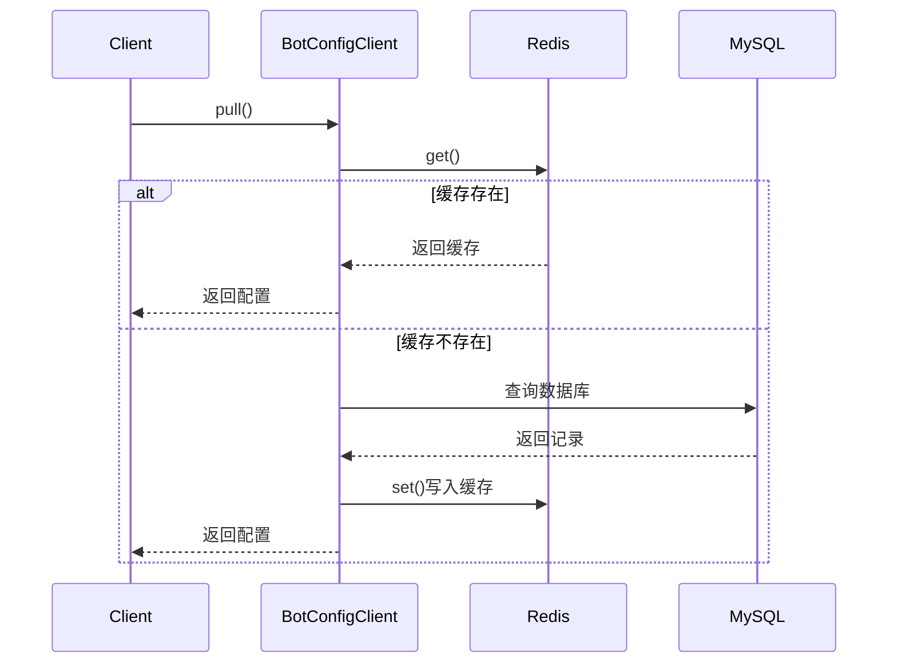

# 智能体服务数据库初始化

<cite>
**本文档引用文件**  
- [agent.sql](file://docker/astronAgent/mysql/agent.sql)
- [mysql_client.py](file://core/agent/repository/mysql_client.py)
- [bot_config_table.py](file://core/agent/domain/models/bot_config_table.py)
- [bot_config_client.py](file://core/agent/repository/bot_config_client.py)
- [bot_config.py](file://core/agent/api/schemas/bot_config.py)
- [settings.py](file://core/common/settings/settings.py)
</cite>

## 目录
1. [项目结构](#项目结构)
2. [核心组件分析](#核心组件分析)
3. [Schema设计详解](#schemadesign详解)
4. [数据访问层集成](#数据访问层集成)
5. [业务逻辑与查询优化](#业务逻辑与查询优化)

## 项目结构

**Diagram sources**
- [agent.sql](file://docker/astronAgent/mysql/agent.sql)
- [mysql_client.py](file://core/agent/repository/mysql_client.py)
- [bot_config_table.py](file://core/agent/domain/models/bot_config_table.py)
- [bot_config_client.py](file://core/agent/repository/bot_config_client.py)
- [bot_config.py](file://core/agent/api/schemas/bot_config.py)
- [settings.py](file://core/common/settings/settings.py)

**Section sources**
- [agent.sql](file://docker/astronAgent/mysql/agent.sql)
- [mysql_client.py](file://core/agent/repository/mysql_client.py)

## 核心组件分析

智能体服务的数据库Schema设计围绕bot_config表为核心，通过JSON字段存储复杂的配置信息，实现了灵活的智能体配置管理。数据访问层通过mysql_client.py提供数据库连接池管理，bot_config_client.py封装了对bot_config表的CRUD操作。

**Section sources**
- [mysql_client.py](file://core/agent/repository/mysql_client.py)
- [bot_config_client.py](file://core/agent/repository/bot_config_client.py)

## Schema设计详解

### bot_config表字段定义

bot_config表是智能体服务的核心配置表，其字段设计体现了灵活的配置管理思想：

- **id**: 主键ID，使用bigint类型，支持大规模数据存储
- **app_id**: 应用ID，varchar(32)，用于标识所属应用
- **bot_id**: 智能体ID，varchar(40)，唯一标识一个智能体
- **knowledge_config**: JSON字段，存储知识库参数配置
- **model_config**: JSON字段，存储模型配置
- **regular_config**: JSON字段，存储知识库选择配置
- **tool_ids**: JSON字段，存储工具ID配置
- **mcp_server_ids**: JSON字段，存储MCP服务器ID配置
- **mcp_server_urls**: JSON字段，存储MCP服务器URL配置
- **flow_ids**: JSON字段，存储工作流ID配置
- **create_at**: 创建时间，datetime类型
- **update_at**: 更新时间，datetime类型
- **is_deleted**: 删除标志，tinyint类型，实现软删除

**Diagram sources**
- [agent.sql](file://docker/astronAgent/mysql/agent.sql)

**Section sources**
- [agent.sql](file://docker/astronAgent/mysql/agent.sql)
- [bot_config_table.py](file://core/agent/domain/models/bot_config_table.py)

### 配置字段的业务含义

config_json字段（在代码中分解为多个JSON字段）存储了智能体的完整配置，包括：

- **knowledge_config**: 知识库配置，包含score_threshold（相似度阈值）和top_k（返回结果数量）
- **model_config**: 模型配置，包含instruct（指令）、plan（规划模型）和summary（总结模型）等子配置
- **regular_config**: 规则配置，包含match（匹配规则）和rag（RAG配置）
- **tool_ids**: 工具ID列表，标识智能体可用的工具
- **mcp_server_ids**: MCP服务器ID列表，支持多服务器部署
- **mcp_server_urls**: MCP服务器URL列表，用于服务发现
- **flow_ids**: 工作流ID列表，标识关联的工作流

**Diagram sources**
- [bot_config.py](file://core/agent/api/schemas/bot_config.py)
- [bot_config_table.py](file://core/agent/domain/models/bot_config_table.py)

**Section sources**
- [bot_config.py](file://core/agent/api/schemas/bot_config.py)
- [bot_config_table.py](file://core/agent/domain/models/bot_config_table.py)

## 数据访问层集成

### MySQL客户端实现

mysql_client.py实现了数据库连接池管理，通过单例模式确保数据库连接的高效复用：

- **MysqlClientCache**: 缓存数据库客户端实例
- **MysqlClient**: 提供数据库连接和会话管理
- **session_getter**: 上下文管理器，自动处理事务的提交和回滚

**Diagram sources**
- [mysql_client.py](file://core/agent/repository/mysql_client.py)

**Section sources**
- [mysql_client.py](file://core/agent/repository/mysql_client.py)

### Bot配置客户端

bot_config_client.py封装了对bot_config表的CRUD操作，实现了缓存层和数据库层的协同工作：

- **pull_from_redis**: 从Redis缓存获取配置
- **pull_from_mysql**: 从MySQL数据库获取配置
- **set_to_redis**: 设置Redis缓存
- **add**: 添加新配置
- **update**: 更新现有配置
- **delete**: 删除配置

**Diagram sources**
- [bot_config_client.py](file://core/agent/repository/bot_config_client.py)

**Section sources**
- [bot_config_client.py](file://core/agent/repository/bot_config_client.py)

## 业务逻辑与查询优化

### 智能体生命周期管理

bot_config表在智能体生命周期管理中扮演核心角色：

1. **创建**: 通过add方法创建新的智能体配置，同时写入数据库和缓存
2. **读取**: 通过pull方法优先从缓存读取，缓存未命中时从数据库读取并更新缓存
3. **更新**: 通过update方法更新配置，同时更新数据库和缓存
4. **删除**: 通过delete方法删除配置，实现软删除

### 查询优化建议

1. **索引优化**: bot_config表已创建联合索引union_app_bot(app_id, bot_id)，确保基于应用ID和智能体ID的查询效率
2. **缓存策略**: 采用Redis缓存热点数据，减少数据库访问压力
3. **连接池配置**: mysql_client.py配置了pool_size=200和max_overflow=800，适应高并发场景
4. **JSON字段查询**: 对于JSON字段的查询，建议在应用层解析后进行，避免数据库层的复杂JSON查询
5. **软删除**: 通过is_deleted字段实现软删除，避免数据丢失，同时可通过定时任务清理历史数据

**Section sources**
- [agent.sql](file://docker/astronAgent/mysql/agent.sql)
- [mysql_client.py](file://core/agent/repository/mysql_client.py)
- [bot_config_client.py](file://core/agent/repository/bot_config_client.py)
- [bot_config_table.py](file://core/agent/domain/models/bot_config_table.py)