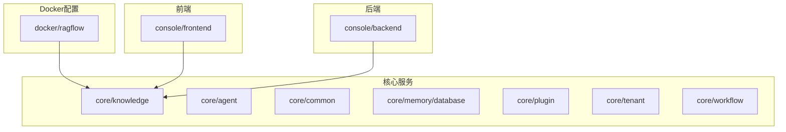
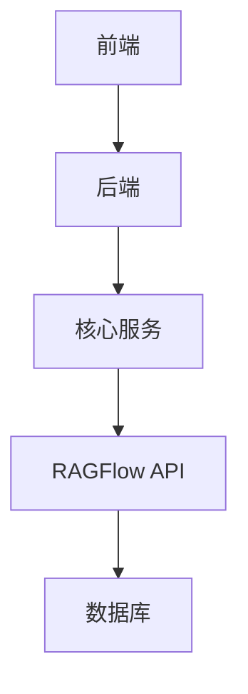
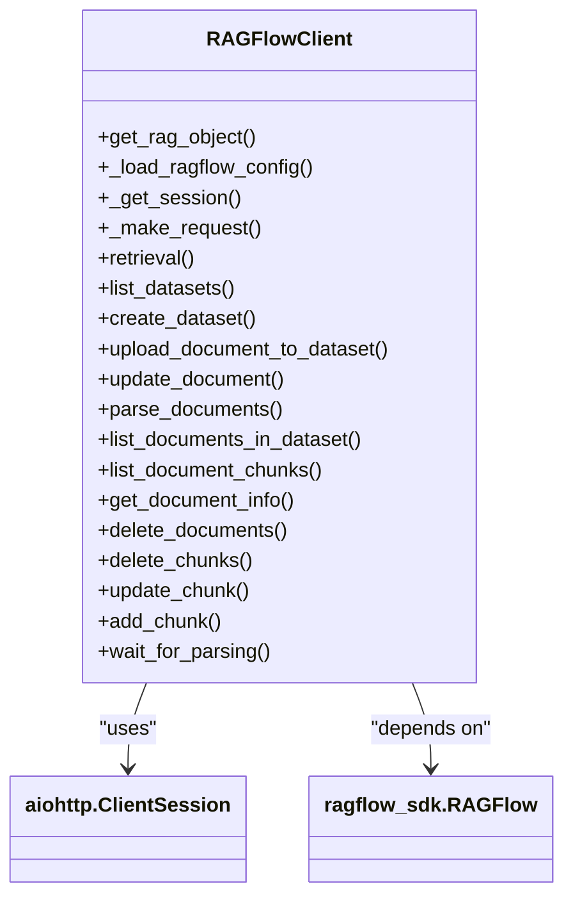
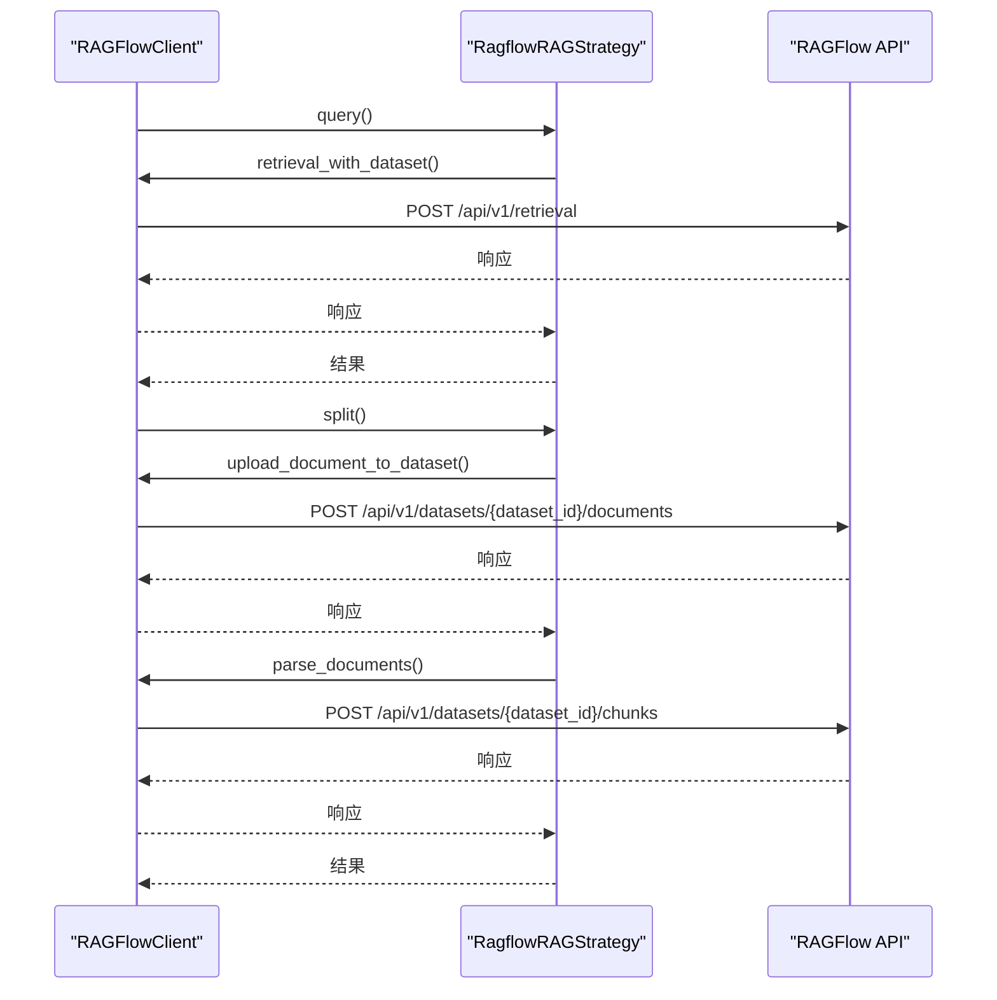
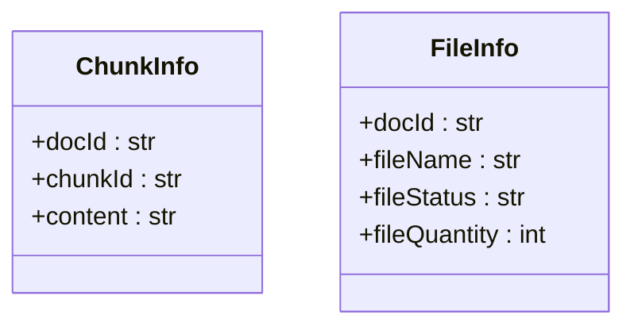
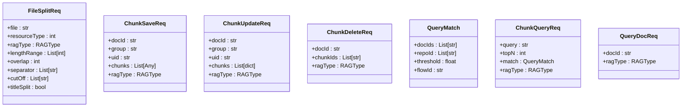
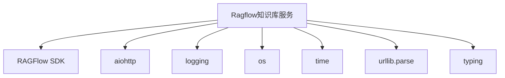

# 知识库服务数据库初始化

<cite>
**本文档引用的文件**  
- [init.sql](file://docker/ragflow/init.sql)
- [ragflow_client.py](file://core/knowledge/infra/ragflow/ragflow_client.py)
- [ragflow_strategy.py](file://core/knowledge/service/impl/ragflow_strategy.py)
- [rag_do.py](file://core/knowledge/domain/entity/rag_do.py)
- [chunk_dto.py](file://core/knowledge/domain/entity/chunk_dto.py)
- [req_knowledge_records.sql](file://console/backend/hub/src/main/resources/sql/req_knowledge_records.sql)
</cite>

## 目录
1. [引言](#引言)
2. [项目结构](#项目结构)
3. [核心组件](#核心组件)
4. [架构概述](#架构概述)
5. [详细组件分析](#详细组件分析)
6. [依赖分析](#依赖分析)
7. [性能考虑](#性能考虑)
8. [故障排除指南](#故障排除指南)
9. [结论](#结论)

## 引言
本文档全面分析Ragflow知识库服务的init.sql初始化脚本，详细说明文档索引、向量存储和检索配置相关的表结构。解释这些表如何支持大规模知识库的高效检索和语义理解。结合core/knowledge/infra/ragflow/ragflow_client.py说明数据导入和索引构建流程，并提供大规模数据初始化的最佳实践和性能调优建议。

## 项目结构
Ragflow知识库服务的数据库初始化脚本位于docker/ragflow/init.sql，该脚本创建了rag_flow数据库并设置为默认数据库。核心知识库服务代码位于core/knowledge目录下，包括API接口、常量定义、领域实体、异常处理、基础设施、服务实现、测试和工具等模块。前端代码位于console/frontend目录下，后端代码位于console/backend目录下。



**Diagram sources**
- [init.sql](file://docker/ragflow/init.sql)
- [ragflow_client.py](file://core/knowledge/infra/ragflow/ragflow_client.py)

**Section sources**
- [init.sql](file://docker/ragflow/init.sql)
- [ragflow_client.py](file://core/knowledge/infra/ragflow/ragflow_client.py)

## 核心组件
Ragflow知识库服务的核心组件包括数据库初始化脚本、RAGFlow客户端工具、RAG策略实现、领域实体和数据模型等。数据库初始化脚本创建了rag_flow数据库，为知识库服务提供数据存储基础。RAGFlow客户端工具提供了与RAGFlow API交互的功能，包括查询、数据集管理、文档管理和辅助功能。RAG策略实现基于RAGFlow，提供了文档处理和知识管理的具体实现。

**Section sources**
- [init.sql](file://docker/ragflow/init.sql)
- [ragflow_client.py](file://core/knowledge/infra/ragflow/ragflow_client.py)
- [ragflow_strategy.py](file://core/knowledge/service/impl/ragflow_strategy.py)

## 架构概述
Ragflow知识库服务采用分层架构，包括前端、后端、核心服务和数据库层。前端通过API与后端交互，后端调用核心服务处理业务逻辑，核心服务通过RAGFlow客户端与RAGFlow API交互，实现知识库的创建、文档上传、解析、查询等功能。数据库层由RAGFlow管理，存储知识库的元数据和向量数据。



**Diagram sources**
- [ragflow_client.py](file://core/knowledge/infra/ragflow/ragflow_client.py)
- [ragflow_strategy.py](file://core/knowledge/service/impl/ragflow_strategy.py)

## 详细组件分析

### 数据库初始化分析
Ragflow知识库服务的数据库初始化脚本非常简洁，仅包含两行SQL语句：创建rag_flow数据库（如果不存在）和使用rag_flow数据库。这表明RAGFlow服务的数据库结构由RAGFlow自身管理，而不是通过外部SQL脚本定义。这种设计使得RAGFlow可以灵活地管理其内部数据结构，而不需要依赖外部的数据库初始化脚本。

```sql
CREATE DATABASE IF NOT EXISTS rag_flow;
USE rag_flow;
```

**Section sources**
- [init.sql](file://docker/ragflow/init.sql)

### RAGFlow客户端分析
RAGFlow客户端工具提供了与RAGFlow API交互的功能，包括查询、数据集管理、文档管理和辅助功能。客户端使用异步HTTP会话管理，支持文件上传和JSON请求。它还实现了会话错误处理和重试逻辑，确保在会话关闭时能够自动恢复。



**Diagram sources**
- [ragflow_client.py](file://core/knowledge/infra/ragflow/ragflow_client.py)

### RAG策略实现分析
RAG策略实现基于RAGFlow，提供了文档处理和知识管理的具体实现。它包括查询、文档分割、块保存、块更新、块删除、文档查询等功能。策略实现使用了RAGFlow客户端工具，通过API与RAGFlow交互，实现了知识库的完整生命周期管理。



**Diagram sources**
- [ragflow_strategy.py](file://core/knowledge/service/impl/ragflow_strategy.py)
- [ragflow_client.py](file://core/knowledge/infra/ragflow/ragflow_client.py)

### 领域实体分析
领域实体定义了知识库服务的数据模型，包括ChunkInfo和FileInfo。ChunkInfo表示文档块信息，包含文档ID、块ID和内容。FileInfo表示文件信息，包含文档ID、文件名、文件状态和文件数量。这些实体用于在服务层和API层之间传递数据。



**Diagram sources**
- [rag_do.py](file://core/knowledge/domain/entity/rag_do.py)

### 数据模型分析
数据模型定义了知识库服务的请求和响应模型，包括文件分割、块保存、块更新、块删除、查询匹配、块查询和文档查询等。这些模型使用Pydantic进行数据验证和序列化，确保数据的完整性和一致性。



**Diagram sources**
- [chunk_dto.py](file://core/knowledge/domain/entity/chunk_dto.py)

## 依赖分析
Ragflow知识库服务依赖于RAGFlow SDK和aiohttp库。RAGFlow SDK提供了与RAGFlow API交互的高级接口，aiohttp库提供了异步HTTP客户端功能。服务还依赖于Python标准库中的logging、os、time、urllib.parse和typing模块。



**Diagram sources**
- [ragflow_client.py](file://core/knowledge/infra/ragflow/ragflow_client.py)
- [ragflow_strategy.py](file://core/knowledge/service/impl/ragflow_strategy.py)

## 性能考虑
Ragflow知识库服务的性能主要受RAGFlow API的性能影响。客户端使用了连接池和会话缓存，减少了HTTP连接的开销。异步编程模型提高了并发处理能力。在大规模数据初始化时，建议使用批量操作，减少API调用次数。同时，合理设置超时和重试策略，避免因网络波动导致操作失败。

**Section sources**
- [ragflow_client.py](file://core/knowledge/infra/ragflow/ragflow_client.py)
- [ragflow_strategy.py](file://core/knowledge/service/impl/ragflow_strategy.py)

## 故障排除指南
在使用Ragflow知识库服务时，可能遇到以下问题：
1. RAGFlow API连接失败：检查RAGFLOW_BASE_URL和RAGFLOW_API_TOKEN环境变量是否正确配置。
2. 文档解析失败：检查文件格式是否支持，文件内容是否有效。
3. 查询结果不准确：调整相似度阈值和topK参数，优化查询效果。
4. 性能问题：检查网络连接，优化批量操作，调整超时和重试策略。

**Section sources**
- [ragflow_client.py](file://core/knowledge/infra/ragflow/ragflow_client.py)
- [ragflow_strategy.py](file://core/knowledge/service/impl/ragflow_strategy.py)

## 结论
Ragflow知识库服务通过简洁的数据库初始化脚本和强大的RAGFlow客户端工具，实现了高效的知识库管理功能。服务采用分层架构和异步编程模型，具有良好的性能和可扩展性。通过合理使用批量操作和优化参数设置，可以满足大规模知识库的初始化和查询需求。未来可以进一步优化错误处理和日志记录，提高服务的稳定性和可维护性。