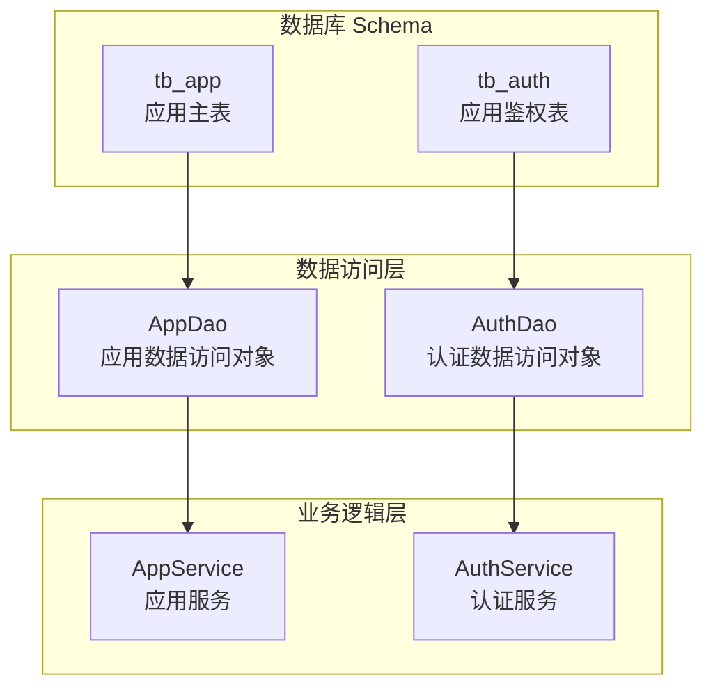
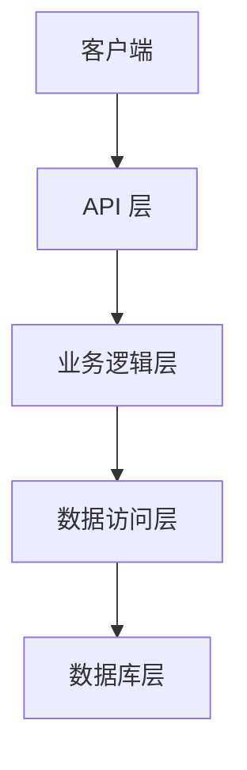
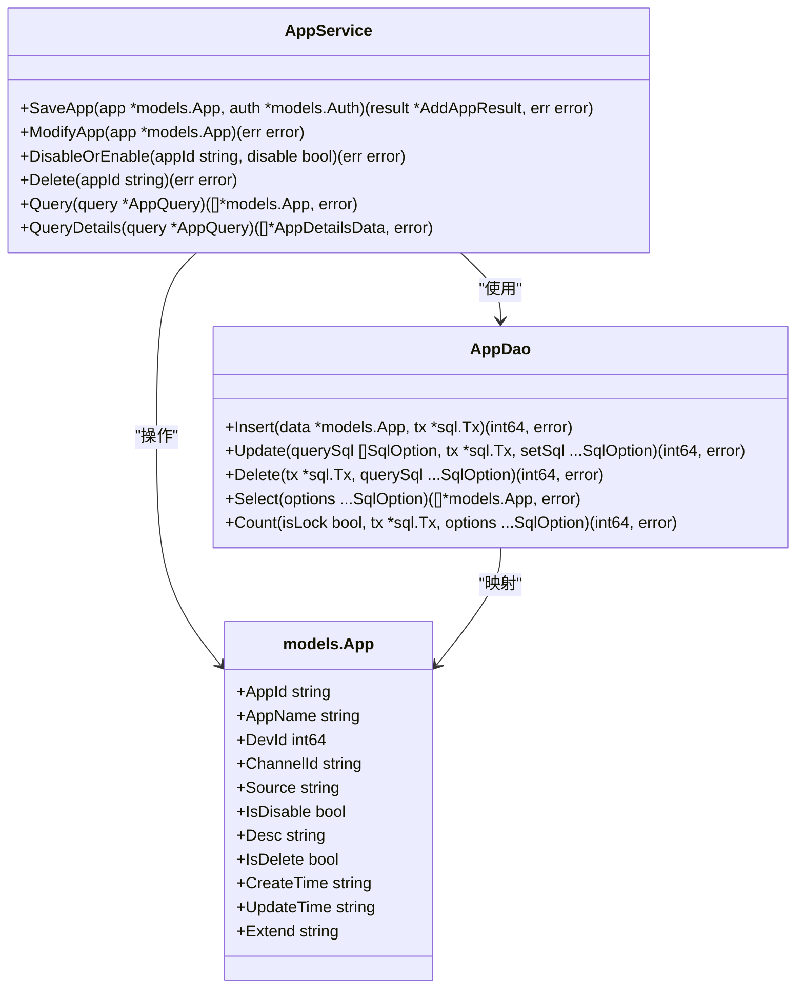
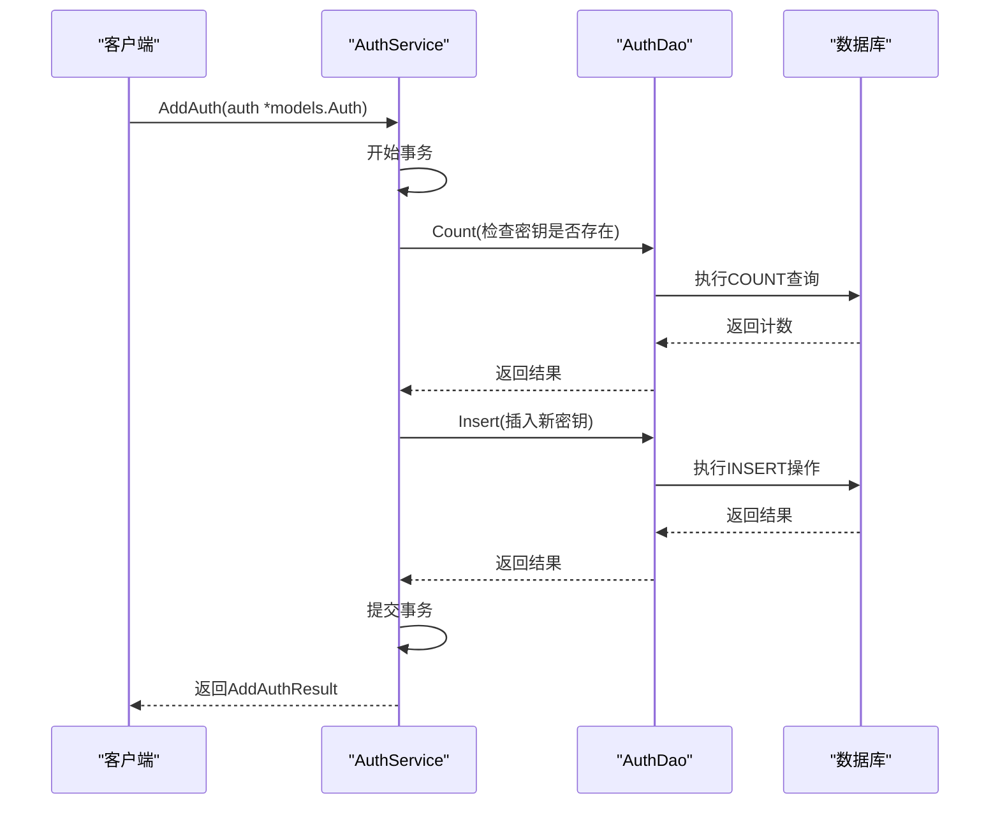
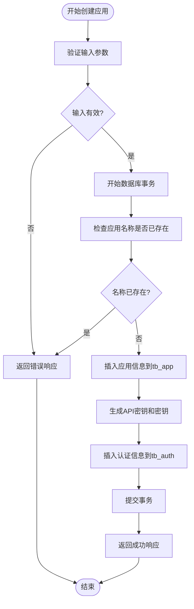
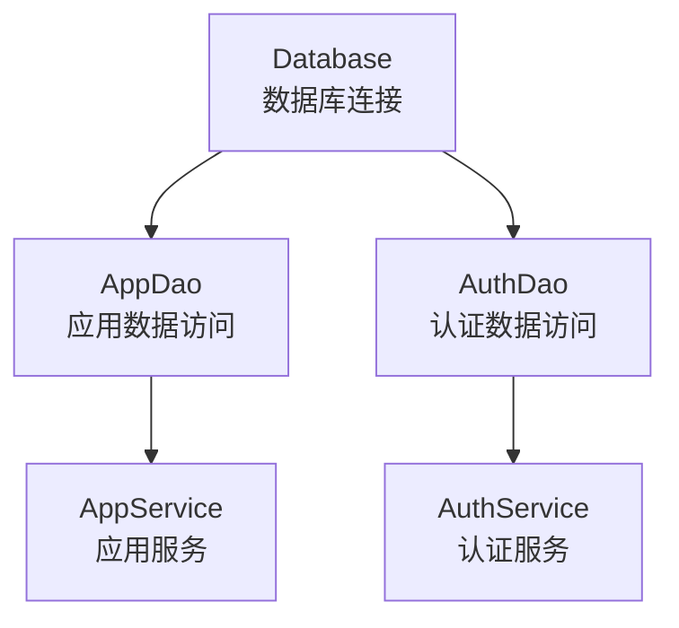

# 租户服务数据库初始化

<cite>
**本文档引用的文件**
- [tenant.sql](file://docker/astronAgent/mysql/tenant.sql)
- [app_dao.go](file://core/tenant/internal/dao/app_dao.go)
- [auth_dao.go](file://core/tenant/internal/dao/auth_dao.go)
- [app.go](file://core/tenant/internal/models/app.go)
- [auth.go](file://core/tenant/internal/models/auth.go)
- [app_service.go](file://core/tenant/internal/service/app_service.go)
- [auth_service.go](file://core/tenant/internal/service/auth_service.go)
- [database.go](file://core/tenant/tools/database/database.go)
</cite>

## 目录
1. [项目结构](#项目结构)
2. [核心组件](#核心组件)
3. [架构概述](#架构概述)
4. [详细组件分析](#详细组件分析)
5. [依赖分析](#依赖分析)
6. [性能考虑](#性能考虑)
7. [故障排除指南](#故障排除指南)
8. [结论](#结论)

## 项目结构
租户管理服务的数据库Schema主要由`tenant.sql`脚本定义，该脚本位于`docker/astronAgent/mysql/`目录下。此脚本创建了两个核心表：`tb_app`（应用信息表）和`tb_auth`（认证数据表）。这些表在多租户架构中扮演着关键角色，通过应用ID（app_id）实现租户隔离和权限控制。

**图表来源**
- [tenant.sql](file://docker/astronAgent/mysql/tenant.sql)

**章节来源**
- [tenant.sql](file://docker/astronAgent/mysql/tenant.sql)

## 核心组件
租户服务的核心组件包括`tb_app`和`tb_auth`两个数据库表，以及对应的数据访问对象（DAO）和服务层。`tb_app`表存储应用的基本信息，如应用名称、开发者ID和渠道ID，而`tb_auth`表则存储应用的API密钥和密钥，用于身份验证和授权。这些组件共同实现了多租户环境下的数据隔离和安全控制。

**章节来源**
- [app.go](file://core/tenant/internal/models/app.go)
- [auth.go](file://core/tenant/internal/models/auth.go)

## 架构概述
租户管理服务采用分层架构，包括数据库层、数据访问层、业务逻辑层和API层。数据库层由`tenant.sql`脚本初始化，创建了`tb_app`和`tb_auth`表。数据访问层通过`AppDao`和`AuthDao`对象提供对数据库的访问，业务逻辑层的`AppService`和`AuthService`处理应用和认证的业务逻辑，API层则暴露RESTful接口供外部调用。

**图表来源**
- [app_service.go](file://core/tenant/internal/service/app_service.go)
- [auth_service.go](file://core/tenant/internal/service/auth_service.go)

## 详细组件分析
### 应用管理分析
`AppService`负责应用的创建、修改、启用/禁用和删除操作。在创建应用时，`AppService`会同时在`tb_app`和`tb_auth`表中插入记录，确保应用和其认证信息的一致性。应用的唯一标识符（app_id）作为外键在`tb_auth`表中使用，实现了应用和其认证信息的关联。

#### 对于面向对象的组件：

**图表来源**
- [app_service.go](file://core/tenant/internal/service/app_service.go)
- [app_dao.go](file://core/tenant/internal/dao/app_dao.go)
- [app.go](file://core/tenant/internal/models/app.go)

### 认证管理分析
`AuthService`负责管理应用的API密钥和密钥。它提供了添加、删除和查询认证信息的功能。当添加新的API密钥时，`AuthService`会检查该密钥是否已存在，以防止重复。认证信息的查询可以通过应用ID或API密钥进行，支持灵活的权限验证需求。

#### 对于API/服务组件：

**图表来源**
- [auth_service.go](file://core/tenant/internal/service/auth_service.go)
- [auth_dao.go](file://core/tenant/internal/dao/auth_dao.go)

### 复杂逻辑组件分析
租户服务中的复杂逻辑主要体现在事务管理和数据一致性保障上。例如，在创建应用时，需要同时在`tb_app`和`tb_auth`表中插入数据，这通过数据库事务来保证原子性。如果任一操作失败，整个事务将回滚，确保数据的一致性。

#### 对于复杂逻辑组件：

**图表来源**
- [app_service.go](file://core/tenant/internal/service/app_service.go)
- [auth_service.go](file://core/tenant/internal/service/auth_service.go)

**章节来源**
- [app_service.go](file://core/tenant/internal/service/app_service.go)
- [auth_service.go](file://core/tenant/internal/service/auth_service.go)

## 依赖分析
租户服务的依赖关系清晰，主要依赖于MySQL数据库和Go语言的标准库。`database.go`文件中的`Database`结构体负责数据库连接的初始化和管理，通过配置文件中的数据库URL、用户名和密码建立连接。`AppDao`和`AuthDao`依赖于`Database`对象来执行SQL操作，而`AppService`和`AuthService`则依赖于相应的DAO对象来实现业务逻辑。

**图表来源**
- [database.go](file://core/tenant/tools/database/database.go)
- [app_dao.go](file://core/tenant/internal/dao/app_dao.go)
- [auth_dao.go](file://core/tenant/internal/dao/auth_dao.go)

**章节来源**
- [database.go](file://core/tenant/tools/database/database.go)

## 性能考虑
为了提高性能，租户服务在数据库层面和代码层面都进行了优化。数据库表`tb_app`和`tb_auth`都定义了适当的索引，如`idx_registration_time`和`idx_api_key`，以加速查询操作。在代码层面，`AppDao`和`AuthDao`使用了预编译的SQL语句，减少了SQL解析的开销。此外，数据库连接池的配置也优化了连接的复用，减少了连接建立和关闭的开销。

## 故障排除指南
在使用租户服务时，可能会遇到一些常见问题，如数据库连接失败、应用创建失败等。对于数据库连接失败，应检查配置文件中的数据库URL、用户名和密码是否正确。对于应用创建失败，应检查应用名称是否已存在，以及是否有足够的权限执行插入操作。日志文件是诊断问题的重要工具，`AppService`和`AuthService`中的日志记录可以帮助定位问题的根源。

**章节来源**
- [app_service.go](file://core/tenant/internal/service/app_service.go)
- [auth_service.go](file://core/tenant/internal/service/auth_service.go)

## 结论
租户管理服务的数据库Schema设计合理，通过`tb_app`和`tb_auth`表实现了应用信息和认证数据的有效管理。数据访问对象和服务层的分层设计提高了代码的可维护性和可测试性。通过事务管理和索引优化，服务在保证数据一致性的同时，也提供了良好的性能。未来可以考虑增加更多的安全特性，如API密钥的定期轮换和更细粒度的权限控制，以进一步提升系统的安全性。