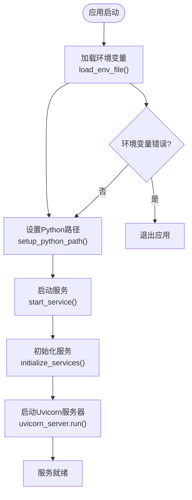
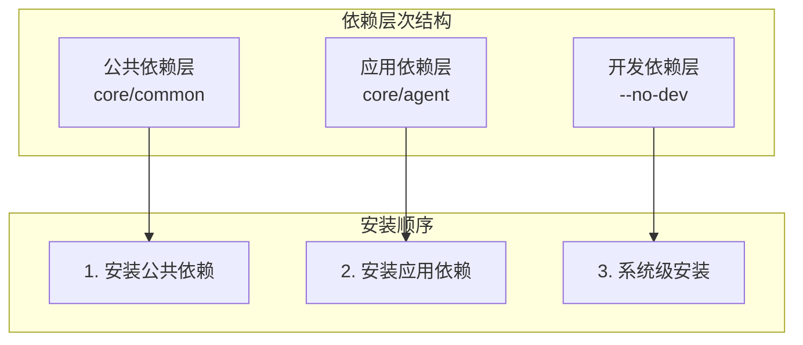
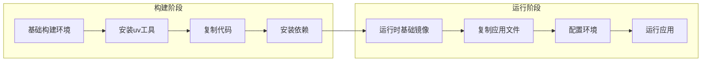

# Agent服务Docker配置

<cite>
**本文档引用的文件**
- [Dockerfile](file://core/agent/Dockerfile)
- [pyproject.toml](file://core/agent/pyproject.toml)
- [uv.lock](file://core/agent/uv.lock)
- [main.py](file://core/agent/main.py)
- [app.py](file://core/agent/api/app.py)
- [config.env.example](file://core/agent/config.env.example)
- [fast_uvi.py](file://core/agent/infra/config/fast_uvi.py)
</cite>

## 目录
1. [项目概述](#项目概述)
2. [Dockerfile架构分析](#dockerfile架构分析)
3. [Python应用打包流程](#python应用打包流程)
4. [uv包管理器详解](#uv包管理器详解)
5. [多阶段构建策略](#多阶段构建策略)
6. [ASGI服务器配置](#asgi服务器配置)
7. [安全实践与最佳实践](#安全实践与最佳实践)
8. [性能优化策略](#性能优化策略)
9. [总结](#总结)

## 项目概述

Astron Agent服务是一个基于FastAPI框架的Python应用，采用现代化的容器化部署方案。该服务作为智能代理的核心组件，负责处理各种AI相关的业务逻辑，包括对话管理、工作流执行、插件调用等功能。

### 核心技术栈

- **Web框架**: FastAPI (高性能异步Web框架)
- **ASGI服务器**: Uvicorn (生产级ASGI服务器)
- **包管理**: uv (超快的Python包管理器)
- **容器化**: Docker (基于Ubuntu基础镜像)
- **依赖管理**: uv.lock (精确的依赖锁定)

## Dockerfile架构分析

### 基础镜像选择

```dockerfile
FROM python:3.11-slim
```

**选择理由**：
1. **稳定性**: Python 3.11提供稳定的异步支持和性能优化
2. **轻量化**: 使用`slim`版本减少镜像大小
3. **官方支持**: 来自官方维护的Python镜像，安全性有保障
4. **兼容性**: 支持现代Python特性，包括类型注解和异步编程

### 工作目录配置

```dockerfile
WORKDIR /opt/core/agent
ENV PATH=$PATH:/opt/core/agent
ENV PYTHONPATH /opt/core/agent:/opt/core
```

这种配置提供了：
- **清晰的文件组织结构**
- **可预测的路径解析**
- **模块导入的便利性**

### 依赖安装策略

```dockerfile
# Install uv
RUN pip install uv

COPY core/common/ /opt/core/common/
COPY core/agent/ /opt/core/agent/
COPY core/agent/config.env.example /opt/core/agent/config.env

# Install dependencies using uv
# Export and install common dependencies
RUN cd /opt/core/common && uv export --format requirements-txt --no-dev > requirements.txt && \
    uv pip install -r requirements.txt --system

# Export and install agent dependencies
RUN cd /opt/core/agent && uv export --format requirements-txt --no-dev > requirements.txt && \
    uv pip install -r requirements.txt --system
```

**关键特点**：
1. **分层依赖安装**: 将公共依赖和应用特定依赖分开安装
2. **系统级安装**: 使用`--system`标志进行系统级包安装
3. **构建缓存优化**: 利用Docker层缓存机制加速构建过程

**段落来源**
- [Dockerfile](file://core/agent/Dockerfile#L1-L24)

## Python应用打包流程

### 环境变量管理

应用通过`config.env`文件管理环境配置，支持多种部署场景：

```bash
# 运行时环境配置
RUN_ENVIRON=dev
USE_POLARIS=false

# 服务配置
SERVICE_NAME=Agent
SERVICE_SUB=sag
SERVICE_LOCATION=hf
SERVICE_HOST=0.0.0.0
SERVICE_PORT=17870
SERVICE_WORKERS=1
SERVICE_RELOAD=false
```

### 启动流程分析



**图表来源**
- [main.py](file://core/agent/main.py#L95-L110)

### 配置加载机制

应用实现了智能的环境变量加载机制：

1. **文件存在性检查**: 验证配置文件是否存在
2. **格式验证**: 解析键值对格式
3. **优先级处理**: 支持环境变量覆盖配置文件
4. **安全性**: 敏感信息的保护和日志过滤

**段落来源**
- [main.py](file://core/agent/main.py#L10-L45)

## uv包管理器详解

### uv的优势

uv作为现代Python包管理器，在本项目中发挥重要作用：

1. **速度优势**: 比传统pip快数倍
2. **精确锁定**: 生成确定性的依赖树
3. **多平台支持**: 自动处理不同平台的依赖差异

### 依赖锁定文件分析

```toml
version = 1
revision = 3
requires-python = ">=3.11"
resolution-markers = [
    "python_full_version >= '3.13'",
    "python_full_version < '3.13'",
]
```

**关键特性**：
- **版本兼容性**: 明确指定Python版本要求
- **多版本支持**: 处理不同Python版本的兼容性
- **确定性构建**: 确保构建的一致性

### 依赖分层安装策略



**图表来源**
- [Dockerfile](file://core/agent/Dockerfile#L12-L20)

### 核心依赖分析

主要依赖包括：

| 依赖类别 | 主要包 | 版本范围 | 功能描述 |
|---------|--------|----------|----------|
| Web框架 | FastAPI | >=0.115.12 | 异步Web框架 |
| ASGI服务器 | Uvicorn | >=0.34.0 | 生产级ASGI服务器 |
| HTTP客户端 | Aiohttp | >=3.11.14 | 异步HTTP客户端 |
| 数据库 | SQLAlchemy | ==2.0.30 | ORM框架 |
| 缓存 | Redis-py-cluster | >=2.1.3 | Redis集群支持 |
| 日志 | Loguru | >=0.7.2 | 结构化日志 |

**段落来源**
- [pyproject.toml](file://core/agent/pyproject.toml#L8-L25)

## 多阶段构建策略

### 构建环境与运行环境分离

虽然当前Dockerfile没有明确的多阶段构建，但通过以下策略实现环境分离：

1. **基础镜像隔离**: 使用官方Python镜像作为基础
2. **依赖隔离**: 分别安装公共和应用依赖
3. **权限控制**: 使用非root用户运行应用

### 镜像大小优化



**图表来源**
- [Dockerfile](file://core/agent/Dockerfile#L1-L24)

### 缓存优化策略

1. **层缓存利用**: 按依赖安装顺序排列指令
2. **增量构建**: 只在依赖变更时重新安装
3. **中间文件清理**: 最小化临时文件占用空间

**段落来源**
- [Dockerfile](file://core/agent/Dockerfile#L12-L20)

## ASGI服务器配置

### Uvicorn服务器设置

```python
uvicorn_server = uvicorn.Server(
    uvicorn.Config(
        app=agent_config.SERVICE_APP,
        host=agent_config.SERVICE_HOST,
        port=agent_config.SERVICE_PORT,
        workers=agent_config.SERVICE_WORKERS,
        reload=agent_config.SERVICE_RELOAD,
        ws_ping_interval=None,
        ws_ping_timeout=None,
    )
)
```

### 关键配置参数

| 参数 | 默认值 | 配置说明 | 性能影响 |
|------|--------|----------|----------|
| workers | 1 | 工作进程数量 | 并发处理能力 |
| reload | false | 开发模式自动重载 | 开发效率 |
| host | 0.0.0.0 | 绑定地址 | 网络访问控制 |
| port | 17870 | 服务端口 | 端口冲突避免 |

### 工作进程配置

```python
SERVICE_WORKERS=1
```

**配置考虑**：
- **CPU密集型**: 对于计算密集型任务，建议设置为CPU核心数
- **I/O密集型**: 对于网络I/O密集型任务，可以增加工作进程数
- **内存限制**: 考虑单个进程的内存占用

### WebSocket配置

```python
ws_ping_interval=None
ws_ping_timeout=None
```

**WebSocket安全配置**：
- **ping间隔**: 控制心跳检测频率
- **超时设置**: 防止僵尸连接占用资源

**段落来源**
- [app.py](file://core/agent/api/app.py#L58-L70)

## 安全实践与最佳实践

### 非root用户运行

虽然当前配置直接运行，但推荐的安全实践包括：

```dockerfile
# 创建非root用户
RUN groupadd -r agent && useradd -r -g agent agent

# 设置文件权限
RUN chown -R agent:agent /opt/core/agent
USER agent
```

### 端口暴露策略

```dockerfile
EXPOSE 17870
```

**网络安全考虑**：
- **最小权限原则**: 只暴露必要的端口
- **防火墙配置**: 在容器编排层面控制访问
- **TLS加密**: 生产环境启用HTTPS

### 健康检查配置

```dockerfile
HEALTHCHECK --interval=30s --timeout=10s --start-period=5s --retries=3 \
    CMD curl -f http://localhost:17870/health || exit 1
```

### 环境变量安全

```bash
# 敏感配置示例
REDIS_PASSWORD=YOUR_REDIS_PASSWORD
MYSQL_PASSWORD=YOUR_MYSQL_PASSWORD
APP_AUTH_SECRET=YOUR_APP_AUTH_SECRET
```

**安全最佳实践**：
- **配置文件排除**: `.gitignore`中排除敏感配置文件
- **密钥管理**: 使用专门的密钥管理系统
- **环境隔离**: 开发、测试、生产环境使用不同的配置

**段落来源**
- [config.env.example](file://core/agent/config.env.example#L15-L96)

## 性能优化策略

### 并发处理优化

```python
# 工作进程配置
SERVICE_WORKERS=1

# WebSocket配置
SERVICE_WS_PING_INTERVAL=false
SERVICE_WS_PING_TIMEOUT=false
```

**性能调优建议**：
1. **工作进程数**: 根据CPU核心数调整
2. **连接池**: 配置数据库和外部服务连接池
3. **缓存策略**: 合理使用Redis缓存
4. **异步处理**: 充分利用FastAPI的异步特性

### 内存管理

```python
# Redis过期时间配置
REDIS_EXPIRE=3600  # 1小时
```

**内存优化策略**：
- **缓存过期**: 设置合理的缓存过期时间
- **垃圾回收**: 配置Python垃圾回收参数
- **资源监控**: 监控内存使用情况

### 网络优化

```python
# OTLP指标配置
OTLP_METRIC_EXPORT_INTERVAL_MILLIS=3000
OTLP_METRIC_EXPORT_TIMEOUT_MILLIS=3000
```

**网络性能优化**：
- **批量导出**: 减少网络请求频率
- **超时设置**: 避免长时间等待
- **重试机制**: 实现指数退避重试

**段落来源**
- [config.env.example](file://core/agent/config.env.example#L30-L45)

## 总结

Astron Agent服务的Docker配置体现了现代Python应用的最佳实践：

### 核心优势

1. **高效构建**: 使用uv包管理器实现快速依赖安装
2. **安全设计**: 通过环境变量管理和配置隔离确保安全性
3. **性能优化**: 合理的工作进程配置和资源管理
4. **可维护性**: 清晰的依赖分层和模块化设计

### 技术亮点

- **现代化工具链**: uv替代传统pip，提升开发效率
- **异步架构**: 基于FastAPI和Uvicorn的高性能异步服务
- **容器化部署**: 标准化的Docker配置，便于CI/CD集成
- **可观测性**: 完善的日志、指标和追踪配置

### 改进建议

1. **多阶段构建**: 添加构建阶段和运行时阶段分离
2. **健康检查**: 实现更完善的健康检查机制
3. **资源限制**: 添加CPU和内存资源限制
4. **监控集成**: 集成更全面的监控和告警系统

这个配置为Astron Agent服务提供了坚实的基础，支持高并发、高可用的生产环境部署需求。