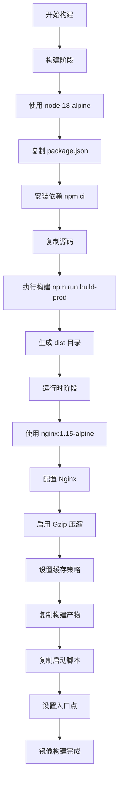
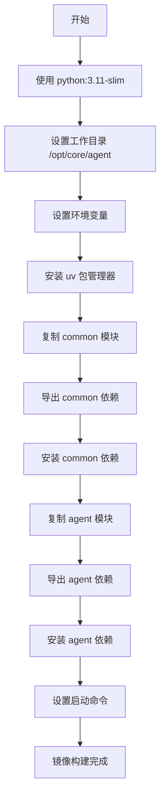
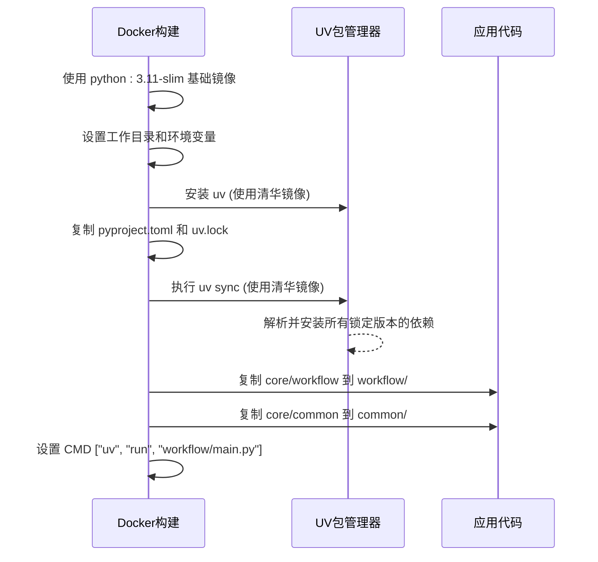
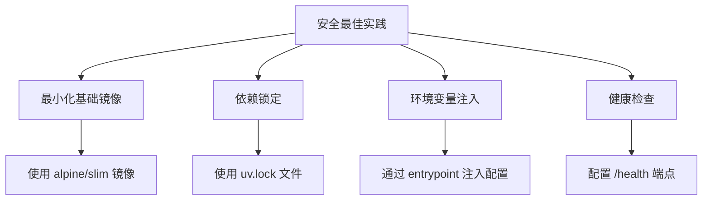

# Docker配置

<cite>
**本文档中引用的文件**  
- [console/frontend/Dockerfile](file://console/frontend/Dockerfile)
- [console/frontend/vite.config.js](file://console/frontend/vite.config.js)
- [console/frontend/package.json](file://console/frontend/package.json)
- [console/frontend/docker-entrypoint.sh](file://console/frontend/docker-entrypoint.sh)
- [core/agent/Dockerfile](file://core/agent/Dockerfile)
- [core/agent/pyproject.toml](file://core/agent/pyproject.toml)
- [core/workflow/Dockerfile](file://core/workflow/Dockerfile)
- [core/workflow/pyproject.toml](file://core/workflow/pyproject.toml)
- [core/common/pyproject.toml](file://core/common/pyproject.toml)
- [docker/astronAgent/astronRPA/volumes/nginx/default.conf](file://docker/astronAgent/astronRPA/volumes/nginx/default.conf)
</cite>

## 目录
1. [前端服务构建分析](#前端服务构建分析)
2. [Agent服务构建分析](#agent服务构建分析)
3. [工作流服务构建分析](#工作流服务构建分析)
4. [安全最佳实践](#安全最佳实践)

## 前端服务构建分析

`console/frontend/Dockerfile` 采用多阶段构建策略，将构建过程分为两个独立阶段：构建阶段和运行时阶段。构建阶段使用 Node.js 18 Alpine 镜像，仅用于编译前端代码。通过先复制 `package*.json` 文件来利用 Docker 缓存机制，提高依赖安装效率。使用 `npm ci` 命令确保依赖安装的可复现性。构建完成后，静态资源被复制到基于 Nginx 的运行时镜像中。

运行时阶段使用 Nginx 1.15 Alpine 镜像，配置了详细的 Nginx 服务器设置，包括 Gzip 压缩、缓存策略和静态资源处理。Gzip 压缩针对文本类资源（如 HTML、CSS、JavaScript）启用，压缩级别优化，同时为图片、字体等二进制资源设置了长达一年的浏览器缓存。通过 `docker-entrypoint.sh` 脚本在容器启动时动态生成运行时配置，实现环境变量注入。

**图源**
- [console/frontend/Dockerfile](file://console/frontend/Dockerfile#L1-L80)

**节源**
- [console/frontend/Dockerfile](file://console/frontend/Dockerfile#L1-L80)
- [console/frontend/vite.config.js](file://console/frontend/vite.config.js#L1-L97)
- [console/frontend/package.json](file://console/frontend/package.json#L1-L136)
- [console/frontend/docker-entrypoint.sh](file://console/frontend/docker-entrypoint.sh#L1-L31)

## Agent服务构建分析

`core/agent/Dockerfile` 采用 Python 3.11 Slim 作为基础镜像，以减小最终镜像体积。构建过程使用 `uv` 包管理器替代传统的 `pip`，以提高依赖解析和安装速度。依赖安装采用分层策略：首先复制并安装 `core/common` 模块的依赖，然后复制并安装 `core/agent` 模块自身的依赖。这种分层安装方式可以利用 Docker 的层缓存机制，当应用代码变更而公共依赖未变时，无需重新安装所有依赖。

构建过程通过 `uv export` 命令将 `pyproject.toml` 中的依赖导出为 `requirements.txt` 格式，然后使用 `uv pip install` 进行安装。最终的镜像仅包含运行应用所需的代码和依赖，通过 `CMD ["python", "main.py"]` 指令启动应用。

**图源**
- [core/agent/Dockerfile](file://core/agent/Dockerfile#L1-L23)

**节源**
- [core/agent/Dockerfile](file://core/agent/Dockerfile#L1-L23)
- [core/agent/pyproject.toml](file://core/agent/pyproject.toml#L1-L227)

## 工作流服务构建分析

`core/workflow/Dockerfile` 同样基于 `python:3.11-slim` 镜像，并使用 `uv` 包管理器进行依赖管理。与 Agent 服务不同，它直接复制 `uv.lock` 和 `pyproject.toml` 文件，然后使用 `uv sync` 命令一次性同步所有依赖。`uv sync` 命令利用 `uv.lock` 文件中的精确版本锁定，确保依赖安装的确定性和可复现性。

为了加速依赖下载，Dockerfile 配置了清华大学的 PyPI 镜像源。构建过程将 `core/workflow` 和 `core/common` 目录分别复制到容器内的 `workflow` 和 `common` 目录。应用通过 `uv run` 命令启动，该命令由 `uv` 工具提供，用于执行 Python 脚本。

**图源**
- [core/workflow/Dockerfile](file://core/workflow/Dockerfile#L1-L34)

**节源**
- [core/workflow/Dockerfile](file://core/workflow/Dockerfile#L1-L34)
- [core/workflow/pyproject.toml](file://core/workflow/pyproject.toml#L1-L105)
- [core/common/pyproject.toml](file://core/common/pyproject.toml#L1-L53)

## 安全最佳实践

各服务的 Dockerfile 遵循了多项安全最佳实践。首先，普遍采用最小化基础镜像（如 `alpine` 和 `slim`），减少攻击面。其次，避免以 root 用户运行容器进程，虽然当前 Dockerfile 未显式创建非 root 用户，但基础镜像通常已配置为非 root 用户运行。

敏感信息保护方面，通过环境变量注入配置（如前端的 `docker-entrypoint.sh` 脚本），避免将密钥硬编码在镜像中。依赖管理使用 `uv` 工具的锁定文件（`uv.lock`），确保生产环境依赖版本的确定性，防止恶意包注入。

此外，Nginx 配置中包含了健康检查端点 `/health`，返回简单的 200 状态码，用于容器健康状态探测。该端点配置为关闭访问日志，减少日志污染。

**图源**
- [docker/astronAgent/astronRPA/volumes/nginx/default.conf](file://docker/astronAgent/astronRPA/volumes/nginx/default.conf#L123-L149)

**节源**
- [console/frontend/docker-entrypoint.sh](file://console/frontend/docker-entrypoint.sh#L1-L31)
- [docker/astronAgent/astronRPA/volumes/nginx/default.conf](file://docker/astronAgent/astronRPA/volumes/nginx/default.conf#L123-L149)