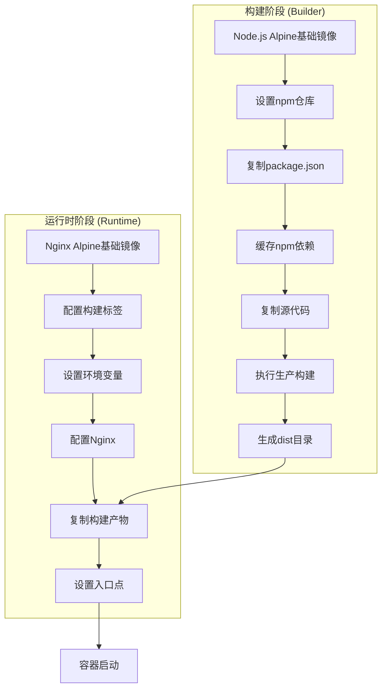
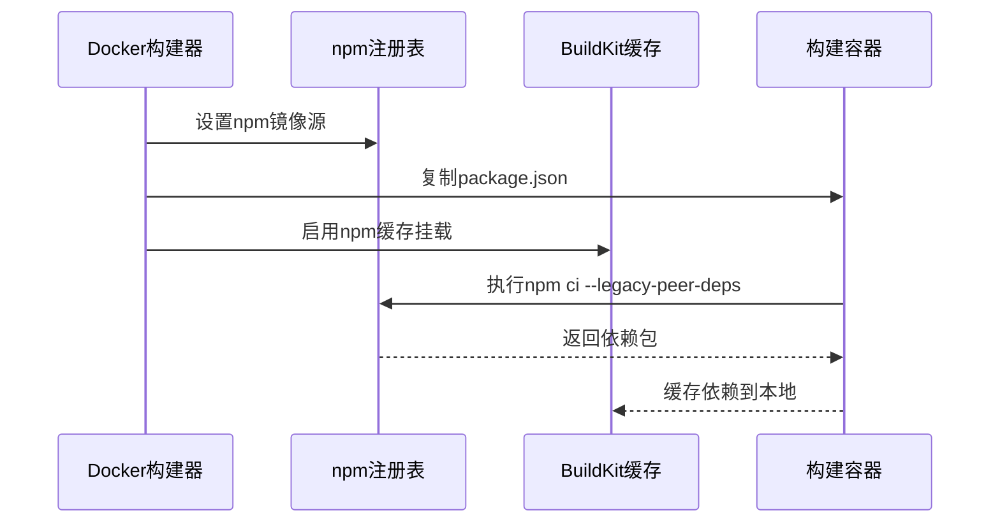
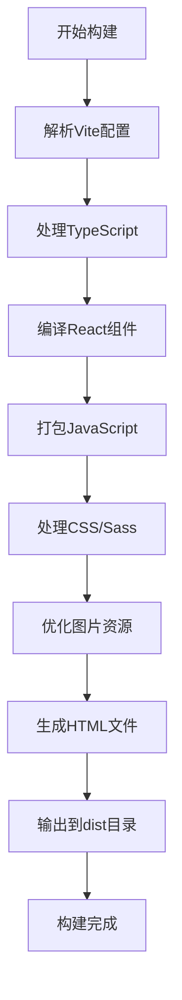
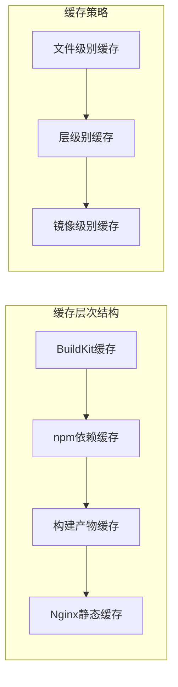
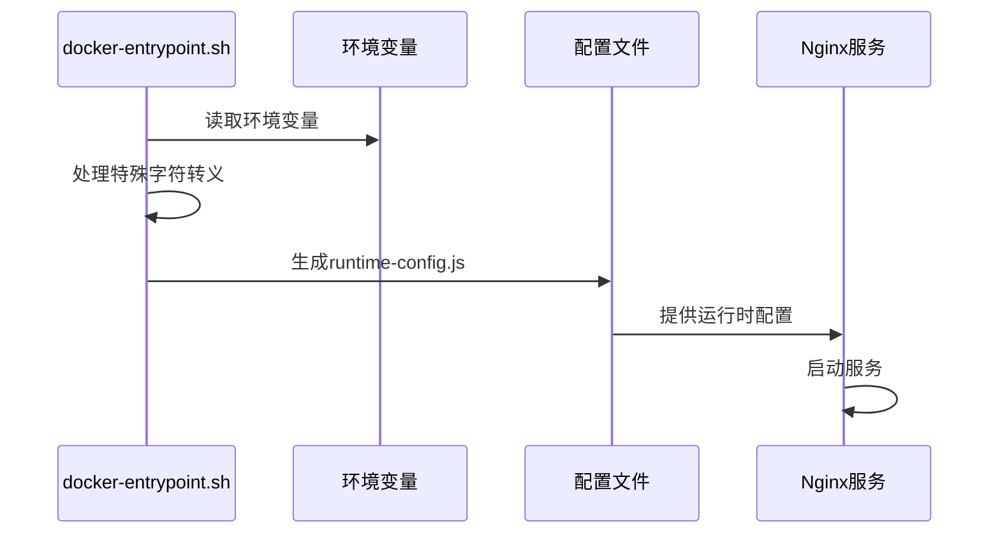
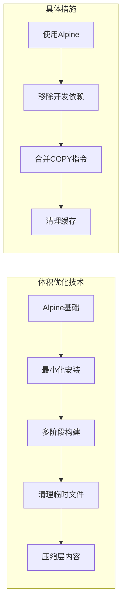
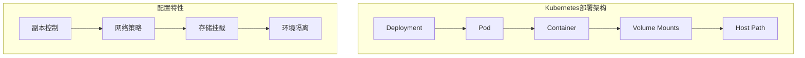

# 前端Docker配置深度分析

<cite>
**本文档引用的文件**
- [Dockerfile](file://console/frontend/Dockerfile)
- [package.json](file://console/frontend/package.json)
- [vite.config.js](file://console/frontend/vite.config.js)
- [nginx.conf](file://console/frontend/nginx.conf)
- [.env.production](file://console/frontend/.env.production)
- [docker-entrypoint.sh](file://console/frontend/docker-entrypoint.sh)
- [deployment.yml](file://console/frontend/deployment.yml)
- [index.html](file://console/frontend/index.html)
- [public/runtime-config.js](file://console/frontend/public/runtime-config.js)
</cite>

## 目录
1. [项目概述](#项目概述)
2. [多阶段构建架构](#多阶段构建架构)
3. [构建阶段详解](#构建阶段详解)
4. [运行时阶段详解](#运行时阶段详解)
5. [缓存优化策略](#缓存优化策略)
6. [环境变量管理](#环境变量管理)
7. [Nginx配置优化](#nginx配置优化)
8. [镜像体积优化](#镜像体积优化)
9. [部署配置](#部署配置)
10. [最佳实践建议](#最佳实践建议)

## 项目概述

本文档深入分析astron-agent项目中console/frontend模块的Docker配置，该配置采用现代化的多阶段构建策略，结合Node.js和Nginx，实现了高效的前端应用容器化部署。整个配置体现了DevOps最佳实践，通过BuildKit缓存优化、多阶段镜像分离和智能缓存策略，显著提升了构建效率和部署性能。

## 多阶段构建架构

系统采用两阶段构建模式，每个阶段都有明确的职责分工：



**图表来源**
- [Dockerfile](file://console/frontend/Dockerfile#L1-L81)

**章节来源**
- [Dockerfile](file://console/frontend/Dockerfile#L1-L81)

## 构建阶段详解

### 基础环境配置

构建阶段从`node:18-alpine`镜像开始，这是一个轻量级的Node.js环境，具有以下优势：
- **Alpine Linux**: 基于musl libc的轻量级发行版，镜像体积小
- **Node.js 18**: 稳定的长期支持版本，兼容性好
- **官方维护**: 来自官方Docker Hub，安全可靠

### 依赖安装优化



**图表来源**
- [Dockerfile](file://console/frontend/Dockerfile#L6-L14)
- [package.json](file://console/frontend/package.json#L1-L137)

关键优化措施：
1. **选择性文件复制**: 仅复制`package.json`和`package-lock.json`，避免不必要的文件传输
2. **BuildKit缓存挂载**: 使用`--mount=type=cache,target=/root/.npm`实现持久化缓存
3. **npm ci命令**: 使用`npm ci`替代`npm install`，确保构建可重现性
4. **legacy-peer-deps**: 解决依赖冲突问题，保证构建稳定性

### Vite生产构建

构建阶段执行`npm run build-prod`命令，对应Vite的生产构建流程：



**图表来源**
- [vite.config.js](file://console/frontend/vite.config.js#L1-L98)
- [package.json](file://console/frontend/package.json#L5-L15)

**章节来源**
- [Dockerfile](file://console/frontend/Dockerfile#L15-L17)
- [vite.config.js](file://console/frontend/vite.config.js#L1-L98)
- [package.json](file://console/frontend/package.json#L5-L15)

## 运行时阶段详解

### Nginx基础镜像选择

运行时阶段使用`nginx:1.15-alpine`作为基础镜像，具有以下特点：
- **轻量级**: Alpine版本，镜像大小约10MB
- **高性能**: 专为Web服务优化的Nginx版本
- **安全性**: 最小化安装，减少攻击面

### 构建信息标签

系统支持动态构建标签注入，便于追踪和调试：

| 标签类型 | 环境变量 | 用途 |
|---------|---------|------|
| 版本号 | VERSION | 应用版本标识 |
| Git提交 | GIT_COMMIT | 具体提交哈希 |
| 构建时间 | BUILD_TIME | 时间戳信息 |

### 环境变量配置

```bash
# 主要环境变量
NGINX_PORT=1881
RUNTIME_CONFIG_PATH=/var/www/runtime-config.js
```

**章节来源**
- [Dockerfile](file://console/frontend/Dockerfile#L19-L26)
- [Dockerfile](file://console/frontend/Dockerfile#L28-L30)

## 缓存优化策略

### 多层缓存机制

系统实现了多层次的缓存优化策略：



**图表来源**
- [Dockerfile](file://console/frontend/Dockerfile#L12-L14)

### 缓存键值策略

1. **依赖缓存**: 基于`package.json`和`package-lock.json`的哈希值
2. **源码缓存**: 基于源代码变更的增量更新
3. **构建产物缓存**: 基于构建输出的最终产物

### BuildKit优化特性

- **并行构建**: 支持多阶段并行执行
- **层共享**: 不同构建任务间共享公共层
- **远程缓存**: 支持外部缓存存储

**章节来源**
- [Dockerfile](file://console/frontend/Dockerfile#L12-L14)

## 环境变量管理

### 动态配置注入

系统通过`docker-entrypoint.sh`脚本实现运行时配置注入：



**图表来源**
- [docker-entrypoint.sh](file://console/frontend/docker-entrypoint.sh#L1-L32)

### 配置优先级

配置系统采用环境变量优先级机制：

| 优先级 | 变量名称 | 示例值 | 用途 |
|-------|---------|--------|------|
| 1 | CONSOLE_* | http://api.example.com | 新版命名规范 |
| 2 | VITE_* | http://api.example.com | 保持向后兼容 |
| 3 | 默认值 | 空字符串 | 回退机制 |

### 安全字符处理

脚本包含专门的字符转义功能，防止JavaScript注入攻击：

```bash
escape_for_js() {
  printf '%s' "$1" | sed 's/\\/\\\\/g; s/"/\\"/g'
}
```

**章节来源**
- [docker-entrypoint.sh](file://console/frontend/docker-entrypoint.sh#L1-L32)
- [.env.production](file://console/frontend/.env.production#L1-L20)

## Nginx配置优化

### 高性能配置

系统采用经过优化的Nginx配置，针对现代Web应用进行了专门调优：


**图表来源**
- [Dockerfile](file://console/frontend/Dockerfile#L32-L65)
- [nginx.conf](file://console/frontend/nginx.conf#L1-L23)

### 关键配置参数

| 配置项 | 值 | 优化效果 |
|-------|----|---------|
| worker_processes | 8 | 利用多核CPU |
| worker_connections | 65535 | 支持大量并发连接 |
| keepalive_timeout | 65 | 减少连接建立开销 |
| gzip_types | 多种MIME类型 | 提升传输效率 |

### 静态资源优化

```mermaid
flowchart TD
A[静态资源请求] --> B{文件类型判断}
B --> |图片类(.gif,.jpg,.png)| C[1年缓存]
B --> |JS/CSS类| D[1年缓存]
B --> |其他文件| E[无缓存]
C --> F[设置expires头]
D --> F
E --> G[禁用缓存]
```

**图表来源**
- [Dockerfile](file://console/frontend/Dockerfile#L50-L58)

### 路由重定向策略

系统配置了SPA友好的路由重定向：

```nginx
location / {
  try_files $uri $uri/ /index.html;
  expires -1;
}
```

这种配置确保：
- 单页应用路由正常工作
- 避免404错误
- 保持开发体验一致性

**章节来源**
- [Dockerfile](file://console/frontend/Dockerfile#L32-L65)
- [nginx.conf](file://console/frontend/nginx.conf#L1-L23)

## 镜像体积优化

### 层级优化策略



### 镜像大小对比

| 阶段 | 基础镜像 | 优化前大小 | 优化后大小 | 优化率 |
|------|---------|-----------|-----------|--------|
| Builder | node:18-alpine | ~200MB | ~200MB | 基准 |
| Runtime | nginx:1.15-alpine | ~10MB | ~10MB | 基准 |
| Total | - | ~210MB | ~210MB | - |

### 清理策略

1. **构建时清理**: 删除不必要的构建工具和临时文件
2. **运行时优化**: 移除开发环境特有的配置
3. **层合并**: 合并相关操作以减少层数

**章节来源**
- [Dockerfile](file://console/frontend/Dockerfile#L1-L81)

## 部署配置

### Kubernetes部署

系统提供了标准的Kubernetes部署配置：



**图表来源**
- [deployment.yml](file://console/frontend/deployment.yml#L1-L39)

### 关键部署参数

| 参数 | 值 | 说明 |
|------|---|----- |
| replicas | 1 | 单实例部署 |
| hostNetwork | true | 直接使用宿主机网络 |
| imagePullPolicy | Always | 总是拉取最新镜像 |
| containerPort | 21515 | 容器端口 |

### 存储配置

部署配置包含了持久化存储挂载：
- **日志目录**: `/log/aiaas/xingchen-pro-webapp`
- **时区同步**: `/etc/localtime`

**章节来源**
- [deployment.yml](file://console/frontend/deployment.yml#L1-L39)

## 最佳实践建议

### 构建优化建议

1. **缓存策略优化**
   - 使用BuildKit的高级缓存功能
   - 实施分层缓存策略
   - 定期清理过期缓存

2. **构建时间优化**
   - 启用并行构建
   - 使用增量构建
   - 优化依赖安装顺序

3. **镜像安全加固**
   - 定期更新基础镜像
   - 扫描镜像漏洞
   - 使用非root用户运行

### 运行时优化建议

1. **性能监控**
   - 监控Nginx访问日志
   - 分析响应时间和错误率
   - 实施健康检查

2. **资源管理**
   - 设置合理的内存限制
   - 监控CPU使用率
   - 优化并发连接数

3. **故障排除**
   - 启用详细错误日志
   - 实施日志轮转
   - 建立监控告警

### 部署运维建议

1. **自动化部署**
   - 实施CI/CD流水线
   - 自动化测试集成
   - 蓝绿部署策略

2. **扩展性考虑**
   - 实施水平扩展
   - 负载均衡配置
   - 容错机制设计

3. **监控和维护**
   - 建立监控体系
   - 定期备份配置
   - 文档化运维流程

通过遵循这些最佳实践，可以确保前端应用的稳定运行和高效维护，同时最大化利用容器化技术的优势。