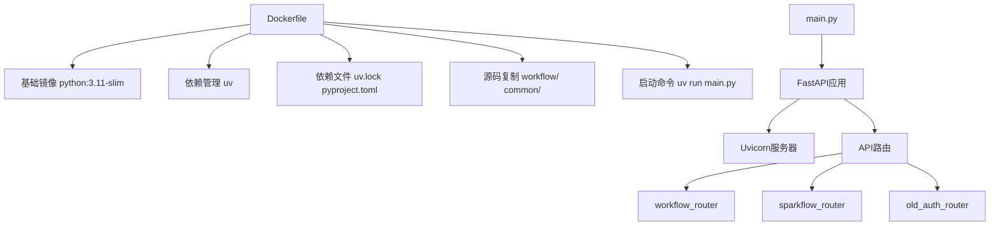
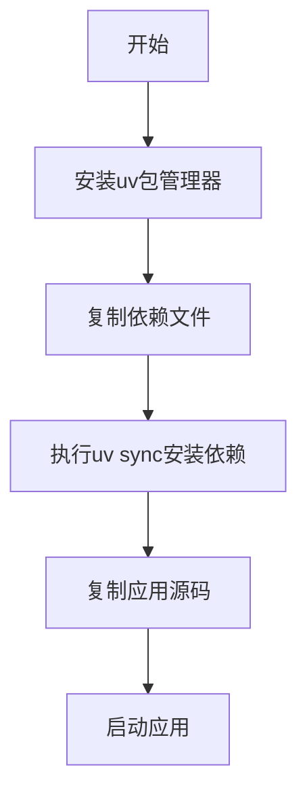
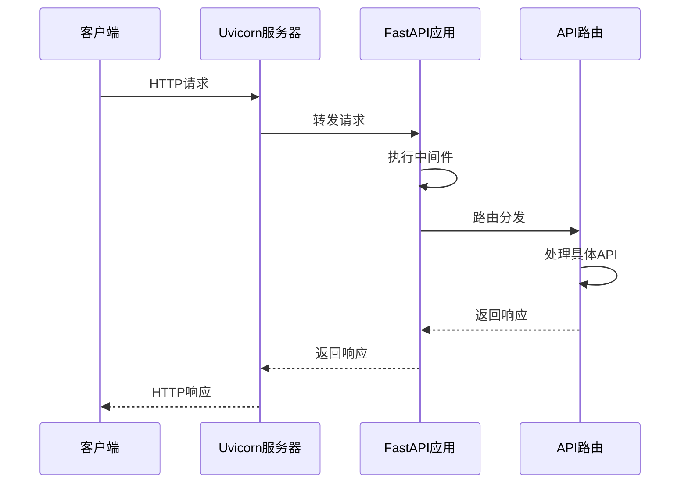
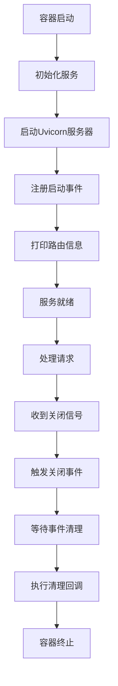
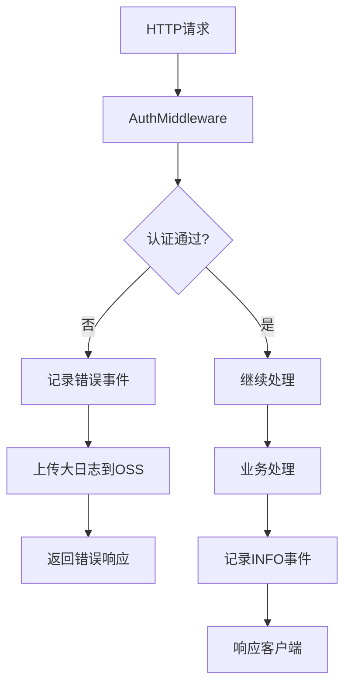
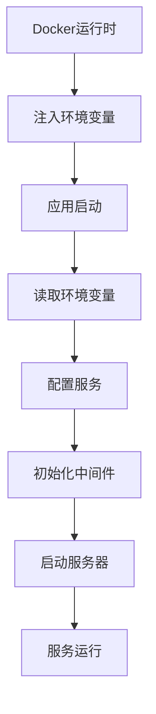
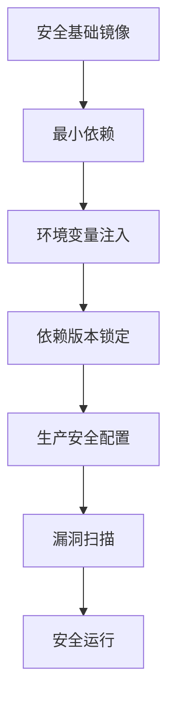

# 工作流服务Docker配置

<cite>
**本文档引用文件**  
- [Dockerfile](file://core/workflow/Dockerfile)
- [pyproject.toml](file://core/workflow/pyproject.toml)
- [uv.lock](file://core/workflow/uv.lock)
- [main.py](file://core/workflow/main.py)
- [router.py](file://core/workflow/api/v1/router.py)
- [auth.py](file://core/workflow/extensions/fastapi/middleware/auth.py)
- [graceful_shutdown.py](file://core/workflow/extensions/graceful_shutdown/graceful_shutdown.py)
- [span.py](file://core/workflow/extensions/otlp/trace/span.py)
- [initialize.py](file://core/workflow/extensions/middleware/initialize.py)
</cite>

## 目录
1. [项目结构](#项目结构)
2. [Python依赖管理](#python依赖管理)
3. [FastAPI与Uvicorn集成](#fastapi与uvicorn集成)
4. [健康检查与容器生命周期](#健康检查与容器生命周期)
5. [日志与监控集成](#日志与监控集成)
6. [环境变量与配置注入](#环境变量与配置注入)
7. [镜像安全加固](#镜像安全加固)
8. [总结](#总结)

## 项目结构

工作流服务的Docker配置位于`core/workflow/Dockerfile`，该文件定义了工作流服务的容器化打包方案。项目采用Python 3.11作为基础运行环境，通过`pyproject.toml`声明依赖，使用`uv`包管理器进行高效安装。服务入口为`main.py`，通过FastAPI框架提供REST API接口，由Uvicorn服务器承载。



**Diagram sources**
- [Dockerfile](file://core/workflow/Dockerfile)
- [main.py](file://core/workflow/main.py)

**Section sources**
- [Dockerfile](file://core/workflow/Dockerfile)
- [main.py](file://core/workflow/main.py)

## Python依赖管理

工作流服务采用现代Python依赖管理方案，通过`pyproject.toml`文件声明项目依赖，使用`uv`包管理器进行依赖解析和安装。`uv`作为新兴的Python包管理器，相比传统`pip`具有更快的依赖解析速度和更高效的安装性能。

在Docker构建过程中，首先安装`uv`包管理器，然后使用其`sync`命令根据`uv.lock`锁定文件精确安装所有依赖，确保构建环境的可重复性和一致性。为加速国内网络环境下的依赖下载，配置了清华大学PyPI镜像源。

```toml
[project]
name = "workflow"
version = "1.0.0"
requires-python = ">=3.11"
dependencies = [
    "fastapi==0.111.1",
    "uvicorn[standard]==0.30.1",
    "aiohttp==3.10.10",
    "pydantic==2.9.2",
    # ... 其他依赖
]
```

依赖管理流程如下：
1. 在Dockerfile中安装`uv`包管理器
2. 复制`pyproject.toml`和`uv.lock`文件
3. 执行`uv sync`命令安装所有依赖
4. 复制应用源代码



**Diagram sources**
- [Dockerfile](file://core/workflow/Dockerfile)
- [pyproject.toml](file://core/workflow/pyproject.toml)

**Section sources**
- [Dockerfile](file://core/workflow/Dockerfile)
- [pyproject.toml](file://core/workflow/pyproject.toml)
- [uv.lock](file://core/workflow/uv.lock)

## FastAPI与Uvicorn集成

工作流服务采用FastAPI作为Web框架，Uvicorn作为ASGI服务器。在`main.py`中通过`create_app()`函数创建和配置FastAPI应用实例，设置CORS跨域策略、中间件和API路由。

Uvicorn服务器的配置在`main.py`的`if __name__ == "__main__":`块中完成，通过`uvicorn.run()`函数启动服务。关键配置参数包括：
- `host="0.0.0.0"`：绑定所有网络接口
- `port`：从环境变量`SERVICE_PORT`获取，默认7880
- `workers`：工作进程数，根据CPU核心数动态计算
- `reload`：开发环境热重载开关
- `log_level`：日志级别，减少运行时日志输出

工作进程数通过`_get_worker_count()`函数计算，若环境变量`WORKERS`未设置，则默认为CPU核心数加1，充分利用多核处理器的并发处理能力。

```python
def _get_worker_count() -> int:
    worker_count: int = int(os.getenv("WORKERS", "0"))
    if worker_count == 0:
        worker_count = multiprocessing.cpu_count() + 1
    return worker_count
```



**Diagram sources**
- [main.py](file://core/workflow/main.py)

**Section sources**
- [main.py](file://core/workflow/main.py)

## 健康检查与容器生命周期

工作流服务实现了完整的容器生命周期管理，包括启动和关闭钩子。在应用启动时，通过`@app.on_event("startup")`装饰器注册启动事件处理器，打印所有注册的路由信息并输出服务启动成功标志。

```python
@app.on_event("startup")
async def print_routes() -> None:
    logger.info("🚀 FastAPI service started successfully!")
    print("🚀 FastAPI service started successfully!")
```

在应用关闭时，实现了优雅关闭（Graceful Shutdown）机制。通过`GracefulShutdown`类监控关闭事件，确保所有正在进行的操作完成后再关闭服务。该机制通过`@app.on_event("shutdown")`注册，执行最终的清理逻辑。

```python
@app.on_event("shutdown")
async def shutdown() -> None:
    await shutdown_handler.run(shutdown_callback=do_final_shutdown_logic)
```

健康检查可通过访问API端点实现，服务正常运行时返回200状态码。容器的健康状态可通过Kubernetes等编排系统的探针进行监控。



**Diagram sources**
- [main.py](file://core/workflow/main.py)
- [graceful_shutdown.py](file://core/workflow/extensions/graceful_shutdown/graceful_shutdown.py)

**Section sources**
- [main.py](file://core/workflow/main.py)
- [graceful_shutdown.py](file://core/workflow/extensions/graceful_shutdown/graceful_shutdown.py)

## 日志与监控集成

工作流服务集成了全面的日志和监控系统。使用`loguru`作为日志记录器，提供结构化日志输出。通过OpenTelemetry实现分布式追踪，关键组件包括`Span`类和`Trace`系统。

`Span`类封装了OpenTelemetry的追踪功能，提供便捷的API用于记录事件、异常和属性。当追踪内容超过10KB大小限制时，系统会自动将其上传至OSS存储，并在追踪中记录链接，避免内存溢出。

```python
def add_info_event(self, value: str, node_log: Optional[NodeLog] = None) -> None:
    value_bytes = value.encode("utf-8")
    if len(value_bytes) >= SPAN_SIZE_LIMIT:
        try:
            trace_link = get_oss_service().upload_file(f"{str(uuid.uuid4())}", value_bytes)
            value = f"trace_link: {trace_link}"
        except Exception:
            value = "Content too large, failed to upload to OSS storage"
    self.get_otlp_span().add_event("INFO", attributes={"INFO LOG": value})
```

认证中间件`AuthMiddleware`也集成了追踪功能，在认证失败时记录详细的错误信息和追踪上下文，便于问题排查。



**Diagram sources**
- [span.py](file://core/workflow/extensions/otlp/trace/span.py)
- [auth.py](file://core/workflow/extensions/fastapi/middleware/auth.py)

**Section sources**
- [span.py](file://core/workflow/extensions/otlp/trace/span.py)
- [auth.py](file://core/workflow/extensions/fastapi/middleware/auth.py)

## 环境变量与配置注入

工作流服务通过环境变量实现配置注入，支持灵活的部署配置。关键环境变量包括：

- `SERVICE_PORT`：服务监听端口，默认7880
- `WORKERS`：Uvicorn工作进程数，0表示自动计算
- `RELOAD`：开发模式热重载开关
- `LOG_LEVEL`：日志级别
- `SHUTDOWN_INTERVAL`：关闭检查间隔
- `SHUTDOWN_TIMEOUT`：关闭超时时间
- `APP_MANAGE_PLAT_KEY`：应用管理平台API密钥
- `APP_MANAGE_PLAT_SECRET`：应用管理平台API密钥
- `APP_MANAGE_PLAT_BASE_URL`：应用管理平台基础URL
- `OTLP_TRACE_NAME`：OpenTelemetry追踪名称

这些环境变量在Docker运行时注入，实现配置与代码的分离。例如，通过`os.getenv()`获取环境变量值：

```python
port=int(os.getenv("SERVICE_PORT", "7880"))
worker_count: int = int(os.getenv("WORKERS", "0"))
```

中间件和服务的初始化也依赖环境变量，如认证中间件从环境变量获取API密钥和密钥，确保敏感信息不硬编码在代码中。



**Diagram sources**
- [main.py](file://core/workflow/main.py)
- [auth.py](file://core/workflow/extensions/fastapi/middleware/auth.py)

**Section sources**
- [main.py](file://core/workflow/main.py)
- [auth.py](file://core/workflow/extensions/fastapi/middleware/auth.py)

## 镜像安全加固

工作流服务Docker镜像采用多项安全加固措施，确保服务的可靠运行。首先，使用`python:3.11-slim`作为基础镜像，这是一个轻量级的Python运行环境，减少了攻击面。

通过设置最小权限原则，避免以root用户运行容器。虽然Dockerfile中未显式创建非特权用户，但建议在生产部署时通过Kubernetes安全上下文或Docker运行时参数指定非root用户。

敏感信息保护方面，所有密钥和凭证均通过环境变量注入，不存储在镜像中。`uv.lock`文件锁定依赖版本，防止依赖劫持攻击。

```dockerfile
# 使用轻量级基础镜像
FROM python:3.11-slim

# 配置环境变量
ENV UV_NO_CACHE=1
```

建议的生产安全配置包括：
1. 创建非root运行用户
2. 设置文件系统只读权限
3. 限制容器资源使用
4. 启用漏洞扫描
5. 定期更新基础镜像



**Diagram sources**
- [Dockerfile](file://core/workflow/Dockerfile)

**Section sources**
- [Dockerfile](file://core/workflow/Dockerfile)

## 总结

工作流服务的Docker配置方案全面而高效，采用现代Python技术栈和最佳实践。通过`uv`包管理器实现快速依赖安装，FastAPI与Uvicorn的组合提供高性能的API服务。服务具备完善的生命周期管理、日志监控和安全加固措施，确保在生产环境中的可靠运行。

关键优势包括：
- **高效依赖管理**：使用`uv`和`uv.lock`确保依赖安装快速且可重复
- **高性能服务**：多工作进程配置充分利用多核CPU
- **优雅关闭**：确保服务关闭时正在进行的操作能安全完成
- **全面监控**：集成OpenTelemetry分布式追踪和结构化日志
- **安全可靠**：轻量级镜像、环境变量配置和依赖锁定

该配置方案为工作流服务提供了稳定、可扩展和安全的运行环境，适合在Kubernetes等容器编排平台上大规模部署。