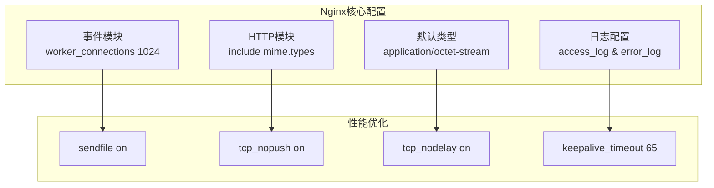
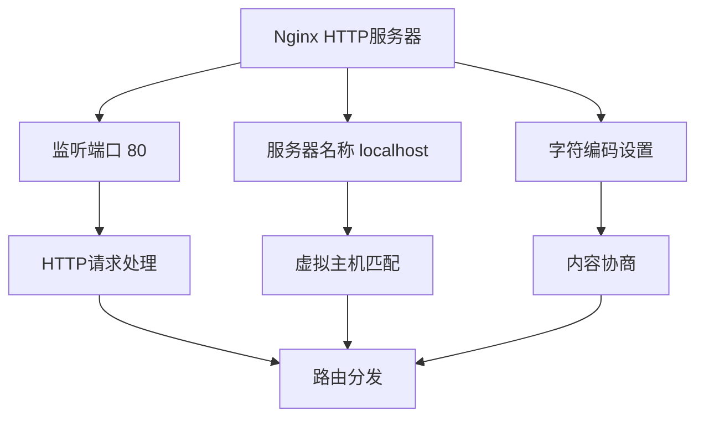
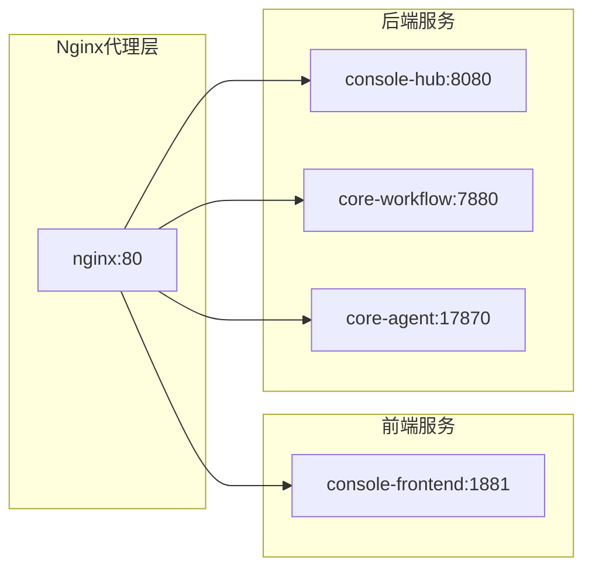
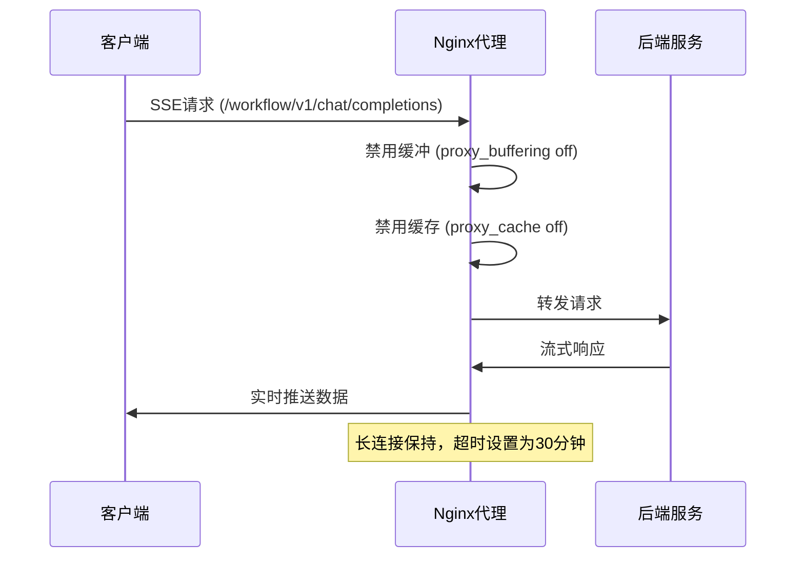
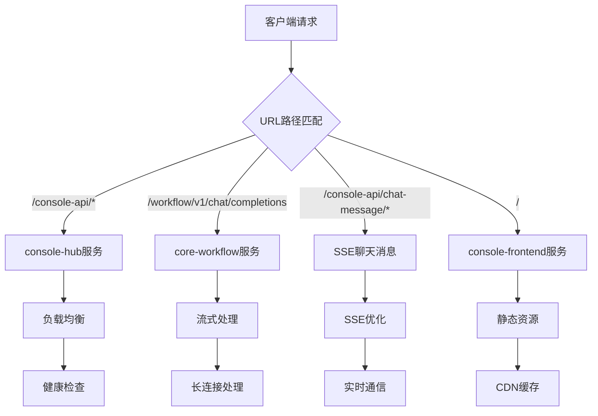
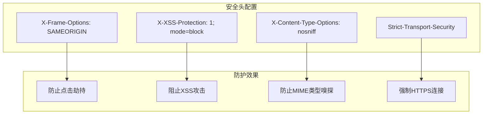
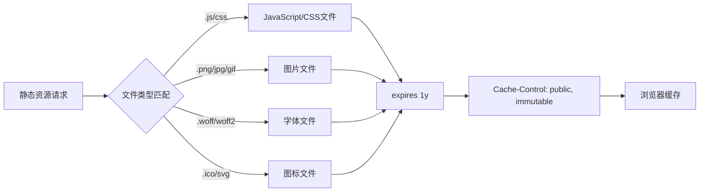
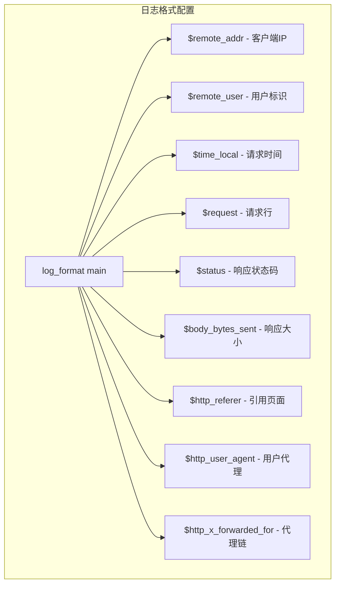
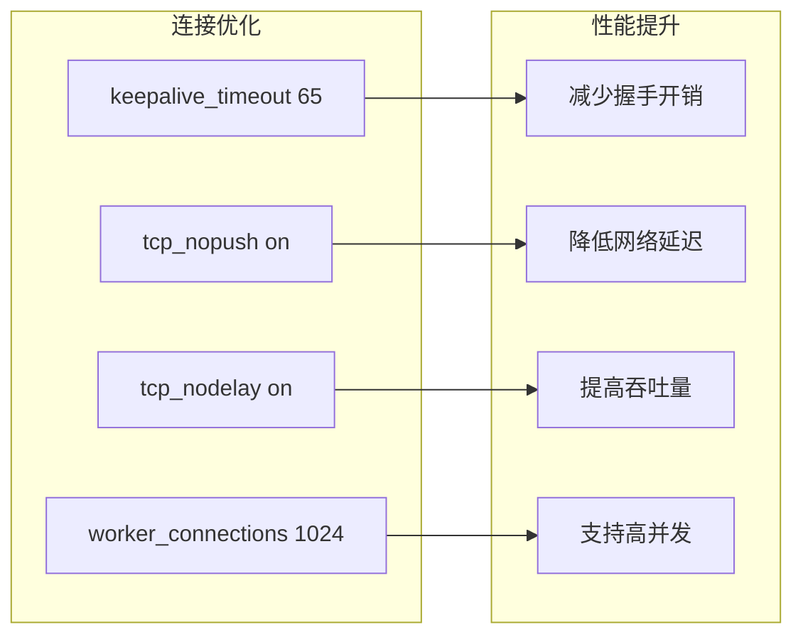

# Nginx配置详解

<cite>
**本文档中引用的文件**
- [nginx.conf](file://docker/astronAgent/nginx/nginx.conf)
- [docker-compose.yaml](file://docker/astronAgent/docker-compose.yaml)
- [docker-compose-auth.yml](file://docker/astronAgent/docker-compose-auth.yml)
- [proxy.conf](file://docker/ragflow/nginx/proxy.conf)
- [ragflow.https.conf](file://docker/ragflow/nginx/ragflow.https.conf)
</cite>

## 目录
1. [概述](#概述)
2. [基础配置架构](#基础配置架构)
3. [HTTP服务器配置](#http服务器配置)
4. [反向代理配置](#反向代理配置)
5. [SSE流式接口处理](#sse流式接口处理)
6. [API路由规则](#api路由规则)
7. [安全头配置](#安全头配置)
8. [静态资源优化](#静态资源优化)
9. [日志配置](#日志配置)
10. [性能优化策略](#性能优化策略)
11. [故障排除指南](#故障排除指南)

## 概述

本文档详细分析了astron-agent项目中Nginx反向代理服务器的配置策略。该配置文件作为系统的入口点，负责处理客户端请求、实现负载均衡、提供安全保护以及优化性能。配置采用了现代Web服务器的最佳实践，支持多种服务类型和复杂的路由需求。

## 基础配置架构

### 工作进程配置

**图表来源**
- [nginx.conf](file://docker/astronAgent/nginx/nginx.conf#L1-L150)

### 网络连接管理

系统配置为每个工作进程处理1024个并发连接，采用事件驱动模型处理高并发请求。网络优化参数包括：

- **sendfile**: 启用零拷贝技术，提高文件传输效率
- **tcp_nopush**: 在发送响应时启用TCP_NOPUSH选项，减少小包传输
- **tcp_nodelay**: 禁用Nagle算法，降低实时数据传输延迟
- **keepalive_timeout**: 设置65秒的长连接超时时间

**章节来源**
- [nginx.conf](file://docker/astronAgent/nginx/nginx.conf#L1-L150)

## HTTP服务器配置

### 监听配置

**图表来源**
- [nginx.conf](file://docker/astronAgent/nginx/nginx.conf#L32-L34)

### 字符编码与MIME类型

配置文件包含了完整的MIME类型映射，支持现代Web应用的各种文件格式。默认类型设置为二进制流，确保所有未明确指定类型的文件都能正确处理。

**章节来源**
- [nginx.conf](file://docker/astronAgent/nginx/nginx.conf#L32-L34)

## 反向代理配置

### 服务发现与负载均衡

**图表来源**
- [docker-compose.yaml](file://docker/astronAgent/docker-compose.yaml#L580-L614)

### 代理头部配置

所有代理请求都设置了标准的转发头部信息：

- **Host**: 保持原始请求的主机名
- **X-Real-IP**: 记录客户端真实IP地址
- **X-Forwarded-For**: 维护完整的代理链路
- **X-Forwarded-Proto**: 识别原始协议（HTTP/HTTPS）

**章节来源**
- [nginx.conf](file://docker/astronAgent/nginx/nginx.conf#L40-L50)

## SSE流式接口处理

### Server-Sent Events特殊配置

SSE（Server-Sent Events）是实现实时通信的关键组件，需要特殊的代理配置来保证数据流的连续性和实时性。

**图表来源**
- [nginx.conf](file://docker/astronAgent/nginx/nginx.conf#L52-L85)

### SSE配置详解

| 配置项 | 值 | 作用 |
|--------|-----|------|
| proxy_buffering | off | 禁用缓冲，确保实时性 |
| proxy_cache | off | 禁用缓存，避免数据延迟 |
| proxy_http_version | 1.1 | 使用HTTP/1.1协议 |
| chunked_transfer_encoding | on | 启用分块传输编码 |
| proxy_connect_timeout | 60s | 连接超时60秒 |
| proxy_send_timeout | 1800s | 发送超时30分钟 |
| proxy_read_timeout | 1800s | 读取超时30分钟 |

### 特殊头部设置

- **Cache-Control**: 设置为"no-cache"，防止浏览器缓存SSE流
- **X-Accel-Buffering**: 设置为"no"，进一步确保不缓冲响应
- **Connection**: 清空连接头部，使用持久连接

**章节来源**
- [nginx.conf](file://docker/astronAgent/nginx/nginx.conf#L52-L85)

## API路由规则

### 微服务负载均衡机制

**图表来源**
- [nginx.conf](file://docker/astronAgent/nginx/nginx.conf#L87-L149)

### 路由优先级与匹配规则

1. **SSE专用路由** (`/workflow/v1/chat/completions`): 最高优先级，专门处理实时流式数据
2. **聊天消息路由** (`/console-api/chat-message/`): 第二优先级，处理SSE聊天消息
3. **API路由** (`/console-api/`): 中等优先级，处理后端API请求
4. **默认路由** (`/`): 最低优先级，处理前端应用请求

### 服务间通信配置

| 服务名称 | 内部端口 | 外部暴露 | 超时设置 |
|----------|----------|----------|----------|
| console-frontend | 1881 | 80 | 30s |
| console-hub | 8080 | - | 30s |
| core-workflow | 7880 | - | 30s |
| core-agent | 17870 | - | 30s |

**章节来源**
- [nginx.conf](file://docker/astronAgent/nginx/nginx.conf#L87-L149)

## 安全头配置

### HTTP安全头策略

**图表来源**
- [nginx.conf](file://docker/astronAgent/nginx/nginx.conf#L36-L39)

### 安全头详解

1. **X-Frame-Options: SAMEORIGIN**
   - 限制页面只能被同源网站嵌入iframe
   - 防止点击劫持攻击

2. **X-XSS-Protection: 1; mode=block**
   - 启用浏览器内置的XSS过滤器
   - 当检测到XSS攻击时阻止页面加载

3. **X-Content-Type-Options: nosniff**
   - 禁止浏览器 MIME 类型嗅探
   - 强制执行服务器声明的内容类型

**章节来源**
- [nginx.conf](file://docker/astronAgent/nginx/nginx.conf#L36-L39)

## 静态资源优化

### 缓存策略配置

**图表来源**
- [nginx.conf](file://docker/astronAgent/nginx/nginx.conf#L42-L50)

### 缓存配置详解

| 文件类型 | 缓存时间 | 缓存策略 |
|----------|----------|----------|
| JavaScript/CSS | 1年 | public, immutable |
| 图片文件 | 1年 | public, immutable |
| 字体文件 | 1年 | public, immutable |
| 图标文件 | 1年 | public, immutable |

### Gzip压缩配置

系统启用了Gzip压缩以减少传输数据量：

- **压缩触发条件**: 文件大小超过1000字节
- **压缩类型**: 支持文本、CSS、JavaScript、XML等格式
- **压缩级别**: 默认级别，平衡压缩率和CPU使用

**章节来源**
- [nginx.conf](file://docker/astronAgent/nginx/nginx.conf#L25-L33)

## 日志配置

### 日志格式定义

**图表来源**
- [nginx.conf](file://docker/astronAgent/nginx/nginx.conf#L8-L12)

### 日志记录策略

1. **访问日志**: 使用自定义格式记录所有请求
2. **错误日志**: 记录警告级别以上的错误信息
3. **健康检查**: 特殊路径 `/nginx-health` 不记录访问日志

### 日志轮转建议

- **访问日志**: 按天轮转，保留30天历史
- **错误日志**: 按周轮转，保留12周历史
- **存储位置**: `/var/log/nginx/` 目录下

**章节来源**
- [nginx.conf](file://docker/astronAgent/nginx/nginx.conf#L8-L15)

## 性能优化策略

### 连接池优化

**图表来源**
- [nginx.conf](file://docker/astronAgent/nginx/nginx.conf#L15-L20)

### 缓冲区配置

对于不同的服务类型，配置了差异化的缓冲策略：

1. **SSE服务**: 禁用缓冲，确保实时性
2. **静态资源**: 启用缓冲，提高I/O效率
3. **API服务**: 标准缓冲，平衡性能和内存使用

### 内存管理

- **proxy_buffer_size**: 1024k，适用于大多数请求
- **proxy_buffers**: 16个1024k缓冲区
- **proxy_busy_buffers_size**: 2048k，避免缓冲区溢出

**章节来源**
- [nginx.conf](file://docker/astronAgent/nginx/nginx.conf#L15-L20)

## 故障排除指南

### 常见问题诊断

| 问题类型 | 症状 | 解决方案 |
|----------|------|----------|
| 连接超时 | 请求长时间无响应 | 检查后端服务健康状态 |
| 缓冲问题 | 数据传输中断 | 调整proxy_buffer相关参数 |
| 内存不足 | 服务崩溃 | 优化缓冲区大小配置 |
| 权限错误 | 无法访问资源 | 检查文件权限和SELinux设置 |

### 监控指标

1. **连接数监控**: worker_connections使用率
2. **响应时间监控**: 各服务的平均响应时间
3. **错误率监控**: 4xx和5xx状态码统计
4. **资源使用监控**: CPU、内存、磁盘I/O使用情况

### 调试工具

- **curl命令**: 测试特定URL的响应
- **nginx -t**: 验证配置文件语法
- **tail -f**: 实时查看日志文件
- **netstat**: 检查网络连接状态

**章节来源**
- [nginx.conf](file://docker/astronAgent/nginx/nginx.conf#L145-L150)

## 结论

astron-agent项目的Nginx配置体现了现代Web服务器的最佳实践，通过合理的架构设计和性能优化，为整个系统提供了稳定、高效的反向代理服务。配置文件不仅满足了当前的功能需求，还具备良好的扩展性和维护性，为未来的功能扩展奠定了坚实的基础。

关键优势包括：
- **高性能**: 优化的网络参数和缓冲策略
- **安全性**: 完善的安全头配置和访问控制
- **可维护性**: 清晰的配置结构和详细的注释
- **可扩展性**: 灵活的路由规则和服务发现机制