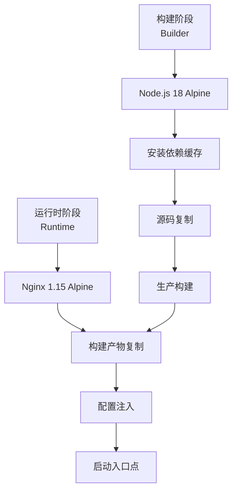
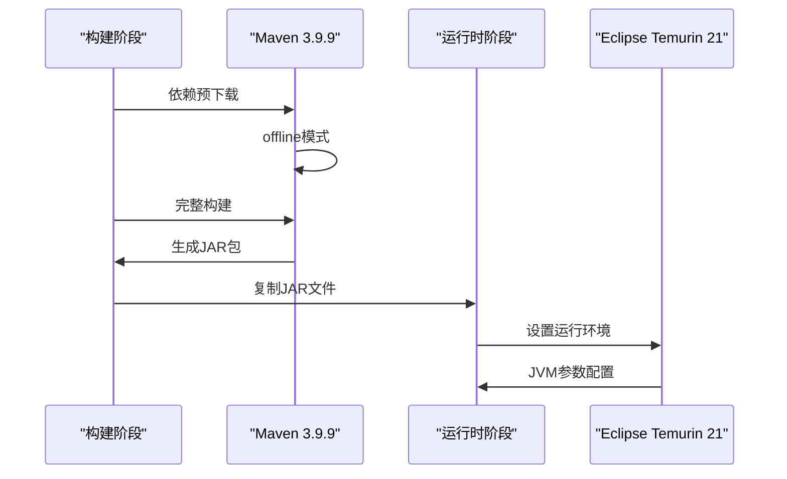
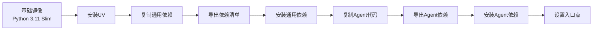
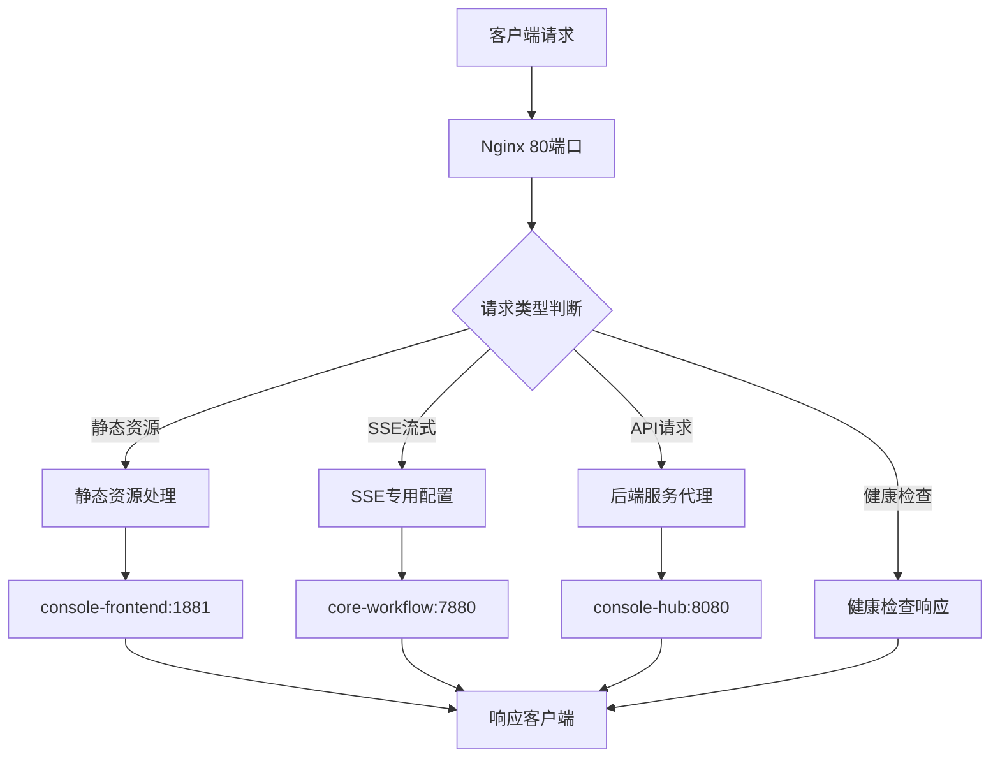
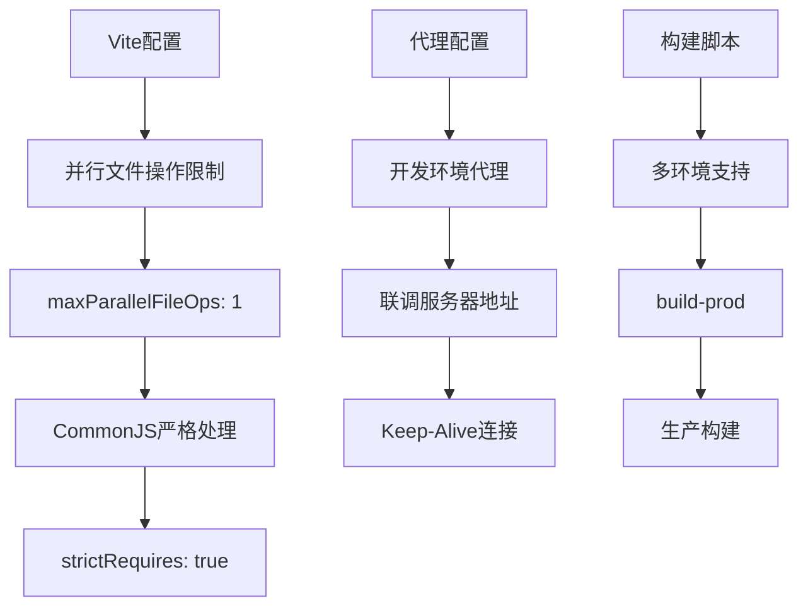
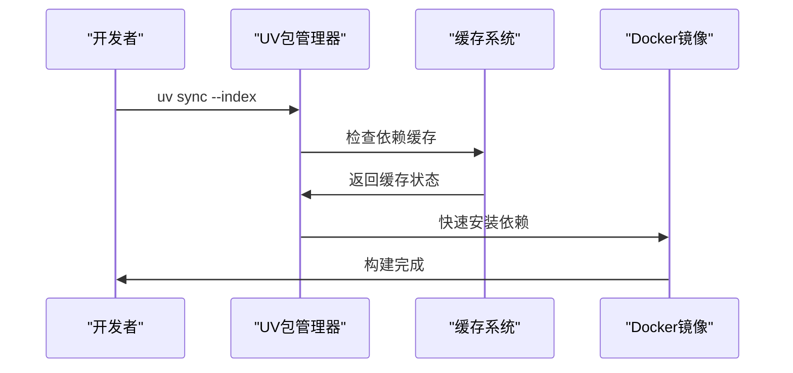
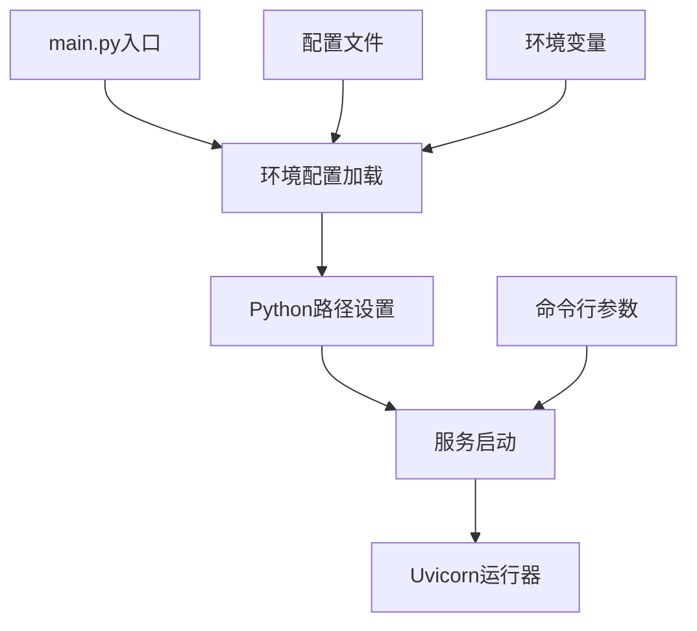
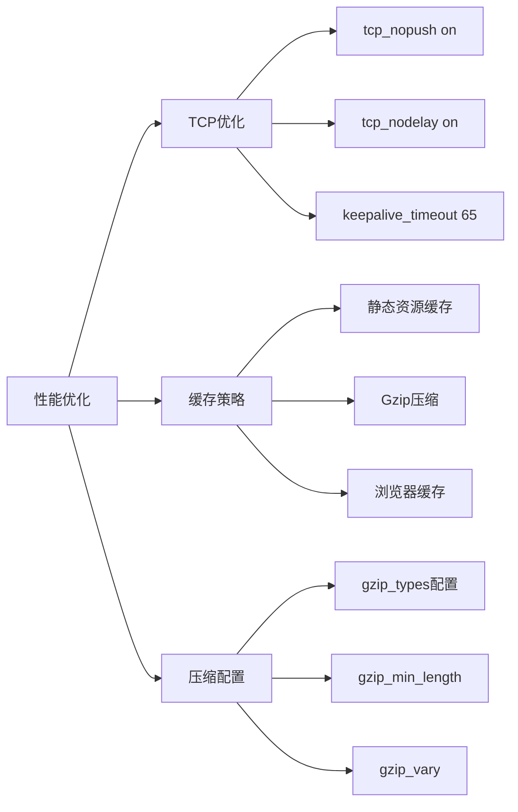
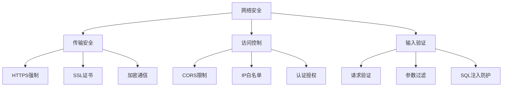

# 服务配置

<cite>
**本文档中引用的文件**
- [console/frontend/Dockerfile](file://console/frontend/Dockerfile)
- [console/backend/hub/Dockerfile](file://console/backend/hub/Dockerfile)
- [core/agent/Dockerfile](file://core/agent/Dockerfile)
- [core/workflow/Dockerfile](file://core/workflow/Dockerfile)
- [docker/astronAgent/nginx/nginx.conf](file://docker/astronAgent/nginx/nginx.conf)
- [console/frontend/vite.config.js](file://console/frontend/vite.config.js)
- [console/frontend/package.json](file://console/frontend/package.json)
- [console/frontend/docker-entrypoint.sh](file://console/frontend/docker-entrypoint.sh)
- [core/agent/pyproject.toml](file://core/agent/pyproject.toml)
- [core/workflow/pyproject.toml](file://core/workflow/pyproject.toml)
- [core/agent/main.py](file://core/agent/main.py)
- [core/workflow/main.py](file://core/workflow/main.py)
- [core/agent/config.env.example](file://core/agent/config.env.example)
- [core/workflow/config.env](file://core/workflow/config.env)
</cite>

## 目录
1. [项目概述](#项目概述)
2. [前端服务Dockerfile分析](#前端服务dockerfile分析)
3. [后端服务Dockerfile分析](#后端服务dockerfile分析)
4. [核心服务Dockerfile分析](#核心服务dockerfile分析)
5. [Nginx反向代理配置详解](#nginx反向代理配置详解)
6. [Vite构建优化策略](#vite构建优化策略)
7. [Python依赖管理与多阶段构建](#python依赖管理与多阶段构建)
8. [FastAPI应用打包策略](#fastapi应用打包策略)
9. [性能优化与缓存策略](#性能优化与缓存策略)
10. [安全配置与最佳实践](#安全配置与最佳实践)

## 项目概述

Astron-Agent是一个基于微服务架构的智能代理系统，采用前后端分离的设计模式。项目包含多个核心服务，每个服务都经过精心设计的Docker容器化部署方案，确保高效、安全、可扩展的应用运行环境。

### 架构特点

- **多层架构**：前端React应用、后端Java服务、Python核心服务
- **微服务设计**：独立的服务模块，便于维护和扩展
- **容器化部署**：统一的Docker构建流程和镜像优化策略
- **反向代理**：Nginx作为统一入口，提供负载均衡和流量路由

## 前端服务Dockerfile分析

前端服务采用多阶段构建策略，结合Vite构建工具实现高效的静态资源处理。

### 多阶段构建架构

**图表来源**
- [console/frontend/Dockerfile](file://console/frontend/Dockerfile#L1-L81)

### 构建阶段优化

前端构建采用了BuildKit缓存挂载技术，显著提升构建效率：

- **依赖缓存**：通过`npm ci`配合缓存挂载，避免重复下载
- **分层构建**：先复制依赖清单，再复制源码，最大化缓存命中率
- **平台兼容**：支持跨平台构建，适应CI/CD环境需求

### 运行时配置

运行时阶段集成了完整的Nginx配置，提供高性能的静态资源服务：

- **性能优化**：启用Gzip压缩、keepalive连接、sendfile等优化选项
- **安全配置**：配置适当的错误日志级别和访问控制
- **版本标记**：通过LABEL指令添加构建信息，便于追踪和调试

**章节来源**
- [console/frontend/Dockerfile](file://console/frontend/Dockerfile#L1-L81)
- [console/frontend/docker-entrypoint.sh](file://console/frontend/docker-entrypoint.sh#L1-L32)

## 后端服务Dockerfile分析

后端服务采用Maven构建和JVM优化策略，针对企业级应用进行了深度优化。

### 多阶段构建流程

**图表来源**
- [console/backend/hub/Dockerfile](file://console/backend/hub/Dockerfile#L1-L40)

### JVM优化配置

后端服务采用了多项JVM优化策略：

- **容器支持**：启用`-XX:+UseContainerSupport`自动调整内存限制
- **内存管理**：设置`-XX:MaxRAMPercentage=75.0`合理使用容器内存
- **垃圾回收**：采用G1GC收集器，平衡吞吐量和延迟
- **字符串去重**：启用`-XX:+UseStringDeduplication`减少内存占用

### 国际化配置

构建过程中包含了完整的国际化支持：

- **时区设置**：配置Asia/Shanghai时区，确保日志时间准确性
- **语言环境**：设置UTF-8编码，支持多语言字符显示
- **本地化清理**：移除不必要的包，减小镜像体积

**章节来源**
- [console/backend/hub/Dockerfile](file://console/backend/hub/Dockerfile#L1-L40)

## 核心服务Dockerfile分析

核心服务包含Agent和Workflow两个主要组件，均采用Python 3.11环境，展现了不同的构建策略。

### Agent服务构建策略

Agent服务采用UV包管理器实现快速依赖安装：

**图表来源**
- [core/agent/Dockerfile](file://core/agent/Dockerfile#L1-L24)

### Workflow服务构建策略

Workflow服务同样采用UV包管理器，但针对FastAPI应用进行了专门优化：

- **包管理器选择**：使用Tsinghua大学镜像源，提升下载速度
- **依赖隔离**：分别处理公共依赖和应用特定依赖
- **命令优化**：直接使用UV运行应用，简化启动流程

### 共同特点

两个核心服务都体现了现代Python应用的最佳实践：

- **轻量化基础**：基于slim镜像，最小化攻击面
- **依赖管理**：使用现代化包管理工具，提升安装效率
- **路径配置**：正确设置PYTHONPATH，确保模块导入正常

**章节来源**
- [core/agent/Dockerfile](file://core/agent/Dockerfile#L1-L24)
- [core/workflow/Dockerfile](file://core/workflow/Dockerfile#L1-L35)

## Nginx反向代理配置详解

Nginx作为系统的统一入口，承担着反向代理、负载均衡和流量路由的重要职责。

### 整体架构设计

**图表来源**
- [docker/astronAgent/nginx/nginx.conf](file://docker/astronAgent/nginx/nginx.conf#L1-L150)

### SSE流式接口特殊处理

Nginx对Server-Sent Events（SSE）接口进行了专门优化：

#### 核心配置特性

- **禁用缓冲**：`proxy_buffering off`确保实时数据传输
- **长连接支持**：设置30分钟超时，适应长时间连接需求
- **HTTP/1.1**：使用HTTP/1.1协议，支持持久连接
- **分块传输**：启用`chunked_transfer_encoding on`

#### 配置细节对比

| 配置项 | Chat Completions | Chat Messages |
|--------|------------------|---------------|
| 超时设置 | 30分钟读写超时 | 30分钟读写超时 |
| 缓冲策略 | 禁用缓冲 | 禁用缓冲 |
| 连接类型 | 持久连接 | 持久连接 |
| 缓存控制 | no-cache | no-cache |

### 安全头配置

Nginx实现了完整的安全头配置，保护应用免受常见Web攻击：

- **X-Frame-Options**: "SAMEORIGIN"防止点击劫持
- **X-XSS-Protection**: "1; mode=block"启用XSS过滤
- **X-Content-Type-Options**: "nosniff"防止MIME类型嗅探

### 静态资源优化

针对不同类型的静态资源，Nginx采用了差异化的缓存策略：

- **长期缓存**：CSS、JS、图片等文件设置1年过期时间
- **即时生效**：HTML文件不设置缓存，确保内容实时更新
- **压缩传输**：启用Gzip压缩，减少带宽消耗

**章节来源**
- [docker/astronAgent/nginx/nginx.conf](file://docker/astronAgent/nginx/nginx.conf#L1-L150)

## Vite构建优化策略

前端构建系统采用了多项优化措施，确保开发体验和生产性能的平衡。

### 构建配置优化

Vite配置针对生产环境进行了专门优化：

**图表来源**
- [console/frontend/vite.config.js](file://console/frontend/vite.config.js#L1-L98)

### 开发环境代理

Vite提供了灵活的开发环境代理配置：

- **多目标支持**：支持多个后端服务的代理转发
- **Keep-Alive优化**：配置长连接保持，提升开发体验
- **路径重写**：自动处理API路径前缀问题

### 生产构建优化

生产环境构建采用了多项性能优化：

- **并行限制**：限制并行文件操作数，避免磁盘I/O瓶颈
- **严格处理**：强制所有CommonJS模块被严格处理
- **环境变量**：支持多种构建模式，满足不同部署需求

**章节来源**
- [console/frontend/vite.config.js](file://console/frontend/vite.config.js#L1-L98)
- [console/frontend/package.json](file://console/frontend/package.json#L1-L137)

## Python依赖管理与多阶段构建

Python服务采用了现代化的依赖管理策略，结合多阶段构建实现高效的镜像构建。

### UV包管理器优势

**图表来源**
- [core/workflow/Dockerfile](file://core/workflow/Dockerfile#L15-L20)

### 依赖管理策略

两个Python服务采用了不同的依赖管理策略：

#### Agent服务策略
- **分层依赖**：先安装通用依赖，再安装应用特定依赖
- **系统安装**：使用`--system`参数直接安装到系统环境中
- **环境隔离**：通过工作目录隔离不同服务的依赖

#### Workflow服务策略
- **统一管理**：使用UV统一管理所有依赖
- **镜像优化**：利用Tsinghua镜像源加速下载
- **简洁配置**：最小化配置文件，专注于核心功能

### 性能优化

依赖安装过程采用了多项性能优化：

- **缓存利用**：充分利用包管理器的缓存机制
- **并行处理**：支持并行依赖安装
- **增量更新**：只更新变化的依赖包

**章节来源**
- [core/agent/pyproject.toml](file://core/agent/pyproject.toml#L1-L228)
- [core/workflow/pyproject.toml](file://core/workflow/pyproject.toml#L1-L106)

## FastAPI应用打包策略

FastAPI应用采用了现代化的打包策略，确保应用的可移植性和性能。

### 应用启动流程

**图表来源**
- [core/workflow/main.py](file://core/workflow/main.py#L1-L168)

### 中间件配置

FastAPI应用集成了多项中间件：

- **CORS中间件**：支持跨域请求处理
- **OTLP中间件**：集成可观测性功能
- **认证中间件**：提供统一的认证机制

### 生命周期管理

应用实现了完整的生命周期管理：

- **启动事件**：记录所有注册的路由信息
- **关闭事件**：执行优雅关闭逻辑
- **健康检查**：提供应用状态监控

### 性能配置

应用针对不同环境进行了性能优化：

- **工作进程**：根据CPU核心数动态调整
- **WebSocket配置**：禁用ping间隔，减少网络开销
- **日志级别**：生产环境降低日志级别

**章节来源**
- [core/agent/main.py](file://core/agent/main.py#L1-L110)
- [core/workflow/main.py](file://core/workflow/main.py#L1-L168)

## 性能优化与缓存策略

系统在多个层面实施了性能优化和缓存策略，确保最佳的用户体验。

### Nginx性能配置

Nginx配置了多项性能优化选项：

### 缓存控制策略

系统采用了分层的缓存控制策略：

#### 静态资源缓存
- **长期缓存**：CSS、JS、图片等文件设置1年过期时间
- **即时生效**：HTML文件不设置缓存，确保内容实时更新
- **版本控制**：通过文件名哈希实现缓存失效

#### API响应缓存
- **无缓存**：API响应不设置缓存，确保数据一致性
- **SSE流**：禁用缓冲，保证实时性
- **错误页面**：设置适当的缓存策略

### 数据库连接优化

数据库连接采用了多项优化措施：

- **连接池**：合理配置连接池大小
- **超时设置**：设置适当的连接和查询超时
- **重试机制**：实现自动重试逻辑

**章节来源**
- [docker/astronAgent/nginx/nginx.conf](file://docker/astronAgent/nginx/nginx.conf#L15-L45)

## 安全配置与最佳实践

系统在安全配置方面遵循了最佳实践，提供了多层次的安全防护。

### 网络安全配置

### 应用安全配置

应用层面实施了多项安全措施：

#### 环境变量安全
- **敏感信息隔离**：配置文件不包含敏感信息
- **动态加载**：运行时加载环境变量
- **权限控制**：限制配置文件访问权限

#### 依赖安全
- **版本锁定**：使用lock文件固定依赖版本
- **漏洞扫描**：定期检查依赖安全漏洞
- **最小权限**：只安装必要的依赖包

### 运行时安全

容器运行时采用了多项安全措施：

- **非root用户**：避免以root用户运行应用
- **只读文件系统**：限制容器文件系统写入权限
- **资源限制**：设置CPU和内存使用限制

**章节来源**
- [core/agent/config.env.example](file://core/agent/config.env.example#L1-L97)
- [core/workflow/config.env](file://core/workflow/config.env#L1-L176)

## 总结

Astron-Agent项目展现了现代微服务架构的最佳实践，通过精心设计的Docker容器化方案和Nginx反向代理配置，实现了高性能、高可用、高安全性的系统部署。

### 关键优势

1. **多阶段构建**：显著提升构建效率和镜像质量
2. **现代化工具链**：采用UV、Vite等现代工具
3. **性能优化**：从网络到应用层面的全方位优化
4. **安全防护**：多层次的安全配置和最佳实践
5. **可观测性**：完善的日志、监控和追踪机制

### 最佳实践总结

- **容器化部署**：统一的Docker构建流程
- **反向代理**：Nginx作为统一入口和负载均衡器
- **微服务架构**：清晰的服务边界和职责划分
- **持续优化**：不断迭代和改进的部署策略

这套配置方案不仅适用于当前项目，也为其他微服务项目的容器化部署提供了宝贵的参考价值。