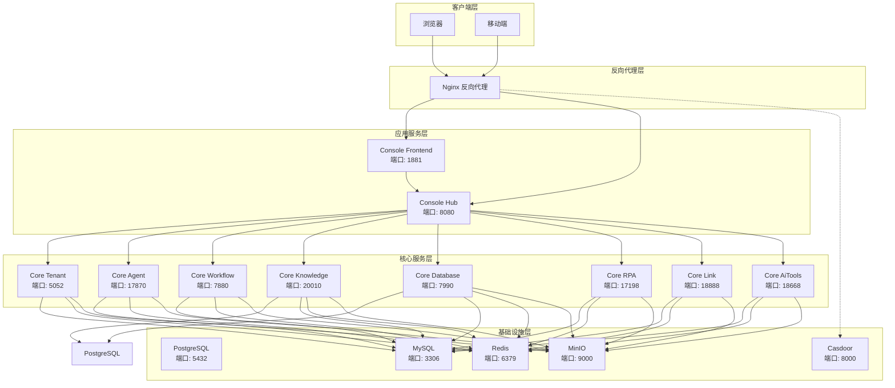
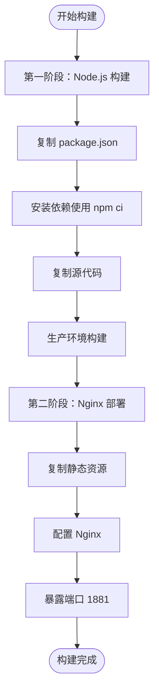
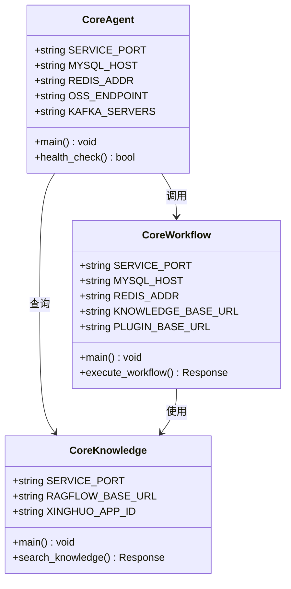
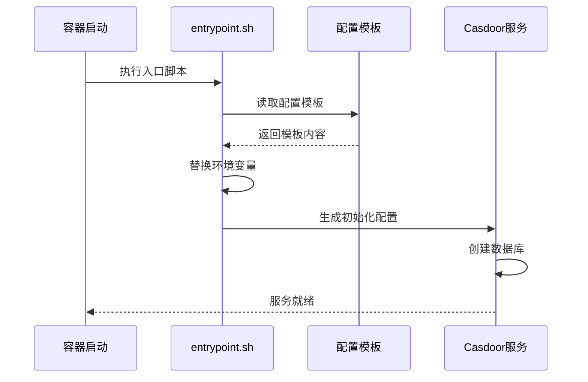
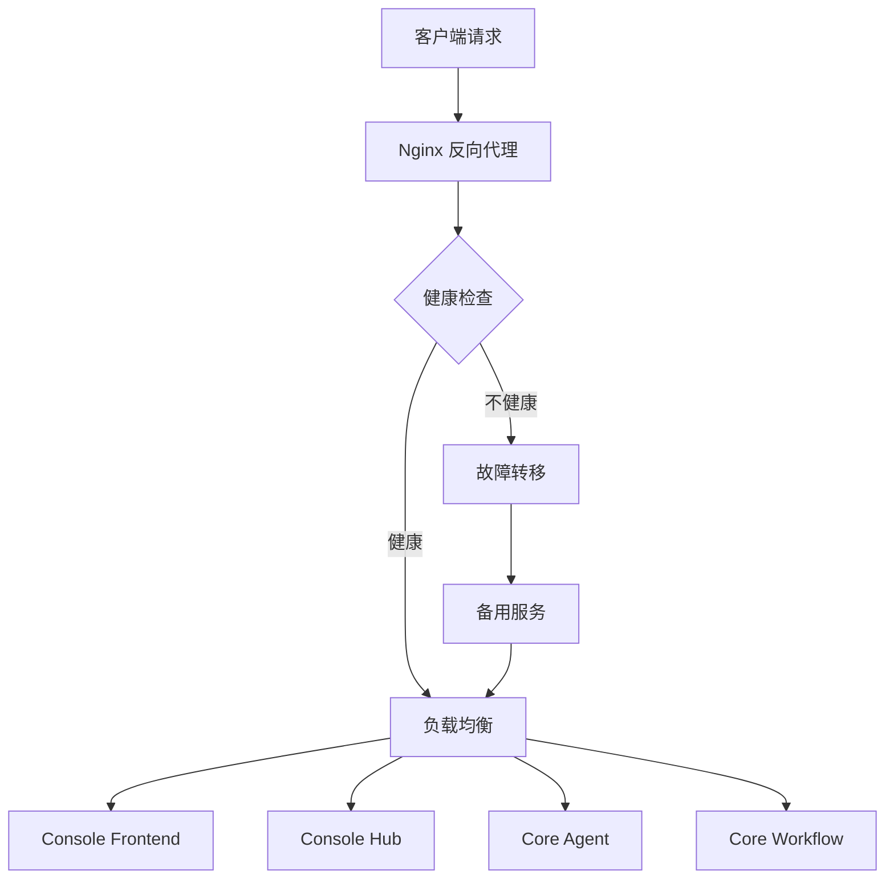
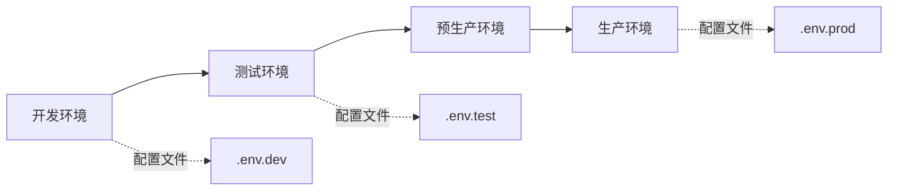

# 部署配置

<cite>
**本文档引用的文件**
- [docker-compose.yaml](file://docker/astronAgent/docker-compose.yaml)
- [docker-compose-with-auth.yaml](file://docker/astronAgent/docker-compose-with-auth.yaml)
- [docker-compose-auth.yml](file://docker/astronAgent/docker-compose-auth.yml)
- [nginx.conf](file://docker/astronAgent/nginx/nginx.conf)
- [console/frontend/Dockerfile](file://console/frontend/Dockerfile)
- [core/agent/Dockerfile](file://core/agent/Dockerfile)
- [agent.sql](file://docker/astronAgent/mysql/agent.sql)
- [workflow.sql](file://docker/astronAgent/mysql/workflow.sql)
- [memory.sql](file://docker/astronAgent/pgsql/memory.sql)
- [tenant.sql](file://docker/astronAgent/mysql/tenant.sql)
- [link.sql](file://docker/astronAgent/mysql/link.sql)
- [entrypoint.sh](file://docker/astronAgent/casdoor/entrypoint.sh)
- [config.toml](file://docker/astronAgent/config/tenant/config.toml)
- [README.md](file://README.md)
</cite>

## 目录
1. [概述](#概述)
2. [项目架构](#项目架构)
3. [Docker Compose 配置详解](#docker-compose-配置详解)
4. [服务组件分析](#服务组件分析)
5. [认证系统配置](#认证系统配置)
6. [数据库初始化](#数据库初始化)
7. [Nginx 反向代理配置](#nginx-反向代理配置)
8. [容器构建与优化](#容器构建与优化)
9. [多环境部署指南](#多环境部署指南)
10. [最佳实践](#最佳实践)

## 概述

Astron Agent 是一个企业级的智能体工作流开发平台，基于 Docker Compose 提供完整的容器化部署解决方案。该部署方案包含前端控制台、后端服务集群、数据库系统、缓存服务和认证系统等多个组件，支持高可用性和企业级特性。

### 核心特性

- **微服务架构**：采用服务化设计，各组件独立部署和扩展
- **多数据库支持**：同时支持 MySQL 和 PostgreSQL 数据库
- **认证集成**：内置 Casdoor 认证系统，支持 OAuth2/OpenID Connect
- **负载均衡**：通过 Nginx 实现流量分发和健康检查
- **容器化部署**：基于 Docker Compose 的标准化部署方案

## 项目架构



**图表来源**
- [docker-compose.yaml](file://docker/astronAgent/docker-compose.yaml#L1-L614)
- [nginx.conf](file://docker/astronAgent/nginx/nginx.conf#L1-L150)

## Docker Compose 配置详解

### 基础架构配置

Docker Compose 配置采用分层设计，主要包含以下几个部分：

#### 网络配置
```yaml
networks:
  astron-agent-network:
    driver: bridge
```

网络配置使用桥接模式，确保所有服务可以在同一网络内通信。

#### 存储卷配置
```yaml
volumes:
  postgres_data:
    driver: local
  mysql_data:
    driver: local
  redis_data:
    driver: local
  minio_data:
    driver: local
  nginx_logs:
    driver: local
```

存储卷采用本地驱动，保证数据持久化和跨容器共享。

### 基础设施服务

#### PostgreSQL 数据库
```yaml
postgres:
  image: postgres:14
  container_name: astron-agent-postgres
  environment:
    POSTGRES_DB: sparkdb_manager
    POSTGRES_USER: ${POSTGRES_USER:-spark}
    POSTGRES_PASSWORD: ${POSTGRES_PASSWORD:-spark123}
  volumes:
    - postgres_data:/var/lib/postgresql/data
    - ./pgsql/:/docker-entrypoint-initdb.d/
```

PostgreSQL 作为核心数据库，主要用于知识库管理和元数据存储。

#### MySQL 数据库
```yaml
mysql:
  image: mysql:8.4
  container_name: astron-agent-mysql
  environment:
    MYSQL_ROOT_PASSWORD: ${MYSQL_ROOT_PASSWORD:-root123}
  volumes:
    - mysql_data:/var/lib/mysql
    - ./mysql/:/docker-entrypoint-initdb.d/
```

MySQL 支持多个业务数据库，包括 agent、workflow、tenant 和 spark-link。

#### Redis 缓存
```yaml
redis:
  image: redis:7
  container_name: astron-agent-redis
  volumes:
    - redis_data:/data
  command: redis-server ${REDIS_PASSWORD:+--requirepass} ${REDIS_PASSWORD}
```

Redis 提供高性能缓存服务，支持密码认证。

#### MinIO 对象存储
```yaml
minio:
  image: minio/minio:RELEASE.2025-07-23T15-54-02Z
  container_name: astron-agent-minio
  environment:
    MINIO_ROOT_USER: ${MINIO_ROOT_USER:-minioadmin}
    MINIO_ROOT_PASSWORD: ${MINIO_ROOT_PASSWORD:-minioadmin123}
  ports:
    - "${EXPOSE_MINIO_PORT:-9000}:9000"
    - "${EXPOSE_MINIO_CONSOLE_PORT:-9001}:9001"
```

MinIO 提供 S3 兼容的对象存储服务，用于文件和媒体资源管理。

### 应用服务配置

#### 租户管理服务 (Tenant)
```yaml
core-tenant:
  image: ghcr.io/iflytek/astron-agent/core-tenant:${ASTRON_AGENT_VERSION:-latest}
  container_name: astron-agent-core-tenant
  environment:
    SERVICE_PORT: "${CORE_TENANT_PORT:-5052}"
    DATABASE_DB_TYPE: "${DATABASE_DB_TYPE:-mysql}"
    DATABASE_USERNAME: "${DATABASE_USERNAME:-root}"
    DATABASE_PASSWORD: "${DATABASE_PASSWORD:-root123}"
  depends_on:
    postgres:
      condition: service_healthy
    mysql:
      condition: service_healthy
    redis:
      condition: service_healthy
    minio:
      condition: service_healthy
```

租户服务负责多租户管理和应用认证。

#### 工作流服务 (Workflow)
```yaml
core-workflow:
  image: ghcr.io/iflytek/astron-agent/core-workflow:${ASTRON_AGENT_VERSION:-latest}
  container_name: astron-agent-core-workflow
  environment:
    SERVICE_PORT: "${CORE_WORKFLOW_PORT:-7880}"
    MYSQL_HOST: "${MYSQL_HOST:-mysql}"
    MYSQL_DB: "${WORKFLOW_MYSQL_DB:-workflow}"
  depends_on:
    mysql:
      condition: service_healthy
    redis:
      condition: service_healthy
    minio:
      condition: service_healthy
```

工作流服务是核心业务逻辑，负责工作流编排和执行。

**章节来源**
- [docker-compose.yaml](file://docker/astronAgent/docker-compose.yaml#L1-L614)

## 服务组件分析

### 控制台前端服务

#### 构建阶段
前端服务采用多阶段构建策略，第一阶段使用 Node.js 编译前端代码，第二阶段使用 Nginx 提供静态文件服务。



**图表来源**
- [console/frontend/Dockerfile](file://console/frontend/Dockerfile#L1-L81)

#### 性能优化
- **Gzip 压缩**：启用静态资源压缩
- **缓存策略**：长期缓存 JS/CSS 文件
- **HTTP/2 支持**：提升传输效率
- **健康检查**：定期检查服务状态

### 核心业务服务

#### Python 后端服务


**图表来源**
- [core/agent/Dockerfile](file://core/agent/Dockerfile#L1-L24)

#### 服务间通信
- **REST API**：统一的 HTTP 接口
- **消息队列**：Kafka 支持异步处理
- **缓存同步**：Redis 实时数据同步
- **文件存储**：MinIO 分布式存储

**章节来源**
- [console/frontend/Dockerfile](file://console/frontend/Dockerfile#L1-L81)
- [core/agent/Dockerfile](file://core/agent/Dockerfile#L1-L24)

## 认证系统配置

### Casdoor 集成

Astron Agent 集成了 Casdoor 认证系统，提供 OAuth2/OpenID Connect 支持。

#### Casdoor 服务配置
```yaml
casdoor:
  image: casbin/casdoor:latest
  container_name: astron-agent-casdoor
  ports:
    - "${CASDOOR_PORT:-8000}:8000"
  environment:
    - GIN_MODE=release
    - CONSOLE_DOMAIN=${CONSOLE_DOMAIN:-http://localhost}
    - HOST_BASE_ADDRESS=${HOST_BASE_ADDRESS:-http://localhost}
  volumes:
    - ./casdoor/conf:/conf
    - ./casdoor/entrypoint.sh:/entrypoint.sh:ro
  depends_on:
    - casdoor-mysql
```

#### 自动化配置流程


**图表来源**
- [entrypoint.sh](file://docker/astronAgent/casdoor/entrypoint.sh#L1-L21)

### 多环境配置差异

#### 基础部署 vs 认证部署
- **基础部署**：包含核心服务，适合快速体验
- **认证部署**：包含 Casdoor 认证系统，适合生产环境

```yaml
# 基础部署
include:
  - docker-compose.yaml

# 认证部署
include:
  - docker-compose-auth.yml
  - docker-compose.yaml
```

**章节来源**
- [docker-compose-with-auth.yaml](file://docker/astronAgent/docker-compose-with-auth.yaml#L1-L15)
- [docker-compose-auth.yml](file://docker/astronAgent/docker-compose-auth.yml#L1-L50)
- [entrypoint.sh](file://docker/astronAgent/casdoor/entrypoint.sh#L1-L21)

## 数据库初始化

### MySQL 数据库初始化

#### Agent 数据库
Agent 数据库存储机器人配置和对话历史。

```sql
CREATE DATABASE IF NOT EXISTS agent;
USE agent;

CREATE TABLE bot_config (
  id bigint(20) NOT NULL,
  app_id varchar(32) NOT NULL,
  bot_id varchar(40) NOT NULL,
  knowledge_config json NOT NULL,
  model_config json NOT NULL,
  tool_ids json NOT NULL,
  create_at datetime NOT NULL,
  update_at datetime NOT NULL,
  is_deleted tinyint(4) NOT NULL,
  PRIMARY KEY (id),
  KEY union_app_bot (app_id, bot_id)
) ENGINE=InnoDB DEFAULT CHARSET=utf8mb4;
```

#### Workflow 数据库
Workflow 数据库管理应用和工作流元数据。

```sql
CREATE DATABASE IF NOT EXISTS workflow;
USE workflow;

CREATE TABLE app (
  id bigint(20) NOT NULL,
  name varchar(30) DEFAULT NULL,
  alias_id varchar(64) DEFAULT NULL,
  api_key varchar(50) NOT NULL,
  api_secret varchar(50) NOT NULL,
  is_tenant tinyint(4) DEFAULT '0',
  status tinyint(4) DEFAULT '1',
  create_at datetime DEFAULT NULL,
  update_at datetime DEFAULT NULL,
  PRIMARY KEY (id),
  UNIQUE KEY alias_id (alias_id)
) ENGINE=InnoDB DEFAULT CHARSET=utf8;
```

#### Tenant 数据库
Tenant 数据库处理多租户认证和应用管理。

```sql
CREATE DATABASE IF NOT EXISTS tenant;
USE tenant;

CREATE TABLE tb_app (
  app_id varchar(32) COLLATE utf8_bin NOT NULL DEFAULT '',
  app_name varchar(256) COLLATE utf8_bin DEFAULT NULL,
  dev_id bigint(20) DEFAULT NULL,
  channel_id varchar(128) COLLATE utf8_bin DEFAULT NULL,
  source varchar(32) COLLATE utf8_bin DEFAULT '',
  is_disable tinyint(1) DEFAULT NULL,
  PRIMARY KEY (app_id)
) ENGINE=InnoDB DEFAULT CHARSET=utf8 COLLATE=utf8_bin;
```

#### Spark-Link 数据库
Spark-Link 数据库存储工具和插件信息。

```sql
CREATE DATABASE IF NOT EXISTS `spark-link`;
USE `spark-link`;

CREATE TABLE tools_schema (
  id BIGINT PRIMARY KEY AUTO_INCREMENT,
  app_id VARCHAR(32),
  tool_id VARCHAR(32),
  name VARCHAR(128),
  description VARCHAR(512),
  open_api_schema TEXT,
  create_at DATETIME(6) DEFAULT CURRENT_TIMESTAMP(6),
  update_at DATETIME(6) DEFAULT CURRENT_TIMESTAMP(6) ON UPDATE CURRENT_TIMESTAMP(6),
  mcp_server_url VARCHAR(255),
  schema TEXT,
  version VARCHAR(32) NOT NULL DEFAULT 'DEF_VER',
  is_deleted BIGINT NOT NULL DEFAULT 0
) ENGINE=InnoDB DEFAULT CHARSET=utf8mb4;
```

### PostgreSQL 数据库初始化

PostgreSQL 主要用于知识库和元数据存储。

```sql
-- 创建数据库
CREATE SCHEMA IF NOT EXISTS sparkdb_manager;

-- 创建数据库元数据表
CREATE TABLE IF NOT EXISTS sparkdb_manager.database_meta (
  id bigint primary key not null,
  app_id character varying,
  uid character varying(64) not null,
  name character varying not null,
  description character varying,
  create_at timestamp without time zone not null default CURRENT_TIMESTAMP,
  update_at timestamp without time zone not null default CURRENT_TIMESTAMP,
  space_id character varying
);

-- 创建索引
CREATE INDEX IF NOT EXISTS database_meta_app_id_index 
ON sparkdb_manager.database_meta USING btree (app_id);
```

**章节来源**
- [agent.sql](file://docker/astronAgent/mysql/agent.sql#L1-L31)
- [workflow.sql](file://docker/astronAgent/mysql/workflow.sql#L1-L114)
- [tenant.sql](file://docker/astronAgent/mysql/tenant.sql#L1-L55)
- [link.sql](file://docker/astronAgent/mysql/link.sql#L1-L78)
- [memory.sql](file://docker/astronAgent/pgsql/memory.sql#L1-L47)

## Nginx 反向代理配置

### 核心代理规则

Nginx 配置采用模块化设计，支持多种请求类型和负载均衡策略。

#### 静态资源代理
```nginx
location ~* \.(js|css|png|jpg|jpeg|gif|ico|svg|woff|woff2|ttf|eot)$ {
    proxy_pass http://console-frontend:1881;
    proxy_set_header Host $host;
    proxy_set_header X-Real-IP $remote_addr;
    proxy_set_header X-Forwarded-For $proxy_add_x_forwarded_for;
    proxy_set_header X-Forwarded-Proto $scheme;
    
    expires 1y;
    add_header Cache-Control "public, immutable";
}
```

#### Server-Sent Events (SSE) 支持
```nginx
location /workflow/v1/chat/completions {
    proxy_pass http://core-workflow:7880/workflow/v1/chat/completions;
    
    # SSE 特定设置
    proxy_buffering off;
    proxy_cache off;
    proxy_set_header Connection '';
    proxy_http_version 1.1;
    chunked_transfer_encoding on;
    
    # 长连接超时设置
    proxy_connect_timeout 60s;
    proxy_send_timeout 1800s;
    proxy_read_timeout 1800s;
    
    add_header Cache-Control 'no-cache';
    add_header X-Accel-Buffering 'no';
}
```

#### API 路由配置
```nginx
location /console-api/ {
    proxy_pass http://console-hub:8080/;
    proxy_set_header Host $host;
    proxy_set_header X-Real-IP $remote_addr;
    proxy_set_header X-Forwarded-For $proxy_add_x_forwarded_for;
    proxy_set_header X-Forwarded-Proto $scheme;
    
    # 超时设置
    proxy_connect_timeout 30s;
    proxy_send_timeout 30s;
    proxy_read_timeout 30s;
}
```

### 负载均衡策略



### 安全配置

- **安全头**：X-Frame-Options、X-XSS-Protection、X-Content-Type-Options
- **访问控制**：IP 白名单、速率限制
- **SSL/TLS**：HTTPS 支持和证书管理
- **健康检查**：定期检测后端服务状态

**章节来源**
- [nginx.conf](file://docker/astronAgent/nginx/nginx.conf#L1-L150)

## 容器构建与优化

### 多阶段构建策略

#### 前端容器优化
前端容器采用 Alpine Linux 基础镜像，减少镜像大小和攻击面。

```dockerfile
# 第一阶段：构建环境
FROM node:18-alpine AS builder
WORKDIR /app
RUN npm config set registry https://registry.npmjs.org/
COPY console/frontend/package*.json ./
RUN --mount=type=cache,target=/root/.npm \
    npm ci --legacy-peer-deps
COPY console/frontend/ ./
RUN npm run build-prod

# 第二阶段：运行环境
FROM nginx:1.15-alpine
# 配置 Nginx 和环境变量
```

#### 后端容器优化
Python 后端使用 slim 基础镜像，结合 uv 包管理器提高依赖安装效率。

```dockerfile
FROM python:3.11-slim
WORKDIR /opt/core/agent

# 安装 uv 包管理器
RUN pip install uv

# 复制并安装依赖
COPY core/common/ /opt/core/common/
COPY core/agent/ /opt/core/agent/
RUN cd /opt/core/common && uv export --format requirements-txt --no-dev > requirements.txt && \
    uv pip install -r requirements.txt --system
```

### 镜像优化策略

#### 层缓存优化
- **依赖安装**：先复制依赖清单，再复制源代码
- **构建工具**：使用 BuildKit 缓存挂载
- **多阶段构建**：分离构建和运行环境

#### 安全加固
- **非 root 用户**：避免以 root 权限运行服务
- **最小权限**：只开放必要的端口和服务
- **漏洞扫描**：定期扫描基础镜像安全漏洞

#### 性能优化
- **镜像大小**：使用 Alpine 基础镜像减少体积
- **启动时间**：优化容器启动顺序和依赖关系
- **资源使用**：合理配置内存和 CPU 限制

**章节来源**
- [console/frontend/Dockerfile](file://console/frontend/Dockerfile#L1-L81)
- [core/agent/Dockerfile](file://core/agent/Dockerfile#L1-L24)

## 多环境部署指南

### 开发环境部署

#### 快速启动
```bash
# 克隆仓库
git clone https://github.com/iflytek/astron-agent.git
cd docker/astronAgent

# 复制环境配置
cp .env.example .env

# 配置环境变量
vim .env

# 启动服务
docker compose -f docker-compose-with-auth.yaml up -d
```

#### 环境变量配置
```env
# 基础配置
ASTRON_AGENT_VERSION=latest
SERVICE_LOCATION=hf

# 数据库配置
POSTGRES_USER=spark
POSTGRES_PASSWORD=spark123
MYSQL_ROOT_PASSWORD=root123

# MinIO 配置
MINIO_ROOT_USER=minioadmin
MINIO_ROOT_PASSWORD=minioadmin123

# Casdoor 配置
CASDOOR_PORT=8000
CONSOLE_DOMAIN=http://localhost
```

### 测试环境部署

#### 资源隔离
- **独立网络**：使用不同的 Docker 网络
- **端口映射**：避免端口冲突
- **存储隔离**：使用独立的存储卷

#### 监控配置
```yaml
# 添加监控服务
prometheus:
  image: prometheus:latest
  ports:
    - "9090:9090"
  volumes:
    - ./monitoring/prometheus.yml:/etc/prometheus/prometheus.yml
```

### 生产环境部署

#### 高可用配置
```yaml
# 多实例部署
core-agent:
  image: ghcr.io/iflytek/astron-agent/core-agent:${ASTRON_AGENT_VERSION}
  deploy:
    replicas: 3
    resources:
      limits:
        cpus: '2.0'
        memory: 4G
      reservations:
        cpus: '1.0'
        memory: 2G
```

#### 安全加固
- **TLS 证书**：配置 HTTPS 证书
- **防火墙**：限制不必要的端口访问
- **审计日志**：启用详细的操作日志
- **备份策略**：定期备份数据库和配置

#### 性能调优
- **资源限制**：设置合理的 CPU 和内存限制
- **连接池**：优化数据库连接池配置
- **缓存策略**：调整 Redis 缓存参数
- **负载均衡**：配置多个 Nginx 实例

### 环境切换指南



**章节来源**
- [README.md](file://README.md#L40-L80)

## 最佳实践

### 部署最佳实践

#### 1. 环境隔离
- **网络隔离**：不同环境使用独立的 Docker 网络
- **存储隔离**：使用独立的存储卷和数据目录
- **配置隔离**：为每个环境维护单独的配置文件

#### 2. 监控和日志
```yaml
# 添加日志收集
logging:
  driver: "json-file"
  options:
    max-size: "10m"
    max-file: "3"
```

#### 3. 备份策略
```bash
# 数据库备份脚本
#!/bin/bash
DATE=$(date +%Y%m%d_%H%M%S)
docker exec astron-agent-mysql mysqldump -u root -p${MYSQL_ROOT_PASSWORD} --all-databases > backup_${DATE}.sql
```

#### 4. 更新和升级
- **滚动更新**：使用 Docker Swarm 或 Kubernetes 实现零停机更新
- **版本管理**：明确的版本标签和回滚机制
- **兼容性测试**：升级前进行充分的功能测试

### 性能优化建议

#### 1. 资源规划
- **CPU**：根据业务量估算并发需求
- **内存**：为每个服务预留足够的内存空间
- **存储**：考虑数据增长和备份需求

#### 2. 缓存策略
- **Redis 配置**：合理设置过期时间和内存淘汰策略
- **CDN**：静态资源使用 CDN 加速
- **数据库查询**：优化慢查询和添加索引

#### 3. 网络优化
- **连接池**：配置合适的数据库连接池大小
- **超时设置**：根据业务特点调整超时参数
- **压缩**：启用 Gzip 压缩减少传输数据量

### 安全最佳实践

#### 1. 访问控制
- **网络隔离**：限制服务间的直接访问
- **身份认证**：使用强密码和多因素认证
- **权限管理**：遵循最小权限原则

#### 2. 数据保护
- **加密传输**：启用 HTTPS 和 TLS
- **数据备份**：定期备份重要数据
- **敏感信息**：使用环境变量或密钥管理服务

#### 3. 安全监控
- **入侵检测**：监控异常访问行为
- **漏洞扫描**：定期扫描系统漏洞
- **日志审计**：记录和分析安全事件

### 故障排除指南

#### 常见问题诊断
```bash
# 检查容器状态
docker ps -a

# 查看服务日志
docker logs <container_name>

# 检查网络连接
docker network ls
docker network inspect astron-agent-network

# 检查存储卷
docker volume ls
docker volume inspect postgres_data
```

#### 性能问题排查
```bash
# 检查资源使用情况
docker stats

# 分析慢查询
docker exec mysql mysql -e "SHOW FULL PROCESSLIST;"

# 检查 Redis 性能
docker exec redis redis-cli INFO stats
```

通过遵循这些最佳实践，可以确保 Astron Agent 在各种环境中稳定、高效地运行，为企业提供可靠的智能体工作流解决方案。