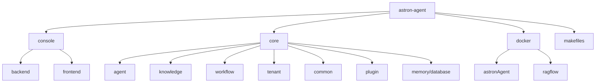
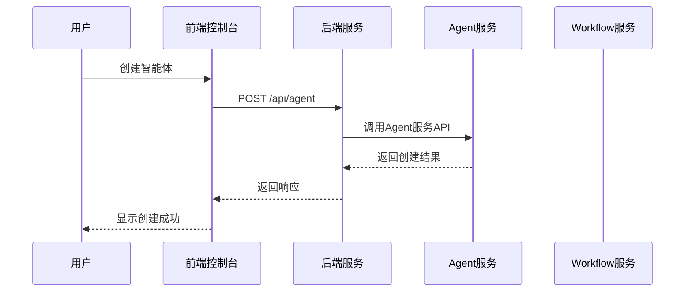
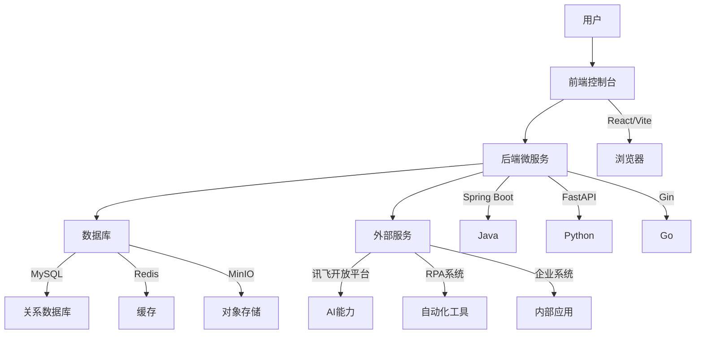

# 系统概述

<cite>
**本文档中引用的文件**  
- [README.md](file://README.md)
- [README-zh.md](file://README-zh.md)
- [main.py](file://core/agent/main.py)
- [main.py](file://core/knowledge/main.py)
- [main.py](file://core/workflow/main.py)
- [server.go](file://core/tenant/app/server.go)
- [app.py](file://core/agent/api/app.py)
- [router.py](file://core/workflow/api/v1/router.py)
- [HubApplication.java](file://console/backend/hub/src/main/java/com/iflytek/astron/console/hub/HubApplication.java)
- [app.tsx](file://console/frontend/src/app.tsx)
- [index.tsx](file://console/frontend/src/router/index.tsx)
- [application.yml](file://console/backend/hub/src/main/resources/application.yml)
- [pom.xml](file://console/backend/pom.xml)
- [package.json](file://console/frontend/package.json)
</cite>

## 目录
1. [引言](#引言)
2. [项目结构](#项目结构)
3. [核心功能](#核心功能)
4. [微服务架构设计](#微服务架构设计)
5. [前端控制台与后端交互](#前端控制台与后端交互)
6. [系统上下文图](#系统上下文图)
7. [技术愿景与目标用户](#技术愿景与目标用户)
8. [典型应用场景](#典型应用场景)

## 引言

星辰Agent是一个企业级、商业友好的Agentic Workflow开发平台，融合了AI工作流编排、模型管理、AI与MCP工具集、RPA自动化和团队空间等特性。该平台支持高可用部署，帮助企业快速构建可规模化落地的智能体应用，打造面向未来的AI基座。作为讯飞星辰Agent平台的核心技术开源版本，它具备企业级高可靠性，并通过Apache 2.0协议开源，允许自由商用使用。

**Section sources**
- [README.md](file://README.md#L1-L128)
- [README-zh.md](file://README-zh.md#L1-L128)

## 项目结构

astron-agent项目采用微服务架构设计，主要分为前端控制台（console/frontend）和后端微服务（core/）两大模块。后端微服务包括agent、knowledge、workflow、tenant等核心服务，每个服务独立部署并提供特定功能。此外，项目还包含docker目录用于容器化部署配置，以及makefiles用于构建和CI/CD流程管理。

**Diagram sources**
- [README.md](file://README.md#L1-L128)
- [README-zh.md](file://README-zh.md#L1-L128)

**Section sources**
- [README.md](file://README.md#L1-L128)
- [README-zh.md](file://README-zh.md#L1-L128)

## 核心功能

星辰Agent平台提供了一系列核心功能，使其成为企业级Agentic Workflow开发的理想选择。这些功能包括AI工作流编排、智能体创建、知识库集成和RPA自动化等。平台支持高可用部署，提供即用工具生态，集成讯飞开放平台的海量AI能力与工具，经过数百万开发者验证，可免开发快速接入。同时，平台提供灵活的大模型支持，从API快速接入验证到企业级MaaS本地集群一键部署，满足不同规模需求。

### AI工作流编排

平台提供强大的AI工作流编排能力，支持通过可视化界面设计复杂的工作流。工作流引擎支持多种节点类型，包括大模型节点、工具节点、知识库节点、决策节点等，可实现从简单问答到复杂业务流程的自动化。

### 智能体创建

用户可以通过平台创建各种类型的智能体，包括指令型智能体和工作流型智能体。平台提供智能体配置管理API，支持对智能体进行全生命周期管理，包括创建、更新、发布和监控。

### 知识库集成

知识库服务支持与多种知识库系统集成，包括AIUI、星火、RAGFlow等。通过RAG（检索增强生成）策略，智能体可以基于企业内部知识库生成更准确的回答，实现企业知识的有效利用。

### RPA自动化

平台原生集成智能RPA功能，可实现跨系统流程自动化。RPA插件支持与企业内部系统无缝对接，让智能体具备高可控执行力，实现"从决策到动作"的完整闭环。

**Section sources**
- [README.md](file://README.md#L1-L128)
- [README-zh.md](file://README-zh.md#L1-L128)

## 微服务架构设计

astron-agent采用微服务架构设计，将系统功能分解为多个独立的服务，每个服务负责特定的业务领域。这种架构提高了系统的可维护性、可扩展性和可靠性。核心微服务包括core/agent、core/knowledge、core/workflow和core/tenant，它们通过定义良好的API接口进行通信。

### core/agent服务

agent服务是平台的核心服务之一，负责智能体的管理和执行。该服务基于Python和FastAPI框架构建，提供智能体配置管理、工作流智能体执行等API接口。服务启动时会加载环境配置，初始化日志、监控和追踪系统，并启动FastAPI应用。

### core/knowledge服务

knowledge服务负责知识库管理和RAG功能。该服务同样基于FastAPI框架，提供知识库相关的API接口。服务初始化时会创建FastAPI应用实例，注册RAG路由，并设置全局异常处理机制。通过该服务，智能体可以访问和利用企业内部知识库。

### core/workflow服务

workflow服务是工作流引擎的核心，负责工作流的执行和管理。该服务基于FastAPI框架构建，提供工作流相关的API接口。服务创建时会初始化必要的中间件，包括CORS、OTLP追踪和认证中间件，并注册多个API路由器来处理不同的工作流操作。

### core/tenant服务

tenant服务负责租户管理和应用配置。该服务基于Go语言和Gin框架构建，提供租户相关的API接口。服务启动时会加载配置文件，初始化日志系统，并启动HTTP服务器。通过该服务，平台支持多租户架构，可为不同企业用户提供隔离的运行环境。

**Section sources**
- [main.py](file://core/agent/main.py#L1-L110)
- [main.py](file://core/knowledge/main.py#L1-L113)
- [main.py](file://core/workflow/main.py#L1-L168)
- [server.go](file://core/tenant/app/server.go#L1-L90)

## 前端控制台与后端交互

前端控制台（console/frontend）是用户与平台交互的主要界面，采用React技术栈构建。控制台通过RESTful API与后端微服务进行通信，实现各种功能。后端服务（console/backend）基于Spring Boot框架构建，提供API网关和业务逻辑处理功能。

### 前端架构

前端控制台采用现代化的前端技术栈，包括React 18、TypeScript、Vite、Ant Design等。应用采用模块化设计，按功能划分组件，如智能体创建、工作流编辑、知识库管理等。路由系统使用react-router-dom管理页面导航，状态管理使用Recoil实现全局状态共享。

### 后端接口

后端服务提供RESTful API接口，前端通过axios库调用这些接口。API接口涵盖用户认证、智能体管理、工作流操作、知识库访问等各个方面。后端服务还集成Swagger/OpenAPI，提供API文档和测试功能。

### 交互流程

用户在前端控制台进行操作时，前端应用会向后端发送HTTP请求。后端服务处理请求，可能需要调用其他微服务（如agent、workflow等）来完成业务逻辑。处理完成后，后端返回JSON格式的响应，前端解析响应并更新UI界面。

**Diagram sources**
- [app.tsx](file://console/frontend/src/app.tsx#L1-L55)
- [index.tsx](file://console/frontend/src/router/index.tsx#L1-L271)
- [HubApplication.java](file://console/backend/hub/src/main/java/com/iflytek/astron/console/hub/HubApplication.java#L1-L17)
- [application.yml](file://console/backend/hub/src/main/resources/application.yml#L1-L202)

**Section sources**
- [app.tsx](file://console/frontend/src/app.tsx#L1-L55)
- [index.tsx](file://console/frontend/src/router/index.tsx#L1-L271)
- [HubApplication.java](file://console/backend/hub/src/main/java/com/iflytek/astron/console/hub/HubApplication.java#L1-L17)
- [application.yml](file://console/backend/hub/src/main/resources/application.yml#L1-L202)

## 系统上下文图

系统上下文图展示了astron-agent平台的整体架构和各组件之间的关系。平台由前端控制台、后端微服务、数据库和外部服务组成。前端控制台通过浏览器与用户交互，后端微服务提供业务逻辑处理，数据库存储系统数据，外部服务提供AI能力和工具支持。

**Diagram sources**
- [README.md](file://README.md#L1-L128)
- [README-zh.md](file://README-zh.md#L1-L128)
- [pom.xml](file://console/backend/pom.xml#L1-L344)
- [package.json](file://console/frontend/package.json#L1-L137)

## 技术愿景与目标用户

星辰Agent平台的技术愿景是成为企业级Agentic Workflow开发的首选平台，通过开源方式推动AI智能体技术的发展和应用。平台旨在降低企业构建智能体应用的门槛，提供稳定可靠、易于扩展的开发环境，帮助企业快速实现业务智能化转型。

### 技术愿景

平台的技术愿景包括：提供企业级高可用的智能体开发环境，支持大规模生产部署；构建开放的生态系统，支持与各种AI模型和工具的集成；提供灵活的部署选项，支持云、本地和混合部署模式；持续优化性能和用户体验，保持技术领先优势。

### 目标用户

平台的目标用户主要包括：企业IT部门，用于构建内部智能助手和自动化流程；软件开发商，用于快速开发和交付智能体应用；AI研究人员，用于实验和验证新的智能体算法；教育机构，用于教学和研究目的。

**Section sources**
- [README.md](file://README.md#L1-L128)
- [README-zh.md](file://README-zh.md#L1-L128)

## 典型应用场景

星辰Agent平台适用于多种企业级应用场景，能够帮助企业提升效率、降低成本、改善用户体验。以下是几个典型的使用场景：

### 客户服务自动化

企业可以使用平台创建智能客服机器人，处理常见客户咨询。通过集成企业知识库，机器人可以提供准确的产品信息和解决方案。对于复杂问题，机器人可以无缝转接人工客服，并提供上下文信息，提升服务效率。

### 内部流程自动化

企业可以使用平台自动化内部业务流程，如请假审批、报销处理、入职流程等。通过RPA插件，智能体可以与企业内部系统（如HR系统、财务系统）交互，实现端到端的流程自动化，减少人工干预。

### 数据分析助手

企业可以创建数据分析智能体，帮助员工快速获取业务洞察。智能体可以连接企业数据库，理解自然语言查询，并生成可视化报告。这使得非技术人员也能轻松进行数据分析，提高决策效率。

### 培训与知识管理

企业可以使用平台构建智能培训系统，为新员工提供个性化的学习路径。通过知识库集成，智能体可以回答员工关于公司政策、流程和产品的各种问题，成为24/7的虚拟导师。

**Section sources**
- [README.md](file://README.md#L1-L128)
- [README-zh.md](file://README-zh.md#L1-L128)