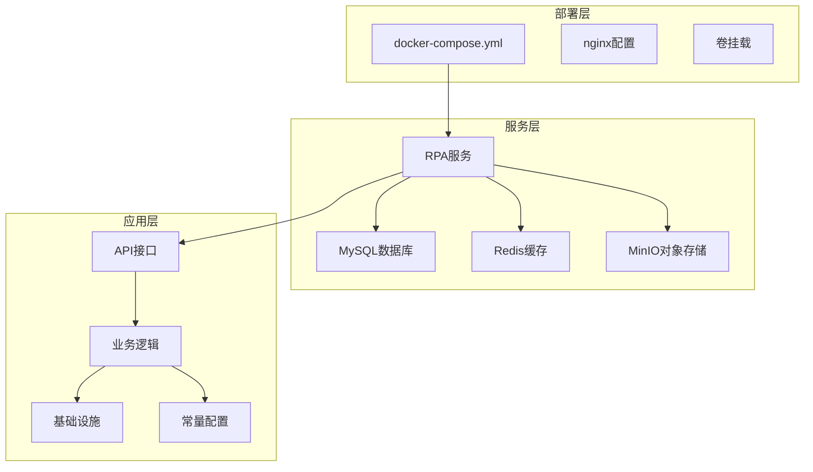
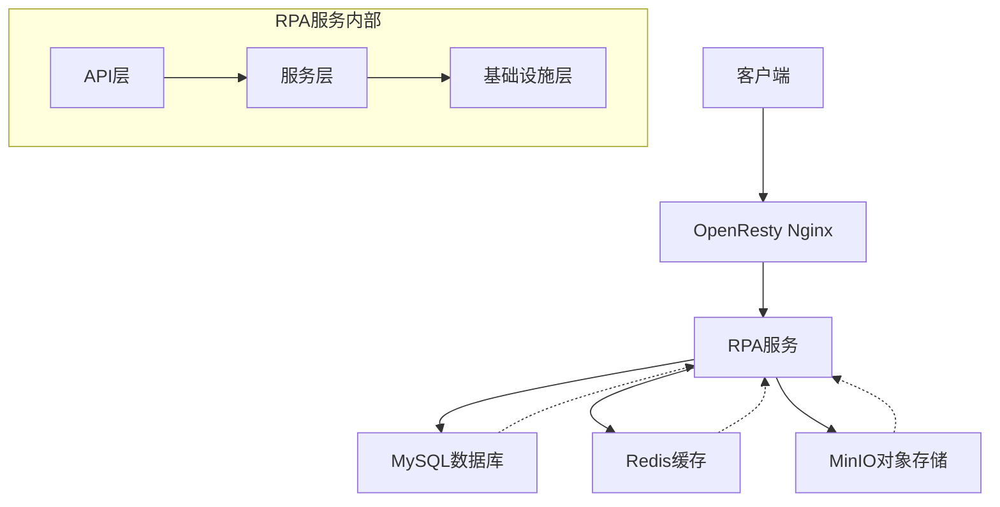
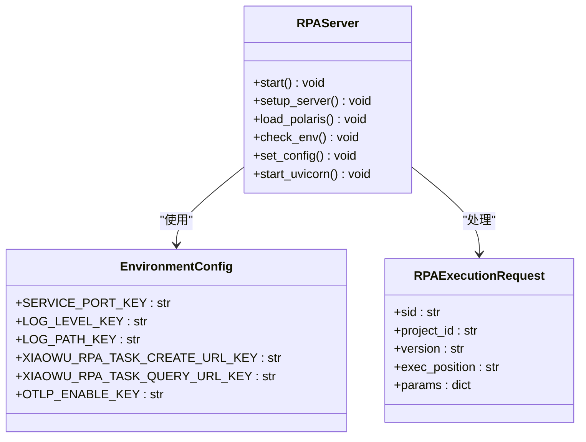
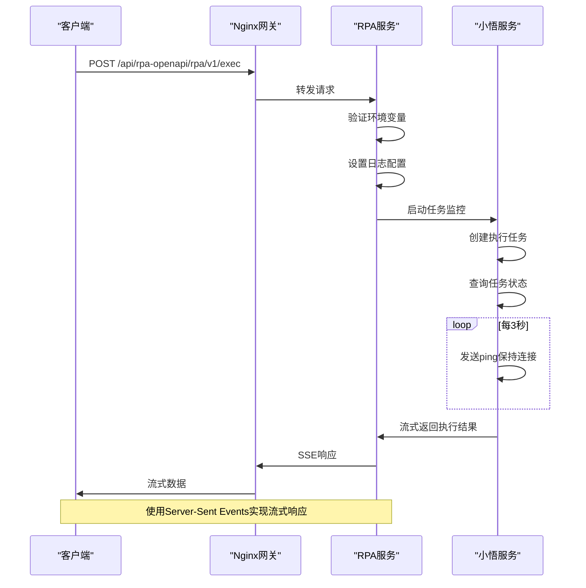
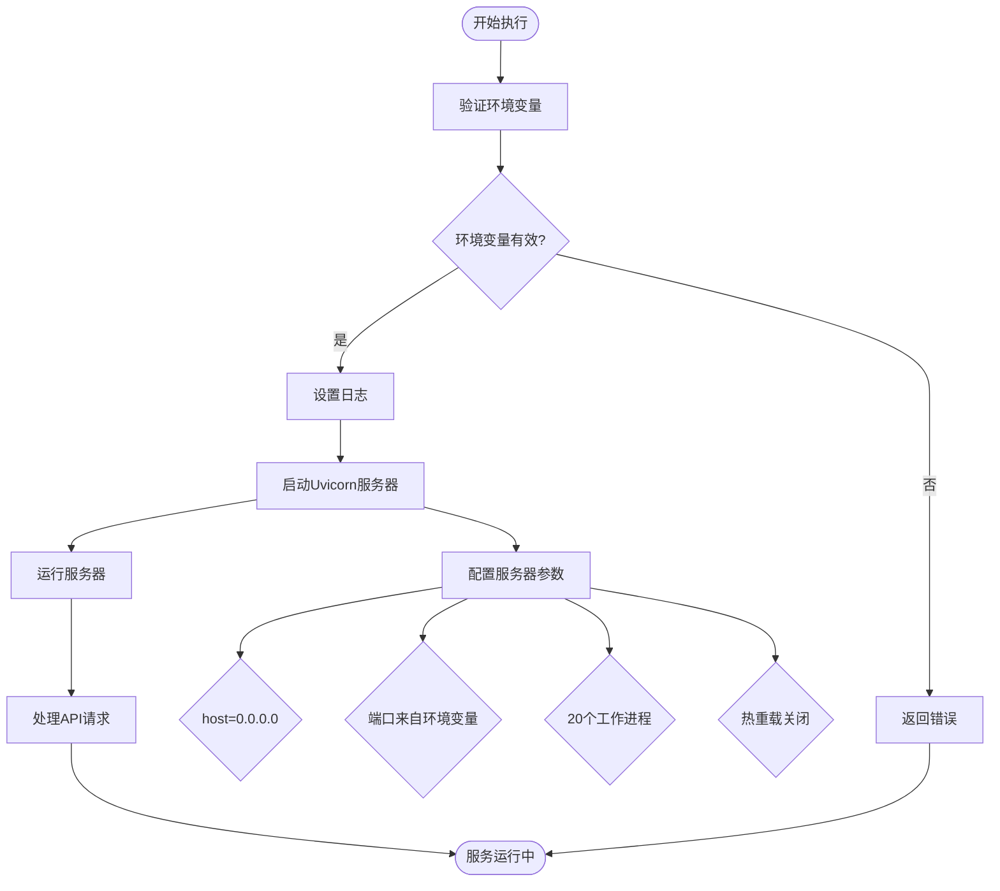
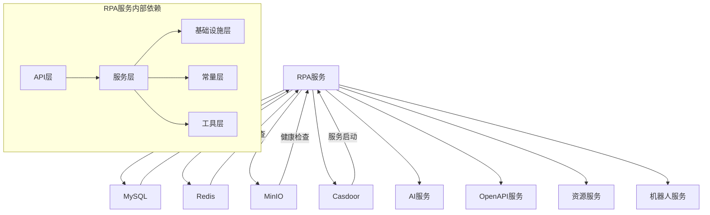

# RPA服务部署

<cite>
**本文档引用的文件**  
- [docker-compose.yml](file://docker/astronAgent/astronRPA/docker-compose.yml)
- [main.py](file://core/plugin/rpa/main.py)
- [Dockerfile](file://core/plugin/rpa/Dockerfile)
- [app.py](file://core/plugin/rpa/api/app.py)
- [router.py](file://core/plugin/rpa/api/router.py)
- [execution.py](file://core/plugin/rpa/api/v1/execution.py)
- [const.py](file://core/plugin/rpa/consts/const.py)
- [logger.py](file://core/plugin/rpa/utils/log/logger.py)
</cite>

## 目录
1. [项目结构](#项目结构)
2. [核心组件](#核心组件)
3. [架构概述](#架构概述)
4. [详细组件分析](#详细组件分析)
5. [依赖分析](#依赖分析)
6. [性能考虑](#性能考虑)
7. [故障排除指南](#故障排除指南)

## 项目结构

本项目采用模块化设计，主要包含以下核心目录：

- `console/`：前端控制台，提供用户界面和管理功能
- `core/`：核心服务模块，包含RPA、Agent、知识库等核心功能
- `docker/`：Docker部署配置，包含RPA和RAGFlow的部署文件
- `makefiles/`：构建和CI/CD脚本

RPA服务的核心实现位于`core/plugin/rpa/`目录下，部署配置位于`docker/astronAgent/astronRPA/`目录中。

**图源**
- [docker-compose.yml](file://docker/astronAgent/astronRPA/docker-compose.yml)
- [main.py](file://core/plugin/rpa/main.py)

**节源**
- [docker-compose.yml](file://docker/astronAgent/astronRPA/docker-compose.yml)
- [project_structure](file://project_structure)

## 核心组件

RPA服务的核心组件包括服务定义、API接口、配置管理和日志系统。服务通过Docker Compose进行编排，使用FastAPI框架提供RESTful API接口。

服务启动流程包括：
1. 设置Python路径
2. 加载环境配置
3. 初始化服务
4. 启动Uvicorn服务器

环境变量验证确保所有必需的配置项都已正确设置，包括服务端口、日志级别、数据库连接等。

**节源**
- [main.py](file://core/plugin/rpa/main.py)
- [app.py](file://core/plugin/rpa/api/app.py)
- [const.py](file://core/plugin/rpa/consts/const.py)

## 架构概述

RPA服务采用微服务架构，通过Docker容器化部署。服务间通过REST API和消息队列进行通信，数据持久化使用MySQL数据库，缓存使用Redis，文件存储使用MinIO对象存储。

**图源**
- [docker-compose.yml](file://docker/astronAgent/astronRPA/docker-compose.yml)
- [app.py](file://core/plugin/rpa/api/app.py)

## 详细组件分析

### RPA服务分析

RPA服务作为自动化流程执行的核心，负责接收执行请求、管理任务生命周期和返回执行结果。

#### 服务定义分析

**图源**
- [app.py](file://core/plugin/rpa/api/app.py)
- [const.py](file://core/plugin/rpa/consts/const.py)
- [execution_schema.py](file://core/plugin/rpa/api/schemas/execution_schema.py)

#### API执行流程分析

**图源**
- [execution.py](file://core/plugin/rpa/api/v1/execution.py)
- [process.py](file://core/plugin/rpa/service/xiaowu/process.py)

#### 任务执行逻辑分析

**图源**
- [app.py](file://core/plugin/rpa/api/app.py)

**节源**
- [app.py](file://core/plugin/rpa/api/app.py)
- [main.py](file://core/plugin/rpa/main.py)

## 依赖分析

RPA服务依赖多个外部服务和内部组件，形成复杂的依赖网络。

**图源**
- [docker-compose.yml](file://docker/astronAgent/astronRPA/docker-compose.yml)
- [main.py](file://core/plugin/rpa/main.py)

**节源**
- [docker-compose.yml](file://docker/astronAgent/astronRPA/docker-compose.yml)

## 性能考虑

RPA服务在性能方面有以下关键配置：

1. **并发处理**：配置了20个工作进程，充分利用多核CPU资源
2. **连接超时**：Nginx代理设置了600秒的连接、发送和读取超时，适应长时间运行的任务
3. **健康检查**：各服务都配置了合理的健康检查机制，确保服务稳定性
4. **日志管理**：日志文件大小超过10MB时自动轮转，避免磁盘空间耗尽
5. **资源限制**：通过Docker资源限制控制内存和CPU使用

**节源**
- [docker-compose.yml](file://docker/astronAgent/astronRPA/docker-compose.yml)
- [app.py](file://core/plugin/rpa/api/app.py)
- [logger.py](file://core/plugin/rpa/utils/log/logger.py)

## 故障排除指南

### 常见问题及解决方案

1. **服务启动失败**
   - 检查环境变量是否完整
   - 验证数据库连接信息
   - 确认端口未被占用

2. **任务执行超时**
   - 检查小悟服务的连接配置
   - 验证任务创建和查询URL
   - 调整超时时间配置

3. **日志无法写入**
   - 检查日志目录权限
   - 验证日志路径配置
   - 确认磁盘空间充足

4. **数据库连接问题**
   - 验证MySQL服务健康状态
   - 检查网络连接
   - 确认数据库凭据正确

**节源**
- [app.py](file://core/plugin/rpa/api/app.py)
- [main.py](file://core/plugin/rpa/main.py)
- [logger.py](file://core/plugin/rpa/utils/log/logger.py)