# 前端服务部署文档

<cite>
**本文档引用的文件**
- [Dockerfile](file://console/frontend/Dockerfile)
- [vite.config.js](file://console/frontend/vite.config.js)
- [package.json](file://console/frontend/package.json)
- [nginx.conf](file://console/frontend/nginx.conf)
- [deployment.yml](file://console/frontend/deployment.yml)
- [docker-entrypoint.sh](file://console/frontend/docker-entrypoint.sh)
- [.env.production](file://console/frontend/.env.production)
- [.env.development](file://console/frontend/.env.development)
- [public/runtime-config.js](file://console/frontend/public/runtime-config.js)
- [tsconfig.json](file://console/frontend/tsconfig.json)
- [index.html](file://console/frontend/index.html)
- [tailwind.config.js](file://console/frontend/tailwind.config.js)
- [postcss.config.js](file://console/frontend/postcss.config.js)
</cite>

## 目录
1. [项目概述](#项目概述)
2. [架构设计](#架构设计)
3. [Docker容器化部署](#docker容器化部署)
4. [Vite构建配置](#vite构建配置)
5. [Nginx服务器配置](#nginx服务器配置)
6. [环境变量管理](#环境变量管理)
7. [静态资源优化](#静态资源优化)
8. [API代理配置](#api代理配置)
9. [Kubernetes部署](#kubernetes部署)
10. [HTTPS配置](#https配置)
11. [CDN集成建议](#cdn集成建议)
12. [故障排除指南](#故障排除指南)

## 项目概述

Astron Agent前端服务是一个基于React技术栈的现代化Web应用，采用Vite作为构建工具，支持多环境部署和容器化运行。该服务负责提供用户界面、状态管理和API通信功能。

### 核心特性
- **现代化技术栈**：React 18 + TypeScript + Vite
- **响应式设计**：基于Tailwind CSS的移动端优先设计
- **国际化支持**：多语言界面支持
- **模块化架构**：组件化开发模式
- **高性能构建**：Tree-shaking和代码分割优化

## 架构设计

前端服务采用分层架构设计，确保良好的可维护性和扩展性：

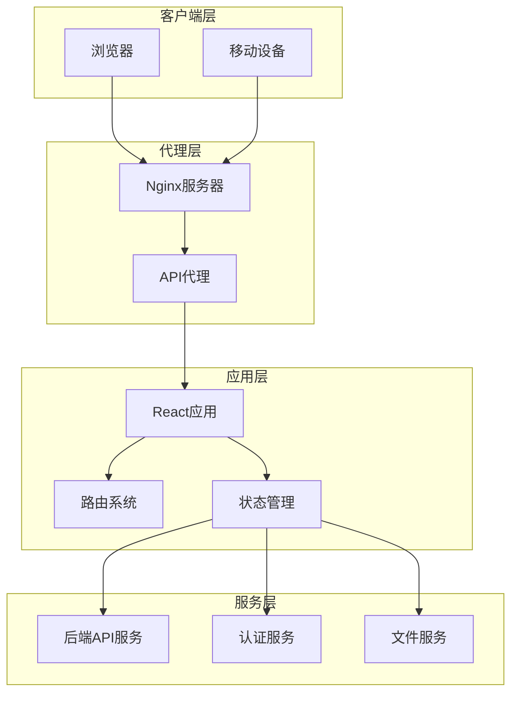

**图表来源**
- [Dockerfile](file://console/frontend/Dockerfile#L1-L81)
- [vite.config.js](file://console/frontend/vite.config.js#L1-L98)

## Docker容器化部署

### 多阶段构建流程

前端服务采用Docker多阶段构建策略，优化镜像大小和构建效率：

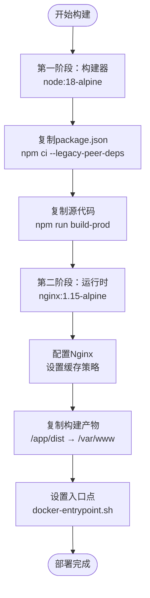

**图表来源**
- [Dockerfile](file://console/frontend/Dockerfile#L1-L81)

### 构建阶段详解

#### 第一阶段：构建器阶段
- **基础镜像**：`node:18-alpine`（轻量级Alpine Linux）
- **工作目录**：`/app`
- **依赖安装**：使用`npm ci`确保可重现的构建
- **缓存优化**：BuildKit缓存挂载加速
- **构建命令**：`npm run build-prod`

#### 第二阶段：运行时阶段
- **基础镜像**：`nginx:1.15-alpine`
- **标签信息**：版本、Git提交哈希、构建时间
- **端口配置**：默认监听`1881`端口
- **静态资源**：从构建阶段复制到`/var/www`

**章节来源**
- [Dockerfile](file://console/frontend/Dockerfile#L1-L81)

### 运行时配置

运行时容器通过`docker-entrypoint.sh`脚本动态生成运行时配置：

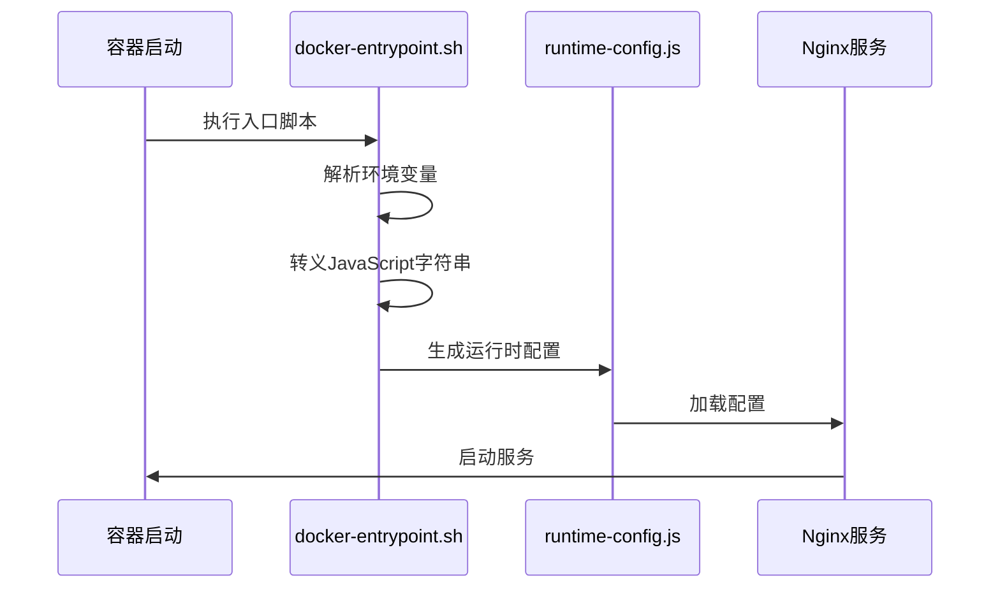

**图表来源**
- [docker-entrypoint.sh](file://console/frontend/docker-entrypoint.sh#L1-L32)

**章节来源**
- [docker-entrypoint.sh](file://console/frontend/docker-entrypoint.sh#L1-L32)

## Vite构建配置

### 构建优化策略

Vite配置针对生产环境进行了深度优化：

| 配置项 | 设置值 | 优化效果 |
|--------|--------|----------|
| `envPrefix` | `['CONSOLE_', 'VITE_']` | 环境变量前缀过滤 |
| `rollupOptions.maxParallelFileOps` | `1` | 限制并行文件操作防止内存溢出 |
| `commonjsOptions.strictRequires` | `true` | 强制CommonJS模块严格处理 |

### 开发服务器配置

开发环境提供了灵活的代理配置，支持多种后端服务：

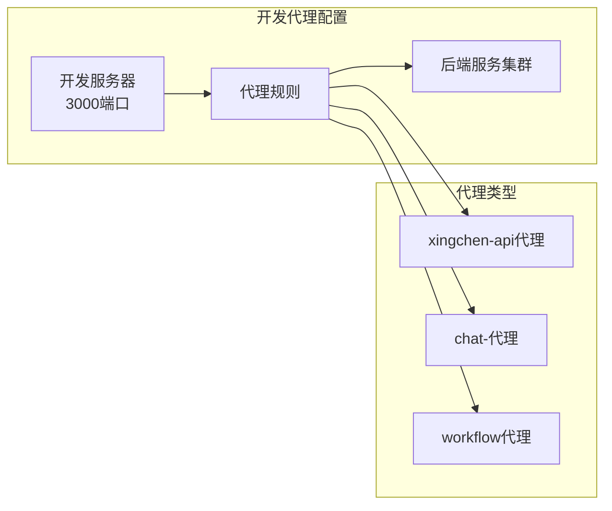

**图表来源**
- [vite.config.js](file://console/frontend/vite.config.js#L25-L75)

### TypeScript配置

项目采用严格的TypeScript配置确保代码质量：

| 配置项 | 值 | 作用 |
|--------|-----|------|
| `target` | `ES2020` | 目标JavaScript版本 |
| `module` | `ESNext` | 模块系统 |
| `strict` | `true` | 启用严格类型检查 |
| `jsx` | `react-jsx` | JSX转换方式 |
| `baseUrl` | `.` | 基础路径配置 |

**章节来源**
- [vite.config.js](file://console/frontend/vite.config.js#L1-L98)
- [tsconfig.json](file://console/frontend/tsconfig.json#L1-L44)

## Nginx服务器配置

### 生产环境Nginx配置

生产环境使用自定义Nginx配置，提供高性能的静态资源服务：

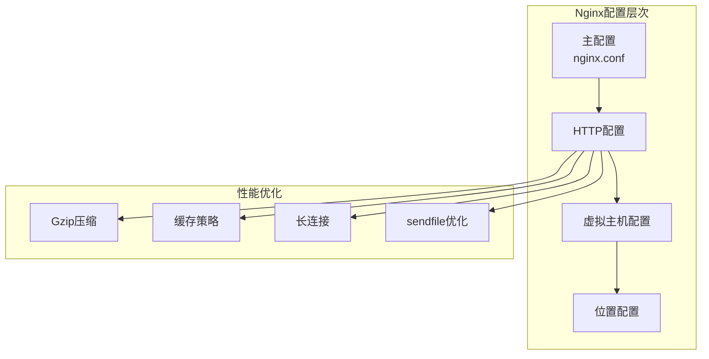

**图表来源**
- [Dockerfile](file://console/frontend/Dockerfile#L32-L70)

### 缓存策略配置

Nginx实现了精细化的缓存控制策略：

| 文件类型 | 缓存时间 | 配置位置 |
|----------|----------|----------|
| 图片文件 | 1年 | `location ~ .*\.(gif\|jpg\|jpeg\|png\|PNG\|bmp\|swf)` |
| CSS/JS文件 | 1年 | `location ~ .*\.(js\|css)?` |
| HTML文件 | 无缓存 | `location /` |
| API接口 | 无缓存 | `location ~ ^/(v1\|api)` |

### 性能优化配置

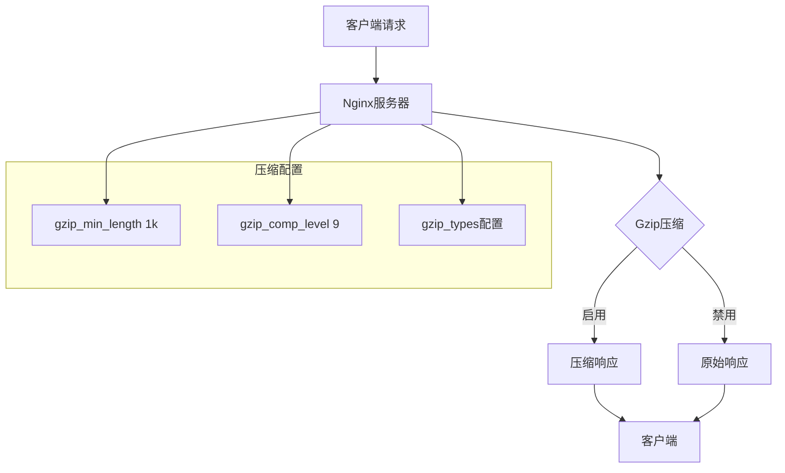

**图表来源**
- [Dockerfile](file://console/frontend/Dockerfile#L45-L55)

**章节来源**
- [Dockerfile](file://console/frontend/Dockerfile#L32-L70)
- [nginx.conf](file://console/frontend/nginx.conf#L1-L23)

## 环境变量管理

### 环境变量分类

前端服务支持多环境配置，通过环境变量实现灵活部署：

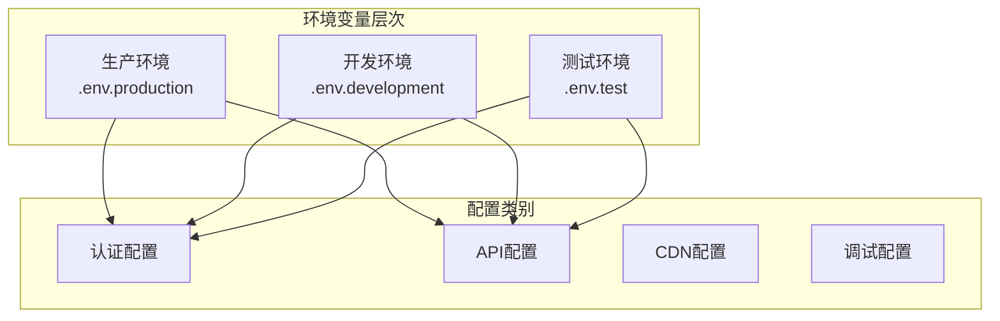

**图表来源**
- [.env.production](file://console/frontend/.env.production#L1-L20)
- [.env.development](file://console/frontend/.env.development#L1-L7)

### 认证配置

| 变量名 | 用途 | 示例值 |
|--------|------|--------|
| `CONSOLE_CASDOOR_URL` | Casdoor认证服务器地址 | `http://172.31.114.167:8000` |
| `CONSOLE_CASDOOR_ID` | 应用客户端ID | `1236b04f90e525239d35` |
| `CONSOLE_CASDOOR_APP` | 应用名称 | `astra-console-dev` |
| `CONSOLE_CASDOOR_ORG` | 组织名称 | `built-in` |

### API配置

| 变量名 | 用途 | 示例值 |
|--------|------|--------|
| `VITE_BASE_URL` | 主要API基础URL | `http://172.29.201.92:8080` |
| `CONSOLE_API_URL` | 兼容旧版本API地址 | 空值（使用VITE_BASE_URL） |

**章节来源**
- [.env.production](file://console/frontend/.env.production#L1-L20)
- [.env.development](file://console/frontend/.env.development#L1-L7)

## 静态资源优化

### 构建输出优化

Vite构建过程实现了多项优化措施：

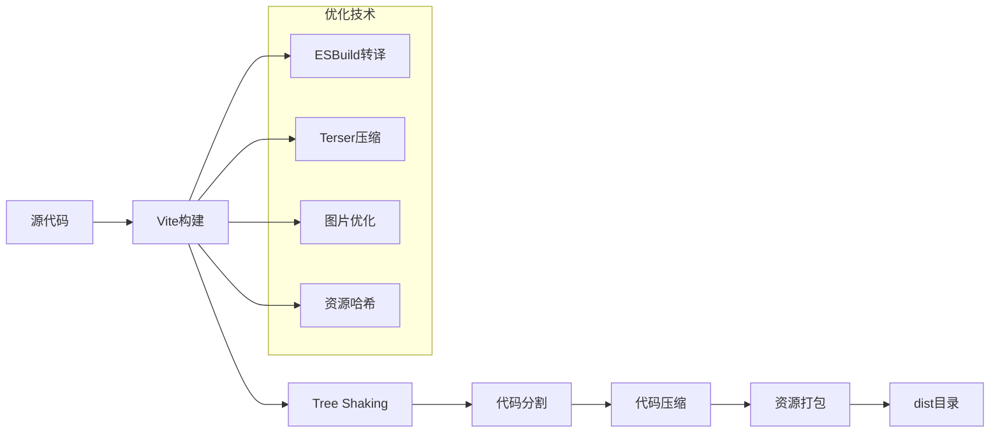

### 资源加载优化

项目集成了多种资源优化技术：

| 优化技术 | 实现方式 | 效果 |
|----------|----------|------|
| 代码分割 | Vite自动分割 | 减少初始加载时间 |
| 资源哈希 | 自动生成文件名 | 缓存失效控制 |
| 图片优化 | 自动压缩处理 | 减少传输体积 |
| 字体预加载 | 关键字体优先加载 | 提升渲染性能 |

### Tailwind CSS优化

项目使用Tailwind CSS框架，通过以下配置实现按需加载：

```mermaid
graph LR
subgraph "Tailwind配置"
Content[内容扫描<br/>./src/**/*.{js,ts,tsx}]
Theme[主题配置<br/>颜色、断点]
Plugins[插件系统]
end
Content --> Purge[PurgeCSS清理]
Theme --> Responsive[响应式设计]
Plugins --> Customization[自定义扩展]
Purge --> OptimizedCSS[优化后的CSS]
Responsive --> MobileFirst[移动端优先]
Customization --> BrandColors[品牌色彩]
```

**图表来源**
- [tailwind.config.js](file://console/frontend/tailwind.config.js#L1-L40)

**章节来源**
- [package.json](file://console/frontend/package.json#L1-L137)
- [tailwind.config.js](file://console/frontend/tailwind.config.js#L1-L40)

## API代理配置

### 开发环境代理

Vite开发服务器提供了灵活的API代理配置，支持多后端服务：

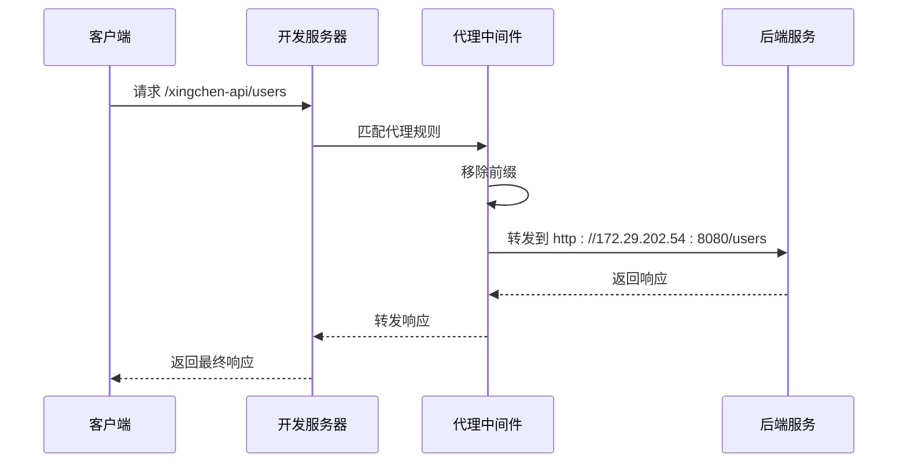

**图表来源**
- [vite.config.js](file://console/frontend/vite.config.js#L35-L55)

### 代理规则配置

| 代理路径 | 目标地址 | 功能说明 |
|----------|----------|----------|
| `/xingchen-api` | `http://172.29.202.54:8080` | 智能体相关API |
| `/chat-` | `http://172.29.201.92:8080` | 聊天服务API |
| `/workflow` | `http://172.29.201.92:8080` | 工作流服务API |

### 生产环境API配置

生产环境中通过运行时配置动态设置API地址：

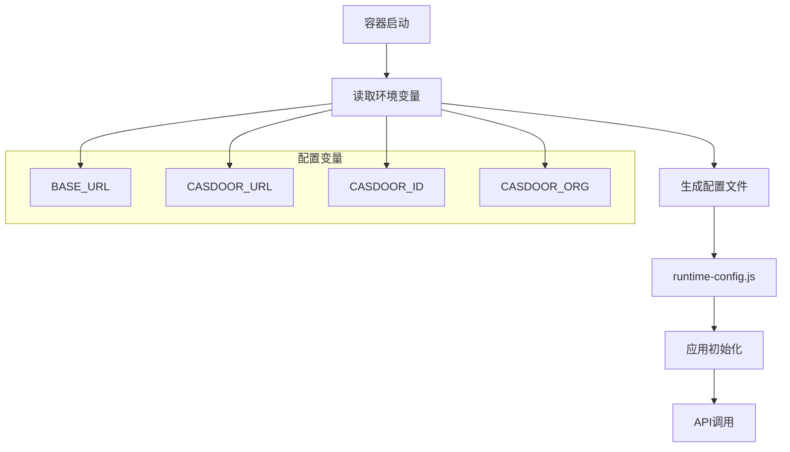

**图表来源**
- [docker-entrypoint.sh](file://console/frontend/docker-entrypoint.sh#L15-L25)

**章节来源**
- [vite.config.js](file://console/frontend/vite.config.js#L25-L75)
- [docker-entrypoint.sh](file://console/frontend/docker-entrypoint.sh#L1-L32)

## Kubernetes部署

### Deployment配置

项目提供了完整的Kubernetes部署配置：

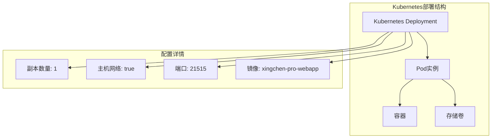

**图表来源**
- [deployment.yml](file://console/frontend/deployment.yml#L1-L39)

### 存储配置

| 卷类型 | 路径 | 用途 |
|--------|------|------|
| logs | `/log/aiaas/xingchen-pro-webapp` | 应用日志存储 |
| timezone | `/etc/localtime` | 时区同步 |

### 环境变量注入

部署配置支持动态环境变量注入：

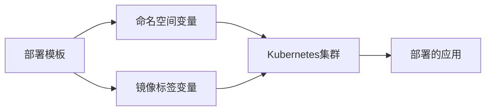

**图表来源**
- [deployment.yml](file://console/frontend/deployment.yml#L5-L6)

**章节来源**
- [deployment.yml](file://console/frontend/deployment.yml#L1-L39)

## HTTPS配置

### SSL证书配置

虽然当前配置主要针对HTTP，但可以轻松扩展为HTTPS支持：

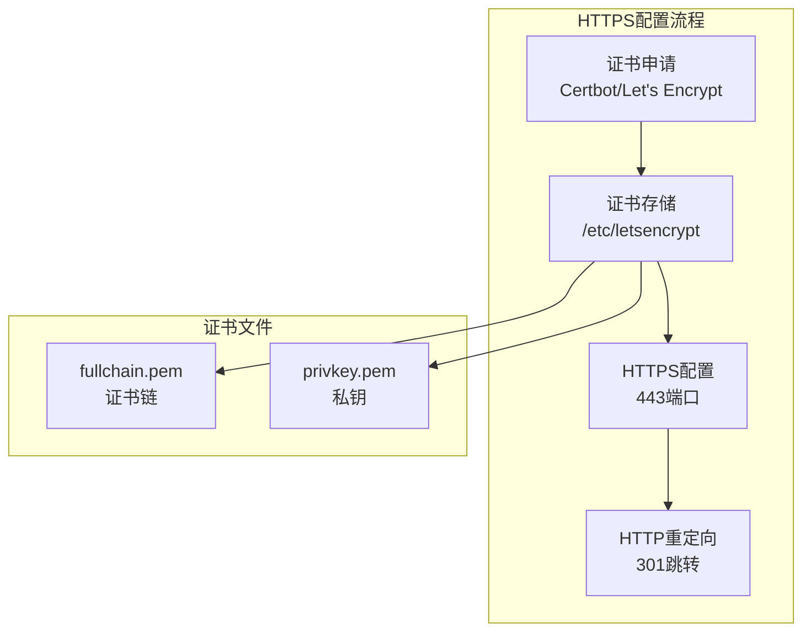

### 安全配置建议

| 安全措施 | 实现方式 | 重要性 |
|----------|----------|--------|
| HSTS头 | 启用HTTP严格传输安全 | 高 |
| CSP头 | 内容安全策略 | 高 |
| SSL重写 | 强制HTTPS访问 | 中 |
| 证书更新 | 自动化证书续期 | 中 |

### 性能优化配置

HTTPS配置包含多项性能优化：

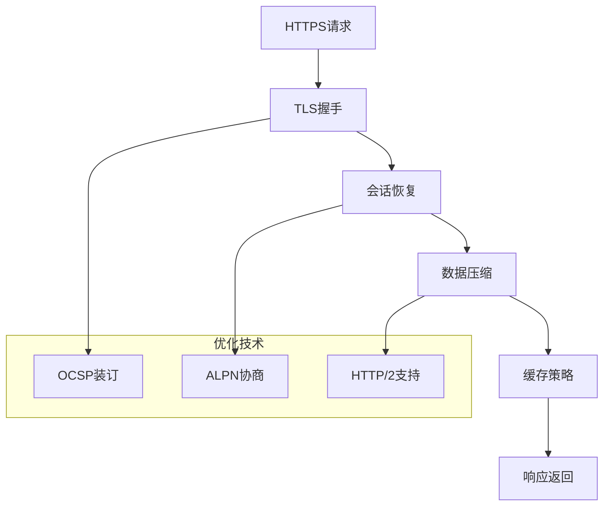

## CDN集成建议

### CDN架构设计

为了提升全球访问性能，建议集成CDN服务：

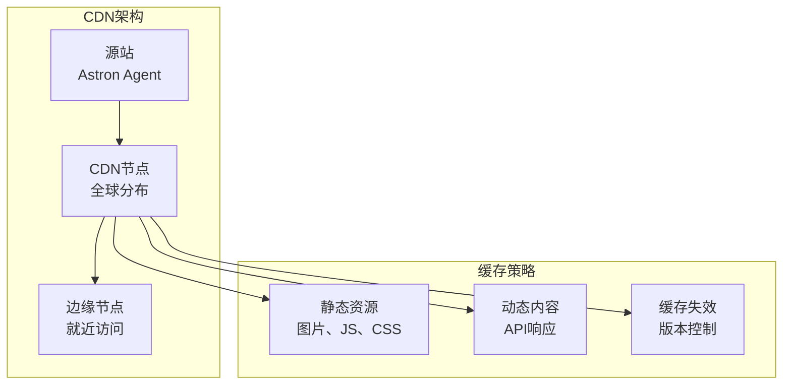

### 缓存策略实施

| 资源类型 | 缓存时间 | 更新策略 |
|----------|----------|----------|
| 静态资源 | 1年 | 版本号控制 |
| HTML页面 | 1小时 | 按需刷新 |
| API响应 | 5分钟 | 条件缓存 |
| 用户内容 | 30分钟 | 登录状态控制 |

### 性能监控

CDN集成后的性能监控指标：

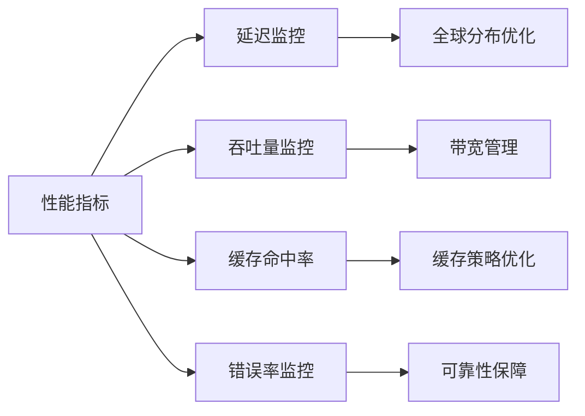

## 故障排除指南

### 常见问题诊断

#### 构建问题

| 问题症状 | 可能原因 | 解决方案 |
|----------|----------|----------|
| 依赖安装失败 | 网络连接问题 | 使用国内镜像源 |
| 构建内存不足 | 并行操作过多 | 调整`maxParallelFileOps` |
| 缓存问题 | npm缓存损坏 | 清理`.npm`缓存目录 |

#### 运行时问题

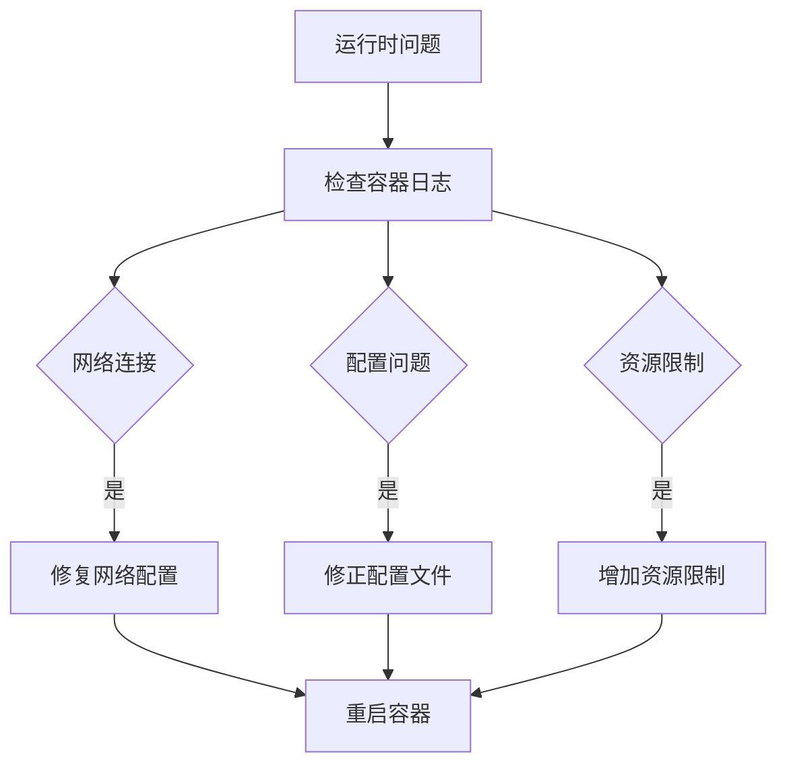

### 性能问题排查

#### 静态资源加载慢

1. **检查CDN配置**：确认CDN是否正确配置
2. **验证缓存策略**：检查HTTP缓存头设置
3. **分析网络延迟**：使用浏览器开发者工具
4. **优化资源大小**：启用Gzip压缩和图片优化

#### API响应慢

1. **检查代理配置**：验证后端服务可达性
2. **监控网络延迟**：测试不同地理位置的响应时间
3. **优化请求频率**：减少不必要的API调用
4. **启用请求合并**：批量处理多个小请求

### 日志分析

容器日志提供了详细的调试信息：

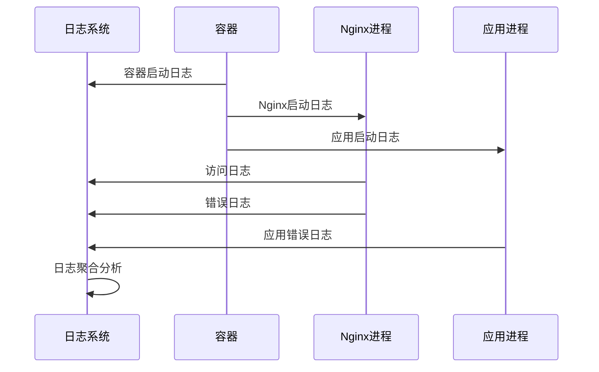

**章节来源**
- [Dockerfile](file://console/frontend/Dockerfile#L1-L81)
- [docker-entrypoint.sh](file://console/frontend/docker-entrypoint.sh#L1-L32)

## 总结

Astron Agent前端服务采用了现代化的部署架构，通过Docker容器化、Vite构建优化、Nginx高性能服务器配置，以及灵活的环境变量管理，实现了高效、可扩展的部署解决方案。

### 关键优势

1. **容器化部署**：标准化的Docker镜像构建和部署流程
2. **性能优化**：多层次的缓存策略和资源优化
3. **环境灵活性**：支持多环境配置和动态参数注入
4. **开发体验**：完善的代理配置和热重载支持
5. **运维友好**：清晰的日志记录和监控指标

### 最佳实践建议

- 定期更新依赖包以获得最新安全补丁
- 监控容器资源使用情况，及时调整资源配置
- 建立完善的CI/CD流水线，自动化部署流程
- 实施定期的安全审计和漏洞扫描
- 保持CDN配置的及时更新和优化

通过遵循本文档的指导原则和最佳实践，可以确保前端服务的稳定运行和持续优化。