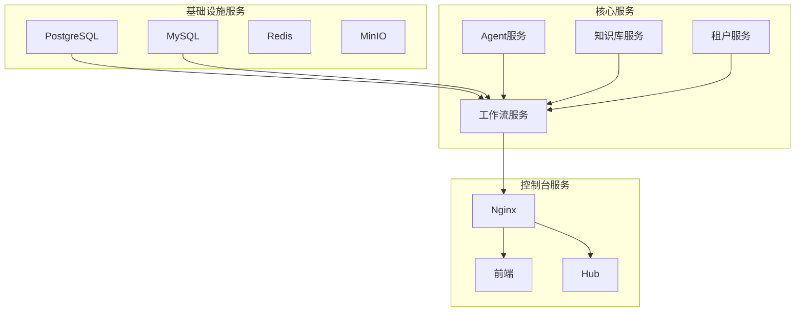
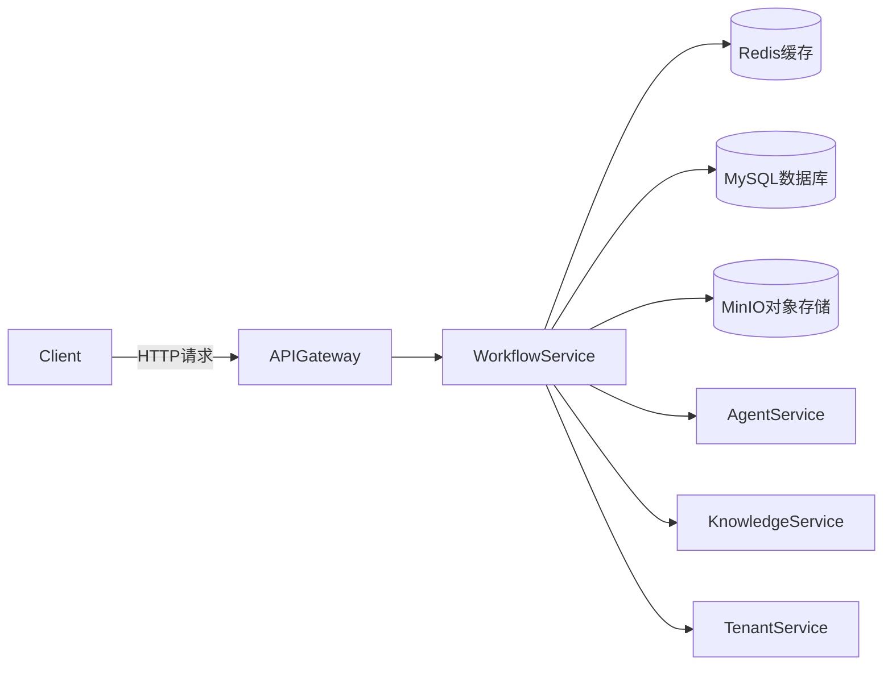
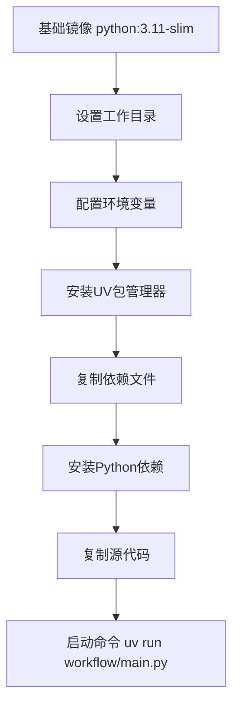
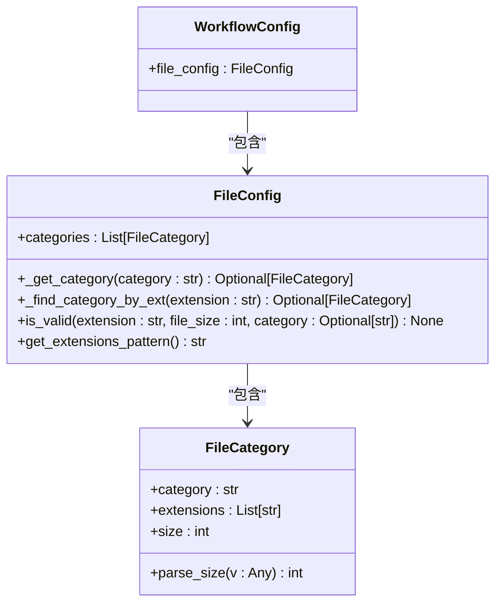
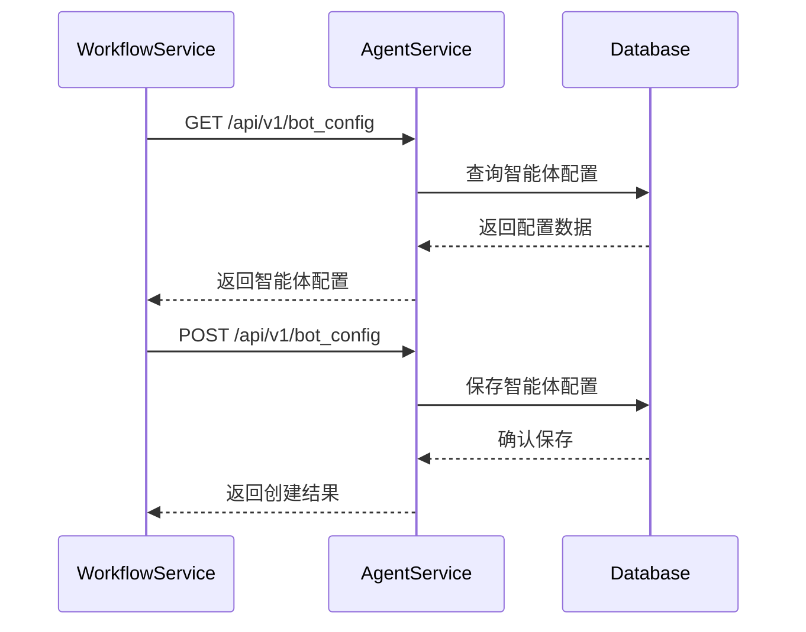
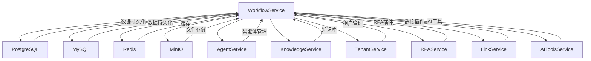

# 工作流服务部署

<cite>
**本文档引用的文件**   
- [Dockerfile](file://core/workflow/Dockerfile)
- [app_config.py](file://core/workflow/configs/app_config.py)
- [main.py](file://core/workflow/main.py)
- [engine.py](file://core/workflow/cache/engine.py)
- [docker-compose.yaml](file://docker/astronAgent/docker-compose.yaml)
- [dsl_engine.py](file://core/workflow/engine/dsl_engine.py)
</cite>

## 目录
1. [简介](#简介)
2. [项目结构](#项目结构)
3. [核心组件](#核心组件)
4. [架构概述](#架构概述)
5. [详细组件分析](#详细组件分析)
6. [依赖分析](#依赖分析)
7. [性能考虑](#性能考虑)
8. [故障排除指南](#故障排除指南)
9. [结论](#结论)

## 简介
本指南详细介绍了工作流服务的部署配置，包括Docker环境设置、Python依赖管理、服务启动命令、配置选项及其对服务行为的影响。同时描述了工作流服务与Agent服务的协同工作机制，提供了分布式部署建议和状态管理策略，并包含性能基准测试结果和扩展性规划。

## 项目结构
工作流服务位于`core/workflow`目录下，是astron-agent平台的核心组件之一。该服务通过Docker容器化部署，与其他核心服务（如Agent、Knowledge、Tenant等）协同工作，形成完整的智能体平台。



**Diagram sources**
- [docker-compose.yaml](file://docker/astronAgent/docker-compose.yaml)

**Section sources**
- [docker-compose.yaml](file://docker/astronAgent/docker-compose.yaml)

## 核心组件

工作流服务的核心组件包括：
- **Dockerfile**: 定义了服务的容器化环境和依赖
- **app_config.py**: 配置文件，定义了文件策略和工作流配置
- **main.py**: 服务的主入口，初始化FastAPI应用
- **engine.py**: 工作流引擎缓存管理
- **dsl_engine.py**: 工作流执行引擎

这些组件共同构成了工作流服务的基础架构，确保了服务的稳定运行和高效执行。

**Section sources**
- [Dockerfile](file://core/workflow/Dockerfile)
- [app_config.py](file://core/workflow/configs/app_config.py)
- [main.py](file://core/workflow/main.py)
- [engine.py](file://core/workflow/cache/engine.py)
- [dsl_engine.py](file://core/workflow/engine/dsl_engine.py)

## 架构概述

工作流服务采用微服务架构，通过FastAPI框架提供RESTful API接口。服务通过Redis缓存工作流引擎实例，提高执行效率。与Agent服务的协同工作通过HTTP API调用实现，确保了服务间的松耦合。



**Diagram sources**
- [main.py](file://core/workflow/main.py)
- [docker-compose.yaml](file://docker/astronAgent/docker-compose.yaml)

## 详细组件分析

### Docker配置分析
工作流服务的Docker配置基于`python:3.11-slim`基础镜像，通过UV包管理器安装依赖，确保了依赖的一致性和可重复性。



**Diagram sources**
- [Dockerfile](file://core/workflow/Dockerfile)

**Section sources**
- [Dockerfile](file://core/workflow/Dockerfile)

### 配置文件分析
`app_config.py`文件定义了文件策略和工作流配置，通过Pydantic模型进行类型验证，确保了配置的正确性。



**Diagram sources**
- [app_config.py](file://core/workflow/configs/app_config.py)

**Section sources**
- [app_config.py](file://core/workflow/configs/app_config.py)

### 服务协同机制
工作流服务与Agent服务通过预定义的API端点进行通信，实现了智能体的创建、管理和执行。



**Diagram sources**
- [main.py](file://core/workflow/main.py)
- [docker-compose.yaml](file://docker/astronAgent/docker-compose.yaml)

**Section sources**
- [main.py](file://core/workflow/main.py)
- [docker-compose.yaml](file://docker/astronAgent/docker-compose.yaml)

## 依赖分析

工作流服务依赖于多个基础设施服务和核心服务，通过Docker Compose进行统一管理。



**Diagram sources**
- [docker-compose.yaml](file://docker/astronAgent/docker-compose.yaml)

**Section sources**
- [docker-compose.yaml](file://docker/astronAgent/docker-compose.yaml)

## 性能考虑

工作流服务通过多种机制优化性能，包括缓存、异步处理和分布式部署。

### 缓存策略
工作流引擎实例通过Redis缓存，缓存键包含时间戳，确保每小时更新一次缓存。

```python
ENGINE_CACHE_PREFIX = f'sparkflowV2:flow_engine:{datetime.utcnow().strftime("%Y%m%d%H")}'
ENGINE_CACHE_EXPIRE_TIME = 60 * 30  # 30分钟过期
```

### 异步处理
使用asyncio实现异步处理，提高并发性能。

```python
async def execute_node(self, node: SparkFlowEngineNode, engine_ctx: WorkflowEngineCtx, span: Span) -> NodeRunResult:
    engine_ctx.node_run_status[node.node_id].processing.set()
    return await node.async_call(
        variable_pool=engine_ctx.variable_pool,
        callbacks=engine_ctx.callback,
        span=span,
        iteration_engine=engine_ctx.iteration_engine,
        event_log_trace=engine_ctx.event_log_trace,
        msg_or_end_node_deps=engine_ctx.msg_or_end_node_deps,
        node_run_status=engine_ctx.node_run_status,
        chains=engine_ctx.chains,
        built_nodes=engine_ctx.built_nodes,
    )
```

### 分布式部署
通过Docker Compose实现分布式部署，各服务独立运行，通过网络通信。

**Section sources**
- [engine.py](file://core/workflow/cache/engine.py)
- [dsl_engine.py](file://core/workflow/engine/dsl_engine.py)
- [docker-compose.yaml](file://docker/astronAgent/docker-compose.yaml)

## 故障排除指南

### 常见问题
1. **服务启动失败**: 检查依赖服务是否正常运行，特别是数据库和Redis。
2. **API调用超时**: 检查网络连接和防火墙设置。
3. **缓存失效**: 检查Redis服务状态和连接配置。

### 监控指标
工作流服务通过OTLP提供监控指标，包括请求延迟、错误率和缓存命中率。

**Section sources**
- [main.py](file://core/workflow/main.py)
- [engine.py](file://core/workflow/cache/engine.py)

## 结论
工作流服务作为astron-agent平台的核心组件，通过容器化部署和微服务架构，实现了高可用性和可扩展性。通过合理的配置和优化，能够满足大规模智能体平台的需求。建议在生产环境中采用分布式部署，确保服务的稳定性和性能。