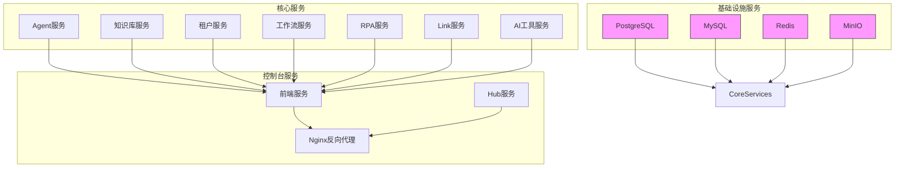
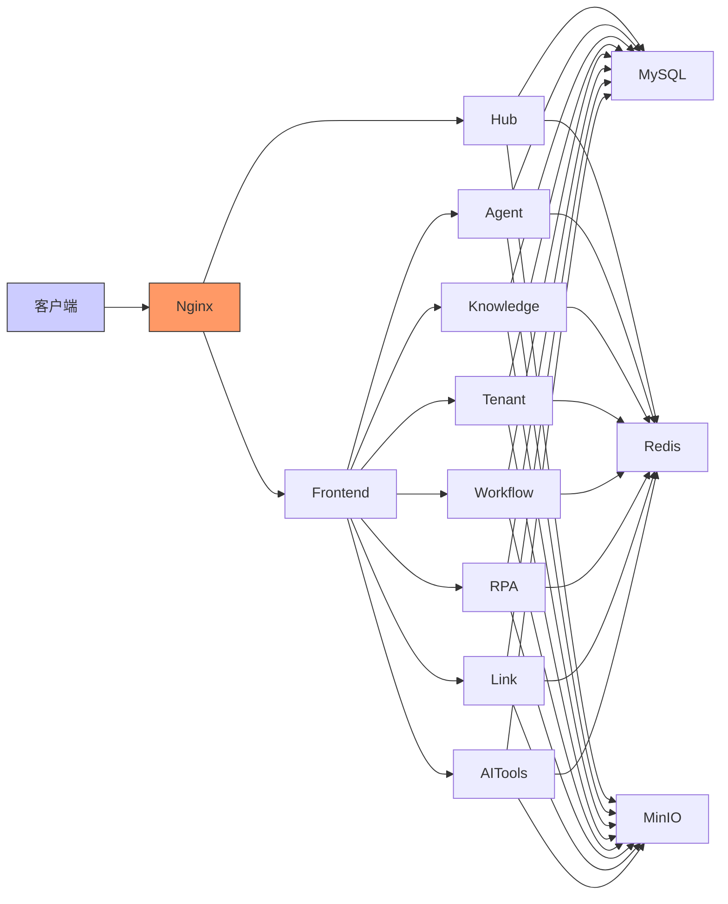
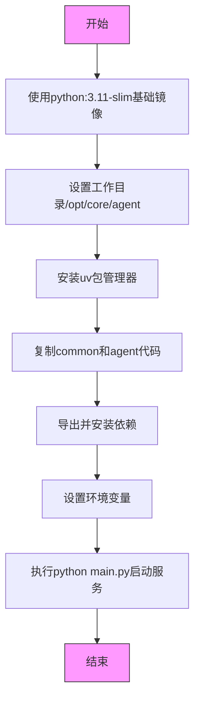
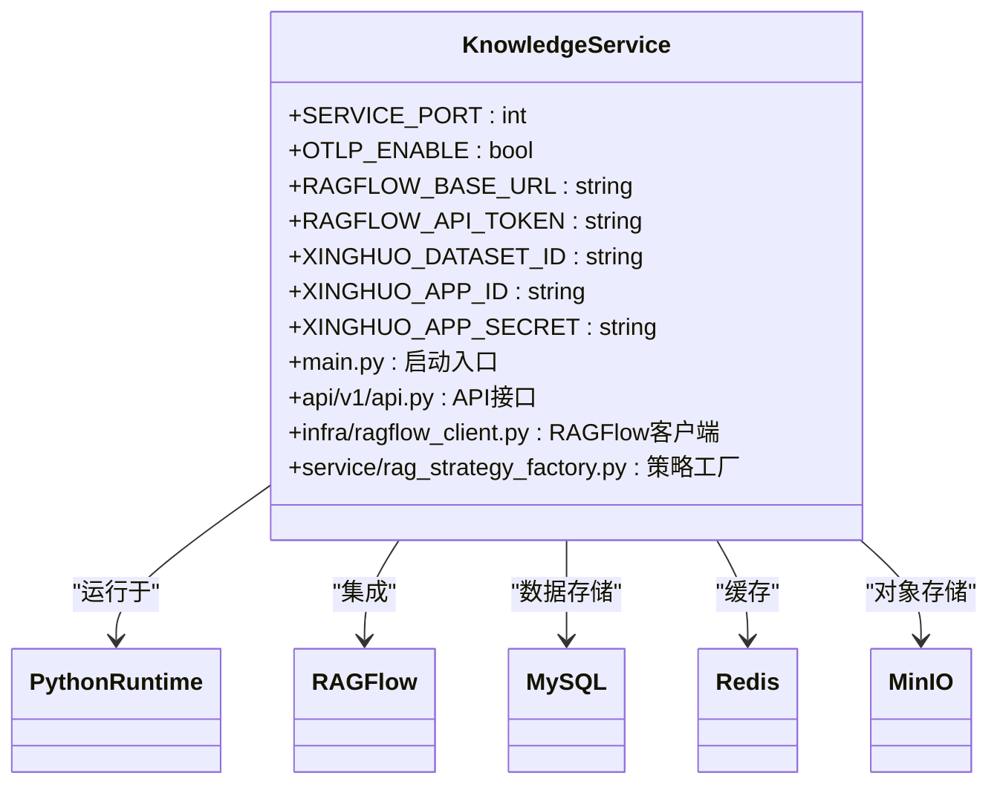
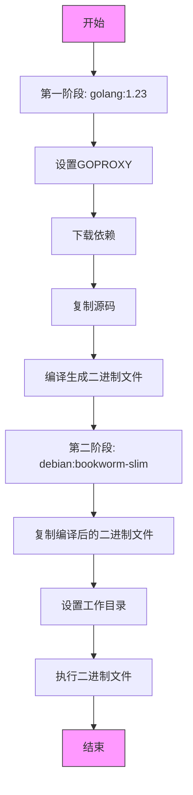
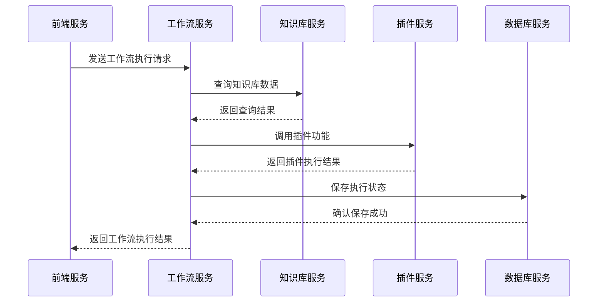
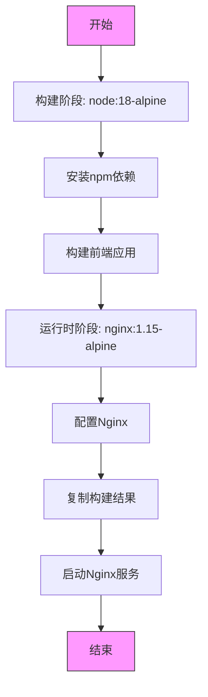
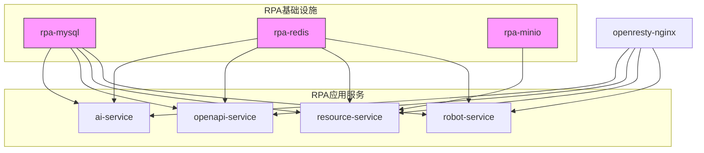
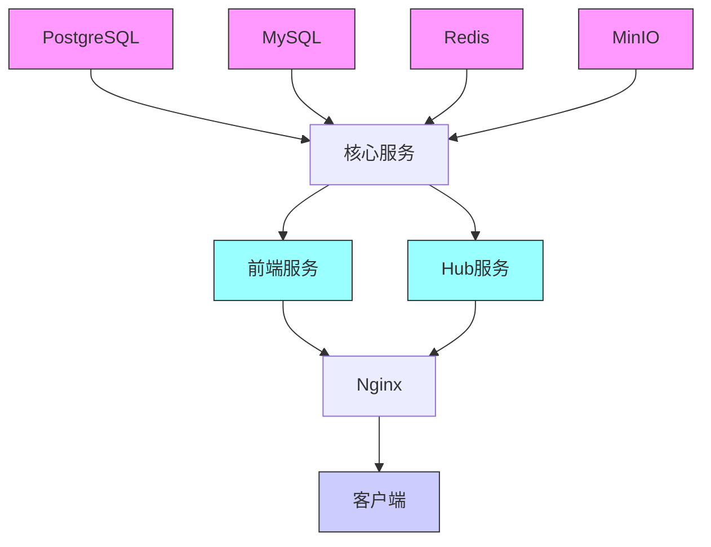

# 服务部署

<cite>
**本文档引用的文件**  
- [docker-compose.yaml](file://docker/astronAgent/docker-compose.yaml)
- [Dockerfile](file://console/frontend/Dockerfile)
- [Dockerfile](file://core/agent/Dockerfile)
- [Dockerfile](file://core/knowledge/Dockerfile)
- [Dockerfile](file://core/tenant/Dockerfile)
- [Dockerfile](file://core/workflow/Dockerfile)
- [Dockerfile](file://core/plugin/rpa/Dockerfile)
- [Dockerfile](file://console/backend/hub/Dockerfile)
- [docker-compose.yml](file://docker/astronAgent/astronRPA/docker-compose.yml)
- [main.py](file://core/plugin/rpa/main.py)
- [config.toml](file://docker/astronAgent/config/tenant/config.toml)
- [config.env.example](file://core/agent/config.env.example)
- [deployment.yml](file://console/frontend/deployment.yml)
- [docker-entrypoint.sh](file://console/frontend/docker-entrypoint.sh)
</cite>

## 目录
1. [简介](#简介)
2. [项目结构](#项目结构)
3. [核心组件](#核心组件)
4. [架构概述](#架构概述)
5. [详细组件分析](#详细组件分析)
6. [依赖分析](#依赖分析)
7. [性能考虑](#性能考虑)
8. [故障排除指南](#故障排除指南)
9. [结论](#结论)

## 简介
本文档提供了astron-agent项目中各个微服务的详细部署指南。文档详细说明了Agent服务、知识库服务、租户服务、工作流服务和前端服务的Docker镜像构建过程，分析了各Dockerfile中的关键配置（基础镜像、依赖安装、端口暴露、启动命令）。文档描述了多服务协同部署的流程，特别是RPA服务在astronRPA目录下的特殊部署要求。提供了服务启动顺序建议和依赖关系说明，并包含部署验证方法，确保各服务正常运行并能相互通信。

## 项目结构
本项目采用微服务架构，包含多个独立的服务组件，每个组件都有自己的Dockerfile用于构建和部署。项目结构分为核心服务、控制台服务和基础设施服务。核心服务包括Agent、知识库、租户、工作流等服务，控制台服务包括前端和后端Hub服务，基础设施服务包括数据库、缓存、消息队列等。

**图源**
- [docker-compose.yaml](file://docker/astronAgent/docker-compose.yaml)

**本节来源**
- [docker-compose.yaml](file://docker/astronAgent/docker-compose.yaml)

## 核心组件
本项目的核心组件包括Agent服务、知识库服务、租户服务、工作流服务、RPA服务、Link服务和AI工具服务。这些服务通过Docker容器化部署，每个服务都有独立的配置文件和依赖关系。服务之间通过环境变量和网络配置进行通信，确保了服务的解耦和可扩展性。

**本节来源**
- [docker-compose.yaml](file://docker/astronAgent/docker-compose.yaml)
- [Dockerfile](file://core/agent/Dockerfile)
- [Dockerfile](file://core/knowledge/Dockerfile)
- [Dockerfile](file://core/tenant/Dockerfile)
- [Dockerfile](file://core/workflow/Dockerfile)

## 架构概述
本项目的架构采用微服务模式，所有服务通过Docker Compose进行编排和管理。基础设施服务（PostgreSQL、MySQL、Redis、MinIO）为所有核心服务提供数据存储和缓存功能。核心服务通过REST API和消息队列进行通信，前端服务通过Nginx反向代理对外提供服务。服务之间的依赖关系通过docker-compose.yaml文件中的depends_on字段定义，确保服务按正确的顺序启动。

**图源**
- [docker-compose.yaml](file://docker/astronAgent/docker-compose.yaml)

**本节来源**
- [docker-compose.yaml](file://docker/astronAgent/docker-compose.yaml)

## 详细组件分析
### Agent服务分析
Agent服务是系统的核心组件之一，负责处理智能代理相关的业务逻辑。该服务使用Python 3.11作为基础镜像，通过uv工具管理依赖包。服务配置文件通过挂载方式从主机复制到容器中，确保配置的灵活性和安全性。

**图源**
- [Dockerfile](file://core/agent/Dockerfile)

**本节来源**
- [Dockerfile](file://core/agent/Dockerfile)
- [config.env.example](file://core/agent/config.env.example)

### 知识库服务分析
知识库服务负责管理系统的知识数据，使用Python 3.11作为基础镜像。该服务通过uv sync命令安装依赖，使用清华大学PyPI镜像源加速下载。服务配置通过环境变量和配置文件进行管理，支持与RAGFlow等外部知识库系统集成。

**图源**
- [Dockerfile](file://core/knowledge/Dockerfile)

**本节来源**
- [Dockerfile](file://core/knowledge/Dockerfile)
- [config.env](file://core/knowledge/config.env)

### 租户服务分析
租户服务使用Go语言开发，采用多阶段Docker构建策略。第一阶段使用golang:1.23镜像进行编译，第二阶段使用轻量级的debian:bookworm-slim镜像运行编译后的二进制文件。这种构建方式既保证了编译环境的完整性，又减少了最终镜像的大小。

**图源**
- [Dockerfile](file://core/tenant/Dockerfile)

**本节来源**
- [Dockerfile](file://core/tenant/Dockerfile)
- [config.toml](file://docker/astronAgent/config/tenant/config.toml)

### 工作流服务分析
工作流服务是系统的核心业务引擎，负责管理和执行各种工作流。该服务使用Python 3.11作为基础镜像，通过uv sync命令安装依赖。服务支持与多个外部系统集成，包括知识库、插件、数据库等，通过环境变量配置各系统的访问地址。

**图源**
- [Dockerfile](file://core/workflow/Dockerfile)

**本节来源**
- [Dockerfile](file://core/workflow/Dockerfile)
- [config.env](file://core/workflow/config.env)

### 前端服务分析
前端服务使用Node.js构建，采用多阶段Docker构建策略。第一阶段使用node:18-alpine镜像进行前端构建，第二阶段使用nginx:1.15-alpine镜像作为运行时环境。构建过程中使用npm ci确保依赖的可重现性，最终将构建好的静态资源部署到Nginx服务器。

**图源**
- [Dockerfile](file://console/frontend/Dockerfile)

**本节来源**
- [Dockerfile](file://console/frontend/Dockerfile)
- [docker-entrypoint.sh](file://console/frontend/docker-entrypoint.sh)

### RPA服务分析
RPA服务在astronRPA目录下有独立的部署要求，使用专门的docker-compose.yml文件进行编排。该服务包含多个子服务，如ai-service、openapi-service、resource-service和robot-service，每个服务都有独立的配置和依赖。RPA服务使用MySQL、Redis和MinIO作为基础设施，通过OpenResty Nginx进行反向代理。

**图源**
- [docker-compose.yml](file://docker/astronAgent/astronRPA/docker-compose.yml)

**本节来源**
- [docker-compose.yml](file://docker/astronAgent/astronRPA/docker-compose.yml)
- [main.py](file://core/plugin/rpa/main.py)

## 依赖分析
本项目的各个服务之间存在复杂的依赖关系。基础设施服务（PostgreSQL、MySQL、Redis、MinIO）是所有核心服务的依赖。核心服务之间通过REST API进行通信，形成服务调用链。前端服务依赖所有核心服务，通过Nginx反向代理对外提供统一的访问入口。

**图源**
- [docker-compose.yaml](file://docker/astronAgent/docker-compose.yaml)

**本节来源**
- [docker-compose.yaml](file://docker/astronAgent/docker-compose.yaml)
- [Makefile](file://Makefile)

## 性能考虑
在部署本项目时，需要考虑多个性能因素。首先，数据库服务（PostgreSQL和MySQL）需要足够的内存和CPU资源，特别是在高并发场景下。其次，Redis作为缓存服务，其性能直接影响整个系统的响应速度。MinIO作为对象存储服务，需要足够的磁盘I/O性能。对于核心服务，建议根据实际负载调整服务实例数量和资源配额。

## 故障排除指南
在部署过程中可能遇到的常见问题包括：服务启动失败、数据库连接错误、配置文件缺失等。对于服务启动失败，应首先检查日志文件，确认错误原因。对于数据库连接错误，应检查数据库服务是否正常运行，以及连接参数是否正确。对于配置文件缺失，应确保所有必需的配置文件都已正确挂载到容器中。

**本节来源**
- [docker-compose.yaml](file://docker/astronAgent/docker-compose.yaml)
- [config.env.example](file://core/agent/config.env.example)

## 结论
本文档详细介绍了astron-agent项目中各个微服务的部署方法。通过Docker和Docker Compose，可以方便地部署和管理整个系统。各服务采用独立的Dockerfile进行构建，确保了构建过程的可重复性和一致性。通过合理的依赖管理和启动顺序配置，确保了系统的稳定运行。建议在生产环境中根据实际负载调整资源配置，并定期监控系统性能。